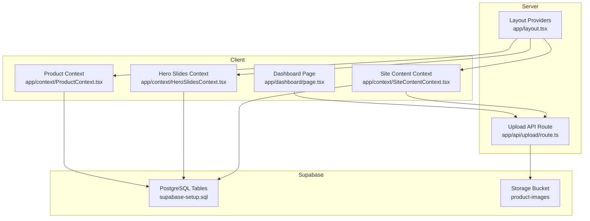
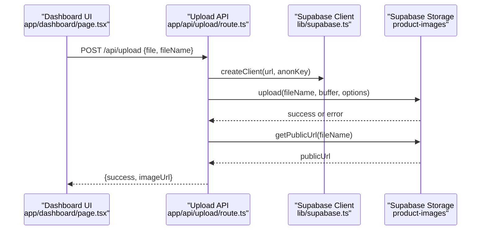
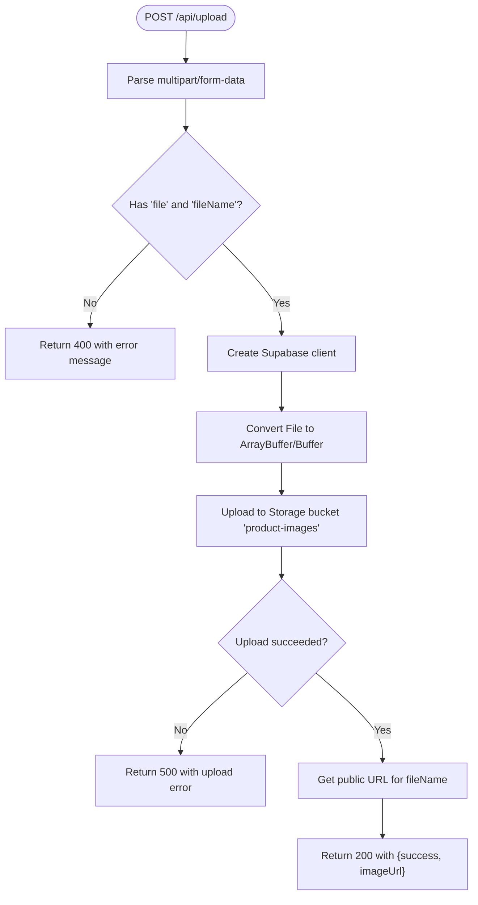
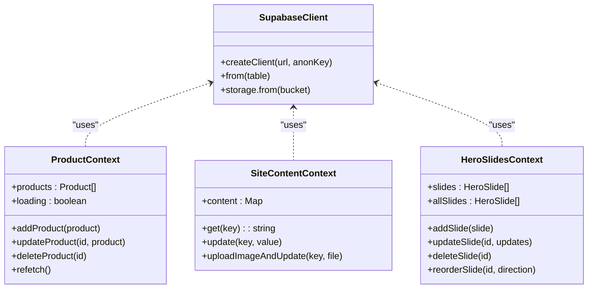
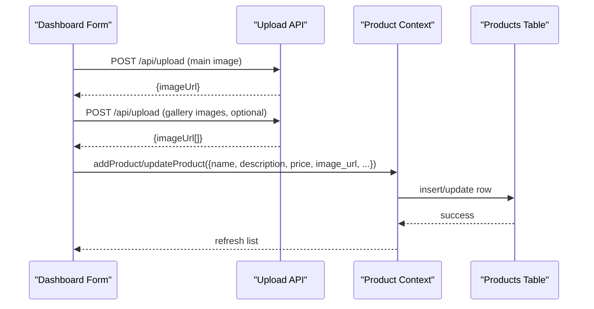
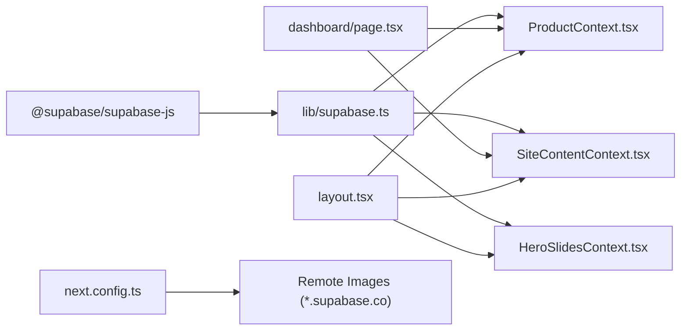

# API Integration

<cite>
**Referenced Files in This Document**
- [route.ts](file://app/api/upload/route.ts)
- [supabase.ts](file://lib/supabase.ts)
- [ProductContext.tsx](file://app/context/ProductContext.tsx)
- [SiteContentContext.tsx](file://app/context/SiteContentContext.tsx)
- [HeroSlidesContext.tsx](file://app/context/HeroSlidesContext.tsx)
- [dashboard/page.tsx](file://app/dashboard/page.tsx)
- [layout.tsx](file://app/layout.tsx)
- [next.config.ts](file://next.config.ts)
- [supabase-setup.sql](file://supabase-setup.sql)
- [package.json](file://package.json)
- [README.md](file://README.md)
</cite>

## Table of Contents
1. [Introduction](#introduction)
2. [Project Structure](#project-structure)
3. [Core Components](#core-components)
4. [Architecture Overview](#architecture-overview)
5. [Detailed Component Analysis](#detailed-component-analysis)
6. [Dependency Analysis](#dependency-analysis)
7. [Performance Considerations](#performance-considerations)
8. [Troubleshooting Guide](#troubleshooting-guide)
9. [Conclusion](#conclusion)
10. [Appendices](#appendices)

## Introduction
This document provides API integration documentation for the Nubia Perfume E-Commerce Platform, focusing on:
- The file upload endpoint used to store images in Supabase Storage and return public URLs.
- Supabase client configuration, connection handling, real-time subscriptions, query patterns, and data transformation.
- Security considerations, rate limiting guidance, versioning notes, common use cases, client implementation guidelines, performance optimization tips, debugging tools, and monitoring approaches.

The platform is built with Next.js (App Router) and uses Supabase for PostgreSQL and Storage.

## Project Structure
Key areas relevant to API integrations:
- Server-side API route for uploads: app/api/upload/route.ts
- Shared Supabase client and storage bucket constant: lib/supabase.ts
- Client contexts that perform database queries and real-time subscriptions:
  - Product management: app/context/ProductContext.tsx
  - Site content management and image uploads via the API route: app/context/SiteContentContext.tsx
  - Hero slides management: app/context/HeroSlidesContext.tsx
- Dashboard UI orchestrating uploads and product updates: app/dashboard/page.tsx
- Global layout providers: app/layout.tsx
- Image remote domain allowlist: next.config.ts
- Database schema and policies: supabase-setup.sql
- Dependencies and scripts: package.json
- Setup instructions and environment variables: README.md

**Diagram sources**
- [dashboard/page.tsx:152-233](file://app/dashboard/page.tsx#L152-L233)
- [SiteContentContext.tsx:72-96](file://app/context/SiteContentContext.tsx#L72-L96)
- [ProductContext.tsx:49-82](file://app/context/ProductContext.tsx#L49-L82)
- [HeroSlidesContext.tsx:161-182](file://app/context/HeroSlidesContext.tsx#L161-L182)
- [route.ts:1-67](file://app/api/upload/route.ts#L1-L67)
- [supabase-setup.sql:6-37](file://supabase-setup.sql#L6-L37)

**Section sources**
- [layout.tsx:57-82](file://app/layout.tsx#L57-L82)
- [next.config.ts:3-16](file://next.config.ts#L3-L16)
- [supabase-setup.sql:6-37](file://supabase-setup.sql#L6-L37)

## Core Components
- Upload API Route: Accepts multipart/form-data with fields file and fileName, uploads to Supabase Storage bucket product-images, and returns a JSON response containing success and imageUrl.
- Supabase Client: Centralized client creation with environment variable validation and fallback credentials; exports STORAGE_BUCKET constant.
- Product Context: Fetches products, inserts/updates/deletes rows, and subscribes to real-time changes on the products table.
- Site Content Context: Loads site_content key-value pairs, supports optimistic updates, and uploads images via the Upload API route then persists the URL.
- Hero Slides Context: Manages hero_slides CRUD operations and ordering.

**Section sources**
- [route.ts:4-66](file://app/api/upload/route.ts#L4-L66)
- [supabase.ts:1-46](file://lib/supabase.ts#L1-L46)
- [ProductContext.tsx:45-116](file://app/context/ProductContext.tsx#L45-L116)
- [SiteContentContext.tsx:22-110](file://app/context/SiteContentContext.tsx#L22-L110)
- [HeroSlidesContext.tsx:157-290](file://app/context/HeroSlidesContext.tsx#L157-L290)

## Architecture Overview
The application follows a hybrid architecture:
- Client-side contexts interact directly with Supabase for database reads/writes and real-time subscriptions.
- File uploads are routed through a server-side API to avoid CORS issues and centralize storage logic.
- The dashboard orchestrates multi-step workflows: upload main image, optionally upload gallery images, then persist product metadata to the database.

**Diagram sources**
- [dashboard/page.tsx:158-173](file://app/dashboard/page.tsx#L158-L173)
- [route.ts:4-66](file://app/api/upload/route.ts#L4-L66)
- [supabase.ts:27-41](file://lib/supabase.ts#L27-L41)

## Detailed Component Analysis

### Upload API Endpoint
- Method: POST
- Path: /api/upload
- Authentication: None at the route level; relies on Supabase Storage RLS and bucket permissions.
- Request:
  - Content-Type: multipart/form-data
  - Fields:
    - file: binary file
    - fileName: string (unique name including extension)
- Response:
  - Success: JSON object with success boolean and imageUrl string
  - Error: JSON object with error message and appropriate HTTP status codes
- Status Codes:
  - 200 OK on successful upload
  - 400 Bad Request if required fields are missing
  - 500 Internal Server Error for upload failures or unexpected errors

**Diagram sources**
- [route.ts:4-66](file://app/api/upload/route.ts#L4-L66)

**Section sources**
- [route.ts:4-66](file://app/api/upload/route.ts#L4-L66)

### Supabase Integration
- Connection Handling:
  - Environment variables NEXT_PUBLIC_SUPABASE_URL and NEXT_PUBLIC_SUPABASE_ANON_KEY are validated.
  - Fallback values are used when placeholders or invalid configurations are detected.
  - A single exported supabase client instance is created and reused across contexts.
- Real-time Subscriptions:
  - Product context subscribes to postgres_changes events on the products table to refresh data automatically.
- Query Patterns:
  - Products: select all ordered by created_at desc; insert/update/delete by id.
  - Site Content: upsert key-value pairs; fetch all keys/values.
  - Hero Slides: select ordered by sort_order; insert/update/delete/reorder via sort_order swaps.
- Data Transformation:
  - Site content maps raw rows into a key-value map with defaults.
  - Hero slides filter active entries and sort by order.

**Diagram sources**
- [supabase.ts:1-46](file://lib/supabase.ts#L1-L46)
- [ProductContext.tsx:45-116](file://app/context/ProductContext.tsx#L45-L116)
- [SiteContentContext.tsx:22-110](file://app/context/SiteContentContext.tsx#L22-L110)
- [HeroSlidesContext.tsx:157-290](file://app/context/HeroSlidesContext.tsx#L157-L290)

**Section sources**
- [supabase.ts:1-46](file://lib/supabase.ts#L1-L46)
- [ProductContext.tsx:49-82](file://app/context/ProductContext.tsx#L49-L82)
- [SiteContentContext.tsx:27-96](file://app/context/SiteContentContext.tsx#L27-L96)
- [HeroSlidesContext.tsx:161-265](file://app/context/HeroSlidesContext.tsx#L161-L265)

### Dashboard Workflow (Add/Edit Product)
- Steps:
  - Validate form inputs.
  - Upload main image via POST /api/upload.
  - Optionally upload additional gallery images via multiple POST /api/upload calls.
  - Persist product metadata to the products table using the Product context.
  - Show user feedback and reset form state.

**Diagram sources**
- [dashboard/page.tsx:152-233](file://app/dashboard/page.tsx#L152-L233)
- [ProductContext.tsx:84-100](file://app/context/ProductContext.tsx#L84-L100)

**Section sources**
- [dashboard/page.tsx:152-233](file://app/dashboard/page.tsx#L152-L233)
- [ProductContext.tsx:84-100](file://app/context/ProductContext.tsx#L84-L100)

## Dependency Analysis
- External dependencies:
  - @supabase/supabase-js for database and storage access.
  - Next.js App Router for server routes and client components.
- Internal dependencies:
  - Dashboard depends on ProductContext and SiteContentContext.
  - Contexts depend on the shared Supabase client.
  - Layout wraps providers to initialize contexts globally.
  - Next config allows remote images from *.supabase.co.

**Diagram sources**
- [package.json:11-16](file://package.json#L11-L16)
- [supabase.ts:1-46](file://lib/supabase.ts#L1-L46)
- [ProductContext.tsx:1-116](file://app/context/ProductContext.tsx#L1-L116)
- [SiteContentContext.tsx:1-110](file://app/context/SiteContentContext.tsx#L1-L110)
- [HeroSlidesContext.tsx:1-290](file://app/context/HeroSlidesContext.tsx#L1-L290)
- [layout.tsx:57-82](file://app/layout.tsx#L57-L82)
- [next.config.ts:3-16](file://next.config.ts#L3-L16)

**Section sources**
- [package.json:11-16](file://package.json#L11-L16)
- [next.config.ts:3-16](file://next.config.ts#L3-L16)

## Performance Considerations
- Use server-side upload route to avoid browser CORS restrictions and simplify client code.
- Batch operations where possible (e.g., uploading multiple gallery images sequentially).
- Leverage real-time subscriptions to minimize polling and keep UI in sync.
- Optimize image sizes before upload to reduce bandwidth and storage costs.
- Allowlist only necessary remote domains for Next.js image optimization.

[No sources needed since this section provides general guidance]

## Troubleshooting Guide
- Missing or placeholder environment variables:
  - The Supabase client logs an informational message when placeholders or invalid values are detected and falls back to default credentials.
  - Ensure NEXT_PUBLIC_SUPABASE_URL and NEXT_PUBLIC_SUPABASE_ANON_KEY are set correctly in .env.local.
- Upload failures:
  - Verify the product-images bucket exists and is public.
  - Check that the request includes both file and fileName fields.
  - Inspect server logs for upload errors returned by Supabase Storage.
- Database connectivity:
  - The dashboard checks connection on load and displays status indicators.
  - Confirm Row Level Security policies allow public read/write for demo purposes.
- Real-time not updating:
  - Ensure the channel subscription is active and the table has proper RLS policies.
  - Re-check network connectivity and Supabase service status.

**Section sources**
- [supabase.ts:27-41](file://lib/supabase.ts#L27-L41)
- [dashboard/page.tsx:20-36](file://app/dashboard/page.tsx#L20-L36)
- [supabase-setup.sql:17-37](file://supabase-setup.sql#L17-L37)

## Conclusion
The Nubia Perfume E-Commerce Platform integrates Supabase for database and storage with a clear separation between client-side data operations and server-side file uploads. The upload API provides a robust mechanism for storing images and returning public URLs, while contexts manage real-time data synchronization and user interactions. Proper configuration, security policies, and performance optimizations ensure a smooth admin experience and reliable storefront behavior.

[No sources needed since this section summarizes without analyzing specific files]

## Appendices

### API Reference: Upload Endpoint
- Endpoint: POST /api/upload
- Authentication: Not enforced at the route level; relies on Supabase Storage permissions.
- Request:
  - Content-Type: multipart/form-data
  - Fields:
    - file: binary
    - fileName: string (unique path including extension)
- Response:
  - 200 OK: { success: true, imageUrl: string }
  - 400 Bad Request: { error: string }
  - 500 Internal Server Error: { error: string }

**Section sources**
- [route.ts:4-66](file://app/api/upload/route.ts#L4-L66)

### Supabase Configuration
- Required environment variables:
  - NEXT_PUBLIC_SUPABASE_URL
  - NEXT_PUBLIC_SUPABASE_ANON_KEY
- Fallback behavior:
  - If placeholders or invalid values are present, the client uses predefined fallback credentials and logs an informational message.
- Storage bucket:
  - Name: product-images
  - Must be created and marked public in the Supabase dashboard.

**Section sources**
- [supabase.ts:1-46](file://lib/supabase.ts#L1-L46)
- [supabase-setup.sql:35-37](file://supabase-setup.sql#L35-L37)
- [README.md:18-36](file://README.md#L18-L36)

### Database Schema Overview
- products: core fragrance catalog with fields for name, description, price, image_url, badge, category, gender, notes, longevity, sillage, sizes (JSONB), images (text[]), video_url, created_at.
- site_content: key-value store for dynamic text/images.
- hero_slides: carousel content with ordering and multilingual fields.

**Section sources**
- [supabase-setup.sql:6-110](file://supabase-setup.sql#L6-L110)

### Common Use Cases
- Add new fragrance:
  - Upload main image via POST /api/upload.
  - Optionally upload gallery images via multiple POST /api/upload calls.
  - Save product metadata using Product context.
- Update site content image:
  - Use SiteContentContext.uploadImageAndUpdate to upload and persist the URL.
- Manage hero slides:
  - Add, update, delete, and reorder slides using HeroSlidesContext methods.

**Section sources**
- [dashboard/page.tsx:152-233](file://app/dashboard/page.tsx#L152-L233)
- [SiteContentContext.tsx:72-96](file://app/context/SiteContentContext.tsx#L72-L96)
- [HeroSlidesContext.tsx:188-260](file://app/context/HeroSlidesContext.tsx#L188-L260)

### Client Implementation Guidelines
- Always include both file and fileName fields when calling the upload endpoint.
- Generate unique file names to avoid collisions.
- Handle errors gracefully and provide user feedback.
- For large galleries, consider progress indicators and sequential uploads.

**Section sources**
- [dashboard/page.tsx:158-194](file://app/dashboard/page.tsx#L158-L194)
- [SiteContentContext.tsx:72-96](file://app/context/SiteContentContext.tsx#L72-L96)

### Security Considerations
- Avoid exposing secret keys; only NEXT_PUBLIC_* variables are safe for client-side usage.
- Configure Supabase Storage bucket permissions appropriately; for production, restrict write access and enforce authentication.
- Validate file types and sizes on the server side to prevent abuse.

**Section sources**
- [supabase.ts:1-46](file://lib/supabase.ts#L1-L46)
- [supabase-setup.sql:17-37](file://supabase-setup.sql#L17-L37)

### Rate Limiting Guidance
- Implement server-side rate limiting on the upload route to prevent abuse.
- Consider token-based throttling per IP or user session.
- Monitor upload frequency and adjust limits based on usage patterns.

[No sources needed since this section provides general guidance]

### Versioning Information
- No explicit API versioning is implemented in the current codebase.
- To introduce versioning, prefix endpoints (e.g., /api/v1/upload) and maintain backward compatibility during transitions.

[No sources needed since this section provides general guidance]

### Debugging Tools and Monitoring Approaches
- Browser DevTools:
  - Network tab to inspect upload requests and responses.
  - Console logs for client-side errors.
- Server Logs:
  - Check console output for upload errors and Supabase client initialization messages.
- Supabase Dashboard:
  - Monitor Storage usage and bucket permissions.
  - Review database tables and policies.
- Real-time Events:
  - Observe channel subscriptions and postgres_changes events in the browser console.

**Section sources**
- [route.ts:59-65](file://app/api/upload/route.ts#L59-L65)
- [supabase.ts:35-39](file://lib/supabase.ts#L35-L39)
- [ProductContext.tsx:67-82](file://app/context/ProductContext.tsx#L67-L82)