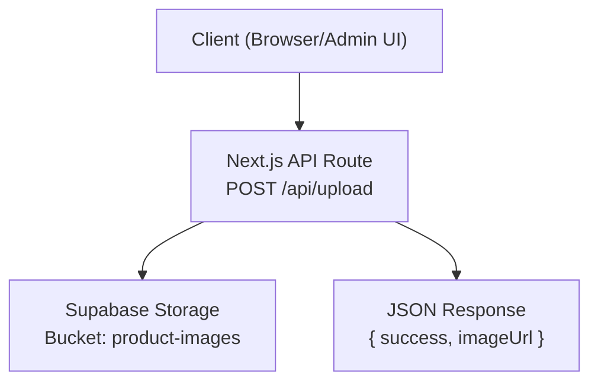
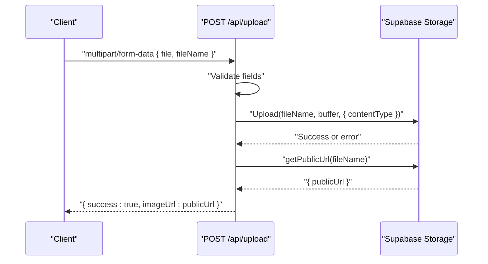
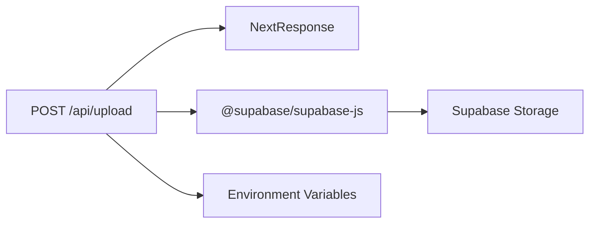

# File Upload API

<cite>
**Referenced Files in This Document**
- [route.ts](file://app/api/upload/route.ts)
- [supabase.ts](file://lib/supabase.ts)
- [supabase-setup.sql](file://supabase-setup.sql)
- [README.md](file://README.md)
- [page.tsx](file://app/dashboard/page.tsx)
- [SiteContentContext.tsx](file://app/context/SiteContentContext.tsx)
</cite>

## Table of Contents
1. [Introduction](#introduction)
2. [Project Structure](#project-structure)
3. [Core Components](#core-components)
4. [Architecture Overview](#architecture-overview)
5. [Detailed Component Analysis](#detailed-component-analysis)
6. [Dependency Analysis](#dependency-analysis)
7. [Performance Considerations](#performance-considerations)
8. [Troubleshooting Guide](#troubleshooting-guide)
9. [Conclusion](#conclusion)
10. [Appendices](#appendices)

## Introduction
This document provides comprehensive API documentation for the file upload endpoint used to store images in Supabase Storage and return public URLs. The endpoint is implemented as a Next.js App Router server route that accepts multipart/form-data, uploads files to the Supabase bucket named product-images, and returns a JSON response containing the public URL.

## Project Structure
The upload functionality is centered around a single API route and supporting configuration:
- API route: app/api/upload/route.ts
- Shared Supabase client setup: lib/supabase.ts
- Database and storage setup instructions: supabase-setup.sql
- Client usage examples: app/dashboard/page.tsx and app/context/SiteContentContext.tsx
- Environment variables and project overview: README.md

**Diagram sources**
- [route.ts:4-66](file://app/api/upload/route.ts#L4-L66)
- [supabase.ts:41-46](file://lib/supabase.ts#L41-L46)

**Section sources**
- [route.ts:1-67](file://app/api/upload/route.ts#L1-L67)
- [supabase.ts:1-46](file://lib/supabase.ts#L1-L46)
- [supabase-setup.sql:34-37](file://supabase-setup.sql#L34-L37)
- [README.md:18-36](file://README.md#L18-L36)

## Core Components
- POST /api/upload: Accepts multipart/form-data with fields file and fileName, uploads to Supabase Storage bucket product-images, and returns a JSON object with success and imageUrl.
- Supabase client initialization: Provides environment-aware configuration and fallback credentials when placeholders are detected.
- Storage bucket: Must be created in Supabase Storage as product-images and set to Public for direct URL access.

Key behaviors:
- Validates presence of file and fileName fields.
- Converts uploaded File to ArrayBuffer then Buffer before uploading.
- Uses contentType from the original file or defaults to image/jpeg.
- Returns public URL via getPublicUrl after successful upload.

**Section sources**
- [route.ts:4-66](file://app/api/upload/route.ts#L4-L66)
- [supabase.ts:27-46](file://lib/supabase.ts#L27-L46)
- [supabase-setup.sql:34-37](file://supabase-setup.sql#L34-L37)

## Architecture Overview
The upload flow involves the client sending a multipart/form-data request to the Next.js API route, which authenticates to Supabase using configured credentials, uploads the file to the specified bucket, and returns the public URL.

**Diagram sources**
- [route.ts:4-66](file://app/api/upload/route.ts#L4-L66)

## Detailed Component Analysis

### Endpoint Specification: POST /api/upload
- Method: POST
- Path: /api/upload
- Content-Type: multipart/form-data
- Authentication: None required by the route itself; uses Supabase anon key configured via environment variables. For production, consider adding authorization checks at the route level.
- Request body fields:
  - file: File object (required)
  - fileName: string (required) — full filename including extension
- Success response:
  - Status code: 200
  - Body:
    - success: boolean (true)
    - imageUrl: string (public URL of the uploaded file)
- Error responses:
  - 400 Bad Request: Missing file or fileName
  - 500 Internal Server Error: Supabase upload error or unexpected exception

Notes on behavior:
- If contentType is not provided by the browser, it defaults to image/jpeg.
- The route constructs a Supabase client per request using environment variables with placeholder detection and fallback values.

**Section sources**
- [route.ts:4-66](file://app/api/upload/route.ts#L4-L66)

### Request Schema
- Content-Type: multipart/form-data
- Fields:
  - file: File
  - fileName: string

Example usage patterns in this repository:
- Dashboard page constructs FormData with file and fileName and posts to /api/upload.
- Site content context also posts to /api/upload with the same fields.

**Section sources**
- [page.tsx:163-173](file://app/dashboard/page.tsx#L163-L173)
- [page.tsx:181-193](file://app/dashboard/page.tsx#L181-L193)
- [SiteContentContext.tsx:77-94](file://app/context/SiteContentContext.tsx#L77-L94)

### Response Schema
- On success:
  - status: 200
  - body:
    - success: boolean
    - imageUrl: string
- On validation failure:
  - status: 400
  - body:
    - error: string
- On server error:
  - status: 500
  - body:
    - error: string

**Section sources**
- [route.ts:10-15](file://app/api/upload/route.ts#L10-L15)
- [route.ts:43-48](file://app/api/upload/route.ts#L43-L48)
- [route.ts:59-65](file://app/api/upload/route.ts#L59-L65)

### Authentication Methods
- The route does not implement explicit authentication. It relies on Supabase’s anon key configured via environment variables.
- In production, add route-level authorization (e.g., session verification, admin-only checks) before processing uploads.

**Section sources**
- [route.ts:17-29](file://app/api/upload/route.ts#L17-L29)
- [supabase.ts:27-41](file://lib/supabase.ts#L27-L41)

### File Validation Rules
- Required fields: file and fileName must both be present.
- No explicit size limit is enforced in the route.
- Supported formats:
  - The route uses file.type if available, otherwise defaults to image/jpeg.
  - There is no explicit whitelist of MIME types in the route.
- Naming:
  - fileName is used directly as the storage key. Ensure unique names to avoid overwrites.

Recommendations:
- Add server-side validation for file size, MIME type, and safe naming conventions.
- Enforce allowed extensions and sanitize fileName to prevent path traversal.

**Section sources**
- [route.ts:6-15](file://app/api/upload/route.ts#L6-L15)
- [route.ts:31-41](file://app/api/upload/route.ts#L31-L41)

### Size Limitations
- No explicit size limit is implemented in the route.
- Consider enforcing limits at the application layer or reverse proxy to protect resources.

[No sources needed since this section provides general guidance]

### Security Considerations
- Authorization: Add authentication/authorization checks to restrict uploads to trusted users.
- Input sanitization: Validate and sanitize fileName to prevent directory traversal or malicious filenames.
- MIME type validation: Whitelist allowed image types and verify actual content rather than relying solely on file.type.
- Rate limiting: Implement rate limiting to mitigate abuse.
- CORS: Ensure proper CORS settings if clients are cross-origin.
- Bucket permissions: Keep the bucket public only for read access; use policies to control write access.

[No sources needed since this section provides general guidance]

### Client Implementation Examples
- Dashboard page:
  - Creates FormData with fields file and fileName.
  - Posts to /api/upload.
  - Reads data.imageUrl from the response.
- Site content context:
  - Similar pattern: FormData with file and fileName posted to /api/upload.
  - Handles errors by checking response.ok and parsing error messages.

For concrete implementation references, see:
- [page.tsx:163-173](file://app/dashboard/page.tsx#L163-L173)
- [page.tsx:181-193](file://app/dashboard/page.tsx#L181-L193)
- [SiteContentContext.tsx:77-94](file://app/context/SiteContentContext.tsx#L77-L94)

**Section sources**
- [page.tsx:163-173](file://app/dashboard/page.tsx#L163-L173)
- [page.tsx:181-193](file://app/dashboard/page.tsx#L181-L193)
- [SiteContentContext.tsx:77-94](file://app/context/SiteContentContext.tsx#L77-L94)

### Error Handling
- Validation errors:
  - 400 with error message when file or fileName is missing.
- Supabase errors:
  - 500 with error message derived from Supabase upload error.
- Unexpected exceptions:
  - 500 with generic internal server error message.

Clients should check response.ok and parse JSON error objects accordingly.

**Section sources**
- [route.ts:10-15](file://app/api/upload/route.ts#L10-L15)
- [route.ts:43-48](file://app/api/upload/route.ts#L43-L48)
- [route.ts:59-65](file://app/api/upload/route.ts#L59-L65)

## Dependency Analysis
The upload route depends on:
- Next.js server utilities for responses.
- Supabase JS client for storage operations.
- Environment variables for Supabase URL and anon key.

**Diagram sources**
- [route.ts:1-2](file://app/api/upload/route.ts#L1-L2)
- [route.ts:17-29](file://app/api/upload/route.ts#L17-L29)

**Section sources**
- [route.ts:1-29](file://app/api/upload/route.ts#L1-L29)
- [supabase.ts:1-41](file://lib/supabase.ts#L1-L41)

## Performance Considerations
- Avoid unnecessary conversions: The route converts File to ArrayBuffer then to Buffer. Consider streaming uploads if supported by your deployment environment to reduce memory overhead.
- Batch uploads: For multiple images, consider parallel uploads with concurrency limits to balance throughput and resource usage.
- Caching: Public URLs can be cached by browsers and CDNs; ensure cache headers are appropriate.
- Compression: Pre-compress images on the client side to reduce upload sizes.

[No sources needed since this section provides general guidance]

## Troubleshooting Guide
Common issues and resolutions:
- Missing fields:
  - Symptom: 400 error indicating missing file or fileName.
  - Resolution: Ensure FormData includes both file and fileName fields.
- Invalid Supabase configuration:
  - Symptom: 500 error during upload.
  - Resolution: Verify NEXT_PUBLIC_SUPABASE_URL and NEXT_PUBLIC_SUPABASE_ANON_KEY are set correctly. The route and shared client detect placeholders and log info messages.
- Bucket not found or not public:
  - Symptom: Upload fails or public URL retrieval fails.
  - Resolution: Create bucket product-images in Supabase Storage and enable public access. See setup instructions.
- Incorrect MIME type handling:
  - Symptom: Browser may send unknown or empty file.type.
  - Resolution: The route defaults to image/jpeg; validate and normalize MIME types on the client or server.

Operational references:
- Setup instructions and environment variables:
  - [README.md:18-36](file://README.md#L18-L36)
- Storage bucket creation note:
  - [supabase-setup.sql:34-37](file://supabase-setup.sql#L34-L37)
- Placeholder detection and fallback behavior:
  - [route.ts:17-29](file://app/api/upload/route.ts#L17-L29)
  - [supabase.ts:27-41](file://lib/supabase.ts#L27-L41)

**Section sources**
- [README.md:18-36](file://README.md#L18-L36)
- [supabase-setup.sql:34-37](file://supabase-setup.sql#L34-L37)
- [route.ts:17-29](file://app/api/upload/route.ts#L17-L29)
- [supabase.ts:27-41](file://lib/supabase.ts#L27-L41)

## Conclusion
The POST /api/upload endpoint provides a straightforward mechanism to upload images to Supabase Storage and retrieve public URLs. While functional, it lacks explicit authentication, input validation, and size limits recommended for production environments. Enhancements should include authorization checks, strict MIME type and size validation, secure filename handling, and rate limiting.

[No sources needed since this section summarizes without analyzing specific files]

## Appendices

### Environment Variables
Required environment variables:
- NEXT_PUBLIC_SUPABASE_URL
- NEXT_PUBLIC_SUPABASE_ANON_KEY

Configuration notes:
- Placeholders are detected and logged; fallback credentials are used if placeholders are present.
- Ensure these variables are set in your local .env.local and deployment platform (e.g., Vercel).

**Section sources**
- [README.md:31-36](file://README.md#L31-L36)
- [supabase.ts:27-41](file://lib/supabase.ts#L27-L41)

### Storage Bucket Requirements
- Bucket name: product-images
- Access: Public (for direct URL access)
- Creation steps are documented in the SQL setup comments.

**Section sources**
- [supabase-setup.sql:34-37](file://supabase-setup.sql#L34-L37)