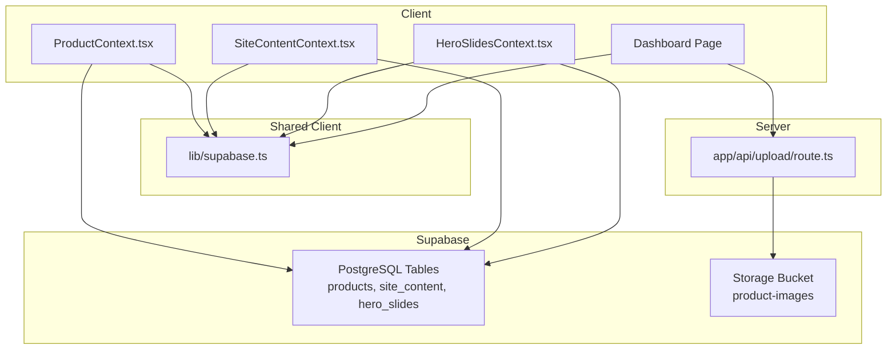
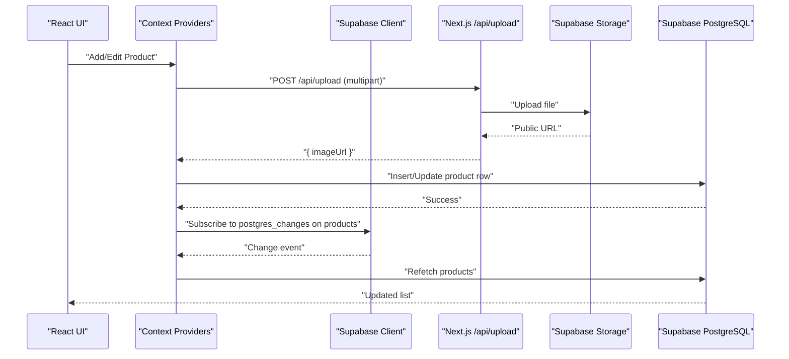
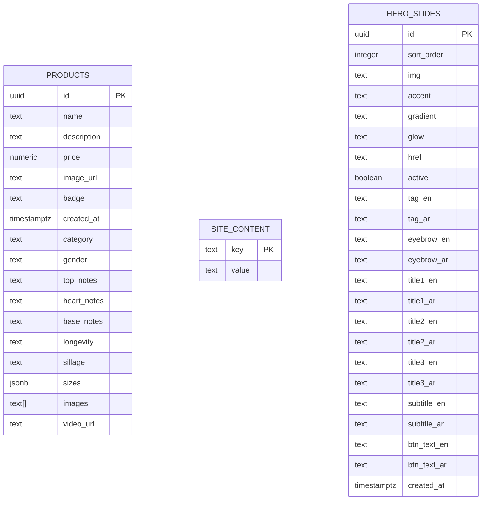
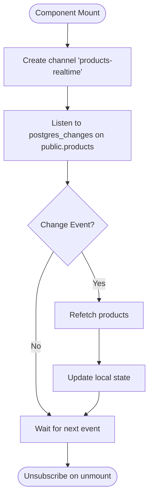
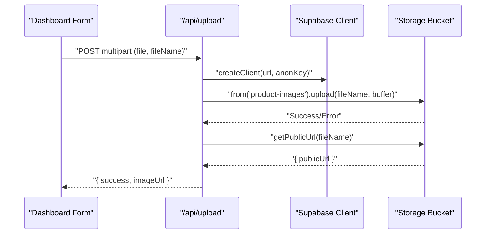
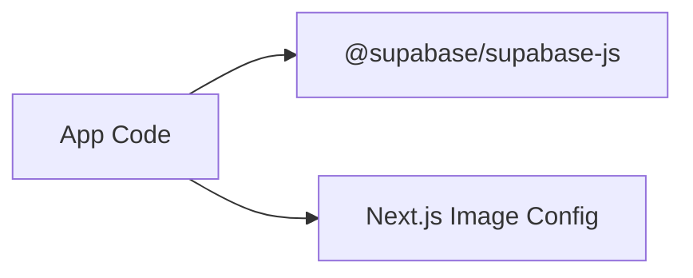

# Supabase Integration

<cite>
**Referenced Files in This Document**
- [lib/supabase.ts](file://lib/supabase.ts)
- [supabase-setup.sql](file://supabase-setup.sql)
- [app/api/upload/route.ts](file://app/api/upload/route.ts)
- [app/context/ProductContext.tsx](file://app/context/ProductContext.tsx)
- [app/context/SiteContentContext.tsx](file://app/context/SiteContentContext.tsx)
- [app/context/HeroSlidesContext.tsx](file://app/context/HeroSlidesContext.tsx)
- [app/dashboard/page.tsx](file://app/dashboard/page.tsx)
- [next.config.ts](file://next.config.ts)
- [package.json](file://package.json)
</cite>

## Table of Contents
1. [Introduction](#introduction)
2. [Project Structure](#project-structure)
3. [Core Components](#core-components)
4. [Architecture Overview](#architecture-overview)
5. [Detailed Component Analysis](#detailed-component-analysis)
6. [Dependency Analysis](#dependency-analysis)
7. [Performance Considerations](#performance-considerations)
8. [Troubleshooting Guide](#troubleshooting-guide)
9. [Conclusion](#conclusion)

## Introduction
This document explains how the application integrates with Supabase across database, storage, and real-time features. It covers client configuration, connection handling, real-time subscriptions, query patterns, data transformation strategies, schema overview, table relationships, security policies (RLS), migration approaches, CRUD operations, storage workflows, error handling, performance optimization, caching strategies, and debugging techniques.

## Project Structure
The Supabase integration is centered around a shared client module, context providers for stateful data access, an API route for secure uploads, and SQL migrations for schema and RLS setup. The Next.js image optimization config allows loading images from Supabase Storage domains.

**Diagram sources**
- [lib/supabase.ts:1-46](file://lib/supabase.ts#L1-L46)
- [app/context/ProductContext.tsx:1-116](file://app/context/ProductContext.tsx#L1-L116)
- [app/context/SiteContentContext.tsx:1-110](file://app/context/SiteContentContext.tsx#L1-L110)
- [app/context/HeroSlidesContext.tsx:1-290](file://app/context/HeroSlidesContext.tsx#L1-L290)
- [app/dashboard/page.tsx:1-200](file://app/dashboard/page.tsx#L1-L200)
- [app/api/upload/route.ts:1-67](file://app/api/upload/route.ts#L1-L67)
- [supabase-setup.sql:1-137](file://supabase-setup.sql#L1-L137)

**Section sources**
- [lib/supabase.ts:1-46](file://lib/supabase.ts#L1-L46)
- [supabase-setup.sql:1-137](file://supabase-setup.sql#L1-L137)
- [app/api/upload/route.ts:1-67](file://app/api/upload/route.ts#L1-L67)
- [app/context/ProductContext.tsx:1-116](file://app/context/ProductContext.tsx#L1-L116)
- [app/context/SiteContentContext.tsx:1-110](file://app/context/SiteContentContext.tsx#L1-L110)
- [app/context/HeroSlidesContext.tsx:1-290](file://app/context/HeroSlidesContext.tsx#L1-L290)
- [app/dashboard/page.tsx:1-200](file://app/dashboard/page.tsx#L1-L200)
- [next.config.ts:1-14](file://next.config.ts#L1-L14)
- [package.json:1-29](file://package.json#L1-L29)

## Core Components
- Shared Supabase client: Centralized configuration with environment variable validation and fallbacks; exports a single client instance and storage bucket name.
- Product context: Provides CRUD over products, initial fetch, and real-time refresh via Postgres change events.
- Site content context: Key-value content management with optimistic updates and image upload flow through server route.
- Hero slides context: Full CRUD and ordering for carousel slides with local state synchronization.
- Upload API route: Server-side file upload to Supabase Storage returning public URLs.
- Dashboard page: Orchestrates product creation/editing, including multi-image gallery uploads and saving to database.

**Section sources**
- [lib/supabase.ts:1-46](file://lib/supabase.ts#L1-L46)
- [app/context/ProductContext.tsx:1-116](file://app/context/ProductContext.tsx#L1-L116)
- [app/context/SiteContentContext.tsx:1-110](file://app/context/SiteContentContext.tsx#L1-L110)
- [app/context/HeroSlidesContext.tsx:1-290](file://app/context/HeroSlidesContext.tsx#L1-L290)
- [app/api/upload/route.ts:1-67](file://app/api/upload/route.ts#L1-L67)
- [app/dashboard/page.tsx:1-200](file://app/dashboard/page.tsx#L1-L200)

## Architecture Overview
The app uses a client-server pattern where the browser interacts with Supabase directly for reads and writes, while sensitive or CORS-sensitive operations (like direct file uploads) are proxied through a Next.js API route. Real-time updates are achieved by subscribing to Postgres changes on the products table.

**Diagram sources**
- [app/dashboard/page.tsx:150-233](file://app/dashboard/page.tsx#L150-L233)
- [app/api/upload/route.ts:1-67](file://app/api/upload/route.ts#L1-L67)
- [app/context/ProductContext.tsx:49-82](file://app/context/ProductContext.tsx#L49-L82)
- [lib/supabase.ts:1-46](file://lib/supabase.ts#L1-L46)

## Detailed Component Analysis

### Supabase Client Configuration and Connection Handling
- Environment variables: NEXT_PUBLIC_SUPABASE_URL and NEXT_PUBLIC_SUPABASE_ANON_KEY are validated; placeholders trigger fallback credentials and a console info log.
- Fallback behavior: If env vars are missing or placeholder-like, the client falls back to a demo project URL and key.
- Exported constants: A single supabase client instance and STORAGE_BUCKET name are exported for reuse.
- Image domain allowlist: next.config.ts includes *.supabase.co in remotePatterns to enable Next.js image optimization for Supabase-hosted assets.

Best practices demonstrated:
- Centralized client creation
- Defensive validation of environment inputs
- Clear logging when using fallback credentials
- Explicit storage bucket naming

**Section sources**
- [lib/supabase.ts:1-46](file://lib/supabase.ts#L1-L46)
- [next.config.ts:1-14](file://next.config.ts#L1-L14)

### Database Schema Overview and Relationships
Tables created and managed via SQL:
- products: core catalog with rich fragrance attributes, JSONB sizes, text[] images, optional video_url, and timestamps.
- site_content: key-value store for dynamic site text/images.
- hero_slides: carousel slide metadata with sorting and multilingual fields.

Relationships:
- No explicit foreign keys; logical associations exist between products and their media stored in Supabase Storage.
- Images referenced by URLs in products.images and site_content values.

Security (RLS):
- Row Level Security enabled on all tables.
- Public read/write/delete policies defined for demonstration purposes.

Migrations:
- Idempotent column additions using “add column if not exists” to evolve schema safely.

**Diagram sources**
- [supabase-setup.sql:6-137](file://supabase-setup.sql#L6-L137)

**Section sources**
- [supabase-setup.sql:1-137](file://supabase-setup.sql#L1-L137)

### Query Patterns and Data Transformation Strategies
- Products:
  - Fetch all with order by created_at descending.
  - Filter and sort performed client-side after initial load.
  - Real-time subscription triggers refetch on any change.
- Site content:
  - Fetch key/value pairs into a map; defaults used when empty.
  - Optimistic update before persisting to avoid UI flicker.
  - Image upload via server route returns public URL which is then upserted into site_content.
- Hero slides:
  - Load ordered by sort_order; fallback to default slides if empty or error.
  - Local state mirrors DB state; add/update/delete operations update local arrays immediately.
  - Reorder swaps sort_order values atomically using parallel updates.

Data transformation highlights:
- Mapping flat rows to typed interfaces (e.g., Product, HeroSlide).
- Converting uploaded files to Buffer for server-side upload.
- Building FormData payloads for multipart uploads.

**Section sources**
- [app/context/ProductContext.tsx:49-116](file://app/context/ProductContext.tsx#L49-L116)
- [app/context/SiteContentContext.tsx:26-96](file://app/context/SiteContentContext.tsx#L26-L96)
- [app/context/HeroSlidesContext.tsx:157-290](file://app/context/HeroSlidesContext.tsx#L157-L290)
- [app/api/upload/route.ts:1-67](file://app/api/upload/route.ts#L1-L67)

### Real-Time Subscriptions
- Products table subscribes to postgres_changes for all events (insert, update, delete) in the public schema.
- On change, the context refetches the full list to keep UI consistent.
- Channel cleanup occurs on unmount to prevent leaks.

**Diagram sources**
- [app/context/ProductContext.tsx:64-82](file://app/context/ProductContext.tsx#L64-L82)

**Section sources**
- [app/context/ProductContext.tsx:64-82](file://app/context/ProductContext.tsx#L64-L82)

### Storage Operations and Workflows
- Direct uploads are handled via a Next.js API route to avoid CORS issues and adblockers.
- The route validates input, constructs a Supabase client, converts File to Buffer, uploads to the configured bucket, and returns the public URL.
- Contexts compose this route to integrate storage with database records (e.g., product main image and gallery images; site content images).

**Diagram sources**
- [app/api/upload/route.ts:1-67](file://app/api/upload/route.ts#L1-L67)
- [app/dashboard/page.tsx:152-233](file://app/dashboard/page.tsx#L152-L233)
- [app/context/SiteContentContext.tsx:71-96](file://app/context/SiteContentContext.tsx#L71-L96)

**Section sources**
- [app/api/upload/route.ts:1-67](file://app/api/upload/route.ts#L1-L67)
- [app/dashboard/page.tsx:152-233](file://app/dashboard/page.tsx#L152-L233)
- [app/context/SiteContentContext.tsx:71-96](file://app/context/SiteContentContext.tsx#L71-L96)

### Error Handling Patterns
- Client queries: Errors are logged and surfaced to UI states (loading flags, error messages).
- Upload route: Returns structured JSON errors with appropriate HTTP status codes.
- Dashboard: Displays actionable warnings for missing environment variables and connection failures.

Common patterns:
- Try/catch around async operations
- Early returns with descriptive error responses
- User-facing alerts for critical misconfigurations

**Section sources**
- [app/context/ProductContext.tsx:49-62](file://app/context/ProductContext.tsx#L49-L62)
- [app/api/upload/route.ts:10-66](file://app/api/upload/route.ts#L10-L66)
- [app/dashboard/page.tsx:20-36](file://app/dashboard/page.tsx#L20-L36)

## Dependency Analysis
External dependencies relevant to Supabase integration:
- @supabase/supabase-js: Core SDK providing PostgREST, Realtime, Auth, and Storage clients.
- Next.js image optimization configured to allow *.supabase.co domains.

**Diagram sources**
- [package.json:11-16](file://package.json#L11-L16)
- [next.config.ts:3-12](file://next.config.ts#L3-L12)

**Section sources**
- [package.json:11-16](file://package.json#L11-L16)
- [next.config.ts:3-12](file://next.config.ts#L3-L12)

## Performance Considerations
- Real-time refetch strategy: The current implementation refetches the entire products list on any change. For large catalogs, consider:
  - Filtering subscriptions to specific events or rows.
  - Implementing optimistic updates and partial state patches.
  - Using pagination or infinite lists.
- Image handling:
  - Use Next.js Image component with remotePatterns to leverage automatic resizing and caching.
  - Consider CDN caching headers at the bucket level for static assets.
- Network efficiency:
  - Batch updates where possible (e.g., reorder uses parallel updates).
  - Avoid redundant re-renders by memoizing derived data and stable callbacks.

[No sources needed since this section provides general guidance]

## Troubleshooting Guide
- Missing or placeholder environment variables:
  - Symptom: Console info about fallback credentials; dashboard shows configuration warnings.
  - Action: Ensure NEXT_PUBLIC_SUPABASE_URL and NEXT_PUBLIC_SUPABASE_ANON_KEY are set correctly in .env.local and restart dev server.
- Connection errors:
  - Symptom: Dashboard reports connection failure.
  - Action: Verify network connectivity, correct project URL, and valid anon key. Check that RLS policies allow intended operations.
- Upload failures:
  - Symptom: 400/500 responses from /api/upload.
  - Action: Confirm file and fileName are present; ensure the “product-images” bucket exists and is public; verify MIME types and size limits.
- Real-time not updating:
  - Symptom: UI does not reflect changes made in dashboard.
  - Action: Confirm RLS policies include insert/update/delete; check browser console for channel subscription logs; ensure the products table exists.

**Section sources**
- [lib/supabase.ts:27-39](file://lib/supabase.ts#L27-L39)
- [app/dashboard/page.tsx:20-36](file://app/dashboard/page.tsx#L20-L36)
- [app/api/upload/route.ts:10-66](file://app/api/upload/route.ts#L10-L66)
- [supabase-setup.sql:17-32](file://supabase-setup.sql#L17-L32)

## Conclusion
The application demonstrates robust Supabase integration patterns: centralized client configuration with safe fallbacks, clear separation of concerns via contexts, server-mediated storage uploads, real-time synchronization, and comprehensive schema and RLS setup. These patterns provide a solid foundation for scaling the app’s data layer, improving performance, and maintaining security.