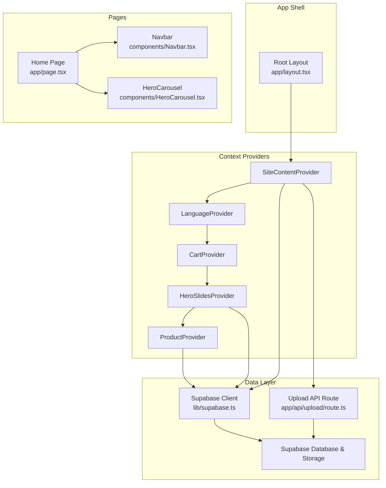
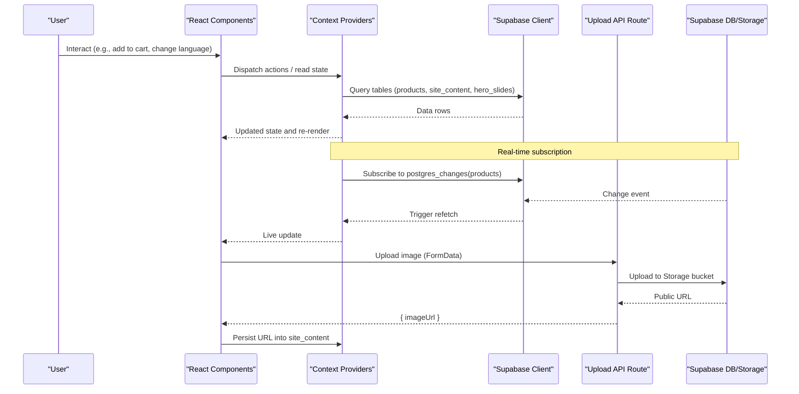
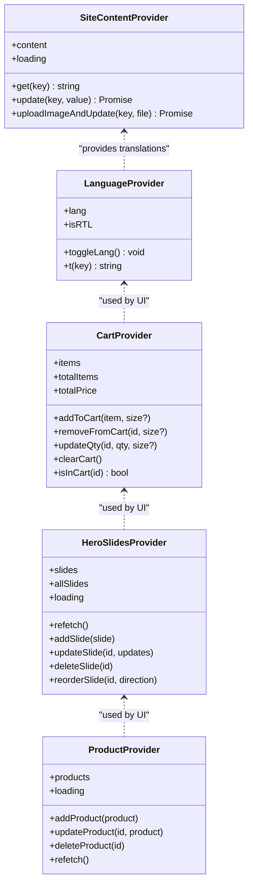
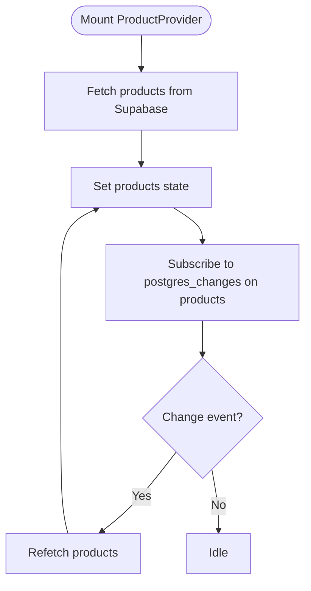
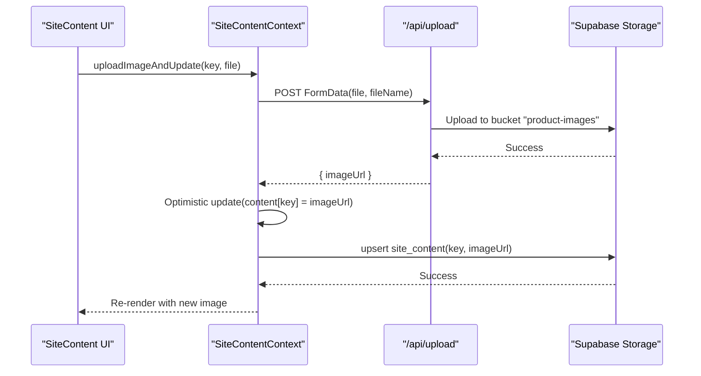
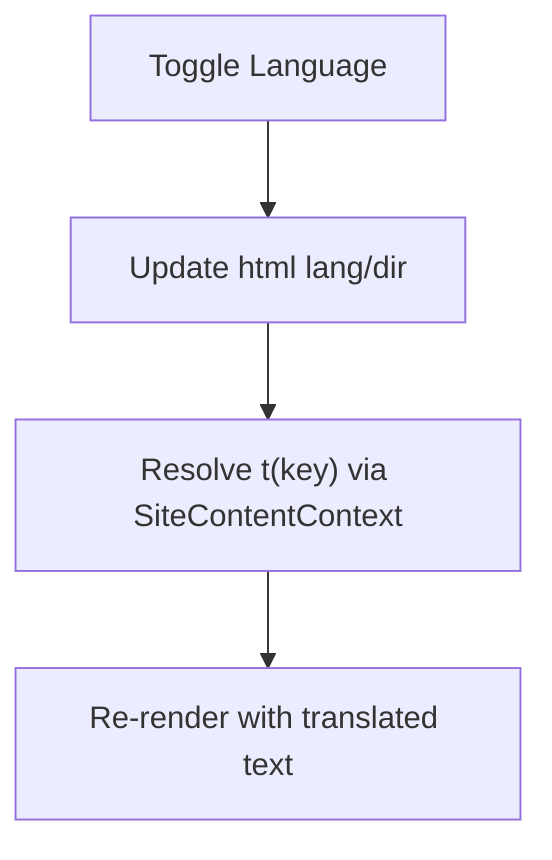
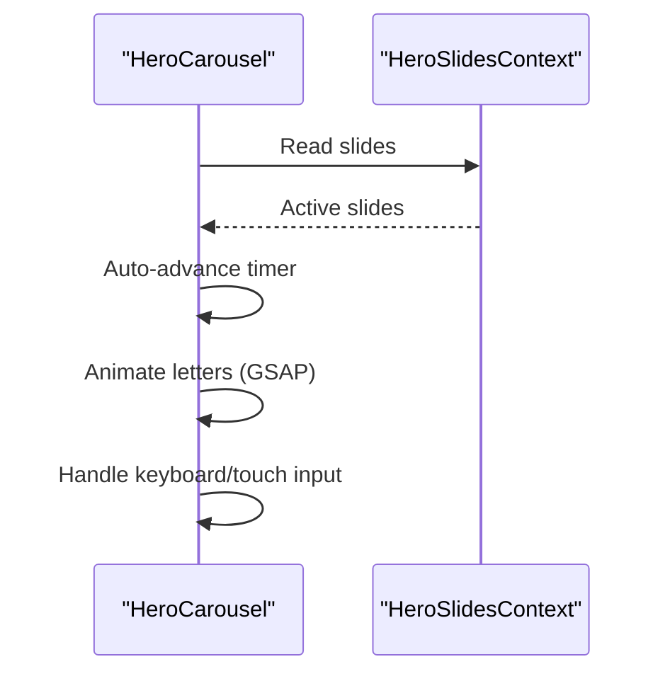
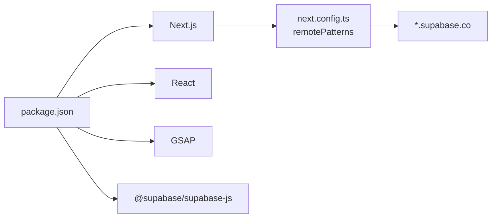

# Architecture Overview

<cite>
**Referenced Files in This Document**
- [layout.tsx](file://app/layout.tsx)
- [page.tsx](file://app/page.tsx)
- [Navbar.tsx](file://components/Navbar.tsx)
- [HeroCarousel.tsx](file://components/HeroCarousel.tsx)
- [CartContext.tsx](file://app/context/CartContext.tsx)
- [ProductContext.tsx](file://app/context/ProductContext.tsx)
- [LanguageContext.tsx](file://app/context/LanguageContext.tsx)
- [SiteContentContext.tsx](file://app/context/SiteContentContext.tsx)
- [HeroSlidesContext.tsx](file://app/context/HeroSlidesContext.tsx)
- [supabase.ts](file://lib/supabase.ts)
- [route.ts](file://app/api/upload/route.ts)
- [next.config.ts](file://next.config.ts)
- [package.json](file://package.json)
- [supabase-setup.sql](file://supabase-setup.sql)
- [README.md](file://README.md)
</cite>

## Table of Contents
1. Introduction
2. Project Structure
3. Core Components
4. Architecture Overview
5. Detailed Component Analysis
6. Dependency Analysis
7. Performance Considerations
8. Troubleshooting Guide
9. Conclusion

## Introduction
This document describes the architecture of the Nubia Perfume E-Commerce Platform, a Next.js App Router application with React Context-based state management and Supabase as the data and storage backend. It explains the component hierarchy starting from the root layout, data flow patterns between Supabase and React components, real-time updates via WebSocket subscriptions, internationalization support, security policies, performance optimizations, and deployment topology.

## Project Structure
The project follows a feature-oriented structure under app/ for pages and contexts, components/ for reusable UI, lib/ for shared client utilities, and an API route for server-side file uploads. The root layout wraps all page content with context providers to share global state across the application.

**Diagram sources**
- [layout.tsx:56-80](file://app/layout.tsx#L56-L80)
- [page.tsx:1-454](file://app/page.tsx#L1-L454)
- [Navbar.tsx:1-187](file://components/Navbar.tsx#L1-L187)
- [HeroCarousel.tsx:1-792](file://components/HeroCarousel.tsx#L1-L792)
- [CartContext.tsx:1-104](file://app/context/CartContext.tsx#L1-L104)
- [ProductContext.tsx:1-116](file://app/context/ProductContext.tsx#L1-L116)
- [LanguageContext.tsx:1-58](file://app/context/LanguageContext.tsx#L1-L58)
- [SiteContentContext.tsx:1-110](file://app/context/SiteContentContext.tsx#L1-L110)
- [HeroSlidesContext.tsx:1-290](file://app/context/HeroSlidesContext.tsx#L1-L290)
- [supabase.ts:1-46](file://lib/supabase.ts#L1-L46)
- [route.ts:1-67](file://app/api/upload/route.ts#L1-L67)

**Section sources**
- [layout.tsx:56-80](file://app/layout.tsx#L56-L80)
- [package.json:1-29](file://package.json#L1-L29)
- [README.md:1-65](file://README.md#L1-L65)

## Core Components
- Root Layout (app/layout.tsx): Registers fonts, metadata, and wraps children with SiteContentProvider, LanguageProvider, CartProvider, HeroSlidesProvider, and ProductProvider. This establishes the provider chain and global behavior such as language direction and font variables.
- Contexts:
  - SiteContentContext: Loads site text and images from Supabase site_content table; supports optimistic updates and image upload via the internal API route.
  - LanguageContext: Manages current language (en/ar), toggles RTL/LTR on html element, and provides a translation helper that resolves keys from SiteContentContext.
  - CartContext: In-memory cart with localStorage persistence; exposes add/remove/update/clear operations and computed totals.
  - HeroSlidesContext: Manages hero slides from Supabase hero_slides table with CRUD helpers and ordering logic; provides active slide subset for carousel rendering.
  - ProductContext: Fetches products from Supabase products table and subscribes to real-time changes to refresh the list automatically.
- Pages and UI:
  - Home Page (app/page.tsx): Composes Navbar, HeroCarousel, CategorySection, and product sections; uses contexts for data and translations; integrates GSAP animations.
  - Navbar (components/Navbar.tsx): Displays navigation links, language toggle, and cart badge; responds to language direction and route changes.
  - HeroCarousel (components/HeroCarousel.tsx): Renders animated slides using HeroSlidesContext and LanguageContext; includes auto-advance, keyboard/touch interaction, and per-letter animations.

**Section sources**
- [layout.tsx:56-80](file://app/layout.tsx#L56-L80)
- [SiteContentContext.tsx:22-110](file://app/context/SiteContentContext.tsx#L22-L110)
- [LanguageContext.tsx:17-58](file://app/context/LanguageContext.tsx#L17-L58)
- [CartContext.tsx:28-104](file://app/context/CartContext.tsx#L28-L104)
- [HeroSlidesContext.tsx:157-290](file://app/context/HeroSlidesContext.tsx#L157-L290)
- [ProductContext.tsx:45-116](file://app/context/ProductContext.tsx#L45-L116)
- [page.tsx:43-240](file://app/page.tsx#L43-L240)
- [Navbar.tsx:9-187](file://components/Navbar.tsx#L9-L187)
- [HeroCarousel.tsx:11-230](file://components/HeroCarousel.tsx#L11-L230)

## Architecture Overview
High-level design:
- Frontend: Next.js App Router with client components consuming React Context for state.
- Data layer: Supabase client for database queries and real-time subscriptions; Next.js API route for secure server-side storage uploads.
- Internationalization: LanguageContext drives html lang/dir attributes and translates keys resolved by SiteContentContext.
- Real-time updates: ProductContext subscribes to Postgres changes on the products table to keep the UI live without manual refresh.

**Diagram sources**
- [ProductContext.tsx:64-82](file://app/context/ProductContext.tsx#L64-L82)
- [SiteContentContext.tsx:72-96](file://app/context/SiteContentContext.tsx#L72-L96)
- [route.ts:4-66](file://app/api/upload/route.ts#L4-L66)
- [supabase.ts:41-46](file://lib/supabase.ts#L41-L46)

## Detailed Component Analysis

### Provider Hierarchy and Global State
- Provider order in Root Layout: SiteContentProvider → LanguageProvider → CartProvider → HeroSlidesProvider → ProductProvider.
- Responsibilities:
  - SiteContentProvider: Centralizes dynamic content and images; merges defaults with DB values; offers get/update/uploadImageAndUpdate.
  - LanguageProvider: Maintains current language, toggles RTL/LTR, and provides t(key) resolution against SiteContentContext.
  - CartProvider: Local-first cart with localStorage sync; exposes addToCart/removeFromCart/updateQty/clear/isInCart and computed totals.
  - HeroSlidesProvider: Manages hero slides with sorting and active filtering; exposes CRUD and reorder helpers.
  - ProductContext: Fetches products and subscribes to real-time changes; exposes add/update/delete/refetch.

**Diagram sources**
- [SiteContentContext.tsx:22-110](file://app/context/SiteContentContext.tsx#L22-L110)
- [LanguageContext.tsx:17-58](file://app/context/LanguageContext.tsx#L17-L58)
- [CartContext.tsx:28-104](file://app/context/CartContext.tsx#L28-L104)
- [HeroSlidesContext.tsx:157-290](file://app/context/HeroSlidesContext.tsx#L157-L290)
- [ProductContext.tsx:45-116](file://app/context/ProductContext.tsx#L45-L116)

**Section sources**
- [layout.tsx:56-80](file://app/layout.tsx#L56-L80)
- [SiteContentContext.tsx:22-110](file://app/context/SiteContentContext.tsx#L22-L110)
- [LanguageContext.tsx:17-58](file://app/context/LanguageContext.tsx#L17-L58)
- [CartContext.tsx:28-104](file://app/context/CartContext.tsx#L28-L104)
- [HeroSlidesContext.tsx:157-290](file://app/context/HeroSlidesContext.tsx#L157-L290)
- [ProductContext.tsx:45-116](file://app/context/ProductContext.tsx#L45-L116)

### Real-Time Updates Flow (Products)

**Diagram sources**
- [ProductContext.tsx:49-82](file://app/context/ProductContext.tsx#L49-L82)

**Section sources**
- [ProductContext.tsx:49-82](file://app/context/ProductContext.tsx#L49-L82)

### Image Upload Flow (Site Content)

**Diagram sources**
- [SiteContentContext.tsx:72-96](file://app/context/SiteContentContext.tsx#L72-L96)
- [route.ts:4-66](file://app/api/upload/route.ts#L4-L66)

**Section sources**
- [SiteContentContext.tsx:72-96](file://app/context/SiteContentContext.tsx#L72-L96)
- [route.ts:4-66](file://app/api/upload/route.ts#L4-L66)

### Internationalization and Directionality
- LanguageContext sets html lang and dir attributes based on selected language.
- t(key) resolves translations from SiteContentContext with fallback to English or key itself.
- Navbar and other UI components react to isRTL to adjust layout direction.

**Diagram sources**
- [LanguageContext.tsx:22-44](file://app/context/LanguageContext.tsx#L22-L44)
- [SiteContentContext.tsx:50-54](file://app/context/SiteContentContext.tsx#L50-L54)
- [Navbar.tsx:58-96](file://components/Navbar.tsx#L58-L96)

**Section sources**
- [LanguageContext.tsx:22-44](file://app/context/LanguageContext.tsx#L22-L44)
- [SiteContentContext.tsx:50-54](file://app/context/SiteContentContext.tsx#L50-L54)
- [Navbar.tsx:58-96](file://components/Navbar.tsx#L58-L96)

### Hero Carousel Interaction
- HeroCarousel consumes HeroSlidesContext for slide data and LanguageContext for direction-aware progress dots.
- Implements auto-advance, keyboard navigation, touch ripple, and per-letter animations.

**Diagram sources**
- [HeroCarousel.tsx:11-230](file://components/HeroCarousel.tsx#L11-L230)
- [HeroSlidesContext.tsx:262-283](file://app/context/HeroSlidesContext.tsx#L262-L283)

**Section sources**
- [HeroCarousel.tsx:11-230](file://components/HeroCarousel.tsx#L11-L230)
- [HeroSlidesContext.tsx:262-283](file://app/context/HeroSlidesContext.tsx#L262-L283)

## Dependency Analysis
- Client-side dependencies include React, Next.js, GSAP, and Supabase JS client.
- Server-side dependency used within the API route is also Supabase JS client for storage operations.
- Next configuration allows remote images from Supabase domains.

**Diagram sources**
- [package.json:11-27](file://package.json#L11-L27)
- [next.config.ts:3-12](file://next.config.ts#L3-L12)

**Section sources**
- [package.json:11-27](file://package.json#L11-L27)
- [next.config.ts:3-12](file://next.config.ts#L3-L12)

## Performance Considerations
- Fonts are preloaded with display swap to avoid FOIT/FOUT and reduce layout shifts.
- Images are served from Supabase CDN; Next config whitelists Supabase domains for optimization.
- Real-time subscriptions minimize polling overhead and provide instant UI updates.
- Cart state persists to localStorage to avoid unnecessary re-renders and maintain session continuity.
- Animations use GSAP with ScrollTrigger batching and requestAnimationFrame where appropriate.

[No sources needed since this section provides general guidance]

## Troubleshooting Guide
- Missing or placeholder Supabase credentials:
  - The client logs informational messages when environment variables are missing or placeholders are detected and falls back to demo credentials. Ensure NEXT_PUBLIC_SUPABASE_URL and NEXT_PUBLIC_SUPABASE_ANON_KEY are set correctly.
- Upload failures:
  - The upload API returns structured error responses. Check status codes and error messages returned by the route. Verify that the storage bucket exists and is public.
- Real-time not updating:
  - Confirm that Row Level Security policies allow realtime events on the products table and that the channel is subscribed successfully.
- Image loading issues:
  - Ensure next.config.ts remotePatterns include *.supabase.co and that images are accessible publicly.

**Section sources**
- [supabase.ts:27-39](file://lib/supabase.ts#L27-L39)
- [route.ts:43-66](file://app/api/upload/route.ts#L43-L66)
- [supabase-setup.sql:17-33](file://supabase-setup.sql#L17-L33)
- [next.config.ts:3-12](file://next.config.ts#L3-L12)

## Conclusion
The platform leverages a clean provider-driven architecture with Next.js App Router, React Context for state, and Supabase for data and storage. Real-time updates, robust internationalization, and thoughtful performance optimizations deliver a responsive, high-end user experience. The system boundaries are well-defined: client contexts manage UI state, the API route handles server-side storage operations, and Supabase enforces data access through RLS policies. Deployment is straightforward on Vercel with environment variables configured for Supabase integration.