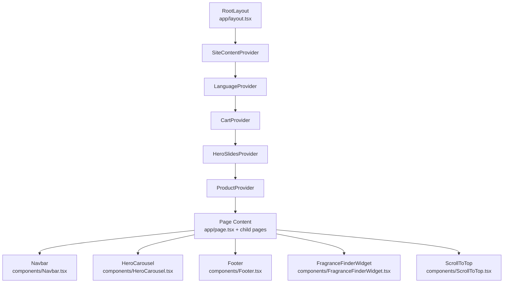
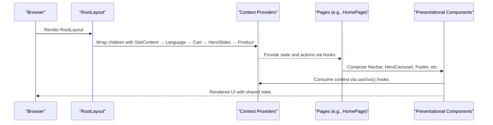
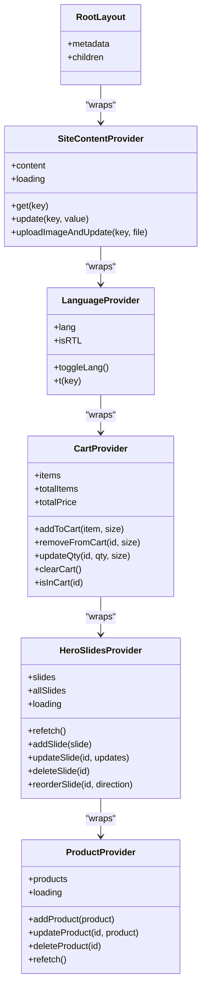
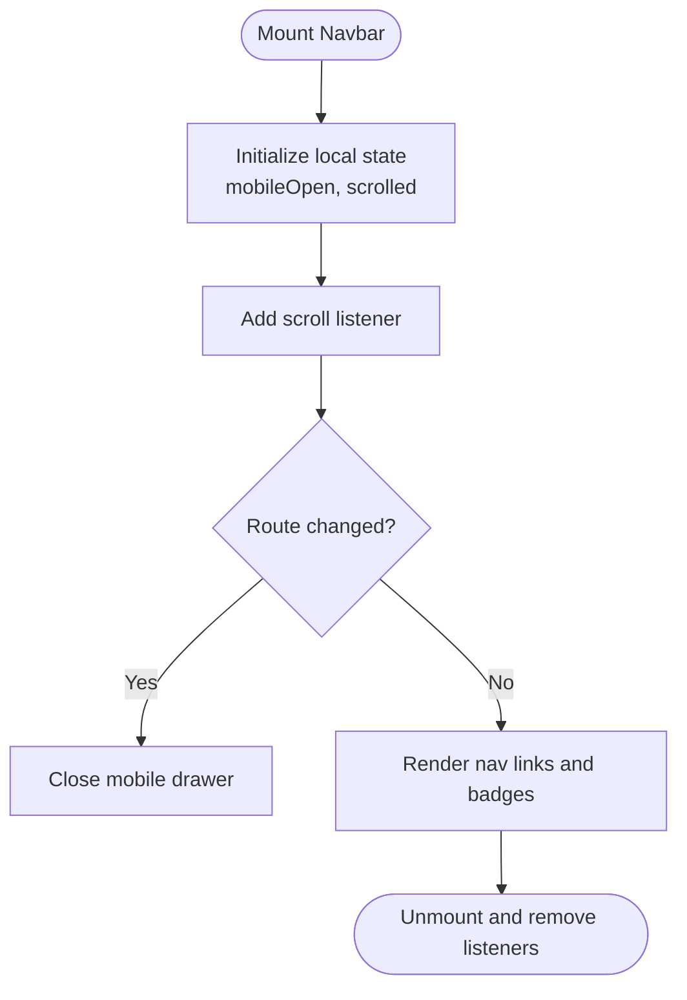
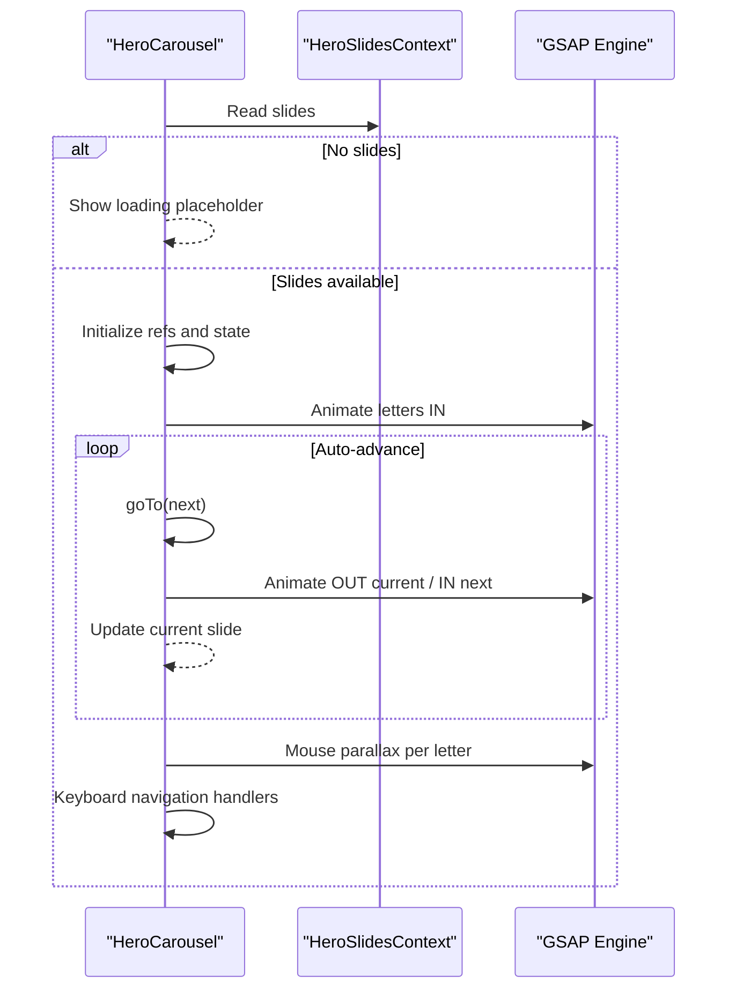
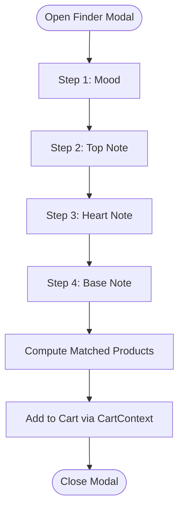
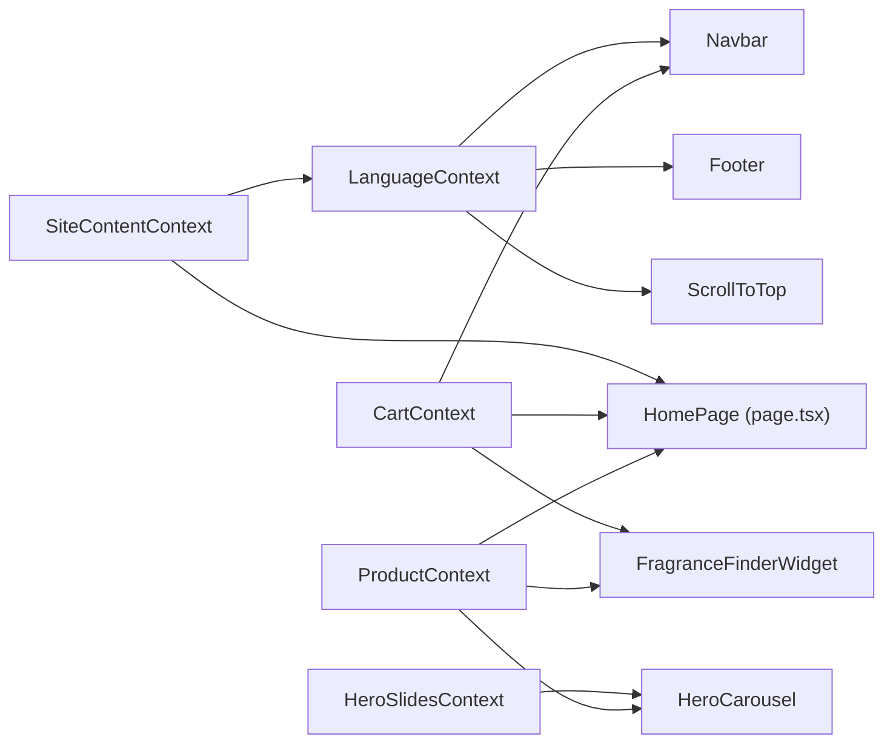

# Component Architecture

<cite>
**Referenced Files in This Document**
- [layout.tsx](file://app/layout.tsx)
- [SiteContentContext.tsx](file://app/context/SiteContentContext.tsx)
- [LanguageContext.tsx](file://app/context/LanguageContext.tsx)
- [CartContext.tsx](file://app/context/CartContext.tsx)
- [HeroSlidesContext.tsx](file://app/context/HeroSlidesContext.tsx)
- [ProductContext.tsx](file://app/context/ProductContext.tsx)
- [Navbar.tsx](file://components/Navbar.tsx)
- [HeroCarousel.tsx](file://components/HeroCarousel.tsx)
- [Footer.tsx](file://components/Footer.tsx)
- [FragranceFinderWidget.tsx](file://components/FragranceFinderWidget.tsx)
- [ScrollToTop.tsx](file://components/ScrollToTop.tsx)
- [page.tsx](file://app/page.tsx)
</cite>

## Table of Contents
1. [Introduction](#introduction)
2. [Project Structure](#project-structure)
3. [Core Components](#core-components)
4. [Architecture Overview](#architecture-overview)
5. [Detailed Component Analysis](#detailed-component-analysis)
6. [Dependency Analysis](#dependency-analysis)
7. [Performance Considerations](#performance-considerations)
8. [Troubleshooting Guide](#troubleshooting-guide)
9. [Conclusion](#conclusion)

## Introduction
This document describes the component architecture of the Nubia Perfume E-Commerce Platform with a focus on:
- The hierarchical structure rooted at RootLayout and its context providers
- Composition patterns and how Context API replaces prop drilling
- Separation between presentational components (e.g., Navbar, HeroCarousel, Footer) and container-like logic within contexts
- Lifecycle management, error handling strategies, and performance optimizations such as memoization and lazy loading opportunities

The goal is to provide both high-level clarity and code-level traceability for developers and technical stakeholders.

## Project Structure
At the application root, layout.tsx defines the global shell and wraps all routes with a stack of context providers. Presentational UI components live under components/, while shared state and data flows are encapsulated in app/context/*. Page-level composition occurs in page files like app/page.tsx.

**Diagram sources**
- [layout.tsx:56-80](file://app/layout.tsx#L56-L80)
- [page.tsx:127-239](file://app/page.tsx#L127-L239)

**Section sources**
- [layout.tsx:1-81](file://app/layout.tsx#L1-L81)
- [page.tsx:1-454](file://app/page.tsx#L1-L454)

## Core Components
- RootLayout: Global HTML/body wrapper that registers fonts, metadata, and provides SiteContentProvider → LanguageProvider → CartProvider → HeroSlidesProvider → ProductProvider. It also mounts ScrollToTop and FragranceFinderWidget globally.
- Presentational components:
  - Navbar: Navigation bar with language toggle, cart badge, mobile drawer, and active link highlighting.
  - HeroCarousel: Animated hero section driven by HeroSlidesContext and GSAP animations.
  - Footer: Branding, links, social icons, and legal links; uses translations via LanguageContext.
- Utility components:
  - ScrollToTop: Floating button toggled by scroll position.
  - FragranceFinderWidget: Multi-step quiz modal that matches products based on user selections.

These components consume context hooks rather than receiving props from deep parent trees, eliminating prop drilling.

**Section sources**
- [layout.tsx:56-80](file://app/layout.tsx#L56-L80)
- [Navbar.tsx:1-187](file://components/Navbar.tsx#L1-L187)
- [HeroCarousel.tsx:1-792](file://components/HeroCarousel.tsx#L1-L792)
- [Footer.tsx:1-173](file://components/Footer.tsx#L1-L173)
- [ScrollToTop.tsx:1-83](file://components/ScrollToTop.tsx#L1-L83)
- [FragranceFinderWidget.tsx:1-800](file://components/FragranceFinderWidget.tsx#L1-L800)

## Architecture Overview
The application follows a provider-based architecture where RootLayout composes multiple contexts to share global state across the entire tree. Data fetching and mutations are centralized in contexts, while UI components remain focused on presentation and interaction.

**Diagram sources**
- [layout.tsx:56-80](file://app/layout.tsx#L56-L80)
- [page.tsx:127-239](file://app/page.tsx#L127-L239)

## Detailed Component Analysis

### RootLayout and Provider Composition
RootLayout establishes the application’s global environment:
- Registers Google fonts and CSS variables
- Provides metadata for SEO and Open Graph
- Wraps the app with five providers in a strict order:
  - SiteContentProvider: Loads site-wide content from Supabase and exposes get/update/upload helpers
  - LanguageProvider: Manages current language and direction, and translates keys using SiteContent
  - CartProvider: In-memory cart persisted to localStorage with CRUD operations
  - HeroSlidesProvider: Fetches hero slides from Supabase with defaults and admin operations
  - ProductProvider: Fetches products from Supabase with real-time updates and CRUD operations

**Diagram sources**
- [layout.tsx:56-80](file://app/layout.tsx#L56-L80)
- [SiteContentContext.tsx:22-103](file://app/context/SiteContentContext.tsx#L22-L103)
- [LanguageContext.tsx:17-51](file://app/context/LanguageContext.tsx#L17-L51)
- [CartContext.tsx:28-97](file://app/context/CartContext.tsx#L28-L97)
- [HeroSlidesContext.tsx:157-283](file://app/context/HeroSlidesContext.tsx#L157-L283)
- [ProductContext.tsx:45-109](file://app/context/ProductContext.tsx#L45-L109)

**Section sources**
- [layout.tsx:56-80](file://app/layout.tsx#L56-L80)
- [SiteContentContext.tsx:22-103](file://app/context/SiteContentContext.tsx#L22-L103)
- [LanguageContext.tsx:17-51](file://app/context/LanguageContext.tsx#L17-L51)
- [CartContext.tsx:28-97](file://app/context/CartContext.tsx#L28-L97)
- [HeroSlidesContext.tsx:157-283](file://app/context/HeroSlidesContext.tsx#L157-L283)
- [ProductContext.tsx:45-109](file://app/context/ProductContext.tsx#L45-L109)

### Presentational Components

#### Navbar
Responsibilities:
- Renders navigation links with active state detection
- Displays cart badge count via CartContext
- Toggles language via LanguageContext
- Handles mobile drawer open/close and route change cleanup

Lifecycle and interactions:
- Uses window scroll listener to apply scrolled styles
- Resets mobile drawer on route changes
- Accesses translations through LanguageContext

**Diagram sources**
- [Navbar.tsx:16-23](file://components/Navbar.tsx#L16-L23)
- [Navbar.tsx:25-82](file://components/Navbar.tsx#L25-L82)
- [Navbar.tsx:84-119](file://components/Navbar.tsx#L84-L119)

**Section sources**
- [Navbar.tsx:1-187](file://components/Navbar.tsx#L1-L187)

#### HeroCarousel
Responsibilities:
- Displays animated hero slides sourced from HeroSlidesContext
- Implements auto-advance, keyboard navigation, and mouse parallax effects
- Animates letter-by-letter entrance/exit using GSAP

Key behaviors:
- Guards against out-of-bounds slide index
- Manages animation timelines and clip-path transitions
- Creates ripple effects on touch/click events

**Diagram sources**
- [HeroCarousel.tsx:26-35](file://components/HeroCarousel.tsx#L26-L35)
- [HeroCarousel.tsx:102-128](file://components/HeroCarousel.tsx#L102-L128)
- [HeroCarousel.tsx:131-137](file://components/HeroCarousel.tsx#L131-L137)
- [HeroCarousel.tsx:158-187](file://components/HeroCarousel.tsx#L158-L187)
- [HeroCarousel.tsx:189-197](file://components/HeroCarousel.tsx#L189-L197)

**Section sources**
- [HeroCarousel.tsx:1-792](file://components/HeroCarousel.tsx#L1-L792)

#### Footer
Responsibilities:
- Displays brand info, social links, category/company/shopping/support links
- Applies RTL/LTR direction based on LanguageContext
- Translates all labels via LanguageContext

Design principles:
- Purely presentational; no business logic beyond rendering and translation
- Consistent styling and hover states

**Section sources**
- [Footer.tsx:1-173](file://components/Footer.tsx#L1-L173)

#### ScrollToTop
Responsibilities:
- Shows/hides a floating button based on scroll position
- Smooth-scrolls to top when clicked
- Respects RTL positioning

**Section sources**
- [ScrollToTop.tsx:1-83](file://components/ScrollToTop.tsx#L1-L83)

#### FragranceFinderWidget
Responsibilities:
- Presents a multi-step quiz modal to match user preferences to products
- Computes matched products using keyword scoring over product notes and descriptions
- Integrates with CartContext to add items directly from results

Data flow:
- Consumes ProductContext for product list
- Uses CartContext for adding items
- Maintains internal step state and selection history

**Diagram sources**
- [FragranceFinderWidget.tsx:168-197](file://components/FragranceFinderWidget.tsx#L168-L197)
- [FragranceFinderWidget.tsx:233-270](file://components/FragranceFinderWidget.tsx#L233-L270)

**Section sources**
- [FragranceFinderWidget.tsx:1-800](file://components/FragranceFinderWidget.tsx#L1-L800)

### Container vs Presentational Split
- Container responsibilities (state/data):
  - SiteContentProvider: fetches and caches site content, uploads images via API route
  - LanguageProvider: manages language and direction, resolves translations
  - CartProvider: persists cart to localStorage and exposes cart operations
  - HeroSlidesProvider: fetches slides, supports add/update/delete/reorder
  - ProductProvider: fetches products, subscribes to real-time changes, supports CRUD
- Presentational responsibilities (UI only):
  - Navbar, HeroCarousel, Footer, ScrollToTop, FragranceFinderWidget (UI orchestration only; data comes from contexts)

This separation ensures UI components remain reusable and testable without coupling to data-fetching or persistence logic.

**Section sources**
- [SiteContentContext.tsx:22-103](file://app/context/SiteContentContext.tsx#L22-L103)
- [LanguageContext.tsx:17-51](file://app/context/LanguageContext.tsx#L17-L51)
- [CartContext.tsx:28-97](file://app/context/CartContext.tsx#L28-L97)
- [HeroSlidesContext.tsx:157-283](file://app/context/HeroSlidesContext.tsx#L157-L283)
- [ProductContext.tsx:45-109](file://app/context/ProductContext.tsx#L45-L109)

## Dependency Analysis
Context dependency chain and usage:
- LanguageProvider depends on SiteContentProvider for translation values
- All other contexts are independent but consumed by various components
- Components consume contexts via hooks instead of prop drilling

**Diagram sources**
- [LanguageContext.tsx:17-51](file://app/context/LanguageContext.tsx#L17-L51)
- [Navbar.tsx:6-12](file://components/Navbar.tsx#L6-L12)
- [Footer.tsx:4-8](file://components/Footer.tsx#L4-L8)
- [ScrollToTop.tsx:4-7](file://components/ScrollToTop.tsx#L4-L7)
- [HeroCarousel.tsx:5-6](file://components/HeroCarousel.tsx#L5-L6)
- [FragranceFinderWidget.tsx:6-7](file://components/FragranceFinderWidget.tsx#L6-L7)
- [page.tsx:7-10](file://app/page.tsx#L7-L10)

**Section sources**
- [LanguageContext.tsx:17-51](file://app/context/LanguageContext.tsx#L17-L51)
- [Navbar.tsx:6-12](file://components/Navbar.tsx#L6-L12)
- [Footer.tsx:4-8](file://components/Footer.tsx#L4-L8)
- [ScrollToTop.tsx:4-7](file://components/ScrollToTop.tsx#L4-L7)
- [HeroCarousel.tsx:5-6](file://components/HeroCarousel.tsx#L5-L6)
- [FragranceFinderWidget.tsx:6-7](file://components/FragranceFinderWidget.tsx#L6-L7)
- [page.tsx:7-10](file://app/page.tsx#L7-L10)

## Performance Considerations
Current optimizations observed:
- Memoized callbacks in contexts (useCallback) to avoid unnecessary re-renders
- Real-time updates for products via Supabase channel subscription
- Efficient event handling with passive scroll listeners
- Conditional rendering and early returns for empty states

Recommended enhancements:
- React.memo:
  - Apply to pure presentational components (e.g., Navbar, Footer, HomeProductCard) to prevent re-renders when props do not change
- Lazy loading:
  - Use dynamic imports for heavy components like HeroCarousel and FragranceFinderWidget to reduce initial bundle size
- Context splitting:
  - Consider splitting large contexts into smaller ones (e.g., separate theme/language from cart/product data) to limit subscriber scope
- Animation performance:
  - Ensure GSAP animations target minimal DOM nodes and leverage will-change judiciously
- Image optimization:
  - Use Next.js Image component for hero and product images to enable automatic optimization and lazy loading

[No sources needed since this section provides general guidance]

## Troubleshooting Guide
Common issues and resolutions:
- Missing context usage outside providers:
  - Each context hook throws an error if used outside its provider. Ensure RootLayout wraps the app correctly.
- Cart persistence mismatches:
  - Verify localStorage key and JSON serialization; ensure hydration flag prevents writes before first load.
- Hero slides not updating:
  - Confirm Supabase table exists and row schema matches expected fields; fallback defaults are used on errors.
- Product real-time not firing:
  - Check Supabase realtime permissions and channel subscription cleanup on unmount.
- Translation keys missing:
  - Ensure SiteContent has entries for lang_key combinations; fallback to English or raw key is applied.

Operational tips:
- Use browser dev tools to inspect context values via custom React DevTools extensions
- Log network requests to Supabase and API upload route during debugging
- Validate RTL behavior by toggling language and checking html dir attribute

**Section sources**
- [SiteContentContext.tsx:105-109](file://app/context/SiteContentContext.tsx#L105-L109)
- [LanguageContext.tsx:53-57](file://app/context/LanguageContext.tsx#L53-L57)
- [CartContext.tsx:99-103](file://app/context/CartContext.tsx#L99-L103)
- [HeroSlidesContext.tsx:285-289](file://app/context/HeroSlidesContext.tsx#L285-L289)
- [ProductContext.tsx:111-115](file://app/context/ProductContext.tsx#L111-L115)

## Conclusion
The Nubia Perfume E-Commerce Platform employs a clean provider-based architecture centered around RootLayout and a layered set of contexts. Presentational components remain decoupled from data-fetching and persistence logic, improving maintainability and testability. The design leverages Context API to eliminate prop drilling, integrates real-time updates for product data, and offers rich interactive experiences through GSAP animations. Future improvements should focus on memoization, lazy loading, and further context scoping to optimize performance and scalability.