# Data Flow Patterns

<cite>
**Referenced Files in This Document**
- [supabase.ts](file://lib/supabase.ts)
- [ProductContext.tsx](file://app/context/ProductContext.tsx)
- [CartContext.tsx](file://app/context/CartContext.tsx)
- [SiteContentContext.tsx](file://app/context/SiteContentContext.tsx)
- [HeroSlidesContext.tsx](file://app/context/HeroSlidesContext.tsx)
- [LanguageContext.tsx](file://app/context/LanguageContext.tsx)
- [layout.tsx](file://app/layout.tsx)
- [route.ts](file://app/api/upload/route.ts)
- [page.tsx (Dashboard)](file://app/dashboard/page.tsx)
- [page.tsx (Product Details)](file://app/product/[id]/page.tsx)
- [supabase-setup.sql](file://supabase-setup.sql)
</cite>

## Table of Contents
1. [Introduction](#introduction)
2. [Project Structure](#project-structure)
3. [Core Components](#core-components)
4. [Architecture Overview](#architecture-overview)
5. [Detailed Component Analysis](#detailed-component-analysis)
6. [Dependency Analysis](#dependency-analysis)
7. [Performance Considerations](#performance-considerations)
8. [Troubleshooting Guide](#troubleshooting-guide)
9. [Conclusion](#conclusion)

## Introduction
This document explains the data flow patterns in the Nubia Perfume platform, focusing on unidirectional data flow from Supabase to React components via Context providers, real-time synchronization, optimistic updates, and a client-to-server upload pipeline to Supabase Storage. It also covers error handling strategies, caching patterns, and performance techniques such as debouncing and pagination.

## Project Structure
The application is a Next.js app with:
- Client-side state managed through React Context providers
- Real-time database subscriptions for live updates
- Server API routes for secure file uploads to Supabase Storage
- A root layout that composes all providers

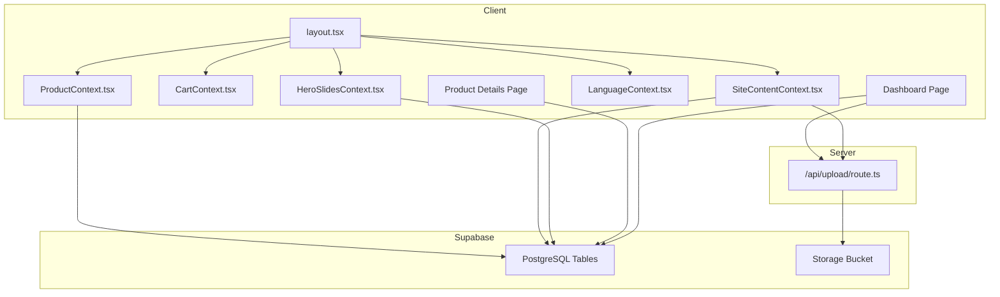

**Diagram sources**
- [layout.tsx:57-82](file://app/layout.tsx#L57-L82)
- [ProductContext.tsx:45-109](file://app/context/ProductContext.tsx#L45-L109)
- [CartContext.tsx:28-97](file://app/context/CartContext.tsx#L28-L97)
- [SiteContentContext.tsx:22-103](file://app/context/SiteContentContext.tsx#L22-L103)
- [HeroSlidesContext.tsx:157-283](file://app/context/HeroSlidesContext.tsx#L157-L283)
- [LanguageContext.tsx:17-51](file://app/context/LanguageContext.tsx#L17-L51)
- [route.ts:4-66](file://app/api/upload/route.ts#L4-L66)

**Section sources**
- [layout.tsx:57-82](file://app/layout.tsx#L57-L82)

## Core Components
- Supabase client initialization and storage bucket configuration
- Product context with real-time subscription and CRUD operations
- Cart context with local persistence and derived totals
- Site content context with optimistic text updates and image upload integration
- Hero slides context with default fallbacks and ordering logic
- Language context for i18n and RTL support
- Upload API route for server-side storage uploads

Key responsibilities:
- Unidirectional data flow: Database → Context Providers → UI Components
- Real-time sync via Postgres changes
- Optimistic updates for immediate UI feedback
- Fallbacks for missing tables or network errors
- Secure file uploads via Next.js API route

**Section sources**
- [supabase.ts:1-46](file://lib/supabase.ts#L1-L46)
- [ProductContext.tsx:45-109](file://app/context/ProductContext.tsx#L45-L109)
- [CartContext.tsx:28-97](file://app/context/CartContext.tsx#L28-L97)
- [SiteContentContext.tsx:22-103](file://app/context/SiteContentContext.tsx#L22-L103)
- [HeroSlidesContext.tsx:157-283](file://app/context/HeroSlidesContext.tsx#L157-L283)
- [LanguageContext.tsx:17-51](file://app/context/LanguageContext.tsx#L17-L51)
- [route.ts:4-66](file://app/api/upload/route.ts#L4-L66)

## Architecture Overview
The system follows a unidirectional data flow:
- Data originates in Supabase (PostgreSQL and Storage)
- Context providers fetch and maintain state
- Components consume context values and trigger actions
- Actions mutate state optimistically when possible, then persist to Supabase
- Real-time subscriptions keep clients in sync

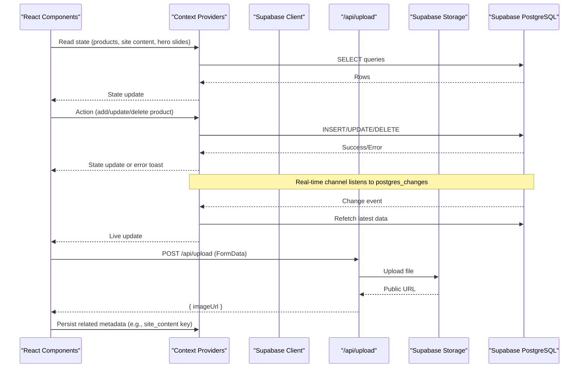

**Diagram sources**
- [ProductContext.tsx:64-82](file://app/context/ProductContext.tsx#L64-L82)
- [SiteContentContext.tsx:71-96](file://app/context/SiteContentContext.tsx#L71-L96)
- [route.ts:4-66](file://app/api/upload/route.ts#L4-L66)

## Detailed Component Analysis

### Supabase Client and Storage Configuration
- Initializes client with environment variables and safe fallbacks
- Exports a shared client instance and storage bucket name

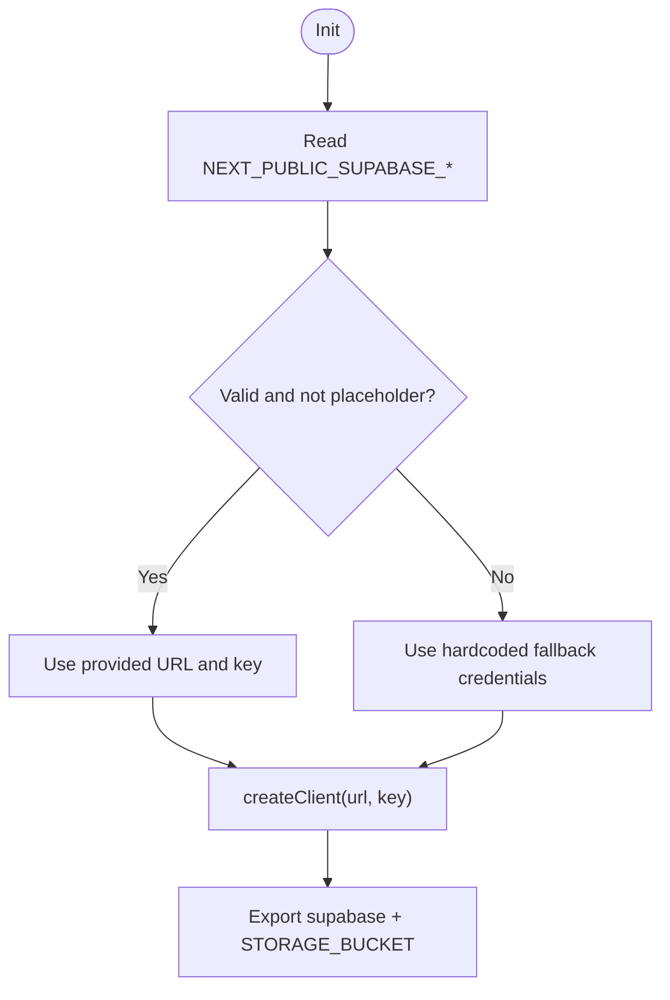

**Diagram sources**
- [supabase.ts:1-46](file://lib/supabase.ts#L1-L46)

**Section sources**
- [supabase.ts:1-46](file://lib/supabase.ts#L1-L46)

### Product Context: Real-time Products
- Fetches products ordered by creation time
- Subscribes to all changes on the products table and refetches on events
- Provides add/update/delete helpers that refresh after mutation

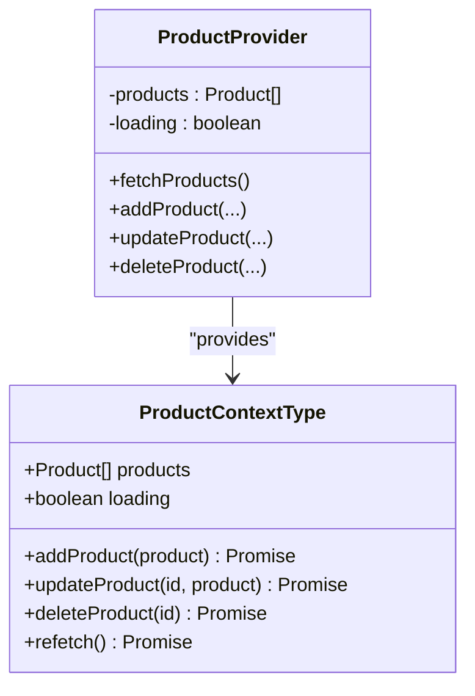

Real-time flow:
- On mount, subscribe to postgres_changes for products
- On any change, refetch to ensure consistency

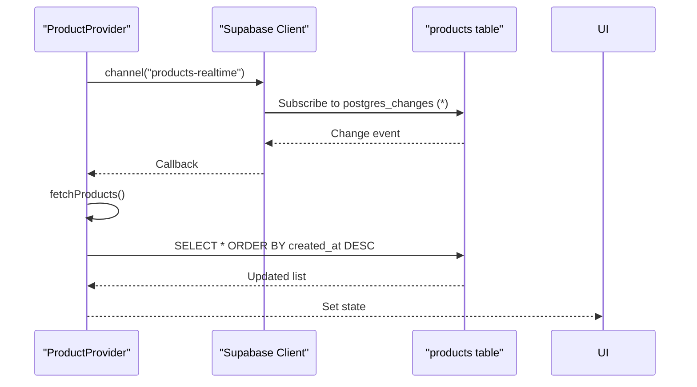

**Diagram sources**
- [ProductContext.tsx:45-109](file://app/context/ProductContext.tsx#L45-L109)

**Section sources**
- [ProductContext.tsx:45-109](file://app/context/ProductContext.tsx#L45-L109)

### Cart Context: Local Persistence and Derived State
- Persists cart items to localStorage across sessions
- Computes totalItems and totalPrice
- Provides addToCart, removeFromCart, updateQty, clearCart, isInCart

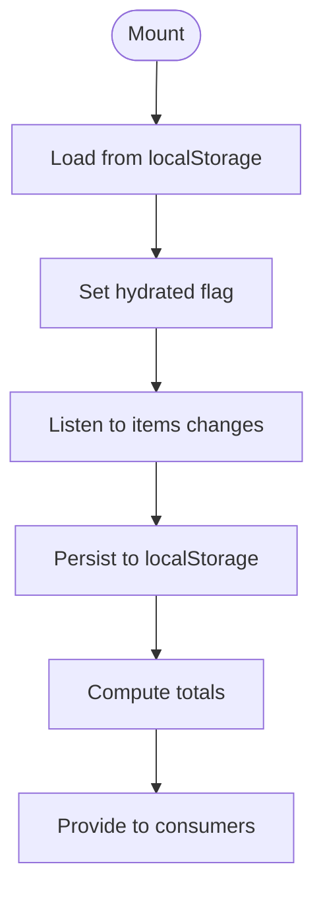

**Diagram sources**
- [CartContext.tsx:28-97](file://app/context/CartContext.tsx#L28-L97)

**Section sources**
- [CartContext.tsx:28-97](file://app/context/CartContext.tsx#L28-L97)

### Site Content Context: Optimistic Updates and Image Upload Pipeline
- Loads site_content rows into a map; falls back to defaults if fetch fails
- Optimistically updates text keys before persisting
- Uploads images via /api/upload, then persists the public URL under a key

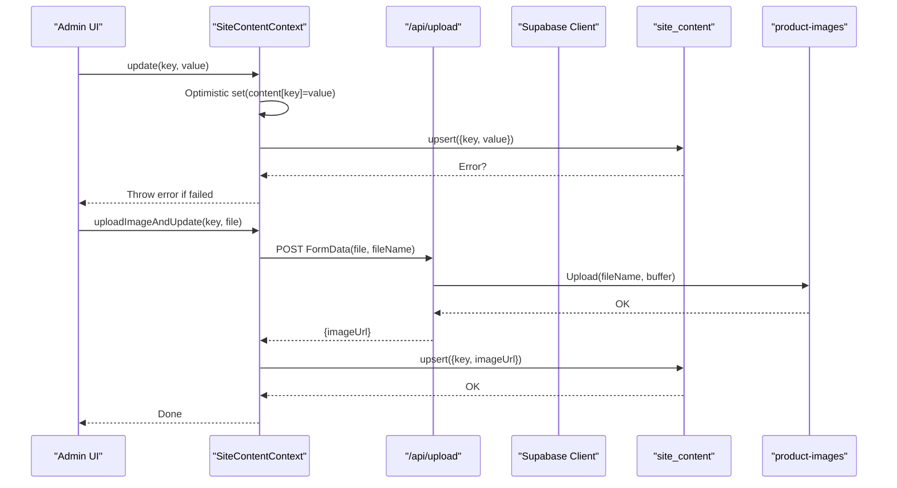

**Diagram sources**
- [SiteContentContext.tsx:22-103](file://app/context/SiteContentContext.tsx#L22-L103)
- [route.ts:4-66](file://app/api/upload/route.ts#L4-L66)

**Section sources**
- [SiteContentContext.tsx:22-103](file://app/context/SiteContentContext.tsx#L22-L103)
- [route.ts:4-66](file://app/api/upload/route.ts#L4-L66)

### Hero Slides Context: Defaults and Ordering
- Starts with DEFAULT_SLIDES until DB loads
- Supports add/update/delete/reorder with optimistic UI updates
- Filters active slides and sorts by sort_order

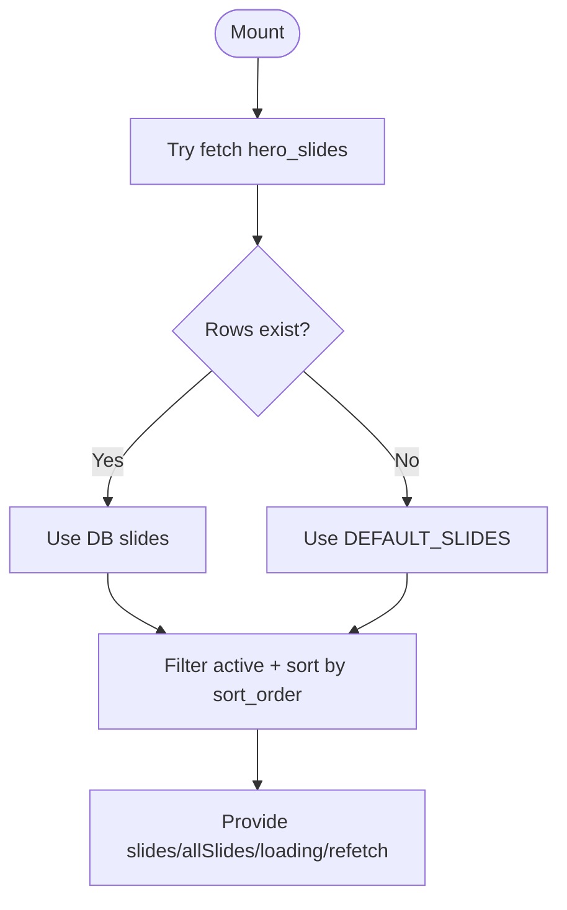

**Diagram sources**
- [HeroSlidesContext.tsx:157-283](file://app/context/HeroSlidesContext.tsx#L157-L283)

**Section sources**
- [HeroSlidesContext.tsx:157-283](file://app/context/HeroSlidesContext.tsx#L157-L283)

### Language Context: i18n and RTL
- Toggles language and sets html lang/dir attributes
- Resolves translations using SiteContentContext with fallbacks

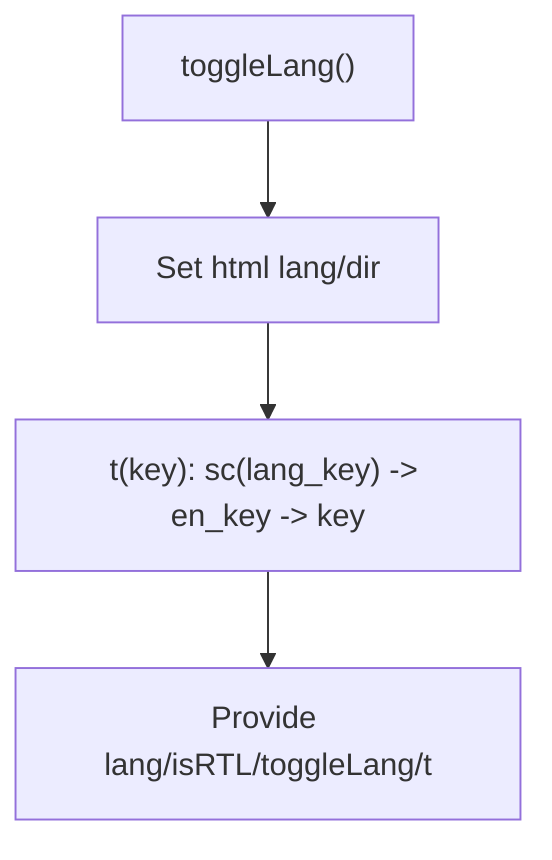

**Diagram sources**
- [LanguageContext.tsx:17-51](file://app/context/LanguageContext.tsx#L17-L51)

**Section sources**
- [LanguageContext.tsx:17-51](file://app/context/LanguageContext.tsx#L17-L51)

### Root Layout: Provider Composition
- Composes providers in a fixed order to establish global state availability

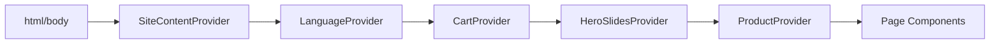

**Diagram sources**
- [layout.tsx:57-82](file://app/layout.tsx#L57-L82)

**Section sources**
- [layout.tsx:57-82](file://app/layout.tsx#L57-L82)

### Dashboard Page: End-to-end Upload and Save
- Validates connection to Supabase
- Uploads main and additional images via /api/upload
- Saves product metadata to products table
- Uses context methods to persist and refresh

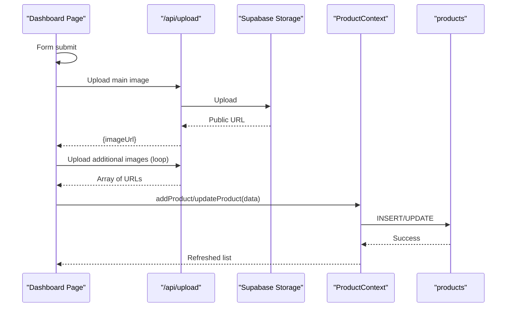

**Diagram sources**
- [page.tsx (Dashboard):152-233](file://app/dashboard/page.tsx#L152-L233)
- [route.ts:4-66](file://app/api/upload/route.ts#L4-L66)
- [ProductContext.tsx:84-100](file://app/context/ProductContext.tsx#L84-L100)

**Section sources**
- [page.tsx (Dashboard):152-233](file://app/dashboard/page.tsx#L152-L233)

### Product Details Page: Direct Query and Add-to-Cart
- Fetches a single product and related products by category
- Adds selected size item to cart using CartContext

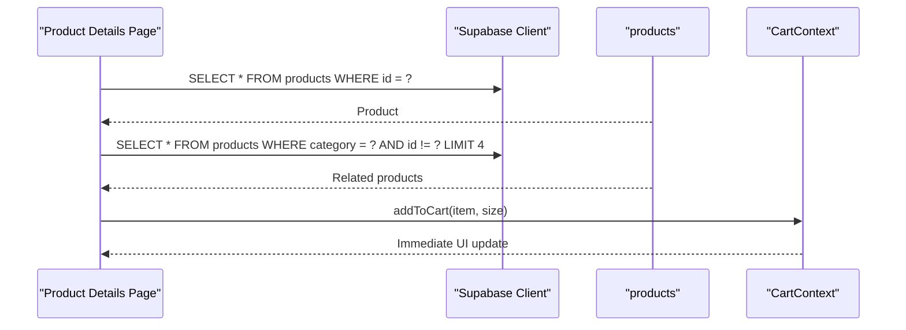

**Diagram sources**
- [page.tsx (Product Details):43-74](file://app/product/[id]/page.tsx#L43-L74)
- [CartContext.tsx:49-60](file://app/context/CartContext.tsx#L49-L60)

**Section sources**
- [page.tsx (Product Details):43-74](file://app/product/[id]/page.tsx#L43-L74)
- [CartContext.tsx:49-60](file://app/context/CartContext.tsx#L49-L60)

## Dependency Analysis
- Shared client dependency: All contexts import the Supabase client from lib/supabase.ts
- Context composition: layout.tsx wires providers in a specific order
- API route dependency: Uploads are handled server-side to avoid CORS and adblocker issues
- Database schema: RLS policies and columns defined in supabase-setup.sql enable public access for demo purposes

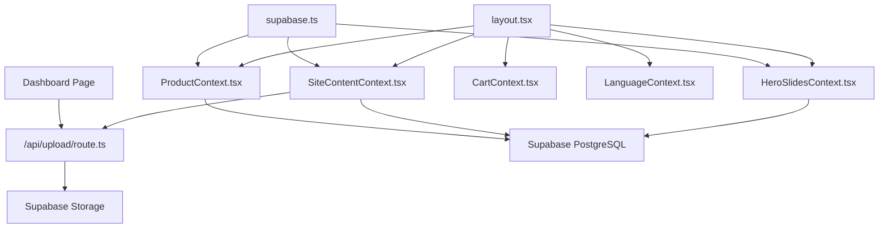

**Diagram sources**
- [supabase.ts:1-46](file://lib/supabase.ts#L1-L46)
- [layout.tsx:57-82](file://app/layout.tsx#L57-L82)
- [route.ts:4-66](file://app/api/upload/route.ts#L4-L66)

**Section sources**
- [supabase-setup.sql:1-137](file://supabase-setup.sql#L1-L137)

## Performance Considerations
- Debouncing
  - Implement debounced search/filter in product listing pages to reduce query frequency during typing.
  - Debounce input handlers for dynamic fields (e.g., notes, descriptions) before triggering refetch or analytics.
- Pagination
  - Replace full-table selects with offset-based or cursor-based pagination for large catalogs.
  - Use infinite scroll or “load more” buttons to progressively load products.
- Real-time efficiency
  - Keep subscriptions scoped to relevant channels and tables; unsubscribe on component unmount (already done in ProductContext).
  - Consider filtering events at the database level using Postgres filters if supported by your setup.
- Caching patterns
  - Cache product lists in memory within Context to avoid redundant refetches.
  - For static assets (images), rely on browser cache and CDN; consider adding cache headers via Supabase Storage policies.
- Optimistic updates
  - Apply immediate UI changes for non-critical mutations (e.g., site content text) and revert on failure.
- Rendering optimization
  - Memoize expensive computations (e.g., totals) and use stable references for callbacks to prevent unnecessary re-renders.

[No sources needed since this section provides general guidance]

## Troubleshooting Guide
- Missing or placeholder environment variables
  - The client logs an informational message when placeholders are detected and uses fallback credentials.
  - Ensure NEXT_PUBLIC_SUPABASE_URL and NEXT_PUBLIC_SUPABASE_ANON_KEY are set correctly in .env.local.
- Network failures and RLS errors
  - Product details page catches and logs errors; dashboard shows connection status and messages.
  - Verify Supabase RLS policies allow public read/write for demo mode.
- Upload failures
  - The upload API returns structured JSON errors; check response status and message.
  - Confirm the product-images bucket exists and is public.
- Real-time not updating
  - Ensure the channel is subscribed and not removed prematurely.
  - Confirm postgres_changes events are enabled for the target table.

**Section sources**
- [supabase.ts:35-39](file://lib/supabase.ts#L35-L39)
- [page.tsx (Dashboard):20-36](file://app/dashboard/page.tsx#L20-L36)
- [route.ts:43-66](file://app/api/upload/route.ts#L43-L66)
- [supabase-setup.sql:17-33](file://supabase-setup.sql#L17-L33)

## Conclusion
The Nubia Perfume platform implements a clean, unidirectional data flow from Supabase to React components via Context providers. Real-time subscriptions keep the UI synchronized, while optimistic updates improve perceived responsiveness. The upload pipeline leverages Next.js API routes to securely store files in Supabase Storage and persist URLs in the database. Robust error handling and fallbacks ensure resilience, and performance can be further enhanced with debouncing, pagination, and caching strategies.