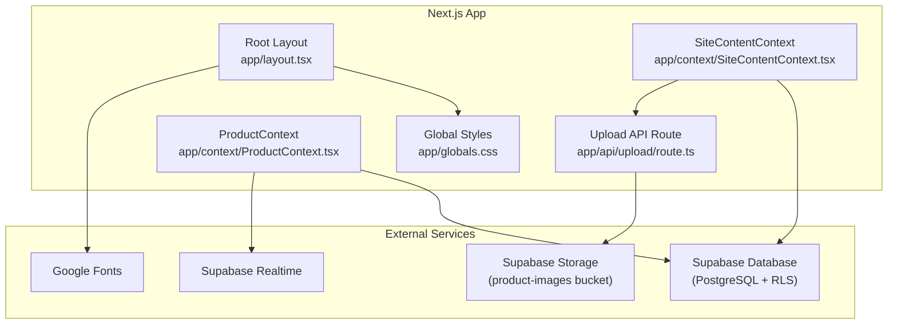
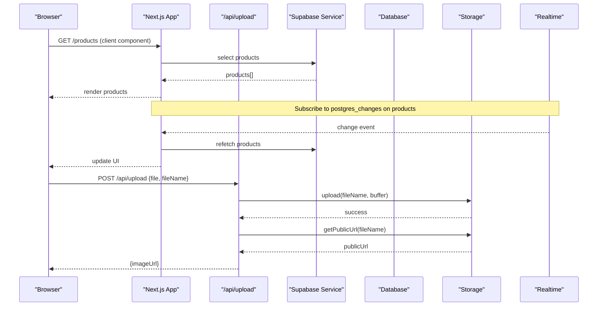
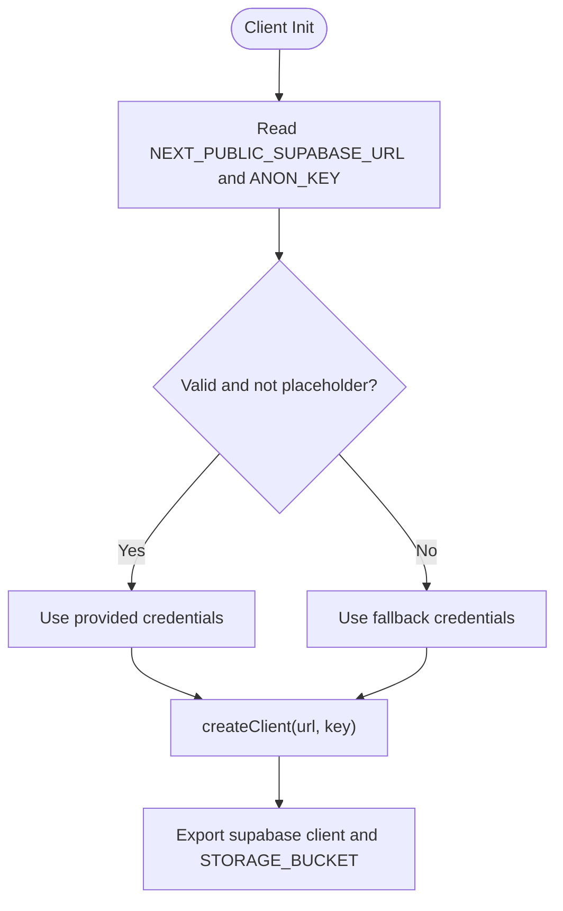
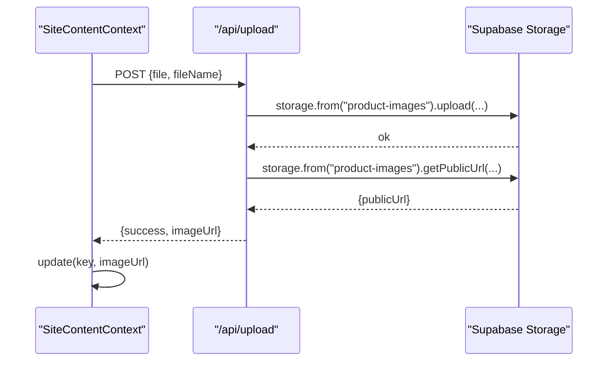
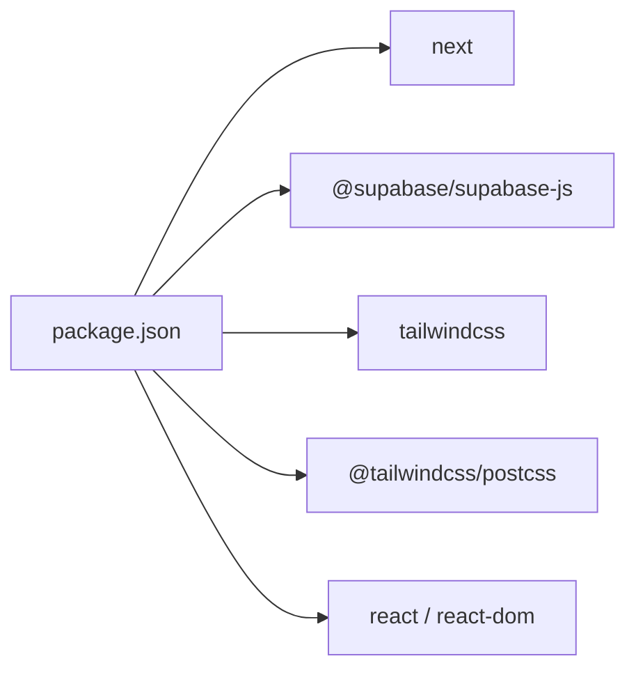

# Integration Architecture

<cite>
**Referenced Files in This Document**
- [next.config.ts](file://next.config.ts)
- [postcss.config.mjs](file://postcss.config.mjs)
- [tsconfig.json](file://tsconfig.json)
- [package.json](file://package.json)
- [lib/supabase.ts](file://lib/supabase.ts)
- [app/api/upload/route.ts](file://app/api/upload/route.ts)
- [supabase-setup.sql](file://supabase-setup.sql)
- [app/layout.tsx](file://app/layout.tsx)
- [app/globals.css](file://app/globals.css)
- [app/context/ProductContext.tsx](file://app/context/ProductContext.tsx)
- [app/context/SiteContentContext.tsx](file://app/context/SiteContentContext.tsx)
</cite>

## Table of Contents
1. Introduction
2. Project Structure
3. Core Components
4. Architecture Overview
5. Detailed Component Analysis
6. Dependency Analysis
7. Performance Considerations
8. Troubleshooting Guide
9. Conclusion

## Introduction
This document describes the integration architecture and system boundaries for external services, focusing on Supabase (database, storage, real-time), Next.js configuration (image optimization, fonts, build-time settings), CSS-in-JS with Tailwind v4 and PostCSS pipeline, TypeScript compilation, security considerations (environment variables, CORS, API route authentication), and deployment topology including CDN usage and monitoring integration points.

## Project Structure
The application is a Next.js app using:
- Supabase client library for database and storage operations
- Tailwind CSS v4 via PostCSS
- Google Fonts and local font files
- Server API routes for secure file uploads to Supabase Storage
- React Context providers for data and UI state

**Diagram sources**
- [app/layout.tsx:1-83](file://app/layout.tsx#L1-L83)
- [app/globals.css:1-20](file://app/globals.css#L1-L20)
- [app/context/ProductContext.tsx:1-116](file://app/context/ProductContext.tsx#L1-L116)
- [app/context/SiteContentContext.tsx:1-110](file://app/context/SiteContentContext.tsx#L1-L110)
- [app/api/upload/route.ts:1-67](file://app/api/upload/route.ts#L1-L67)

**Section sources**
- [app/layout.tsx:1-83](file://app/layout.tsx#L1-L83)
- [app/globals.css:1-20](file://app/globals.css#L1-L20)
- [app/context/ProductContext.tsx:1-116](file://app/context/ProductContext.tsx#L1-L116)
- [app/context/SiteContentContext.tsx:1-110](file://app/context/SiteContentContext.tsx#L1-L110)
- [app/api/upload/route.ts:1-67](file://app/api/upload/route.ts#L1-L67)

## Core Components
- Supabase client initialization and environment validation
- Image upload server route
- Real-time product updates
- Site content management with image uploads
- Next.js image domain allowlist
- Tailwind v4 and PostCSS pipeline
- TypeScript compilation settings
- Font loading strategy

Key responsibilities:
- lib/supabase.ts: Client creation, fallback credentials, and storage bucket constant
- app/api/upload/route.ts: Secure server-side upload to Supabase Storage
- app/context/ProductContext.tsx: Data fetching and real-time subscriptions
- app/context/SiteContentContext.tsx: Dynamic site content and image URL persistence
- next.config.ts: Remote image patterns for Supabase domains
- postcss.config.mjs: Tailwind v4 plugin registration
- tsconfig.json: Strict TS config, path aliases, bundler module resolution
- package.json: Dependencies and scripts

**Section sources**
- [lib/supabase.ts:1-46](file://lib/supabase.ts#L1-L46)
- [app/api/upload/route.ts:1-67](file://app/api/upload/route.ts#L1-L67)
- [app/context/ProductContext.tsx:1-116](file://app/context/ProductContext.tsx#L1-L116)
- [app/context/SiteContentContext.tsx:1-110](file://app/context/SiteContentContext.tsx#L1-L110)
- [next.config.ts:1-15](file://next.config.ts#L1-L15)
- [postcss.config.mjs:1-8](file://postcss.config.mjs#L1-L8)
- [tsconfig.json:1-35](file://tsconfig.json#L1-L35)
- [package.json:1-29](file://package.json#L1-L29)

## Architecture Overview
High-level flow:
- Client components fetch products and site content from Supabase via the JS client
- Real-time subscriptions keep UI in sync with database changes
- Image uploads are routed through a Next.js API endpoint to avoid browser CORS issues and centralize credential handling
- Images served from Supabase Storage are optimized by Next.js Image via remotePatterns
- Fonts are loaded via next/font/google and local @font-face declarations

**Diagram sources**
- [app/context/ProductContext.tsx:49-82](file://app/context/ProductContext.tsx#L49-L82)
- [app/api/upload/route.ts:1-67](file://app/api/upload/route.ts#L1-L67)
- [lib/supabase.ts:1-46](file://lib/supabase.ts#L1-L46)

## Detailed Component Analysis

### Supabase Integration Patterns
- Database connections
  - Client created with environment variables; validated and falls back to defaults if placeholders are detected
  - Public read/write policies defined for demo purposes
- Storage operations
  - Dedicated server route handles uploads to the product-images bucket
  - Returns public URLs for client consumption
- Real-time subscriptions
  - Product list subscribes to all changes on the products table and refetches on events

**Diagram sources**
- [lib/supabase.ts:1-46](file://lib/supabase.ts#L1-L46)

**Section sources**
- [lib/supabase.ts:1-46](file://lib/supabase.ts#L1-L46)
- [supabase-setup.sql:1-137](file://supabase-setup.sql#L1-L137)

#### Database Schema and Policies
- Tables: products, site_content, hero_slides
- Row Level Security enabled with permissive policies for demo
- Additional columns added via migrations for categories, notes, sizes, images, video_url, gender

**Section sources**
- [supabase-setup.sql:1-137](file://supabase-setup.sql#L1-L137)

#### Real-time Subscriptions
- ProductContext subscribes to postgres_changes on public.products
- On any change, it refetches the full product list to keep UI consistent

**Section sources**
- [app/context/ProductContext.tsx:64-82](file://app/context/ProductContext.tsx#L64-L82)

#### Storage Upload Flow
- Client calls /api/upload with FormData
- Server constructs Supabase client, uploads file, retrieves public URL, returns JSON
- SiteContentContext uses this route to persist image URLs into site_content

**Diagram sources**
- [app/context/SiteContentContext.tsx:71-96](file://app/context/SiteContentContext.tsx#L71-L96)
- [app/api/upload/route.ts:1-67](file://app/api/upload/route.ts#L1-L67)

**Section sources**
- [app/context/SiteContentContext.tsx:71-96](file://app/context/SiteContentContext.tsx#L71-L96)
- [app/api/upload/route.ts:1-67](file://app/api/upload/route.ts#L1-L67)

### Next.js Configuration
- Image optimization
  - Remote patterns allow images from *.supabase.co
- Build-time optimizations
  - Scripts for dev/build/start/lint
  - Strict TypeScript and bundler module resolution
- Fonts
  - Google Fonts via next/font/google with variable-based CSS custom properties
  - Local fonts via @font-face in global styles

**Section sources**
- [next.config.ts:1-15](file://next.config.ts#L1-L15)
- [package.json:1-29](file://package.json#L1-L29)
- [app/layout.tsx:13-43](file://app/layout.tsx#L13-L43)
- [app/globals.css:1-8](file://app/globals.css#L1-L8)

### CSS-in-JS with Tailwind v4 and PostCSS Pipeline
- Tailwind v4 integrated via @tailwindcss/postcss plugin
- Global CSS defines design tokens, typography, and layout utilities
- No additional CSS-in-JS runtime; styling is primarily utility-first with CSS variables

**Section sources**
- [postcss.config.mjs:1-8](file://postcss.config.mjs#L1-L8)
- [app/globals.css:16-35](file://app/globals.css#L16-L35)

### TypeScript Compilation Settings
- Target ES2017, strict mode, isolatedModules, esModuleInterop
- Module resolution set to bundler for Next.js compatibility
- Path alias @/* mapped to root for cleaner imports
- Includes generated types and .mts files

**Section sources**
- [tsconfig.json:1-35](file://tsconfig.json#L1-L35)

## Dependency Analysis
External dependencies and their roles:
- @supabase/supabase-js: Database, Storage, Realtime client
- next: Framework providing routing, API routes, image optimization, font loader
- react/react-dom: UI runtime
- tailwindcss and @tailwindcss/postcss: Styling pipeline
- gsap: Animations (not part of integration boundary but used in pages)

**Diagram sources**
- [package.json:11-27](file://package.json#L11-L27)

**Section sources**
- [package.json:1-29](file://package.json#L1-L29)

## Performance Considerations
- Image optimization
  - Use Next.js Image with remotePatterns for Supabase-hosted images to enable automatic resizing and caching
- Fonts
  - Prefer next/font/google with display swap to reduce layout shifts
  - Local fonts via @font-face with subset ranges to minimize payload
- Real-time
  - Refetching entire product list on every change may be heavy at scale; consider pagination or targeted queries
- Storage
  - Ensure appropriate file size limits and MIME type checks in the upload route
- Build
  - Keep dependencies minimal; leverage incremental builds and tree-shaking

[No sources needed since this section provides general guidance]

## Troubleshooting Guide
Common issues and resolutions:
- Missing or placeholder environment variables
  - The client logs when placeholders are detected and falls back to defaults
  - Ensure NEXT_PUBLIC_SUPABASE_URL and NEXT_PUBLIC_SUPABASE_ANON_KEY are set correctly
- CORS and upload failures
  - Always use the server route for uploads; direct browser uploads to Supabase Storage can fail due to CORS or ad blockers
- Realtime not updating
  - Verify RLS policies allow the anon role to subscribe and that the channel name matches the subscription
- Image not displaying
  - Confirm the image domain is allowed in next.config.ts remotePatterns and that the bucket is public

**Section sources**
- [lib/supabase.ts:27-41](file://lib/supabase.ts#L27-L41)
- [app/api/upload/route.ts:17-26](file://app/api/upload/route.ts#L17-L26)
- [app/context/ProductContext.tsx:64-82](file://app/context/ProductContext.tsx#L64-L82)
- [next.config.ts:3-12](file://next.config.ts#L3-L12)

## Conclusion
The application integrates Supabase across database, storage, and real-time layers with clear separation between client and server responsibilities. Next.js configuration enables efficient image delivery and font loading, while Tailwind v4 and PostCSS provide a modern styling pipeline. Security relies on environment variables and server-side upload handling. For production, strengthen RLS policies, add API route authentication, and integrate monitoring and CDN strategies as outlined below.

[No sources needed since this section summarizes without analyzing specific files]

## Appendices

### Security Considerations
- Environment variables
  - Use NEXT_PUBLIC_* only for non-secret values shared with the browser
  - Avoid committing secrets; validate presence and format at runtime
- CORS policies
  - Restrict allowed origins in Supabase dashboard
  - Use server routes for sensitive operations like uploads
- API route authentication
  - Add middleware to verify session tokens or API keys before allowing write operations
  - Enforce rate limiting and input validation

[No sources needed since this section provides general guidance]

### Deployment Topology, CDN, and Monitoring
- Deployment
  - Deploy Next.js on a platform with edge capabilities (e.g., Vercel) for optimal performance
- CDN
  - Serve static assets and images via CDN; Supabase Storage supports CDN endpoints
  - Configure cache headers for long-lived assets
- Monitoring
  - Integrate error tracking (e.g., Sentry) in client and server code
  - Log API route errors and Supabase operation outcomes
  - Monitor real-time connection health and reconnection attempts

[No sources needed since this section provides general guidance]