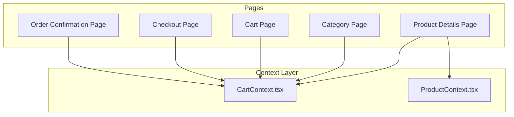
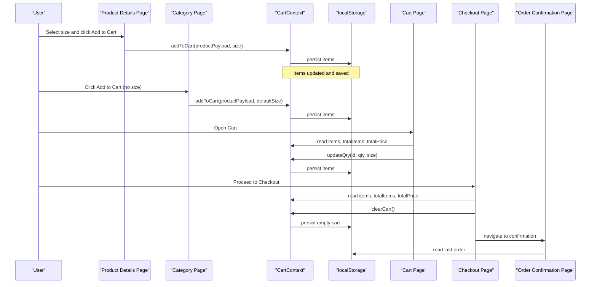
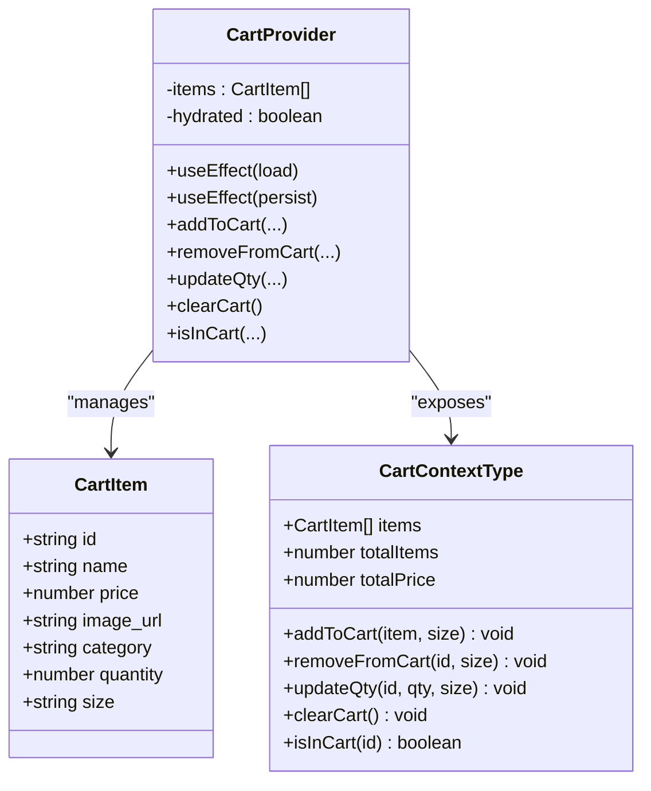
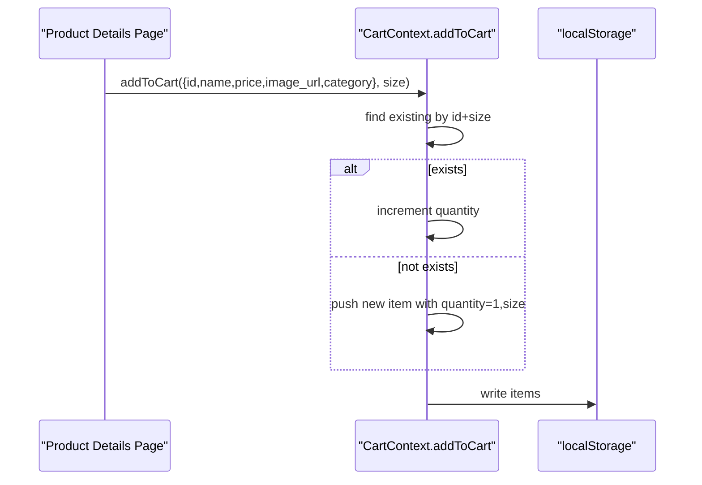
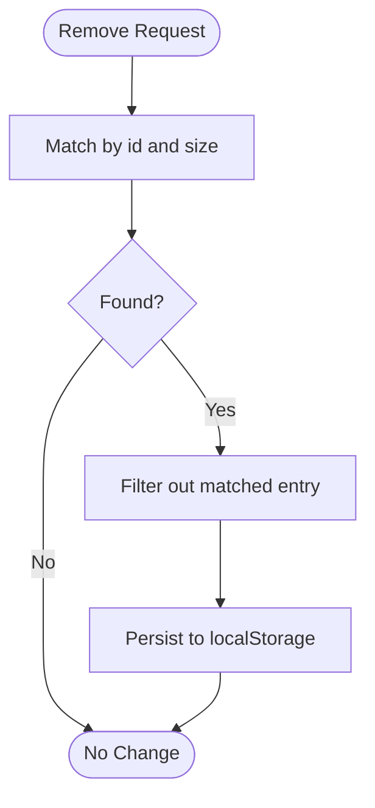
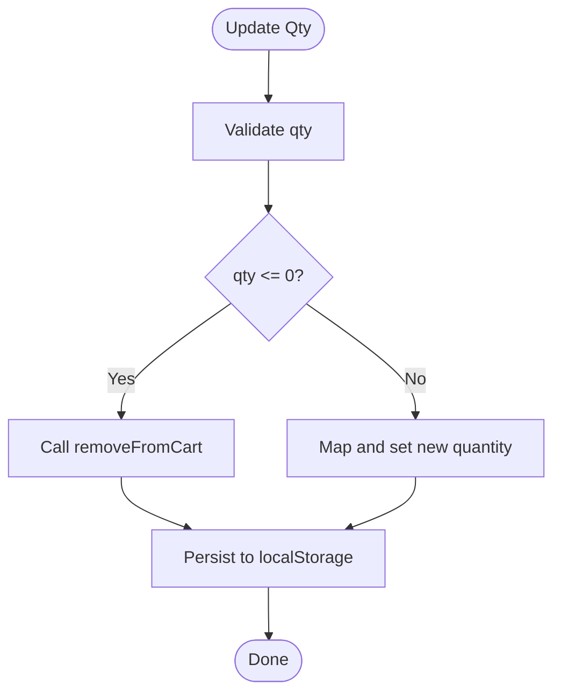
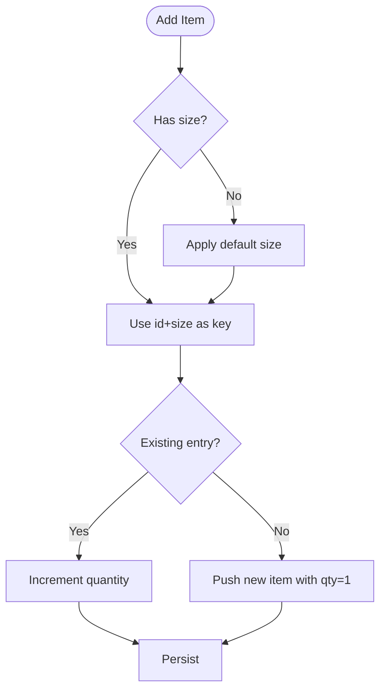
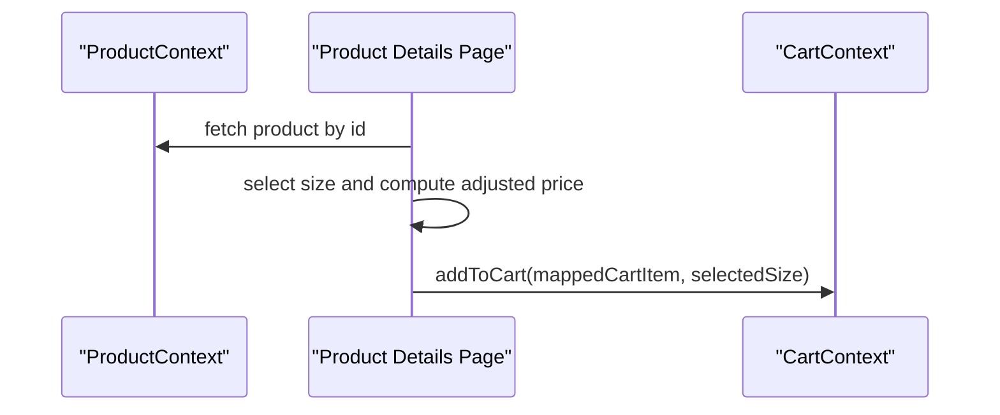
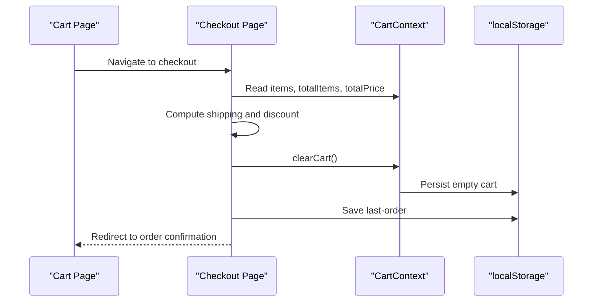
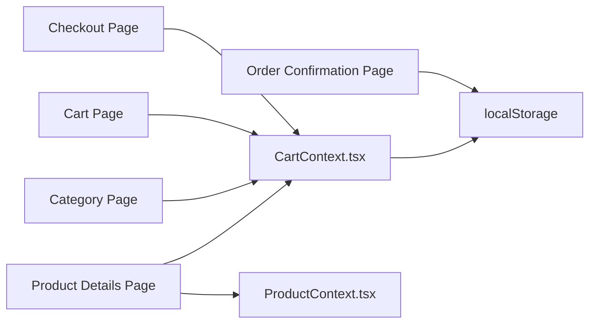

# Cart Context

<cite>
**Referenced Files in This Document**
- [CartContext.tsx](file://app/context/CartContext.tsx)
- [page.tsx (Product Details)](file://app/product/[id]/page.tsx)
- [page.tsx (Category)](file://app/category/page.tsx)
- [page.tsx (Cart)](file://app/cart/page.tsx)
- [page.tsx (Checkout)](file://app/checkout/page.tsx)
- [page.tsx (Order Confirmation)](file://app/order-confirmation/page.tsx)
- [ProductContext.tsx](file://app/context/ProductContext.tsx)
</cite>

## Table of Contents
1. [Introduction](#introduction)
2. [Project Structure](#project-structure)
3. [Core Components](#core-components)
4. [Architecture Overview](#architecture-overview)
5. [Detailed Component Analysis](#detailed-component-analysis)
6. [Dependency Analysis](#dependency-analysis)
7. [Performance Considerations](#performance-considerations)
8. [Troubleshooting Guide](#troubleshooting-guide)
9. [Conclusion](#conclusion)
10. [Appendices](#appendices)

## Introduction
This document explains the CartContext implementation and how it manages shopping cart state across the application. It covers add/remove operations, quantity updates, size variant handling, localStorage persistence, item totals and counts, integration with product data, and checkout flow. It also addresses edge cases such as duplicate items, invalid quantities, and cart cleanup.

## Project Structure
The cart is implemented as a React context provider that exposes methods to update cart state and derived values like total items and total price. Pages consume this context to render interactive UIs for browsing products, editing the cart, and completing checkout.

**Diagram sources**
- [CartContext.tsx:1-104](file://app/context/CartContext.tsx#L1-L104)
- [ProductContext.tsx:1-116](file://app/context/ProductContext.tsx#L1-L116)
- [page.tsx (Product Details):1-200](file://app/product/[id]/page.tsx#L1-L200)
- [page.tsx (Category):1-120](file://app/category/page.tsx#L1-L120)
- [page.tsx (Cart):1-120](file://app/cart/page.tsx#L1-L120)
- [page.tsx (Checkout):1-120](file://app/checkout/page.tsx#L1-L120)
- [page.tsx (Order Confirmation):1-60](file://app/order-confirmation/page.tsx#L1-L60)

**Section sources**
- [CartContext.tsx:1-104](file://app/context/CartContext.tsx#L1-L104)
- [ProductContext.tsx:1-116](file://app/context/ProductContext.tsx#L1-L116)

## Core Components
- CartItem interface defines the shape of each cart entry, including id, name, price, image_url, category, quantity, and optional size.
- CartProvider holds the cart items in state, hydrates from localStorage on mount, persists changes to localStorage, and exposes actions: addToCart, removeFromCart, updateQty, clearCart, isInCart.
- Derived values totalItems and totalPrice are computed from the current items array.

Key responsibilities:
- State management: single source of truth for cart items.
- Persistence: read/write to localStorage under a dedicated key.
- Size variants: treat each product+size combination as a unique cart entry.
- Validation: prevent negative or zero quantities by removing the item when needed.

**Section sources**
- [CartContext.tsx:5-24](file://app/context/CartContext.tsx#L5-L24)
- [CartContext.tsx:28-96](file://app/context/CartContext.tsx#L28-L96)

## Architecture Overview
The cart integrates with product pages and category listings to allow adding items with selected sizes. The cart page displays and edits items. Checkout reads the cart, computes shipping and discounts, and clears the cart after order submission. Order confirmation reads last-order from localStorage.

**Diagram sources**
- [page.tsx (Product Details):170-188](file://app/product/[id]/page.tsx#L170-L188)
- [page.tsx (Category):76-82](file://app/category/page.tsx#L76-L82)
- [CartContext.tsx:49-80](file://app/context/CartContext.tsx#L49-L80)
- [page.tsx (Cart):10-12](file://app/cart/page.tsx#L10-L12)
- [page.tsx (Checkout):12-16](file://app/checkout/page.tsx#L12-L16)
- [page.tsx (Order Confirmation):13-18](file://app/order-confirmation/page.tsx#L13-L18)

## Detailed Component Analysis

### CartContext Implementation
- Data model: CartItem includes id, name, price, image_url, category, quantity, and optional size.
- Provider state: items array and hydration flag to avoid writing before initial load.
- Hydration: On mount, attempts to read from localStorage and parse into state; sets hydrated flag.
- Persistence: On every change to items (after hydration), writes JSON string to localStorage.
- Actions:
  - addToCart: If an existing entry matches both id and size, increments quantity; otherwise appends new item with quantity 1 and provided size.
  - removeFromCart: Removes entries matching id and optional size.
  - updateQty: If qty <= 0, removes the item; otherwise updates quantity for matching id and optional size.
  - clearCart: Resets items to empty array.
  - isInCart: Checks if any item has the given id (ignores size).
- Derived values:
  - totalItems: sum of all item quantities.
  - totalPrice: sum of price * quantity for all items.

**Diagram sources**
- [CartContext.tsx:5-24](file://app/context/CartContext.tsx#L5-L24)
- [CartContext.tsx:28-96](file://app/context/CartContext.tsx#L28-L96)

**Section sources**
- [CartContext.tsx:5-24](file://app/context/CartContext.tsx#L5-L24)
- [CartContext.tsx:28-96](file://app/context/CartContext.tsx#L28-L96)

### Add to Cart Flow
- Product details page calculates adjusted price based on selected size and calls addToCart with payload and size.
- Category page adds items without explicit size, relying on default size parameter inside addToCart.

**Diagram sources**
- [page.tsx (Product Details):170-188](file://app/product/[id]/page.tsx#L170-L188)
- [CartContext.tsx:49-60](file://app/context/CartContext.tsx#L49-L60)

**Section sources**
- [page.tsx (Product Details):170-188](file://app/product/[id]/page.tsx#L170-L188)
- [page.tsx (Category):76-82](file://app/category/page.tsx#L76-L82)
- [CartContext.tsx:49-60](file://app/context/CartContext.tsx#L49-L60)

### Remove From Cart Flow
- Cart page triggers removeFromCart with item id and size.
- Context filters out matching entries.

**Diagram sources**
- [page.tsx (Cart):110-116](file://app/cart/page.tsx#L110-L116)
- [CartContext.tsx:62-66](file://app/context/CartContext.tsx#L62-L66)

**Section sources**
- [page.tsx (Cart):110-116](file://app/cart/page.tsx#L110-L116)
- [CartContext.tsx:62-66](file://app/context/CartContext.tsx#L62-L66)

### Quantity Updates Flow
- Cart page uses updateQty to increase/decrease quantity.
- If resulting quantity is zero or less, the item is removed.

**Diagram sources**
- [page.tsx (Cart):121-125](file://app/cart/page.tsx#L121-L125)
- [CartContext.tsx:68-78](file://app/context/CartContext.tsx#L68-L78)

**Section sources**
- [page.tsx (Cart):121-125](file://app/cart/page.tsx#L121-L125)
- [CartContext.tsx:68-78](file://app/context/CartContext.tsx#L68-L78)

### Size Variant Handling
- Each product can have multiple sizes. The cart treats id+size as a unique key.
- Product details page selects a size and passes it to addToCart.
- Default size is applied when no size is provided.

**Diagram sources**
- [page.tsx (Product Details):170-188](file://app/product/[id]/page.tsx#L170-L188)
- [CartContext.tsx:49-60](file://app/context/CartContext.tsx#L49-L60)

**Section sources**
- [page.tsx (Product Details):170-188](file://app/product/[id]/page.tsx#L170-L188)
- [CartContext.tsx:49-60](file://app/context/CartContext.tsx#L49-L60)

### Cart Calculations
- totalItems: sum of all item quantities.
- totalPrice: sum of price multiplied by quantity for each item.
- These values are used in cart summary and checkout totals.

**Section sources**
- [CartContext.tsx:87-88](file://app/context/CartContext.tsx#L87-L88)
- [page.tsx (Cart):142-163](file://app/cart/page.tsx#L142-L163)
- [page.tsx (Checkout):396-418](file://app/checkout/page.tsx#L396-L418)

### Integration With Product Data
- Product details page fetches product data and supports size selection with per-size pricing.
- When adding to cart, it maps product fields to CartItem shape and passes selected size.
- Category page adds items using basic product fields and relies on default size.

**Diagram sources**
- [ProductContext.tsx:49-62](file://app/context/ProductContext.tsx#L49-L62)
- [page.tsx (Product Details):43-74](file://app/product/[id]/page.tsx#L43-L74)
- [page.tsx (Product Details):170-188](file://app/product/[id]/page.tsx#L170-L188)

**Section sources**
- [ProductContext.tsx:49-62](file://app/context/ProductContext.tsx#L49-L62)
- [page.tsx (Product Details):43-74](file://app/product/[id]/page.tsx#L43-L74)
- [page.tsx (Product Details):170-188](file://app/product/[id]/page.tsx#L170-L188)
- [page.tsx (Category):76-82](file://app/category/page.tsx#L76-L82)

### Inventory Validation
- There is no explicit inventory validation in the cart context or product pages. Adding items does not check stock levels.
- Recommendation: Integrate with product data to validate available stock before allowing addToCart.

[No sources needed since this section provides general guidance]

### Checkout Flow Integration
- Checkout page reads cart items and totals, applies shipping rules and promo codes, then clears the cart and navigates to order confirmation.
- Last order details are stored in localStorage for confirmation display.

**Diagram sources**
- [page.tsx (Cart):166-172](file://app/cart/page.tsx#L166-L172)
- [page.tsx (Checkout):12-16](file://app/checkout/page.tsx#L12-L16)
- [page.tsx (Checkout):60-71](file://app/checkout/page.tsx#L60-L71)
- [page.tsx (Checkout):155-167](file://app/checkout/page.tsx#L155-L167)
- [page.tsx (Order Confirmation):13-18](file://app/order-confirmation/page.tsx#L13-L18)

**Section sources**
- [page.tsx (Checkout):12-16](file://app/checkout/page.tsx#L12-L16)
- [page.tsx (Checkout):60-71](file://app/checkout/page.tsx#L60-L71)
- [page.tsx (Checkout):155-167](file://app/checkout/page.tsx#L155-L167)
- [page.tsx (Order Confirmation):13-18](file://app/order-confirmation/page.tsx#L13-L18)

## Dependency Analysis
- CartContext depends only on React primitives and browser localStorage.
- Pages depend on CartContext for state and actions.
- ProductContext supplies product data but is independent of CartContext.

**Diagram sources**
- [CartContext.tsx:32-47](file://app/context/CartContext.tsx#L32-L47)
- [page.tsx (Product Details):1-20](file://app/product/[id]/page.tsx#L1-L20)
- [page.tsx (Category):1-20](file://app/category/page.tsx#L1-L20)
- [page.tsx (Cart):1-12](file://app/cart/page.tsx#L1-L12)
- [page.tsx (Checkout):1-16](file://app/checkout/page.tsx#L1-L16)
- [page.tsx (Order Confirmation):1-18](file://app/order-confirmation/page.tsx#L1-L18)
- [ProductContext.tsx:1-20](file://app/context/ProductContext.tsx#L1-L20)

**Section sources**
- [CartContext.tsx:32-47](file://app/context/CartContext.tsx#L32-L47)
- [ProductContext.tsx:1-20](file://app/context/ProductContext.tsx#L1-L20)

## Performance Considerations
- LocalStorage writes occur on every state change after hydration. For large carts, consider debouncing or batching writes.
- Computed totals iterate over items; keep cart size reasonable or memoize calculations if needed.
- Avoid unnecessary re-renders by ensuring stable callbacks and minimal prop drilling.

[No sources needed since this section provides general guidance]

## Troubleshooting Guide
Common issues and resolutions:
- Duplicate items with different sizes: Ensure size is passed consistently when adding items. The cart treats id+size as unique.
- Invalid quantities: updateQty removes items when qty <= 0. Validate user input to prevent accidental removals.
- Cart not persisting: Check hydration logic and ensure localStorage is accessible. Errors are silently caught; verify environment constraints.
- Clearing cart during checkout: After successful order submission, clearCart empties the cart. Ensure navigation occurs after clearing.

**Section sources**
- [CartContext.tsx:49-78](file://app/context/CartContext.tsx#L49-L78)
- [page.tsx (Checkout):155-167](file://app/checkout/page.tsx#L155-L167)

## Conclusion
The CartContext provides a straightforward, persistent shopping cart solution with support for size variants and essential operations. It integrates cleanly with product and category pages and supports a complete checkout flow. To enhance robustness, consider adding inventory checks, input validation, and performance optimizations for larger carts.

[No sources needed since this section summarizes without analyzing specific files]

## Appendices

### Common Operations Examples
- Add to cart with size: Use product details page’s handleAddToCart which maps product fields and passes selected size.
- Add to cart without size: Use category page’s handler which omits size and relies on default size in addToCart.
- Update quantity: Use cart page’s +/- buttons calling updateQty with id, new quantity, and size.
- Remove item: Use cart page’s remove button calling removeFromCart with id and size.
- Clear cart: Use cart page’s “Clear All” button calling clearCart.

**Section sources**
- [page.tsx (Product Details):170-188](file://app/product/[id]/page.tsx#L170-L188)
- [page.tsx (Category):76-82](file://app/category/page.tsx#L76-L82)
- [page.tsx (Cart):110-125](file://app/cart/page.tsx#L110-L125)
- [CartContext.tsx:49-80](file://app/context/CartContext.tsx#L49-L80)