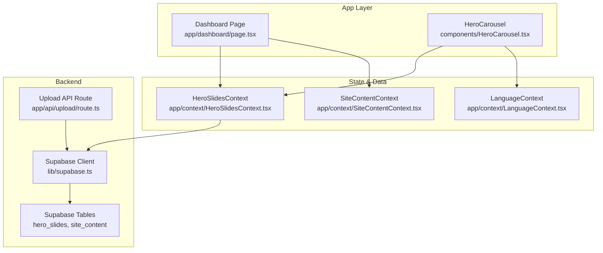
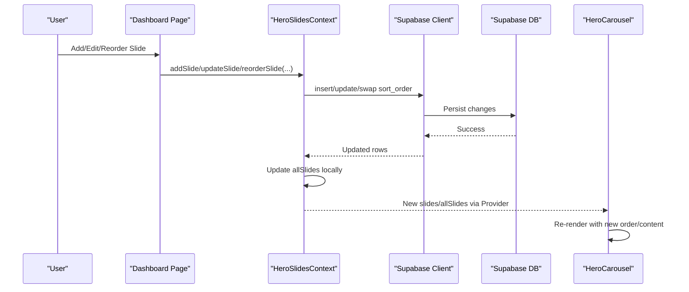
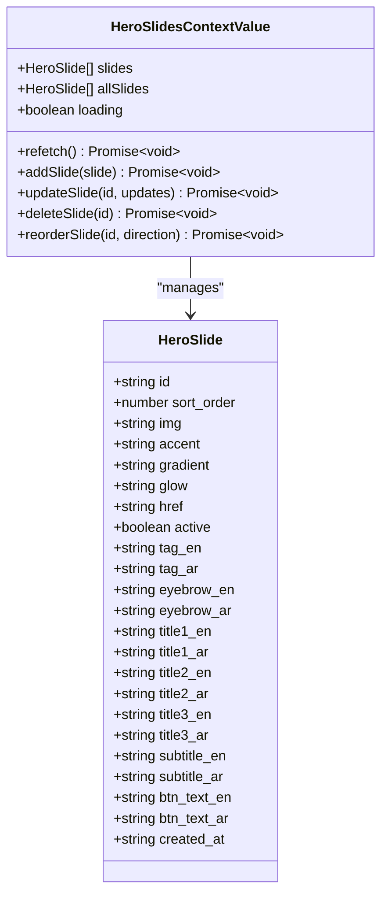
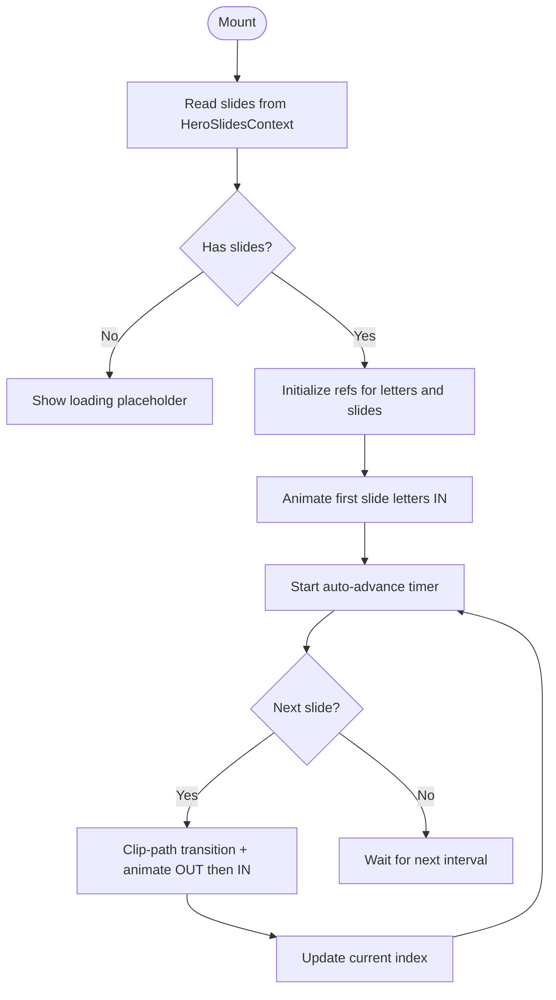
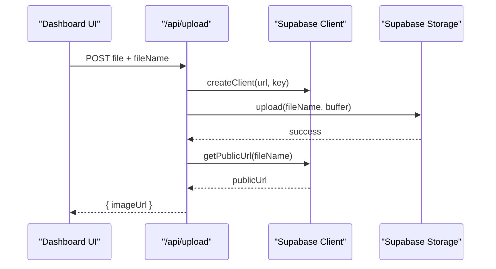
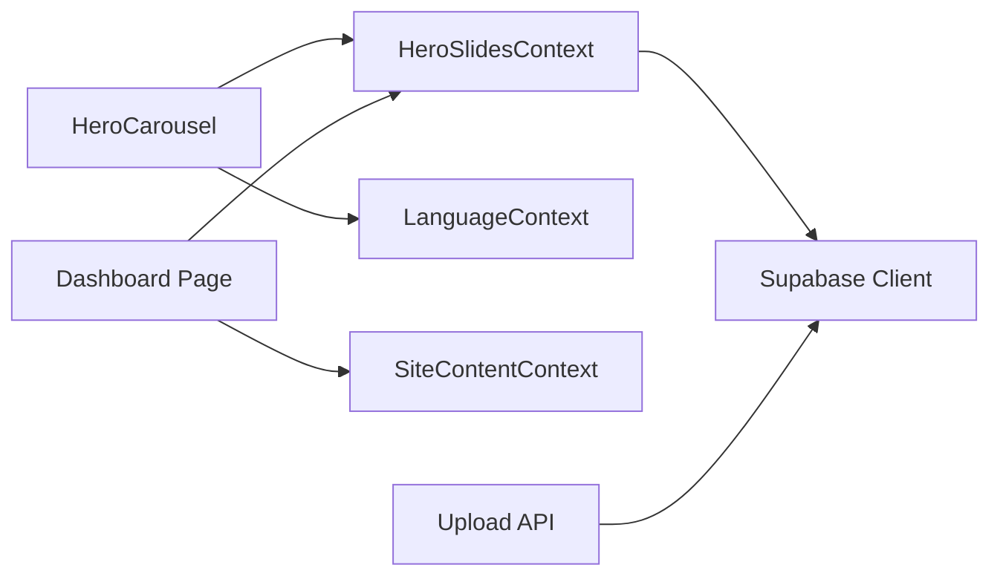

# Hero Slides Context

<cite>
**Referenced Files in This Document**
- [HeroSlidesContext.tsx](file://app/context/HeroSlidesContext.tsx)
- [HeroCarousel.tsx](file://components/HeroCarousel.tsx)
- [supabase.ts](file://lib/supabase.ts)
- [route.ts](file://app/api/upload/route.ts)
- [SiteContentContext.tsx](file://app/context/SiteContentContext.tsx)
- [LanguageContext.tsx](file://app/context/LanguageContext.tsx)
- [defaultTranslations.ts](file://app/context/defaultTranslations.ts)
- [page.tsx](file://app/dashboard/page.tsx)
- [supabase-setup.sql](file://supabase-setup.sql)
</cite>

## Table of Contents
1. [Introduction](#introduction)
2. [Project Structure](#project-structure)
3. [Core Components](#core-components)
4. [Architecture Overview](#architecture-overview)
5. [Detailed Component Analysis](#detailed-component-analysis)
6. [Dependency Analysis](#dependency-analysis)
7. [Performance Considerations](#performance-considerations)
8. [Troubleshooting Guide](#troubleshooting-guide)
9. [Conclusion](#conclusion)
10. [Appendices](#appendices)

## Introduction
This document explains the HeroSlidesContext implementation that powers the hero carousel content and state. It covers how slide data is modeled, loaded from Supabase, and synchronized in real time; how multi-language content is represented and consumed; how slides are manipulated (add, update, delete, reorder); and how the HeroCarousel component renders them. It also includes guidance for non-technical users to manage content via the dashboard, examples of common tasks, and performance considerations for images and transitions.

## Project Structure
The hero carousel feature spans a context provider, a presentation component, a database layer, an upload API route, and a dashboard editor:
- Context and data model: app/context/HeroSlidesContext.tsx
- Presentation: components/HeroCarousel.tsx
- Database client: lib/supabase.ts
- Upload API: app/api/upload/route.ts
- Dashboard UI: app/dashboard/page.tsx
- Multi-language support: app/context/LanguageContext.tsx, app/context/SiteContentContext.tsx, app/context/defaultTranslations.ts
- Database schema: supabase-setup.sql

**Diagram sources**
- [HeroSlidesContext.tsx:157-283](file://app/context/HeroSlidesContext.tsx#L157-L283)
- [HeroCarousel.tsx:12-16](file://components/HeroCarousel.tsx#L12-L16)
- [supabase.ts:1-46](file://lib/supabase.ts#L1-L46)
- [route.ts:1-67](file://app/api/upload/route.ts#L1-L67)
- [page.tsx:11-15](file://app/dashboard/page.tsx#L11-L15)

**Section sources**
- [HeroSlidesContext.tsx:1-290](file://app/context/HeroSlidesContext.tsx#L1-L290)
- [HeroCarousel.tsx:1-806](file://components/HeroCarousel.tsx#L1-L806)
- [supabase.ts:1-46](file://lib/supabase.ts#L1-L46)
- [route.ts:1-67](file://app/api/upload/route.ts#L1-L67)
- [page.tsx:11-15](file://app/dashboard/page.tsx#L11-L15)

## Core Components
- HeroSlidesContext
  - Provides slides (active only), allSlides (including defaults), loading state, and CRUD operations: addSlide, updateSlide, deleteSlide, reorderSlide, refetch.
  - Loads data from Supabase table hero_slides ordered by sort_order. Falls back to DEFAULT_SLIDES if the table is empty or unavailable.
  - Exposes a typed interface for slide fields including English and Arabic variants for tag, eyebrow, titles, subtitle, and button text.
- HeroCarousel
  - Consumes useHeroSlides() to render active slides with GSAP-driven animations, auto-advance, keyboard navigation, and progress dots.
  - Uses LanguageContext for RTL behavior and dot fill direction.
- Dashboard Editor
  - Provides a user-friendly interface to add/edit/delete/reorder slides, upload images, toggle active status, and import default slides into the database.

**Section sources**
- [HeroSlidesContext.tsx:13-37](file://app/context/HeroSlidesContext.tsx#L13-L37)
- [HeroSlidesContext.tsx:139-153](file://app/context/HeroSlidesContext.tsx#L139-L153)
- [HeroSlidesContext.tsx:157-283](file://app/context/HeroSlidesContext.tsx#L157-L283)
- [HeroCarousel.tsx:12-16](file://components/HeroCarousel.tsx#L12-L16)
- [page.tsx:11-15](file://app/dashboard/page.tsx#L11-L15)

## Architecture Overview
The system uses a React Context to centralize hero slide state and operations. The context fetches data from Supabase and maintains both the full list (allSlides) and the filtered view (slides). The HeroCarousel reads the filtered list and animates transitions. The dashboard provides management operations that call context methods, which persist changes to Supabase.

**Diagram sources**
- [HeroSlidesContext.tsx:188-260](file://app/context/HeroSlidesContext.tsx#L188-L260)
- [HeroCarousel.tsx:12-16](file://components/HeroCarousel.tsx#L12-L16)
- [supabase.ts:41-46](file://lib/supabase.ts#L41-L46)

## Detailed Component Analysis

### HeroSlidesContext
Responsibilities:
- State initialization with DEFAULT_SLIDES and loading flag.
- Fetching from Supabase on mount and manual refetch.
- CRUD operations:
  - addSlide: inserts a new row, filters out default placeholders, sorts by sort_order.
  - updateSlide: updates fields and merges into local state.
  - deleteSlide: removes a row and filters from local state.
  - reorderSlide: swaps sort_order between adjacent items and updates local state.
- Filtering active slides and sorting by sort_order for rendering.

Data model:
- HeroSlide includes id, sort_order, img, accent, gradient, glow, href, active, and bilingual fields for tag, eyebrow, three title lines, subtitle, and button text.

Real-time synchronization:
- All mutations update local state immediately after successful server responses, ensuring consistent UI without full reloads.

Error handling:
- Errors thrown during network or DB operations bubble up to callers (dashboard) where they can be surfaced to users.

**Diagram sources**
- [HeroSlidesContext.tsx:13-37](file://app/context/HeroSlidesContext.tsx#L13-L37)
- [HeroSlidesContext.tsx:139-153](file://app/context/HeroSlidesContext.tsx#L139-L153)

**Section sources**
- [HeroSlidesContext.tsx:13-37](file://app/context/HeroSlidesContext.tsx#L13-L37)
- [HeroSlidesContext.tsx:157-283](file://app/context/HeroSlidesContext.tsx#L157-L283)

### HeroCarousel
Responsibilities:
- Reads slides from HeroSlidesContext and manages current index, animation state, and auto-advance timer.
- Animates letter-by-letter entrance/exit using GSAP, clip-path transitions, and shimmer effects.
- Supports keyboard navigation, touch/mouse ripple interactions, and responsive design.
- Renders progress dots with animated fill based on language direction (RTL-aware).

Relationship with HeroSlidesContext:
- Uses useHeroSlides() to get slides (active only) and relies on context to keep data fresh after edits.

Rendering flow:
- On mount, initializes refs and triggers initial animation for the first slide.
- Auto-advances every fixed duration unless there are fewer than two slides.

**Diagram sources**
- [HeroCarousel.tsx:12-16](file://components/HeroCarousel.tsx#L12-L16)
- [HeroCarousel.tsx:103-138](file://components/HeroCarousel.tsx#L103-L138)
- [HeroCarousel.tsx:141-156](file://components/HeroCarousel.tsx#L141-L156)

**Section sources**
- [HeroCarousel.tsx:12-16](file://components/HeroCarousel.tsx#L12-L16)
- [HeroCarousel.tsx:103-138](file://components/HeroCarousel.tsx#L103-L138)
- [HeroCarousel.tsx:141-156](file://components/HeroCarousel.tsx#L141-L156)

### Dashboard Carousel Editor
Responsibilities:
- Presents forms to add/edit slides with image upload, bilingual text fields, styling options, and link targets.
- Provides actions to reorder, toggle active, delete, and import default slides into the database.
- Integrates with HeroSlidesContext methods and shows toast notifications for success/error feedback.

Key features:
- Image upload via /api/upload to Supabase Storage, returning public URLs.
- Import defaults to make system templates editable and deletable.
- Language-specific editing mode for Arabic/English fields.

**Section sources**
- [page.tsx:1368-1619](file://app/dashboard/page.tsx#L1368-L1619)
- [page.tsx:1623-1868](file://app/dashboard/page.tsx#L1623-L1868)

### Multi-language Content Handling
- HeroSlide stores separate fields for English and Arabic content (tag, eyebrow, titles, subtitle, button text).
- LanguageContext toggles lang and dir attributes on <html>, enabling RTL layout when needed.
- SiteContentContext provides global site text and image keys, used across the app for non-slide content.
- Default translations are provided in defaultTranslations.ts as fallbacks.

Usage in carousel:
- HeroCarousel reads isRTL from LanguageContext to adjust dot fill direction and other RTL behaviors.

**Section sources**
- [HeroSlidesContext.tsx:13-37](file://app/context/HeroSlidesContext.tsx#L13-L37)
- [LanguageContext.tsx:17-51](file://app/context/LanguageContext.tsx#L17-L51)
- [SiteContentContext.tsx:22-96](file://app/context/SiteContentContext.tsx#L22-L96)
- [defaultTranslations.ts:1-494](file://app/context/defaultTranslations.ts#L1-L494)
- [HeroCarousel.tsx:12-16](file://components/HeroCarousel.tsx#L12-L16)

### Supabase Integration and Upload Flow
- Supabase client is configured with environment variables or safe fallbacks.
- Upload API route accepts FormData, uploads to Supabase Storage bucket, and returns a public URL.
- Dashboard editors use this route to upload images for slides and site content.

**Diagram sources**
- [route.ts:1-67](file://app/api/upload/route.ts#L1-L67)
- [supabase.ts:1-46](file://lib/supabase.ts#L1-L46)

**Section sources**
- [supabase.ts:1-46](file://lib/supabase.ts#L1-L46)
- [route.ts:1-67](file://app/api/upload/route.ts#L1-L67)

## Dependency Analysis
- HeroSlidesContext depends on Supabase client for data persistence and ordering.
- HeroCarousel depends on HeroSlidesContext for data and LanguageContext for RTL behavior.
- Dashboard depends on HeroSlidesContext for CRUD and on SiteContentContext for general content editing.
- Upload API depends on Supabase client and storage bucket configuration.

**Diagram sources**
- [HeroSlidesContext.tsx:157-283](file://app/context/HeroSlidesContext.tsx#L157-L283)
- [HeroCarousel.tsx:12-16](file://components/HeroCarousel.tsx#L12-L16)
- [page.tsx:11-15](file://app/dashboard/page.tsx#L11-L15)
- [route.ts:1-67](file://app/api/upload/route.ts#L1-L67)

**Section sources**
- [HeroSlidesContext.tsx:157-283](file://app/context/HeroSlidesContext.tsx#L157-L283)
- [HeroCarousel.tsx:12-16](file://components/HeroCarousel.tsx#L12-L16)
- [page.tsx:11-15](file://app/dashboard/page.tsx#L11-L15)
- [route.ts:1-67](file://app/api/upload/route.ts#L1-L67)

## Performance Considerations
- Image loading
  - Use optimized images (WebP/JPEG) and appropriate dimensions.
  - Prefer CDN-hosted images or Supabase Storage with caching headers.
  - Avoid excessive concurrent large uploads; queue uploads and show progress.
- Transitions and animations
  - GSAP animations are GPU-accelerated; avoid heavy filters on mobile.
  - Limit simultaneous animations; ensure clip-path transitions are smooth.
- Data fetching
  - Refetch only when necessary; rely on optimistic local updates for immediate feedback.
  - Sort by sort_order at the database level to minimize client-side sorting overhead.
- Memory and re-renders
  - Keep slide lists lean; filter active slides once in context.
  - Avoid unnecessary re-renders by memoizing callbacks where possible.

[No sources needed since this section provides general guidance]

## Troubleshooting Guide
Common issues and resolutions:
- Missing Supabase credentials
  - Symptom: Fallback credentials logged; connections may fail.
  - Action: Set NEXT_PUBLIC_SUPABASE_URL and NEXT_PUBLIC_SUPABASE_ANON_KEY in .env.local and restart dev server.
- Empty hero_slides table
  - Symptom: Carousel shows default static slides.
  - Action: Use Dashboard “Import Default Slides” to populate the database.
- Upload failures
  - Symptom: Error messages from upload API.
  - Action: Verify storage bucket exists and is public; check file type and size limits.
- Reordering not applied
  - Symptom: Order does not change.
  - Action: Ensure the slide is not a default template; import it first. Check RLS policies allow updates.

**Section sources**
- [supabase.ts:35-39](file://lib/supabase.ts#L35-L39)
- [page.tsx:1598-1619](file://app/dashboard/page.tsx#L1598-L1619)
- [route.ts:43-48](file://app/api/upload/route.ts#L43-L48)
- [supabase-setup.sql:112-133](file://supabase-setup.sql#L112-L133)

## Conclusion
HeroSlidesContext centralizes hero carousel state and operations, providing a robust foundation for managing multi-language slide content with real-time synchronization to Supabase. The HeroCarousel renders these slides with engaging animations and responsive behavior, while the Dashboard offers intuitive tools for non-technical users to add, edit, reorder, and activate slides. Proper image optimization and careful animation usage ensure smooth performance across devices.

[No sources needed since this section summarizes without analyzing specific files]

## Appendices

### Examples for Non-Technical Users
- Adding a new slide
  - Open Dashboard → Hero Carousel tab.
  - Upload a high-quality landscape image.
  - Fill bilingual fields (Tag, Eyebrow, Title lines, Subtitle, Button text).
  - Set target link and optional styling (accent, gradient, glow).
  - Click Create Slide.
- Reordering content
  - In the slides list, click ▲ or ▼ next to a slide to move it up or down.
  - Note: Only database slides can be reordered; import defaults first if needed.
- Handling media assets
  - Use the Upload Slide Image control to select an image.
  - Images are uploaded to Supabase Storage and stored as public URLs.
  - For best results, use WebP/JPEG with reasonable file sizes.

**Section sources**
- [page.tsx:1650-1784](file://app/dashboard/page.tsx#L1650-L1784)
- [page.tsx:1787-1868](file://app/dashboard/page.tsx#L1787-L1868)
- [route.ts:35-58](file://app/api/upload/route.ts#L35-L58)