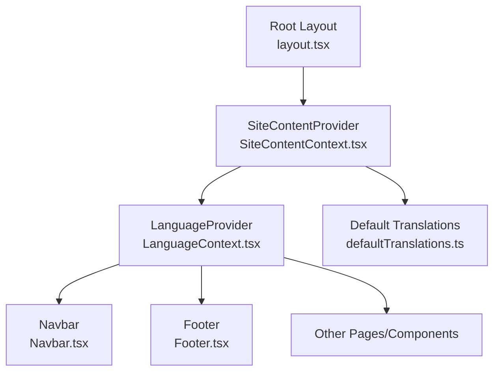
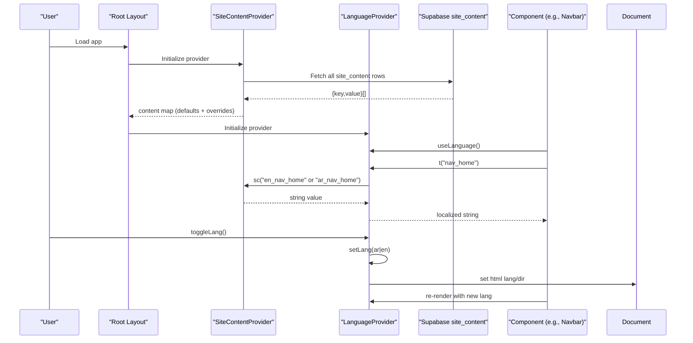
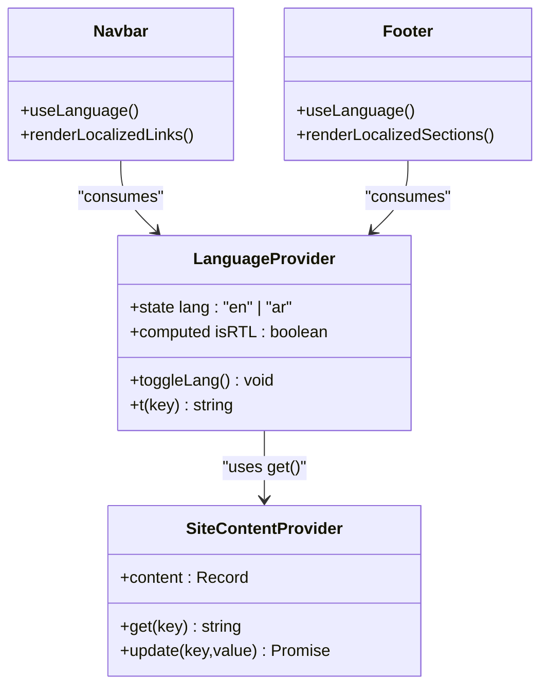
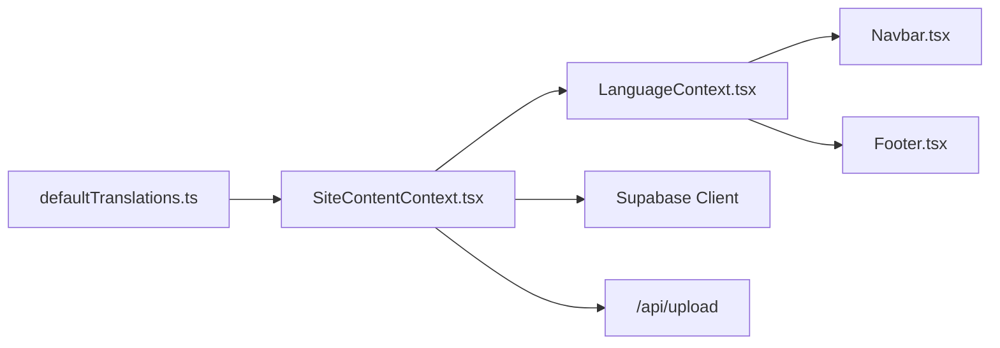
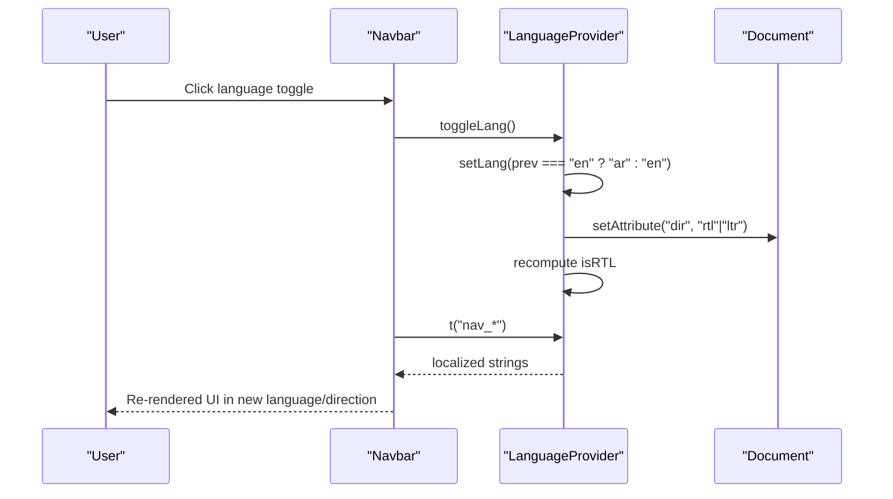
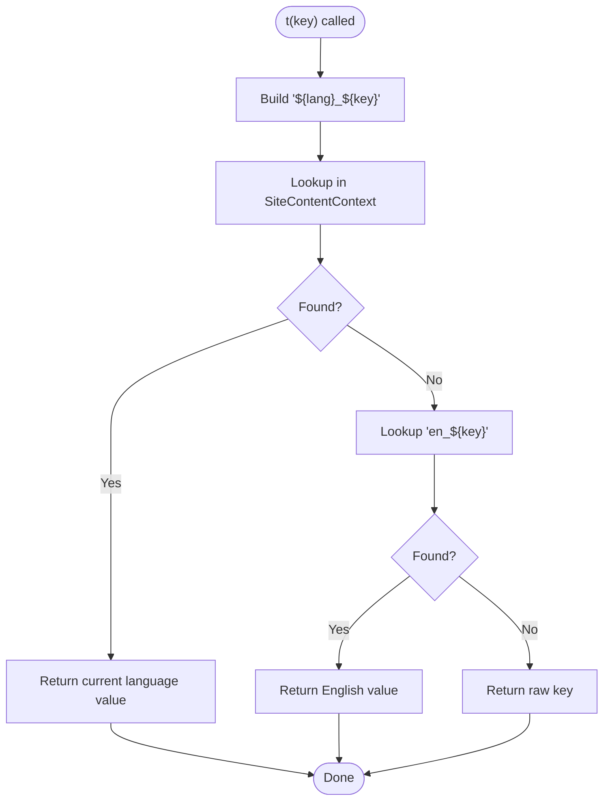

# Language Context

<cite>
**Referenced Files in This Document**
- [LanguageContext.tsx](file://app/context/LanguageContext.tsx)
- [SiteContentContext.tsx](file://app/context/SiteContentContext.tsx)
- [defaultTranslations.ts](file://app/context/defaultTranslations.ts)
- [layout.tsx](file://app/layout.tsx)
- [Navbar.tsx](file://components/Navbar.tsx)
- [Footer.tsx](file://components/Footer.tsx)
</cite>

## Table of Contents
1. [Introduction](#introduction)
2. [Project Structure](#project-structure)
3. [Core Components](#core-components)
4. [Architecture Overview](#architecture-overview)
5. [Detailed Component Analysis](#detailed-component-analysis)
6. [Dependency Analysis](#dependency-analysis)
7. [Performance Considerations](#performance-considerations)
8. [Troubleshooting Guide](#troubleshooting-guide)
9. [Conclusion](#conclusion)
10. [Appendices](#appendices)

## Introduction
This document explains the internationalization (i18n) implementation centered around LanguageContext. The system supports English and Arabic with automatic right-to-left (RTL) layout adaptation, a robust translation key structure, default translations management, and runtime language switching. It also covers how components consume translated content, cultural considerations for Arabic text, and strategies for performance optimization and lazy loading when scaling to large translation sets.

## Project Structure
The i18n stack is composed of:
- A context provider that manages current language, RTL state, and a translation function.
- A site content provider that merges server-managed overrides with local defaults.
- Default translation keys for both supported languages.
- Root layout that wires providers and initializes HTML attributes.
- UI components that consume the language context to render localized strings and adapt directionality.

**Diagram sources**
- [layout.tsx:62-82](file://app/layout.tsx#L62-L82)
- [SiteContentContext.tsx:22-103](file://app/context/SiteContentContext.tsx#L22-L103)
- [LanguageContext.tsx:17-51](file://app/context/LanguageContext.tsx#L17-L51)
- [Navbar.tsx:1-187](file://components/Navbar.tsx#L1-L187)
- [Footer.tsx:1-173](file://components/Footer.tsx#L1-L173)
- [defaultTranslations.ts:1-494](file://app/context/defaultTranslations.ts#L1-L494)

**Section sources**
- [layout.tsx:62-82](file://app/layout.tsx#L62-L82)
- [SiteContentContext.tsx:22-103](file://app/context/SiteContentContext.tsx#L22-L103)
- [LanguageContext.tsx:17-51](file://app/context/LanguageContext.tsx#L17-L51)
- [defaultTranslations.ts:1-494](file://app/context/defaultTranslations.ts#L1-L494)
- [Navbar.tsx:1-187](file://components/Navbar.tsx#L1-L187)
- [Footer.tsx:1-173](file://components/Footer.tsx#L1-L173)

## Core Components
- LanguageProvider: Holds current language, toggles between English and Arabic, updates HTML lang/dir attributes, and exposes a translation function t(key).
- useLanguage: Hook to access language state, RTL flag, toggleLang, and t.
- SiteContentProvider: Loads site_content from the database and merges it with default translations; provides get(key) used by t.
- defaultTranslations: Centralized dictionary of all static UI strings for both languages.

Key behaviors:
- Language switching updates document.documentElement.lang and dir to reflect LTR/RTL.
- Translation lookup prefers current language, falls back to English, then returns the key itself if missing.
- Site-level overrides can be persisted via SiteContentProvider’s update functions.

**Section sources**
- [LanguageContext.tsx:17-51](file://app/context/LanguageContext.tsx#L17-L51)
- [LanguageContext.tsx:53-57](file://app/context/LanguageContext.tsx#L53-L57)
- [SiteContentContext.tsx:22-103](file://app/context/SiteContentContext.tsx#L22-L103)
- [defaultTranslations.ts:1-494](file://app/context/defaultTranslations.ts#L1-L494)

## Architecture Overview
The i18n architecture layers providers at the root and uses a simple key-based lookup strategy.

**Diagram sources**
- [layout.tsx:62-82](file://app/layout.tsx#L62-L82)
- [SiteContentContext.tsx:27-48](file://app/context/SiteContentContext.tsx#L27-L48)
- [LanguageContext.tsx:22-44](file://app/context/LanguageContext.tsx#L22-L44)
- [Navbar.tsx:25-33](file://components/Navbar.tsx#L25-L33)

## Detailed Component Analysis

### LanguageProvider and useLanguage
Responsibilities:
- Maintain current language state and compute isRTL.
- Synchronize <html> attributes on language change.
- Provide toggleLang to switch between en and ar.
- Implement t(key) to resolve localized strings using SiteContentContext.

Translation resolution order:
1. Lookup `${lang}_${key}` in SiteContentContext.
2. Fallback to `en_${key}` if current language lacks a value.
3. Return the raw key if neither exists.

RTL handling:
- Sets document.documentElement.dir to rtl when lang is ar, otherwise ltr.
- Components may additionally apply inline direction styles for specific sections.

Error handling:
- useLanguage throws if called outside LanguageProvider.

Complexity:
- t(key) is O(1) hash lookup.
- Toggle and effect are constant-time operations.

**Section sources**
- [LanguageContext.tsx:17-51](file://app/context/LanguageContext.tsx#L17-L51)
- [LanguageContext.tsx:53-57](file://app/context/LanguageContext.tsx#L53-L57)

#### Class-like relationships

**Diagram sources**
- [LanguageContext.tsx:17-51](file://app/context/LanguageContext.tsx#L17-L51)
- [SiteContentContext.tsx:22-103](file://app/context/SiteContentContext.tsx#L22-L103)
- [Navbar.tsx:1-187](file://components/Navbar.tsx#L1-L187)
- [Footer.tsx:1-173](file://components/Footer.tsx#L1-L173)

### SiteContentProvider and defaultTranslations
Responsibilities:
- Initialize content map with defaultTranslations.
- Fetch site_content from Supabase and merge into the map.
- Provide get(key) to retrieve values with fallback to defaults.
- Support update(key, value) and image upload flow that persists changes.

Data flow:
- On mount, fetch site_content and overlay onto defaults.
- get(key) returns the merged value or empty string if missing.

Fallback behavior:
- If a key is not present in either overrides or defaults, get returns an empty string.
- LanguageProvider’s t adds an additional fallback to English and finally to the key itself.

**Section sources**
- [SiteContentContext.tsx:22-103](file://app/context/SiteContentContext.tsx#L22-L103)
- [defaultTranslations.ts:1-494](file://app/context/defaultTranslations.ts#L1-L494)

### Root Layout Integration
- Wraps application with SiteContentProvider and LanguageProvider.
- Initializes fonts for Latin and Arabic subsets.
- Provides initial html lang="en" and relies on LanguageProvider to update dir dynamically.

**Section sources**
- [layout.tsx:62-82](file://app/layout.tsx#L62-L82)
- [layout.tsx:13-43](file://app/layout.tsx#L13-L43)

### Component Consumption Examples
- Navbar:
  - Uses t("nav_*") for links and labels.
  - Applies style={{ direction }} based on isRTL for navigation elements.
  - Exposes a language toggle button that calls toggleLang.
- Footer:
  - Uses t("footer_*") across sections and applies direction based on isRTL.

These patterns demonstrate consistent consumption of the language context throughout the UI.

**Section sources**
- [Navbar.tsx:25-33](file://components/Navbar.tsx#L25-L33)
- [Navbar.tsx:88-96](file://components/Navbar.tsx#L88-L96)
- [Navbar.tsx:58](file://components/Navbar.tsx#L58)
- [Footer.tsx:28](file://components/Footer.tsx#L28)
- [Footer.tsx:69](file://components/Footer.tsx#L69)
- [Footer.tsx:15](file://components/Footer.tsx#L15)

## Dependency Analysis
High-level dependencies:
- LanguageProvider depends on SiteContentContext for translation retrieval.
- SiteContentProvider depends on Supabase client and API route for persistence.
- Components depend on LanguageProvider via useLanguage.

**Diagram sources**
- [defaultTranslations.ts:1-494](file://app/context/defaultTranslations.ts#L1-L494)
- [SiteContentContext.tsx:27-96](file://app/context/SiteContentContext.tsx#L27-L96)
- [LanguageContext.tsx:17-51](file://app/context/LanguageContext.tsx#L17-L51)
- [Navbar.tsx:1-187](file://components/Navbar.tsx#L1-L187)
- [Footer.tsx:1-173](file://components/Footer.tsx#L1-L173)

**Section sources**
- [SiteContentContext.tsx:27-96](file://app/context/SiteContentContext.tsx#L27-L96)
- [LanguageContext.tsx:17-51](file://app/context/LanguageContext.tsx#L17-L51)

## Performance Considerations
Current implementation characteristics:
- All default translations are bundled in a single module and loaded eagerly.
- Translation lookup is O(1) per key.
- Language switching triggers minimal re-renders due to React state updates.

Optimization opportunities:
- Lazy load translation modules:
  - Split defaultTranslations by feature area (e.g., navbar, hero, footer) and import on demand.
  - Use dynamic imports keyed by language to reduce initial bundle size.
- Memoize heavy computations:
  - Keep t memoized (already done) to avoid unnecessary recalculations.
- Debounce frequent toggles:
  - Not necessary here since toggle is infrequent, but consider debouncing rapid user interactions if needed.
- Cache resolved translations:
  - For computed or pluralized strings, cache results per key and language to avoid recomputation.
- Reduce DOM writes:
  - Batch HTML attribute updates if multiple contexts modify them concurrently.

[No sources needed since this section provides general guidance]

## Troubleshooting Guide
Common issues and resolutions:
- Missing translation key:
  - Symptom: Raw key displayed in UI.
  - Cause: Key not defined in defaultTranslations or site_content.
  - Resolution: Add the key to defaultTranslations for both languages or persist via SiteContentProvider.update.
- Incorrect fallback behavior:
  - Symptom: English text appears in Arabic mode.
  - Cause: Missing Arabic key triggers fallback to English.
  - Resolution: Ensure corresponding ar_* keys exist.
- RTL misalignment:
  - Symptom: Text flows left-to-right in Arabic mode.
  - Cause: Direction not applied at component level or CSS conflicts.
  - Resolution: Apply style={{ direction: isRTL ? "rtl" : "ltr" }} to containers and ensure CSS respects RTL.
- Hydration mismatch:
  - Symptom: Console warnings about hydration.
  - Cause: Initial html lang/dir differs between server and client.
  - Resolution: Keep initial lang="en" in layout and let LanguageProvider update dir after mount.

**Section sources**
- [LanguageContext.tsx:22-44](file://app/context/LanguageContext.tsx#L22-L44)
- [SiteContentContext.tsx:51-54](file://app/context/SiteContentContext.tsx#L51-L54)
- [Navbar.tsx:58](file://components/Navbar.tsx#L58)
- [Footer.tsx:15](file://components/Footer.tsx#L15)

## Conclusion
The LanguageContext implementation provides a clear, extensible foundation for bilingual support with English and Arabic, including automatic RTL adaptation and a straightforward translation key strategy. By leveraging SiteContentProvider for centralized content management and defaultTranslations for comprehensive coverage, the system ensures consistent localization across components. With targeted optimizations like lazy loading and caching, the solution scales well to larger translation sets and more complex formatting needs.

[No sources needed since this section summarizes without analyzing specific files]

## Appendices

### Adding a New Language
Steps:
- Extend the Lang type to include the new code.
- Update LanguageProvider to handle toggling and RTL mapping for the new language.
- Add default translations under the new language prefix in defaultTranslations.
- Ensure any hardcoded strings in pages/components are replaced with t(key) calls.
- Verify HTML attributes and font subsets support the new language.

**Section sources**
- [LanguageContext.tsx:6](file://app/context/LanguageContext.tsx#L6)
- [LanguageContext.tsx:22-30](file://app/context/LanguageContext.tsx#L22-L30)
- [defaultTranslations.ts:1-494](file://app/context/defaultTranslations.ts#L1-L494)
- [layout.tsx:25-43](file://app/layout.tsx#L25-L43)

### Creating Translation Keys
Guidelines:
- Use descriptive, hierarchical keys prefixed by region/component (e.g., nav_home, footer_desc).
- Maintain parallel keys for each language (en_key, ar_key).
- Group related keys logically within defaultTranslations.

**Section sources**
- [defaultTranslations.ts:1-494](file://app/context/defaultTranslations.ts#L1-L494)

### Implementing Locale-Specific Formatting
Recommendations:
- Numbers and dates: Use Intl.NumberFormat and Intl.DateTimeFormat with locale-specific options.
- Pluralization: Build a small helper that selects the correct form based on count and language.
- Currency: Use currency formatting with appropriate locales and symbols.
- Avoid embedding formatted values in translation keys; keep keys semantic and format in components.

[No sources needed since this section provides general guidance]

### RTL Layout Handling and Cultural Considerations
Practices:
- Set document.documentElement.dir based on language.
- Apply direction styles to containers where CSS alone cannot infer direction.
- Mirror margins/paddings using logical properties (margin-inline-start/end) or conditional styles.
- Ensure icons and arrows point in culturally appropriate directions.
- Validate typography with Arabic-capable fonts and proper line heights.

**Section sources**
- [LanguageContext.tsx:22-26](file://app/context/LanguageContext.tsx#L22-L26)
- [Navbar.tsx:58](file://components/Navbar.tsx#L58)
- [Footer.tsx:15](file://components/Footer.tsx#L15)
- [layout.tsx:25-43](file://app/layout.tsx#L25-L43)

### Example Workflows

#### Sequence: Switching Languages

**Diagram sources**
- [Navbar.tsx:88-96](file://components/Navbar.tsx#L88-L96)
- [LanguageContext.tsx:28-30](file://app/context/LanguageContext.tsx#L28-L30)
- [LanguageContext.tsx:22-26](file://app/context/LanguageContext.tsx#L22-L26)
- [LanguageContext.tsx:32-44](file://app/context/LanguageContext.tsx#L32-L44)

#### Flowchart: Translation Lookup

**Diagram sources**
- [LanguageContext.tsx:32-44](file://app/context/LanguageContext.tsx#L32-L44)
- [SiteContentContext.tsx:51-54](file://app/context/SiteContentContext.tsx#L51-L54)