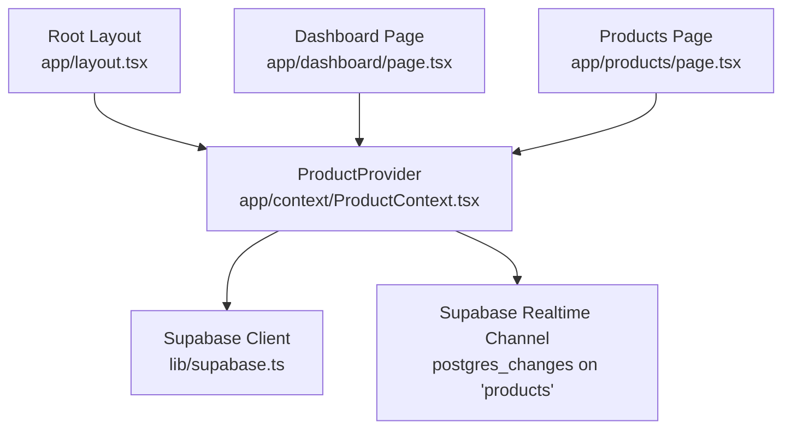
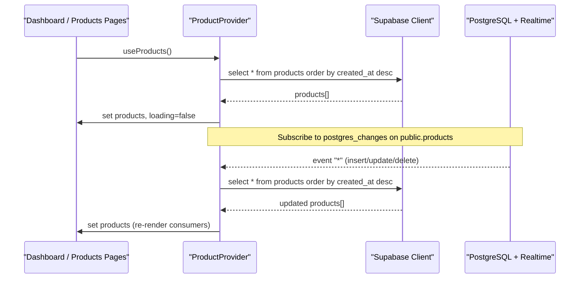
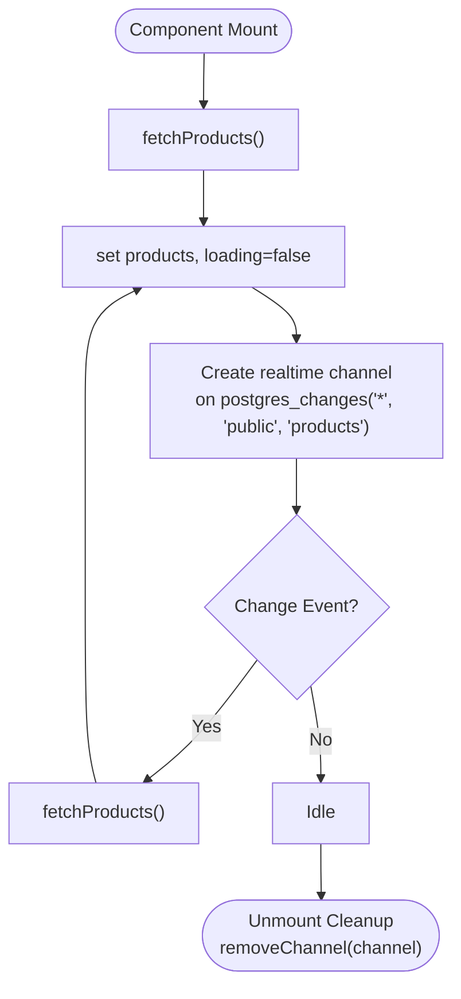
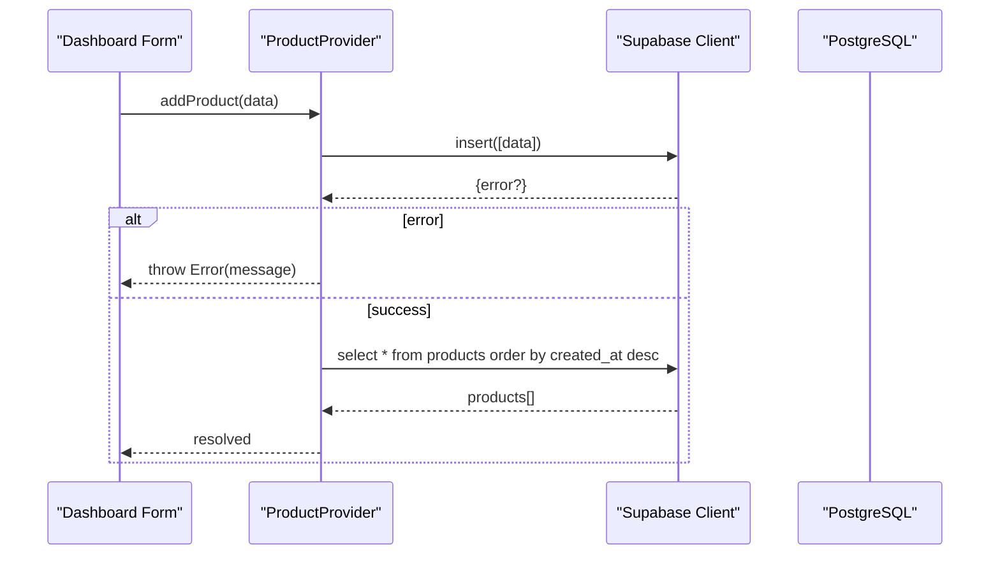
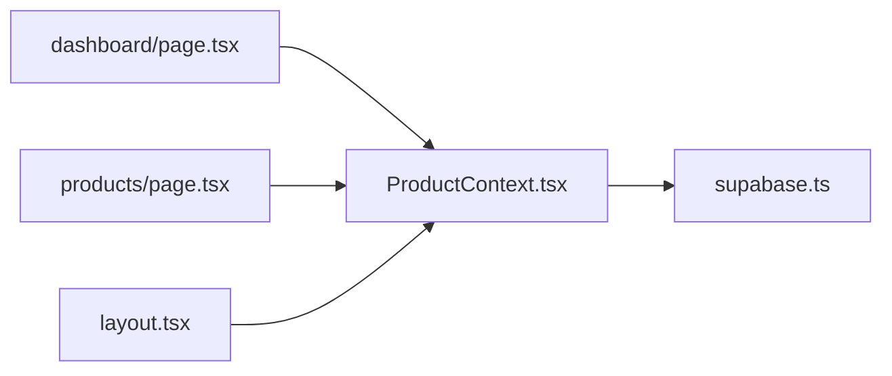

# Product Context

<cite>
**Referenced Files in This Document**
- [ProductContext.tsx](file://app/context/ProductContext.tsx)
- [supabase.ts](file://lib/supabase.ts)
- [layout.tsx](file://app/layout.tsx)
- [dashboard/page.tsx](file://app/dashboard/page.tsx)
- [products/page.tsx](file://app/products/page.tsx)
</cite>

## Table of Contents
1. [Introduction](#introduction)
2. [Project Structure](#project-structure)
3. [Core Components](#core-components)
4. [Architecture Overview](#architecture-overview)
5. [Detailed Component Analysis](#detailed-component-analysis)
6. [Dependency Analysis](#dependency-analysis)
7. [Performance Considerations](#performance-considerations)
8. [Troubleshooting Guide](#troubleshooting-guide)
9. [Conclusion](#conclusion)

## Introduction
This document explains the ProductContext implementation that manages product catalog state and real-time synchronization with Supabase. It covers the Product interface (including fragrance notes, sizes, and metadata), CRUD operations (addProduct, updateProduct, deleteProduct) and their error handling patterns, the real-time subscription mechanism that keeps UI in sync with database changes, usage examples from dashboard and products pages, and performance considerations such as loading states and selective re-renders.

## Project Structure
The ProductContext is a client-side React context that:
- Holds the list of products and a loading flag
- Provides functions to add, update, and delete products
- Subscribes to Supabase Postgres changes on the products table to refresh data automatically
- Is provided at the root layout so all pages can consume it via a custom hook

**Diagram sources**
- [layout.tsx:62-80](file://app/layout.tsx#L62-L80)
- [ProductContext.tsx:45-109](file://app/context/ProductContext.tsx#L45-L109)
- [supabase.ts:41](file://lib/supabase.ts#L41)
- [dashboard/page.tsx:11-15](file://app/dashboard/page.tsx#L11-L15)
- [products/page.tsx:38-40](file://app/products/page.tsx#L38-L40)

**Section sources**
- [layout.tsx:62-80](file://app/layout.tsx#L62-L80)
- [ProductContext.tsx:45-109](file://app/context/ProductContext.tsx#L45-L109)
- [supabase.ts:1-46](file://lib/supabase.ts#L1-L46)
- [dashboard/page.tsx:11-15](file://app/dashboard/page.tsx#L11-L15)
- [products/page.tsx:38-40](file://app/products/page.tsx#L38-L40)

## Core Components
- ProductContextType defines the shape of the context value:
  - products: array of Product objects
  - loading: boolean indicating initial fetch status
  - addProduct(product): inserts a new product
  - updateProduct(id, partialProduct): updates an existing product
  - deleteProduct(id): deletes a product by id
  - refetch(): manually triggers a fresh fetch
- ProductProvider implements:
  - Initial fetch of products ordered by created_at descending
  - Real-time subscription to postgres_changes for the products table
  - Error logging for fetch errors; throws typed errors for mutations
- useProducts() is a convenience hook to access the context safely

Key responsibilities:
- State management for the product catalog
- Data fetching and ordering
- Real-time synchronization via Supabase channels
- Centralized error handling for mutations

**Section sources**
- [ProductContext.tsx:14-41](file://app/context/ProductContext.tsx#L14-L41)
- [ProductContext.tsx:45-109](file://app/context/ProductContext.tsx#L45-L109)
- [ProductContext.tsx:111-115](file://app/context/ProductContext.tsx#L111-L115)

## Architecture Overview
The system integrates Next.js components with Supabase for persistence and real-time updates. The ProductProvider subscribes to database changes and refreshes local state when any insert, update, or delete occurs on the products table.

**Diagram sources**
- [ProductContext.tsx:49-82](file://app/context/ProductContext.tsx#L49-L82)
- [supabase.ts:41](file://lib/supabase.ts#L41)

## Detailed Component Analysis

### Product Interface and Metadata
The Product type models a fragrance item with:
- Identity and core fields: id, name, description, price, image_url
- Optional metadata: badge, category, gender
- Fragrance notes: top_notes, heart_notes, base_notes
- Performance descriptors: longevity, sillage
- Variants: sizes array of { size, price }
- Media: images gallery and optional video_url
- Timestamps: created_at

Complexity:
- Time complexity for rendering/filtering depends on number of products N
- Space complexity proportional to N plus media references

Usage examples:
- Dashboard form maps inputs to Product fields including notes, sizes, and media
- Products page filters and sorts using category, gender, search query, and created_at

**Section sources**
- [ProductContext.tsx:14-32](file://app/context/ProductContext.tsx#L14-L32)
- [dashboard/page.tsx:198-214](file://app/dashboard/page.tsx#L198-L214)
- [products/page.tsx:142-170](file://app/products/page.tsx#L142-L170)

### Real-Time Subscription Mechanism
How it works:
- On mount, ProductProvider calls fetchProducts once to populate initial state
- Then creates a Supabase channel named "products-realtime"
- Listens to postgres_changes events with wildcard (*) on schema public and table products
- On any change, re-invokes fetchProducts to refresh the entire list
- Cleans up the channel on unmount to avoid leaks

Error handling:
- Fetch errors are logged to console; state is still set to empty array if needed
- Mutations throw Errors with message from Supabase response

**Diagram sources**
- [ProductContext.tsx:49-82](file://app/context/ProductContext.tsx#L49-L82)

**Section sources**
- [ProductContext.tsx:49-82](file://app/context/ProductContext.tsx#L49-L82)

### CRUD Operations and Error Handling

Add Product
- Input: product without id and created_at
- Operation: insert into products
- Error: throws Error with Supabase error.message
- Post-action: refetches products to reflect new entry

Update Product
- Input: id and Partial<Product>
- Operation: update matching row by id
- Error: throws Error with Supabase error.message
- Post-action: refetches products

Delete Product
- Input: id
- Operation: delete matching row by id
- Error: throws Error with Supabase error.message
- Post-action: refetches products

**Diagram sources**
- [ProductContext.tsx:84-88](file://app/context/ProductContext.tsx#L84-L88)
- [ProductContext.tsx:49-62](file://app/context/ProductContext.tsx#L49-L62)

**Section sources**
- [ProductContext.tsx:84-100](file://app/context/ProductContext.tsx#L84-L100)
- [ProductContext.tsx:49-62](file://app/context/ProductContext.tsx#L49-L62)

### Usage Examples

Consuming product data
- Dashboard page uses useProducts to get products and loading, and calls addProduct/updateProduct/deleteProduct
- Products page consumes useProducts to render filtered and sorted lists

Example paths:
- Dashboard: [dashboard/page.tsx:11-15](file://app/dashboard/page.tsx#L11-L15)
- Products: [products/page.tsx:38-40](file://app/products/page.tsx#L38-L40)

Performing operations
- Add product flow: [dashboard/page.tsx:152-233](file://app/dashboard/page.tsx#L152-L233)
- Update product flow: [dashboard/page.tsx:216-222](file://app/dashboard/page.tsx#L216-L222)
- Delete product call path: [dashboard/page.tsx:129-150](file://app/dashboard/page.tsx#L129-L150)

Filtering and sorting
- Products page computes filteredProducts using useMemo based on category, gender, search, sort, and view: [products/page.tsx:142-170](file://app/products/page.tsx#L142-L170)

**Section sources**
- [dashboard/page.tsx:11-15](file://app/dashboard/page.tsx#L11-L15)
- [dashboard/page.tsx:152-233](file://app/dashboard/page.tsx#L152-L233)
- [dashboard/page.tsx:216-222](file://app/dashboard/page.tsx#L216-L222)
- [dashboard/page.tsx:129-150](file://app/dashboard/page.tsx#L129-L150)
- [products/page.tsx:38-40](file://app/products/page.tsx#L38-L40)
- [products/page.tsx:142-170](file://app/products/page.tsx#L142-L170)

## Dependency Analysis
- ProductProvider depends on:
  - React hooks: useState, useEffect, useCallback, useContext
  - Supabase client for queries and realtime subscriptions
- Consumers depend on:
  - useProducts hook for state and actions
  - Other contexts like CartContext for cart operations

**Diagram sources**
- [ProductContext.tsx:1-11](file://app/context/ProductContext.tsx#L1-L11)
- [supabase.ts:1-46](file://lib/supabase.ts#L1-L46)
- [layout.tsx:62-80](file://app/layout.tsx#L62-L80)
- [dashboard/page.tsx:11-15](file://app/dashboard/page.tsx#L11-L15)
- [products/page.tsx:38-40](file://app/products/page.tsx#L38-L40)

**Section sources**
- [ProductContext.tsx:1-11](file://app/context/ProductContext.tsx#L1-L11)
- [supabase.ts:1-46](file://lib/supabase.ts#L1-L46)
- [layout.tsx:62-80](file://app/layout.tsx#L62-L80)
- [dashboard/page.tsx:11-15](file://app/dashboard/page.tsx#L11-L15)
- [products/page.tsx:38-40](file://app/products/page.tsx#L38-L40)

## Performance Considerations
- Loading states
  - loading flag prevents premature renders and enables skeleton UI in consumer pages
  - Example: dashboard shows “Loading...” until fetch completes
- Selective re-renders
  - Consumers should memoize derived data (e.g., filteredProducts) to avoid unnecessary work
  - Example: products page uses useMemo for filtering and sorting
- Real-time overhead
  - Wildcard postgres_changes triggers a full refetch on every change; consider pagination or optimistic updates if the dataset grows large
- Network efficiency
  - Current query selects all columns; if only a subset is needed, reduce payload
- Cleanup
  - Channel removal on unmount avoids memory leaks and redundant listeners

[No sources needed since this section provides general guidance]

## Troubleshooting Guide
Common issues and resolutions:
- Missing environment variables
  - Symptom: Supabase client falls back to placeholder credentials and logs info
  - Resolution: Provide NEXT_PUBLIC_SUPABASE_URL and NEXT_PUBLIC_SUPABASE_ANON_KEY
- Database connection errors
  - Symptom: Dashboard checks connection and reports error state
  - Resolution: Verify network connectivity and correct keys
- Mutation failures
  - Symptom: add/update/delete throw Error with message from Supabase
  - Resolution: Inspect error.message and validate RLS policies and schema constraints
- Realtime not updating UI
  - Symptom: Changes in DB do not reflect immediately
  - Resolution: Ensure channel is subscribed and not removed prematurely; verify postgres_changes enabled for the table

**Section sources**
- [supabase.ts:27-39](file://lib/supabase.ts#L27-L39)
- [dashboard/page.tsx:20-36](file://app/dashboard/page.tsx#L20-L36)
- [ProductContext.tsx:56-62](file://app/context/ProductContext.tsx#L56-L62)
- [ProductContext.tsx:84-100](file://app/context/ProductContext.tsx#L84-L100)

## Conclusion
ProductContext centralizes product catalog state and real-time synchronization with Supabase. It exposes a clean API for CRUD operations, handles errors consistently, and ensures UI stays in sync through a robust realtime subscription. Consumers benefit from predictable loading states and efficient rendering via memoization. For larger catalogs, consider optimizing queries and adopting optimistic updates to further improve responsiveness.