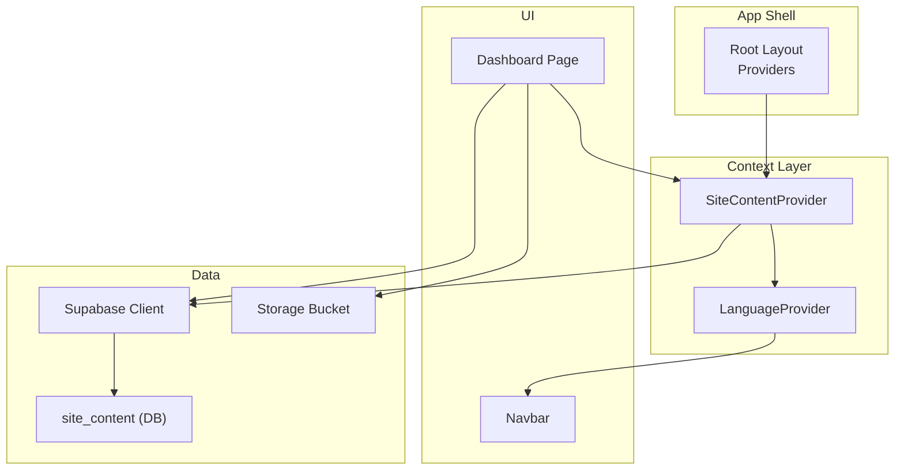
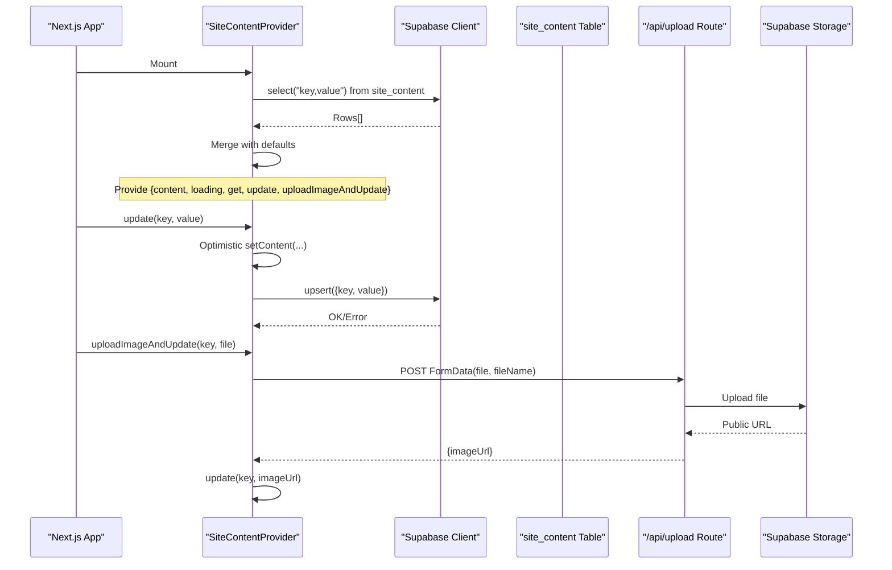
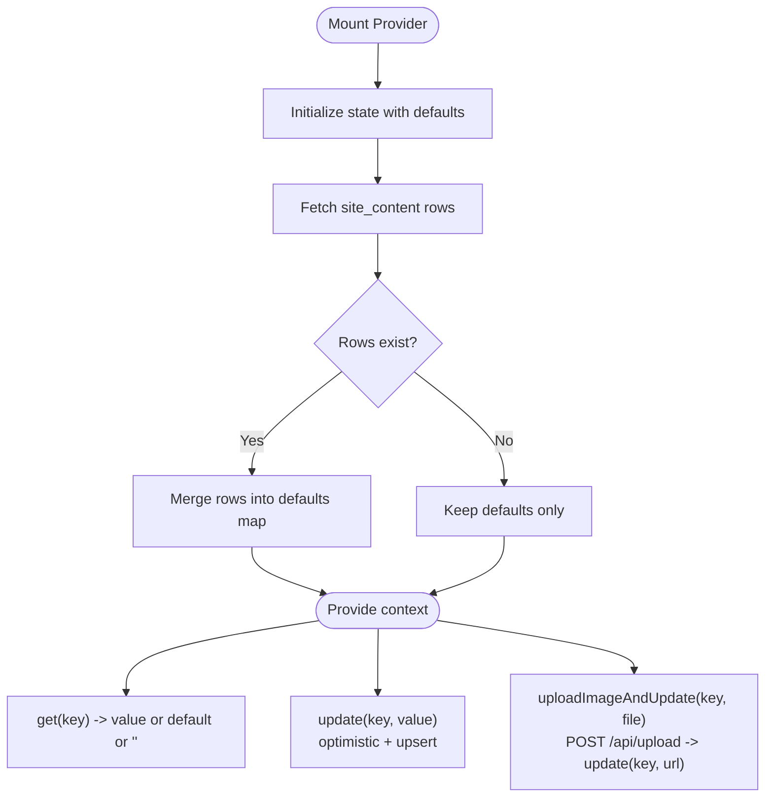
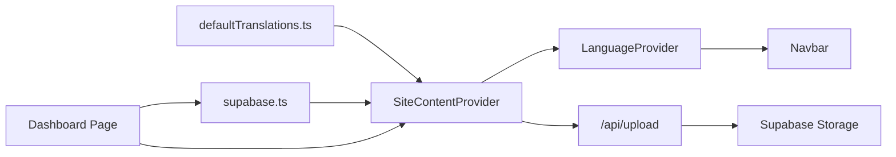

# Site Content Context

<cite>
**Referenced Files in This Document**
- [SiteContentContext.tsx](file://app/context/SiteContentContext.tsx)
- [defaultTranslations.ts](file://app/context/defaultTranslations.ts)
- [supabase.ts](file://lib/supabase.ts)
- [layout.tsx](file://app/layout.tsx)
- [LanguageContext.tsx](file://app/context/LanguageContext.tsx)
- [Navbar.tsx](file://components/Navbar.tsx)
- [dashboard page.tsx](file://app/dashboard/page.tsx)
- [supabase-setup.sql](file://supabase-setup.sql)
</cite>

## Table of Contents
1. Introduction
2. Project Structure
3. Core Components
4. Architecture Overview
5. Detailed Component Analysis
6. Dependency Analysis
7. Performance Considerations
8. Troubleshooting Guide
9. Conclusion

## Introduction
This document explains the SiteContentContext implementation that manages dynamic site-wide text and image content for non-technical editing. It covers how content is fetched from Supabase, merged with local defaults, updated optimistically, and consumed by UI components. It also documents the key-value structure, fallback mechanisms, integration with the dashboard editor, and guidance on caching strategies and versioning considerations.

## Project Structure
The site content feature spans a small set of focused files:
- A React context provider that loads, caches, and updates content
- Default translations as a baseline
- Supabase client configuration
- Root layout wiring the providers
- Language context using site content for i18n
- Dashboard editor to update content
- Database schema defining the storage table

**Diagram sources**
- [layout.tsx:62-80](file://app/layout.tsx#L62-L80)
- [SiteContentContext.tsx:22-103](file://app/context/SiteContentContext.tsx#L22-L103)
- [LanguageContext.tsx:17-50](file://app/context/LanguageContext.tsx#L17-L50)
- [Navbar.tsx:1-33](file://components/Navbar.tsx#L1-L33)
- [dashboard page.tsx:1005-1008](file://app/dashboard/page.tsx#L1005-L1008)
- [supabase.ts:41-46](file://lib/supabase.ts#L41-L46)
- [supabase-setup.sql:61-82](file://supabase-setup.sql#L61-L82)

**Section sources**
- [layout.tsx:62-80](file://app/layout.tsx#L62-L80)
- [SiteContentContext.tsx:22-103](file://app/context/SiteContentContext.tsx#L22-L103)
- [LanguageContext.tsx:17-50](file://app/context/LanguageContext.tsx#L17-L50)
- [Navbar.tsx:1-33](file://components/Navbar.tsx#L1-L33)
- [dashboard page.tsx:1005-1008](file://app/dashboard/page.tsx#L1005-L1008)
- [supabase.ts:41-46](file://lib/supabase.ts#L41-L46)
- [supabase-setup.sql:61-82](file://supabase-setup.sql#L61-L82)

## Core Components
- SiteContentProvider: Initializes state with default translations, fetches all rows from site_content, merges them into a map, exposes get/update/uploadImageAndUpdate helpers, and provides loading status.
- useSiteContent: Hook to access the context safely.
- LanguageProvider: Uses SiteContentContext to resolve localized strings via t(key).
- Navbar: Consumes LanguageProvider’s t() to render navigation labels and announcements.
- Dashboard Page: Provides an editor interface to update text and images; uses uploadImageAndUpdate to persist images and URLs.

Key responsibilities:
- Fetch-and-merge strategy ensures UI always has values even if remote data is missing or fails.
- Optimistic updates provide immediate feedback while persisting changes.
- Image uploads go through a server route to avoid CORS issues and adblockers.

**Section sources**
- [SiteContentContext.tsx:22-103](file://app/context/SiteContentContext.tsx#L22-L103)
- [SiteContentContext.tsx:105-109](file://app/context/SiteContentContext.tsx#L105-L109)
- [LanguageContext.tsx:17-50](file://app/context/LanguageContext.tsx#L17-L50)
- [Navbar.tsx:25-33](file://components/Navbar.tsx#L25-L33)
- [dashboard page.tsx:1005-1008](file://app/dashboard/page.tsx#L1005-L1008)

## Architecture Overview
The runtime flow centers around a single source of truth for site content:
- On app start, SiteContentProvider initializes with default translations and fetches site_content rows.
- The resulting map overrides defaults for any keys present in the database.
- Components read values via get(key) or t(key) (through LanguageProvider).
- Updates are optimistic and persisted via upsert.
- Images are uploaded to Supabase Storage via a Next.js API route, then their public URL is saved back to site_content.

**Diagram sources**
- [SiteContentContext.tsx:27-44](file://app/context/SiteContentContext.tsx#L27-L44)
- [SiteContentContext.tsx:57-69](file://app/context/SiteContentContext.tsx#L57-L69)
- [SiteContentContext.tsx:72-96](file://app/context/SiteContentContext.tsx#L72-L96)
- [supabase.ts:41-46](file://lib/supabase.ts#L41-L46)
- [supabase-setup.sql:61-82](file://supabase-setup.sql#L61-L82)

## Detailed Component Analysis

### SiteContentProvider
Responsibilities:
- Initialize state with default translations.
- Fetch all site_content rows once on mount.
- Merge remote values over defaults to guarantee availability.
- Expose:
  - get(key): returns current value or default or empty string.
  - update(key, value): optimistic update + upsert.
  - uploadImageAndUpdate(key, file): upload via /api/upload, then save URL.

Data model:
- In-memory map keyed by string, values are strings (text or image URLs).
- Keys follow naming conventions such as en_*, ar_*, hero_image, cat1_image, etc.

Error handling:
- Fetch errors are caught and logged; defaults remain active.
- Update errors throw with message after logging.

Optimistic updates:
- Immediate UI refresh before network call completes.

Real-time updates:
- Not implemented in this provider. Changes propagate when the component re-renders due to state updates. For live multi-user edits, consider adding Supabase real-time subscriptions.

Caching strategy:
- In-memory cache only. No persistent browser cache is used.
- Defaults act as a built-in offline fallback.

Versioning:
- No explicit version field. If needed, add a version column and compare before applying updates.

**Diagram sources**
- [SiteContentContext.tsx:22-44](file://app/context/SiteContentContext.tsx#L22-L44)
- [SiteContentContext.tsx:51-54](file://app/context/SiteContentContext.tsx#L51-L54)
- [SiteContentContext.tsx:57-69](file://app/context/SiteContentContext.tsx#L57-L69)
- [SiteContentContext.tsx:72-96](file://app/context/SiteContentContext.tsx#L72-L96)

**Section sources**
- [SiteContentContext.tsx:22-103](file://app/context/SiteContentContext.tsx#L22-L103)

### Default Translations
Purpose:
- Provide comprehensive fallbacks for all UI copy and image placeholders.
- Organized by sections (navbar, hero, categories, process, notes, story, testimonials, VIP, newsletter, footer, gifting, signature discovery, editorial spotlight, lookbook, fragrance finder, language toggle).

Structure:
- Flat key-value pairs.
- Language-prefixed keys for i18n (e.g., en_nav_home, ar_nav_home).
- Non-prefixed keys for shared assets (e.g., hero_image, cat1_image).

Usage:
- Merged into the provider’s initial state.
- Used as fallbacks by get(key) and LanguageProvider.t().

**Section sources**
- [defaultTranslations.ts:1-494](file://app/context/defaultTranslations.ts#L1-L494)

### Supabase Client
Responsibilities:
- Create a client instance with environment variables or safe fallbacks.
- Export STORAGE_BUCKET name for storage operations.

Notes:
- Fallback credentials are used when env vars are missing or placeholder-like.
- RLS policies allow public read/write for demo purposes.

**Section sources**
- [supabase.ts:1-46](file://lib/supabase.ts#L1-L46)
- [supabase-setup.sql:61-82](file://supabase-setup.sql#L61-L82)

### Root Layout Providers
Responsibilities:
- Wrap the application with SiteContentProvider at the root.
- Nest LanguageProvider and other providers.

Effect:
- Ensures all pages can consume site content without prop drilling.

**Section sources**
- [layout.tsx:62-80](file://app/layout.tsx#L62-L80)

### Language Integration
Responsibilities:
- Use SiteContentContext.get() to resolve localized strings.
- Build t(key) that prefers lang-prefixed keys and falls back to English or raw key.

Effects:
- Navbar and other UI components render dynamic text based on current language.

**Section sources**
- [LanguageContext.tsx:17-50](file://app/context/LanguageContext.tsx#L17-L50)
- [Navbar.tsx:25-33](file://components/Navbar.tsx#L25-L33)

### Dashboard Editor Integration
Responsibilities:
- Render editable fields for text and images.
- Save text via scUpdate(key, value).
- Upload images via uploadImageAndUpdate(key, file), which persists the returned URL.

Preview:
- Changes appear immediately in the UI due to optimistic updates.
- For images, preview updates after successful upload and URL persistence.

**Section sources**
- [dashboard page.tsx:1005-1008](file://app/dashboard/page.tsx#L1005-L1008)
- [dashboard page.tsx:1044-1080](file://app/dashboard/page.tsx#L1044-L1080)
- [dashboard page.tsx:1082-1160](file://app/dashboard/page.tsx#L1082-L1160)

## Dependency Analysis
High-level dependencies:
- SiteContentProvider depends on:
  - Supabase client for reads/writes
  - defaultTranslations for fallbacks
  - Next.js API route for image uploads
- LanguageProvider depends on SiteContentProvider
- Navbar depends on LanguageProvider
- Dashboard depends on SiteContentProvider and Supabase client/storage

**Diagram sources**
- [SiteContentContext.tsx:22-103](file://app/context/SiteContentContext.tsx#L22-L103)
- [defaultTranslations.ts:1-494](file://app/context/defaultTranslations.ts#L1-L494)
- [supabase.ts:41-46](file://lib/supabase.ts#L41-L46)
- [LanguageContext.tsx:17-50](file://app/context/LanguageContext.tsx#L17-L50)
- [Navbar.tsx:25-33](file://components/Navbar.tsx#L25-L33)
- [dashboard page.tsx:1005-1008](file://app/dashboard/page.tsx#L1005-L1008)

**Section sources**
- [SiteContentContext.tsx:22-103](file://app/context/SiteContentContext.tsx#L22-L103)
- [defaultTranslations.ts:1-494](file://app/context/defaultTranslations.ts#L1-L494)
- [supabase.ts:41-46](file://lib/supabase.ts#L41-L46)
- [LanguageContext.tsx:17-50](file://app/context/LanguageContext.tsx#L17-L50)
- [Navbar.tsx:25-33](file://components/Navbar.tsx#L25-L33)
- [dashboard page.tsx:1005-1008](file://app/dashboard/page.tsx#L1005-L1008)

## Performance Considerations
- Single fetch on mount reduces repeated network calls.
- Optimistic updates improve perceived performance during edits.
- Avoid unnecessary re-renders by keeping get stable and using memoization where appropriate.
- Consider debouncing rapid edits in the dashboard if needed.
- For large amounts of content, consider pagination or lazy-loading sections.

[No sources needed since this section provides general guidance]

## Troubleshooting Guide
Common issues and resolutions:
- Missing environment variables:
  - Symptom: Supabase client falls back to demo credentials.
  - Resolution: Set NEXT_PUBLIC_SUPABASE_URL and NEXT_PUBLIC_SUPABASE_ANON_KEY.
- Network errors fetching site_content:
  - Symptom: Console warning; defaults still shown.
  - Resolution: Check RLS policies and connectivity; verify site_content table exists.
- Update failures:
  - Symptom: Error thrown after optimistic update.
  - Resolution: Inspect error message; ensure RLS allows insert/update on site_content.
- Image upload failures:
  - Symptom: Upload error response from /api/upload.
  - Resolution: Verify bucket exists and is public; check server-side upload logic and CORS.

Operational checks:
- Ensure site_content table and policies are created per setup SQL.
- Confirm storage bucket name matches STORAGE_BUCKET constant.

**Section sources**
- [supabase.ts:35-39](file://lib/supabase.ts#L35-L39)
- [SiteContentContext.tsx:39-43](file://app/context/SiteContentContext.tsx#L39-L43)
- [SiteContentContext.tsx:65-68](file://app/context/SiteContentContext.tsx#L65-L68)
- [SiteContentContext.tsx:87-90](file://app/context/SiteContentContext.tsx#L87-L90)
- [supabase-setup.sql:61-82](file://supabase-setup.sql#L61-L82)

## Conclusion
SiteContentContext provides a simple, robust mechanism for managing dynamic site content with strong fallbacks and optimistic updates. It integrates cleanly with the language system and dashboard editor, enabling non-technical users to edit text and images without code changes. For production-grade scenarios, consider adding real-time synchronization, persistent caching, and content versioning to enhance reliability and collaboration.