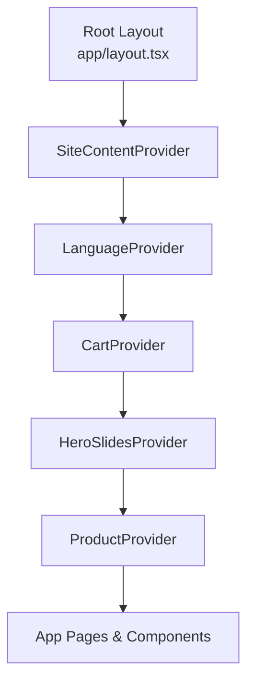
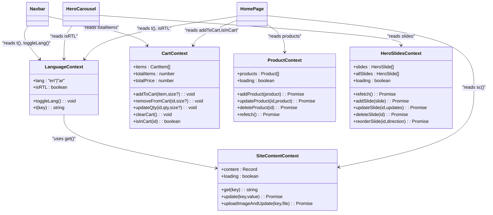
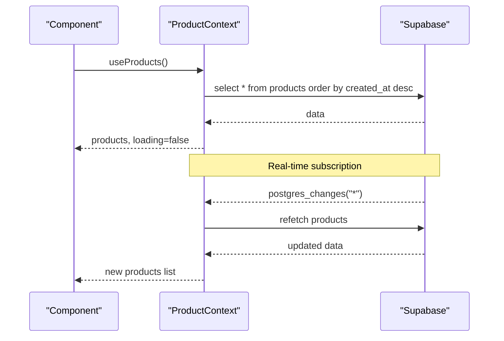
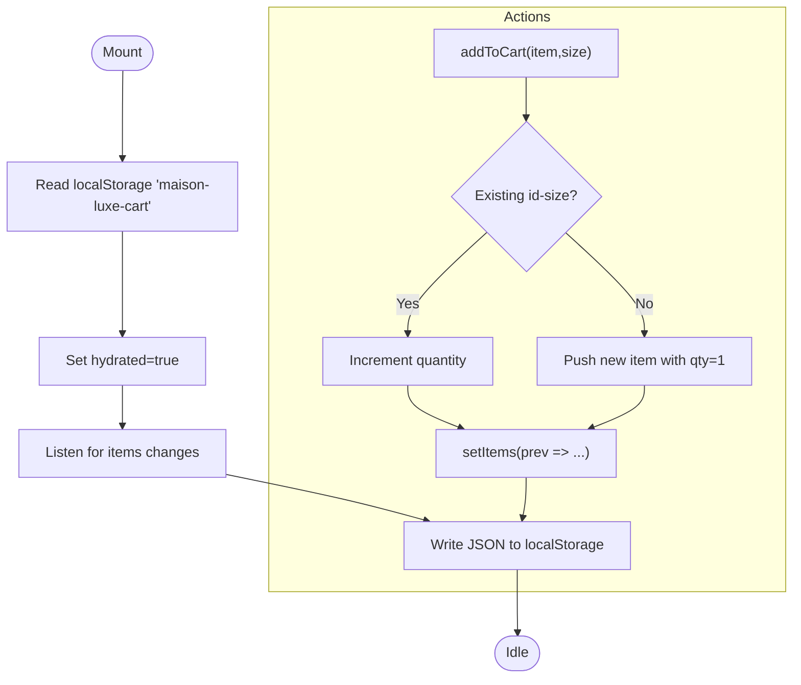
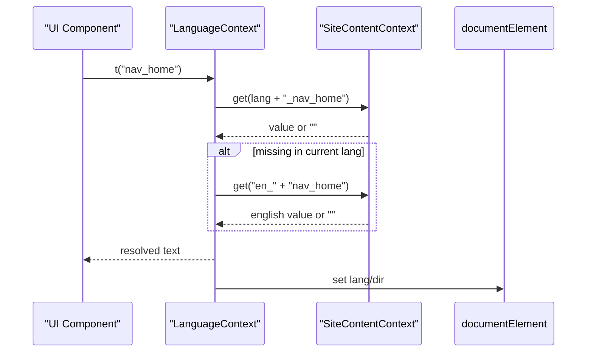
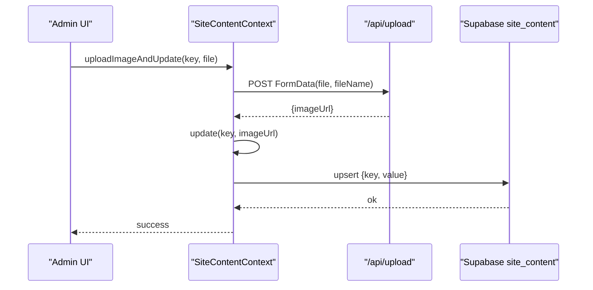
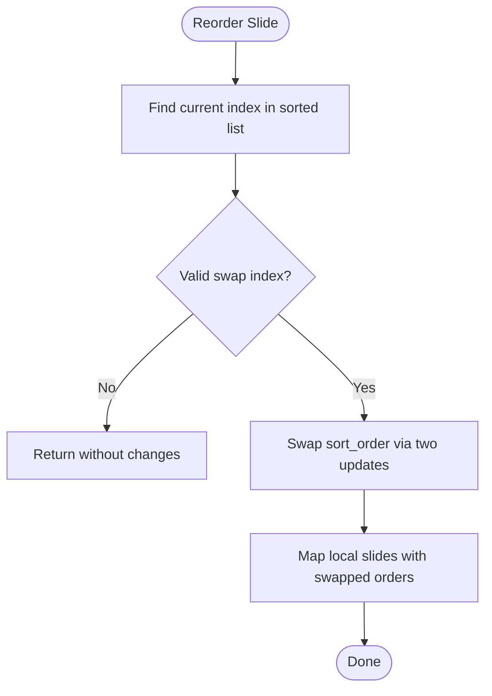
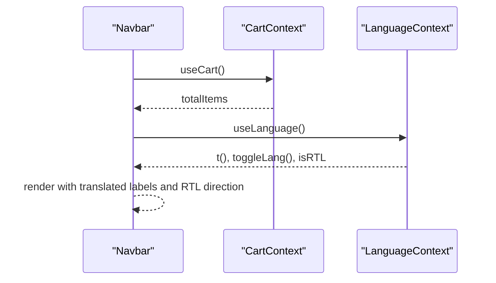
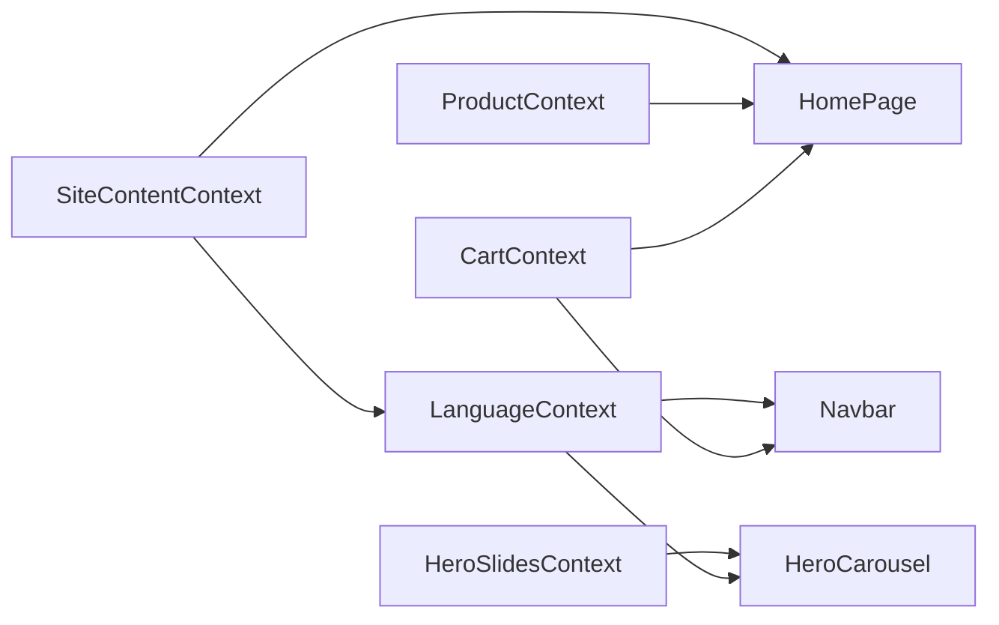

# State Management Architecture

<cite>
**Referenced Files in This Document**
- [layout.tsx](file://app/layout.tsx)
- [ProductContext.tsx](file://app/context/ProductContext.tsx)
- [CartContext.tsx](file://app/context/CartContext.tsx)
- [LanguageContext.tsx](file://app/context/LanguageContext.tsx)
- [SiteContentContext.tsx](file://app/context/SiteContentContext.tsx)
- [HeroSlidesContext.tsx](file://app/context/HeroSlidesContext.tsx)
- [defaultTranslations.ts](file://app/context/defaultTranslations.ts)
- [Navbar.tsx](file://components/Navbar.tsx)
- [HeroCarousel.tsx](file://components/HeroCarousel.tsx)
- [page.tsx](file://app/page.tsx)
</cite>

## Table of Contents
1. [Introduction](#introduction)
2. [Project Structure](#project-structure)
3. [Core Components](#core-components)
4. [Architecture Overview](#architecture-overview)
5. [Detailed Component Analysis](#detailed-component-analysis)
6. [Dependency Analysis](#dependency-analysis)
7. [Performance Considerations](#performance-considerations)
8. [Troubleshooting Guide](#troubleshooting-guide)
9. [Conclusion](#conclusion)

## Introduction
This document describes the state management architecture built with React Context API across five main contexts:
- ProductContext: product catalog and real-time inventory synchronization
- CartContext: shopping cart operations with localStorage persistence
- LanguageContext: internationalization (i18n) and RTL support
- SiteContentContext: dynamic content management backed by Supabase
- HeroSlidesContext: carousel state and ordering

It explains provider patterns, context dependency resolution, cross-context communication, complex state transitions, and performance considerations such as selective re-renders and context splitting strategies.

## Project Structure
The application uses a root layout to wrap the entire tree with providers. The provider hierarchy is defined once at the top-level so all pages and components can consume contexts via hooks.

**Diagram sources**
- [layout.tsx:62-80](file://app/layout.tsx#L62-L80)

**Section sources**
- [layout.tsx:62-80](file://app/layout.tsx#L62-L80)

## Core Components
Each context follows a consistent pattern:
- Create a typed context with createContext
- Provide state and actions via a Provider component
- Expose a custom hook for consumption
- Manage side effects (fetching, persistence, subscriptions) inside the provider

Key responsibilities:
- ProductContext: fetches products from Supabase, subscribes to real-time changes, exposes CRUD helpers
- CartContext: manages cart items, persists to localStorage, computes totals
- LanguageContext: toggles language, sets HTML lang/dir attributes, resolves translations using SiteContentContext
- SiteContentContext: loads site_content rows, merges with defaults, supports optimistic updates and image uploads
- HeroSlidesContext: manages hero slides, sorting, active filtering, and server sync

**Section sources**
- [ProductContext.tsx:45-109](file://app/context/ProductContext.tsx#L45-L109)
- [CartContext.tsx:28-97](file://app/context/CartContext.tsx#L28-L97)
- [LanguageContext.tsx:17-51](file://app/context/LanguageContext.tsx#L17-L51)
- [SiteContentContext.tsx:22-103](file://app/context/SiteContentContext.tsx#L22-L103)
- [HeroSlidesContext.tsx:157-283](file://app/context/HeroSlidesContext.tsx#L157-L283)

## Architecture Overview
The system composes multiple independent concerns into separate contexts. Cross-context communication occurs primarily through composition: LanguageContext depends on SiteContentContext to resolve i18n keys; UI components consume multiple contexts simultaneously.

**Diagram sources**
- [SiteContentContext.tsx:22-103](file://app/context/SiteContentContext.tsx#L22-L103)
- [LanguageContext.tsx:17-51](file://app/context/LanguageContext.tsx#L17-L51)
- [CartContext.tsx:28-97](file://app/context/CartContext.tsx#L28-L97)
- [ProductContext.tsx:45-109](file://app/context/ProductContext.tsx#L45-L109)
- [HeroSlidesContext.tsx:157-283](file://app/context/HeroSlidesContext.tsx#L157-L283)
- [Navbar.tsx:1-187](file://components/Navbar.tsx#L1-L187)
- [HeroCarousel.tsx:1-800](file://components/HeroCarousel.tsx#L1-L800)
- [page.tsx:53-250](file://app/page.tsx#L53-L250)

## Detailed Component Analysis

### ProductContext: Catalog and Real-Time Inventory
Responsibilities:
- Fetch products from Supabase ordered by creation time
- Subscribe to real-time changes on the products table and refetch when any change occurs
- Provide add/update/delete operations that trigger a refetch after mutation

State synchronization pattern:
- Initial load via useEffect
- Real-time subscription via Supabase channel; on any postgres_changes event, refetch to keep UI in sync
- Mutations call refetch to ensure consistency

Complex transitions:
- Loading state toggled around fetch
- Error logging for network or DB errors

**Diagram sources**
- [ProductContext.tsx:49-82](file://app/context/ProductContext.tsx#L49-L82)

**Section sources**
- [ProductContext.tsx:45-109](file://app/context/ProductContext.tsx#L45-L109)

### CartContext: Shopping Cart with Persistence
Responsibilities:
- Maintain items array with id, name, price, image_url, category, quantity, size
- Persist to localStorage under a stable key
- Compute derived values: totalItems, totalPrice
- Provide addToCart, removeFromCart, updateQty, clearCart, isInCart

Persistence flow:
- On mount, hydrate from localStorage if available
- After hydration flag set, persist on every items change

Add-to-cart logic:
- Keyed by id-size pair to allow same product in different sizes
- Increment quantity if item exists; otherwise push new item

**Diagram sources**
- [CartContext.tsx:33-47](file://app/context/CartContext.tsx#L33-L47)
- [CartContext.tsx:49-60](file://app/context/CartContext.tsx#L49-L60)

**Section sources**
- [CartContext.tsx:28-97](file://app/context/CartContext.tsx#L28-L97)

### LanguageContext: Internationalization and Directionality
Responsibilities:
- Track current language ("en" | "ar") and compute isRTL
- Toggle language
- Resolve translation keys via SiteContentContext.get with fallbacks
- Apply html lang and dir attributes on language change

Cross-context dependency:
- Uses useSiteContent().get to resolve keys like en_nav_home or ar_nav_home
- Fallback chain: current language key → English key → raw key

HTML attribute synchronization:
- Sets document.documentElement.lang and dir based on language

**Diagram sources**
- [LanguageContext.tsx:22-44](file://app/context/LanguageContext.tsx#L22-L44)
- [SiteContentContext.tsx:51-54](file://app/context/SiteContentContext.tsx#L51-L54)

**Section sources**
- [LanguageContext.tsx:17-51](file://app/context/LanguageContext.tsx#L17-L51)
- [SiteContentContext.tsx:22-103](file://app/context/SiteContentContext.tsx#L22-L103)

### SiteContentContext: Dynamic Content Management
Responsibilities:
- Load site_content rows from Supabase and merge with defaultTranslations
- Provide get(key) helper with fallback to defaults
- Support optimistic update for single key
- Upload images via /api/upload and persist URL back to site_content

Optimistic update pattern:
- Immediately update local content map
- Perform upsert to database
- Throw error if server fails

Image upload workflow:
- Generate unique filename
- POST FormData to /api/upload
- On success, call update(key, imageUrl)

**Diagram sources**
- [SiteContentContext.tsx:72-96](file://app/context/SiteContentContext.tsx#L72-L96)
- [SiteContentContext.tsx:57-69](file://app/context/SiteContentContext.tsx#L57-L69)

**Section sources**
- [SiteContentContext.tsx:22-103](file://app/context/SiteContentContext.tsx#L22-L103)
- [defaultTranslations.ts:1-494](file://app/context/defaultTranslations.ts#L1-L494)

### HeroSlidesContext: Carousel State and Ordering
Responsibilities:
- Manage all slides and derive active slides filtered by active flag and sort_order
- Provide CRUD operations and reorder functionality
- Refetch from Supabase and fall back to DEFAULT_SLIDES on error or empty table

Reorder algorithm:
- Find current slide index and swap target
- Swap sort_order values atomically via two parallel updates
- Update local state to reflect new order

Active slides derivation:
- Filter by active === true
- Sort by sort_order ascending

**Diagram sources**
- [HeroSlidesContext.tsx:228-260](file://app/context/HeroSlidesContext.tsx#L228-L260)
- [HeroSlidesContext.tsx:262-266](file://app/context/HeroSlidesContext.tsx#L262-L266)

**Section sources**
- [HeroSlidesContext.tsx:157-283](file://app/context/HeroSlidesContext.tsx#L157-L283)

### Consumer Examples: Navbar and HeroCarousel
Navbar:
- Consumes CartContext.totalItems to show badge count
- Consumes LanguageContext.t(), toggleLang(), isRTL to render links and direction

HeroCarousel:
- Consumes HeroSlidesContext.slides for rendering
- Consumes LanguageContext.isRTL for dot progress transform origin

**Diagram sources**
- [Navbar.tsx:1-187](file://components/Navbar.tsx#L1-L187)

**Section sources**
- [Navbar.tsx:1-187](file://components/Navbar.tsx#L1-L187)
- [HeroCarousel.tsx:1-800](file://components/HeroCarousel.tsx#L1-L800)

## Dependency Analysis
Context dependency graph:
- LanguageContext depends on SiteContentContext for translation resolution
- UI components may depend on multiple contexts independently
- No direct dependencies between ProductContext, CartContext, HeroSlidesContext; they are composed at the page/component level

**Diagram sources**
- [LanguageContext.tsx:17-51](file://app/context/LanguageContext.tsx#L17-L51)
- [SiteContentContext.tsx:22-103](file://app/context/SiteContentContext.tsx#L22-L103)
- [Navbar.tsx:1-187](file://components/Navbar.tsx#L1-L187)
- [HeroCarousel.tsx:1-800](file://components/HeroCarousel.tsx#L1-L800)
- [page.tsx:53-250](file://app/page.tsx#L53-L250)

**Section sources**
- [layout.tsx:62-80](file://app/layout.tsx#L62-L80)
- [LanguageContext.tsx:17-51](file://app/context/LanguageContext.tsx#L17-L51)
- [SiteContentContext.tsx:22-103](file://app/context/SiteContentContext.tsx#L22-L103)
- [Navbar.tsx:1-187](file://components/Navbar.tsx#L1-L187)
- [HeroCarousel.tsx:1-800](file://components/HeroCarousel.tsx#L1-L800)
- [page.tsx:53-250](file://app/page.tsx#L53-L250)

## Performance Considerations
Selective re-renders:
- Each context provides only the minimal necessary state and memoized functions via useCallback where appropriate. Consumers should destructure only what they need to avoid unnecessary re-renders.
- Derived values like totalItems and totalPrice are computed inline; consider memoizing them if the cart grows significantly.

Context splitting strategies:
- Keep contexts focused per domain (cart, language, content, slides, products). This reduces the size of each context’s value object and limits re-render scope.
- For heavy consumers, consider extracting small sub-providers or selectors (e.g., a CartBadgeProvider exposing only totalItems) to minimize re-renders in unrelated parts of the tree.

Real-time updates:
- ProductContext subscribes to Supabase realtime events and refetches; this ensures eventual consistency but may cause frequent re-renders. Consider debouncing or batching updates if needed.

LocalStorage persistence:
- CartContext writes to localStorage on every change after hydration. If cart mutations become high-frequency, consider throttling writes or batching updates.

Translation lookup:
- LanguageContext calls SiteContentContext.get on each render. Since get is memoized and returns strings, it is efficient. Ensure keys are stable to avoid churn.

[No sources needed since this section provides general guidance]

## Troubleshooting Guide
Common issues and resolutions:
- Missing provider:
  - Symptom: Hook throws “must be used inside XProvider”
  - Resolution: Ensure the relevant Provider wraps the consuming component in the root layout or higher in the tree
- Realtime not updating:
  - Check Supabase channel subscription and ensure the table has RLS policies allowing realtime events
  - Verify refetch is called on change events
- Translation keys missing:
  - Confirm keys exist in defaultTranslations or have been persisted to site_content
  - Use the fallback chain in LanguageContext to verify resolution path
- Image upload failures:
  - Validate /api/upload response and permissions
  - Ensure file extension handling and unique filename generation work as expected

**Section sources**
- [ProductContext.tsx:56-62](file://app/context/ProductContext.tsx#L56-L62)
- [SiteContentContext.tsx:57-69](file://app/context/SiteContentContext.tsx#L57-L69)
- [SiteContentContext.tsx:82-96](file://app/context/SiteContentContext.tsx#L82-L96)
- [LanguageContext.tsx:32-44](file://app/context/LanguageContext.tsx#L32-L44)

## Conclusion
The state management architecture leverages React Context to cleanly separate concerns across product catalog, cart, internationalization, dynamic content, and hero slides. Providers encapsulate data fetching, persistence, and real-time synchronization, while consumers access state via typed hooks. The design emphasizes modularity, predictable state transitions, and maintainable cross-context interactions. With careful attention to selective re-renders and context granularity, the system scales well for an e-commerce experience.