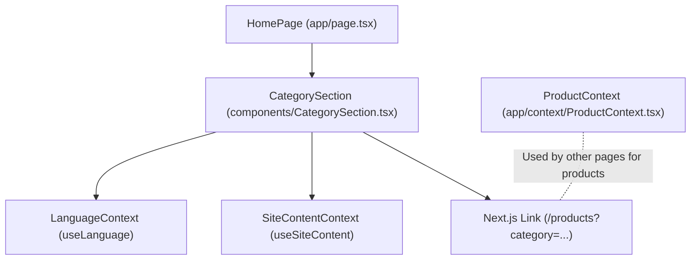
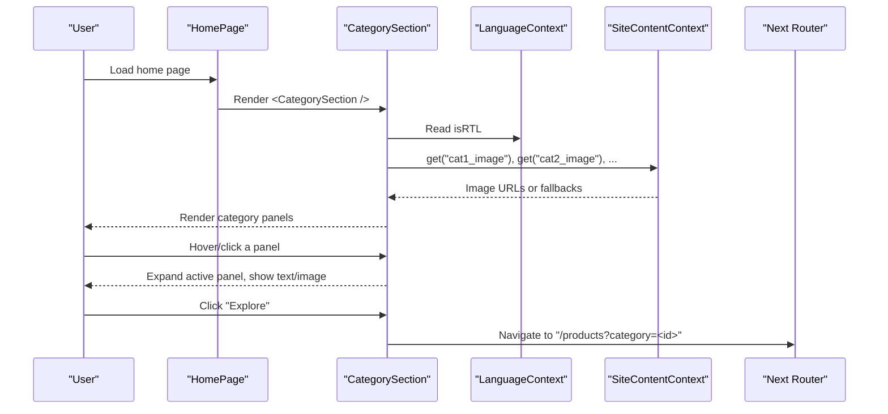
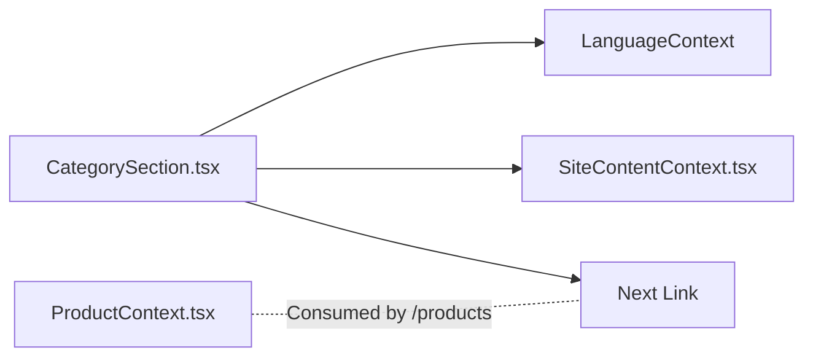

# CategorySection Component

<cite>
**Referenced Files in This Document**
- [CategorySection.tsx](file://components/CategorySection.tsx)
- [SiteContentContext.tsx](file://app/context/SiteContentContext.tsx)
- [defaultTranslations.ts](file://app/context/defaultTranslations.ts)
- [page.tsx](file://app/page.tsx)
- [ProductContext.tsx](file://app/context/ProductContext.tsx)
</cite>

## Table of Contents
1. [Introduction](#introduction)
2. [Project Structure](#project-structure)
3. [Core Components](#core-components)
4. [Architecture Overview](#architecture-overview)
5. [Detailed Component Analysis](#detailed-component-analysis)
6. [Dependency Analysis](#dependency-analysis)
7. [Performance Considerations](#performance-considerations)
8. [Troubleshooting Guide](#troubleshooting-guide)
9. [Conclusion](#conclusion)
10. [Appendices](#appendices)

## Introduction
This document provides comprehensive documentation for the CategorySection component. It explains how the component visually presents product categories, its interactive hover behavior, responsive layout, and integration with dynamic content via SiteContentContext. It also clarifies how to integrate with ProductContext for real-time category updates, discusses image optimization strategies, loading states, styling customization, and animation effects using GSAP.

## Project Structure
The CategorySection is a client-side React component that renders an interactive horizontal panel grid showcasing fragrance collections. It uses:
- Language context for bilingual text (English/Arabic)
- SiteContentContext for dynamic images and site-wide content
- Next.js Link for navigation to filtered product pages

**Diagram sources**
- [page.tsx:1-140](file://app/page.tsx#L1-L140)
- [CategorySection.tsx:1-106](file://components/CategorySection.tsx#L1-L106)
- [ProductContext.tsx:1-116](file://app/context/ProductContext.tsx#L1-L116)

**Section sources**
- [page.tsx:1-140](file://app/page.tsx#L1-L140)
- [CategorySection.tsx:1-106](file://components/CategorySection.tsx#L1-L106)

## Core Components
- CategorySection: Renders a set of category panels with hover-driven expansion, localized titles/descriptions, and a call-to-action link to the products page filtered by category.
- SiteContentContext: Provides a get(key) helper to retrieve dynamic content such as category images from Supabase-backed site_content.
- LanguageContext: Supplies isRTL flag and translations used across the app.
- ProductContext: Manages real-time product data; while not consumed directly by CategorySection, it powers the destination /products page where category filtering occurs.

Key responsibilities:
- Build category list by merging static definitions with dynamic images from SiteContentContext
- Manage active/hovered state for panel expansion
- Render bilingual UI based on language direction
- Provide accessible navigation to filtered product listings

**Section sources**
- [CategorySection.tsx:1-106](file://components/CategorySection.tsx#L1-L106)
- [SiteContentContext.tsx:1-110](file://app/context/SiteContentContext.tsx#L1-L110)
- [ProductContext.tsx:1-116](file://app/context/ProductContext.tsx#L1-L116)

## Architecture Overview
The component composes data from multiple contexts and renders a responsive, animated grid. The flow is:
- On mount, SiteContentContext fetches site_content rows and exposes a get(key) function
- CategorySection maps static categories to include dynamic images via get(contentKey), falling back to default images
- Hover/click toggles the active panel, revealing descriptive text and enlarging the associated image
- Clicking “Explore” navigates to /products?category=<id>, where the products page filters items by category

**Diagram sources**
- [CategorySection.tsx:51-106](file://components/CategorySection.tsx#L51-L106)
- [SiteContentContext.tsx:22-54](file://app/context/SiteContentContext.tsx#L22-L54)
- [page.tsx:136-140](file://app/page.tsx#L136-L140)

## Detailed Component Analysis

### Visual Presentation and Layout
- Section header includes eyebrow and main title, both localized
- Horizontal flex container holds category panels with rounded corners and subtle borders
- Each panel contains:
  - Text block with title, description, and Explore button
  - Image wrapper with a large product image
  - Vertical title visible when inactive
- Active panel expands horizontally, dims overlay fades out, text slides in, and image scales up

Responsive behavior:
- Desktop: Panels arranged horizontally with equal width; active panel expands significantly
- Tablet/mobile: Container switches to vertical stacking; image positioning adjusts; text aligns per language direction

Accessibility:
- Panels are keyboard-focusable and have role="button"
- Arrow icon rotates according to RTL/LTR

**Section sources**
- [CategorySection.tsx:62-106](file://components/CategorySection.tsx#L62-L106)
- [CategorySection.tsx:108-354](file://components/CategorySection.tsx#L108-L354)

### Interactive Hover Effects
- State hoveredIndex tracks which panel is active
- onMouseEnter/onClick sets hoveredIndex to expand the selected panel
- CSS transitions animate:
  - Panel flex growth/shrink
  - Overlay opacity
  - Image transform and opacity
  - Text slide-in with delay

No external animation library is used inside this component; animations rely on CSS transitions.

**Section sources**
- [CategorySection.tsx:51-106](file://components/CategorySection.tsx#L51-L106)
- [CategorySection.tsx:149-240](file://components/CategorySection.tsx#L149-L240)

### Props and Attributes
The component does not accept props; it reads configuration internally:
- Static category definitions include id, title/titleAr, defaultImg, contentKey, bg, desc/descAr
- Dynamic images are resolved via SiteContentContext.get(contentKey)
- Navigation links use href="/products?category=<id>"

If you need to customize categories externally, consider extracting the static array into a prop or fetching from a CMS endpoint.

**Section sources**
- [CategorySection.tsx:8-60](file://components/CategorySection.tsx#L8-L60)

### Data Flow and Integration with Contexts
- SiteContentContext supplies image URLs keyed by contentKey (e.g., cat1_image). If missing, defaults are used
- LanguageContext provides isRTL to adjust text alignment and arrow rotation
- Destination page (/products) can filter products by category query parameter

Real-time updates:
- SiteContentContext loads site_content once and exposes get(key)
- ProductContext subscribes to real-time changes for products table; this affects the /products page, not CategorySection directly

To reflect live category metadata (titles, descriptions) in CategorySection, extend SiteContentContext keys for those fields and read them similarly to images.

**Section sources**
- [SiteContentContext.tsx:22-54](file://app/context/SiteContentContext.tsx#L22-L54)
- [ProductContext.tsx:45-82](file://app/context/ProductContext.tsx#L45-L82)
- [defaultTranslations.ts:483-493](file://app/context/defaultTranslations.ts#L483-L493)

### Usage Example: Integrating with ProductContext for Real-Time Category Updates
While CategorySection itself does not consume ProductContext, you can ensure the destination page reacts to real-time product changes:
- Wrap your app with ProductProvider so useProducts() works
- On the /products page, use useProducts() to filter by category query param
- When new products are added/updated/deleted, ProductContext refetches automatically via Supabase realtime channel

Example integration points:
- Provider setup in root layout
- Reading products and loading state in /products page
- Filtering logic based on URL query parameter

Note: To make CategorySection display live category counts or names, add corresponding keys to SiteContentContext and render them similarly to images.

**Section sources**
- [ProductContext.tsx:45-116](file://app/context/ProductContext.tsx#L45-L116)
- [page.tsx:136-140](file://app/page.tsx#L136-L140)

### Responsive Grid Behavior
- Flex-based horizontal layout on desktop
- Switches to column layout on mobile
- Adjusts padding, font sizes, and image positioning for smaller screens
- Maintains readability and touch-friendly interactions

**Section sources**
- [CategorySection.tsx:310-354](file://components/CategorySection.tsx#L310-L354)

### Image Optimization and Loading States
- Images are sourced from SiteContentContext or fallbacks
- For production, prefer Next.js Image component for automatic optimization, lazy loading, and format selection
- Add alt attributes (already present) and consider loading="lazy" if using native img tags
- Implement a simple loading skeleton or spinner while SiteContentContext is still fetching initial content

Recommendation: Replace the current img tag with Next.js Image and configure sizes/priority for above-the-fold visuals.

**Section sources**
- [CategorySection.tsx:96-98](file://components/CategorySection.tsx#L96-L98)
- [SiteContentContext.tsx:22-48](file://app/context/SiteContentContext.tsx#L22-L48)

### Styling Customization
- All styles are scoped within the component’s style tag
- Use CSS variables (e.g., --gold, --font-serif, --font-sans) for consistent theming
- Customize gradients, typography, spacing, and border radii by editing the inline styles
- For global overrides, define additional classes in globals.css and apply conditionally

**Section sources**
- [CategorySection.tsx:108-354](file://components/CategorySection.tsx#L108-L354)

### Animation Effects Using GSAP
- CategorySection itself does not use GSAP; it relies on CSS transitions
- The parent HomePage registers gsap plugins and animates other sections
- To add GSAP-powered entrance animations to CategorySection, wrap it with a ref and animate elements like .cat-header and .cat-container on scroll or mount

Example approach:
- Register ScrollTrigger globally (already done in HomePage)
- Animate .fade-up elements within CategorySection using gsap.fromTo with staggered delays

**Section sources**
- [page.tsx:5-18](file://app/page.tsx#L5-L18)
- [page.tsx:68-115](file://app/page.tsx#L68-L115)
- [CategorySection.tsx:62-70](file://components/CategorySection.tsx#L62-L70)

## Dependency Analysis
- CategorySection depends on:
  - LanguageContext for isRTL
  - SiteContentContext for dynamic images
  - Next.js Link for routing
- No direct dependency on ProductContext
- Global styles and CSS variables influence appearance

**Diagram sources**
- [CategorySection.tsx:1-10](file://components/CategorySection.tsx#L1-L10)
- [SiteContentContext.tsx:1-20](file://app/context/SiteContentContext.tsx#L1-L20)
- [ProductContext.tsx:1-44](file://app/context/ProductContext.tsx#L1-L44)

**Section sources**
- [CategorySection.tsx:1-10](file://components/CategorySection.tsx#L1-L10)
- [SiteContentContext.tsx:1-20](file://app/context/SiteContentContext.tsx#L1-L20)
- [ProductContext.tsx:1-44](file://app/context/ProductContext.tsx#L1-L44)

## Performance Considerations
- Prefer Next.js Image for optimized delivery and lazy loading
- Avoid heavy re-renders by memoizing computed arrays if categories grow
- Keep hover state minimal; avoid expensive operations in event handlers
- Ensure images are appropriately sized and compressed at source
- Consider code-splitting if expanding the component with heavy features

[No sources needed since this section provides general guidance]

## Troubleshooting Guide
- Images not showing:
  - Verify SiteContentContext has values for catN_image keys
  - Check fallback images exist in public directory
  - Confirm upload workflow updated site_content entries
- Text not updating:
  - Extend SiteContentContext to include titles/descriptions and read them similarly to images
- RTL issues:
  - Ensure LanguageContext is providing correct isRTL value
  - Verify arrow rotation and text alignment rules
- Hover not working:
  - Confirm mouse events are attached and no pointer-events are blocking
  - Check z-index layering between overlays and content

**Section sources**
- [SiteContentContext.tsx:22-54](file://app/context/SiteContentContext.tsx#L22-L54)
- [CategorySection.tsx:51-106](file://components/CategorySection.tsx#L51-L106)

## Conclusion
CategorySection delivers a polished, interactive showcase of fragrance categories with smooth hover effects, bilingual support, and dynamic imagery. While it does not directly consume ProductContext, it integrates seamlessly with the broader data architecture through SiteContentContext and navigates to a products page that leverages real-time product updates. With minor enhancements—such as adopting Next.js Image and optional GSAP animations—it can achieve optimal performance and richer motion design.

[No sources needed since this section summarizes without analyzing specific files]

## Appendices

### Data Keys and Defaults
- Default images for categories are defined in defaultTranslations under keys cat1_image through cat4_image
- These serve as fallbacks when SiteContentContext has no stored values

**Section sources**
- [defaultTranslations.ts:483-493](file://app/context/defaultTranslations.ts#L483-L493)