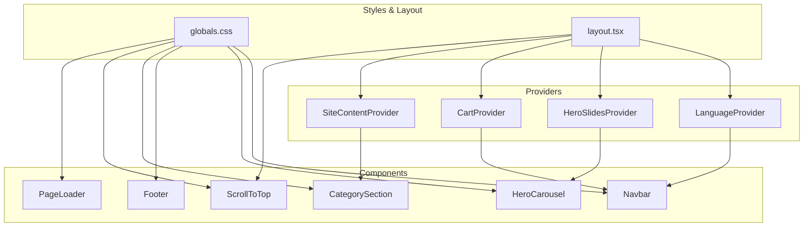
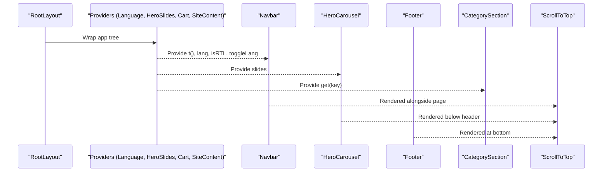
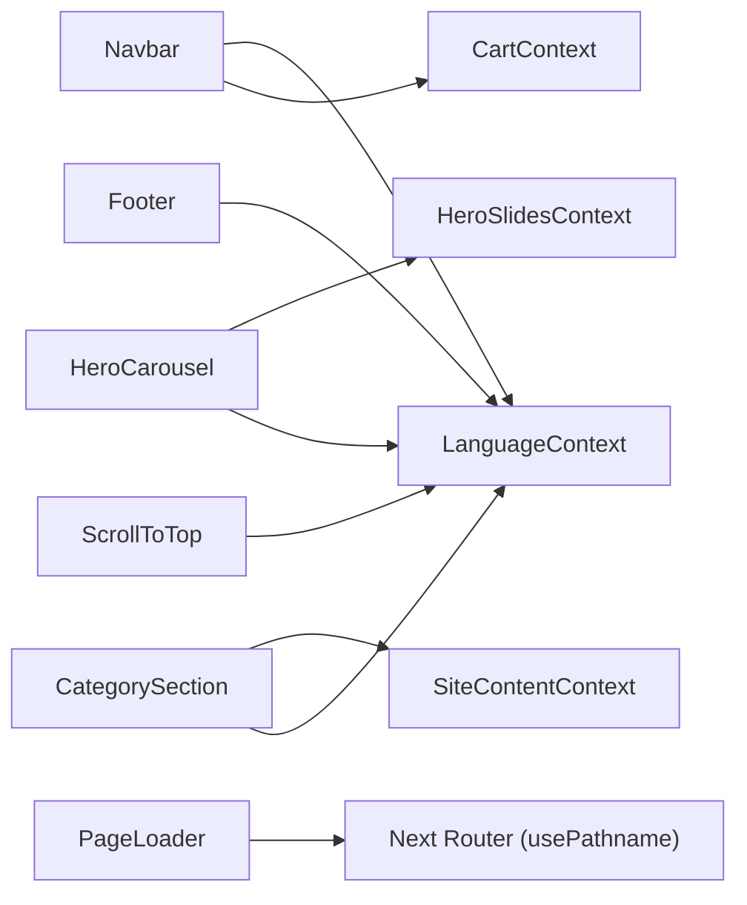

# Component Library

<cite>
**Referenced Files in This Document**
- [Navbar.tsx](file://components/Navbar.tsx)
- [HeroCarousel.tsx](file://components/HeroCarousel.tsx)
- [Footer.tsx](file://components/Footer.tsx)
- [CategorySection.tsx](file://components/CategorySection.tsx)
- [ScrollToTop.tsx](file://components/ScrollToTop.tsx)
- [PageLoader.tsx](file://components/PageLoader.tsx)
- [LanguageContext.tsx](file://app/context/LanguageContext.tsx)
- [HeroSlidesContext.tsx](file://app/context/HeroSlidesContext.tsx)
- [CartContext.tsx](file://app/context/CartContext.tsx)
- [SiteContentContext.tsx](file://app/context/SiteContentContext.tsx)
- [globals.css](file://app/globals.css)
- [layout.tsx](file://app/layout.tsx)
- [package.json](file://package.json)
</cite>

## Table of Contents
1. [Introduction](#introduction)
2. [Project Structure](#project-structure)
3. [Core Components](#core-components)
4. [Architecture Overview](#architecture-overview)
5. [Detailed Component Analysis](#detailed-component-analysis)
6. [Dependency Analysis](#dependency-analysis)
7. [Performance Considerations](#performance-considerations)
8. [Troubleshooting Guide](#troubleshooting-guide)
9. [Conclusion](#conclusion)
10. [Appendices](#appendices)

## Introduction
This document describes the reusable UI components used across the Nubia Perfume E-Commerce Platform. It covers visual appearance, behavior, props and attributes, events, customization options, usage examples, responsive design guidelines, accessibility compliance, styling customization, component states, animations with GSAP, transitions, cross-browser compatibility, and performance optimization techniques.

The platform is built with Next.js (App Router), React 19, TypeScript, GSAP for animations, and Supabase for content and media. The global theme and typography are defined in a shared stylesheet and applied via CSS custom properties.

## Project Structure
Reusable UI components live under the components directory. Context providers supply language, cart state, hero slides, and site content to components. Global styles and layout orchestrate providers and fonts.

**Diagram sources**
- [layout.tsx:62-76](file://app/layout.tsx#L62-L76)
- [globals.css:16-42](file://app/globals.css#L16-L42)

**Section sources**
- [layout.tsx:1-81](file://app/layout.tsx#L1-L81)
- [globals.css:16-42](file://app/globals.css#L16-L42)

## Core Components
- Navbar: Fixed top navigation with announcement bar, desktop links, mobile drawer, language toggle, and cart badge.
- HeroCarousel: Full-viewport carousel with animated “NUBIA” letters, progress dots, keyboard/touch support, and GSAP-driven transitions.
- Footer: Multi-column footer with brand, collections, company, shopping, and support links; social icons; legal links.
- CategorySection: Expandable category panels with dynamic images from SiteContent and RTL-aware layouts.
- ScrollToTop: Floating button that appears after scrolling down, smooth-scrolls to top.
- PageLoader: Top-of-page progress bar triggered on route changes.

Key integration points:
- LanguageContext provides t(), lang, isRTL, toggleLang.
- CartContext provides totalItems for cart badge.
- HeroSlidesContext provides slides data for HeroCarousel.
- SiteContentContext supplies dynamic images and text keys.

**Section sources**
- [Navbar.tsx:1-187](file://components/Navbar.tsx#L1-L187)
- [HeroCarousel.tsx:1-792](file://components/HeroCarousel.tsx#L1-L792)
- [Footer.tsx:1-173](file://components/Footer.tsx#L1-L173)
- [CategorySection.tsx:1-358](file://components/CategorySection.tsx#L1-L358)
- [ScrollToTop.tsx:1-83](file://components/ScrollToTop.tsx#L1-L83)
- [PageLoader.tsx:1-77](file://components/PageLoader.tsx#L1-L77)
- [LanguageContext.tsx:1-58](file://app/context/LanguageContext.tsx#L1-L58)
- [HeroSlidesContext.tsx:1-290](file://app/context/HeroSlidesContext.tsx#L1-L290)
- [CartContext.tsx:1-104](file://app/context/CartContext.tsx#L1-L104)
- [SiteContentContext.tsx:1-110](file://app/context/SiteContentContext.tsx#L1-L110)

## Architecture Overview
The application composes providers at the root layout and mounts components throughout pages. Shared CSS variables define colors, fonts, and radii. Components use context hooks to access translations, cart totals, and slide data.

**Diagram sources**
- [layout.tsx:62-76](file://app/layout.tsx#L62-L76)
- [LanguageContext.tsx:17-51](file://app/context/LanguageContext.tsx#L17-L51)
- [HeroSlidesContext.tsx:157-283](file://app/context/HeroSlidesContext.tsx#L157-L283)
- [SiteContentContext.tsx:22-103](file://app/context/SiteContentContext.tsx#L22-L103)

## Detailed Component Analysis

### Navbar
Visual appearance
- Fixed header with translucent background and subtle border.
- Announcement bar with continuous horizontal scroll.
- Brand logo and text with hover effects.
- Desktop navigation links with underline animation and active link highlighting.
- Right-side controls: language toggle, cart icon with badge, hamburger menu.
- Mobile drawer overlay with close button, navigation list, and action buttons.

Behavior
- Tracks scroll position to apply a scrolled style.
- Closes mobile drawer on route change.
- Displays current language and toggles between English and Arabic.
- Shows cart item count badge when items exist.
- Supports RTL direction via inline style and HTML dir attribute.

Props/Attributes
- No explicit props; uses context hooks internally.

Events
- Click handlers for language toggle, cart link, hamburger open/close, and drawer close.
- Keyboard-friendly links and buttons.

Customization options
- Colors and typography via CSS variables (--gold, --white-muted, font families).
- Adjust announcement messages by updating translation keys.
- Modify nav links array to add/remove routes.

Accessibility
- aria-label attributes on interactive elements.
- Semantic <nav>, <header>, <ul>, <li>.
- Directionality handled via style and html dir.

Responsive design
- Collapses to a mobile drawer on small screens.
- Touch-friendly tap targets.

States and animations
- Scrolled state adds a class for visual change.
- Drawer open/close toggles classes.
- Hover effects on brand and links.

Integration example
- Place <Navbar /> at the top of your page or layout.
- Ensure LanguageProvider and CartProvider wrap the app so context values are available.

**Section sources**
- [Navbar.tsx:1-187](file://components/Navbar.tsx#L1-L187)
- [globals.css:72-203](file://app/globals.css#L72-L203)
- [LanguageContext.tsx:17-51](file://app/context/LanguageContext.tsx#L17-L51)
- [CartContext.tsx:28-96](file://app/context/CartContext.tsx#L28-L96)

### HeroCarousel
Visual appearance
- Full viewport height section with a global background image and gradient overlay.
- Animated “N U B I A” letters with gold gradient, glow, shimmer, and hover lift.
- Progress dots at the bottom indicating current slide.
- Eyebrow tag, subtitle, and call-to-action buttons per slide.
- Scroll hint indicator.

Behavior
- Auto-advances slides every fixed duration.
- Supports arrow key navigation and dot click navigation.
- Touch/click ripple effect on letters.
- 3D parallax movement on mouse move (desktop only).
- Uses clip-path transitions for slide reveal/hide.

Props/Attributes
- No explicit props; reads slides from HeroSlidesContext.

Events
- goTo(next) handles slide transitions.
- spawnRipple(e) creates ripple and bounces letter.
- Keyboard listeners for left/right arrows.

Customization options
- Slide content managed via HeroSlidesContext (images, tags, titles, subtitles, buttons).
- Animation timings and durations can be adjusted in component logic.
- Styling controlled via internal <style> block and CSS variables.

Accessibility
- role="region" and aria-label on container.
- Dots have role="tablist", individual tabs with role="tab" and aria-selected.
- aria-hidden toggled for non-active slides.

Responsive design
- Font sizes scale with clamp() and breakpoints.
- Controls adapt for smaller viewports.

States and animations
- Letter entrance/exit animations via GSAP.
- Shimmer sweep on enter.
- Idle breathing glow on desktop.
- Dot progress fill animation synchronized with auto-advance.

Integration example
- Include <HeroCarousel /> within a page.
- Ensure HeroSlidesProvider wraps the app so slides are available.

**Section sources**
- [HeroCarousel.tsx:1-792](file://components/HeroCarousel.tsx#L1-L792)
- [HeroSlidesContext.tsx:13-137](file://app/context/HeroSlidesContext.tsx#L13-L137)
- [package.json:11-17](file://package.json#L11-L17)

### Footer
Visual appearance
- Dark gradient background with a top border line.
- Five-column grid: brand, collection, company, shopping, support.
- Social icons with hover effects.
- Bottom bar with copyright, legal links, and attribution.

Behavior
- Renders localized text using t().
- Links navigate to relevant pages.
- Hover interactions highlight links and icons.

Props/Attributes
- No explicit props; relies on LanguageContext and SiteContentContext.

Events
- Mouse enter/leave for hover effects.

Customization options
- Update link lists and labels via translation keys.
- Style via CSS variables and inline styles.

Accessibility
- Semantic <footer>, headings, lists, and links.
- aria-label on social icons.

Responsive design
- Grid adapts to screen size; spacing adjusts accordingly.

States and animations
- Smooth color transitions on hover.

Integration example
- Place <Footer /> at the bottom of your layout or page.

**Section sources**
- [Footer.tsx:1-173](file://components/Footer.tsx#L1-L173)
- [LanguageContext.tsx:17-51](file://app/context/LanguageContext.tsx#L17-L51)

### CategorySection
Visual appearance
- Section header with eyebrow and title.
- Horizontal panel layout where one panel expands while others shrink.
- Each panel shows a vertical title when collapsed and detailed content when expanded.
- Background gradients per category and product image overlay.

Behavior
- Hover or click activates a panel, expanding it and revealing content.
- Image wrapper animates into view with scale and translate transforms.
- Text content fades and translates into place with delay.

Props/Attributes
- No explicit props; builds categories from static definitions and SiteContentContext.

Events
- onMouseEnter/onClick set hoveredIndex.

Customization options
- Add/edit categories in the static array.
- Override images via SiteContentContext keys.
- Adjust transition timings and transforms in the internal <style> block.

Accessibility
- Panels have role="button" and tabIndex for keyboard interaction.
- Alt text on images.

Responsive design
- On mobile, panels stack vertically; vertical title becomes horizontal.
- Image positioning adjusts for smaller screens.

States and animations
- Active/inactive states drive flex expansion and transform transitions.
- Delayed text reveal for UX polish.

Integration example
- Insert <CategorySection /> where you want the category showcase.

**Section sources**
- [CategorySection.tsx:1-358](file://components/CategorySection.tsx#L1-L358)
- [SiteContentContext.tsx:22-103](file://app/context/SiteContentContext.tsx#L22-L103)

### ScrollToTop
Visual appearance
- Circular floating button with glassmorphism backdrop blur when visible.
- Gold-colored arrow icon.
- Positioned at bottom-right (LTR) or bottom-left (RTL).

Behavior
- Appears after scrolling beyond a threshold.
- Smoothly scrolls to the top on click.

Props/Attributes
- No explicit props; uses LanguageContext for direction.

Events
- onClick triggers scrollToTop.

Customization options
- Threshold and timing constants can be adjusted.
- Visual style via inline styles and CSS variables.

Accessibility
- aria-label="Scroll to top".
- Focusable button element.

Responsive design
- Fixed positioning ensures visibility across devices.

States and animations
- Opacity, transform, and box-shadow transitions for appearance/disappearance.
- Hover effects enhance interactivity.

Integration example
- Already mounted in the root layout; no additional setup required.

**Section sources**
- [ScrollToTop.tsx:1-83](file://components/ScrollToTop.tsx#L1-L83)
- [layout.tsx:62-76](file://app/layout.tsx#L62-L76)

### PageLoader
Visual appearance
- Thin top-of-page progress bar with shimmering gold gradient.
- Rounded right edge and soft shadow.

Behavior
- Triggers on pathname changes.
- Animates width from 0% to 30%, then to 100%, then fades out.

Props/Attributes
- No explicit props; listens to Next.js router via usePathname.

Events
- None exposed; internal requestAnimationFrame and timeouts manage animation.

Customization options
- Duration and easing can be tuned in the effect logic.
- Gradient and shadow styles adjustable via inline styles.

Accessibility
- Non-interactive decorative element; pointer-events disabled.

Responsive design
- Fixed width spans full viewport width regardless of device.

States and animations
- CSS keyframe shimmer animation for continuous sparkle.
- Transition-based width and opacity changes.

Integration example
- Mount <PageLoader /> near the root to show loading feedback during navigation.

**Section sources**
- [PageLoader.tsx:1-77](file://components/PageLoader.tsx#L1-L77)

## Dependency Analysis
Component dependencies and relationships:

**Diagram sources**
- [Navbar.tsx:6-12](file://components/Navbar.tsx#L6-L12)
- [HeroCarousel.tsx:5-6](file://components/HeroCarousel.tsx#L5-L6)
- [CategorySection.tsx:5-6](file://components/CategorySection.tsx#L5-L6)
- [Footer.tsx:4](file://components/Footer.tsx#L4)
- [ScrollToTop.tsx:4](file://components/ScrollToTop.tsx#L4)
- [PageLoader.tsx:4](file://components/PageLoader.tsx#L4)

**Section sources**
- [Navbar.tsx:1-187](file://components/Navbar.tsx#L1-L187)
- [HeroCarousel.tsx:1-792](file://components/HeroCarousel.tsx#L1-L792)
- [CategorySection.tsx:1-358](file://components/CategorySection.tsx#L1-L358)
- [Footer.tsx:1-173](file://components/Footer.tsx#L1-L173)
- [ScrollToTop.tsx:1-83](file://components/ScrollToTop.tsx#L1-L83)
- [PageLoader.tsx:1-77](file://components/PageLoader.tsx#L1-L77)

## Performance Considerations
- GSAP usage:
  - Kill existing tweens before starting new ones to avoid conflicts and memory leaks.
  - Use will-change sparingly; prefer transform and opacity for GPU acceleration.
- Event listeners:
  - Remove event listeners in cleanup functions to prevent leaks.
  - Use passive scroll listeners where possible for smoother scrolling.
- Rendering:
  - Avoid heavy re-renders by memoizing callbacks and minimizing state updates.
  - Defer expensive operations to requestAnimationFrame when needed.
- Images:
  - Optimize asset sizes and use appropriate formats.
  - Lazy-load offscreen images if added later.
- CSS:
  - Prefer CSS variables for theming to reduce style recalculation.
  - Keep animations short and simple for better frame rates.

[No sources needed since this section provides general guidance]

## Troubleshooting Guide
Common issues and resolutions:
- Missing context values:
  - Ensure all components are wrapped by their respective providers in the root layout.
  - Verify provider order and that children are rendered inside providers.
- HeroCarousel not advancing:
  - Confirm slides array has more than one entry.
  - Check console for errors related to HeroSlidesContext initialization.
- RTL misalignment:
  - Ensure LanguageProvider sets html dir and lang attributes correctly.
  - Verify components respect isRTL for directional styles.
- ScrollToTop not appearing:
  - Confirm scroll listener is attached and threshold is met.
  - Check z-index and pointer-events settings.
- PageLoader not showing:
  - Ensure it is mounted in the layout and pathname changes trigger the effect.

**Section sources**
- [layout.tsx:62-76](file://app/layout.tsx#L62-L76)
- [LanguageContext.tsx:22-26](file://app/context/LanguageContext.tsx#L22-L26)
- [HeroCarousel.tsx:131-137](file://components/HeroCarousel.tsx#L131-L137)
- [ScrollToTop.tsx:10-14](file://components/ScrollToTop.tsx#L10-L14)
- [PageLoader.tsx:12-41](file://components/PageLoader.tsx#L12-L41)

## Conclusion
The component library provides a cohesive, accessible, and performant foundation for the Nubia Perfume E-Commerce Platform. Components leverage shared contexts for internationalization, cart state, and content management, while GSAP enhances user experience with fluid animations. By following the provided guidelines for responsiveness, accessibility, and performance, teams can extend and customize these components effectively.

[No sources needed since this section summarizes without analyzing specific files]

## Appendices

### Usage Examples

- Navbar
  - Import and render <Navbar /> at the top of your page or layout.
  - Ensure LanguageProvider and CartProvider wrap the app.
  - Reference: [Navbar.tsx:1-187](file://components/Navbar.tsx#L1-L187)

- HeroCarousel
  - Import and render <HeroCarousel /> within a page.
  - Ensure HeroSlidesProvider wraps the app so slides are available.
  - Reference: [HeroCarousel.tsx:1-792](file://components/HeroCarousel.tsx#L1-L792)

- Footer
  - Import and render <Footer /> at the bottom of your layout or page.
  - Reference: [Footer.tsx:1-173](file://components/Footer.tsx#L1-L173)

- CategorySection
  - Import and render <CategorySection /> where you want the category showcase.
  - Reference: [CategorySection.tsx:1-358](file://components/CategorySection.tsx#L1-L358)

- ScrollToTop
  - Already mounted in the root layout; no additional setup required.
  - Reference: [layout.tsx:62-76](file://app/layout.tsx#L62-L76)

- PageLoader
  - Mount <PageLoader /> near the root to show loading feedback during navigation.
  - Reference: [PageLoader.tsx:1-77](file://components/PageLoader.tsx#L1-L77)

### Responsive Design Guidelines
- Use clamp() for fluid typography and spacing.
- Apply breakpoint-specific rules for layout shifts (e.g., mobile drawer, stacked panels).
- Ensure touch targets meet minimum size requirements.
- Test both LTR and RTL modes thoroughly.

### Accessibility Compliance
- Provide semantic HTML landmarks (<header>, <nav>, <footer>, <section>).
- Attach meaningful aria-labels and roles to interactive elements.
- Ensure keyboard navigability and focus management.
- Respect system preferences and provide sufficient contrast.

### Styling Customization
- Override CSS variables in :root for colors, fonts, and radii.
- Extend component styles via className overrides or inline styles where appropriate.
- Maintain consistency with the brand palette and typography tokens.

### Cross-Browser Compatibility
- Use vendor prefixes for backdrop-filter and other advanced features where necessary.
- Validate GSAP animations across browsers; fallback gracefully if unsupported.
- Test on major browsers and mobile devices.

### Performance Optimization Techniques
- Minimize reflows and repaints by batching DOM updates.
- Debounce or throttle frequent events like scroll and resize.
- Leverage CSS transforms and opacity for smooth animations.
- Monitor bundle size and lazy-load heavy modules if needed.