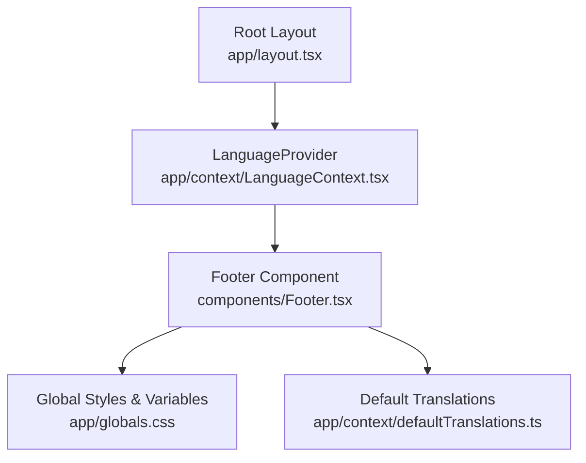
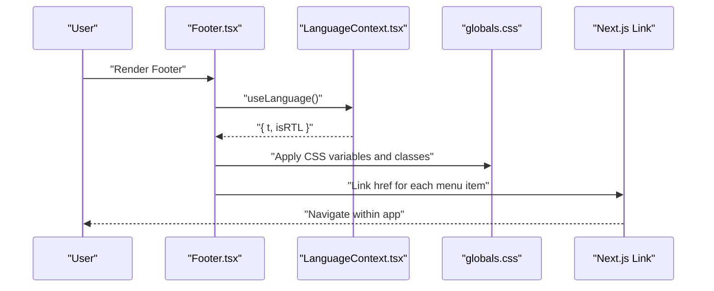
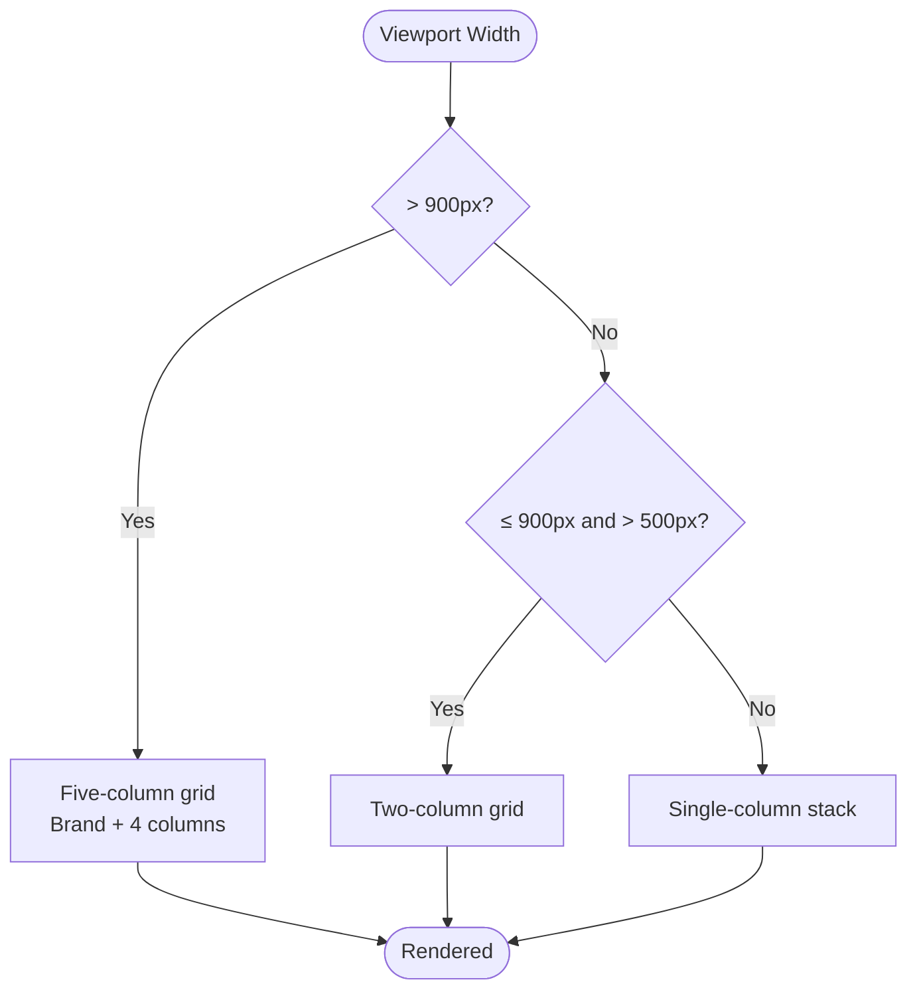
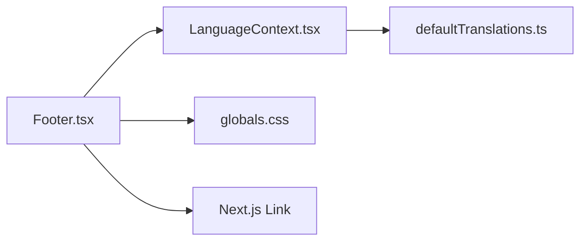

# Footer Component

<cite>
**Referenced Files in This Document**
- [Footer.tsx](file://components/Footer.tsx)
- [LanguageContext.tsx](file://app/context/LanguageContext.tsx)
- [defaultTranslations.ts](file://app/context/defaultTranslations.ts)
- [globals.css](file://app/globals.css)
- [layout.tsx](file://app/layout.tsx)
</cite>

## Table of Contents
1. [Introduction](#introduction)
2. [Project Structure](#project-structure)
3. [Core Components](#core-components)
4. [Architecture Overview](#architecture-overview)
5. [Detailed Component Analysis](#detailed-component-analysis)
6. [Dependency Analysis](#dependency-analysis)
7. [Performance Considerations](#performance-considerations)
8. [Troubleshooting Guide](#troubleshooting-guide)
9. [Conclusion](#conclusion)
10. [Appendices](#appendices)

## Introduction
This document provides comprehensive documentation for the Footer component used across the application. It covers visual layout, link structure, social media integration, responsive behavior, accessibility and SEO considerations, cross-browser compatibility, styling customization, and theme integration. It also explains how translations are applied and how to extend or customize footer content.

## Project Structure
The Footer is a client-side React component that renders a multi-column grid with branding, navigation links, social icons, and a bottom bar containing copyright and legal links. It integrates with the global language context for i18n and uses CSS variables for theming.

**Diagram sources**
- [layout.tsx:57-82](file://app/layout.tsx#L57-L82)
- [LanguageContext.tsx:17-51](file://app/context/LanguageContext.tsx#L17-L51)
- [Footer.tsx:1-173](file://components/Footer.tsx#L1-L173)
- [globals.css:16-42](file://app/globals.css#L16-L42)
- [defaultTranslations.ts:361-416](file://app/context/defaultTranslations.ts#L361-L416)

**Section sources**
- [layout.tsx:57-82](file://app/layout.tsx#L57-L82)
- [Footer.tsx:1-173](file://components/Footer.tsx#L1-L173)
- [LanguageContext.tsx:17-51](file://app/context/LanguageContext.tsx#L17-L51)
- [globals.css:16-42](file://app/globals.css#L16-L42)
- [defaultTranslations.ts:361-416](file://app/context/defaultTranslations.ts#L361-L416)

## Core Components
- Footer (client component): Renders the full footer UI, including brand block, four link columns, social icons, divider, and bottom bar. Uses Next.js Link for navigation and the LanguageContext for translations and RTL support.
- LanguageContext: Provides current language, RTL flag, and translation function t(key). Also sets html lang and dir attributes when language changes.
- Global styles: CSS variables define colors, fonts, and transitions; responsive utilities adjust padding and grid layouts at various breakpoints.
- Default translations: Provide English and Arabic text for all footer keys.

Key responsibilities:
- Display localized content via t() calls.
- Apply directionality based on language (RTL/LTR).
- Render structured navigation and social links.
- Maintain consistent theme using CSS variables.

**Section sources**
- [Footer.tsx:1-173](file://components/Footer.tsx#L1-L173)
- [LanguageContext.tsx:17-51](file://app/context/LanguageContext.tsx#L17-L51)
- [globals.css:16-42](file://app/globals.css#L16-L42)
- [defaultTranslations.ts:361-416](file://app/context/defaultTranslations.ts#L361-L416)

## Architecture Overview
The Footer depends on:
- LanguageContext for dynamic text and direction.
- Global CSS for layout, spacing, typography, and responsive behavior.
- Next.js Link for client-side routing.

**Diagram sources**
- [Footer.tsx:6-16](file://components/Footer.tsx#L6-L16)
- [LanguageContext.tsx:32-44](file://app/context/LanguageContext.tsx#L32-L44)
- [globals.css:3442-3462](file://app/globals.css#L3442-L3462)
- [Footer.tsx:71-146](file://components/Footer.tsx#L71-L146)

## Detailed Component Analysis

### Visual Layout
- Top section: Brand column with logo text, description, and social icons; followed by four link columns: Collection, Company, Shopping, Support.
- Divider: Horizontal gradient line separating top and bottom sections.
- Bottom bar: Copyright notice, legal links (Privacy, Terms, Cookies), and a “Made with” tagline.

Layout mechanics:
- Grid-based layout using .footer-grid with five columns on desktop (brand + four link groups).
- Responsive adjustments collapse to two columns on medium screens and one column on small screens.
- Padding and max-width controlled via inline styles and utility class .responsive-pad.

**Section sources**
- [Footer.tsx:10-170](file://components/Footer.tsx#L10-L170)
- [globals.css:3442-3462](file://app/globals.css#L3442-L3462)
- [globals.css:3350-3369](file://app/globals.css#L3350-L3369)

### Link Structure
- Collection: All Fragrances, Oud & Woody, Sweet & Floral, Fresh & Citrus, Oriental Spice.
- Company: Our Story, Perfume Blog, Contact Us, Admin Dashboard.
- Shopping: My Cart, New Arrivals, Gift Ideas, VIP Consultation.
- Support: Shipping Policy, Returns & Refunds, Fragrance Guide, FAQ.

Implementation pattern:
- Each column maps an array of { key, href } objects to <Link> elements.
- Text is localized via t(key).
- Hover effects change color to gold.

Accessibility notes:
- Links use semantic <a> via Next.js Link.
- Social icons include aria-label for screen readers.

SEO considerations:
- Internal links improve site navigation and crawlability.
- Legal links present but currently point to placeholder routes (#); update to real pages for better SEO.

**Section sources**
- [Footer.tsx:67-146](file://components/Footer.tsx#L67-L146)
- [defaultTranslations.ts:361-416](file://app/context/defaultTranslations.ts#L361-L416)

### Social Media Integration
- Three social icons: Instagram, TikTok, WhatsApp.
- Icons are emoji placeholders; each anchor has aria-label matching platform name.
- Hover state applies border and background color transitions.

Customization guidance:
- Replace emojis with SVG icons or icon libraries.
- Update href values to actual social profiles.
- Keep aria-labels descriptive for accessibility.

**Section sources**
- [Footer.tsx:30-65](file://components/Footer.tsx#L30-L65)

### Responsive Design Patterns
Breakpoints and behaviors:
- Desktop: Five-column grid (brand + 4 link groups).
- Medium (≤900px): Two-column grid.
- Small (≤500px): Single-column stack.
- Padding adapts via .responsive-pad at ≤768px.

**Diagram sources**
- [globals.css:3442-3462](file://app/globals.css#L3442-L3462)
- [globals.css:3350-3369](file://app/globals.css#L3350-L3369)

**Section sources**
- [globals.css:3442-3462](file://app/globals.css#L3442-L3462)
- [globals.css:3350-3369](file://app/globals.css#L3350-L3369)

### Accessibility Compliance
- Semantic HTML: <footer>, headings, lists, and links are properly structured.
- Directionality: Footer respects isRTL from LanguageContext and applies direction style.
- Screen reader support: Social anchors have aria-labels.
- Focus states: Ensure hover/focus contrast remains accessible; consider adding focus-visible outlines if needed.

Recommendations:
- Add skip-to-content link above footer for keyboard users.
- Ensure sufficient color contrast between text and background.
- Consider adding role="navigation" to link groups if not already implied by heading semantics.

**Section sources**
- [Footer.tsx:10-16](file://components/Footer.tsx#L10-L16)
- [Footer.tsx:30-65](file://components/Footer.tsx#L30-L65)
- [LanguageContext.tsx:22-26](file://app/context/LanguageContext.tsx#L22-L26)

### SEO Considerations
- Internal linking: Well-structured nav improves discoverability.
- Legal links: Replace # placeholders with real policy pages.
- Meta tags: Footer does not set meta; ensure page-level metadata is configured elsewhere.

**Section sources**
- [Footer.tsx:157-168](file://components/Footer.tsx#L157-L168)

### Cross-Browser Compatibility
- Uses standard CSS features: CSS variables, flexbox, grid, linear gradients, transitions.
- Backdrop-filter is used in other components; Footer relies on widely supported properties.
- Emoji icons render consistently; consider SVG fallbacks for older browsers.

[No sources needed since this section provides general guidance]

### Styling Customization Options
- Theme variables: Colors and fonts are driven by CSS variables (--gold, --dark, --white-muted, --font-serif, etc.).
- Spacing and width: Inline styles control padding and maxWidth; override via CSS if needed.
- Typography: Font family and sizes are inline; can be moved to CSS classes for consistency.
- Hover effects: Inline event handlers apply color and transform; prefer CSS :hover for maintainability.

Theme integration:
- Change --gold, --dark, --white-muted to re-theme globally.
- Adjust font variables to switch typefaces.
- Modify .footer-grid and .responsive-pad rules for layout tweaks.

**Section sources**
- [globals.css:16-42](file://app/globals.css#L16-L42)
- [Footer.tsx:10-16](file://components/Footer.tsx#L10-L16)
- [globals.css:3442-3462](file://app/globals.css#L3442-L3462)

### Props/Attributes and Customization
Current implementation:
- The Footer component does not accept props; it reads translations from LanguageContext and renders static link arrays.

How to customize without changing code:
- Update defaultTranslations.ts to change labels and descriptions.
- Update LanguageContext to add new languages or fallback logic.
- Extend CSS variables for theme changes.

To make Footer configurable:
- Introduce props for:
  - brandName: string
  - descriptionKey: string
  - socialLinks: Array<{ label, href, icon }>
  - columns: Array<{ titleKey, items: Array<{ key, href }> }>
  - bottomLinks: Array<{ key, href }>
  - showDivider: boolean
- Validate and sanitize inputs; provide sensible defaults.

Example usage patterns (conceptual):
- Multi-column layout: Pass columns prop with custom titles and items.
- Copyright information: Use bottomLinks for legal pages and display year dynamically.
- Contact details: Add a dedicated column with email/phone entries.

[No sources needed since this section proposes conceptual extensions]

## Dependency Analysis
The Footer’s runtime dependencies:
- LanguageContext: Provides t() and isRTL.
- Next.js Link: Client-side navigation.
- Global CSS: Layout, typography, and responsive behavior.

**Diagram sources**
- [Footer.tsx:3-8](file://components/Footer.tsx#L3-L8)
- [LanguageContext.tsx:32-44](file://app/context/LanguageContext.tsx#L32-L44)
- [defaultTranslations.ts:361-416](file://app/context/defaultTranslations.ts#L361-L416)
- [globals.css:3442-3462](file://app/globals.css#L3442-L3462)

**Section sources**
- [Footer.tsx:3-8](file://components/Footer.tsx#L3-L8)
- [LanguageContext.tsx:32-44](file://app/context/LanguageContext.tsx#L32-L44)
- [defaultTranslations.ts:361-416](file://app/context/defaultTranslations.ts#L361-L416)
- [globals.css:3442-3462](file://app/globals.css#L3442-L3462)

## Performance Considerations
- Minimal DOM: Footer is lightweight with simple grids and links.
- Event handlers: Inline onMouseEnter/onMouseLeave cause style mutations; consider CSS :hover for better performance and maintainability.
- Translations: t() lookup is fast; ensure defaultTranslations includes all keys to avoid fallback overhead.

[No sources needed since this section provides general guidance]

## Troubleshooting Guide
Common issues and resolutions:
- Missing translations: If t(key) returns empty strings, verify keys exist in defaultTranslations.ts for both languages.
- Broken social links: Update href values to real URLs; currently placeholders.
- Legal links not working: Replace # with actual route paths for Privacy, Terms, Cookies.
- RTL misalignment: Ensure LanguageContext toggles html dir attribute and Footer applies direction style.
- Responsive stacking: Confirm .footer-grid breakpoints are active; check for conflicting overrides.

**Section sources**
- [Footer.tsx:157-168](file://components/Footer.tsx#L157-L168)
- [LanguageContext.tsx:22-26](file://app/context/LanguageContext.tsx#L22-L26)
- [defaultTranslations.ts:361-416](file://app/context/defaultTranslations.ts#L361-L416)
- [globals.css:3442-3462](file://app/globals.css#L3442-L3462)

## Conclusion
The Footer component delivers a clean, accessible, and responsive multi-column layout with strong localization support. It leverages CSS variables for theming and integrates seamlessly with the application’s language system. To enhance it further, consider making it configurable via props, replacing emoji icons with scalable SVGs, and updating placeholder links to functional routes.

[No sources needed since this section summarizes without analyzing specific files]

## Appendices

### Footer Translation Keys Reference
- Description: en_footer_desc / ar_footer_desc
- Section headers: en_footer_collection / en_footer_company / en_footer_shopping / en_footer_support
- Collection links: en_footer_all_fragrances, en_footer_oud, en_footer_floral, en_footer_citrus, en_footer_oriental
- Company links: en_footer_story, en_footer_blog, en_footer_contact, en_footer_admin
- Shopping links: en_footer_cart, en_footer_new, en_footer_gifts, en_footer_vip
- Support links: en_footer_shipping_policy, en_footer_returns, en_footer_guide, en_footer_faq
- Bottom bar: en_footer_copyright, en_footer_privacy, en_footer_terms, en_footer_cookies, en_footer_made

**Section sources**
- [defaultTranslations.ts:361-416](file://app/context/defaultTranslations.ts#L361-L416)