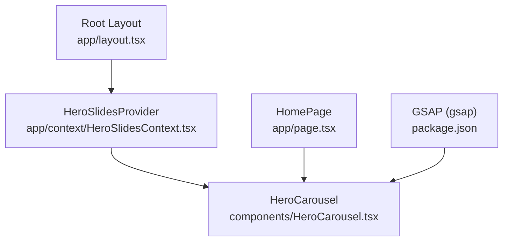
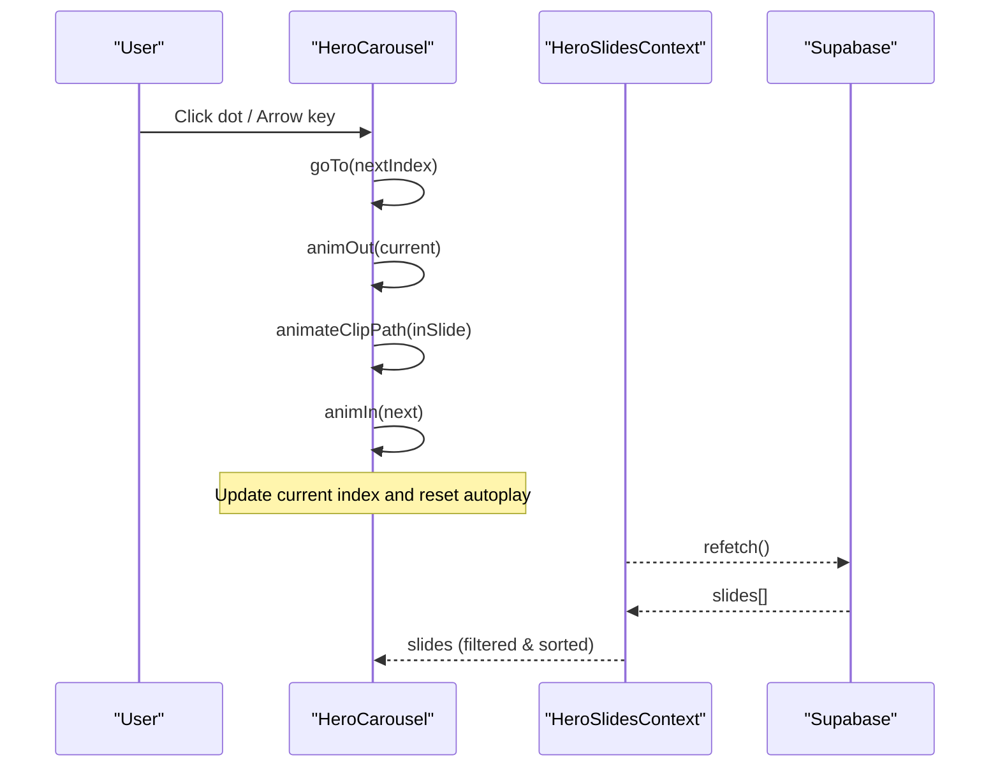
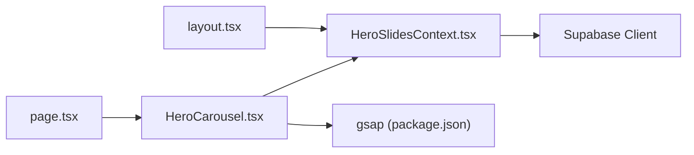

# HeroCarousel Component

<cite>
**Referenced Files in This Document**
- [HeroCarousel.tsx](file://components/HeroCarousel.tsx)
- [HeroSlidesContext.tsx](file://app/context/HeroSlidesContext.tsx)
- [layout.tsx](file://app/layout.tsx)
- [page.tsx](file://app/page.tsx)
- [package.json](file://package.json)
</cite>

## Table of Contents
1. [Introduction](#introduction)
2. [Project Structure](#project-structure)
3. [Core Components](#core-components)
4. [Architecture Overview](#architecture-overview)
5. [Detailed Component Analysis](#detailed-component-analysis)
6. [Dependency Analysis](#dependency-analysis)
7. [Performance Considerations](#performance-considerations)
8. [Troubleshooting Guide](#troubleshooting-guide)
9. [Conclusion](#conclusion)

## Introduction
The HeroCarousel component is a full-viewport hero section that showcases animated, letter-by-letter brand text with rich GSAP-driven transitions, autoplay navigation, and accessible controls. It integrates with a global context to manage dynamic slide content from a database while providing fallback defaults for initial render. The carousel supports keyboard navigation, dot indicators, and subtle 3D parallax on desktop.

## Project Structure
The carousel is implemented as a client-side React component and consumes data from a provider that manages slides via Supabase. The root layout wraps the application with the provider so the carousel can access slides anywhere under the app tree.

**Diagram sources**
- [layout.tsx:62-82](file://app/layout.tsx#L62-L82)
- [HeroSlidesContext.tsx:157-283](file://app/context/HeroSlidesContext.tsx#L157-L283)
- [HeroCarousel.tsx:1-20](file://components/HeroCarousel.tsx#L1-L20)
- [page.tsx:127-135](file://app/page.tsx#L127-L135)
- [package.json:11-17](file://package.json#L11-L17)

**Section sources**
- [layout.tsx:62-82](file://app/layout.tsx#L62-L82)
- [page.tsx:127-135](file://app/page.tsx#L127-L135)
- [HeroSlidesContext.tsx:157-283](file://app/context/HeroSlidesContext.tsx#L157-L283)
- [HeroCarousel.tsx:1-20](file://components/HeroCarousel.tsx#L1-L20)
- [package.json:11-17](file://package.json#L11-L17)

## Core Components
- HeroCarousel: Renders the hero area, handles animations, autoplay, and user interactions.
- HeroSlidesContext: Provides slide data, CRUD operations, and active filtering/sorting.
- Root Layout: Wraps the app with providers including HeroSlidesProvider.

Key responsibilities:
- HeroCarousel:
  - Manages current slide index and animation state.
  - Animates letters per slide using GSAP.
  - Handles autoplay timing and progress dots.
  - Supports keyboard navigation and mouse/touch ripple effects.
  - Applies responsive styles and accessibility attributes.
- HeroSlidesContext:
  - Loads slides from Supabase or falls back to defaults.
  - Exposes add/update/delete/reorder/refetch methods.
  - Filters and sorts slides by active flag and sort_order.

**Section sources**
- [HeroCarousel.tsx:11-156](file://components/HeroCarousel.tsx#L11-L156)
- [HeroSlidesContext.tsx:13-37](file://app/context/HeroSlidesContext.tsx#L13-37)
- [HeroSlidesContext.tsx:157-283](file://app/context/HeroSlidesContext.tsx#L157-L283)

## Architecture Overview
The carousel reads its slide list from the context and renders one slide at a time. Transitions are orchestrated with GSAP timelines and clip-path reveals. Autoplay uses a timer that advances to the next slide after a fixed duration.

**Diagram sources**
- [HeroCarousel.tsx:101-137](file://components/HeroCarousel.tsx#L101-L137)
- [HeroSlidesContext.tsx:161-186](file://app/context/HeroSlidesContext.tsx#L161-L186)

## Detailed Component Analysis

### Visual Appearance
- Full-viewport container with a dark background and a global background image overlaid with a gradient.
- Brand text “NUBIA” rendered as individual letters with a gold gradient fill, rim highlight, and shimmer sweep.
- Each slide includes an eyebrow tag, subtitle, and two call-to-action buttons styled with gold accents.
- Progress dots at the bottom indicate the active slide and animate a fill bar proportional to the autoplay duration.
- A scroll hint icon appears below the fold on larger screens.

Relevant styling and structure:
- Root container and global background overlay.
- Slide wrapper and Nubia letter wrap with 3D perspective.
- Letter styles including gradients, glow, hover lift, and shimmer triggers.
- Eyebrow, subtitle, CTA row, and scroll indicator sections.
- Responsive breakpoints adjusting font sizes, spacing, and visibility.

**Section sources**
- [HeroCarousel.tsx:234-721](file://components/HeroCarousel.tsx#L234-L721)

### Slide Transitions
- Outgoing slide’s letters scatter with staggered transforms and blur.
- Incoming slide is positioned above with a hidden clip-path; then revealed with a smooth ease.
- After reveal, incoming slide’s letters fall into place with staggered motion and blur-to-sharp effect.
- A shimmer sweep class is toggled on the Nubia wrap after entry.

Implementation highlights:
- Clip-path transitions coordinated via GSAP timeline.
- Per-letter entrance/exit animations with configurable durations and easing.
- Z-index management to ensure correct stacking during transitions.

**Section sources**
- [HeroCarousel.tsx:37-99](file://components/HeroCarousel.tsx#L37-L99)
- [HeroCarousel.tsx:101-128](file://components/HeroCarousel.tsx#L101-L128)

### Autoplay Functionality
- Auto-advance occurs after a fixed duration when there are multiple slides.
- A progress dot fill animates linearly over the same duration.
- Timer resets on each slide change.

Configuration:
- Duration constant controls both auto-advance and dot-fill animation length.

**Section sources**
- [HeroCarousel.tsx:130-137](file://components/HeroCarousel.tsx#L130-L137)
- [HeroCarousel.tsx:525-532](file://components/HeroCarousel.tsx#L525-L532)

### User Interaction Controls
- Keyboard navigation: Left/Right arrows switch slides.
- Dot indicators: Clicking a dot navigates to that slide; accessible with role="tab", aria-selected, and Enter key support.
- Touch/mouse ripple: Clicking or touching a letter spawns a ripple and triggers a bounce animation.
- Mouse parallax: On desktop, moving the cursor over the hero applies subtle 3D rotation and translation to letters.

Accessibility:
- Container has role="region" and aria-label.
- Dots have tablist/tab roles and labels.

**Section sources**
- [HeroCarousel.tsx:189-197](file://components/HeroCarousel.tsx#L189-L197)
- [HeroCarousel.tsx:767-786](file://components/HeroCarousel.tsx#L767-L786)
- [HeroCarousel.tsx:199-221](file://components/HeroCarousel.tsx#L199-L221)
- [HeroCarousel.tsx:157-187](file://components/HeroCarousel.tsx#L157-L187)
- [HeroCarousel.tsx:723](file://components/HeroCarousel.tsx#L723)

### Props/Attributes
- The component does not accept props; it reads all configuration from context and internal constants.
- Internal configuration:
  - Letters array defines the brand text characters.
  - Duration constant sets autoplay interval and dot-fill animation length.

If you need to customize behavior, consider extending the component to accept props such as autoplayDuration, transitionEasing, or custom letter set.

**Section sources**
- [HeroCarousel.tsx:8-9](file://components/HeroCarousel.tsx#L8-L9)

### Integration with HeroSlidesContext
- The carousel consumes slides via useHeroSlides().
- Slides are filtered to active ones and sorted by sort_order.
- Default slides are provided until the database loads or if errors occur.

Usage example (conceptual):
- Wrap your app with HeroSlidesProvider in the root layout.
- Render <HeroCarousel /> anywhere within the provider scope.
- Manage slides through the context methods (add/update/delete/reorder/refetch).

Provider setup:
- The root layout includes HeroSlidesProvider around children.

**Section sources**
- [HeroCarousel.tsx:11-13](file://components/HeroCarousel.tsx#L11-L13)
- [HeroSlidesContext.tsx:262-265](file://app/context/HeroSlidesContext.tsx#L262-L265)
- [layout.tsx:68-75](file://app/layout.tsx#L68-L75)

### GSAP Animations
- Entrance: Staggered drop-in with opacity, scale, rotateX, and blur transitions.
- Exit: Scatter with randomized transforms and staggered delays.
- Transition: Clip-path reveal of the incoming slide and hide of the outgoing slide.
- Parallax: Subtle 3D movement based on mouse position.
- Ripple: Elastic bounce on click/touch.

Note: GSAP is registered globally in the page file for other features; the carousel imports gsap directly for its own animations.

**Section sources**
- [HeroCarousel.tsx:37-99](file://components/HeroCarousel.tsx#L37-L99)
- [HeroCarousel.tsx:101-128](file://components/HeroCarousel.tsx#L101-L128)
- [HeroCarousel.tsx:157-187](file://components/HeroCarousel.tsx#L157-L187)
- [HeroCarousel.tsx:199-221](file://components/HeroCarousel.tsx#L199-L221)
- [page.tsx:16-18](file://app/page.tsx#L16-L18)

### Touch/Swipe Support
- Touch events trigger the same ripple/bounce interaction as clicks.
- There is no built-in swipe-to-navigate logic; navigation is available via dots and keyboard.

**Section sources**
- [HeroCarousel.tsx:199-221](file://components/HeroCarousel.tsx#L199-L221)

### Responsive Behavior
- Font sizes scale down across breakpoints.
- Button stack becomes vertical on small screens.
- Scroll hint hides on mobile.
- Parallax is disabled on mobile widths.

**Section sources**
- [HeroCarousel.tsx:537-547](file://components/HeroCarousel.tsx#L537-L547)
- [HeroCarousel.tsx:713-720](file://components/HeroCarousel.tsx#L713-L720)
- [HeroCarousel.tsx:162-163](file://components/HeroCarousel.tsx#L162-L163)

## Dependency Analysis
- Runtime dependencies:
  - React and Next.js for component rendering and client-side execution.
  - GSAP for high-performance animations.
- Context dependency:
  - HeroSlidesContext provides slide data and management APIs.
- External service:
  - Supabase used by the context to fetch and persist slides.

**Diagram sources**
- [HeroCarousel.tsx:3-6](file://components/HeroCarousel.tsx#L3-L6)
- [HeroSlidesContext.tsx:11](file://app/context/HeroSlidesContext.tsx#L11)
- [package.json:11-17](file://package.json#L11-L17)
- [layout.tsx:68-75](file://app/layout.tsx#L68-L75)
- [page.tsx:127-135](file://app/page.tsx#L127-L135)

**Section sources**
- [HeroCarousel.tsx:3-6](file://components/HeroCarousel.tsx#L3-L6)
- [HeroSlidesContext.tsx:11](file://app/context/HeroSlidesContext.tsx#L11)
- [package.json:11-17](file://package.json#L11-L17)
- [layout.tsx:68-75](file://app/layout.tsx#L68-L75)
- [page.tsx:127-135](file://app/page.tsx#L127-L135)

## Performance Considerations
- Animation performance:
  - Uses will-change hints on transform-heavy elements.
  - Disables expensive filters (blur) on mobile to maintain smoothness.
  - Leverages GSAP’s efficient tweening and timeline orchestration.
- Autoplay efficiency:
  - Single timeout-based timer avoids overlapping transitions.
  - Guards prevent redundant transitions when already animating.
- Image loading:
  - Global background image is static; consider lazy-loading or preloading strategies if additional images are added per slide.
  - Avoid heavy CSS filters on low-end devices; mobile paths already disable certain effects.
- Memory and cleanup:
  - Timers and event listeners are cleaned up in effect teardowns.
  - requestAnimationFrame usage is canceled on unmount.

[No sources needed since this section provides general guidance]

## Troubleshooting Guide
- No slides visible:
  - Ensure HeroSlidesProvider wraps the app and that slides exist (defaults are used if none are loaded).
  - Check network requests to Supabase and verify table schema matches expected fields.
- Autoplay not advancing:
  - Verify slides.length >= 2; autoplay is skipped otherwise.
  - Confirm timers are not being cleared elsewhere.
- Animations not triggering:
  - Ensure refs are populated before GSAP runs; the component initializes refs when slides load.
  - Check for console errors related to missing DOM nodes.
- Accessibility issues:
  - Confirm dots have proper roles and labels; test keyboard navigation.
- Mobile performance:
  - Disable heavy effects if needed; the component already adapts some behaviors for smaller viewports.

**Section sources**
- [HeroSlidesContext.tsx:161-186](file://app/context/HeroSlidesContext.tsx#L161-L186)
- [HeroCarousel.tsx:130-137](file://components/HeroCarousel.tsx#L130-L137)
- [HeroCarousel.tsx:25-35](file://components/HeroCarousel.tsx#L25-L35)
- [HeroCarousel.tsx:767-786](file://components/HeroCarousel.tsx#L767-L786)

## Conclusion
The HeroCarousel delivers a polished, animated hero experience with robust integration to dynamic slide content. Its design balances visual richness with performance-conscious choices and accessibility considerations. By leveraging GSAP for smooth transitions and a centralized context for content management, it remains easy to extend and maintain.