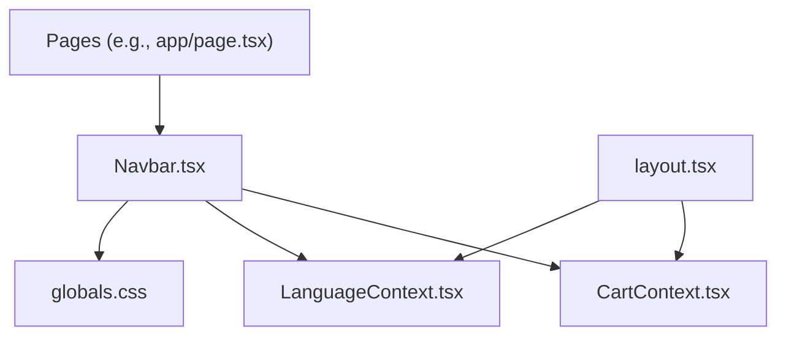
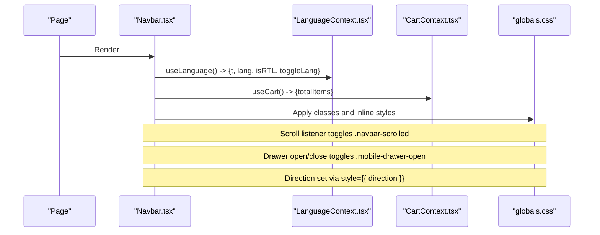
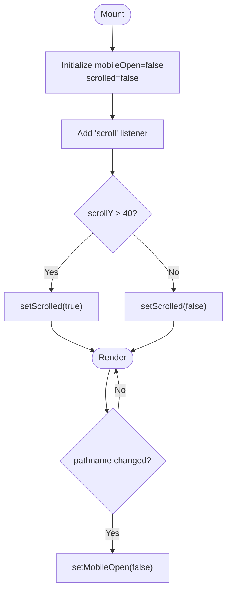
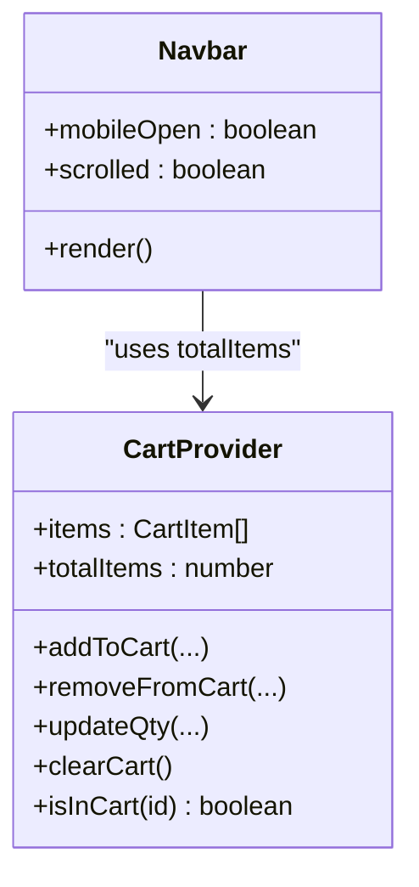
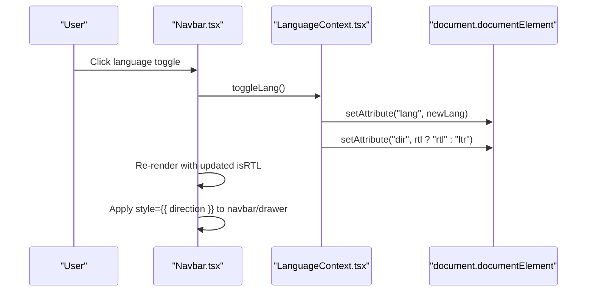
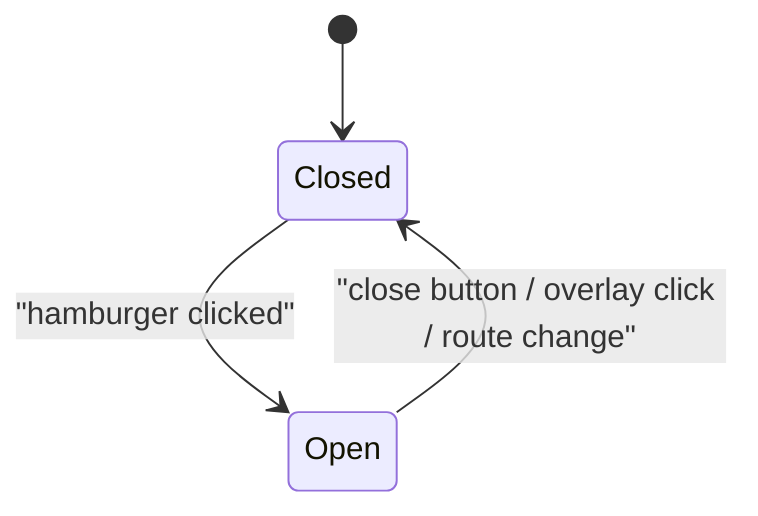
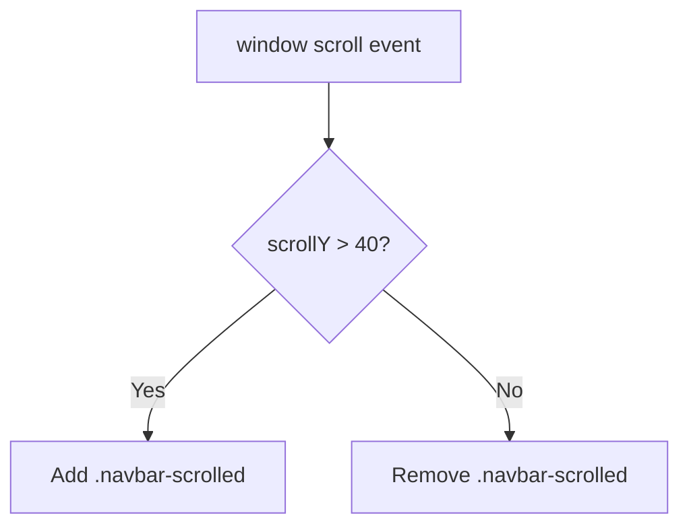
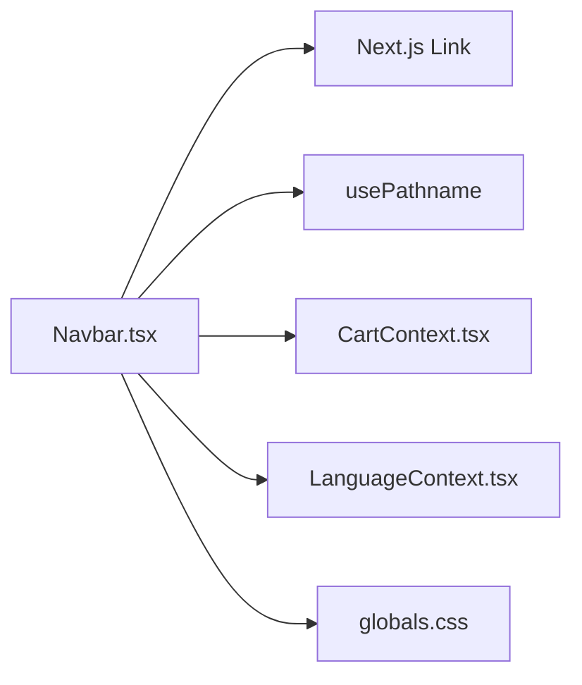

# Navbar Component

<cite>
**Referenced Files in This Document**
- [Navbar.tsx](file://components/Navbar.tsx)
- [CartContext.tsx](file://app/context/CartContext.tsx)
- [LanguageContext.tsx](file://app/context/LanguageContext.tsx)
- [layout.tsx](file://app/layout.tsx)
- [globals.css](file://app/globals.css)
</cite>

## Table of Contents
1. [Introduction](#introduction)
2. [Project Structure](#project-structure)
3. [Core Components](#core-components)
4. [Architecture Overview](#architecture-overview)
5. [Detailed Component Analysis](#detailed-component-analysis)
6. [Dependency Analysis](#dependency-analysis)
7. [Performance Considerations](#performance-considerations)
8. [Troubleshooting Guide](#troubleshooting-guide)
9. [Conclusion](#conclusion)
10. [Appendices](#appendices)

## Introduction
This document provides comprehensive documentation for the Navbar component, including its visual appearance (announcement bar, desktop navigation, mobile drawer), responsive behavior, props and attributes, state management, integration with CartContext and LanguageContext, usage examples, accessibility features, RTL support, and scroll effects.

## Project Structure
The Navbar is a client-side React component used across pages. It integrates with:
- CartContext to display cart item count
- LanguageContext for internationalization and RTL layout
- Global CSS for styling and animations

**Diagram sources**
- [Navbar.tsx:1-187](file://components/Navbar.tsx#L1-L187)
- [CartContext.tsx:1-104](file://app/context/CartContext.tsx#L1-L104)
- [LanguageContext.tsx:1-58](file://app/context/LanguageContext.tsx#L1-L58)
- [layout.tsx:56-81](file://app/layout.tsx#L56-L81)
- [globals.css:72-200](file://app/globals.css#L72-L200)

**Section sources**
- [Navbar.tsx:1-187](file://components/Navbar.tsx#L1-L187)
- [layout.tsx:56-81](file://app/layout.tsx#L56-L81)

## Core Components
- Announcement Bar: A scrolling marquee that remains LTR regardless of page direction.
- Desktop Navigation: Horizontal links with active state highlighting and a dashboard CTA.
- Right Actions: Language toggle button, cart icon with badge, and hamburger menu.
- Mobile Drawer: Slide-in panel with brand header, close button, nav links, language toggle, cart link, and dashboard CTA.
- Overlay: Backdrop that closes the drawer when clicked.

Key behaviors:
- Scroll effect: Adds a “scrolled” class after threshold to enhance visibility.
- Route-aware: Drawer closes automatically on route change.
- RTL adaptation: Applies direction to navbar and drawer based on current language.

**Section sources**
- [Navbar.tsx:9-187](file://components/Navbar.tsx#L9-L187)
- [globals.css:72-200](file://app/globals.css#L72-L200)
- [globals.css:1386-1434](file://app/globals.css#L1386-L1434)
- [globals.css:2189-2335](file://app/globals.css#L2189-L2335)
- [globals.css:2336-2503](file://app/globals.css#L2336-L2503)

## Architecture Overview
The Navbar consumes global contexts provided at the root layout level. The language context updates HTML attributes for i18n and RTL, while the cart context persists items and exposes totalItems for the badge.

**Diagram sources**
- [Navbar.tsx:9-24](file://components/Navbar.tsx#L9-L24)
- [LanguageContext.tsx:17-51](file://app/context/LanguageContext.tsx#L17-L51)
- [CartContext.tsx:28-97](file://app/context/CartContext.tsx#L28-L97)
- [globals.css:2189-2335](file://app/globals.css#L2189-L2335)
- [globals.css:2336-2503](file://app/globals.css#L2336-L2503)

## Detailed Component Analysis

### Visual Appearance
- Announcement Bar: Fixed top strip with continuous LTR marquee animation; pauses on hover.
- Desktop Nav: Transparent glass-like background with blur; gold accents; underline hover effect; active link highlighted in gold.
- Right Actions: Pill-shaped language toggle, circular cart icon with animated badge, and a styled hamburger button.
- Mobile Drawer: Full-height slide-in panel with gradient background, brand header, close button, vertical nav list, and action buttons.

**Section sources**
- [globals.css:1386-1434](file://app/globals.css#L1386-L1434)
- [globals.css:72-200](file://app/globals.css#L72-L200)
- [globals.css:2189-2335](file://app/globals.css#L2189-L2335)
- [globals.css:2336-2503](file://app/globals.css#L2336-L2503)

### Props and Attributes
- No explicit props are defined; the component reads from contexts and Next.js router.
- Accessibility attributes:
  - aria-label on language toggle, cart link, and hamburger/close buttons.
  - title on language toggle indicating next language switch.
  - aria-hidden on decorative icon wrapper.

**Section sources**
- [Navbar.tsx:88-96](file://components/Navbar.tsx#L88-L96)
- [Navbar.tsx:98-107](file://components/Navbar.tsx#L98-L107)
- [Navbar.tsx:110-118](file://components/Navbar.tsx#L110-L118)
- [Navbar.tsx:134-142](file://components/Navbar.tsx#L134-L142)

### State Management
- mobileOpen: Controls drawer visibility; toggled by hamburger and close button; closed on overlay click and route change.
- scrolled: Toggles a “scrolled” class when window.scrollY exceeds a threshold.

**Diagram sources**
- [Navbar.tsx:13-23](file://components/Navbar.tsx#L13-L23)
- [Navbar.tsx:16-20](file://components/Navbar.tsx#L16-L20)

**Section sources**
- [Navbar.tsx:13-23](file://components/Navbar.tsx#L13-L23)
- [Navbar.tsx:16-20](file://components/Navbar.tsx#L16-L20)

### Integration with CartContext
- Reads totalItems to render a cart badge when greater than zero.
- Badge animates on appearance using a keyframe.

**Diagram sources**
- [CartContext.tsx:28-97](file://app/context/CartContext.tsx#L28-L97)
- [Navbar.tsx:11](file://components/Navbar.tsx#L11)
- [Navbar.tsx:104-107](file://components/Navbar.tsx#L104-L107)

**Section sources**
- [CartContext.tsx:28-97](file://app/context/CartContext.tsx#L28-L97)
- [Navbar.tsx:11](file://components/Navbar.tsx#L11)
- [Navbar.tsx:104-107](file://components/Navbar.tsx#L104-L107)

### Integration with LanguageContext
- Provides t(key) for translations, lang, isRTL, and toggleLang.
- Updates <html> lang and dir attributes globally.
- Navbar applies inline direction to both navbar and drawer.

**Diagram sources**
- [LanguageContext.tsx:17-51](file://app/context/LanguageContext.tsx#L17-L51)
- [Navbar.tsx:12](file://components/Navbar.tsx#L12)
- [Navbar.tsx:58](file://components/Navbar.tsx#L58)
- [Navbar.tsx:124](file://components/Navbar.tsx#L124)

**Section sources**
- [LanguageContext.tsx:17-51](file://app/context/LanguageContext.tsx#L17-L51)
- [Navbar.tsx:12](file://components/Navbar.tsx#L12)
- [Navbar.tsx:58](file://components/Navbar.tsx#L58)
- [Navbar.tsx:124](file://components/Navbar.tsx#L124)

### Responsive Behavior
- Breakpoint at 900px:
  - Desktop links hidden below 900px; hamburger appears.
  - Drawer and overlay hidden above 900px.
- Drawer slides in from right; RTL flips positioning via direction.

**Diagram sources**
- [globals.css:2496-2503](file://app/globals.css#L2496-L2503)
- [Navbar.tsx:110-118](file://components/Navbar.tsx#L110-L118)
- [Navbar.tsx:134-142](file://components/Navbar.tsx#L134-L142)
- [Navbar.tsx:181-183](file://components/Navbar.tsx#L181-L183)
- [Navbar.tsx:23](file://components/Navbar.tsx#L23)

**Section sources**
- [globals.css:2496-2503](file://app/globals.css#L2496-L2503)
- [Navbar.tsx:110-118](file://components/Navbar.tsx#L110-L118)
- [Navbar.tsx:134-142](file://components/Navbar.tsx#L134-L142)
- [Navbar.tsx:181-183](file://components/Navbar.tsx#L181-L183)
- [Navbar.tsx:23](file://components/Navbar.tsx#L23)

### Scroll Effects
- Adds a “scrolled” class when scrollY > 40, increasing opacity and adding shadow.

**Diagram sources**
- [Navbar.tsx:16-20](file://components/Navbar.tsx#L16-L20)
- [globals.css:2189-2193](file://app/globals.css#L2189-L2193)

**Section sources**
- [Navbar.tsx:16-20](file://components/Navbar.tsx#L16-L20)
- [globals.css:2189-2193](file://app/globals.css#L2189-L2193)

### Accessibility Features
- Descriptive aria-labels on interactive elements:
  - Language toggle button
  - Cart link
  - Hamburger button
  - Drawer close button
- Decorative icon wrapper marked aria-hidden.
- Keyboard navigation:
  - All interactive elements are native buttons or links, focusable by default.
  - Drawer can be closed via close button or overlay click.
- Title attribute on language toggle indicates next language.

**Section sources**
- [Navbar.tsx:88-96](file://components/Navbar.tsx#L88-L96)
- [Navbar.tsx:98-107](file://components/Navbar.tsx#L98-L107)
- [Navbar.tsx:110-118](file://components/Navbar.tsx#L110-L118)
- [Navbar.tsx:134-142](file://components/Navbar.tsx#L134-L142)
- [Navbar.tsx:60-63](file://components/Navbar.tsx#L60-L63)

### Internationalization and RTL Support
- Uses t(key) for all user-facing strings.
- LanguageContext sets html lang and dir attributes.
- Navbar applies inline direction to ensure correct text flow in both desktop and mobile views.
- Announcement bar is isolated to LTR to keep marquee animation consistent.

**Section sources**
- [Navbar.tsx:25-33](file://components/Navbar.tsx#L25-L33)
- [Navbar.tsx:58](file://components/Navbar.tsx#L58)
- [Navbar.tsx:124](file://components/Navbar.tsx#L124)
- [LanguageContext.tsx:22-26](file://app/context/LanguageContext.tsx#L22-L26)
- [globals.css:1386-1398](file://app/globals.css#L1386-L1398)

### Usage Examples
- Basic usage: Include the Navbar in any page where you want the global header.
- With internationalization: Ensure LanguageProvider wraps your app (already done in layout).
- With RTL: Toggle language to switch between English and Arabic; the navbar adapts direction automatically.
- With cart badge: Ensure CartProvider wraps your app; the badge reflects totalItems.

Example references:
- Home page includes Navbar directly within its content tree.
- Layout provides providers so Navbar can consume contexts without additional setup.

**Section sources**
- [page.tsx:128-129](file://app/page.tsx#L128-L129)
- [layout.tsx:64-76](file://app/layout.tsx#L64-L76)

## Dependency Analysis
- Direct dependencies:
  - Next.js Link and usePathname for routing and active states.
  - CartContext for cart totals.
  - LanguageContext for translations and direction.
- Styling dependency:
  - globals.css for all visual rules, animations, and responsive breakpoints.

**Diagram sources**
- [Navbar.tsx:3-7](file://components/Navbar.tsx#L3-L7)
- [CartContext.tsx:28-97](file://app/context/CartContext.tsx#L28-L97)
- [LanguageContext.tsx:17-51](file://app/context/LanguageContext.tsx#L17-L51)
- [globals.css:72-200](file://app/globals.css#L72-L200)

**Section sources**
- [Navbar.tsx:3-7](file://components/Navbar.tsx#L3-L7)
- [CartContext.tsx:28-97](file://app/context/CartContext.tsx#L28-L97)
- [LanguageContext.tsx:17-51](file://app/context/LanguageContext.tsx#L17-L51)
- [globals.css:72-200](file://app/globals.css#L72-L200)

## Performance Considerations
- Scroll listener: Uses a simple threshold check; consider throttling if performance issues arise on low-end devices.
- Drawer transitions: GPU-accelerated transform changes for smooth sliding.
- Marquee animation: Uses will-change and transforms; pause on hover improves perceived performance during interaction.
- Context re-renders: Navbar subscribes only to needed values (totalItems, lang, isRTL, t), minimizing unnecessary updates.

[No sources needed since this section provides general guidance]

## Troubleshooting Guide
- Drawer does not close on route change:
  - Verify pathname dependency in the effect and ensure Next.js router is available.
- Cart badge not updating:
  - Confirm CartProvider wraps the app and totalItems is computed correctly.
- RTL not applied:
  - Ensure LanguageProvider is present and toggling language updates html attributes.
- Announcement bar misaligned in RTL:
  - The bar is intentionally LTR; verify no overriding direction styles.

**Section sources**
- [Navbar.tsx:23](file://components/Navbar.tsx#L23)
- [CartContext.tsx:87-88](file://app/context/CartContext.tsx#L87-L88)
- [LanguageContext.tsx:22-26](file://app/context/LanguageContext.tsx#L22-L26)
- [globals.css:1386-1398](file://app/globals.css#L1386-L1398)

## Conclusion
The Navbar component delivers a polished, accessible, and fully responsive header with an announcement bar, desktop navigation, and a mobile drawer. It integrates seamlessly with CartContext and LanguageContext to provide real-time cart badges and robust internationalization with RTL support. Its design leverages modern CSS techniques for smooth interactions and clear visual hierarchy.

[No sources needed since this section summarizes without analyzing specific files]

## Appendices

### Key CSS Classes and Behaviors
- Announcement bar:
  - .announcement-bar, .announcement-track, .announcement-group, .announcement-item
- Navbar:
  - .header-container, .navbar, .navbar-scrolled, .navbar-brand, .navbar-links, .navbar-right
- Right actions:
  - .cart-icon-btn, .cart-badge, .hamburger, .lang-toggle-btn, .lang-toggle-btn-mobile
- Mobile drawer:
  - .mobile-drawer, .mobile-drawer-open, .mobile-drawer-inner, .mobile-drawer-header, .mobile-drawer-close, .mobile-nav-links, .mobile-nav-link, .mobile-drawer-actions, .mobile-overlay

**Section sources**
- [globals.css:1386-1434](file://app/globals.css#L1386-L1434)
- [globals.css:72-200](file://app/globals.css#L72-L200)
- [globals.css:2189-2335](file://app/globals.css#L2189-L2335)
- [globals.css:2336-2503](file://app/globals.css#L2336-L2503)