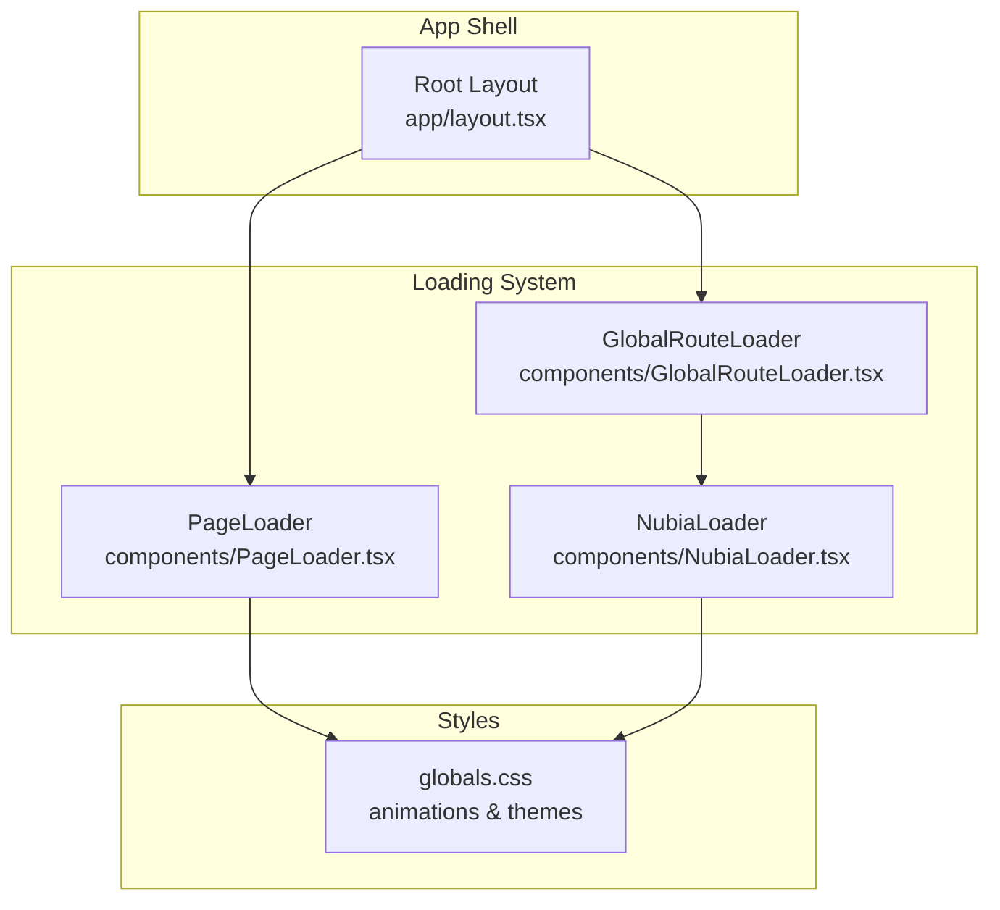
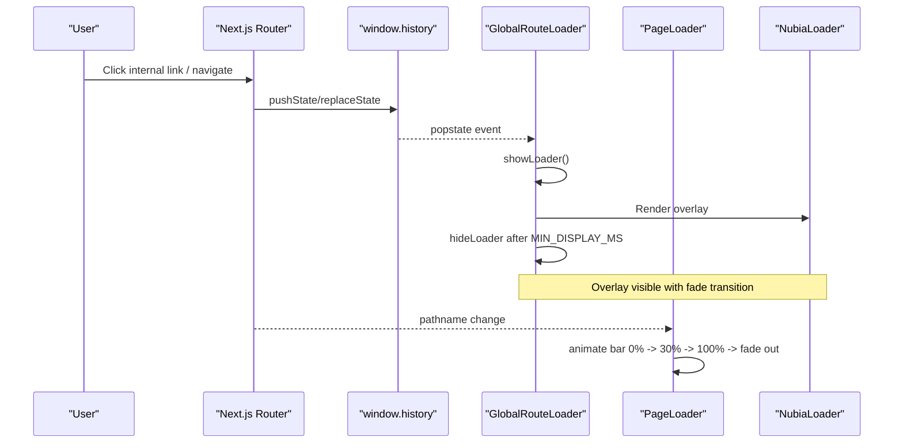
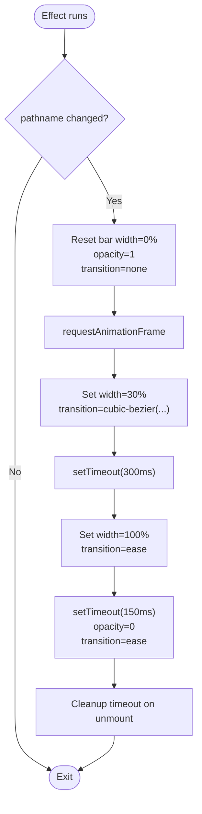
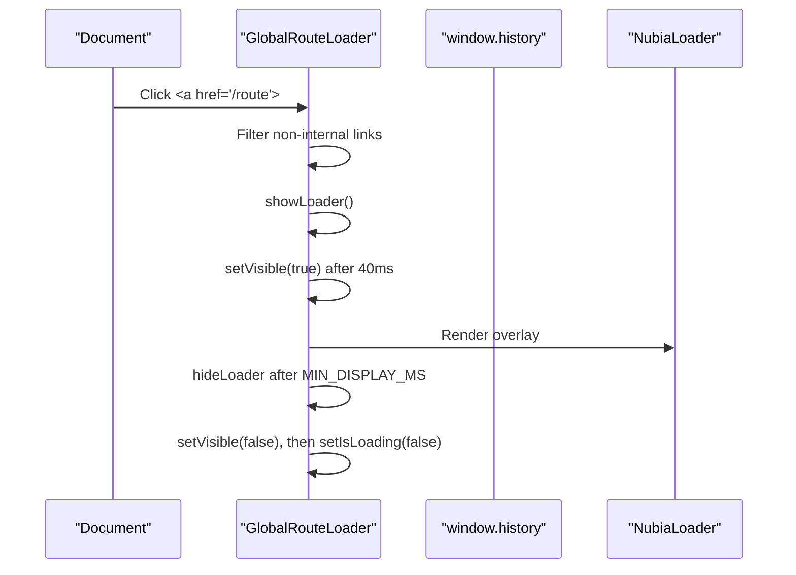
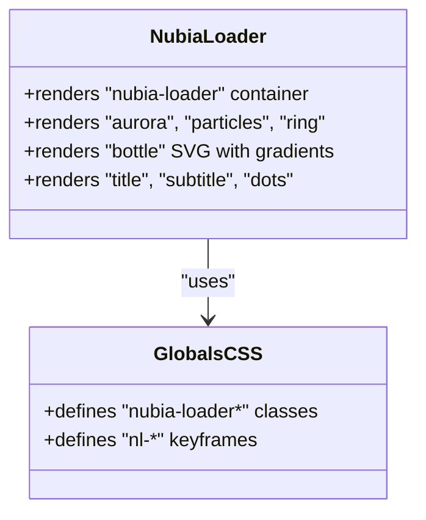
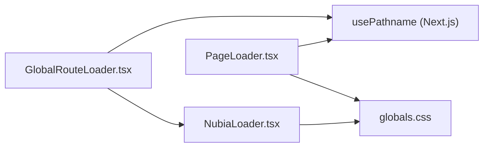

# PageLoader Component

<cite>
**Referenced Files in This Document**
- [PageLoader.tsx](file://components/PageLoader.tsx)
- [GlobalRouteLoader.tsx](file://components/GlobalRouteLoader.tsx)
- [NubiaLoader.tsx](file://components/NubiaLoader.tsx)
- [layout.tsx](file://app/layout.tsx)
- [loading.tsx](file://app/loading.tsx)
- [globals.css](file://app/globals.css)
</cite>

## Table of Contents
1. [Introduction](#introduction)
2. [Project Structure](#project-structure)
3. [Core Components](#core-components)
4. [Architecture Overview](#architecture-overview)
5. [Detailed Component Analysis](#detailed-component-analysis)
6. [Dependency Analysis](#dependency-analysis)
7. [Performance Considerations](#performance-considerations)
8. [Troubleshooting Guide](#troubleshooting-guide)
9. [Conclusion](#conclusion)
10. [Appendices](#appendices)

## Introduction
This document provides comprehensive documentation for the PageLoader component and its related loading system within a Next.js application. It covers:
- Visual appearance and animation effects of the top progress bar (PageLoader) and the full-screen overlay loader (GlobalRouteLoader with NubiaLoader).
- How routing transitions are detected and how overlays behave during navigation.
- Integration points with Next.js routing and error handling scenarios.
- Performance optimization strategies and accessibility considerations.

Note: The current implementation does not expose props or attributes to customize style, duration, or positioning. Customization is achieved by editing the component files and CSS variables.

## Project Structure
The loading system spans three primary components and integrates into the root layout:
- PageLoader: A thin top-of-page progress bar that animates on route changes.
- GlobalRouteLoader: A full-screen overlay that shows an elaborate brand-themed loader during client-side navigation.
- NubiaLoader: The visual content rendered inside the overlay.

**Diagram sources**
- [layout.tsx:57-83](file://app/layout.tsx#L57-L83)
- [PageLoader.tsx:1-77](file://components/PageLoader.tsx#L1-L77)
- [GlobalRouteLoader.tsx:1-99](file://components/GlobalRouteLoader.tsx#L1-L99)
- [NubiaLoader.tsx:1-70](file://components/NubiaLoader.tsx#L1-L70)
- [globals.css:4082-4248](file://app/globals.css#L4082-L4248)

**Section sources**
- [layout.tsx:57-83](file://app/layout.tsx#L57-L83)
- [PageLoader.tsx:1-77](file://components/PageLoader.tsx#L1-L77)
- [GlobalRouteLoader.tsx:1-99](file://components/GlobalRouteLoader.tsx#L1-L99)
- [NubiaLoader.tsx:1-70](file://components/NubiaLoader.tsx#L1-L70)
- [globals.css:4082-4248](file://app/globals.css#L4082-L4248)

## Core Components
- PageLoader
  - Renders a fixed top bar at the very top of the viewport.
  - Animates width from 0% to 30%, then to 100%, and finally fades out.
  - Uses a gradient background with a shimmering effect.
  - Integrates with Next.js routing via usePathname to detect route changes.

- GlobalRouteLoader
  - Detects client-side navigation through history API and anchor clicks.
  - Shows a full-screen overlay with a fade-in transition.
  - Ensures a minimum display time to avoid flicker.
  - Renders NubiaLoader as the visual indicator.

- NubiaLoader
  - Displays a themed, animated brand loader including particles, rings, a bottle SVG, title, subtitle, and bouncing dots.
  - Styled entirely via global CSS classes and keyframes.

**Section sources**
- [PageLoader.tsx:1-77](file://components/PageLoader.tsx#L1-L77)
- [GlobalRouteLoader.tsx:1-99](file://components/GlobalRouteLoader.tsx#L1-L99)
- [NubiaLoader.tsx:1-70](file://components/NubiaLoader.tsx#L1-L70)
- [globals.css:4082-4248](file://app/globals.css#L4082-L4248)

## Architecture Overview
The loading architecture combines two complementary indicators:
- A subtle top progress bar (PageLoader) for quick feedback during route transitions.
- An immersive full-screen overlay (GlobalRouteLoader + NubiaLoader) for longer or more prominent transitions.

**Diagram sources**
- [GlobalRouteLoader.tsx:32-55](file://components/GlobalRouteLoader.tsx#L32-L55)
- [GlobalRouteLoader.tsx:57-81](file://components/GlobalRouteLoader.tsx#L57-L81)
- [GlobalRouteLoader.tsx:26-30](file://components/GlobalRouteLoader.tsx#L26-L30)
- [PageLoader.tsx:12-41](file://components/PageLoader.tsx#L12-L41)
- [NubiaLoader.tsx:1-70](file://components/NubiaLoader.tsx#L1-L70)

## Detailed Component Analysis

### PageLoader
- Purpose: Provide a lightweight top-of-page progress indicator during route transitions.
- Appearance:
  - Fixed position at the top of the viewport.
  - Height set to a small value; rounded right corners; gold-toned gradient background.
  - Shimmer animation applied to the background position.
- Animation Effects:
  - On route change:
    - Reset width to 0% and opacity to 1 without transition.
    - Animate to 30% width with a cubic-bezier easing.
    - After a short delay, animate to 100% width with a faster ease.
    - Fade out opacity with a smooth transition.
- Positioning:
  - Fixed at top-left/right edges spanning full width.
  - High z-index ensures it appears above most UI elements.
  - pointerEvents disabled so it does not block user interactions.
- Integration with Next.js:
  - Subscribes to pathname changes using usePathname.
  - Triggers animations only when the path actually changes.
- Props/Attributes:
  - None exposed. All behavior and styling are hardcoded.
- Error Handling:
  - Guards against missing DOM node before applying styles.
  - Cleans up timers on unmount to prevent memory leaks.

**Diagram sources**
- [PageLoader.tsx:12-41](file://components/PageLoader.tsx#L12-L41)

**Section sources**
- [PageLoader.tsx:1-77](file://components/PageLoader.tsx#L1-L77)

### GlobalRouteLoader
- Purpose: Show a full-screen branded overlay during client-side navigation.
- Behavior:
  - Intercepts window.history.pushState/replaceState and popstate events.
  - Listens to click events on anchors to trigger loader for internal links.
  - Skips external links, hash-only links, mailto/tel, downloads, and new-tab links.
  - Uses a minimal delay before showing the overlay to avoid flicker on fast navigations.
  - Enforces a minimum display duration to ensure visibility.
- Overlay Behavior:
  - Fixed full-screen container with high z-index.
  - Opacity transition for fade-in/out.
  - pointerEvents toggled to allow interaction only when fully visible.
- Rendering:
  - Renders NubiaLoader while active.

**Diagram sources**
- [GlobalRouteLoader.tsx:57-81](file://components/GlobalRouteLoader.tsx#L57-L81)
- [GlobalRouteLoader.tsx:14-24](file://components/GlobalRouteLoader.tsx#L14-L24)
- [GlobalRouteLoader.tsx:26-30](file://components/GlobalRouteLoader.tsx#L26-L30)
- [NubiaLoader.tsx:1-70](file://components/NubiaLoader.tsx#L1-L70)

**Section sources**
- [GlobalRouteLoader.tsx:1-99](file://components/GlobalRouteLoader.tsx#L1-L99)

### NubiaLoader
- Purpose: Provide a visually rich, brand-aligned loading screen.
- Visual Elements:
  - Aurora background glow.
  - Floating particles rising upward.
  - Rotating rings with contrasting border colors.
  - Animated perfume bottle SVG with liquid fill animation.
  - Title and subtitle text with shimmer effect.
  - Bouncing dots sequence.
- Styling:
  - Entirely styled via global CSS classes and keyframes.
  - Uses theme variables for consistent color palette.

**Diagram sources**
- [NubiaLoader.tsx:1-70](file://components/NubiaLoader.tsx#L1-L70)
- [globals.css:4082-4248](file://app/globals.css#L4082-L4248)

**Section sources**
- [NubiaLoader.tsx:1-70](file://components/NubiaLoader.tsx#L1-L70)
- [globals.css:4082-4248](file://app/globals.css#L4082-L4248)

### Root Loading Screen (Server-Side)
- app/loading.tsx renders a root-level loading component used by Next.js during server rendering or initial page load.
- Currently delegates to NubiaLoader, providing a consistent brand experience across both client and server transitions.

**Section sources**
- [loading.tsx:1-7](file://app/loading.tsx#L1-L7)
- [NubiaLoader.tsx:1-70](file://components/NubiaLoader.tsx#L1-L70)

## Dependency Analysis
- PageLoader depends on:
  - React hooks: useEffect, useRef.
  - Next.js navigation hook: usePathname.
- GlobalRouteLoader depends on:
  - React hooks: useEffect, useState, useCallback.
  - Next.js navigation hook: usePathname.
  - Window APIs: history.pushState, history.replaceState, popstate.
  - NubiaLoader for visuals.
- NubiaLoader depends on:
  - Global CSS classes and keyframes.

**Diagram sources**
- [PageLoader.tsx:1-77](file://components/PageLoader.tsx#L1-L77)
- [GlobalRouteLoader.tsx:1-99](file://components/GlobalRouteLoader.tsx#L1-L99)
- [NubiaLoader.tsx:1-70](file://components/NubiaLoader.tsx#L1-L70)
- [globals.css:4082-4248](file://app/globals.css#L4082-L4248)

**Section sources**
- [PageLoader.tsx:1-77](file://components/PageLoader.tsx#L1-L77)
- [GlobalRouteLoader.tsx:1-99](file://components/GlobalRouteLoader.tsx#L1-L99)
- [NubiaLoader.tsx:1-70](file://components/NubiaLoader.tsx#L1-L70)
- [globals.css:4082-4248](file://app/globals.css#L4082-L4248)

## Performance Considerations
- Avoid unnecessary re-renders:
  - PageLoader uses refs to manage DOM updates and timeouts, minimizing state churn.
  - GlobalRouteLoader debounces visibility with a small delay and enforces a minimum display time to reduce flicker.
- Efficient animations:
  - Both loaders rely on CSS transforms and opacity where possible, which are GPU-accelerated.
  - Particle count and durations are tuned to be visually pleasing without heavy CPU usage.
- Event listener cleanup:
  - GlobalRouteLoader removes history overrides and event listeners on unmount to prevent leaks.
- Pointer events:
  - PageLoader sets pointerEvents to none to avoid blocking interactions.
  - GlobalRouteLoader toggles pointerEvents based on visibility to maintain usability.

[No sources needed since this section provides general guidance]

## Troubleshooting Guide
- Loader does not appear on navigation:
  - Ensure GlobalRouteLoader is mounted in the root layout.
  - Verify that navigation occurs via client-side routing (pushState/popstate) rather than full page reloads.
- Loader flickers briefly:
  - The component includes a minimal delay before showing the overlay; adjust timing if needed by editing the relevant constants and timeouts.
- Top bar not animating:
  - Confirm that pathname changes are occurring and that the effect dependency array includes pathname.
  - Check that the DOM reference exists before applying styles.
- Accessibility concerns:
  - The full-screen overlay currently uses aria-hidden on decorative elements. Consider adding role="status" and aria-live="polite" to announce loading states to assistive technologies.
  - Ensure focus management does not trap users behind the overlay unless necessary.

**Section sources**
- [layout.tsx:57-83](file://app/layout.tsx#L57-L83)
- [GlobalRouteLoader.tsx:32-55](file://components/GlobalRouteLoader.tsx#L32-L55)
- [GlobalRouteLoader.tsx:57-81](file://components/GlobalRouteLoader.tsx#L57-L81)
- [PageLoader.tsx:12-41](file://components/PageLoader.tsx#L12-L41)

## Conclusion
The loading system combines a subtle top progress bar and a full-screen branded overlay to provide clear, performant feedback during navigation. While the current implementation does not expose props for customization, it is straightforward to adapt by editing the component files and CSS variables. For robust integration, keep the loaders mounted in the root layout and rely on Next.js routing hooks and history events to drive their behavior.

[No sources needed since this section summarizes without analyzing specific files]

## Appendices

### Usage Examples and Integration Notes
- Mounting in the layout:
  - Include both PageLoader and GlobalRouteLoader in the root layout to cover all navigation scenarios.
- Server-side loading:
  - Use app/loading.tsx to render a consistent loader during server-rendered transitions.
- Routing transitions:
  - Client-side navigation triggers both loaders automatically via pathname changes and history events.
- Error handling scenarios:
  - If a route fails to load, consider integrating a global error boundary to show a fallback message while keeping the loaders hidden to avoid confusion.

**Section sources**
- [layout.tsx:57-83](file://app/layout.tsx#L57-L83)
- [loading.tsx:1-7](file://app/loading.tsx#L1-L7)
- [GlobalRouteLoader.tsx:32-55](file://components/GlobalRouteLoader.tsx#L32-L55)
- [PageLoader.tsx:12-41](file://components/PageLoader.tsx#L12-L41)