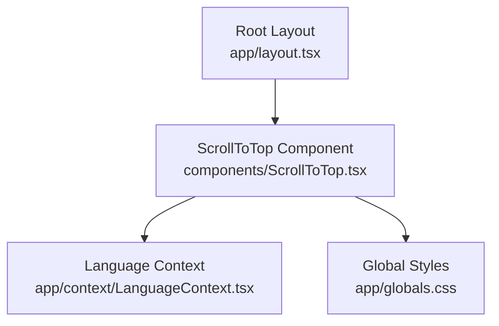
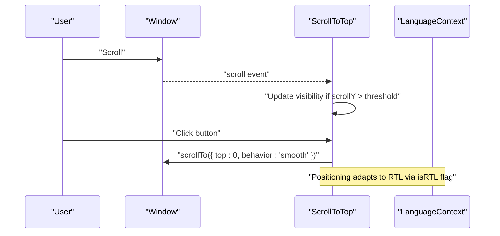
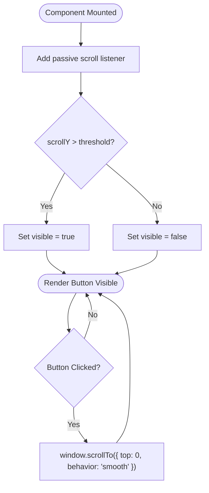
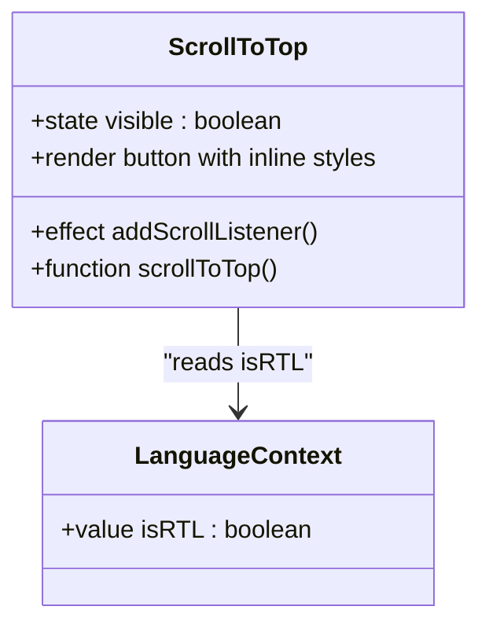
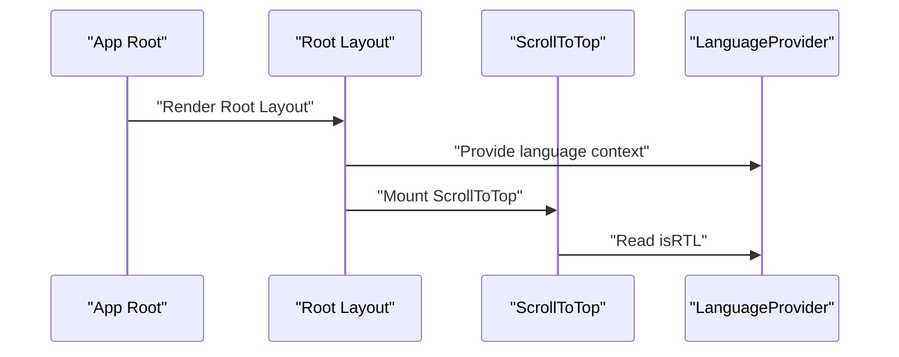
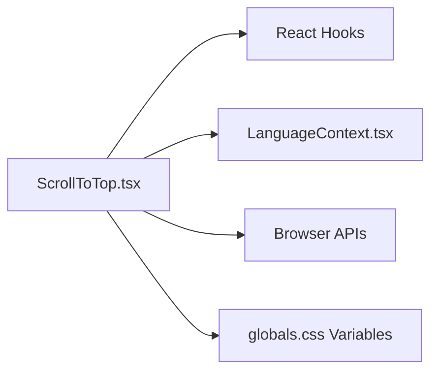

# ScrollToTop Component

<cite>
**Referenced Files in This Document**
- [ScrollToTop.tsx](file://components/ScrollToTop.tsx)
- [layout.tsx](file://app/layout.tsx)
- [LanguageContext.tsx](file://app/context/LanguageContext.tsx)
- [globals.css](file://app/globals.css)
</cite>

## Table of Contents
1. [Introduction](#introduction)
2. [Project Structure](#project-structure)
3. [Core Components](#core-components)
4. [Architecture Overview](#architecture-overview)
5. [Detailed Component Analysis](#detailed-component-analysis)
6. [Dependency Analysis](#dependency-analysis)
7. [Performance Considerations](#performance-considerations)
8. [Troubleshooting Guide](#troubleshooting-guide)
9. [Conclusion](#conclusion)
10. [Appendices](#appendices)

## Introduction
The ScrollToTop component provides a floating action button that appears when the user scrolls down and smoothly scrolls to the top of the page when clicked. It is integrated at the root layout level, ensuring it is available across all pages. The component supports right-to-left (RTL) layouts by positioning itself on the correct side based on the current language direction.

Key behaviors:
- Floating button appearance with rounded shape, border, and subtle background blur when visible
- Scroll-triggered visibility using a threshold
- Smooth scrolling behavior via native browser API
- Accessibility support through an ARIA label
- RTL-aware positioning

## Project Structure
The ScrollToTop component is defined as a client-side React component and is mounted globally within the application’s root layout. It depends on a language context for RTL detection and uses global CSS variables for colors and transitions.

**Diagram sources**
- [layout.tsx:62-82](file://app/layout.tsx#L62-L82)
- [ScrollToTop.tsx:1-83](file://components/ScrollToTop.tsx#L1-L83)
- [LanguageContext.tsx:17-51](file://app/context/LanguageContext.tsx#L17-L51)
- [globals.css:16-35](file://app/globals.css#L16-L35)

**Section sources**
- [layout.tsx:62-82](file://app/layout.tsx#L62-L82)
- [ScrollToTop.tsx:1-83](file://components/ScrollToTop.tsx#L1-L83)
- [LanguageContext.tsx:17-51](file://app/context/LanguageContext.tsx#L17-L51)
- [globals.css:16-35](file://app/globals.css#L16-L35)

## Core Components
This section explains how the ScrollToTop component works internally and how it integrates with the rest of the app.

- Client-side rendering: The component is marked as a client component so it can access window APIs like scroll position and smooth scrolling.
- Visibility logic: A scroll event listener updates visibility state when the vertical scroll position exceeds a threshold.
- Smooth scroll: Clicking the button triggers a smooth scroll to the top using the browser’s built-in API.
- RTL support: The component reads the current text direction from the language context and positions itself accordingly.
- Styling: Inline styles define size, shape, color, transitions, hover effects, and backdrop blur. Global CSS variables provide consistent theming.

**Section sources**
- [ScrollToTop.tsx:1-83](file://components/ScrollToTop.tsx#L1-L83)
- [LanguageContext.tsx:17-51](file://app/context/LanguageContext.tsx#L17-L51)
- [globals.css:16-35](file://app/globals.css#L16-L35)

## Architecture Overview
The component is rendered once per application lifecycle inside the root layout. It listens to scroll events and toggles its visibility. When clicked, it performs a smooth scroll to the top.

**Diagram sources**
- [ScrollToTop.tsx:10-18](file://components/ScrollToTop.tsx#L10-L18)
- [LanguageContext.tsx:46-51](file://app/context/LanguageContext.tsx#L46-L51)

## Detailed Component Analysis

### Visual Appearance and Behavior
- Shape and size: Circular floating button with fixed dimensions and full border radius.
- Border and background: Subtle border and semi-transparent background; becomes more opaque with backdrop blur when visible.
- Color: Uses a gold color variable for icon and accents.
- Transitions: Smooth transitions for opacity, transform, background, border, and shadow.
- Hover effects: Enhanced background, border, transform, and shadow on hover.
- Shadow: Visible only when the button is shown.

These behaviors are implemented via inline styles and CSS variables.

**Section sources**
- [ScrollToTop.tsx:20-62](file://components/ScrollToTop.tsx#L20-L62)
- [globals.css:16-35](file://app/globals.css#L16-L35)

### Scroll Detection and Smooth Scrolling
- Scroll listener: Adds a passive scroll listener to update visibility when the vertical scroll position exceeds a threshold.
- Threshold: The button appears after scrolling beyond a specific pixel value.
- Smooth scroll: On click, the component calls the browser’s smooth scroll API to animate to the top.

**Diagram sources**
- [ScrollToTop.tsx:10-18](file://components/ScrollToTop.tsx#L10-L18)

**Section sources**
- [ScrollToTop.tsx:10-18](file://components/ScrollToTop.tsx#L10-L18)

### Positioning and RTL Support
- Fixed positioning: The button is fixed relative to the viewport.
- Side placement: Positioned on the left or right depending on the current text direction.
- Distance from edges: Consistent spacing from bottom and side edges.
- Z-index: Ensures the button floats above other content.

**Diagram sources**
- [ScrollToTop.tsx:6-14](file://components/ScrollToTop.tsx#L6-L14)
- [LanguageContext.tsx:46-51](file://app/context/LanguageContext.tsx#L46-L51)

**Section sources**
- [ScrollToTop.tsx:20-50](file://components/ScrollToTop.tsx#L20-L50)
- [LanguageContext.tsx:46-51](file://app/context/LanguageContext.tsx#L46-L51)

### Accessibility Features
- ARIA label: The button includes an accessible label describing its purpose.
- Keyboard interaction: As a native button element, it is focusable and operable via keyboard.
- Focus styling: Inherits default focus outline unless overridden by global styles.

**Section sources**
- [ScrollToTop.tsx:21-24](file://components/ScrollToTop.tsx#L21-L24)

### Integration and Usage
- Placement: The component is included once in the root layout, making it available site-wide without additional imports in pages.
- Provider requirement: It relies on the LanguageProvider being present higher in the tree to read the current language direction.

**Diagram sources**
- [layout.tsx:62-82](file://app/layout.tsx#L62-L82)
- [LanguageContext.tsx:17-51](file://app/context/LanguageContext.tsx#L17-L51)

**Section sources**
- [layout.tsx:62-82](file://app/layout.tsx#L62-L82)
- [LanguageContext.tsx:17-51](file://app/context/LanguageContext.tsx#L17-L51)

## Dependency Analysis
- Internal dependencies:
  - React hooks: useState and useEffect for state and side effects.
  - Language context: Reads isRTL to determine horizontal placement.
- External dependencies:
  - Browser APIs: window.addEventListener, window.scrollY, window.scrollTo.
  - CSS variables: Colors and transition values from global stylesheet.

**Diagram sources**
- [ScrollToTop.tsx:1-83](file://components/ScrollToTop.tsx#L1-L83)
- [LanguageContext.tsx:17-51](file://app/context/LanguageContext.tsx#L17-L51)
- [globals.css:16-35](file://app/globals.css#L16-L35)

**Section sources**
- [ScrollToTop.tsx:1-83](file://components/ScrollToTop.tsx#L1-L83)
- [LanguageContext.tsx:17-51](file://app/context/LanguageContext.tsx#L17-L51)
- [globals.css:16-35](file://app/globals.css#L16-L35)

## Performance Considerations
- Passive scroll listener: The scroll event listener is registered with passive: true to avoid blocking main thread work during scroll.
- Minimal re-renders: Only one piece of state controls visibility, reducing unnecessary updates.
- Native smooth scroll: Uses the browser’s optimized smooth scrolling implementation rather than custom animation loops.
- Avoid heavy computations: No complex calculations in the scroll handler; only a simple comparison against a threshold.

[No sources needed since this section provides general guidance]

## Troubleshooting Guide
- Button not appearing:
  - Ensure the component is mounted in the root layout and the LanguageProvider wraps the app.
  - Verify that the scroll threshold is appropriate for your page height.
- Incorrect positioning in RTL:
  - Confirm that the LanguageProvider sets the document direction correctly and that isRTL reflects the current language.
- Smooth scroll not working:
  - Check that the browser supports smooth scrolling and that no global style overrides conflict with the behavior.
- Accessibility issues:
  - Ensure the button remains focusable and that screen readers announce the intended action via the ARIA label.

**Section sources**
- [layout.tsx:62-82](file://app/layout.tsx#L62-L82)
- [LanguageContext.tsx:22-26](file://app/context/LanguageContext.tsx#L22-L26)
- [ScrollToTop.tsx:10-18](file://components/ScrollToTop.tsx#L10-L18)

## Conclusion
The ScrollToTop component offers a lightweight, accessible, and visually polished solution for returning to the top of long pages. Its integration at the root layout ensures consistent availability across the application, while RTL support and smooth scrolling enhance usability. The design leverages native browser capabilities and minimal state to maintain performance.

[No sources needed since this section summarizes without analyzing specific files]

## Appendices

### Props and Attributes
- The component does not accept props; it is configured entirely via internal state and inline styles.
- Key attributes:
  - aria-label: Provides an accessible description for assistive technologies.
  - onClick: Triggers smooth scroll to the top.
  - onMouseEnter/onMouseLeave: Enhances visual feedback on hover.

**Section sources**
- [ScrollToTop.tsx:20-62](file://components/ScrollToTop.tsx#L20-L62)

### Customization Options
- Positioning:
  - Adjust bottom and side offsets in the inline styles to change distance from viewport edges.
  - Modify z-index to control stacking order relative to other elements.
- Styling:
  - Change width, height, border radius, border color, background opacity, and backdrop blur to match brand guidelines.
  - Update color to use different CSS variables or custom tokens.
  - Tweak transition timing and easing for different motion preferences.
- Animation:
  - Modify transform states for entrance/exit animations and hover effects.
  - Adjust shadow intensity and spread for depth perception.
- Scroll behavior:
  - Change the scroll threshold to show/hide the button earlier or later.
  - Replace smooth scroll with instant scroll if required by specific UX needs.

**Section sources**
- [ScrollToTop.tsx:20-62](file://components/ScrollToTop.tsx#L20-L62)
- [globals.css:16-35](file://app/globals.css#L16-L35)

### Browser Compatibility
- Modern browsers support:
  - window.scrollTo with behavior: "smooth"
  - backdrop-filter for blur effects
  - CSS variables and modern flexbox properties used in the component
- Fallbacks:
  - If backdrop-filter is unsupported, the button will still render with solid background colors.
  - If smooth scrolling is unsupported, the scroll will occur instantly.

[No sources needed since this section provides general guidance]