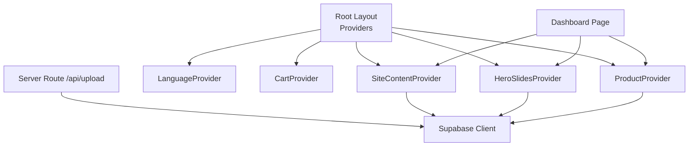
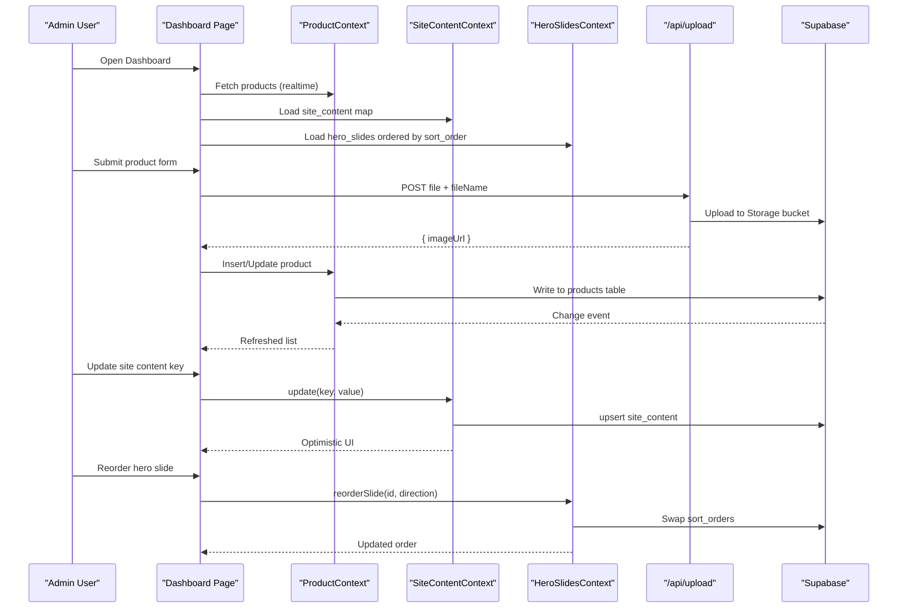
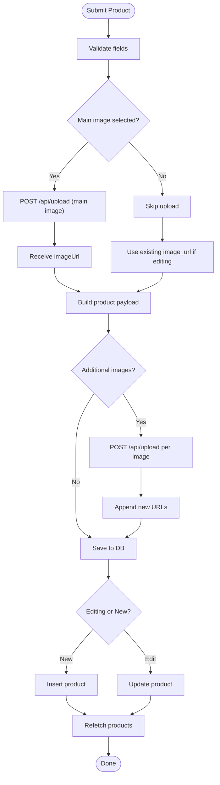
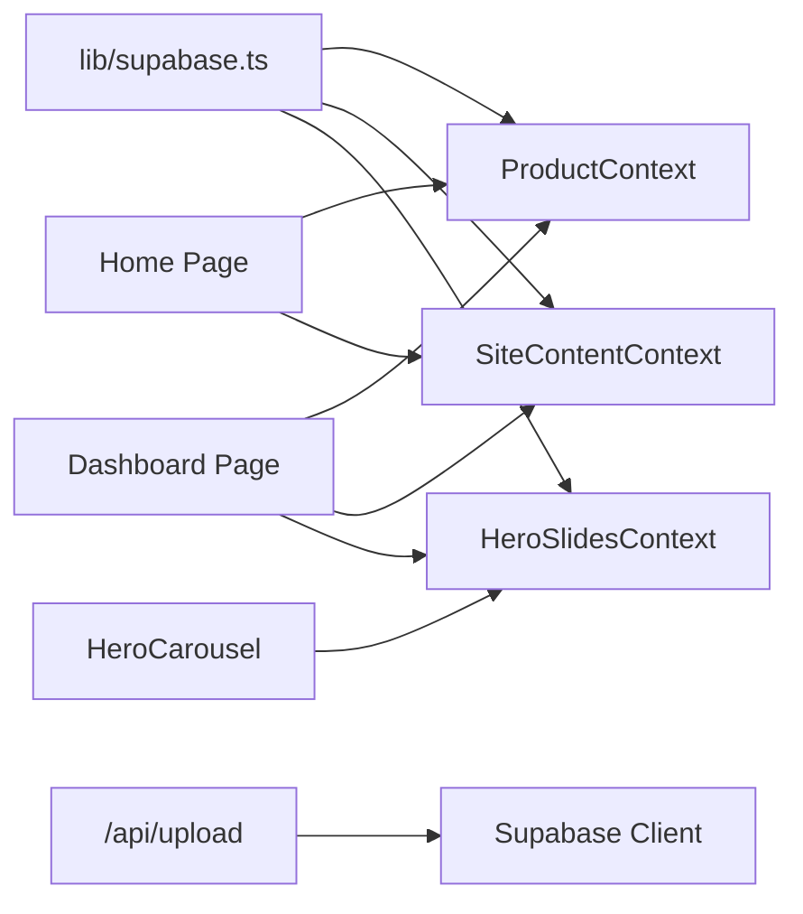

# Content Management System

<cite>
**Referenced Files in This Document**
- [README.md](file://README.md)
- [app/layout.tsx](file://app/layout.tsx)
- [app/page.tsx](file://app/page.tsx)
- [app/dashboard/page.tsx](file://app/dashboard/page.tsx)
- [components/HeroCarousel.tsx](file://components/HeroCarousel.tsx)
- [lib/supabase.ts](file://lib/supabase.ts)
- [app/api/upload/route.ts](file://app/api/upload/route.ts)
- [app/context/ProductContext.tsx](file://app/context/ProductContext.tsx)
- [app/context/SiteContentContext.tsx](file://app/context/SiteContentContext.tsx)
- [app/context/HeroSlidesContext.tsx](file://app/context/HeroSlidesContext.tsx)
- [supabase-setup.sql](file://supabase-setup.sql)
</cite>

## Table of Contents
1. [Introduction](#introduction)
2. [Project Structure](#project-structure)
3. [Core Components](#core-components)
4. [Architecture Overview](#architecture-overview)
5. [Detailed Component Analysis](#detailed-component-analysis)
6. [Dependency Analysis](#dependency-analysis)
7. [Performance Considerations](#performance-considerations)
8. [Troubleshooting Guide](#troubleshooting-guide)
9. [Conclusion](#conclusion)
10. [Appendices](#appendices)

## Introduction
This document explains the Content Management System (CMS) for a luxury perfume storefront built with Next.js and Supabase. It covers dynamic site content editing, hero carousel management with ordering, image uploads to Supabase Storage, real-time updates, dashboard UX for non-technical users, content schema design, upload security policies, preview mechanisms, examples of managing site-wide text, promotional banners, and product categories, as well as notes on versioning, backups, and permissions.

## Project Structure
The CMS is implemented as a client-side dashboard integrated into the Next.js App Router. The root layout wraps the app with providers that manage global state for products, site content, hero slides, language, and cart. The dashboard exposes tabs for overview, product CRUD, site content editing, and hero carousel management.

**Diagram sources**
- [app/layout.tsx:57-82](file://app/layout.tsx#L57-L82)
- [app/dashboard/page.tsx:11-15](file://app/dashboard/page.tsx#L11-L15)
- [app/context/SiteContentContext.tsx:22-48](file://app/context/SiteContentContext.tsx#L22-L48)
- [app/context/HeroSlidesContext.tsx:157-186](file://app/context/HeroSlidesContext.tsx#L157-L186)
- [app/context/ProductContext.tsx:45-82](file://app/context/ProductContext.tsx#L45-L82)
- [app/api/upload/route.ts:4-30](file://app/api/upload/route.ts#L4-L30)
- [lib/supabase.ts:41-46](file://lib/supabase.ts#L41-L46)

**Section sources**
- [app/layout.tsx:57-82](file://app/layout.tsx#L57-L82)
- [app/dashboard/page.tsx:11-15](file://app/dashboard/page.tsx#L11-L15)
- [README.md:1-65](file://README.md#L1-L65)

## Core Components
- Dashboard page: Central admin UI with tabs for overview, add/edit products, all products list, site content editor, and hero carousel manager.
- Product context: Manages product data, including real-time subscriptions and CRUD operations.
- Site content context: Provides key-value content store with optimistic updates and image upload integration.
- Hero slides context: Manages carousel slide data, ordering, activation, and persistence.
- Server upload route: Securely uploads images to Supabase Storage and returns public URLs.
- Hero carousel component: Renders animated slides using GSAP and consumes active slides from context.

Key responsibilities:
- Data access via Supabase client configured in lib/supabase.ts.
- Real-time synchronization for products.
- Optimistic UI updates for site content.
- Drag-and-drop or button-based reordering for hero slides.
- Image upload flow through server route to avoid CORS issues.

**Section sources**
- [app/dashboard/page.tsx:11-15](file://app/dashboard/page.tsx#L11-L15)
- [app/context/ProductContext.tsx:45-116](file://app/context/ProductContext.tsx#L45-L116)
- [app/context/SiteContentContext.tsx:22-110](file://app/context/SiteContentContext.tsx#L22-L110)
- [app/context/HeroSlidesContext.tsx:157-290](file://app/context/HeroSlidesContext.tsx#L157-L290)
- [app/api/upload/route.ts:4-67](file://app/api/upload/route.ts#L4-L67)
- [components/HeroCarousel.tsx:11-137](file://components/HeroCarousel.tsx#L11-L137)

## Architecture Overview
The CMS architecture separates concerns across contexts and server routes:
- Contexts encapsulate data fetching, mutations, and real-time subscriptions.
- The dashboard composes these contexts to provide an intuitive interface.
- The upload API route centralizes storage interactions and URL resolution.
- The database schema defines tables for products, site content, and hero slides with RLS policies.

**Diagram sources**
- [app/dashboard/page.tsx:152-233](file://app/dashboard/page.tsx#L152-L233)
- [app/api/upload/route.ts:4-67](file://app/api/upload/route.ts#L4-L67)
- [app/context/ProductContext.tsx:64-82](file://app/context/ProductContext.tsx#L64-L82)
- [app/context/SiteContentContext.tsx:56-96](file://app/context/SiteContentContext.tsx#L56-L96)
- [app/context/HeroSlidesContext.tsx:228-260](file://app/context/HeroSlidesContext.tsx#L228-L260)

## Detailed Component Analysis

### Dashboard Interface
The dashboard provides:
- Overview tab with stats and quick actions.
- Add/Edit product form with drag-and-drop image upload, gallery images, sizes, and video URL.
- All Products table with edit/delete actions.
- Site Content Editor for updating site-wide text and images.
- Hero Carousel Manager for adding, editing, deleting, and reordering slides.

User experience highlights:
- Connection status indicator for Supabase.
- Toast notifications for success/error feedback.
- Mobile-friendly navigation tabs.
- Inline previews for uploaded images.

Operational flows:
- Product submission uploads main image and additional images via server route, then persists product data.
- Site content updates are optimistic; failures revert via error handling.
- Hero slide reordering swaps sort_order values atomically.

**Section sources**
- [app/dashboard/page.tsx:11-15](file://app/dashboard/page.tsx#L11-L15)
- [app/dashboard/page.tsx:20-36](file://app/dashboard/page.tsx#L20-L36)
- [app/dashboard/page.tsx:152-233](file://app/dashboard/page.tsx#L152-L233)
- [app/dashboard/page.tsx:1005-1020](file://app/dashboard/page.tsx#L1005-L1020)

#### Product Management Flow

**Diagram sources**
- [app/dashboard/page.tsx:152-233](file://app/dashboard/page.tsx#L152-L233)
- [app/api/upload/route.ts:4-67](file://app/api/upload/route.ts#L4-L67)
- [app/context/ProductContext.tsx:84-100](file://app/context/ProductContext.tsx#L84-L100)

**Section sources**
- [app/dashboard/page.tsx:152-233](file://app/dashboard/page.tsx#L152-L233)
- [app/context/ProductContext.tsx:84-100](file://app/context/ProductContext.tsx#L84-L100)

#### Site Content Editing
The site content editor allows updating arbitrary key-value pairs stored in site_content. It supports:
- Text field updates with optimistic UI.
- Image upload via server route, saving the public URL back to the same key.
- Fallback to default translations when no DB row exists.

Examples:
- Manage site-wide text such as announcement bar messages, hero eyebrow/title/subtitle, category labels, footer descriptions, and newsletter copy.
- Update promotional banner images by uploading to storage and associating the URL with a specific key.

Preview mechanism:
- Changes appear immediately in the UI due to optimistic updates.
- The homepage reads keys via the site content context and renders translated strings.

**Section sources**
- [app/context/SiteContentContext.tsx:27-48](file://app/context/SiteContentContext.tsx#L27-L48)
- [app/context/SiteContentContext.tsx:56-96](file://app/context/SiteContentContext.tsx#L56-L96)
- [app/page.tsx:43-60](file://app/page.tsx#L43-L60)

#### Hero Carousel Management
The hero carousel manager enables:
- Adding new slides with multilingual fields (English and Arabic).
- Editing existing slides’ visuals and text.
- Deleting slides.
- Reordering slides by swapping sort_order values.
- Toggling active/inactive status.

Real-time behavior:
- Active slides are filtered and sorted by sort_order for display.
- Default slides are used until DB rows exist.

Drag-and-drop ordering:
- The dashboard provides controls to move slides up/down, which swaps sort_order values.
- The implementation uses two parallel updates to swap orders atomically.

**Section sources**
- [app/context/HeroSlidesContext.tsx:157-186](file://app/context/HeroSlidesContext.tsx#L157-L186)
- [app/context/HeroSlidesContext.tsx:188-260](file://app/context/HeroSlidesContext.tsx#L188-L260)
- [app/dashboard/page.tsx:1368-1405](file://app/dashboard/page.tsx#L1368-L1405)

#### Image Upload Security Policies
Uploads go through a server route to avoid browser CORS restrictions and adblockers. The route:
- Validates presence of file and fileName.
- Uses environment variables for Supabase credentials with fallbacks for development.
- Uploads to the designated storage bucket and returns a public URL.

Security considerations:
- Bucket must be created and set to Public for read access.
- Row Level Security policies allow public read/write for demo/admin without auth.
- For production, restrict write access to authenticated admins and validate file types/sizes server-side.

**Section sources**
- [app/api/upload/route.ts:4-67](file://app/api/upload/route.ts#L4-L67)
- [supabase-setup.sql:35-37](file://supabase-setup.sql#L35-L37)
- [supabase-setup.sql:17-32](file://supabase-setup.sql#L17-L32)

#### Real-Time Updates
Products use Supabase real-time subscriptions to reflect changes instantly across clients:
- A channel listens to postgres_changes on the products table.
- On any change, the client refetches the product list.

This ensures that when the dashboard adds or updates a product, the storefront updates automatically.

**Section sources**
- [app/context/ProductContext.tsx:64-82](file://app/context/ProductContext.tsx#L64-L82)

#### Hero Carousel Rendering
The carousel component:
- Consumes active slides from context.
- Animates letter-by-letter entrance/exit using GSAP.
- Supports auto-advance, keyboard navigation, and touch interactions.
- Displays progress dots with RTL-aware animation origin.

**Section sources**
- [components/HeroCarousel.tsx:11-137](file://components/HeroCarousel.tsx#L11-L137)
- [components/HeroCarousel.tsx:131-137](file://components/HeroCarousel.tsx#L131-L137)
- [components/HeroCarousel.tsx:189-197](file://components/HeroCarousel.tsx#L189-L197)

## Dependency Analysis
The system’s dependencies center around Supabase client configuration and context providers:

**Diagram sources**
- [lib/supabase.ts:41-46](file://lib/supabase.ts#L41-L46)
- [app/context/ProductContext.tsx:45-82](file://app/context/ProductContext.tsx#L45-L82)
- [app/context/SiteContentContext.tsx:22-48](file://app/context/SiteContentContext.tsx#L22-L48)
- [app/context/HeroSlidesContext.tsx:157-186](file://app/context/HeroSlidesContext.tsx#L157-L186)
- [app/api/upload/route.ts:28-30](file://app/api/upload/route.ts#L28-L30)
- [app/dashboard/page.tsx:11-15](file://app/dashboard/page.tsx#L11-L15)
- [app/page.tsx:43-60](file://app/page.tsx#L43-L60)
- [components/HeroCarousel.tsx:11-13](file://components/HeroCarousel.tsx#L11-L13)

**Section sources**
- [lib/supabase.ts:41-46](file://lib/supabase.ts#L41-L46)
- [app/context/ProductContext.tsx:45-82](file://app/context/ProductContext.tsx#L45-L82)
- [app/context/SiteContentContext.tsx:22-48](file://app/context/SiteContentContext.tsx#L22-L48)
- [app/context/HeroSlidesContext.tsx:157-186](file://app/context/HeroSlidesContext.tsx#L157-L186)
- [app/api/upload/route.ts:28-30](file://app/api/upload/route.ts#L28-L30)
- [app/dashboard/page.tsx:11-15](file://app/dashboard/page.tsx#L11-L15)
- [app/page.tsx:43-60](file://app/page.tsx#L43-L60)
- [components/HeroCarousel.tsx:11-13](file://components/HeroCarousel.tsx#L11-L13)

## Performance Considerations
- Real-time subscriptions: Ensure channels are removed on unmount to prevent leaks.
- Optimistic updates: Site content updates render immediately; handle errors gracefully to revert state.
- Image uploads: Batch multiple uploads sequentially to avoid overwhelming the server; consider size limits and compression.
- Hero animations: GSAP animations are GPU-accelerated; disable heavy effects on mobile for performance.
- Database queries: Order results efficiently (e.g., by created_at or sort_order) to reduce client-side sorting overhead.

[No sources needed since this section provides general guidance]

## Troubleshooting Guide
Common issues and resolutions:
- Missing environment variables: The dashboard shows connection status and error messages. Ensure NEXT_PUBLIC_SUPABASE_URL and NEXT_PUBLIC_SUPABASE_ANON_KEY are set.
- Upload failures: Check server route logs and ensure the storage bucket exists and is public. Verify file type and name parameters.
- Real-time not working: Confirm Supabase realtime enabled and that the channel subscription is active.
- Hero slides not loading: If the table does not exist, defaults are used; run the setup SQL to create tables and policies.

**Section sources**
- [app/dashboard/page.tsx:20-36](file://app/dashboard/page.tsx#L20-L36)
- [app/api/upload/route.ts:59-66](file://app/api/upload/route.ts#L59-L66)
- [app/context/ProductContext.tsx:64-82](file://app/context/ProductContext.tsx#L64-L82)
- [supabase-setup.sql:17-32](file://supabase-setup.sql#L17-L32)

## Conclusion
The CMS integrates a robust dashboard with real-time capabilities, secure image uploads, and flexible content management. Non-technical users can manage site-wide text, promotional banners, and product categories through an intuitive interface. The architecture leverages Supabase for database, storage, and real-time features, while the Next.js App Router organizes server and client logic cleanly.

[No sources needed since this section summarizes without analyzing specific files]

## Appendices

### Content Schema Design
- products: id, name, description, price, image_url, badge, category, gender, top_notes, heart_notes, base_notes, longevity, sillage, sizes (JSON), images (text[]), video_url, created_at.
- site_content: key (primary key), value.
- hero_slides: id, sort_order, img, accent, gradient, glow, href, active, tag_en/ar, eyebrow_en/ar, title1_en/ar, title2_en/ar, title3_en/ar, subtitle_en/ar, btn_text_en/ar, created_at.

**Section sources**
- [supabase-setup.sql:7-15](file://supabase-setup.sql#L7-L15)
- [supabase-setup.sql:42-56](file://supabase-setup.sql#L42-L56)
- [supabase-setup.sql:61-81](file://supabase-setup.sql#L61-L81)
- [supabase-setup.sql:86-110](file://supabase-setup.sql#L86-L110)

### File Upload Security Policies
- Storage bucket: product-images (public for read).
- RLS policies: Allow public select/insert/update/delete for demo/admin without auth.
- Production recommendations: Restrict writes to authenticated admins, enforce file type/size validation, and implement signed URLs for uploads.

**Section sources**
- [supabase-setup.sql:35-37](file://supabase-setup.sql#L35-L37)
- [supabase-setup.sql:17-32](file://supabase-setup.sql#L17-L32)
- [supabase-setup.sql:112-133](file://supabase-setup.sql#L112-L133)

### Preview Mechanisms
- Product form: Image preview before upload using FileReader.
- Site content: Optimistic updates show immediate changes in UI.
- Hero slides: Live preview via updated context state after edits/reorders.

**Section sources**
- [app/dashboard/page.tsx:78-87](file://app/dashboard/page.tsx#L78-L87)
- [app/context/SiteContentContext.tsx:56-69](file://app/context/SiteContentContext.tsx#L56-L69)
- [app/context/HeroSlidesContext.tsx:205-217](file://app/context/HeroSlidesContext.tsx#L205-L217)

### Examples of Managing Content
- Site-wide text: Update announcement bar messages, hero eyebrow/title/subtitle, category labels, footer descriptions, and newsletter copy via the Site Content tab.
- Promotional banners: Upload banner images to storage and associate the public URL with a specific key; the homepage will render the updated image.
- Product categories: Edit category names, subtitles, and images through site content keys; the CategorySection builds its data dynamically from these keys.

**Section sources**
- [app/page.tsx:54-60](file://app/page.tsx#L54-L60)
- [app/context/SiteContentContext.tsx:27-48](file://app/context/SiteContentContext.tsx#L27-L48)
- [app/dashboard/page.tsx:1005-1020](file://app/dashboard/page.tsx#L1005-L1020)

### Versioning, Backup Strategies, and Permission Controls
- Versioning: Not implemented in the current codebase. Consider adding a versions table or using Supabase database history extensions.
- Backups: Use Supabase project backups and export strategies; schedule periodic dumps of critical tables.
- Permissions: Current RLS policies allow public read/write for demo purposes. For production, enable authentication and restrict write access to admin roles.

[No sources needed since this section provides general guidance]