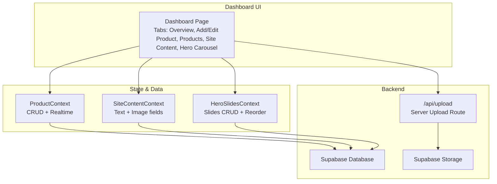
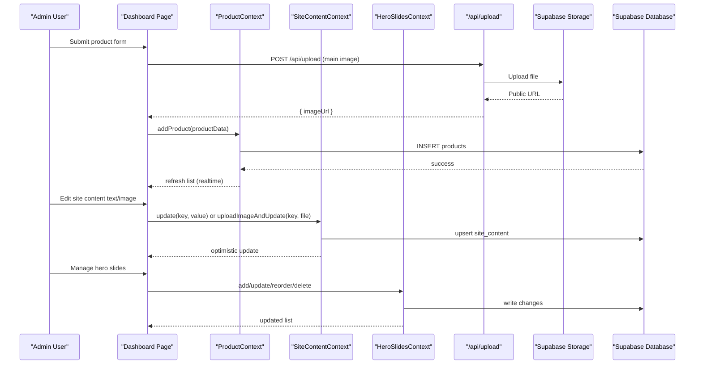
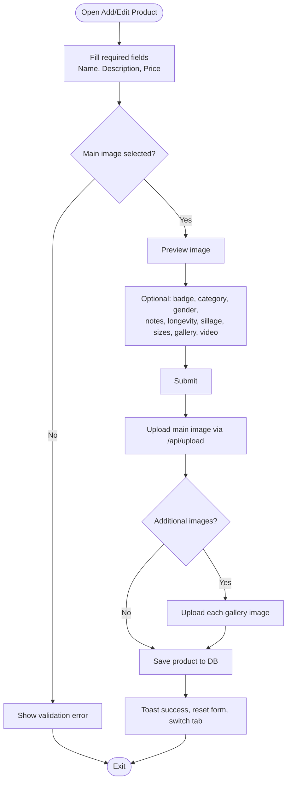
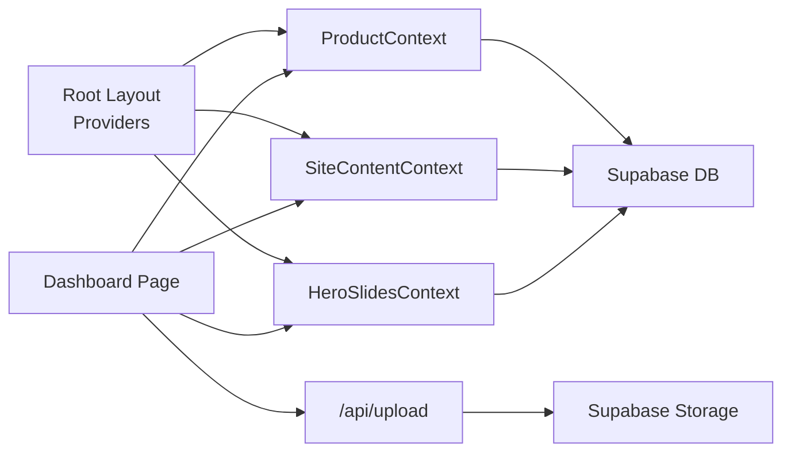

# Dashboard Interface

<cite>
**Referenced Files in This Document**
- [dashboard/page.tsx](file://app/dashboard/page.tsx)
- [ProductContext.tsx](file://app/context/ProductContext.tsx)
- [SiteContentContext.tsx](file://app/context/SiteContentContext.tsx)
- [HeroSlidesContext.tsx](file://app/context/HeroSlidesContext.tsx)
- [defaultTranslations.ts](file://app/context/defaultTranslations.ts)
- [upload/route.ts](file://app/api/upload/route.ts)
- [layout.tsx](file://app/layout.tsx)
</cite>

## Table of Contents
1. [Introduction](#introduction)
2. [Project Structure](#project-structure)
3. [Core Components](#core-components)
4. [Architecture Overview](#architecture-overview)
5. [Detailed Component Analysis](#detailed-component-analysis)
6. [Dependency Analysis](#dependency-analysis)
7. [Performance Considerations](#performance-considerations)
8. [Troubleshooting Guide](#troubleshooting-guide)
9. [Conclusion](#conclusion)

## Introduction
This document provides comprehensive documentation for the admin dashboard interface used to manage site content, product listings, and promotional materials. It explains the user interface, form components, data binding, real-time preview capabilities, and end-to-end user experience flows. It also covers media upload workflows, hero carousel management, role-based access considerations, form validation, error feedback, and responsive design patterns.

## Project Structure
The dashboard is implemented as a Next.js client component with multiple context providers for state and persistence:
- Dashboard page orchestrates tabs for overview, product management, site content editing, and hero carousel management.
- Context modules encapsulate data fetching, mutations, and real-time updates via Supabase.
- An API route handles secure server-side uploads to Supabase Storage.
- The root layout wires up all providers so the dashboard can consume them.

**Diagram sources**
- [dashboard/page.tsx:1-1042](file://app/dashboard/page.tsx#L1-L1042)
- [ProductContext.tsx:1-116](file://app/context/ProductContext.tsx#L1-L116)
- [SiteContentContext.tsx:1-110](file://app/context/SiteContentContext.tsx#L1-L110)
- [HeroSlidesContext.tsx:1-290](file://app/context/HeroSlidesContext.tsx#L1-L290)
- [upload/route.ts:1-67](file://app/api/upload/route.ts#L1-L67)

**Section sources**
- [layout.tsx:62-82](file://app/layout.tsx#L62-L82)
- [dashboard/page.tsx:1-1042](file://app/dashboard/page.tsx#L1-L1042)

## Core Components
- DashboardPage (tabbed interface):
  - Overview: statistics, quick actions, recent products.
  - Add/Edit Product: rich form with image upload, gallery images, video URL, variants/sizes, fragrance notes, performance attributes.
  - All Products: table view with edit/delete actions.
  - Site Content Editor: language-aware text and image fields for global sections (hero, categories, process, ingredients, story, testimonials, gifting, editorial, lookbook, footer).
  - Hero Carousel Manager: add/edit/import slides, reorder, toggle active, delete custom slides.

- Context Providers:
  - ProductContext: fetches products, supports add/update/delete, subscribes to realtime changes.
  - SiteContentContext: loads key-value content with defaults, optimistic updates, and image upload flow that persists public URLs.
  - HeroSlidesContext: manages slide list, default fallbacks, CRUD, reordering by sort_order, and filtering active slides.

- Upload API Route:
  - Accepts multipart file uploads, writes to Supabase Storage, returns public URL.

**Section sources**
- [dashboard/page.tsx:11-1042](file://app/dashboard/page.tsx#L11-L1042)
- [ProductContext.tsx:45-116](file://app/context/ProductContext.tsx#L45-L116)
- [SiteContentContext.tsx:22-110](file://app/context/SiteContentContext.tsx#L22-L110)
- [HeroSlidesContext.tsx:157-290](file://app/context/HeroSlidesContext.tsx#L157-L290)
- [upload/route.ts:4-67](file://app/api/upload/route.ts#L4-L67)

## Architecture Overview
The dashboard integrates tightly with Supabase for both database and storage. Client-side contexts handle optimistic UI updates and real-time synchronization. Serverless API routes centralize uploads to avoid CORS issues and adblocker interference.

**Diagram sources**
- [dashboard/page.tsx:152-233](file://app/dashboard/page.tsx#L152-L233)
- [ProductContext.tsx:84-100](file://app/context/ProductContext.tsx#L84-L100)
- [SiteContentContext.tsx:57-96](file://app/context/SiteContentContext.tsx#L57-L96)
- [HeroSlidesContext.tsx:188-260](file://app/context/HeroSlidesContext.tsx#L188-L260)
- [upload/route.ts:4-67](file://app/api/upload/route.ts#L4-L67)

## Detailed Component Analysis

### Dashboard Page (Tabbed Interface)
Responsibilities:
- Tab navigation between Overview, Add/Edit Product, Products, Site Content, and Hero Carousel.
- Form state management for product creation/editing including image previews, additional gallery images, sizes/variants, and optional video URL.
- Toast notifications for success/error feedback.
- Connection status indicator for Supabase.

Key UX features:
- Drag-and-drop main image upload with immediate preview.
- Multiple gallery image selection with per-image removal.
- Dynamic size/variant entries with inline price inputs.
- Language-aware editors for site content and hero slides.
- Mobile-friendly top navigation strip for small screens.

Validation and feedback:
- Required fields enforced before submission.
- Disabled submit button while saving.
- Inline progress messages during multi-step uploads.
- Error toasts on failures.

Responsive behavior:
- Sidebar collapses into mobile tabs.
- Grid layouts adapt to screen width.

**Section sources**
- [dashboard/page.tsx:11-1042](file://app/dashboard/page.tsx#L11-L1042)

#### Product Management Flow

**Diagram sources**
- [dashboard/page.tsx:152-233](file://app/dashboard/page.tsx#L152-L233)
- [dashboard/page.tsx:495-909](file://app/dashboard/page.tsx#L495-L909)
- [upload/route.ts:4-67](file://app/api/upload/route.ts#L4-L67)

**Section sources**
- [dashboard/page.tsx:152-233](file://app/dashboard/page.tsx#L152-L233)
- [dashboard/page.tsx:495-909](file://app/dashboard/page.tsx#L495-L909)

#### Site Content Editor
Capabilities:
- Language toggle (Arabic/English) affects input direction and keys.
- Text fields for many sections: general settings, hero, categories, process, rare ingredients, brand story, testimonials, gifting, signature discovery, editorial spotlight, curated lookbook, footer.
- Image fields with live preview and upload through the same server route.
- Optimistic updates with save-per-field buttons.

Real-time preview:
- Changes are persisted immediately; consumers reading from SiteContentContext see updates instantly.

Error handling:
- Per-field saving indicators and toast feedback.

**Section sources**
- [dashboard/page.tsx:1044-1363](file://app/dashboard/page.tsx#L1044-L1363)
- [SiteContentContext.tsx:22-110](file://app/context/SiteContentContext.tsx#L22-L110)
- [defaultTranslations.ts:1-494](file://app/context/defaultTranslations.ts#L1-L494)

#### Hero Carousel Manager
Capabilities:
- Import default slides into the database for full control.
- Create new slides with image upload, tag, eyebrow, three-line titles, subtitle, button text, href, and advanced styling (accent, gradient, glow).
- Edit existing slides, toggle active/inactive, reorder via sort_order swaps, delete custom slides.
- Language-aware editing for Arabic/English fields.

Real-time preview:
- After save, refetch ensures the list reflects current order and active states.

Constraints:
- Default slides cannot be deleted directly; they must be imported first.

**Section sources**
- [dashboard/page.tsx:1365-1870](file://app/dashboard/page.tsx#L1365-L1870)
- [HeroSlidesContext.tsx:157-290](file://app/context/HeroSlidesContext.tsx#L157-L290)

### Context Modules

#### ProductContext
- Fetches products ordered by created_at.
- Subscribes to realtime changes on the products table to keep lists fresh across tabs and pages.
- Provides add/update/delete methods with error propagation.

Complexity:
- O(n) for listing; O(1) for individual mutations; realtime subscription triggers refetch.

**Section sources**
- [ProductContext.tsx:45-116](file://app/context/ProductContext.tsx#L45-L116)

#### SiteContentContext
- Loads site_content rows keyed by key/value pairs.
- Merges fetched values over default translations.
- Supports single-key text updates with optimistic UI.
- Uploads images via server route and persists public URL back to site_content.

Optimistic updates:
- Immediate local state change before server confirmation; rollback on error.

**Section sources**
- [SiteContentContext.tsx:22-110](file://app/context/SiteContentContext.tsx#L22-L110)
- [defaultTranslations.ts:1-494](file://app/context/defaultTranslations.ts#L1-L494)

#### HeroSlidesContext
- Maintains allSlides and computed slides (active only).
- Provides add/update/delete/reorder operations.
- Reorder swaps sort_order values atomically using parallel updates.
- Falls back to DEFAULT_SLIDES if table is empty or unavailable.

**Section sources**
- [HeroSlidesContext.tsx:157-290](file://app/context/HeroSlidesContext.tsx#L157-L290)

### Upload API Route
- Validates request body (file and fileName).
- Creates a Supabase client using environment variables.
- Uploads buffer to Supabase Storage bucket and returns public URL.
- Returns structured JSON responses for success and errors.

Security note:
- Uses NEXT_PUBLIC_* keys; ensure proper RLS policies and storage bucket permissions are configured at the Supabase level.

**Section sources**
- [upload/route.ts:4-67](file://app/api/upload/route.ts#L4-L67)

## Dependency Analysis
The dashboard depends on multiple context providers and an API route. The root layout wires these providers around the application, enabling the dashboard to consume shared state.

**Diagram sources**
- [layout.tsx:62-82](file://app/layout.tsx#L62-L82)
- [dashboard/page.tsx:1-1042](file://app/dashboard/page.tsx#L1-1042)
- [upload/route.ts:4-67](file://app/api/upload/route.ts#L4-L67)

**Section sources**
- [layout.tsx:62-82](file://app/layout.tsx#L62-L82)
- [dashboard/page.tsx:1-1042](file://app/dashboard/page.tsx#L1-L1042)

## Performance Considerations
- Realtime subscriptions:
  - ProductContext subscribes to all changes on the products table. Ensure this is scoped appropriately to avoid unnecessary refetches.
- Image uploads:
  - Use server route to bypass browser limitations and reduce client overhead.
  - Consider compressing images before upload to reduce bandwidth.
- Optimistic updates:
  - SiteContentContext applies optimistic updates for faster perceived performance.
- Sorting and ordering:
  - HeroSlidesContext uses sort_order for efficient ordering; prefer swapping rather than recalculating all indices.

[No sources needed since this section provides general guidance]

## Troubleshooting Guide
Common issues and resolutions:
- Supabase connection errors:
  - The dashboard shows a status indicator and detailed error message when connection fails. Verify environment variables and network connectivity.
- Missing environment configuration:
  - If NEXT_PUBLIC_SUPABASE_URL or NEXT_PUBLIC_SUPABASE_ANON_KEY are not set, the dashboard displays a warning with instructions to update .env.local and restart the dev server.
- Upload failures:
  - Check server logs for upload route errors. Ensure the storage bucket exists and has appropriate policies. Confirm file types and sizes are allowed.
- Realtime not updating:
  - Confirm Supabase realtime is enabled and the channel subscription is active. Ensure no ad blockers interfere with WebSocket connections.

**Section sources**
- [dashboard/page.tsx:20-36](file://app/dashboard/page.tsx#L20-L36)
- [dashboard/page.tsx:463-493](file://app/dashboard/page.tsx#L463-L493)
- [upload/route.ts:4-67](file://app/api/upload/route.ts#L4-L67)

## Conclusion
The admin dashboard provides a robust, user-friendly interface for managing products, site content, and promotional slides. It leverages context providers for centralized state, optimistic updates for responsiveness, and a server-side upload route for reliable media handling. With language-aware editors, real-time previews, and clear error feedback, it supports efficient content operations across devices. For production readiness, ensure proper security configurations (RLS policies, storage permissions), monitor realtime usage, and optimize media assets for performance.