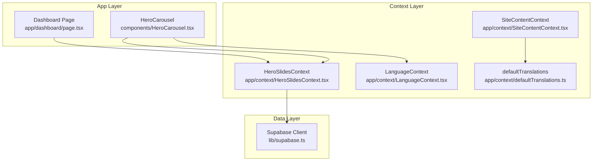
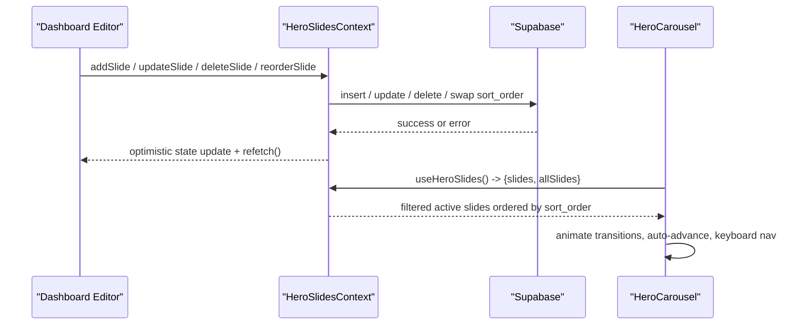
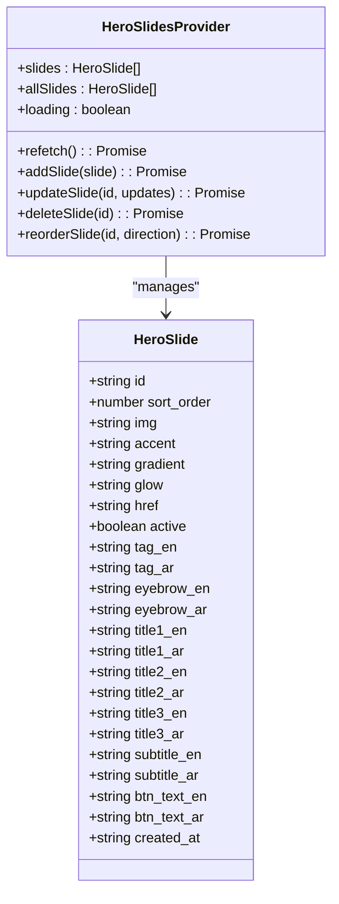
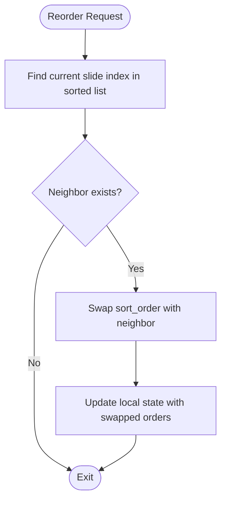
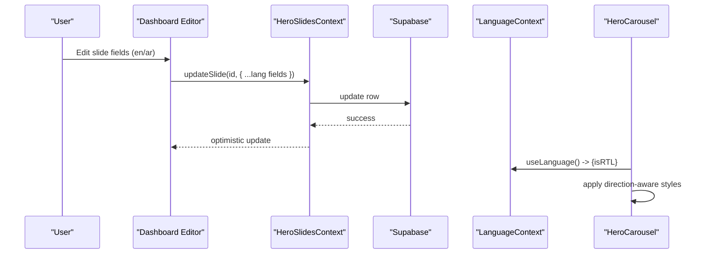
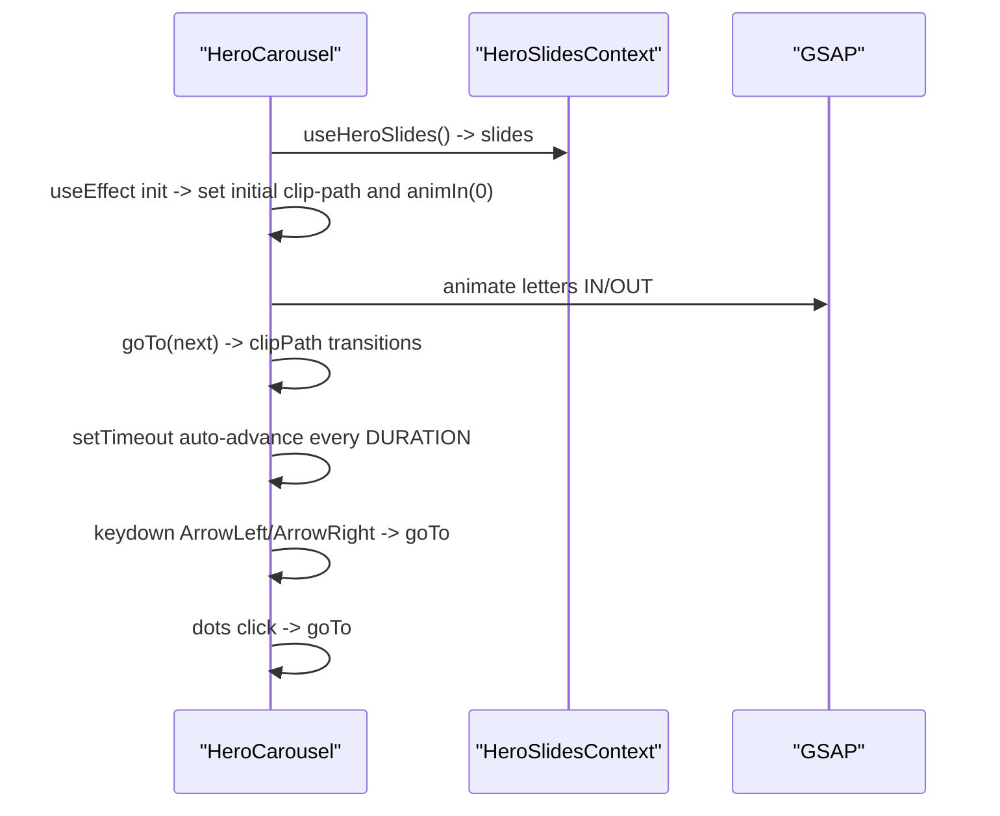
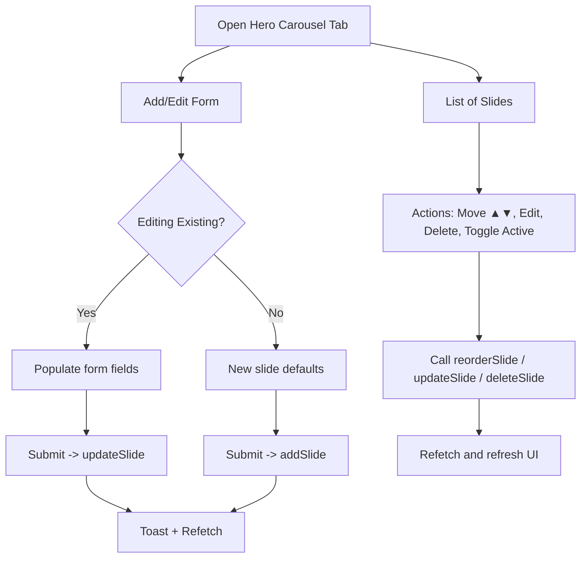
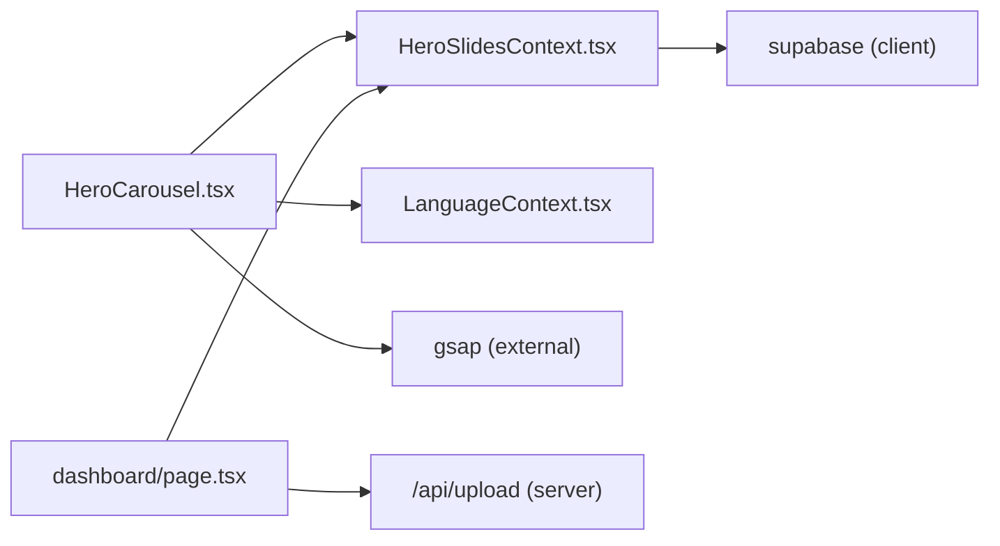

# Hero Carousel Management

<cite>
**Referenced Files in This Document**
- [HeroSlidesContext.tsx](file://app/context/HeroSlidesContext.tsx)
- [HeroCarousel.tsx](file://components/HeroCarousel.tsx)
- [LanguageContext.tsx](file://app/context/LanguageContext.tsx)
- [defaultTranslations.ts](file://app/context/defaultTranslations.ts)
- [SiteContentContext.tsx](file://app/context/SiteContentContext.tsx)
- [dashboard/page.tsx](file://app/dashboard/page.tsx)
</cite>

## Table of Contents
1. [Introduction](#introduction)
2. [Project Structure](#project-structure)
3. [Core Components](#core-components)
4. [Architecture Overview](#architecture-overview)
5. [Detailed Component Analysis](#detailed-component-analysis)
6. [Dependency Analysis](#dependency-analysis)
7. [Performance Considerations](#performance-considerations)
8. [Troubleshooting Guide](#troubleshooting-guide)
9. [Conclusion](#conclusion)
10. [Appendices](#appendices)

## Introduction
This document explains the hero carousel management system, focusing on:
- The HeroSlidesContext implementation and its data model
- Slide ordering and reordering capabilities
- Drag-and-drop-like reordering via up/down controls
- Multi-language support for slide content (English and Arabic)
- CRUD operations for slides and their integration with the main carousel component
- Practical examples for adding, updating, managing visibility, and handling different screen sizes
- Performance optimization strategies for large slide sets
- Accessibility considerations

## Project Structure
The carousel is implemented as a client-side React feature using Next.js App Router conventions:
- Context layer manages state and persistence to Supabase
- UI layer renders animations, navigation, and responsive behavior
- Dashboard provides an editor for creating, editing, reordering, and toggling visibility

**Diagram sources**
- [HeroSlidesContext.tsx:157-283](file://app/context/HeroSlidesContext.tsx#L157-L283)
- [HeroCarousel.tsx:1-120](file://components/HeroCarousel.tsx#L1-L120)
- [LanguageContext.tsx:17-51](file://app/context/LanguageContext.tsx#L17-L51)
- [SiteContentContext.tsx:22-103](file://app/context/SiteContentContext.tsx#L22-L103)
- [defaultTranslations.ts:1-130](file://app/context/defaultTranslations.ts#L1-L130)
- [dashboard/page.tsx:1378-1868](file://app/dashboard/page.tsx#L1378-L1868)

**Section sources**
- [HeroSlidesContext.tsx:13-37](file://app/context/HeroSlidesContext.tsx#L13-L37)
- [HeroCarousel.tsx:11-16](file://components/HeroCarousel.tsx#L11-L16)
- [LanguageContext.tsx:6-13](file://app/context/LanguageContext.tsx#L6-L13)
- [SiteContentContext.tsx:12-18](file://app/context/SiteContentContext.tsx#L12-L18)
- [dashboard/page.tsx:1378-1414](file://app/dashboard/page.tsx#L1378-L1414)

## Core Components
- HeroSlidesContext: Provides all-slide state, active-slide filtering, ordering, and CRUD methods backed by Supabase.
- HeroCarousel: Renders animated slides, auto-advances, supports keyboard and dot navigation, and adapts to language direction and screen size.
- LanguageContext: Manages current language and RTL/LTR direction; used by the carousel to adjust progress bar origin and other directional behaviors.
- SiteContentContext and defaultTranslations: Provide global site text and image keys; while not directly consumed by the carousel, they demonstrate the project’s i18n approach.
- Dashboard page: Contains the HeroCarouselEditor that allows adding, editing, deleting, reordering, and importing default slides.

Key responsibilities:
- Data model definition and defaults
- State synchronization with database
- Filtering only active slides for display
- Ordering by sort_order
- Reordering by swapping sort_order values
- Providing add/update/delete/reorder/refetch APIs

**Section sources**
- [HeroSlidesContext.tsx:13-37](file://app/context/HeroSlidesContext.tsx#L13-L37)
- [HeroSlidesContext.tsx:139-153](file://app/context/HeroSlidesContext.tsx#L139-L153)
- [HeroSlidesContext.tsx:157-186](file://app/context/HeroSlidesContext.tsx#L157-L186)
- [HeroSlidesContext.tsx:188-260](file://app/context/HeroSlidesContext.tsx#L188-L260)
- [HeroSlidesContext.tsx:262-283](file://app/context/HeroSlidesContext.tsx#L262-L283)
- [HeroCarousel.tsx:11-16](file://components/HeroCarousel.tsx#L11-L16)
- [LanguageContext.tsx:17-51](file://app/context/LanguageContext.tsx#L17-L51)
- [dashboard/page.tsx:1378-1414](file://app/dashboard/page.tsx#L1378-L1414)

## Architecture Overview
The carousel architecture separates concerns across context, UI, and data layers:
- Context holds canonical state and persists changes to Supabase
- UI consumes context and handles animation, navigation, and responsiveness
- Dashboard composes context hooks to provide admin operations

**Diagram sources**
- [HeroSlidesContext.tsx:188-260](file://app/context/HeroSlidesContext.tsx#L188-L260)
- [HeroSlidesContext.tsx:262-283](file://app/context/HeroSlidesContext.tsx#L262-L283)
- [HeroCarousel.tsx:102-137](file://components/HeroCarousel.tsx#L102-L137)
- [dashboard/page.tsx:1496-1553](file://app/dashboard/page.tsx#L1496-L1553)

## Detailed Component Analysis

### HeroSlidesContext Implementation
Responsibilities:
- Define the slide data structure and default fallbacks
- Fetch from Supabase on mount and expose refetch
- Maintain allSlides and derive visible slides (active only)
- Implement CRUD and reorder operations with optimistic updates

Data model highlights:
- Unique id and numeric sort_order for ordering
- Visual fields: img, accent, gradient, glow
- Navigation field: href
- Visibility flag: active
- Multi-language fields: tag_en/tag_ar, eyebrow_en/eyebrow_ar, title1_en/title1_ar, title2_en/title2_ar, title3_en/title3_ar, subtitle_en/subtitle_ar, btn_text_en/btn_text_ar
- Optional created_at timestamp

CRUD operations:
- addSlide: inserts into Supabase and merges result into local state, excluding default placeholders
- updateSlide: partial update by id, merges into local state
- deleteSlide: removes by id from local state
- reorderSlide: swaps sort_order between adjacent items and updates local state

Active slide derivation:
- Filtered list excludes inactive slides and sorts by sort_order

Error handling:
- Throws errors returned from Supabase
- Uses defaults when table is missing or empty

**Diagram sources**
- [HeroSlidesContext.tsx:13-37](file://app/context/HeroSlidesContext.tsx#L13-L37)
- [HeroSlidesContext.tsx:139-153](file://app/context/HeroSlidesContext.tsx#L139-L153)
- [HeroSlidesContext.tsx:157-283](file://app/context/HeroSlidesContext.tsx#L157-L283)

**Section sources**
- [HeroSlidesContext.tsx:13-37](file://app/context/HeroSlidesContext.tsx#L13-L37)
- [HeroSlidesContext.tsx:157-186](file://app/context/HeroSlidesContext.tsx#L157-L186)
- [HeroSlidesContext.tsx:188-260](file://app/context/HeroSlidesContext.tsx#L188-L260)
- [HeroSlidesContext.tsx:262-283](file://app/context/HeroSlidesContext.tsx#L262-L283)

### Slide Ordering and Reordering
Ordering:
- Slides are always sorted by sort_order ascending both at load time and after mutations
- Visible slides are derived by filtering active=true then sorting by sort_order

Reordering:
- Up/Down actions compute neighbor index and swap sort_order values atomically using parallel updates
- Local state is updated immediately to reflect new order

**Diagram sources**
- [HeroSlidesContext.tsx:228-260](file://app/context/HeroSlidesContext.tsx#L228-L260)

**Section sources**
- [HeroSlidesContext.tsx:228-260](file://app/context/HeroSlidesContext.tsx#L228-L260)

### Multi-Language Support for Carousel Content
- The dashboard editor exposes per-language inputs for tag, eyebrow, titles, subtitle, and button text
- The HeroCarousel uses LanguageContext to determine directionality (RTL/LTR), which affects progress bar transform-origin and other directional styles
- While the carousel currently renders fixed letters, the data model supports full multi-language content for future rendering paths

**Diagram sources**
- [dashboard/page.tsx:1496-1553](file://app/dashboard/page.tsx#L1496-L1553)
- [HeroSlidesContext.tsx:205-217](file://app/context/HeroSlidesContext.tsx#L205-L217)
- [LanguageContext.tsx:17-51](file://app/context/LanguageContext.tsx#L17-L51)
- [HeroCarousel.tsx:11-16](file://components/HeroCarousel.tsx#L11-L16)

**Section sources**
- [dashboard/page.tsx:1378-1414](file://app/dashboard/page.tsx#L1378-L1414)
- [dashboard/page.tsx:1496-1553](file://app/dashboard/page.tsx#L1496-L1553)
- [LanguageContext.tsx:17-51](file://app/context/LanguageContext.tsx#L17-L51)
- [HeroCarousel.tsx:11-16](file://components/HeroCarousel.tsx#L11-L16)

### Integration with Main Carousel Component
- HeroCarousel consumes useHeroSlides to get the active slides array
- It manages internal state for current slide index, animation flags, and refs for GSAP animations
- Auto-advancement, keyboard navigation, and dot navigation are handled within the component
- Responsive behavior is achieved through CSS media queries and conditional logic based on window width

**Diagram sources**
- [HeroCarousel.tsx:102-137](file://components/HeroCarousel.tsx#L102-L137)
- [HeroCarousel.tsx:131-155](file://components/HeroCarousel.tsx#L131-L155)
- [HeroCarousel.tsx:207-215](file://components/HeroCarousel.tsx#L207-L215)
- [HeroCarousel.tsx:727-792](file://components/HeroCarousel.tsx#L727-L792)

**Section sources**
- [HeroCarousel.tsx:11-16](file://components/HeroCarousel.tsx#L11-L16)
- [HeroCarousel.tsx:102-137](file://components/HeroCarousel.tsx#L102-L137)
- [HeroCarousel.tsx:131-155](file://components/HeroCarousel.tsx#L131-L155)
- [HeroCarousel.tsx:207-215](file://components/HeroCarousel.tsx#L207-L215)
- [HeroCarousel.tsx:727-792](file://components/HeroCarousel.tsx#L727-L792)

### Dashboard Editor Capabilities
The dashboard includes a dedicated HeroCarouselEditor that:
- Adds new slides with image upload via server route
- Edits existing slides including multi-language fields
- Deletes non-default slides
- Reorders slides via up/down buttons
- Toggles active status for non-default slides
- Imports default slides into the database for full editability

**Diagram sources**
- [dashboard/page.tsx:1496-1553](file://app/dashboard/page.tsx#L1496-L1553)
- [dashboard/page.tsx:1555-1596](file://app/dashboard/page.tsx#L1555-L1596)
- [dashboard/page.tsx:1598-1619](file://app/dashboard/page.tsx#L1598-L1619)

**Section sources**
- [dashboard/page.tsx:1378-1414](file://app/dashboard/page.tsx#L1378-L1414)
- [dashboard/page.tsx:1496-1553](file://app/dashboard/page.tsx#L1496-L1553)
- [dashboard/page.tsx:1555-1596](file://app/dashboard/page.tsx#L1555-L1596)
- [dashboard/page.tsx:1598-1619](file://app/dashboard/page.tsx#L1598-L1619)

## Dependency Analysis
- HeroCarousel depends on:
  - HeroSlidesContext for slide data and operations
  - LanguageContext for directionality
  - GSAP for animations
- HeroSlidesContext depends on:
  - Supabase client for persistence
  - Default slides for fallback
- Dashboard depends on:
  - HeroSlidesContext for CRUD and reordering
  - Server API route for uploads

**Diagram sources**
- [HeroCarousel.tsx:1-10](file://components/HeroCarousel.tsx#L1-L10)
- [HeroSlidesContext.tsx:11-12](file://app/context/HeroSlidesContext.tsx#L11-L12)
- [dashboard/page.tsx:1474-1494](file://app/dashboard/page.tsx#L1474-L1494)

**Section sources**
- [HeroCarousel.tsx:1-10](file://components/HeroCarousel.tsx#L1-L10)
- [HeroSlidesContext.tsx:11-12](file://app/context/HeroSlidesContext.tsx#L11-L12)
- [dashboard/page.tsx:1474-1494](file://app/dashboard/page.tsx#L1474-L1494)

## Performance Considerations
- Animation performance:
  - Mobile devices disable heavy filters and parallax effects to reduce GPU/CPU usage
  - Use of requestAnimationFrame for mouse-driven transforms minimizes layout thrashing
- Rendering:
  - Only active slides are rendered to the carousel view
  - Clip-path transitions avoid expensive layout recalculations
- Large slide sets:
  - Consider virtualization if the number of slides grows significantly
  - Preload images and lazy-load offscreen assets
  - Debounce user interactions and limit concurrent animations
- Network:
  - Batch updates where possible; current reorder uses two parallel updates
  - Cache results and use refetch only after mutations

[No sources needed since this section provides general guidance]

## Troubleshooting Guide
Common issues and resolutions:
- Database connection errors:
  - Ensure environment variables are configured and the app is restarted
  - Check Supabase RLS policies for hero_slides table
- Missing table or empty data:
  - System falls back to default slides; import defaults via dashboard to enable full editing
- Reordering disabled:
  - Default slides cannot be reordered until imported into the database
- Image upload failures:
  - Verify server route permissions and storage bucket configuration
- Language direction not applied:
  - Confirm LanguageContext provider wraps the application and html dir/lang attributes are set

**Section sources**
- [HeroSlidesContext.tsx:161-186](file://app/context/HeroSlidesContext.tsx#L161-L186)
- [dashboard/page.tsx:1570-1596](file://app/dashboard/page.tsx#L1570-L1596)
- [dashboard/page.tsx:1598-1619](file://app/dashboard/page.tsx#L1598-L1619)
- [LanguageContext.tsx:22-26](file://app/context/LanguageContext.tsx#L22-L26)

## Conclusion
The hero carousel management system provides a robust, extensible foundation for managing visually rich, multi-language slides with clear separation of concerns. The context layer centralizes state and persistence, while the UI layer focuses on animation and interaction. The dashboard offers comprehensive CRUD and ordering tools, including safe handling of default slides. With careful attention to performance and accessibility, the system scales well and remains maintainable.

[No sources needed since this section summarizes without analyzing specific files]

## Appendices

### Slide Data Structure Reference
- Fields include identifiers, visual styling, navigation, visibility, and multi-language content
- Ordering is controlled by sort_order; visibility by active

**Section sources**
- [HeroSlidesContext.tsx:13-37](file://app/context/HeroSlidesContext.tsx#L13-L37)

### Examples

- Adding a new slide:
  - Open the Hero Carousel tab in the dashboard
  - Fill in required fields (image, tag, eyebrow, titles, subtitle, button text, href)
  - Submit to create; the slide appears in the list and becomes active by default
  - Path references:
    - [dashboard/page.tsx:1496-1553](file://app/dashboard/page.tsx#L1496-L1553)
    - [HeroSlidesContext.tsx:188-203](file://app/context/HeroSlidesContext.tsx#L188-L203)

- Updating existing content:
  - Click Edit on a slide, modify fields (including language-specific ones), and save
  - Path references:
    - [dashboard/page.tsx:1440-1462](file://app/dashboard/page.tsx#L1440-L1462)
    - [HeroSlidesContext.tsx:205-217](file://app/context/HeroSlidesContext.tsx#L205-L217)

- Managing slide visibility:
  - Toggle active status for non-default slides; default slides must be imported first
  - Path references:
    - [dashboard/page.tsx:1570-1582](file://app/dashboard/page.tsx#L1570-L1582)
    - [HeroSlidesContext.tsx:262-265](file://app/context/HeroSlidesContext.tsx#L262-L265)

- Handling different screen sizes:
  - The carousel adjusts font sizes, disables certain effects on mobile, and stacks CTAs vertically
  - Path references:
    - [HeroCarousel.tsx:42-52](file://components/HeroCarousel.tsx#L42-L52)
    - [HeroCarousel.tsx:541-551](file://components/HeroCarousel.tsx#L541-L551)
    - [HeroCarousel.tsx:717-724](file://components/HeroCarousel.tsx#L717-L724)

- Importing default slides:
  - Use the “Import Default Slides” action to make default slides editable and reorderable
  - Path references:
    - [dashboard/page.tsx:1598-1619](file://app/dashboard/page.tsx#L1598-L1619)
    - [HeroSlidesContext.tsx:40-137](file://app/context/HeroSlidesContext.tsx#L40-L137)

### Accessibility Considerations
- Keyboard navigation:
  - Arrow keys navigate slides
  - Dot indicators are focusable and navigable via Enter
- ARIA roles and labels:
  - Region role and aria-label for the carousel
  - Tablist/tab roles for navigation dots with aria-selected states
- Directionality:
  - HTML lang and dir attributes are set based on selected language
  - Progress bar transform-origin adapts to RTL/LTR

**Section sources**
- [HeroCarousel.tsx:207-215](file://components/HeroCarousel.tsx#L207-L215)
- [HeroCarousel.tsx:727-792](file://components/HeroCarousel.tsx#L727-L792)
- [LanguageContext.tsx:22-26](file://app/context/LanguageContext.tsx#L22-L26)