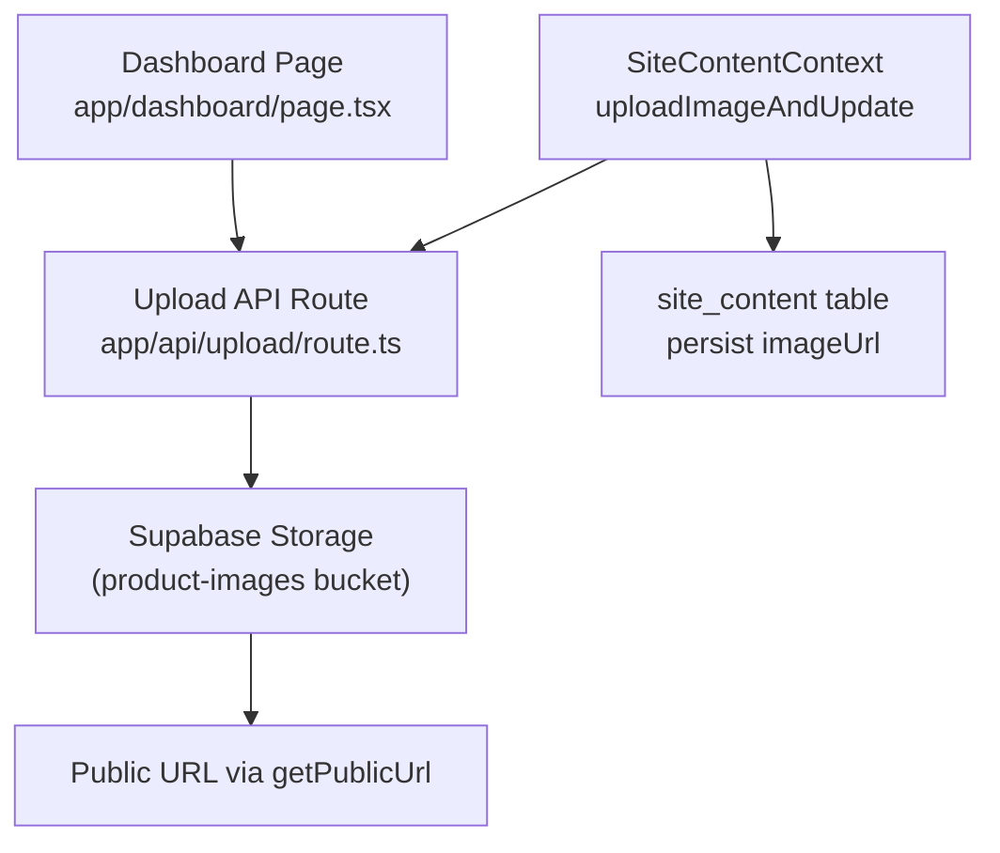
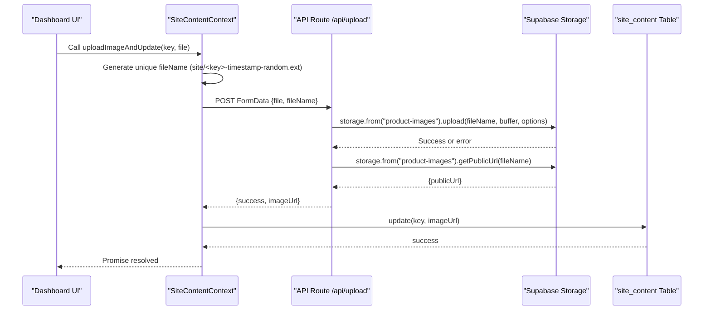
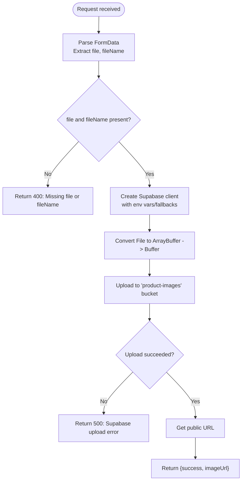
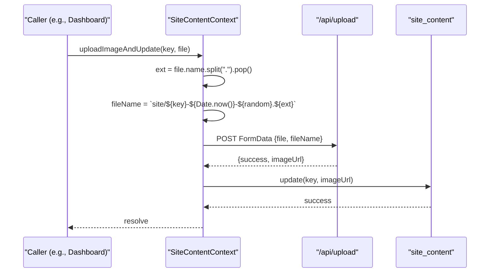
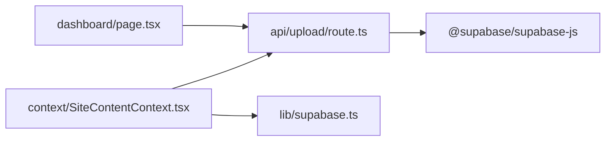

# Media Upload System

<cite>
**Referenced Files in This Document**
- [route.ts](file://app/api/upload/route.ts)
- [SiteContentContext.tsx](file://app/context/SiteContentContext.tsx)
- [supabase.ts](file://lib/supabase.ts)
- [page.tsx](file://app/dashboard/page.tsx)
</cite>

## Table of Contents
1. [Introduction](#introduction)
2. [Project Structure](#project-structure)
3. [Core Components](#core-components)
4. [Architecture Overview](#architecture-overview)
5. [Detailed Component Analysis](#detailed-component-analysis)
6. [Dependency Analysis](#dependency-analysis)
7. [Performance Considerations](#performance-considerations)
8. [Troubleshooting Guide](#troubleshooting-guide)
9. [Conclusion](#conclusion)

## Introduction
This document explains the media upload system used to store images and update site content. It covers the server-side API route that handles uploads, client-side context for uploading images and persisting URLs, Supabase Storage integration, file naming conventions, URL generation, supported formats, error handling, progress tracking, and security considerations.

## Project Structure
The upload flow spans a Next.js API route, a React context provider, and a dashboard page:
- Server API route receives multipart form data, validates inputs, uploads to Supabase Storage, and returns a public URL.
- SiteContentContext provides an uploadImageAndUpdate method that generates unique filenames, posts to the API, and persists the returned URL into site_content.
- Dashboard page demonstrates product image uploads (main and gallery), including progress messages and error feedback.

**Diagram sources**
- [route.ts:1-67](file://app/api/upload/route.ts#L1-L67)
- [SiteContentContext.tsx:71-96](file://app/context/SiteContentContext.tsx#L71-L96)
- [page.tsx:152-233](file://app/dashboard/page.tsx#L152-L233)

**Section sources**
- [route.ts:1-67](file://app/api/upload/route.ts#L1-L67)
- [SiteContentContext.tsx:1-110](file://app/context/SiteContentContext.tsx#L1-L110)
- [page.tsx:152-233](file://app/dashboard/page.tsx#L152-L233)

## Core Components
- API Upload Handler (POST /api/upload): Parses FormData, validates presence of file and fileName, constructs a Supabase client, uploads buffer to the product-images bucket, and returns the public URL.
- SiteContentContext.uploadImageAndUpdate: Generates a unique filename with a site/ prefix, posts to /api/upload, and updates the site_content row for the given key with the returned imageUrl.
- Supabase Configuration: Centralized client creation with environment variable validation and fallbacks; defines STORAGE_BUCKET name.
- Dashboard Upload Flow: Builds FormData, sets upload progress messages, uploads main and additional images, then saves product metadata.

Key responsibilities:
- Input validation at both client and server layers.
- Unique file naming to avoid collisions.
- Error propagation and user-facing feedback.
- Persistence of public URLs to database.

**Section sources**
- [route.ts:4-66](file://app/api/upload/route.ts#L4-L66)
- [SiteContentContext.tsx:71-96](file://app/context/SiteContentContext.tsx#L71-L96)
- [supabase.ts:1-46](file://lib/supabase.ts#L1-L46)
- [page.tsx:152-233](file://app/dashboard/page.tsx#L152-L233)

## Architecture Overview
End-to-end sequence for uploading an image and updating site content:

**Diagram sources**
- [SiteContentContext.tsx:71-96](file://app/context/SiteContentContext.tsx#L71-L96)
- [route.ts:4-66](file://app/api/upload/route.ts#L4-L66)

## Detailed Component Analysis

### API Upload Handler (POST /api/upload)
Responsibilities:
- Parse multipart/form-data and extract file and fileName.
- Validate required fields.
- Create Supabase client using environment variables with fallbacks.
- Convert File to ArrayBuffer and Buffer for upload.
- Upload to Supabase Storage bucket "product-images".
- Retrieve public URL and return it.

Security and validation:
- Requires both file and fileName; otherwise returns 400.
- Uses contentType from the uploaded file or defaults to image/jpeg.
- No explicit size limit is enforced in this route.

Error handling:
- Returns 500 with message on Supabase upload errors.
- Catches unexpected errors and returns 500.

**Diagram sources**
- [route.ts:4-66](file://app/api/upload/route.ts#L4-L66)

**Section sources**
- [route.ts:4-66](file://app/api/upload/route.ts#L4-L66)

### SiteContentContext.uploadImageAndUpdate
Responsibilities:
- Derive extension from file.name and generate a unique fileName with a site/ prefix.
- Build FormData with file and fileName.
- POST to /api/upload and handle response.
- On success, call update(key, imageUrl) to persist the URL in site_content.

File naming convention:
- Pattern: site/{key}-{timestamp}-{random}.{ext}
- Ensures uniqueness and avoids upsert conflicts by always creating new files.

URL generation:
- The API returns the public URL obtained from Supabase Storage.

Error handling:
- Throws an error if the upload response is not ok, including the error message from the API.

Progress tracking:
- Not implemented here; progress is handled in the dashboard page when calling this method.

**Diagram sources**
- [SiteContentContext.tsx:71-96](file://app/context/SiteContentContext.tsx#L71-L96)

**Section sources**
- [SiteContentContext.tsx:71-96](file://app/context/SiteContentContext.tsx#L71-L96)

### Supabase Integration and Configuration
- Client initialization uses environment variables with validation and fallbacks.
- STORAGE_BUCKET is defined as "product-images".
- Both the API route and the context rely on the same bucket name.

Security notes:
- Credentials are read from environment variables; placeholders are replaced with fallback values.
- Ensure proper RLS policies and Storage policies are configured in Supabase to restrict access.

**Section sources**
- [supabase.ts:1-46](file://lib/supabase.ts#L1-L46)
- [route.ts:17-29](file://app/api/upload/route.ts#L17-L29)

### Dashboard Upload Flow (Products)
Responsibilities:
- Validates selected files as images before processing.
- Builds FormData with file and fileName for each image.
- Sets upload progress messages during main and additional image uploads.
- Collects uploaded image URLs and includes them in product data.

Supported formats:
- Accept attributes include PNG, JPEG, WEBP, JPG.
- Client-side type check ensures file.type starts with "image/".

Progress tracking:
- Updates state with descriptive messages like "Uploading main image..." and "Uploading additional images...".

Error handling:
- Throws errors on non-ok responses and shows toast notifications.

Examples:
- Uploading a product main image:
  - Construct fileName without folder prefix.
  - POST to /api/upload and capture imageUrl.
- Uploading additional gallery images:
  - Prefix fileName with "gallery-" and timestamp/random.
  - Append successful imageUrl entries to the list.

**Section sources**
- [page.tsx:78-87](file://app/dashboard/page.tsx#L78-L87)
- [page.tsx:152-233](file://app/dashboard/page.tsx#L152-L233)
- [page.tsx:508-508](file://app/dashboard/page.tsx#L508-L508)
- [page.tsx:800-800](file://app/dashboard/page.tsx#L800-L800)

## Dependency Analysis
- API route depends on @supabase/supabase-js and NextResponse.
- SiteContentContext depends on supabase client and calls the API route.
- Dashboard page orchestrates uploads and manages UI state.

**Diagram sources**
- [page.tsx:152-233](file://app/dashboard/page.tsx#L152-L233)
- [route.ts:1-67](file://app/api/upload/route.ts#L1-L67)
- [SiteContentContext.tsx:1-110](file://app/context/SiteContentContext.tsx#L1-L110)
- [supabase.ts:1-46](file://lib/supabase.ts#L1-L46)

**Section sources**
- [route.ts:1-67](file://app/api/upload/route.ts#L1-L67)
- [SiteContentContext.tsx:1-110](file://app/context/SiteContentContext.tsx#L1-L110)
- [supabase.ts:1-46](file://lib/supabase.ts#L1-L46)
- [page.tsx:152-233](file://app/dashboard/page.tsx#L152-L233)

## Performance Considerations
- Avoid unnecessary re-uploads by checking existing URLs before prompting users to select files.
- Use unique filenames to prevent overwrites and reduce contention.
- Consider adding server-side size limits and format checks to reduce bandwidth and storage costs.
- For large galleries, consider chunked uploads or background jobs to improve responsiveness.

[No sources needed since this section provides general guidance]

## Troubleshooting Guide
Common issues and resolutions:
- Missing file or fileName:
  - Ensure FormData contains both fields.
  - Check client code constructing FormData.
- Invalid file type:
  - Enforce image types on the client and add server-side validation.
- Upload failures:
  - Inspect Supabase credentials and bucket configuration.
  - Review error messages returned by the API route.
- Progress not shown:
  - Implement progress events for fetch uploads or use a library that supports upload progress.

**Section sources**
- [route.ts:10-15](file://app/api/upload/route.ts#L10-L15)
- [route.ts:43-48](file://app/api/upload/route.ts#L43-L48)
- [page.tsx:78-87](file://app/dashboard/page.tsx#L78-L87)
- [page.tsx:152-233](file://app/dashboard/page.tsx#L152-L233)

## Conclusion
The media upload system integrates a Next.js API route with Supabase Storage to securely store images and return public URLs. SiteContentContext centralizes the upload-and-persist workflow for site content, while the dashboard demonstrates practical usage for product images. Enhancements such as strict size limits, robust file type validation, and upload progress tracking can further improve reliability and user experience.

[No sources needed since this section summarizes without analyzing specific files]