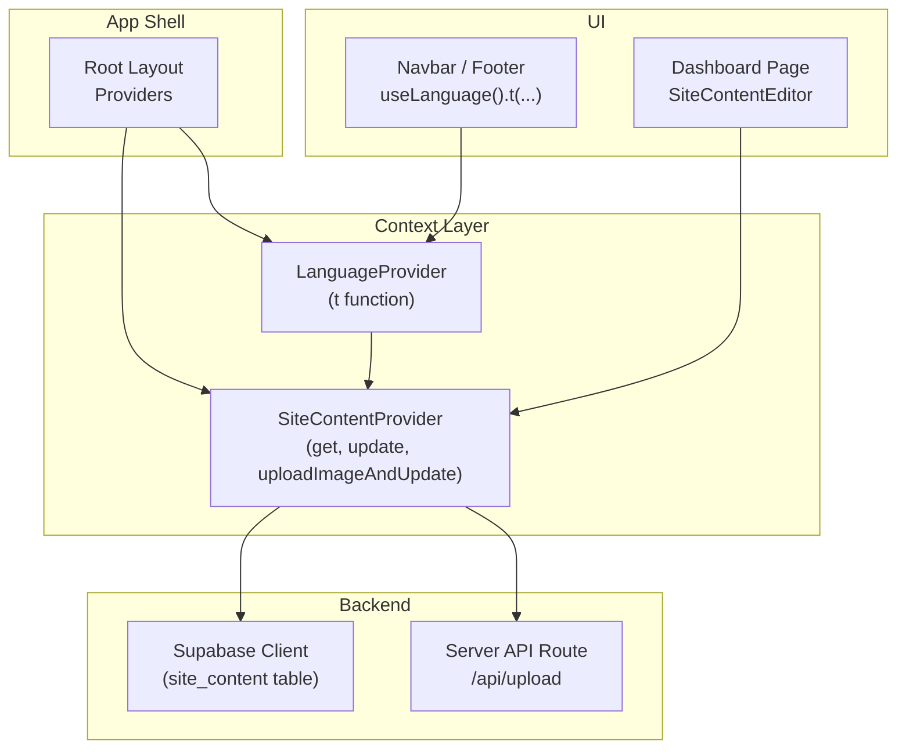
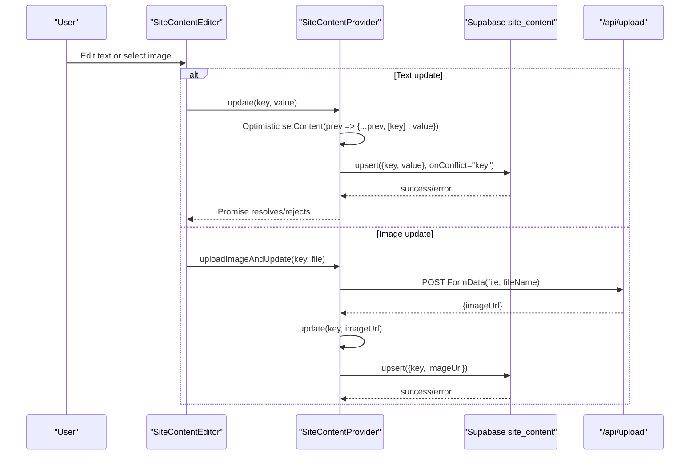
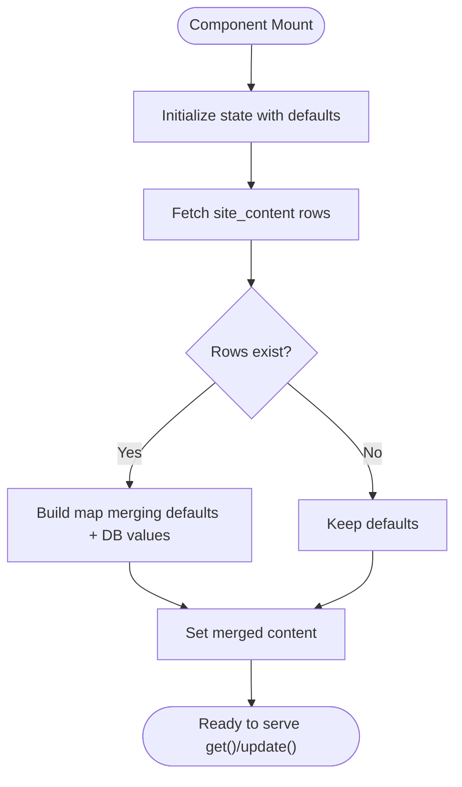
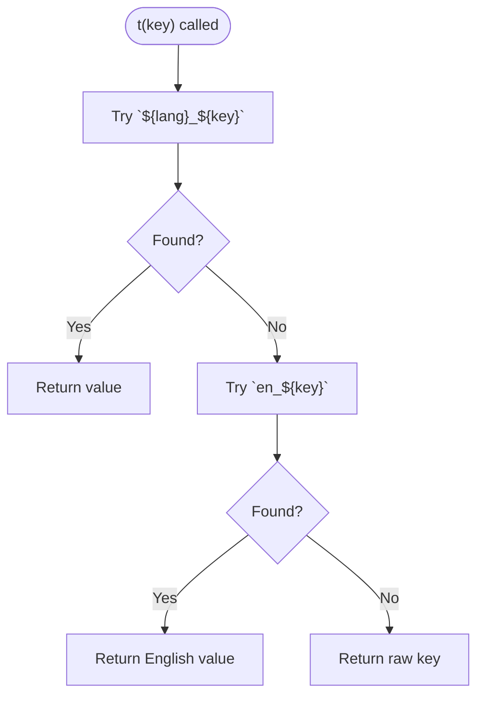
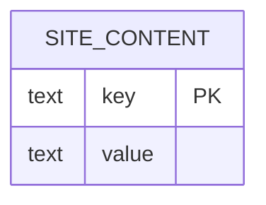
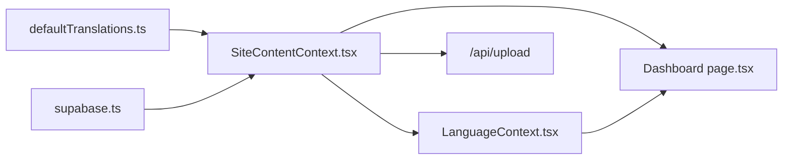

# Site Content Editing

<cite>
**Referenced Files in This Document**
- [SiteContentContext.tsx](file://app/context/SiteContentContext.tsx)
- [defaultTranslations.ts](file://app/context/defaultTranslations.ts)
- [LanguageContext.tsx](file://app/context/LanguageContext.tsx)
- [layout.tsx](file://app/layout.tsx)
- [supabase-setup.sql](file://supabase-setup.sql)
- [supabase.ts](file://lib/supabase.ts)
- [page.tsx (Dashboard)](file://app/dashboard/page.tsx)
</cite>

## Table of Contents
1. [Introduction](#introduction)
2. [Project Structure](#project-structure)
3. [Core Components](#core-components)
4. [Architecture Overview](#architecture-overview)
5. [Detailed Component Analysis](#detailed-component-analysis)
6. [Dependency Analysis](#dependency-analysis)
7. [Performance Considerations](#performance-considerations)
8. [Troubleshooting Guide](#troubleshooting-guide)
9. [Conclusion](#conclusion)
10. [Appendices](#appendices)

## Introduction
This document explains the site content editing system that powers dynamic text and image content across the application. It focuses on how SiteContentContext manages a key-value store, performs optimistic updates, falls back to default translations, integrates with Supabase’s site_content table, and supports image uploads via a server API route. It also covers the content schema design, validation and error handling patterns, and usage examples for promotional banners, navigation text, footer content, and other site-wide elements.

## Project Structure
The site content system is centered around:
- A React context provider that loads content from Supabase and exposes get/update helpers
- A comprehensive set of default translations keyed by language prefix
- A language-aware translation helper that resolves keys at runtime
- A dashboard editor UI that uses these helpers to update content live
- Database schema and policies for site_content and storage bucket configuration

**Diagram sources**
- [layout.tsx:65-78](file://app/layout.tsx#L65-L78)
- [SiteContentContext.tsx:22-103](file://app/context/SiteContentContext.tsx#L22-L103)
- [LanguageContext.tsx:17-51](file://app/context/LanguageContext.tsx#L17-L51)
- [page.tsx (Dashboard):1054-1363](file://app/dashboard/page.tsx#L1054-L1363)

**Section sources**
- [layout.tsx:65-78](file://app/layout.tsx#L65-L78)
- [SiteContentContext.tsx:22-103](file://app/context/SiteContentContext.tsx#L22-L103)
- [LanguageContext.tsx:17-51](file://app/context/LanguageContext.tsx#L17-L51)
- [page.tsx (Dashboard):1054-1363](file://app/dashboard/page.tsx#L1054-L1363)

## Core Components
- SiteContentProvider: Initializes state with defaults, fetches site_content rows, provides get(), update(), and uploadImageAndUpdate()
- LanguageProvider: Provides t(key) which resolves lang-prefixed keys using SiteContentContext.get()
- Default Translations: Comprehensive en_/ar_ prefixed keys for all UI strings and images
- Dashboard SiteContentEditor: UI to edit text and images; calls update() and uploadImageAndUpdate()

Key responsibilities:
- Key-value storage pattern: content map keyed by string identifiers
- Optimistic updates: immediate UI refresh before persistence
- Fallbacks: defaults and English fallback when Arabic is missing
- Image handling: upload via server route, then persist URL into site_content

**Section sources**
- [SiteContentContext.tsx:10-109](file://app/context/SiteContentContext.tsx#L10-L109)
- [defaultTranslations.ts:1-494](file://app/context/defaultTranslations.ts#L1-L494)
- [LanguageContext.tsx:17-51](file://app/context/LanguageContext.tsx#L17-L51)
- [page.tsx (Dashboard):1054-1363](file://app/dashboard/page.tsx#L1054-L1363)

## Architecture Overview
The system follows a client-side context-driven architecture with a simple key-value database backend.

**Diagram sources**
- [SiteContentContext.tsx:57-96](file://app/context/SiteContentContext.tsx#L57-L96)
- [page.tsx (Dashboard):1058-1080](file://app/dashboard/page.tsx#L1058-L1080)

## Detailed Component Analysis

### SiteContentContext
Responsibilities:
- Initialize state with default translations
- Fetch site_content rows and merge with defaults
- Provide get(key) with fallback chain
- Provide update(key, value) with optimistic UI and upsert
- Provide uploadImageAndUpdate(key, file) to upload images and save URLs

Data model:
- In-memory map: Record<string, string>
- Persistence: site_content table with key primary key and value text

Optimistic updates:
- Immediately update local state before network call
- On error, throw to allow caller to handle rollback or feedback

Fallback strategy:
- get(key) returns content[key] if present, else SITE_CONTENT_DEFAULTS[key], else empty string

Error handling:
- Network errors during fetch are caught and logged; defaults remain active
- Update errors are thrown with message for caller to surface

Real-time synchronization:
- Not implemented in this context; current behavior is pull-on-mount and manual updates

**Diagram sources**
- [SiteContentContext.tsx:22-48](file://app/context/SiteContentContext.tsx#L22-L48)

**Section sources**
- [SiteContentContext.tsx:10-109](file://app/context/SiteContentContext.tsx#L10-L109)

### LanguageProvider and Translation Resolution
Responsibilities:
- Maintain current language and RTL direction
- Provide t(key) that resolves lang-prefixed keys via SiteContentContext.get()
- Fallback to English key if target language is missing

Resolution order:
- sc(`${lang}_${key}`)
- If empty, try sc(`en_${key}`)
- If still empty, return raw key

Integration:
- Uses useSiteContent().get internally
- Updates <html> attributes for accessibility and layout

**Diagram sources**
- [LanguageContext.tsx:32-44](file://app/context/LanguageContext.tsx#L32-L44)

**Section sources**
- [LanguageContext.tsx:17-51](file://app/context/LanguageContext.tsx#L17-L51)

### Dashboard SiteContentEditor
Responsibilities:
- Render editable fields grouped by section (General, Hero, Categories, Process, Notes, Story & Testimonials, Gifting, Signature Discovery, Editorial Spotlight, Lookbook, Footer)
- Support language toggle for editing (en/ar)
- Save text changes via update()
- Upload images via uploadImageAndUpdate() and persist URLs

Validation and UX:
- Saving indicator per field
- Toast notifications for success/failure
- Input direction adapts to selected editing language

Examples of managed content:
- Promotional banners: ann_1, ann_2, ann_3
- Navigation text: nav_home, nav_products, nav_collection, nav_about, nav_blog, nav_contact, nav_dashboard, nav_cart, nav_finder
- Footer content: footer_desc, footer_copyright, footer_made, and many footer link labels
- Hero section: hero_image, hero_eyebrow, hero_title_1..3, hero_subtitle, hero_btn_primary, hero_btn_secondary
- Category sections: cat_eyebrow, cat_title, cat_desc, cat1..4_image/name/sub
- Process steps: proc_eyebrow, proc_title, proc_desc, proc_step1..4_title/desc
- Ingredients: notes_eyebrow, notes_title_1..2, notes_desc, note1..6_name/origin/desc
- Brand story: story_eyebrow, story_title_1..2, story_p1..2
- Testimonials: test_title, test1..3_name/product/text
- Gifting: gift_image, gift_eyebrow, gift_title, gift_desc, gift_btn
- Signature discovery: sig_image, sig_title_1..2, sig_desc, sig_btn
- Editorial spotlight: edit_image, edit_eyebrow, edit_title, edit_desc, edit_btn
- Curated lookbook: look_image, look_eyebrow, look_title, look_desc, look_btn

**Section sources**
- [page.tsx (Dashboard):1054-1363](file://app/dashboard/page.tsx#L1054-L1363)

### Supabase Integration and Schema
Database:
- site_content table with key (primary key) and value (text)
- Row Level Security enabled with public read/write policies for demo/admin without auth

Storage:
- Images uploaded via /api/upload to Supabase Storage bucket named product-images
- Context generates unique filenames and persists returned imageUrl into site_content

Environment:
- supabase.ts exports a client configured with environment variables or safe fallbacks for development

**Diagram sources**
- [supabase-setup.sql:61-64](file://supabase-setup.sql#L61-L64)

**Section sources**
- [supabase-setup.sql:61-82](file://supabase-setup.sql#L61-L82)
- [supabase.ts:1-46](file://lib/supabase.ts#L1-L46)

## Dependency Analysis
High-level dependencies:
- SiteContentContext depends on supabase client and defaultTranslations
- LanguageProvider depends on SiteContentContext
- Dashboard page depends on both contexts and the server upload route
- Root layout wires providers in correct order

**Diagram sources**
- [SiteContentContext.tsx:3-8](file://app/context/SiteContentContext.tsx#L3-L8)
- [LanguageContext.tsx:3-4](file://app/context/LanguageContext.tsx#L3-L4)
- [page.tsx (Dashboard):6-8](file://app/dashboard/page.tsx#L6-L8)

**Section sources**
- [SiteContentContext.tsx:3-8](file://app/context/SiteContentContext.tsx#L3-L8)
- [LanguageContext.tsx:3-4](file://app/context/LanguageContext.tsx#L3-L4)
- [page.tsx (Dashboard):6-8](file://app/dashboard/page.tsx#L6-L8)

## Performance Considerations
- Initial load: Single query to site_content merges with defaults; consider caching or incremental updates if the dataset grows significantly
- Optimistic updates: Immediate UI responsiveness; ensure callers handle errors gracefully
- Image uploads: Server route avoids CORS issues; generate unique filenames to avoid collisions
- Avoid unnecessary re-renders: Use stable keys and memoized callbacks where appropriate

[No sources needed since this section provides general guidance]

## Troubleshooting Guide
Common issues and resolutions:
- Missing environment variables: The Supabase client logs an info message and uses fallback credentials; verify NEXT_PUBLIC_SUPABASE_URL and NEXT_PUBLIC_SUPABASE_ANON_KEY
- RLS policy misconfiguration: Ensure site_content has public select/insert/update policies for demo mode
- Upload failures: Check /api/upload response and bucket permissions; ensure bucket exists and is public
- Empty translations: Verify key naming conventions (lang_prefix_key) and that defaults include required keys

Operational checks:
- Confirm site_content table exists and has expected rows
- Validate that get() returns expected values after update()
- Inspect browser console for warnings/errors from fetch/upsert operations

**Section sources**
- [supabase.ts:35-39](file://lib/supabase.ts#L35-L39)
- [supabase-setup.sql:67-82](file://supabase-setup.sql#L67-L82)
- [SiteContentContext.tsx:39-43](file://app/context/SiteContentContext.tsx#L39-L43)
- [SiteContentContext.tsx:65-68](file://app/context/SiteContentContext.tsx#L65-L68)

## Conclusion
The site content editing system provides a robust, user-friendly way to manage dynamic text and images across the application. With a clear key-value schema, optimistic updates, and comprehensive defaults, it ensures consistent UX while allowing flexible content management through the dashboard. The integration with Supabase enables persistent storage and straightforward scaling.

[No sources needed since this section summarizes without analyzing specific files]

## Appendices

### API and Method Reference
- get(key: string): string
  - Returns the resolved value for a given key, falling back to defaults and then empty string
- update(key: string, value: string): Promise<void>
  - Performs an optimistic update and persists via upsert on site_content
- uploadImageAndUpdate(key: string, file: File): Promise<void>
  - Uploads image via /api/upload and persists the returned imageUrl to site_content

Usage examples:
- Promotional banners: update("en_ann_1", "..."), update("ar_ann_1", "...")
- Navigation text: update("en_nav_home", "..."), update("ar_nav_home", "...")
- Footer content: update("en_footer_desc", "..."), update("ar_footer_desc", "...")
- Hero section: update("hero_image", "..."), update("en_hero_eyebrow", "...")

**Section sources**
- [SiteContentContext.tsx:51-96](file://app/context/SiteContentContext.tsx#L51-L96)
- [page.tsx (Dashboard):1058-1080](file://app/dashboard/page.tsx#L1058-L1080)