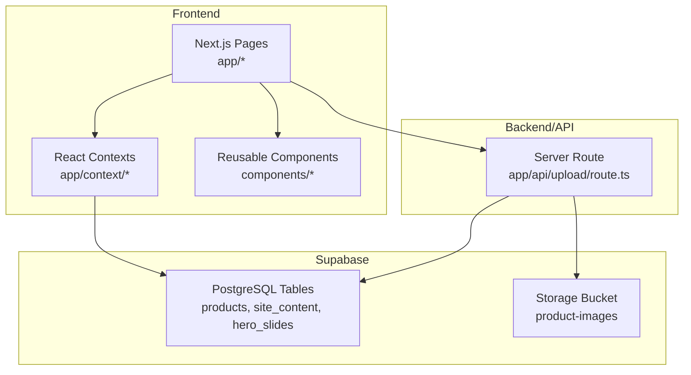
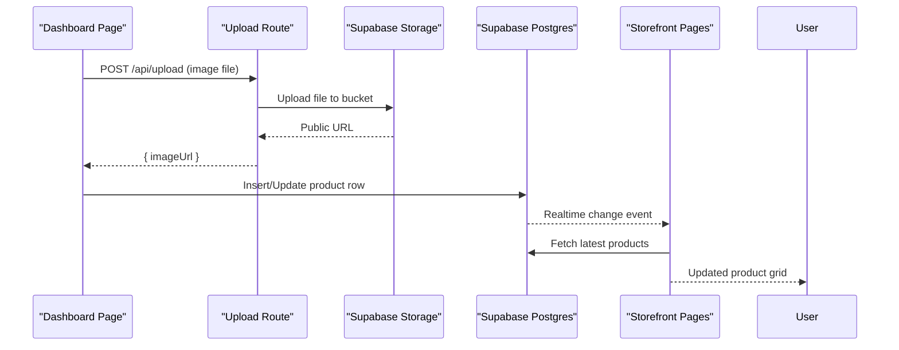
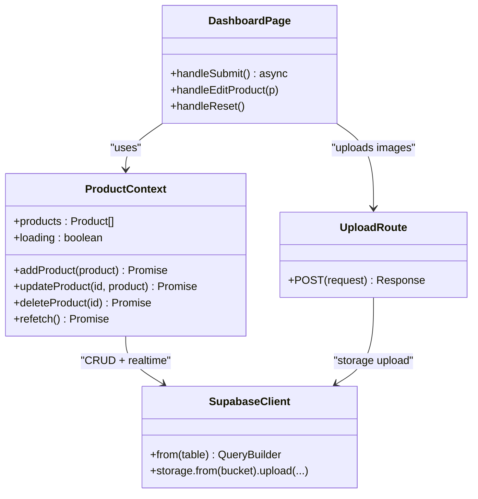
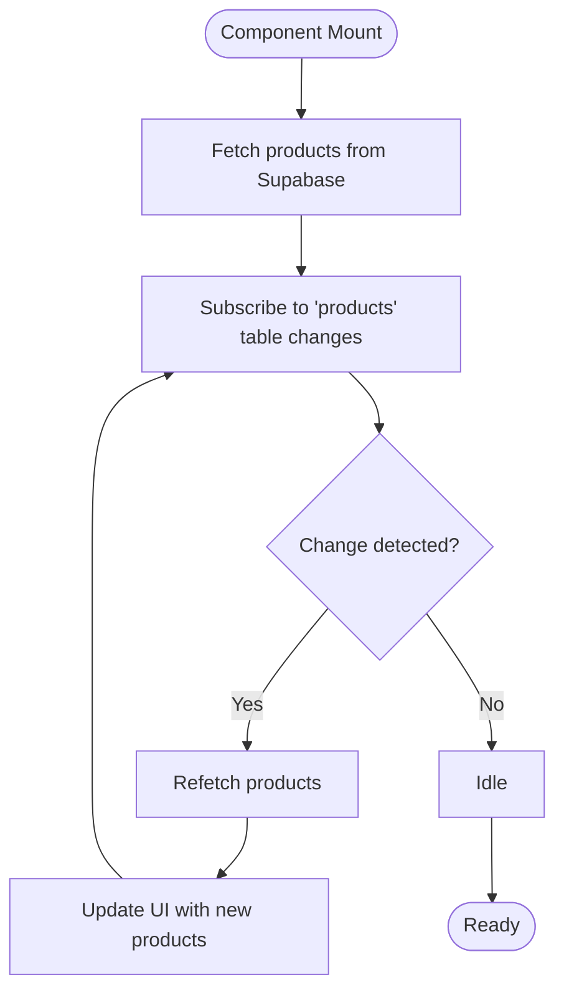
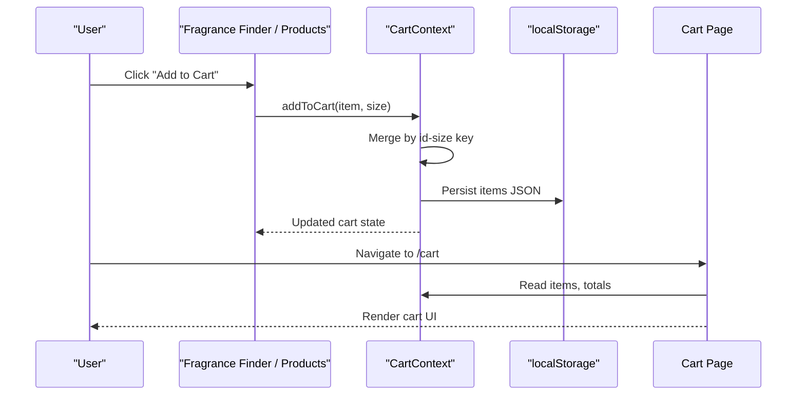
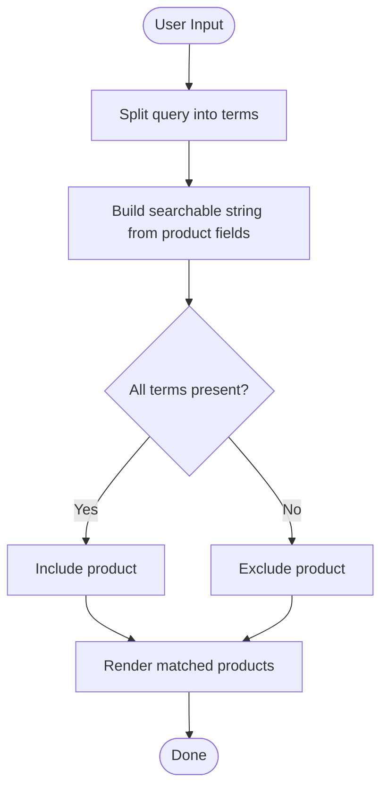
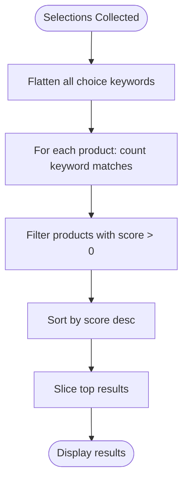
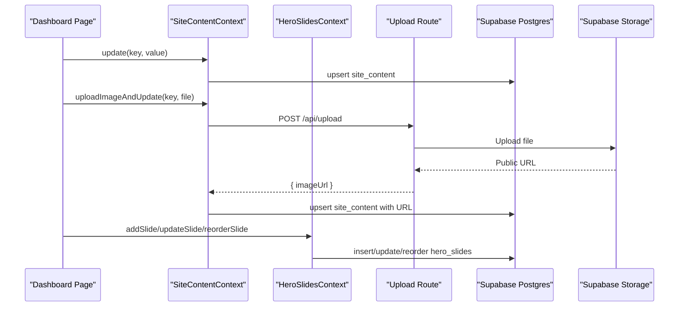
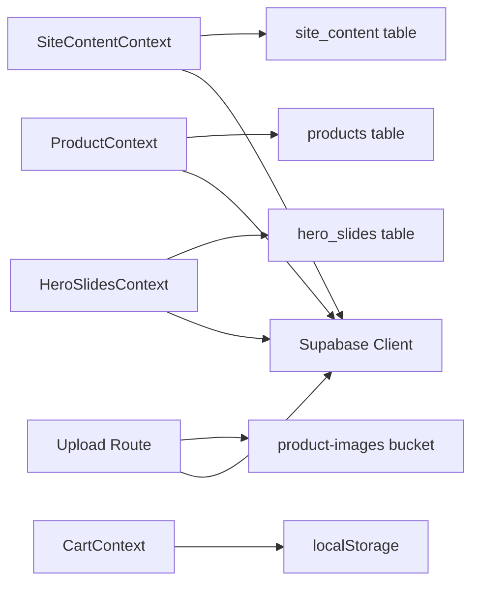
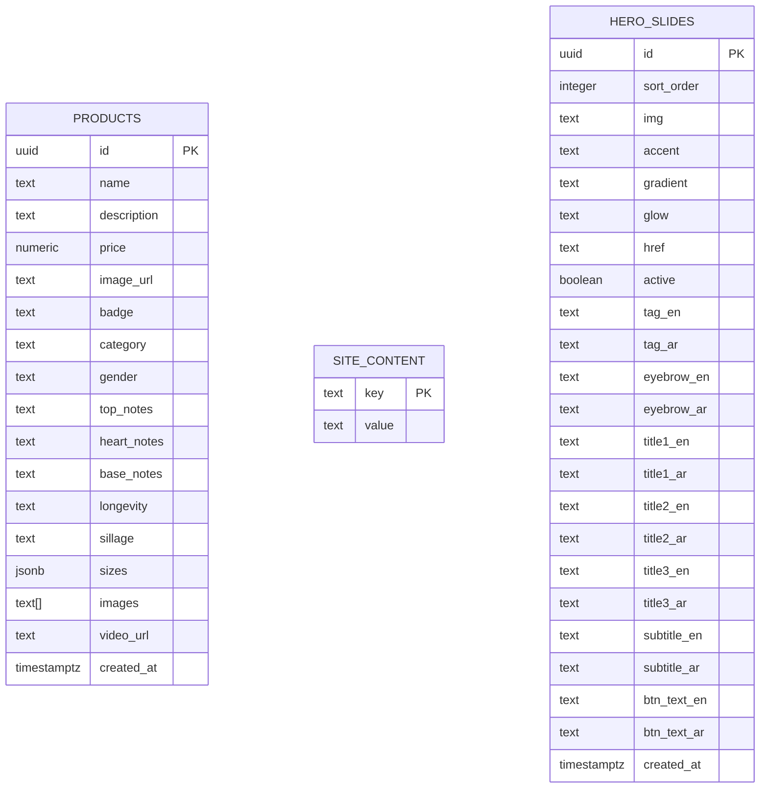

# Core Features

<cite>
**Referenced Files in This Document**
- [README.md](file://README.md)
- [package.json](file://package.json)
- [supabase-setup.sql](file://supabase-setup.sql)
- [lib/supabase.ts](file://lib/supabase.ts)
- [app/api/upload/route.ts](file://app/api/upload/route.ts)
- [app/context/ProductContext.tsx](file://app/context/ProductContext.tsx)
- [app/context/CartContext.tsx](file://app/context/CartContext.tsx)
- [app/context/SiteContentContext.tsx](file://app/context/SiteContentContext.tsx)
- [app/context/HeroSlidesContext.tsx](file://app/context/HeroSlidesContext.tsx)
- [app/fragrance-finder/page.tsx](file://app/fragrance-finder/page.tsx)
- [components/FragranceFinderWidget.tsx](file://components/FragranceFinderWidget.tsx)
- [app/cart/page.tsx](file://app/cart/page.tsx)
- [app/dashboard/page.tsx](file://app/dashboard/page.tsx)
</cite>

## Table of Contents
1. [Introduction](#introduction)
2. [Project Structure](#project-structure)
3. [Core Components](#core-components)
4. [Architecture Overview](#architecture-overview)
5. [Detailed Component Analysis](#detailed-component-analysis)
6. [Dependency Analysis](#dependency-analysis)
7. [Performance Considerations](#performance-considerations)
8. [Troubleshooting Guide](#troubleshooting-guide)
9. [Conclusion](#conclusion)
10. [Appendices](#appendices)

## Introduction
This document explains the core features of the Nubia Perfume E-Commerce Platform: product management with real-time inventory updates, shopping cart with localStorage persistence, interactive fragrance finder with keyword matching, and a content management system with dashboard interface. It provides conceptual overviews for beginners and technical implementation details for experienced developers, including user workflows, integration points, and customization options.

The platform is built with Next.js (App Router), React, Supabase (PostgreSQL + Storage), and GSAP for animations.

**Section sources**
- [README.md:1-65](file://README.md#L1-L65)
- [package.json:1-29](file://package.json#L1-L29)

## Project Structure
High-level organization:
- app/: Next.js App Router pages and client contexts
  - context/: Global state providers (Product, Cart, Site Content, Hero Slides)
  - api/upload/route.ts: Server route to upload images to Supabase Storage
  - Pages: products, product/[id], cart, checkout, order-confirmation, category, blog, about, contact, dashboard, fragrance-finder
- components/: Reusable UI components (Navbar, Footer, FragranceFinderWidget, etc.)
- lib/supabase.ts: Supabase client configuration
- supabase-setup.sql: Database schema and RLS policies

**Diagram sources**
- [app/context/ProductContext.tsx:1-116](file://app/context/ProductContext.tsx#L1-L116)
- [app/context/CartContext.tsx:1-104](file://app/context/CartContext.tsx#L1-L104)
- [app/context/SiteContentContext.tsx:1-110](file://app/context/SiteContentContext.tsx#L1-L110)
- [app/context/HeroSlidesContext.tsx:1-290](file://app/context/HeroSlidesContext.tsx#L1-L290)
- [app/api/upload/route.ts:1-67](file://app/api/upload/route.ts#L1-L67)
- [lib/supabase.ts:1-46](file://lib/supabase.ts#L1-L46)
- [supabase-setup.sql:1-137](file://supabase-setup.sql#L1-L137)

**Section sources**
- [README.md:1-65](file://README.md#L1-L65)
- [package.json:1-29](file://package.json#L1-L29)

## Core Components
- Product Management: Real-time product list via Supabase with add/update/delete operations and image uploads through a server route.
- Shopping Cart: Client-side cart state persisted to localStorage with quantity controls and totals.
- Fragrance Finder: Interactive quiz-style widget and search page using keyword matching against product notes and descriptions.
- Content Management System (CMS): Dashboard to manage products, site content, and hero carousel slides; supports image uploads and live previews.

Key integration points:
- Supabase client configured in lib/supabase.ts
- Image uploads via app/api/upload/route.ts to Supabase Storage bucket product-images
- Database tables defined in supabase-setup.sql

**Section sources**
- [lib/supabase.ts:1-46](file://lib/supabase.ts#L1-L46)
- [app/api/upload/route.ts:1-67](file://app/api/upload/route.ts#L1-L67)
- [supabase-setup.sql:1-137](file://supabase-setup.sql#L1-L137)

## Architecture Overview
End-to-end flows:
- Product CRUD: Dashboard form → Server upload route → Supabase Storage → PostgreSQL → Real-time updates to storefront.
- Cart: Add/remove items → React Context → localStorage persistence → Cart page renders totals and shipping logic.
- Fragrance Finder: User inputs or selections → Keyword scoring → Filtered results → Add to cart.
- CMS: Edit text or images → Upsert into site_content or hero_slides → Live preview across pages.

**Diagram sources**
- [app/dashboard/page.tsx:152-233](file://app/dashboard/page.tsx#L152-L233)
- [app/api/upload/route.ts:1-67](file://app/api/upload/route.ts#L1-L67)
- [app/context/ProductContext.tsx:49-82](file://app/context/ProductContext.tsx#L49-L82)

## Detailed Component Analysis

### Product Management System
Conceptual overview:
- Administrators can add new fragrances with name, description, price, badge, category, gender, notes, longevity, sillage, sizes, gallery images, and video URL.
- Images are uploaded to Supabase Storage; URLs are saved in the database.
- The storefront subscribes to real-time changes so product listings update instantly.

Implementation highlights:
- ProductProvider manages products state, fetches from Supabase, and sets up a realtime channel on the products table.
- Dashboard page orchestrates image uploads via the server route, then persists product data.
- Database schema includes extended fields for notes, sizes, images array, and gender.

**Diagram sources**
- [app/context/ProductContext.tsx:1-116](file://app/context/ProductContext.tsx#L1-L116)
- [app/dashboard/page.tsx:152-233](file://app/dashboard/page.tsx#L152-L233)
- [app/api/upload/route.ts:1-67](file://app/api/upload/route.ts#L1-L67)
- [lib/supabase.ts:1-46](file://lib/supabase.ts#L1-L46)

Real-time update flow:
- On mount, ProductProvider fetches products and subscribes to postgres_changes on the products table.
- Any insert/update/delete triggers refetch, updating all consumers (storefront grids, dashboards).

**Diagram sources**
- [app/context/ProductContext.tsx:49-82](file://app/context/ProductContext.tsx#L49-L82)

Customization options:
- Extend product fields by adding columns in supabase-setup.sql and updating Product type and dashboard form.
- Adjust realtime events if you need specific change types instead of wildcard.

**Section sources**
- [app/context/ProductContext.tsx:1-116](file://app/context/ProductContext.tsx#L1-L116)
- [app/dashboard/page.tsx:152-233](file://app/dashboard/page.tsx#L152-L233)
- [supabase-setup.sql:40-56](file://supabase-setup.sql#L40-L56)

### Shopping Cart with localStorage Persistence
Conceptual overview:
- Users add fragrances to the cart, adjust quantities, remove items, and view totals.
- Cart state persists across sessions using localStorage.

Implementation highlights:
- CartProvider maintains items array, computes totalItems and totalPrice, and syncs with localStorage.
- addToCart merges items by id+size key; updateQty handles zero quantity by removing item.
- Cart page displays items, summary, shipping logic, and links to checkout.

**Diagram sources**
- [app/context/CartContext.tsx:28-96](file://app/context/CartContext.tsx#L28-L96)
- [app/cart/page.tsx:1-220](file://app/cart/page.tsx#L1-L220)
- [app/fragrance-finder/page.tsx:185-278](file://app/fragrance-finder/page.tsx#L185-L278)

Customization options:
- Change localStorage key by editing the key used in CartProvider.
- Integrate promo codes or tax/shipping rules in the cart page.

**Section sources**
- [app/context/CartContext.tsx:1-104](file://app/context/CartContext.tsx#L1-L104)
- [app/cart/page.tsx:1-220](file://app/cart/page.tsx#L1-L220)

### Interactive Fragrance Finder with Keyword Matching
Conceptual overview:
- Two entry points:
  - Full-page search: users type keywords to match product names, notes, and descriptions.
  - Widget-based quiz: guided steps (mood, top/heart/base notes) compute a score per product based on keyword overlap.

Algorithm details:
- Search page splits query into terms and checks that all terms appear in concatenated searchable text fields.
- Widget collects choices with predefined keywords, flattens them, and scores each product by counting matches; returns top results sorted by score.

**Diagram sources**
- [app/fragrance-finder/page.tsx:50-67](file://app/fragrance-finder/page.tsx#L50-L67)

Quiz scoring flow:
- Collect selections across steps
- Flatten choice keywords
- For each product, count how many keywords appear in notes/description/name
- Sort descending by score and slice top N

**Diagram sources**
- [components/FragranceFinderWidget.tsx:182-197](file://components/FragranceFinderWidget.tsx#L182-L197)

Integration points:
- Both search and widget use useProducts to access product list and useCart to add items directly from results.

Customization options:
- Expand STEPS and keywords in the widget to tailor recommendations.
- Adjust matching strategy (e.g., fuzzy matching, weighting) in the search algorithm.

**Section sources**
- [app/fragrance-finder/page.tsx:1-287](file://app/fragrance-finder/page.tsx#L1-L287)
- [components/FragranceFinderWidget.tsx:1-800](file://components/FragranceFinderWidget.tsx#L1-L800)

### Content Management System with Dashboard Interface
Conceptual overview:
- Dashboard provides tabs for overview, add/edit products, all products, site content editor, and hero carousel manager.
- Site content allows updating arbitrary key-value pairs and uploading images to storage, saving public URLs.
- Hero slides support CRUD and reordering with sort_order.

Implementation highlights:
- SiteContentProvider loads defaults, fetches site_content rows, and provides get/update/uploadImageAndUpdate helpers.
- HeroSlidesProvider manages active slides, default fallbacks, and reorder logic.
- Dashboard integrates these contexts and uses the upload route for images.

**Diagram sources**
- [app/context/SiteContentContext.tsx:56-96](file://app/context/SiteContentContext.tsx#L56-L96)
- [app/context/HeroSlidesContext.tsx:188-260](file://app/context/HeroSlidesContext.tsx#L188-L260)
- [app/api/upload/route.ts:1-67](file://app/api/upload/route.ts#L1-L67)
- [app/dashboard/page.tsx:1-800](file://app/dashboard/page.tsx#L1-L800)

Practical examples:
- Add a new fragrance: open Dashboard → Add Product tab → fill fields → select main image and optional gallery images → submit → product appears in store immediately due to realtime subscription.
- Update site copy: open Dashboard → Site Content tab → edit text keys → save → changes reflect across pages using useSiteContent.get().
- Manage hero carousel: open Dashboard → Carousel tab → add slide, set active, reorder via up/down actions.

Customization options:
- Extend site_content keys and provide translations in defaultTranslations.
- Add more hero slide fields and update HeroSlide interface accordingly.

**Section sources**
- [app/context/SiteContentContext.tsx:1-110](file://app/context/SiteContentContext.tsx#L1-L110)
- [app/context/HeroSlidesContext.tsx:1-290](file://app/context/HeroSlidesContext.tsx#L1-L290)
- [app/dashboard/page.tsx:1-800](file://app/dashboard/page.tsx#L1-L800)

## Dependency Analysis
Key dependencies and relationships:
- Next.js pages depend on React contexts for shared state.
- Contexts depend on Supabase client for data operations.
- Upload route depends on Supabase Storage and returns public URLs.
- Database schema defines tables and RLS policies enabling public read/write for demo purposes.

**Diagram sources**
- [app/context/ProductContext.tsx:1-116](file://app/context/ProductContext.tsx#L1-L116)
- [app/context/CartContext.tsx:1-104](file://app/context/CartContext.tsx#L1-L104)
- [app/context/SiteContentContext.tsx:1-110](file://app/context/SiteContentContext.tsx#L1-L110)
- [app/context/HeroSlidesContext.tsx:1-290](file://app/context/HeroSlidesContext.tsx#L1-L290)
- [app/api/upload/route.ts:1-67](file://app/api/upload/route.ts#L1-L67)
- [lib/supabase.ts:1-46](file://lib/supabase.ts#L1-L46)
- [supabase-setup.sql:1-137](file://supabase-setup.sql#L1-L137)

**Section sources**
- [supabase-setup.sql:1-137](file://supabase-setup.sql#L1-L137)
- [lib/supabase.ts:1-46](file://lib/supabase.ts#L1-L46)

## Performance Considerations
- Realtime subscriptions: One global subscription per ProductProvider instance; avoid duplicating providers to prevent multiple channels.
- LocalStorage writes: Throttled by React batching; ensure large carts do not cause excessive writes.
- Image uploads: Use server route to bypass CORS and adblockers; consider compressing images before upload to reduce payload.
- Matching algorithms: Current keyword matching is O(n*m) where n is number of products and m is number of terms; acceptable for small catalogs but consider indexing or backend filtering for larger datasets.
- Animations: GSAP usage is scoped to refs; ensure cleanup to avoid memory leaks.

[No sources needed since this section provides general guidance]

## Troubleshooting Guide
Common issues and resolutions:
- Supabase environment variables missing:
  - Ensure NEXT_PUBLIC_SUPABASE_URL and NEXT_PUBLIC_SUPABASE_ANON_KEY are set in .env.local and restart dev server.
  - The client falls back to placeholder credentials with a console log when placeholders are detected.
- Storage bucket not created or not public:
  - Create bucket named product-images and mark it public.
- Upload errors:
  - Check network connectivity and bucket permissions; review error messages returned by the upload route.
- Realtime not updating:
  - Verify RLS policies allow changes on the products table and that the realtime channel is subscribed.

Operational tips:
- Dashboard shows connection status indicators for Supabase.
- Use toast notifications to confirm success or display errors after uploads and saves.

**Section sources**
- [lib/supabase.ts:27-39](file://lib/supabase.ts#L27-L39)
- [app/dashboard/page.tsx:20-36](file://app/dashboard/page.tsx#L20-L36)
- [app/api/upload/route.ts:43-66](file://app/api/upload/route.ts#L43-L66)
- [supabase-setup.sql:17-33](file://supabase-setup.sql#L17-L33)

## Conclusion
The Nubia Perfume E-Commerce Platform delivers a cohesive experience combining real-time product management, persistent shopping cart, interactive fragrance discovery, and an admin-friendly CMS. Its architecture leverages React contexts for state, Supabase for data and storage, and a server route for secure uploads. The provided diagrams and sections outline both high-level workflows and code-level integrations, enabling quick onboarding for newcomers and actionable insights for advanced customization.

[No sources needed since this section summarizes without analyzing specific files]

## Appendices

### Setup and Configuration
- Install dependencies and run development server as described in README.
- Configure Supabase project, create product-images bucket, and run SQL migrations.
- Set environment variables for Supabase URL and anon key.

**Section sources**
- [README.md:16-36](file://README.md#L16-L36)
- [supabase-setup.sql:1-137](file://supabase-setup.sql#L1-L137)

### Data Models

**Diagram sources**
- [supabase-setup.sql:7-56](file://supabase-setup.sql#L7-L56)
- [supabase-setup.sql:59-110](file://supabase-setup.sql#L59-L110)