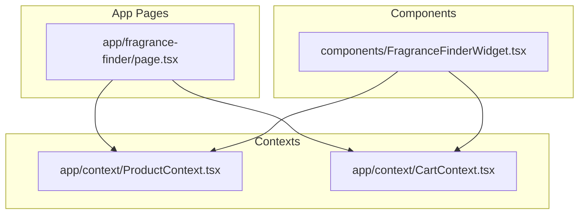
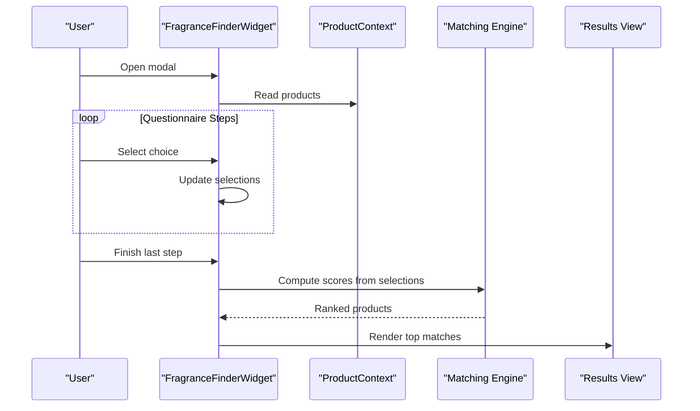
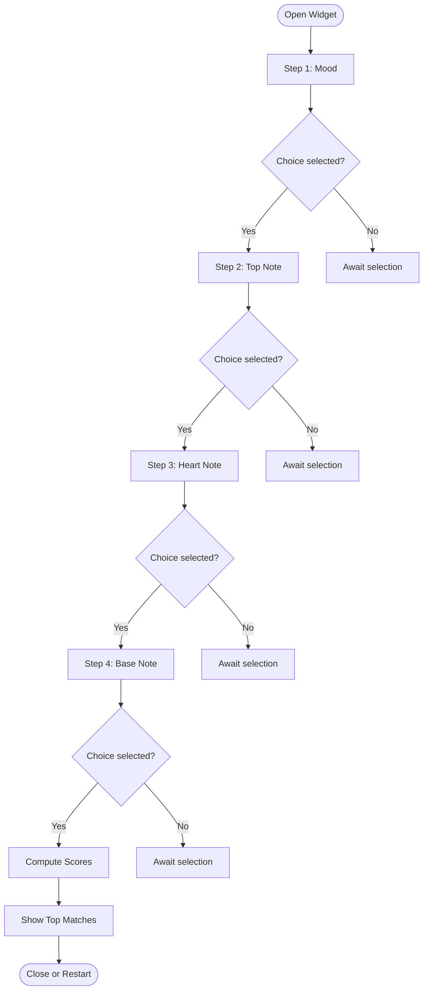
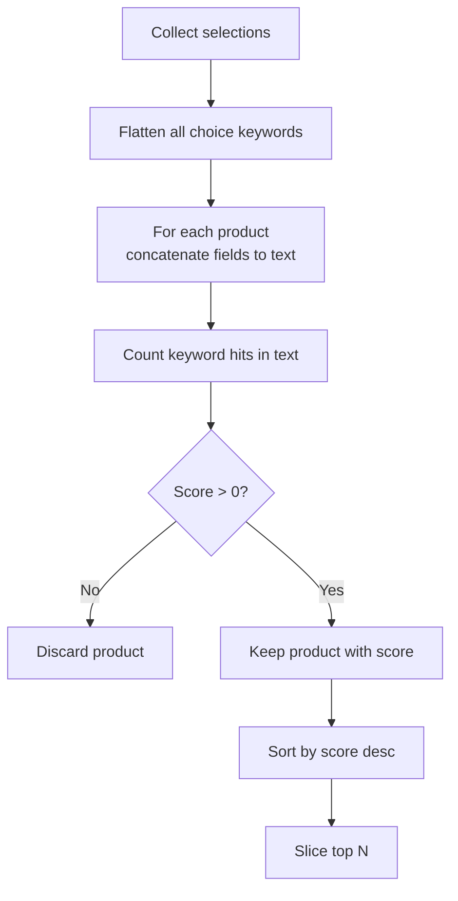
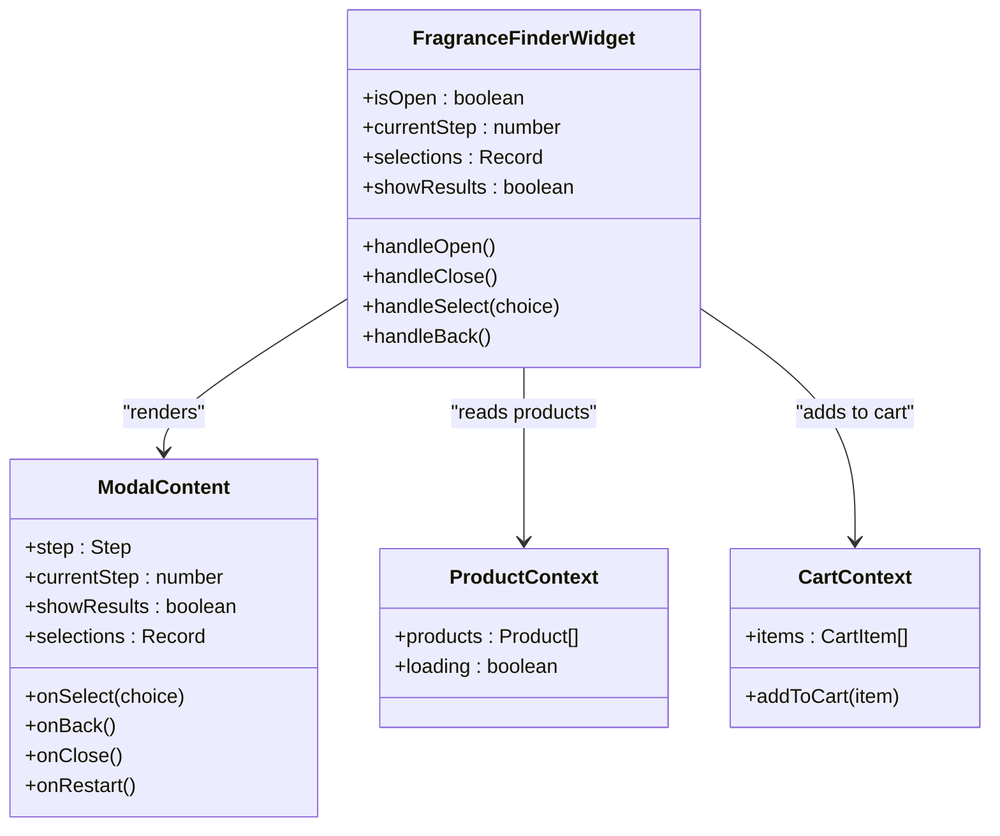
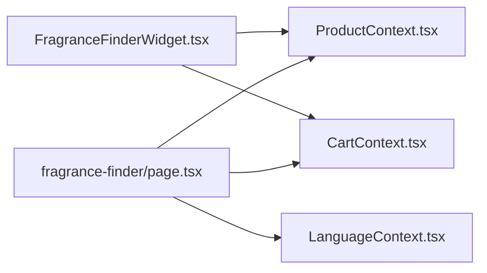

# Fragrance Finder

<cite>
**Referenced Files in This Document**
- [page.tsx](file://app/fragrance-finder/page.tsx)
- [FragranceFinderWidget.tsx](file://components/FragranceFinderWidget.tsx)
- [ProductContext.tsx](file://app/context/ProductContext.tsx)
- [CartContext.tsx](file://app/context/CartContext.tsx)
</cite>

## Table of Contents
1. [Introduction](#introduction)
2. [Project Structure](#project-structure)
3. [Core Components](#core-components)
4. [Architecture Overview](#architecture-overview)
5. [Detailed Component Analysis](#detailed-component-analysis)
6. [Dependency Analysis](#dependency-analysis)
7. [Performance Considerations](#performance-considerations)
8. [Troubleshooting Guide](#troubleshooting-guide)
9. [Conclusion](#conclusion)
10. [Appendices](#appendices)

## Introduction
The Fragrance Finder feature provides two complementary ways to discover perfumes:
- A keyword search page that filters products by notes and description.
- An interactive, step-by-step questionnaire widget that guides users through scent preferences and returns a ranked set of recommendations based on keyword matching.

This document explains the implementation details, user experience design, recommendation engine logic, scoring system, UI architecture, result presentation, customization points, accessibility considerations, and performance strategies for large catalogs.

## Project Structure
The Fragrance Finder spans a dedicated page and a reusable widget component:
- The page implements a full-screen hero with a search input and results grid.
- The widget is a floating modal-driven questionnaire with animated steps and a compact results view.

**Diagram sources**
- [page.tsx:1-287](file://app/fragrance-finder/page.tsx#L1-L287)
- [FragranceFinderWidget.tsx:1-1249](file://components/FragranceFinderWidget.tsx#L1-L1249)
- [ProductContext.tsx:1-116](file://app/context/ProductContext.tsx#L1-L116)
- [CartContext.tsx:1-47](file://app/context/CartContext.tsx#L1-L47)

**Section sources**
- [page.tsx:1-287](file://app/fragrance-finder/page.tsx#L1-L287)
- [FragranceFinderWidget.tsx:1-1249](file://components/FragranceFinderWidget.tsx#L1-L1249)
- [ProductContext.tsx:1-116](file://app/context/ProductContext.tsx#L1-L116)
- [CartContext.tsx:1-47](file://app/context/CartContext.tsx#L1-L47)

## Core Components
- Fragrance Finder Page: Provides a search-first UX with real-time filtering and animated results.
- Fragrance Finder Widget: A guided, multi-step questionnaire that computes a score per product and shows top matches.

Key responsibilities:
- Data access via ProductContext (products list).
- Cart integration via CartContext (add-to-cart state).
- Localized UI strings via LanguageContext (used in the page; widget uses static labels).
- Animations via GSAP (page) and CSS keyframes (widget).

**Section sources**
- [page.tsx:1-287](file://app/fragrance-finder/page.tsx#L1-L287)
- [FragranceFinderWidget.tsx:1-1249](file://components/FragranceFinderWidget.tsx#L1-L1249)
- [ProductContext.tsx:1-116](file://app/context/ProductContext.tsx#L1-L116)
- [CartContext.tsx:1-47](file://app/context/CartContext.tsx#L1-L47)

## Architecture Overview
The feature integrates with shared contexts for data and cart operations. The widget encapsulates all questionnaire logic and rendering, while the page offers an alternative search-first approach.

**Diagram sources**
- [FragranceFinderWidget.tsx:167-272](file://components/FragranceFinderWidget.tsx#L167-L272)
- [FragranceFinderWidget.tsx:181-197](file://components/FragranceFinderWidget.tsx#L181-L197)
- [ProductContext.tsx:45-82](file://app/context/ProductContext.tsx#L45-L82)

## Detailed Component Analysis

### Interactive Questionnaire Implementation
- Step definitions are declarative, each with question text, subtitle, and choices. Each choice includes keywords used by the matching engine.
- State tracks current step, selections, animation direction, and whether results are shown.
- Navigation supports forward progression and backward movement, with smooth transitions.
- On completion, the widget switches to a results view.

**Diagram sources**
- [FragranceFinderWidget.tsx:24-165](file://components/FragranceFinderWidget.tsx#L24-L165)
- [FragranceFinderWidget.tsx:233-270](file://components/FragranceFinderWidget.tsx#L233-L270)
- [FragranceFinderWidget.tsx:181-197](file://components/FragranceFinderWidget.tsx#L181-L197)

**Section sources**
- [FragranceFinderWidget.tsx:24-165](file://components/FragranceFinderWidget.tsx#L24-L165)
- [FragranceFinderWidget.tsx:167-272](file://components/FragranceFinderWidget.tsx#L167-L272)

### Keyword Matching Algorithm and Scoring System
- The engine aggregates all keywords from the user’s selections across steps.
- For each product, it concatenates relevant fields (notes, description, name) into a single lowercase string.
- It counts how many user keywords appear in that string to compute a simple match score.
- Products with a positive score are sorted descending and limited to a fixed number of top results.

**Diagram sources**
- [FragranceFinderWidget.tsx:181-197](file://components/FragranceFinderWidget.tsx#L181-L197)

**Section sources**
- [FragranceFinderWidget.tsx:181-197](file://components/FragranceFinderWidget.tsx#L181-L197)

### Step-by-Step User Experience Design
- Progress indicator shows current step and percentage complete.
- Choices are presented as cards with icons, titles, and descriptions.
- Selection triggers a brief transition before advancing.
- Back navigation allows revisiting previous steps.
- Results view highlights the best match and displays selected preference pills.

Accessibility highlights:
- Modal opens with focus management and Escape to close.
- Body scroll lock when modal is open.
- Keyboard support for choice cards (Enter to select).
- ARIA attributes for buttons and toggles.

**Section sources**
- [FragranceFinderWidget.tsx:199-272](file://components/FragranceFinderWidget.tsx#L199-L272)
- [FragranceFinderWidget.tsx:741-797](file://components/FragranceFinderWidget.tsx#L741-L797)
- [FragranceFinderWidget.tsx:840-921](file://components/FragranceFinderWidget.tsx#L840-L921)
- [FragranceFinderWidget.tsx:960-1051](file://components/FragranceFinderWidget.tsx#L960-L1051)

### Recommendation Engine Logic
- Inputs: selections map keyed by step id, each containing a choice with keywords.
- Processing:
  - Flatten all keywords.
  - Build searchable text per product.
  - Score = count of keyword occurrences.
  - Filter out zero-score items.
  - Sort descending by score.
  - Limit to top N results.
- Outputs: Array of products augmented with a score field.

Complexity:
- Time: O(P × K), where P is number of products and K is total number of unique keywords.
- Space: O(P) for scored product array.

Optimization opportunities:
- Precompute lowercase concatenated text once per product.
- Use Set for keyword lookup to avoid repeated substring scans.
- Early exit if no keywords exist.

**Section sources**
- [FragranceFinderWidget.tsx:181-197](file://components/FragranceFinderWidget.tsx#L181-L197)

### UI Component Architecture
- Floating trigger button opens the modal overlay.
- Desktop modal and mobile bottom sheet share the same content component.
- Content component renders either the current step or results view.
- Results include product cards with images, category, price, and add-to-cart actions.

**Diagram sources**
- [FragranceFinderWidget.tsx:167-272](file://components/FragranceFinderWidget.tsx#L167-L272)
- [FragranceFinderWidget.tsx:590-638](file://components/FragranceFinderWidget.tsx#L590-L638)
- [ProductContext.tsx:34-41](file://app/context/ProductContext.tsx#L34-L41)
- [CartContext.tsx:15-24](file://app/context/CartContext.tsx#L15-L24)

**Section sources**
- [FragranceFinderWidget.tsx:406-585](file://components/FragranceFinderWidget.tsx#L406-L585)
- [FragranceFinderWidget.tsx:590-638](file://components/FragranceFinderWidget.tsx#L590-L638)
- [FragranceFinderWidget.tsx:800-1249](file://components/FragranceFinderWidget.tsx#L800-L1249)

### Search-First Page Alternative
- Hero section with animated entrance.
- Real-time filtering by splitting query into terms and requiring all terms to match within product fields.
- Animated grid updates using GSAP.
- Displays matching note tags and add-to-cart controls.

**Section sources**
- [page.tsx:22-78](file://app/fragrance-finder/page.tsx#L22-L78)
- [page.tsx:80-162](file://app/fragrance-finder/page.tsx#L80-L162)
- [page.tsx:164-287](file://app/fragrance-finder/page.tsx#L164-L287)

## Dependency Analysis
- FragranceFinderWidget depends on:
  - ProductContext for the product catalog.
  - CartContext for cart state and add-to-cart actions.
- Fragrance Finder Page depends on:
  - ProductContext for products.
  - CartContext for cart state.
  - LanguageContext for localized strings.
  - GSAP for animations.

**Diagram sources**
- [FragranceFinderWidget.tsx:1-10](file://components/FragranceFinderWidget.tsx#L1-L10)
- [page.tsx:1-12](file://app/fragrance-finder/page.tsx#L1-L12)
- [ProductContext.tsx:1-10](file://app/context/ProductContext.tsx#L1-L10)
- [CartContext.tsx:1-10](file://app/context/CartContext.tsx#L1-L10)

**Section sources**
- [FragranceFinderWidget.tsx:1-10](file://components/FragranceFinderWidget.tsx#L1-L10)
- [page.tsx:1-12](file://app/fragrance-finder/page.tsx#L1-L12)
- [ProductContext.tsx:1-10](file://app/context/ProductContext.tsx#L1-L10)
- [CartContext.tsx:1-10](file://app/context/CartContext.tsx#L1-L10)

## Performance Considerations
- Memoization:
  - The widget memoizes matched products to avoid recomputation unless inputs change.
  - The page memoizes filtered results to prevent unnecessary re-renders.
- Rendering optimizations:
  - Limit displayed results to a small top-N set.
  - Use CSS transforms and opacity for animations to leverage GPU acceleration.
- Large catalog strategies:
  - Precompute lowercase searchable text per product once and cache it.
  - Convert keywords to a Set and use efficient substring checks or token-based matching.
  - Consider pagination or virtualization if showing more than a few hundred products.
  - Debounce heavy computations if expanding to dynamic weighting.

[No sources needed since this section provides general guidance]

## Troubleshooting Guide
Common issues and resolutions:
- No results shown:
  - Ensure product fields (top_notes, heart_notes, base_notes, description, name) contain values that align with choice keywords.
  - Verify selections were recorded and showResults is true.
- Slow performance with large catalogs:
  - Implement precomputed searchable text and optimized matching as described above.
- Accessibility problems:
  - Confirm keyboard navigation works for choice cards and modal controls.
  - Ensure aria-labels and roles are present on interactive elements.

**Section sources**
- [FragranceFinderWidget.tsx:181-197](file://components/FragranceFinderWidget.tsx#L181-L197)
- [FragranceFinderWidget.tsx:199-272](file://components/FragranceFinderWidget.tsx#L199-L272)
- [FragranceFinderWidget.tsx:840-921](file://components/FragranceFinderWidget.tsx#L840-L921)

## Conclusion
The Fragrance Finder combines a guided questionnaire with a robust keyword-matching engine to deliver personalized perfume recommendations. Its modular architecture separates concerns between UI, state, and data contexts, enabling easy customization and scalability. With thoughtful accessibility and performance strategies, it provides a delightful discovery experience even as the product catalog grows.

[No sources needed since this section summarizes without analyzing specific files]

## Appendices

### Customizing the Questionnaire Flow
- Add or reorder steps by editing the STEPS array in the widget file.
- Extend choices with additional keywords to broaden matching coverage.
- Adjust the number of top results by changing the slice limit after sorting.

**Section sources**
- [FragranceFinderWidget.tsx:24-165](file://components/FragranceFinderWidget.tsx#L24-L165)
- [FragranceFinderWidget.tsx:181-197](file://components/FragranceFinderWidget.tsx#L181-L197)

### Adjusting Matching Algorithms
- Weighted scoring: assign different weights to top, heart, and base note keywords.
- Token-based matching: split both product text and keywords into tokens and compare sets for better recall.
- Fuzzy matching: incorporate tolerance for typos or partial matches.

**Section sources**
- [FragranceFinderWidget.tsx:181-197](file://components/FragranceFinderWidget.tsx#L181-L197)

### Integrating with the Product Catalog
- Ensure product entries include descriptive notes and descriptions aligned with choice keywords.
- Use the dashboard to update product metadata, which propagates in real time via Supabase subscriptions.

**Section sources**
- [ProductContext.tsx:45-82](file://app/context/ProductContext.tsx#L45-L82)

### Accessibility Features
- Keyboard navigation: Enter selects choices; Escape closes modal.
- Focus management: Body scroll lock when modal is open.
- ARIA attributes: Buttons and toggles have appropriate roles and labels.

**Section sources**
- [FragranceFinderWidget.tsx:199-272](file://components/FragranceFinderWidget.tsx#L199-L272)
- [FragranceFinderWidget.tsx:840-921](file://components/FragranceFinderWidget.tsx#L840-L921)