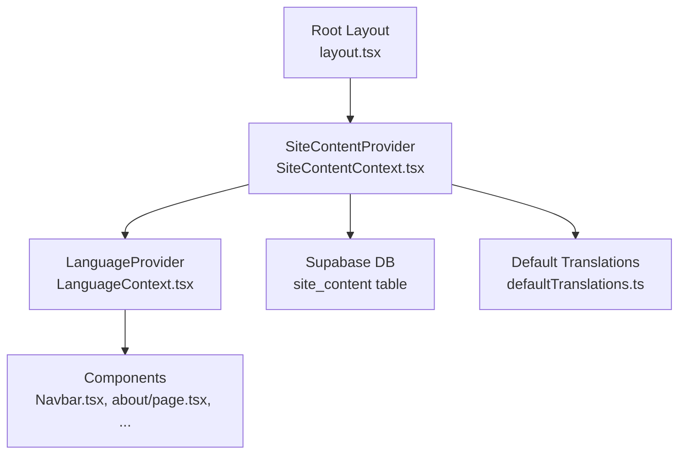
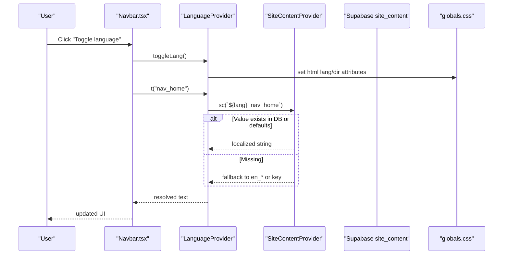
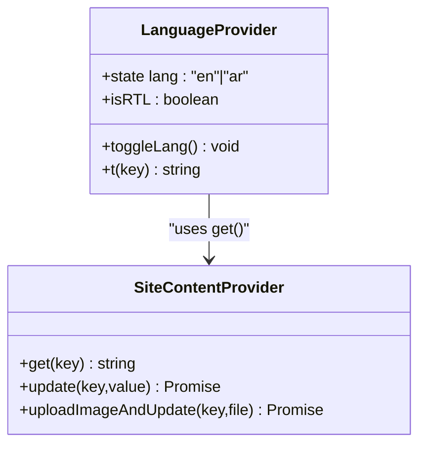
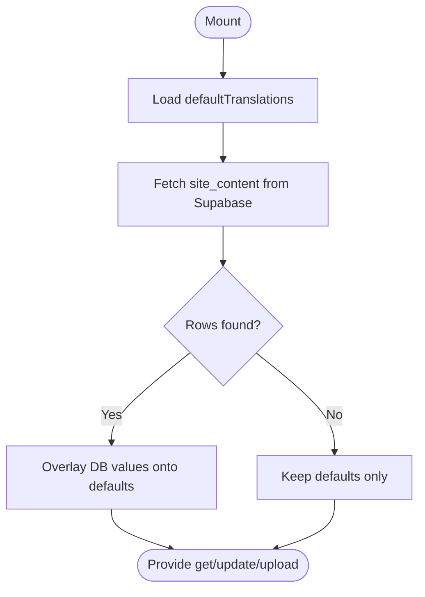
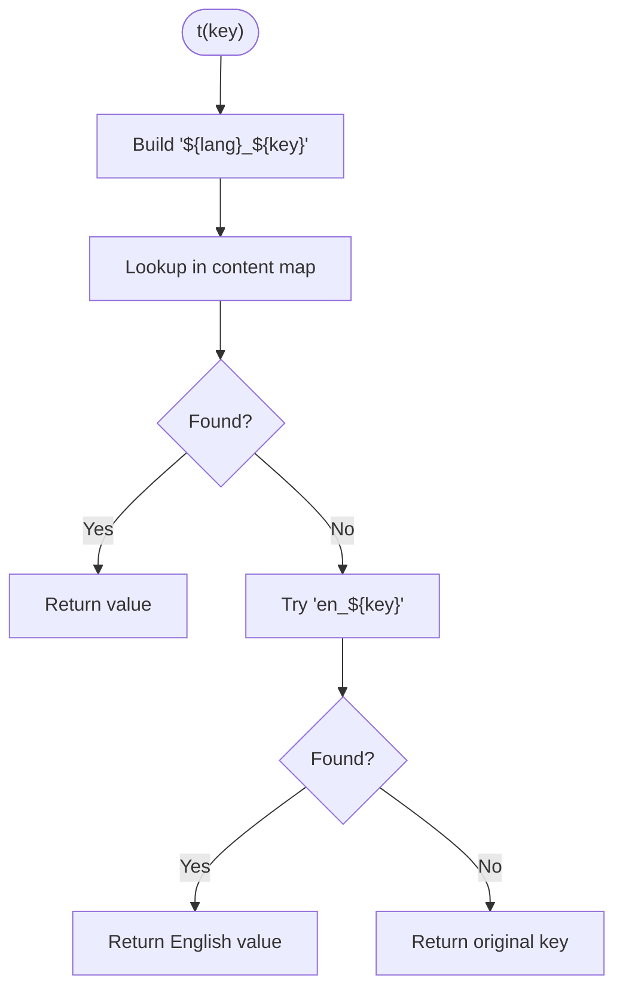
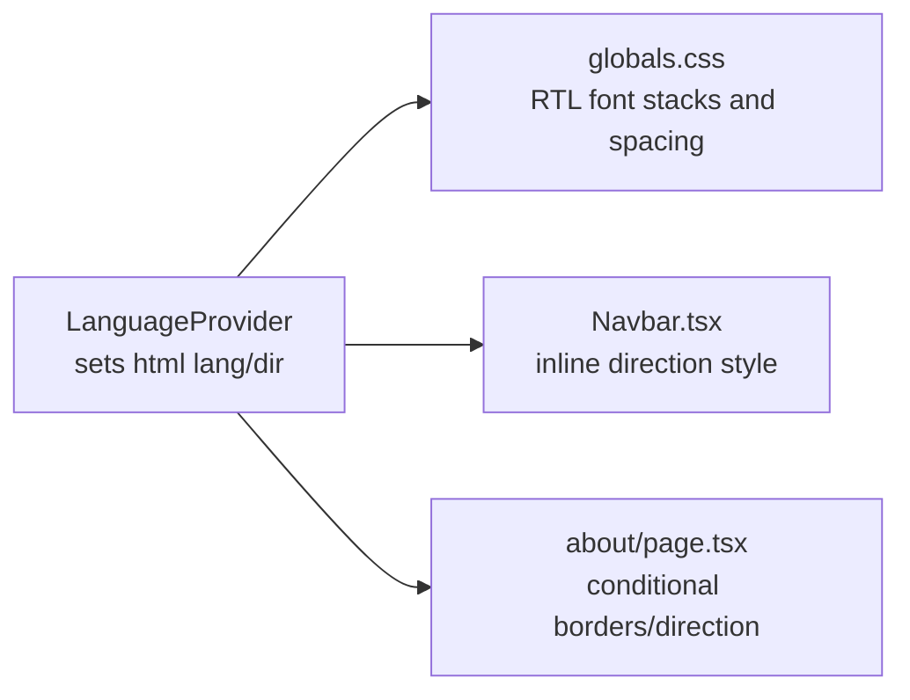
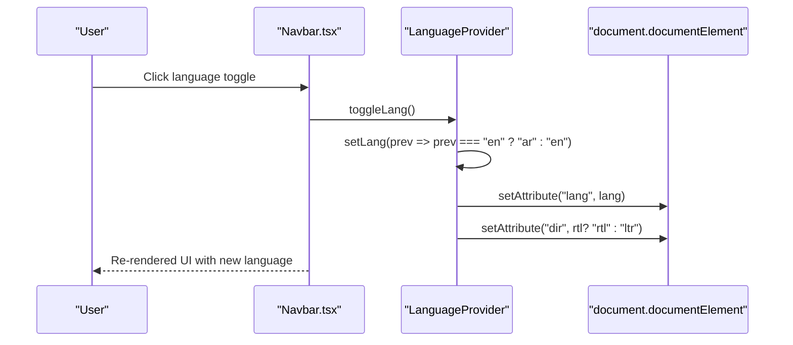
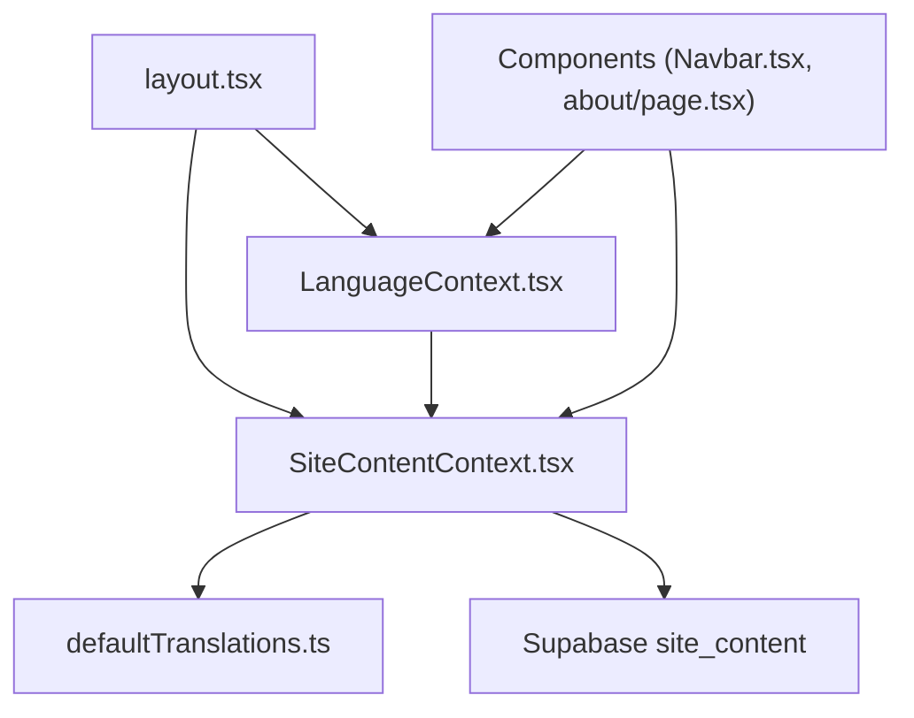

# Internationalization & Localization

<cite>
**Referenced Files in This Document**
- [LanguageContext.tsx](file://app/context/LanguageContext.tsx)
- [SiteContentContext.tsx](file://app/context/SiteContentContext.tsx)
- [defaultTranslations.ts](file://app/context/defaultTranslations.ts)
- [layout.tsx](file://app/layout.tsx)
- [globals.css](file://app/globals.css)
- [Navbar.tsx](file://components/Navbar.tsx)
- [about/page.tsx](file://app/about/page.tsx)
</cite>

## Table of Contents
1. [Introduction](#introduction)
2. [Project Structure](#project-structure)
3. [Core Components](#core-components)
4. [Architecture Overview](#architecture-overview)
5. [Detailed Component Analysis](#detailed-component-analysis)
6. [Dependency Analysis](#dependency-analysis)
7. [Performance Considerations](#performance-considerations)
8. [Troubleshooting Guide](#troubleshooting-guide)
9. [Conclusion](#conclusion)
10. [Appendices](#appendices)

## Introduction
This document explains the Internationalization and Localization (i18n/l10n) system implemented for English and Arabic with full RTL support. It covers:
- Bilingual content management via a centralized translation key system
- Dynamic language switching and automatic RTL layout adaptation
- Translation file structure and fallback behavior
- Provider architecture and how components consume translations
- Practical guidance for adding new languages, localizing dynamic content, and handling RTL-specific styling
- Cultural adaptations including fonts, accessibility, and considerations for date/time and number formatting

## Project Structure
The i18n system is centered around two providers:
- SiteContentProvider: loads site-wide text from defaults and Supabase, exposing a get/update API
- LanguageProvider: manages current language, toggles it, sets HTML attributes for lang/dir, and exposes a t() helper that resolves localized strings

**Diagram sources**
- [layout.tsx:62-78](file://app/layout.tsx#L62-L78)
- [SiteContentContext.tsx:22-48](file://app/context/SiteContentContext.tsx#L22-L48)
- [LanguageContext.tsx:17-51](file://app/context/LanguageContext.tsx#L17-L51)
- [defaultTranslations.ts:1-20](file://app/context/defaultTranslations.ts#L1-L20)

**Section sources**
- [layout.tsx:62-78](file://app/layout.tsx#L62-L78)
- [SiteContentContext.tsx:22-48](file://app/context/SiteContentContext.tsx#L22-L48)
- [LanguageContext.tsx:17-51](file://app/context/LanguageContext.tsx#L17-L51)
- [defaultTranslations.ts:1-20](file://app/context/defaultTranslations.ts#L1-L20)

## Core Components
- LanguageProvider
  - Manages current language state and exposes toggleLang(), t(key), and isRTL flag
  - Syncs <html lang> and <html dir> on language change to enable global RTL/LTR behavior
- SiteContentProvider
  - Initializes content map from defaultTranslations
  - Fetches overrides from Supabase site_content table and merges them into the map
  - Provides get(key), update(key, value), and uploadImageAndUpdate(key, file)
- Default Translations
  - Centralized dictionary of all UI strings with en_ and ar_ prefixed keys
  - Serves as the source of truth and fallback when database values are missing

Key responsibilities:
- Language switching updates both React state and DOM attributes for instant UI reflow
- Translation resolution uses a predictable naming convention and falls back gracefully
- Content editing is supported through the dashboard using the same provider APIs

**Section sources**
- [LanguageContext.tsx:17-51](file://app/context/LanguageContext.tsx#L17-L51)
- [SiteContentContext.tsx:22-96](file://app/context/SiteContentContext.tsx#L22-L96)
- [defaultTranslations.ts:1-20](file://app/context/defaultTranslations.ts#L1-L20)

## Architecture Overview
The runtime flow for rendering localized content:

**Diagram sources**
- [Navbar.tsx:88-96](file://components/Navbar.tsx#L88-L96)
- [LanguageContext.tsx:22-44](file://app/context/LanguageContext.tsx#L22-L44)
- [SiteContentContext.tsx:27-54](file://app/context/SiteContentContext.tsx#L27-L54)
- [globals.css:37-47](file://app/globals.css#L37-L47)

## Detailed Component Analysis

### LanguageProvider
Responsibilities:
- Maintain current language ("en" | "ar")
- Provide isRTL boolean derived from current language
- Expose toggleLang() to switch between languages
- Expose t(key) to resolve localized strings by constructing `${lang}_${key}` and falling back to English or the key itself
- Update <html lang> and <html dir> to reflect current language globally

Implementation highlights:
- Uses a client-side effect to sync HTML attributes whenever lang changes
- Resolves translations via SiteContentProvider’s get function
- Provides a typed hook useLanguage() for safe consumption

**Diagram sources**
- [LanguageContext.tsx:17-51](file://app/context/LanguageContext.tsx#L17-L51)
- [SiteContentContext.tsx:22-96](file://app/context/SiteContentContext.tsx#L22-L96)

**Section sources**
- [LanguageContext.tsx:17-51](file://app/context/LanguageContext.tsx#L17-L51)

### SiteContentProvider
Responsibilities:
- Initialize content map from defaultTranslations
- Fetch site_content rows from Supabase and merge into the map
- Provide get(key) with fallback to defaults
- Support updating text and image URLs via update() and uploadImageAndUpdate()

Data flow:
- On mount, fetches all site_content entries and overlays them onto defaults
- get(key) returns the live value if present, otherwise the default, otherwise empty string

**Diagram sources**
- [SiteContentContext.tsx:22-48](file://app/context/SiteContentContext.tsx#L22-L48)
- [SiteContentContext.tsx:50-69](file://app/context/SiteContentContext.tsx#L50-L69)
- [SiteContentContext.tsx:71-96](file://app/context/SiteContentContext.tsx#L71-L96)
- [defaultTranslations.ts:1-20](file://app/context/defaultTranslations.ts#L1-L20)

**Section sources**
- [SiteContentContext.tsx:22-96](file://app/context/SiteContentContext.tsx#L22-L96)

### Translation Key Management and Fallback
Key conventions:
- Keys follow a consistent pattern: ${lang}_${section}_${element}, e.g., en_nav_home, ar_nav_home
- The t(key) helper constructs the full key based on current language and resolves via SiteContentProvider
- Fallback order: current language → English → original key

**Diagram sources**
- [LanguageContext.tsx:32-44](file://app/context/LanguageContext.tsx#L32-L44)
- [SiteContentContext.tsx:50-54](file://app/context/SiteContentContext.tsx#L50-L54)
- [defaultTranslations.ts:1-20](file://app/context/defaultTranslations.ts#L1-L20)

**Section sources**
- [LanguageContext.tsx:32-44](file://app/context/LanguageContext.tsx#L32-L44)
- [SiteContentContext.tsx:50-54](file://app/context/SiteContentContext.tsx#L50-L54)
- [defaultTranslations.ts:1-20](file://app/context/defaultTranslations.ts#L1-L20)

### RTL Layout Adaptation
Global adaptation:
- LanguageProvider sets <html lang="ar"> and <html dir="rtl"> when Arabic is active
- globals.css defines font stacks and letter-spacing adjustments for RTL contexts
- Components can also apply inline direction styles where needed (e.g., Navbar, About page)

**Diagram sources**
- [LanguageContext.tsx:22-26](file://app/context/LanguageContext.tsx#L22-L26)
- [globals.css:37-47](file://app/globals.css#L37-L47)
- [Navbar.tsx:58](file://components/Navbar.tsx#L58)
- [about/page.tsx:141-146](file://app/about/page.tsx#L141-L146)

**Section sources**
- [LanguageContext.tsx:22-26](file://app/context/LanguageContext.tsx#L22-L26)
- [globals.css:37-47](file://app/globals.css#L37-L47)
- [Navbar.tsx:58](file://components/Navbar.tsx#L58)
- [about/page.tsx:141-146](file://app/about/page.tsx#L141-L146)

### Language Switching Mechanism
- The Navbar includes a language toggle button that calls toggleLang()
- Upon toggle, LanguageProvider updates state and triggers an effect to refresh HTML attributes
- All components consuming useLanguage() immediately reflect the new language and direction

**Diagram sources**
- [Navbar.tsx:88-96](file://components/Navbar.tsx#L88-L96)
- [LanguageContext.tsx:28-30](file://app/context/LanguageContext.tsx#L28-L30)
- [LanguageContext.tsx:22-26](file://app/context/LanguageContext.tsx#L22-L26)

**Section sources**
- [Navbar.tsx:88-96](file://components/Navbar.tsx#L88-L96)
- [LanguageContext.tsx:28-30](file://app/context/LanguageContext.tsx#L28-L30)
- [LanguageContext.tsx:22-26](file://app/context/LanguageContext.tsx#L22-L26)

### Dynamic Content Localization Examples
- Static UI strings: Use t("nav_home"), t("hero_title_1"), etc., across components
- Conditional bilingual content: Pages like About can render different blocks based on lang
- Image localization: Keys such as hero_image, cat1_image, etc., allow swapping assets per locale

Practical references:
- Navbar uses t() for navigation labels and the language toggle label
- About page conditionally renders brandStatement[lang] and applies RTL-aware styling

**Section sources**
- [Navbar.tsx:25-33](file://components/Navbar.tsx#L25-L33)
- [Navbar.tsx:88-96](file://components/Navbar.tsx#L88-L96)
- [about/page.tsx:136-150](file://app/about/page.tsx#L136-L150)
- [defaultTranslations.ts:483-493](file://app/context/defaultTranslations.ts#L483-L493)

### Adding a New Language
Steps to add a new language (e.g., French):
1. Extend the Lang type to include the new code
2. Add fr_ prefixed keys to defaultTranslations.ts for all existing keys
3. Ensure SiteContentProvider can persist and retrieve fr_ keys from Supabase
4. Optionally adjust font loading in layout.tsx for appropriate scripts
5. Update any hardcoded language checks (e.g., toggle logic) to handle the new option

References:
- Lang type definition
- Toggle logic
- Font declarations in root layout

**Section sources**
- [LanguageContext.tsx:6](file://app/context/LanguageContext.tsx#L6)
- [LanguageContext.tsx:28-30](file://app/context/LanguageContext.tsx#L28-L30)
- [layout.tsx:13-43](file://app/layout.tsx#L13-L43)
- [defaultTranslations.ts:1-20](file://app/context/defaultTranslations.ts#L1-L20)

### Handling RTL-Specific Styling Considerations
Guidelines:
- Prefer logical properties (start/end) over physical ones (left/right) where possible
- Use direction-aware conditional styles when necessary (as seen in Navbar and About)
- Leverage globals.css rules that automatically swap fonts and spacing for RTL
- Avoid hard-coded absolute positioning that breaks in RTL; prefer flex/grid and margin/padding

References:
- Global RTL font stack and spacing normalization
- Inline direction usage in Navbar and About

**Section sources**
- [globals.css:37-47](file://app/globals.css#L37-L47)
- [Navbar.tsx:58](file://components/Navbar.tsx#L58)
- [about/page.tsx:141-146](file://app/about/page.tsx#L141-L146)

### Cultural Adaptations, Date/Time, and Number Formatting
Current implementation:
- Fonts adapt to Arabic via RTL selectors
- No built-in date/time or number formatting utilities are present in the analyzed files

Recommendations:
- Introduce Intl.DateTimeFormat and Intl.NumberFormat for locale-aware formatting
- Store user preference for currency and calendar formats alongside language
- Validate that numeric inputs and outputs respect locale conventions

[No sources needed since this section provides general guidance]

### Accessibility Requirements for Different Locales
- Ensure aria-labels and titles are localized (e.g., language toggle title)
- Maintain proper heading hierarchy and semantic markup regardless of language
- Confirm sufficient color contrast and readable typography in both LTR and RTL modes
- Verify screen reader behavior with RTL text and mixed-direction content

**Section sources**
- [Navbar.tsx:88-96](file://components/Navbar.tsx#L88-L96)

## Dependency Analysis
High-level dependencies among i18n-related modules:

**Diagram sources**
- [layout.tsx:62-78](file://app/layout.tsx#L62-L78)
- [SiteContentContext.tsx:22-48](file://app/context/SiteContentContext.tsx#L22-L48)
- [LanguageContext.tsx:17-51](file://app/context/LanguageContext.tsx#L17-L51)
- [defaultTranslations.ts:1-20](file://app/context/defaultTranslations.ts#L1-L20)

**Section sources**
- [layout.tsx:62-78](file://app/layout.tsx#L62-L78)
- [SiteContentContext.tsx:22-48](file://app/context/SiteContentContext.tsx#L22-L48)
- [LanguageContext.tsx:17-51](file://app/context/LanguageContext.tsx#L17-L51)
- [defaultTranslations.ts:1-20](file://app/context/defaultTranslations.ts#L1-L20)

## Performance Considerations
- Translation lookup is O(1) due to object key access
- Initial load merges defaults with DB data once; subsequent reads are fast
- Avoid excessive re-renders by memoizing callbacks (already used in LanguageProvider and SiteContentProvider)
- For large translation sets, consider lazy-loading non-critical sections or splitting dictionaries by route

[No sources needed since this section provides general guidance]

## Troubleshooting Guide
Common issues and resolutions:
- Missing translations:
  - Verify the key exists in defaultTranslations.ts with the correct prefix
  - Check Supabase site_content for overrides
- Language not switching:
  - Ensure LanguageProvider wraps your component tree
  - Confirm HTML lang/dir attributes are being set
- RTL misalignment:
  - Check for hardcoded left/right margins/paddings; prefer start/end or conditional styles
  - Review globals.css RTL selectors and ensure no overriding styles break directionality
- Fonts not applying in Arabic:
  - Confirm Arabic subsets are loaded in layout.tsx and that RTL selectors target the correct elements

**Section sources**
- [LanguageContext.tsx:22-26](file://app/context/LanguageContext.tsx#L22-L26)
- [SiteContentContext.tsx:27-54](file://app/context/SiteContentContext.tsx#L27-L54)
- [defaultTranslations.ts:1-20](file://app/context/defaultTranslations.ts#L1-L20)
- [globals.css:37-47](file://app/globals.css#L37-L47)
- [layout.tsx:25-43](file://app/layout.tsx#L25-L43)

## Conclusion
The i18n/l10n system provides a robust foundation for bilingual English/Arabic support with automatic RTL adaptation. It centralizes translation keys, offers a simple t() API, and integrates with Supabase for live content updates. By following the provided patterns and recommendations, teams can extend to additional languages, localize dynamic content, and maintain high-quality UX across locales.

[No sources needed since this section summarizes without analyzing specific files]

## Appendices

### Quick Reference: Using the System
- Consume language context:
  - Use the provided hook to access lang, isRTL, toggleLang, and t
- Localize static text:
  - Call t("nav_home"), t("hero_subtitle"), etc.
- Localize images:
  - Use keys like hero_image, cat1_image from the translation map
- Edit content:
  - Use the dashboard editor to update site_content entries

**Section sources**
- [Navbar.tsx:25-33](file://components/Navbar.tsx#L25-L33)
- [Navbar.tsx:88-96](file://components/Navbar.tsx#L88-L96)
- [defaultTranslations.ts:483-493](file://app/context/defaultTranslations.ts#L483-L493)