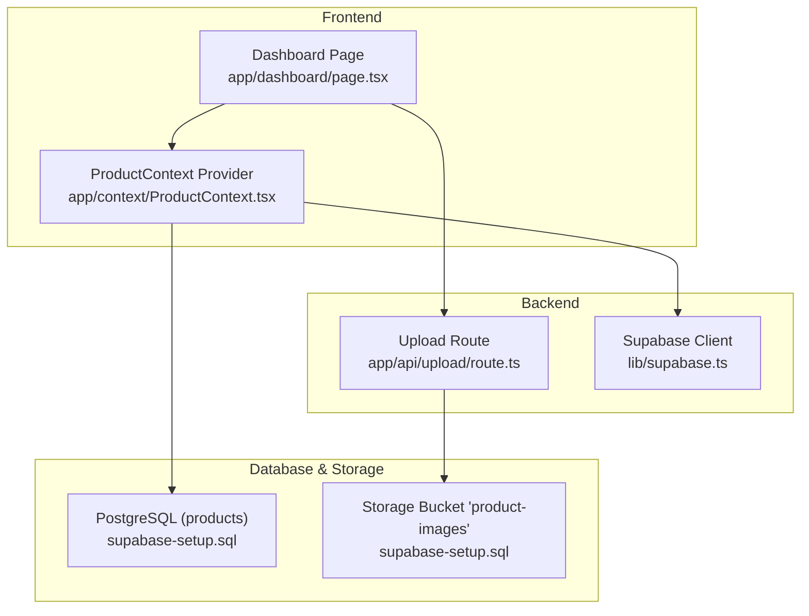
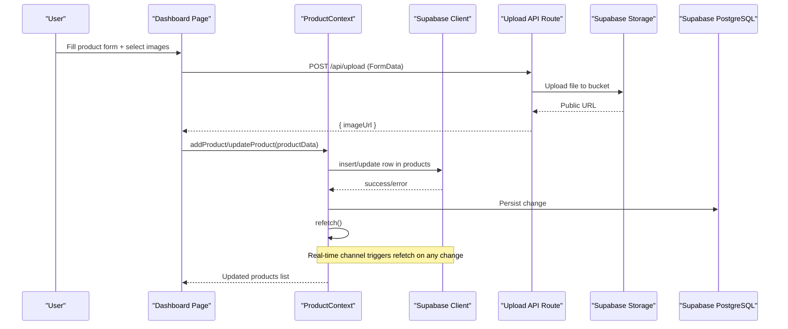
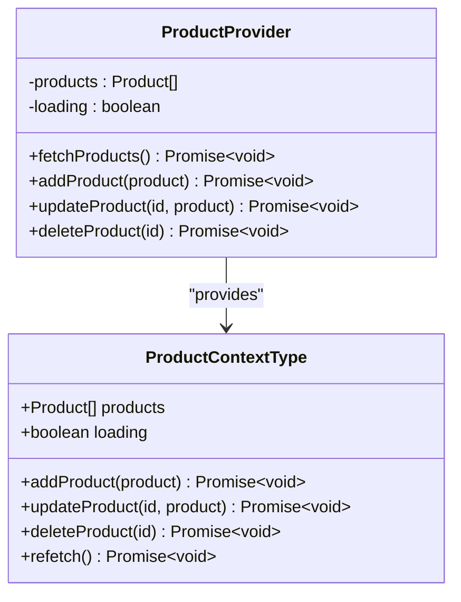
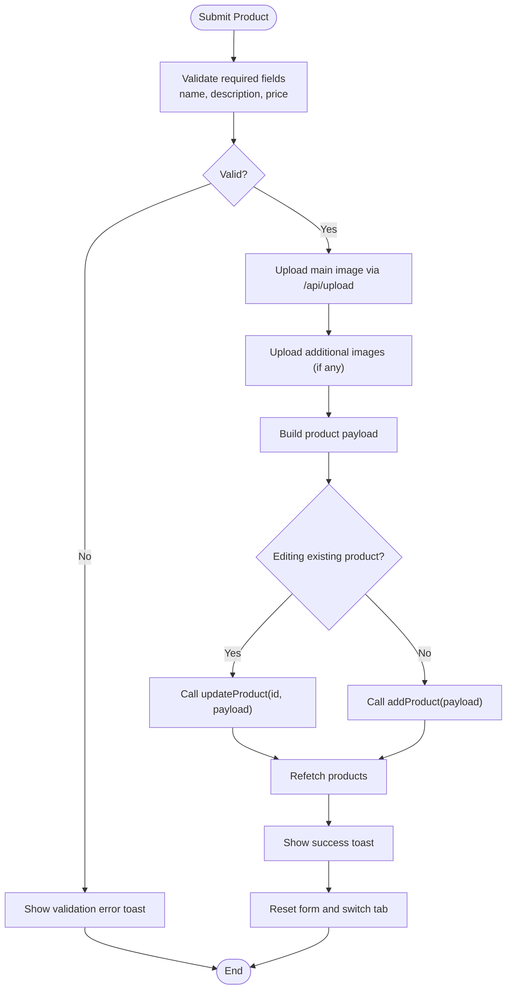
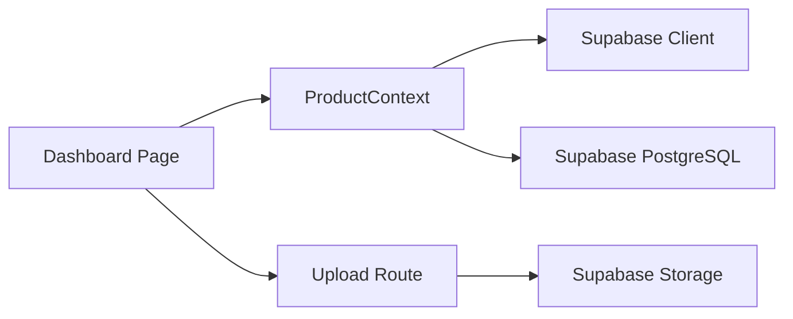

# Product CRUD Operations

<cite>
**Referenced Files in This Document**
- [ProductContext.tsx](file://app/context/ProductContext.tsx)
- [page.tsx](file://app/dashboard/page.tsx)
- [supabase.ts](file://lib/supabase.ts)
- [route.ts](file://app/api/upload/route.ts)
- [supabase-setup.sql](file://supabase-setup.sql)
</cite>

## Table of Contents
1. [Introduction](#introduction)
2. [Project Structure](#project-structure)
3. [Core Components](#core-components)
4. [Architecture Overview](#architecture-overview)
5. [Detailed Component Analysis](#detailed-component-analysis)
6. [Dependency Analysis](#dependency-analysis)
7. [Performance Considerations](#performance-considerations)
8. [Troubleshooting Guide](#troubleshooting-guide)
9. [Conclusion](#conclusion)
10. [Appendices](#appendices)

## Introduction
This document explains the end-to-end Product Create, Read, Update, and Delete (CRUD) operations for the perfume store application. It focuses on:
- The ProductContext provider methods addProduct, updateProduct, deleteProduct, including parameters and error handling
- The dashboard interface for product management, form validation, image upload integration, and real-time synchronization
- Practical examples for adding new products, editing existing ones, bulk operations, and handling database constraints
- Data validation rules, error boundaries, and user feedback mechanisms

The implementation uses Supabase for data persistence and storage, with a Next.js App Router API route to handle uploads securely.

## Project Structure
Key files involved in product CRUD:
- app/context/ProductContext.tsx: Provides global product state and CRUD methods
- app/dashboard/page.tsx: Dashboard UI for creating/editing/deleting products, managing images, and viewing all products
- lib/supabase.ts: Supabase client configuration and storage bucket name
- app/api/upload/route.ts: Server-side file upload endpoint to Supabase Storage
- supabase-setup.sql: Database schema, RLS policies, and migration for additional columns

**Diagram sources**
- [page.tsx:1-1200](file://app/dashboard/page.tsx#L1-L1200)
- [ProductContext.tsx:1-116](file://app/context/ProductContext.tsx#L1-L116)
- [supabase.ts:1-46](file://lib/supabase.ts#L1-L46)
- [route.ts:1-67](file://app/api/upload/route.ts#L1-L67)
- [supabase-setup.sql:1-137](file://supabase-setup.sql#L1-L137)

**Section sources**
- [ProductContext.tsx:1-116](file://app/context/ProductContext.tsx#L1-L116)
- [page.tsx:1-1200](file://app/dashboard/page.tsx#L1-L1200)
- [supabase.ts:1-46](file://lib/supabase.ts#L1-L46)
- [route.ts:1-67](file://app/api/upload/route.ts#L1-L67)
- [supabase-setup.sql:1-137](file://supabase-setup.sql#L1-L137)

## Core Components
- ProductContext Provider exposes:
  - State: products list and loading flag
  - Methods: addProduct, updateProduct, deleteProduct, refetch
  - Real-time subscription to the products table to keep UI in sync
- Dashboard Page provides:
  - Form fields for product creation/editing
  - Image upload flow via server route
  - Validation and user feedback
  - Product listing with edit/delete actions

**Section sources**
- [ProductContext.tsx:34-116](file://app/context/ProductContext.tsx#L34-L116)
- [page.tsx:11-233](file://app/dashboard/page.tsx#L11-L233)

## Architecture Overview
The product lifecycle flows through these steps:
- Add/Edit: Dashboard collects form data, uploads images via /api/upload, then calls Context methods to persist changes
- Read: Context fetches products from Supabase and subscribes to real-time changes
- Update/Delete: Context updates or removes records and refreshes the local list

**Diagram sources**
- [page.tsx:152-233](file://app/dashboard/page.tsx#L152-L233)
- [ProductContext.tsx:49-100](file://app/context/ProductContext.tsx#L49-L100)
- [route.ts:4-66](file://app/api/upload/route.ts#L4-L66)
- [supabase.ts:41-46](file://lib/supabase.ts#L41-L46)

## Detailed Component Analysis

### ProductContext Provider
Responsibilities:
- Fetch products ordered by created_at descending
- Subscribe to postgres_changes on the products table to auto-refresh
- Provide addProduct, updateProduct, deleteProduct, and refetch

Method details:
- addProduct(product): Inserts a new product; throws on error; refetches after success
- updateProduct(id, partialProduct): Updates fields by id; throws on error; refetches after success
- deleteProduct(id): Deletes by id; throws on error; refetches after success
- refetch(): Re-fetches products list

Error handling:
- Errors thrown by Supabase are re-thrown to callers for UI-level handling
- Console logs errors during fetch

Real-time synchronization:
- Subscribes to all events on public.products; triggers refetch on any change

Complexity:
- Each method performs one network call plus a refetch; O(1) per operation, O(n) for refetch where n is number of products

**Diagram sources**
- [ProductContext.tsx:34-116](file://app/context/ProductContext.tsx#L34-L116)

**Section sources**
- [ProductContext.tsx:45-109](file://app/context/ProductContext.tsx#L45-L109)

### Dashboard Page — Product Management UI
Responsibilities:
- Manage form state for product fields, sizes, gallery images, video URL
- Validate inputs before submission
- Upload main image and additional images via server route
- Call Context methods to create/update/delete products
- Display toast notifications and progress indicators
- Render product listing with Edit and Delete actions

Form validation rules:
- Required: name, description, price
- Main image required only when adding a new product; optional when editing if an image already exists
- Gender must be one of men, women, unisex
- Price must be positive (enforced by DB check constraint)
- Optional fields: badge, category, notes, longevity, sillage, sizes, images[], video_url

Image upload integration:
- Main image uploaded first; returns public URL used in product record
- Additional images uploaded sequentially; appended to existing gallery images
- Progress messages shown during upload phases

Real-time synchronization:
- After successful mutation, refetch is triggered automatically by the context’s real-time subscription

User feedback:
- Toast messages for success and error states
- Disabled submit button while submitting
- Upload progress banner

Practical examples:
- Adding a new product: fill required fields, select main image, optionally add gallery images and video URL, submit
- Editing an existing product: click Edit in the products table, modify fields, optionally replace main image or append gallery images, submit
- Deleting a product: click Delete in the products table; confirm action implicitly handled by the UI flow

Bulk operations:
- Not implemented in the current UI; can be added by iterating over selected rows and calling deleteProduct or updateProduct in sequence

Handling database constraints:
- Positive price enforced by DB check constraint; invalid values will cause server-side errors surfaced to the UI
- Gender constrained to specific values; invalid values will fail at DB level

**Diagram sources**
- [page.tsx:152-233](file://app/dashboard/page.tsx#L152-L233)
- [route.ts:4-66](file://app/api/upload/route.ts#L4-L66)
- [ProductContext.tsx:84-100](file://app/context/ProductContext.tsx#L84-L100)

**Section sources**
- [page.tsx:11-233](file://app/dashboard/page.tsx#L11-L233)
- [page.tsx:912-1004](file://app/dashboard/page.tsx#L912-L1004)

### Database Schema and Constraints
Key points:
- products table includes core fields and extended fields for fragrance attributes
- Check constraints enforce positive price and valid gender values
- Row Level Security policies allow public read/insert/delete for demo purposes
- Migration adds optional columns like sizes (JSONB), images (text array), video_url, badge, category, notes, longevity, sillage, gender

Operational implications:
- Insert/update operations must respect constraints; otherwise, Supabase will return errors that bubble up to the UI
- Using JSONB for sizes allows flexible variant definitions
- Using text array for images supports multiple gallery images

**Section sources**
- [supabase-setup.sql:7-56](file://supabase-setup.sql#L7-L56)

### Upload API Route
Responsibilities:
- Accept FormData with file and fileName
- Upload to Supabase Storage bucket "product-images"
- Return public URL for use in product records

Error handling:
- Returns 400 if missing file or fileName
- Returns 500 with error message on upload failure
- Logs internal errors

Security considerations:
- Uses environment variables for credentials with fallbacks for development
- For production, consider stricter access controls and CORS settings

**Section sources**
- [route.ts:4-66](file://app/api/upload/route.ts#L4-L66)

## Dependency Analysis
Component relationships:
- Dashboard depends on ProductContext for state and mutations
- ProductContext depends on Supabase client for queries and subscriptions
- Dashboard depends on Upload API route for secure file uploads
- Upload API route depends on Supabase Storage
- Database schema defines constraints and structure

**Diagram sources**
- [page.tsx:1-1200](file://app/dashboard/page.tsx#L1-L1200)
- [ProductContext.tsx:1-116](file://app/context/ProductContext.tsx#L1-L116)
- [route.ts:1-67](file://app/api/upload/route.ts#L1-L67)
- [supabase.ts:1-46](file://lib/supabase.ts#L1-L46)

**Section sources**
- [page.tsx:1-1200](file://app/dashboard/page.tsx#L1-L1200)
- [ProductContext.tsx:1-116](file://app/context/ProductContext.tsx#L1-L116)
- [route.ts:1-67](file://app/api/upload/route.ts#L1-L67)
- [supabase.ts:1-46](file://lib/supabase.ts#L1-L46)

## Performance Considerations
- Real-time subscription ensures instant UI updates without manual polling
- Refetch after each mutation keeps local state consistent
- Uploading additional images sequentially avoids large concurrent requests but may increase total time; consider batching if needed
- Avoid unnecessary re-renders by memoizing callbacks where appropriate
- Use pagination for large product lists to reduce initial load time

[No sources needed since this section provides general guidance]

## Troubleshooting Guide
Common issues and resolutions:
- Missing environment variables:
  - Symptom: Connection status shows missing config or placeholder warnings
  - Resolution: Ensure NEXT_PUBLIC_SUPABASE_URL and NEXT_PUBLIC_SUPABASE_ANON_KEY are set in .env.local and restart dev server
- Upload failures:
  - Symptom: Error toast indicating upload failed
  - Resolution: Verify bucket "product-images" exists and is public; check server logs for detailed error messages
- Database constraint violations:
  - Symptom: Save fails with error about price or gender
  - Resolution: Ensure price > 0 and gender is one of men, women, unisex
- Real-time not updating:
  - Symptom: Changes do not reflect immediately
  - Resolution: Confirm RLS policies allow changes and that the channel is subscribed; check browser console for errors

**Section sources**
- [page.tsx:20-36](file://app/dashboard/page.tsx#L20-L36)
- [supabase.ts:27-39](file://lib/supabase.ts#L27-L39)
- [route.ts:43-66](file://app/api/upload/route.ts#L43-L66)
- [supabase-setup.sql:17-33](file://supabase-setup.sql#L17-L33)

## Conclusion
The product CRUD system integrates a robust dashboard UI with a context-driven state layer and Supabase backend. It enforces data integrity via database constraints, provides real-time synchronization, and offers clear user feedback. The architecture is modular and extensible, allowing future enhancements such as bulk operations, advanced validation, and improved upload performance.

[No sources needed since this section summarizes without analyzing specific files]

## Appendices

### API Definitions
- POST /api/upload
  - Request: multipart/form-data with fields file and fileName
  - Response: { success: true, imageUrl: string }
  - Status codes: 200 on success, 400 on missing fields, 500 on server errors

**Section sources**
- [route.ts:4-66](file://app/api/upload/route.ts#L4-L66)

### Data Model Summary
- products table includes:
  - id (uuid PK), name (text), description (text), price (numeric), image_url (text), badge (text), created_at (timestamptz)
  - Extended fields: category, top_notes, heart_notes, base_notes, longevity, sillage, sizes (jsonb), images (text[]), video_url, gender (check constraint)

**Section sources**
- [supabase-setup.sql:7-56](file://supabase-setup.sql#L7-L56)