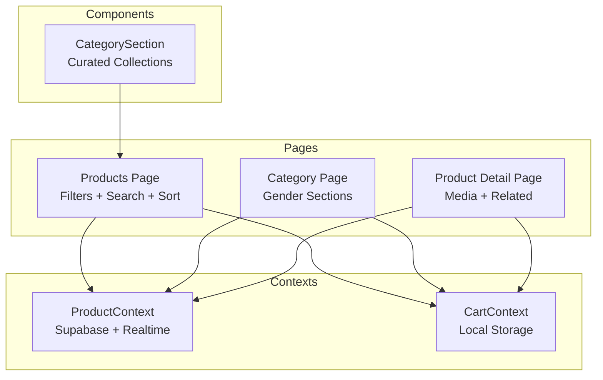
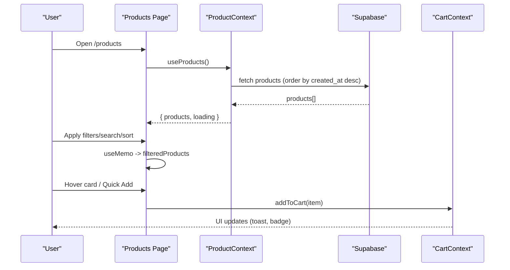
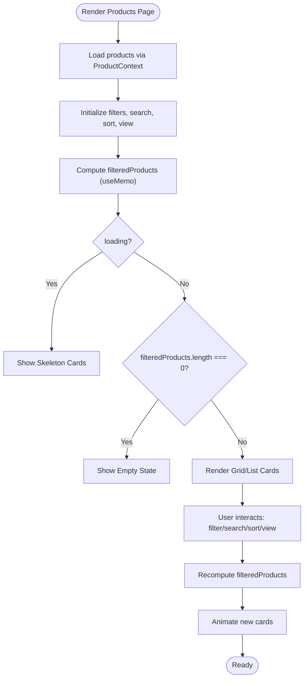
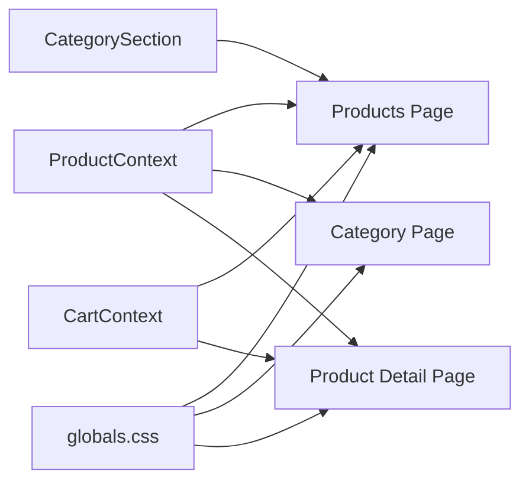

# Product Catalog & Browsing

<cite>
**Referenced Files in This Document**
- [products/page.tsx](file://app/products/page.tsx)
- [category/page.tsx](file://app/category/page.tsx)
- [CategorySection.tsx](file://components/CategorySection.tsx)
- [ProductContext.tsx](file://app/context/ProductContext.tsx)
- [CartContext.tsx](file://app/context/CartContext.tsx)
- [product/[id]/page.tsx](file://app/product/[id]/page.tsx)
- [globals.css](file://app/globals.css)
</cite>

## Table of Contents
1. [Introduction](#introduction)
2. [Project Structure](#project-structure)
3. [Core Components](#core-components)
4. [Architecture Overview](#architecture-overview)
5. [Detailed Component Analysis](#detailed-component-analysis)
6. [Dependency Analysis](#dependency-analysis)
7. [Performance Considerations](#performance-considerations)
8. [Troubleshooting Guide](#troubleshooting-guide)
9. [Conclusion](#conclusion)
10. [Appendices](#appendices)

## Introduction
This document explains the Product Catalog and Browsing system, focusing on how products are displayed in a responsive grid with filtering, search, sorting, and category-based organization. It also covers empty states, image loading strategies, and performance considerations for large catalogs. The implementation uses Next.js client components, React state and memoization, GSAP animations, and Supabase for product data.

## Project Structure
The catalog browsing experience spans several pages and shared contexts:
- Products listing page with filters, search, sort, and view toggles
- Category landing page organized by gender/collection sections
- CategorySection component used to navigate into curated collections
- Product detail page with related products and media
- Shared contexts for products and cart
- Global styles including responsive grids and utilities

**Diagram sources**
- [products/page.tsx:1-120](file://app/products/page.tsx#L1-L120)
- [category/page.tsx:1-120](file://app/category/page.tsx#L1-L120)
- [CategorySection.tsx:1-120](file://components/CategorySection.tsx#L1-L120)
- [ProductContext.tsx:1-116](file://app/context/ProductContext.tsx#L1-L116)
- [CartContext.tsx:1-104](file://app/context/CartContext.tsx#L1-L104)
- [product/[id]/page.tsx:1-120](file://app/product/[id]/page.tsx#L1-L120)

**Section sources**
- [products/page.tsx:1-120](file://app/products/page.tsx#L1-L120)
- [category/page.tsx:1-120](file://app/category/page.tsx#L1-L120)
- [CategorySection.tsx:1-120](file://components/CategorySection.tsx#L1-L120)
- [ProductContext.tsx:1-116](file://app/context/ProductContext.tsx#L1-L116)
- [CartContext.tsx:1-104](file://app/context/CartContext.tsx#L1-L104)
- [product/[id]/page.tsx:1-120](file://app/product/[id]/page.tsx#L1-L120)

## Core Components
- Products listing page: Provides a full-screen hero, sticky category pills, gender filter row, search input, sort dropdown, grid/list toggle, animated cards, and quick add-to-cart actions.
- Category page: Presents gender/collection sections with feature images and small product grids; includes scroll-triggered animations and “Shop All” links to the main listing.
- CategorySection: A horizontal interactive panel that highlights categories and navigates to filtered views.
- Product context: Fetches all products from Supabase, maintains loading state, and subscribes to real-time changes.
- Cart context: Manages cart items persisted to localStorage and provides helpers like isInCart.
- Product detail page: Displays product media, notes, size selection, quantity, and related products.

Key responsibilities:
- Data fetching and caching via ProductContext
- Client-side filtering, searching, and sorting
- Responsive layout and animations
- Quick add-to-cart interactions

**Section sources**
- [products/page.tsx:140-170](file://app/products/page.tsx#L140-L170)
- [category/page.tsx:200-220](file://app/category/page.tsx#L200-L220)
- [CategorySection.tsx:50-110](file://components/CategorySection.tsx#L50-L110)
- [ProductContext.tsx:45-82](file://app/context/ProductContext.tsx#L45-L82)
- [CartContext.tsx:28-96](file://app/context/CartContext.tsx#L28-L96)
- [product/[id]/page.tsx:40-74](file://app/product/[id]/page.tsx#L40-L74)

## Architecture Overview
The browsing flow is centered around client-side state and a centralized product dataset. Filtering and sorting happen locally using useMemo for performance. Cart operations integrate with a persistent cart context.

**Diagram sources**
- [products/page.tsx:140-170](file://app/products/page.tsx#L140-L170)
- [ProductContext.tsx:45-82](file://app/context/ProductContext.tsx#L45-L82)
- [CartContext.tsx:49-60](file://app/context/CartContext.tsx#L49-L60)

## Detailed Component Analysis

### Products Listing Page
Responsibilities:
- Hero section with stats and decorative visuals
- Sticky category pills and gender filter row
- Search input, sort dropdown, grid/list toggle, result count
- Animated product cards with hover effects and quick add
- Empty state when no results match filters

Filtering and sorting logic:
- Category filter matches product.category case-insensitively
- Gender filter defaults to unisex if missing
- Search matches name, description, or category
- Sorting supports default, price ascending/descending, and newest first
- View mode switches between CSS grid and list layout

Animations:
- Entrance animations for hero elements
- Staggered card entrance on filter changes
- Scroll-triggered batch animations for cards

Empty state:
- Centered message with icon and “Clear All Filters” action

Quick add:
- Adds item to cart without leaving the page
- Shows toast feedback

Responsive behavior:
- Grid adapts via minmax columns
- List view stacks vertically on mobile
- Hero thumbnails hidden on smaller screens

**Diagram sources**
- [products/page.tsx:140-170](file://app/products/page.tsx#L140-L170)
- [products/page.tsx:520-570](file://app/products/page.tsx#L520-L570)
- [products/page.tsx:116-140](file://app/products/page.tsx#L116-L140)

**Section sources**
- [products/page.tsx:16-36](file://app/products/page.tsx#L16-L36)
- [products/page.tsx:140-170](file://app/products/page.tsx#L140-L170)
- [products/page.tsx:520-570](file://app/products/page.tsx#L520-L570)
- [products/page.tsx:116-140](file://app/products/page.tsx#L116-L140)
- [products/page.tsx:575-903](file://app/products/page.tsx#L575-L903)
- [products/page.tsx:905-1004](file://app/products/page.tsx#L905-L1004)
- [products/page.tsx:1006-1033](file://app/products/page.tsx#L1006-L1033)

### Category Page
Responsibilities:
- Hero with navigation pills per gender/collection
- Multiple sections each featuring a large image and a 2x2 product grid
- Scroll-triggered animations for text, images, and product cards
- “Shop All” links route to the main products page with pre-applied filters

Data handling:
- Uses ProductContext to access products
- Filters products by gender or category keywords (e.g., Oriental/Oud)
- Limits display to four products per section

Empty state:
- Per-section empty state with guidance to add products

Responsive behavior:
- Section layout collapses to single column on tablet/mobile
- Feature image height adjusts

**Section sources**
- [category/page.tsx:17-66](file://app/category/page.tsx#L17-L66)
- [category/page.tsx:206-220](file://app/category/page.tsx#L206-L220)
- [category/page.tsx:294-356](file://app/category/page.tsx#L294-L356)
- [category/page.tsx:377-466](file://app/category/page.tsx#L377-L466)

### CategorySection Component
Responsibilities:
- Renders an interactive panel showcasing curated collections
- Dynamically selects images from site content context or fallbacks
- Navigates to the products page with query parameters for category

Interactions:
- Hover/click expands active panel and reveals details
- Vertical title visible when inactive
- Fully responsive layout with RTL support

**Section sources**
- [CategorySection.tsx:8-60](file://components/CategorySection.tsx#L8-L60)
- [CategorySection.tsx:62-106](file://components/CategorySection.tsx#L62-L106)
- [CategorySection.tsx:108-354](file://components/CategorySection.tsx#L108-L354)

### Product Context
Responsibilities:
- Fetches all products from Supabase ordered by creation date
- Maintains loading state
- Subscribes to real-time database changes to refresh listings automatically
- Exposes CRUD methods for admin usage

Complexity:
- O(n) fetch and set on load
- Real-time triggers re-fetch on any change

**Section sources**
- [ProductContext.tsx:45-82](file://app/context/ProductContext.tsx#L45-L82)
- [ProductContext.tsx:84-100](file://app/context/ProductContext.tsx#L84-L100)
- [ProductContext.tsx:111-116](file://app/context/ProductContext.tsx#L111-L116)

### Cart Context
Responsibilities:
- Persists cart items to localStorage
- Provides addToCart, removeFromCart, updateQty, clearCart, and isInCart
- Computes totalItems and totalPrice

Integration points:
- Used by listing and detail pages for quick add and cart status

**Section sources**
- [CartContext.tsx:28-96](file://app/context/CartContext.tsx#L28-L96)
- [CartContext.tsx:49-60](file://app/context/CartContext.tsx#L49-L60)
- [CartContext.tsx:82-88](file://app/context/CartContext.tsx#L82-L88)

### Product Detail Page
Responsibilities:
- Loads a single product and related products by category
- Displays media gallery, scent profile bars, size selector, quantity controls
- Integrates with cart context for adding items
- Includes tabbed content for notes, ritual, and story

Image handling:
- Tracks imageLoaded state to fade-in main image
- Gallery thumbnails switch selected image

**Section sources**
- [product/[id]/page.tsx:40-74](file://app/product/[id]/page.tsx#L40-L74)
- [product/[id]/page.tsx:308-377](file://app/product/[id]/page.tsx#L308-L377)
- [product/[id]/page.tsx:528-570](file://app/product/[id]/page.tsx#L528-L570)
- [product/[id]/page.tsx:624-691](file://app/product/[id]/page.tsx#L624-L691)

## Dependency Analysis
High-level relationships:
- Pages depend on ProductContext for data and CartContext for user actions
- CategorySection navigates to the products page with query params
- Product detail page queries Supabase directly for single product and related items
- Global styles provide responsive grids and utility classes

**Diagram sources**
- [ProductContext.tsx:45-82](file://app/context/ProductContext.tsx#L45-L82)
- [CartContext.tsx:28-96](file://app/context/CartContext.tsx#L28-L96)
- [products/page.tsx:1-120](file://app/products/page.tsx#L1-L120)
- [category/page.tsx:1-120](file://app/category/page.tsx#L1-L120)
- [product/[id]/page.tsx:1-120](file://app/product/[id]/page.tsx#L1-L120)
- [CategorySection.tsx:1-120](file://components/CategorySection.tsx#L1-L120)
- [globals.css:3281-3960](file://app/globals.css#L3281-L3960)

**Section sources**
- [ProductContext.tsx:45-82](file://app/context/ProductContext.tsx#L45-L82)
- [CartContext.tsx:28-96](file://app/context/CartContext.tsx#L28-L96)
- [products/page.tsx:1-120](file://app/products/page.tsx#L1-L120)
- [category/page.tsx:1-120](file://app/category/page.tsx#L1-L120)
- [product/[id]/page.tsx:1-120](file://app/product/[id]/page.tsx#L1-L120)
- [CategorySection.tsx:1-120](file://components/CategorySection.tsx#L1-L120)
- [globals.css:3281-3960](file://app/globals.css#L3281-L3960)

## Performance Considerations
Current optimizations:
- Client-side filtering and sorting computed with useMemo to avoid unnecessary recalculations
- GSAP ScrollTrigger batches card animations to reduce layout thrash
- Skeleton placeholders during loading improve perceived performance
- Local storage persistence for cart avoids repeated network calls

Recommendations for large catalogs:
- Implement pagination or infinite scrolling to limit DOM nodes
- Debounce search input to reduce recomputation frequency
- Virtualize long lists if switching to server-side pagination
- Preload hover images only on demand to reduce initial payload
- Use Next.js Image optimization for product images (size variants, lazy loading)
- Cache frequently accessed product metadata at the edge or browser level

[No sources needed since this section provides general guidance]

## Troubleshooting Guide
Common issues and resolutions:
- No products shown after filters applied: Ensure category and gender fields exist; verify search terms match stored strings; reset filters to confirm.
- Sorting not reflecting expected order: Confirm sort keys and compare functions; check created_at presence for “newest”.
- Images not swapping on hover: Verify alternate image exists and differs from primary; ensure hover state is updating.
- Cart not persisting across reloads: Confirm localStorage availability and hydration guard in CartContext.
- Animations jitter on filter change: Ensure refs are present and loading flag prevents early animation runs.

**Section sources**
- [products/page.tsx:140-170](file://app/products/page.tsx#L140-L170)
- [products/page.tsx:116-140](file://app/products/page.tsx#L116-L140)
- [CartContext.tsx:28-47](file://app/context/CartContext.tsx#L28-L47)

## Conclusion
The Product Catalog and Browsing system delivers a rich, interactive shopping experience with robust client-side filtering, search, and sorting. It leverages shared contexts for data and cart management, integrates animations for engagement, and provides responsive layouts across devices. For scaling to larger catalogs, consider pagination/infinite scroll, debounced search, and image optimization to maintain performance.

[No sources needed since this section summarizes without analyzing specific files]

## Appendices

### Responsive Design Patterns
- Grid layouts adapt via minmax and media queries
- List view stacks vertically on mobile
- Category panels stack vertically on smaller screens
- Hero thumbnails hide on narrow viewports

**Section sources**
- [products/page.tsx:505-523](file://app/products/page.tsx#L505-L523)
- [CategorySection.tsx:304-354](file://components/CategorySection.tsx#L304-L354)
- [globals.css:3464-3500](file://app/globals.css#L3464-L3500)
- [globals.css:3661-3676](file://app/globals.css#L3661-L3676)

### Image Loading Strategies
- Primary image always visible; hover image fades in when available
- Product detail tracks imageLoaded to fade-in main image
- Gallery thumbnails switch selected image with brief loading indicator

**Section sources**
- [products/page.tsx:593-659](file://app/products/page.tsx#L593-L659)
- [product/[id]/page.tsx:308-377](file://app/product/[id]/page.tsx#L308-L377)

### Custom Filters Example Pattern
To implement a custom filter:
- Add a new state variable for the filter value
- Extend the useMemo block to include the additional condition
- Update UI controls to modify the state
- Optionally animate cards on filter change

**Section sources**
- [products/page.tsx:140-170](file://app/products/page.tsx#L140-L170)
- [products/page.tsx:116-125](file://app/products/page.tsx#L116-L125)

### Pagination Strategy (Recommended)
- Replace full dataset rendering with page-based slices
- Maintain current page and pageSize in URL or state
- Trigger refetch or slice computation on page change
- Integrate with existing filters by applying them before slicing

[No sources needed since this section provides general guidance]