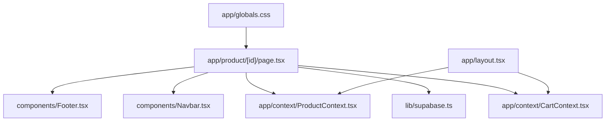
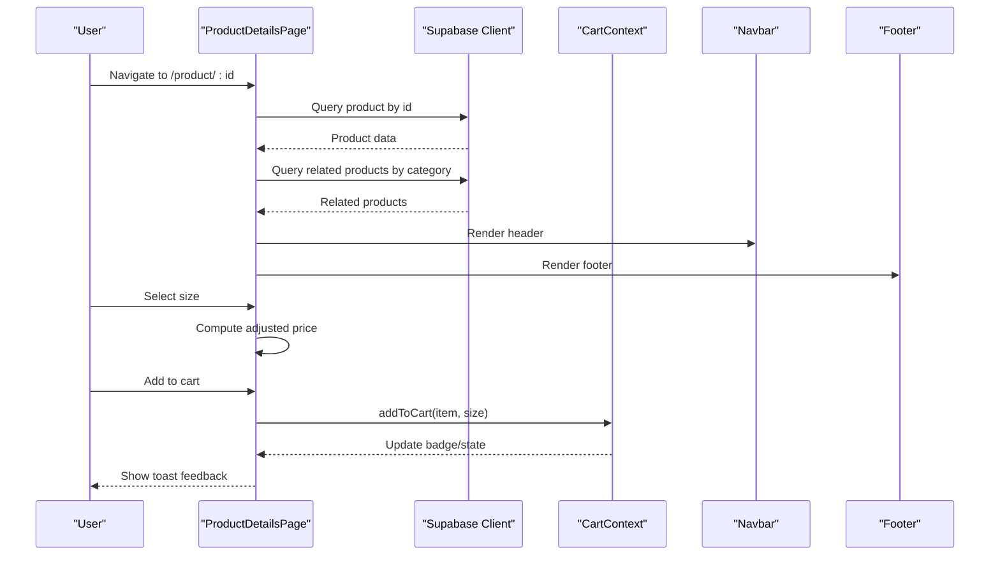
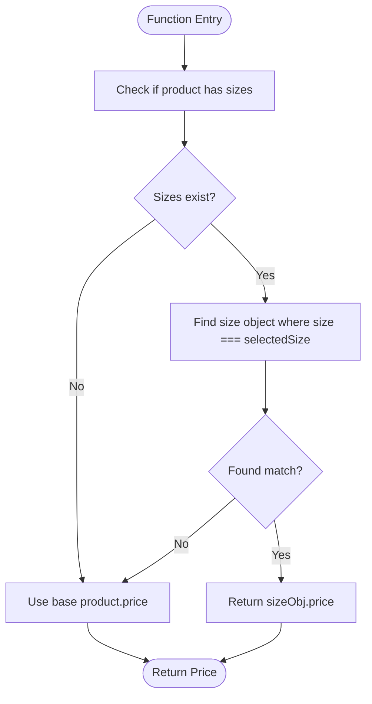
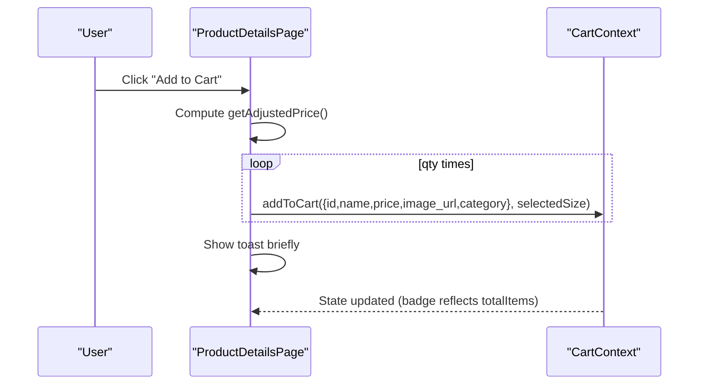
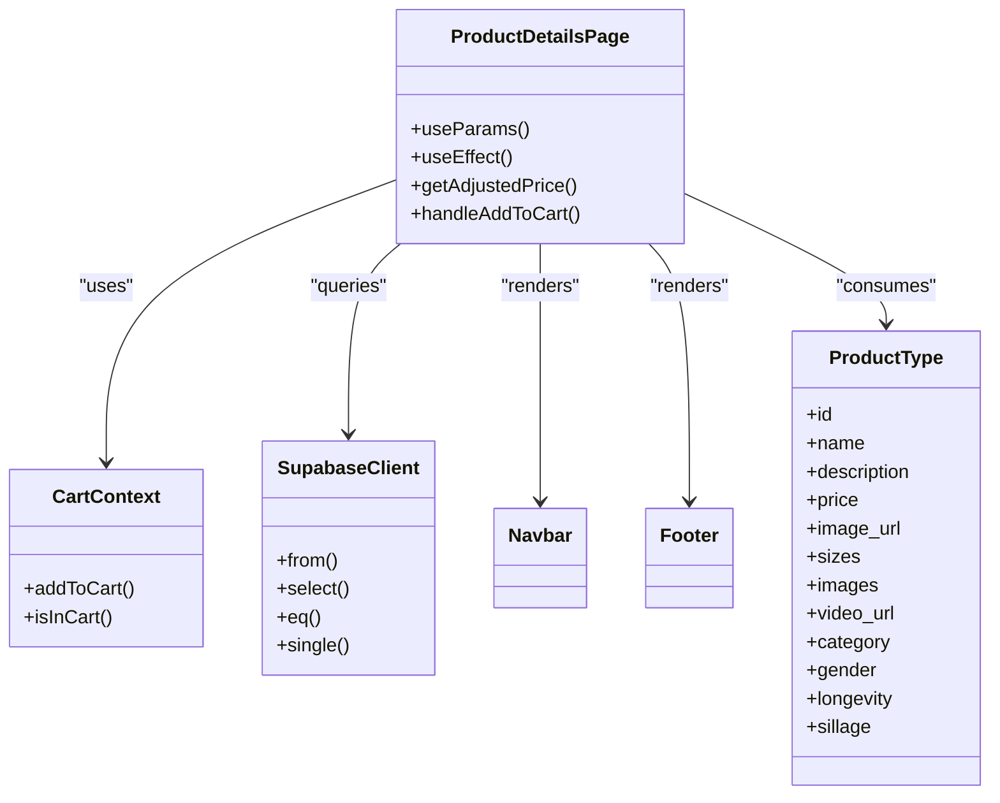

# Product Detail Pages

<cite>
**Referenced Files in This Document**
- [page.tsx](file://app/product/[id]/page.tsx)
- [ProductContext.tsx](file://app/context/ProductContext.tsx)
- [CartContext.tsx](file://app/context/CartContext.tsx)
- [supabase.ts](file://lib/supabase.ts)
- [layout.tsx](file://app/layout.tsx)
- [Navbar.tsx](file://components/Navbar.tsx)
- [Footer.tsx](file://components/Footer.tsx)
- [globals.css](file://app/globals.css)
</cite>

## Table of Contents
1. [Introduction](#introduction)
2. [Project Structure](#project-structure)
3. [Core Components](#core-components)
4. [Architecture Overview](#architecture-overview)
5. [Detailed Component Analysis](#detailed-component-analysis)
6. [Dependency Analysis](#dependency-analysis)
7. [Performance Considerations](#performance-considerations)
8. [Troubleshooting Guide](#troubleshooting-guide)
9. [Conclusion](#conclusion)
10. [Appendices](#appendices)

## Introduction
This document explains the implementation of dynamic product detail pages in a Next.js application. It covers URL parameter handling via Next.js dynamic routing, fetching product data by ID, size variant selection with price calculations, image gallery interactions, cart integration for adding items, related product recommendations, and breadcrumb navigation. It also includes guidance on custom product attributes, video embedding, responsive design, SEO optimization, metadata handling, and performance considerations for product images.

## Project Structure
The product detail page is implemented as a client-side route under Next.js App Router using a dynamic segment. The page composes UI components (Navbar, Footer), integrates with global contexts (Cart, Products), and fetches data from Supabase.

**Diagram sources**
- [page.tsx:1-20](file://app/product/[id]/page.tsx#L1-L20)
- [supabase.ts:1-46](file://lib/supabase.ts#L1-L46)
- [CartContext.tsx:1-104](file://app/context/CartContext.tsx#L1-L104)
- [ProductContext.tsx:1-116](file://app/context/ProductContext.tsx#L1-L116)
- [layout.tsx:1-83](file://app/layout.tsx#L1-L83)
- [Navbar.tsx:1-187](file://components/Navbar.tsx#L1-L187)
- [Footer.tsx:1-173](file://components/Footer.tsx#L1-L173)
- [globals.css:1-200](file://app/globals.css#L1-L200)

**Section sources**
- [page.tsx:1-20](file://app/product/[id]/page.tsx#L1-L20)
- [layout.tsx:1-83](file://app/layout.tsx#L1-L83)

## Core Components
- Dynamic Route Page: Renders product details, handles user interactions, and orchestrates data flow.
- Cart Context: Provides add-to-cart functionality, quantity management, and persistence via localStorage.
- Product Context: Defines the Product type and provides real-time product list capabilities (used elsewhere).
- Supabase Client: Centralized configuration for database access.
- Layout: Root layout providing providers and global metadata.
- Navbar and Footer: Shared UI components used within the product detail page.
- Global Styles: CSS variables and base styles applied across the app.

Key responsibilities:
- Fetching product by ID and related products by category.
- Managing selected size and computing adjusted price.
- Rendering an image gallery with thumbnail switching.
- Integrating with the cart to add items with selected size and quantity.
- Displaying breadcrumbs, tabs, and related products.

**Section sources**
- [page.tsx:20-1032](file://app/product/[id]/page.tsx#L20-L1032)
- [CartContext.tsx:1-104](file://app/context/CartContext.tsx#L1-L104)
- [ProductContext.tsx:1-116](file://app/context/ProductContext.tsx#L1-L116)
- [supabase.ts:1-46](file://lib/supabase.ts#L1-L46)
- [layout.tsx:1-83](file://app/layout.tsx#L1-L83)
- [Navbar.tsx:1-187](file://components/Navbar.tsx#L1-L187)
- [Footer.tsx:1-173](file://components/Footer.tsx#L1-L173)
- [globals.css:1-200](file://app/globals.css#L1-L200)

## Architecture Overview
The product detail page uses a client-side approach to fetch data after mount, render interactive UI, and integrate with global state for cart operations.

**Diagram sources**
- [page.tsx:44-75](file://app/product/[id]/page.tsx#L44-L75)
- [page.tsx:170-189](file://app/product/[id]/page.tsx#L170-L189)
- [CartContext.tsx:49-60](file://app/context/CartContext.tsx#L49-L60)
- [Navbar.tsx:1-187](file://components/Navbar.tsx#L1-L187)
- [Footer.tsx:1-173](file://components/Footer.tsx#L1-L173)

## Detailed Component Analysis

### Dynamic Routing and Data Fetching
- URL Parameter Handling: Uses Next.js dynamic routing with useParams to read the product id from the URL path.
- Data Fetching: On mount, queries the products table for the specific id and sets loading states accordingly. If a category exists, it also fetches up to four related products excluding the current id.
- Error Handling: Logs errors and ensures loading is set to false even when errors occur.

Implementation highlights:
- Reading id from params and initializing state.
- Fetching single product and setting default selected size if available.
- Fetching related products based on category.

**Section sources**
- [page.tsx:20-24](file://app/product/[id]/page.tsx#L20-L24)
- [page.tsx:44-75](file://app/product/[id]/page.tsx#L44-L75)

### Size Variant Selection and Price Calculation
- Size Selector: Renders buttons for each size entry; clicking updates selectedSize.
- Price Adjustment: Computes the adjusted price by matching selectedSize to the sizes array; falls back to base price if no match.
- Animated Price Change: Triggers a GSAP animation on the price element when size changes.

Flowchart of price calculation logic:

**Diagram sources**
- [page.tsx:170-177](file://app/product/[id]/page.tsx#L170-L177)

**Section sources**
- [page.tsx:537-578](file://app/product/[id]/page.tsx#L537-L578)
- [page.tsx:162-168](file://app/product/[id]/page.tsx#L162-L168)
- [page.tsx:170-177](file://app/product/[id]/page.tsx#L170-L177)

### Image Gallery Functionality
- Main Image: Displays the primary image with priority loading and responsive sizing.
- Thumbnail Gallery: Shows main image plus additional images; clicking a thumbnail switches the main image with a brief fade transition.
- Responsive Sizing: Uses sizes attribute to optimize delivery across breakpoints.

Key behaviors:
- Maintains selectedImage state for active thumbnail.
- Resets imageLoaded flag before switching to ensure smooth transitions.
- Uses Next.js Image component with fill and sizes for performance.

**Section sources**
- [page.tsx:309-325](file://app/product/[id]/page.tsx#L309-L325)
- [page.tsx:345-385](file://app/product/[id]/page.tsx#L345-L385)

### Shopping Cart Integration
- Add to Cart: Adds one or multiple units based on qty, passing item details and selected size.
- In-Cart Indicator: Shows a visual indicator if the product is already in the cart.
- Toast Feedback: Displays a temporary message confirming addition.

Sequence diagram for adding to cart:

**Diagram sources**
- [page.tsx:179-189](file://app/product/[id]/page.tsx#L179-L189)
- [CartContext.tsx:49-60](file://app/context/CartContext.tsx#L49-L60)

**Section sources**
- [page.tsx:179-189](file://app/product/[id]/page.tsx#L179-L189)
- [CartContext.tsx:1-104](file://app/context/CartContext.tsx#L1-L104)

### Related Product Recommendations
- Category-Based Filtering: Queries other products sharing the same category, excluding the current product id.
- Presentation: Renders a grid of cards with hover effects and links to individual product pages.

**Section sources**
- [page.tsx:62-70](file://app/product/[id]/page.tsx#L62-L70)
- [page.tsx:929-1026](file://app/product/[id]/page.tsx#L929-L1026)

### Breadcrumb Navigation
- Structure: Home > Products > Category (if present) > Product Name.
- Interactivity: Links are styled with hover color transitions; category link navigates to a filtered category view.

**Section sources**
- [page.tsx:243-269](file://app/product/[id]/page.tsx#L243-L269)

### Tabs and Custom Attributes
- Notes Tab: Displays olfactory pyramid (top, heart, base notes) if provided.
- Ritual Tab: Application guide steps.
- Story Tab: Brand story content with imagery.
- Custom Attributes: Supports fields like longevity, sillage, gender, badge, and more via the Product type.

**Section sources**
- [page.tsx:801-926](file://app/product/[id]/page.tsx#L801-L926)
- [ProductContext.tsx:14-32](file://app/context/ProductContext.tsx#L14-L32)

### Video Embedding
- Supported Platforms: YouTube, Vimeo, TikTok.
- Behavior: Parses platform URLs into embed-friendly formats and renders an iframe inside a responsive container.

**Section sources**
- [page.tsx:701-736](file://app/product/[id]/page.tsx#L701-L736)

### Responsive Product Displays
- Grid Layouts: Uses CSS grid with auto-fill and minmax for adaptive columns.
- Typography: Fluid typography via clamp for headings.
- Media: Images use fill and sizes attributes for responsive delivery.

**Section sources**
- [page.tsx:345-385](file://app/product/[id]/page.tsx#L345-L385)
- [page.tsx:947-1023](file://app/product/[id]/page.tsx#L947-L1023)
- [globals.css:16-35](file://app/globals.css#L16-L35)

## Dependency Analysis
The product detail page depends on several modules and contexts:

**Diagram sources**
- [page.tsx:1-20](file://app/product/[id]/page.tsx#L1-L20)
- [CartContext.tsx:1-104](file://app/context/CartContext.tsx#L1-L104)
- [supabase.ts:1-46](file://lib/supabase.ts#L1-L46)
- [ProductContext.tsx:14-32](file://app/context/ProductContext.tsx#L14-L32)
- [Navbar.tsx:1-187](file://components/Navbar.tsx#L1-L187)
- [Footer.tsx:1-173](file://components/Footer.tsx#L1-L173)

**Section sources**
- [page.tsx:1-20](file://app/product/[id]/page.tsx#L1-L20)
- [CartContext.tsx:1-104](file://app/context/CartContext.tsx#L1-L104)
- [supabase.ts:1-46](file://lib/supabase.ts#L1-L46)
- [ProductContext.tsx:14-32](file://app/context/ProductContext.tsx#L14-L32)
- [Navbar.tsx:1-187](file://components/Navbar.tsx#L1-L187)
- [Footer.tsx:1-173](file://components/Footer.tsx#L1-L173)

## Performance Considerations
- Image Optimization:
  - Use Next.js Image with fill and sizes to serve appropriately sized images.
  - Set priority on the main product image to improve LCP.
  - Lazy-load thumbnails without priority to reduce initial payload.
- Animation Efficiency:
  - GSAP animations are scoped and cleaned up via context revert to avoid memory leaks.
  - Scroll-triggered animations are batched and limited to relevant elements.
- Data Fetching:
  - Single query for product and a second query for related products; consider batching or server-side caching strategies if needed.
- Hydration and Client-Side Logic:
  - The page is marked as a client component; ensure minimal DOM mutations during hydration.
- Environment Configuration:
  - Supabase client gracefully falls back to placeholder credentials with console logs when environment variables are missing.

[No sources needed since this section provides general guidance]

## Troubleshooting Guide
- Missing Product:
  - If no product is found, the page shows a “Fragrance Not Found” state with a link to browse products.
- Supabase Credentials:
  - When environment variables are placeholders or invalid, the client logs informational messages and uses fallback credentials. Verify NEXT_PUBLIC_SUPABASE_URL and NEXT_PUBLIC_SUPABASE_ANON_KEY.
- Cart Persistence:
  - Cart state persists to localStorage; ensure browser storage is enabled and not blocked.
- Video Embed Issues:
  - Ensure video_url matches supported platforms; otherwise, the iframe src may remain empty.

**Section sources**
- [page.tsx:202-210](file://app/product/[id]/page.tsx#L202-L210)
- [supabase.ts:27-39](file://lib/supabase.ts#L27-L39)
- [CartContext.tsx:32-47](file://app/context/CartContext.tsx#L32-L47)
- [page.tsx:716-736](file://app/product/[id]/page.tsx#L716-L736)

## Conclusion
The product detail page implements a robust, interactive experience leveraging Next.js dynamic routing, client-side data fetching, and global state for cart operations. It supports rich product attributes, video embedding, responsive layouts, and related product discovery. For improved SEO and performance, consider implementing server-side metadata generation and structured data, along with advanced caching strategies for product data and images.

[No sources needed since this section summarizes without analyzing specific files]

## Appendices

### SEO and Metadata Handling
- Current Setup:
  - Root layout defines global metadata including title, description, keywords, and Open Graph settings.
- Recommendations:
  - Implement per-page generateMetadata in the product detail page to set dynamic title, description, canonical URL, and Open Graph properties based on product data.
  - Add JSON-LD structured data for Product schema (name, image, description, offers, aggregateRating) to enhance search engine understanding.
  - Include meta robots directives and hreflang tags for internationalization if applicable.

**Section sources**
- [layout.tsx:45-55](file://app/layout.tsx#L45-L55)

### Extending Product Attributes
- The Product interface supports additional fields such as top_notes, heart_notes, base_notes, longevity, sillage, gender, badge, sizes, images, and video_url.
- To add new attributes:
  - Extend the Product interface in the context file.
  - Update the Supabase schema and queries accordingly.
  - Render new fields in the product detail page and tabs as needed.

**Section sources**
- [ProductContext.tsx:14-32](file://app/context/ProductContext.tsx#L14-L32)
- [page.tsx:801-926](file://app/product/[id]/page.tsx#L801-L926)