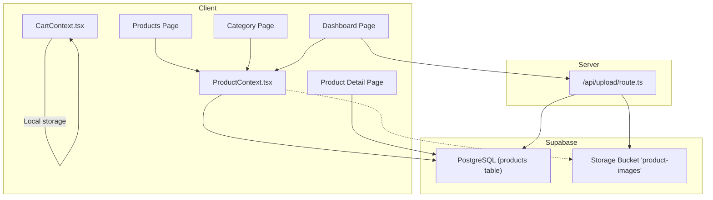
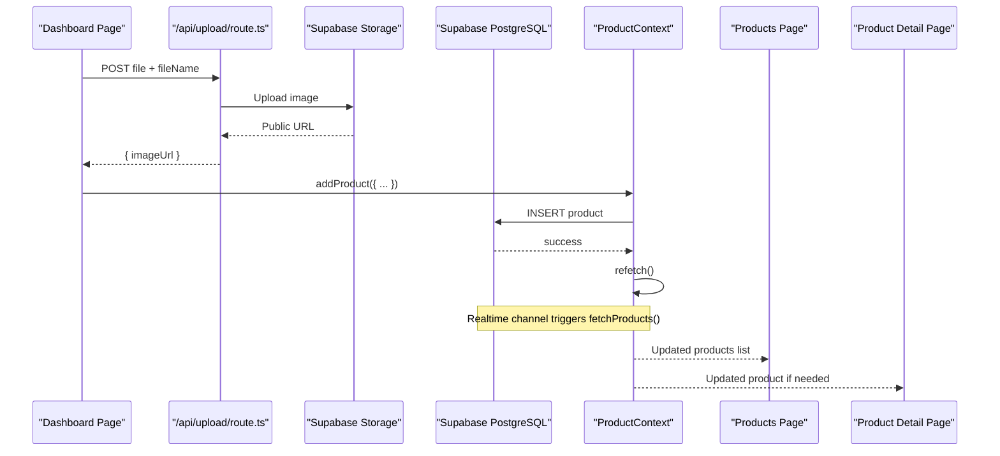
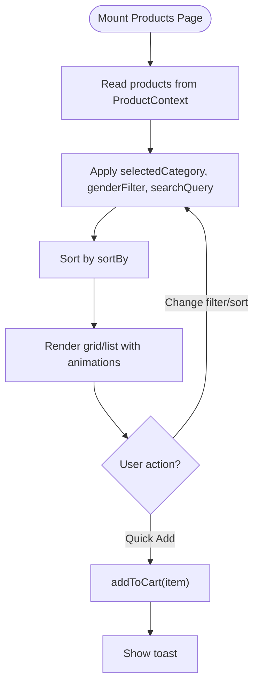
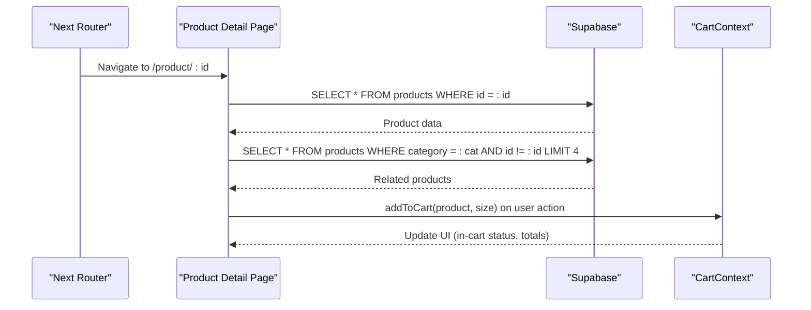
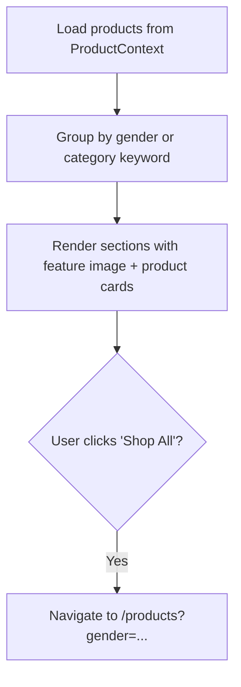
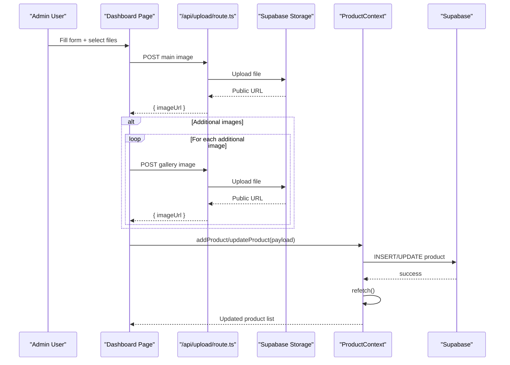
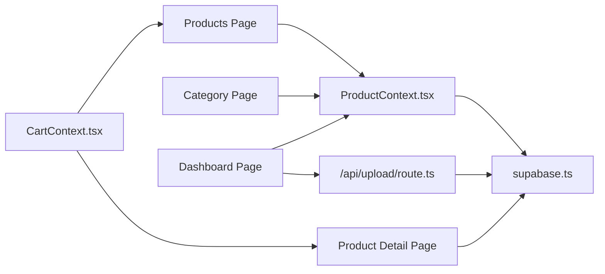

# Product Management System

<cite>
**Referenced Files in This Document**
- [ProductContext.tsx](file://app/context/ProductContext.tsx)
- [supabase.ts](file://lib/supabase.ts)
- [products/page.tsx](file://app/products/page.tsx)
- [product/[id]/page.tsx](file://app/product/[id]/page.tsx)
- [category/page.tsx](file://app/category/page.tsx)
- [dashboard/page.tsx](file://app/dashboard/page.tsx)
- [CartContext.tsx](file://app/context/CartContext.tsx)
- [upload/route.ts](file://app/api/upload/route.ts)
- [supabase-setup.sql](file://supabase-setup.sql)
</cite>

## Table of Contents
1. [Introduction](#introduction)
2. [Project Structure](#project-structure)
3. [Core Components](#core-components)
4. [Architecture Overview](#architecture-overview)
5. [Detailed Component Analysis](#detailed-component-analysis)
6. [Dependency Analysis](#dependency-analysis)
7. [Performance Considerations](#performance-considerations)
8. [Troubleshooting Guide](#troubleshooting-guide)
9. [Conclusion](#conclusion)
10. [Appendices](#appendices)

## Introduction
This document explains the Product Management System for a fragrance e-commerce application. It covers:
- Product catalog with real-time inventory updates via Supabase subscriptions
- Product CRUD operations through a centralized context provider
- Category-based filtering and organization
- Product detail pages with size variants support
- Data model (Product interface), real-time synchronization patterns, error handling strategies, and performance optimizations
- Practical examples for adding products via dashboard, browsing categories, and implementing custom filters
- Data validation, image handling, and integration with the shopping cart system

## Project Structure
The product management features are implemented across client-side contexts, Next.js pages, an API route for uploads, and database schema definitions.



**Diagram sources**
- [ProductContext.tsx](file://app/context/ProductContext.tsx)
- [CartContext.tsx](file://app/context/CartContext.tsx)
- [products/page.tsx](file://app/products/page.tsx)
- [product/[id]/page.tsx](file://app/product/[id]/page.tsx)
- [category/page.tsx](file://app/category/page.tsx)
- [dashboard/page.tsx](file://app/dashboard/page.tsx)
- [upload/route.ts](file://app/api/upload/route.ts)
- [supabase-setup.sql](file://supabase-setup.sql)

**Section sources**
- [ProductContext.tsx](file://app/context/ProductContext.tsx)
- [supabase.ts](file://lib/supabase.ts)
- [products/page.tsx](file://app/products/page.tsx)
- [product/[id]/page.tsx](file://app/product/[id]/page.tsx)
- [category/page.tsx](file://app/category/page.tsx)
- [dashboard/page.tsx](file://app/dashboard/page.tsx)
- [CartContext.tsx](file://app/context/CartContext.tsx)
- [upload/route.ts](file://app/api/upload/route.ts)
- [supabase-setup.sql](file://supabase-setup.sql)

## Core Components
- Product data model and context provider
  - Defines the Product interface and provides add/update/delete/refetch methods
  - Subscribes to real-time changes on the products table and refreshes local state
- Supabase client configuration
  - Validates environment variables and falls back to safe defaults for development
  - Exposes a shared client instance and storage bucket name
- Product listing page
  - Implements category, gender, search, sort, and view toggles
  - Integrates quick-add to cart and animated UI interactions
- Product detail page
  - Fetches a single product by id, supports size variants and quantity selection
  - Displays related products from the same category
- Category page
  - Organizes products into sections by gender or category keywords
  - Provides “Shop All” links to filtered views
- Dashboard
  - Full product creation/editing form with image upload via server API route
  - Supports sizes, gallery images, video embed URL, notes, longevity, sillage, badge, category, gender
- Cart context
  - Local storage-backed cart with size-aware items and helpers

**Section sources**
- [ProductContext.tsx](file://app/context/ProductContext.tsx)
- [supabase.ts](file://lib/supabase.ts)
- [products/page.tsx](file://app/products/page.tsx)
- [product/[id]/page.tsx](file://app/product/[id]/page.tsx)
- [category/page.tsx](file://app/category/page.tsx)
- [dashboard/page.tsx](file://app/dashboard/page.tsx)
- [CartContext.tsx](file://app/context/CartContext.tsx)

## Architecture Overview
End-to-end flow for adding a product and seeing it live across the app:



**Diagram sources**
- [dashboard/page.tsx](file://app/dashboard/page.tsx)
- [upload/route.ts](file://app/api/upload/route.ts)
- [ProductContext.tsx](file://app/context/ProductContext.tsx)
- [products/page.tsx](file://app/products/page.tsx)
- [product/[id]/page.tsx](file://app/product/[id]/page.tsx)

## Detailed Component Analysis

### Product Interface and Context Provider
- Product interface fields include identifiers, media, pricing, metadata (badge, category, gender), olfactory notes, performance attributes, size variants, gallery images, optional video URL, and timestamps.
- The provider:
  - Loads all products ordered by created_at
  - Establishes a realtime subscription to the products table; any change triggers a refetch
  - Exposes addProduct, updateProduct, deleteProduct, and refetch
  - Throws errors returned from Supabase for caller handling

```mermaid
classDiagram
class Product {
+string id
+string name
+string description
+number price
+string image_url
+string? badge
+string? category
+ProductGender? gender
+string? top_notes
+string? heart_notes
+string? base_notes
+string? longevity
+string? sillage
+{size : string,price : number}[]? sizes
+string[]? images
+string? video_url
+string? created_at
}
class ProductContextType {
+Product[] products
+boolean loading
+addProduct(product) Promise<void>
+updateProduct(id, partial) Promise<void>
+deleteProduct(id) Promise<void>
+refetch() Promise<void>
}
class ProductProvider {
+state : products, loading
+useEffect() : fetchProducts() + subscribe("postgres_changes")
+methods : addProduct, updateProduct, deleteProduct, refetch
}
ProductProvider --> Product : "manages"
```

**Diagram sources**
- [ProductContext.tsx](file://app/context/ProductContext.tsx)

**Section sources**
- [ProductContext.tsx](file://app/context/ProductContext.tsx)

### Supabase Client Configuration
- Validates NEXT_PUBLIC_SUPABASE_URL and NEXT_PUBLIC_SUPABASE_ANON_KEY
- Falls back to safe defaults when placeholders are detected
- Exports a configured client and the storage bucket name used for product images

**Section sources**
- [supabase.ts](file://lib/supabase.ts)

### Products Listing Page
- Filters:
  - Category pills mapped to product.category
  - Gender filter mapping to product.gender
  - Search across name, description, and category
  - Sort by default, price low/high, newest first
- View modes: grid/list with animations
- Quick add to cart using CartContext
- Uses useMemo to compute filtered results efficiently



**Diagram sources**
- [products/page.tsx](file://app/products/page.tsx)
- [CartContext.tsx](file://app/context/CartContext.tsx)

**Section sources**
- [products/page.tsx](file://app/products/page.tsx)
- [CartContext.tsx](file://app/context/CartContext.tsx)

### Product Detail Page
- Fetches a single product by id and loads related products from the same category
- Size variants:
  - If sizes exist, selects the first by default
  - Adjusts displayed price based on selected size
- Quantity selector and add-to-cart integration
- Image gallery with thumbnails and main image switching
- Tabs for notes, ritual, and story content
- Related products section



**Diagram sources**
- [product/[id]/page.tsx](file://app/product/[id]/page.tsx)
- [CartContext.tsx](file://app/context/CartContext.tsx)

**Section sources**
- [product/[id]/page.tsx](file://app/product/[id]/page.tsx)
- [CartContext.tsx](file://app/context/CartContext.tsx)

### Category Page
- Divides products into sections by gender or category keywords (e.g., oriental/oud)
- Each section shows up to four products with hover effects and quick add
- Links to filtered product listings



**Diagram sources**
- [category/page.tsx](file://app/category/page.tsx)
- [ProductContext.tsx](file://app/context/ProductContext.tsx)

**Section sources**
- [category/page.tsx](file://app/category/page.tsx)

### Dashboard and Image Upload Flow
- Form fields cover all Product properties including sizes, gallery images, video URL, notes, longevity, sillage, badge, category, gender
- Main image and additional images uploaded via server API route to bypass browser CORS issues and ad blockers
- After successful upload, product record is inserted or updated; then refetch ensures consistency
- Error handling displays toasts for success/failure



**Diagram sources**
- [dashboard/page.tsx](file://app/dashboard/page.tsx)
- [upload/route.ts](file://app/api/upload/route.ts)
- [ProductContext.tsx](file://app/context/ProductContext.tsx)

**Section sources**
- [dashboard/page.tsx](file://app/dashboard/page.tsx)
- [upload/route.ts](file://app/api/upload/route.ts)
- [ProductContext.tsx](file://app/context/ProductContext.tsx)

### Shopping Cart Integration
- CartContext persists items to localStorage and tracks quantity per item-size combination
- Product pages pass minimal item info plus selected size to addToCart
- isInCart helper drives UI states like “In Cart” badges

**Section sources**
- [CartContext.tsx](file://app/context/CartContext.tsx)
- [products/page.tsx](file://app/products/page.tsx)
- [product/[id]/page.tsx](file://app/product/[id]/page.tsx)

## Dependency Analysis
Key relationships between components and services:



**Diagram sources**
- [ProductContext.tsx](file://app/context/ProductContext.tsx)
- [supabase.ts](file://lib/supabase.ts)
- [products/page.tsx](file://app/products/page.tsx)
- [product/[id]/page.tsx](file://app/product/[id]/page.tsx)
- [category/page.tsx](file://app/category/page.tsx)
- [dashboard/page.tsx](file://app/dashboard/page.tsx)
- [CartContext.tsx](file://app/context/CartContext.tsx)
- [upload/route.ts](file://app/api/upload/route.ts)

**Section sources**
- [ProductContext.tsx](file://app/context/ProductContext.tsx)
- [supabase.ts](file://lib/supabase.ts)
- [products/page.tsx](file://app/products/page.tsx)
- [product/[id]/page.tsx](file://app/product/[id]/page.tsx)
- [category/page.tsx](file://app/category/page.tsx)
- [dashboard/page.tsx](file://app/dashboard/page.tsx)
- [CartContext.tsx](file://app/context/CartContext.tsx)
- [upload/route.ts](file://app/api/upload/route.ts)

## Performance Considerations
- Real-time updates:
  - Single subscription to the products table triggers a full refetch; consider pagination or incremental updates for large catalogs
- Filtering and sorting:
  - Use memoization (already present) to avoid unnecessary re-renders
  - Debounce search input to reduce recomputation during typing
- Images:
  - Prefer optimized formats and sizes; consider lazy loading for galleries
  - Use responsive srcset where possible
- Server uploads:
  - Uploading via API route avoids client-side CORS and ad blocker issues
  - Batch uploads can be improved with concurrency limits and progress feedback
- Database:
  - Ensure indexes on frequently queried columns (e.g., category, gender, created_at)
  - Row Level Security policies allow public access for demo; tighten for production

[No sources needed since this section provides general guidance]

## Troubleshooting Guide
- Supabase connection issues:
  - Verify environment variables are set correctly; the client logs informational messages when placeholders are detected
  - Check RLS policies and storage bucket permissions
- Upload failures:
  - Confirm the storage bucket exists and is public
  - Validate file types and sizes; ensure the server route returns proper error responses
- Real-time not updating:
  - Ensure the realtime channel is subscribed and not removed prematurely
  - Confirm that inserts/updates/deletes trigger postgres_changes events
- Cart inconsistencies:
  - Clear localStorage if corrupted
  - Ensure size keys are consistent when adding/removing items

**Section sources**
- [supabase.ts](file://lib/supabase.ts)
- [upload/route.ts](file://app/api/upload/route.ts)
- [ProductContext.tsx](file://app/context/ProductContext.tsx)
- [CartContext.tsx](file://app/context/CartContext.tsx)

## Conclusion
The Product Management System integrates a robust context-driven architecture with Supabase for data persistence and real-time synchronization. It offers comprehensive product CRUD capabilities, rich filtering and presentation layers, and seamless cart integration. With careful attention to performance and error handling, it scales well for growing catalogs and enhanced admin workflows.

[No sources needed since this section summarizes without analyzing specific files]

## Appendices

### Database Schema Notes
- products table includes core fields and extended attributes for fragrance specifics
- site_content and hero_slides tables support dynamic content and carousel management
- RLS policies enable public read/write for demo purposes

**Section sources**
- [supabase-setup.sql](file://supabase-setup.sql)

### Practical Examples

- Adding a product via dashboard:
  - Open the dashboard, navigate to “Add Product”, fill required fields, upload main image and optional gallery images, configure sizes and notes, then submit
  - On success, the product appears instantly due to real-time subscription

- Browsing categories:
  - Use the category page to explore curated sections or click “Shop All” to go to the products page with pre-applied filters

- Implementing custom product filters:
  - Extend the filtering logic in the products page by adding new state variables and conditions in the computed filtered array
  - Example: add a “longevity” dropdown and filter products whose longevity field matches the selection

**Section sources**
- [dashboard/page.tsx](file://app/dashboard/page.tsx)
- [category/page.tsx](file://app/category/page.tsx)
- [products/page.tsx](file://app/products/page.tsx)