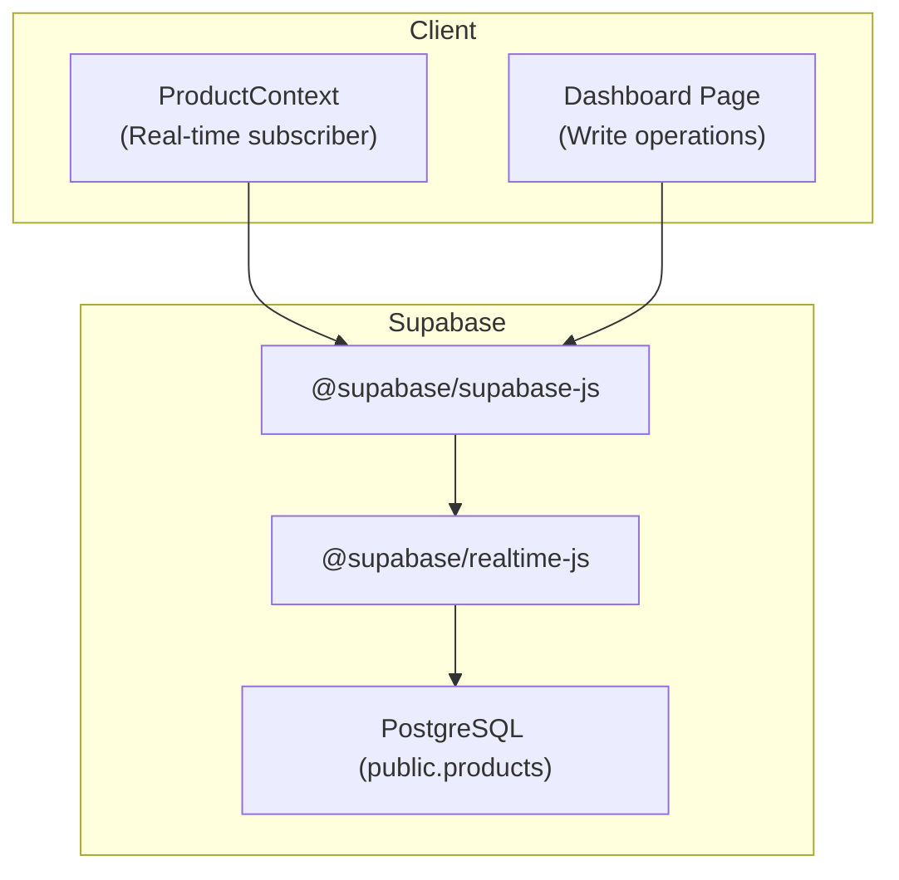
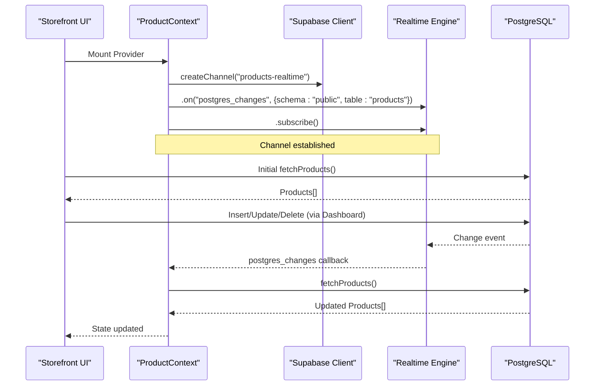
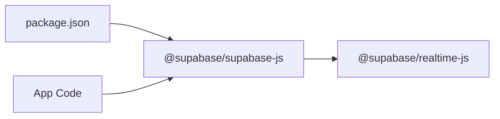

# Real-time Updates & Synchronization

<cite>
**Referenced Files in This Document**
- [supabase.ts](file://lib/supabase.ts)
- [ProductContext.tsx](file://app/context/ProductContext.tsx)
- [SiteContentContext.tsx](file://app/context/SiteContentContext.tsx)
- [HeroSlidesContext.tsx](file://app/context/HeroSlidesContext.tsx)
- [dashboard/page.tsx](file://app/dashboard/page.tsx)
- [supabase-setup.sql](file://supabase-setup.sql)
- [package.json](file://package.json)
</cite>

## Table of Contents
1. [Introduction](#introduction)
2. [Project Structure](#project-structure)
3. [Core Components](#core-components)
4. [Architecture Overview](#architecture-overview)
5. [Detailed Component Analysis](#detailed-component-analysis)
6. [Dependency Analysis](#dependency-analysis)
7. [Performance Considerations](#performance-considerations)
8. [Troubleshooting Guide](#troubleshooting-guide)
9. [Conclusion](#conclusion)
10. [Appendices](#appendices)

## Introduction
This document explains the real-time product updates system built with Supabase’s postgres_changes events and React Context. It covers how channels are managed, how data is synchronized across clients, error handling for network issues, fallback mechanisms, and strategies to optimize subscription performance. It also provides guidance on implementing custom real-time features, monitoring connection status, debugging WebSocket connections, and reconnection logic.

## Project Structure
The real-time feature centers around a single table (products) and a client-side context that subscribes to database changes. The dashboard performs writes; the storefront reads and refreshes automatically via real-time events.

**Diagram sources**
- [ProductContext.tsx:64-82](file://app/context/ProductContext.tsx#L64-L82)
- [dashboard/page.tsx:152-233](file://app/dashboard/page.tsx#L152-L233)
- [supabase.ts:41](file://lib/supabase.ts#L41)
- [package.json:12](file://package.json#L12)

**Section sources**
- [ProductContext.tsx:1-116](file://app/context/ProductContext.tsx#L1-L116)
- [dashboard/page.tsx:1-120](file://app/dashboard/page.tsx#L1-L120)
- [supabase.ts:1-46](file://lib/supabase.ts#L1-L46)
- [package.json:11-17](file://package.json#L11-L17)

## Core Components
- Supabase client initialization and environment validation
- ProductContext providing CRUD operations and a real-time channel subscription
- Dashboard page performing write operations and showing connection status
- Database schema and RLS policies enabling public access for demo purposes

Key responsibilities:
- Initialize a shared Supabase client with safe fallbacks
- Subscribe to postgres_changes on the products table
- Refetch data upon change events
- Provide UI-level connection diagnostics

**Section sources**
- [supabase.ts:1-46](file://lib/supabase.ts#L1-L46)
- [ProductContext.tsx:45-109](file://app/context/ProductContext.tsx#L45-L109)
- [dashboard/page.tsx:20-36](file://app/dashboard/page.tsx#L20-L36)
- [supabase-setup.sql:7-32](file://supabase-setup.sql#L7-L32)

## Architecture Overview
The system uses a publish-subscribe model over WebSockets:
- The client creates a Supabase channel named “products-realtime”
- It listens for postgres_changes on the public.products table
- On any insert/update/delete, it refetches the full list to keep UI consistent
- The dashboard triggers writes; all connected clients receive events and update

**Diagram sources**
- [ProductContext.tsx:64-82](file://app/context/ProductContext.tsx#L64-L82)
- [dashboard/page.tsx:152-233](file://app/dashboard/page.tsx#L152-L233)
- [supabase.ts:41](file://lib/supabase.ts#L41)

## Detailed Component Analysis

### Supabase Client Initialization
- Validates environment variables for URL and anon key
- Falls back to known demo credentials when placeholders or invalid values are detected
- Exports a singleton client used by contexts and pages

Operational notes:
- Uses a simple URL validator and placeholder checks
- Logs an informational message when fallbacks are used
- Exports a storage bucket name constant for uploads

**Section sources**
- [supabase.ts:1-46](file://lib/supabase.ts#L1-L46)

### ProductContext: Real-time Subscription and Data Sync
Responsibilities:
- Fetch initial products ordered by created_at
- Create a channel “products-realtime” and subscribe to postgres_changes on public.products
- On any change event, refetch the entire list to ensure consistency
- Provide add/update/delete helpers that mutate data and then refetch

Data flow:
- Initial load sets state
- Real-time event triggers refetch
- UI re-renders with latest data

Channel lifecycle:
- Created on mount
- Removed on unmount to avoid leaks

Conflict resolution strategy:
- Current implementation resolves conflicts by refetching the authoritative dataset after each change event. This avoids partial optimistic merges and ensures eventual consistency.

Error handling:
- Network or query errors during fetch are logged
- No explicit retry/backoff is implemented at this layer

Optimization opportunities:
- Use selective column selection if only a subset is needed
- Debounce rapid refetches if many concurrent changes occur
- Consider optimistic updates with rollback on error for better UX

**Section sources**
- [ProductContext.tsx:45-109](file://app/context/ProductContext.tsx#L45-L109)

### Dashboard Page: Writes and Connection Diagnostics
Responsibilities:
- Performs product creation and updates through the context
- Displays connection status indicators and messages
- Integrates image upload via server route and persists metadata to the database

Connection status:
- Attempts a lightweight read on mount to determine connectivity
- Shows clear messages for missing env vars or connection errors

**Section sources**
- [dashboard/page.tsx:20-36](file://app/dashboard/page.tsx#L20-L36)
- [dashboard/page.tsx:152-233](file://app/dashboard/page.tsx#L152-L233)

### Database Schema and Policies
- products table includes core fields and additional columns added via migrations
- Row Level Security enabled with permissive policies for demo usage
- Storage bucket “product-images” referenced by client code

Security note:
- For production, replace permissive policies with auth-aware rules

**Section sources**
- [supabase-setup.sql:7-32](file://supabase-setup.sql#L7-L32)
- [supabase-setup.sql:42-56](file://supabase-setup.sql#L42-L56)
- [supabase.ts:44](file://lib/supabase.ts#L44)

### Other Contexts (Non-real-time patterns)
- SiteContentContext: Loads site content and supports upserts; no real-time subscription currently
- HeroSlidesContext: Manages carousel slides with local state updates after mutations; no real-time subscription currently

These provide examples of alternative synchronization patterns (optimistic updates and local state sync) that can be extended to use real-time where appropriate.

**Section sources**
- [SiteContentContext.tsx:22-96](file://app/context/SiteContentContext.tsx#L22-L96)
- [HeroSlidesContext.tsx:157-283](file://app/context/HeroSlidesContext.tsx#L157-L283)

## Dependency Analysis
External dependencies relevant to real-time:
- @supabase/supabase-js: Client library exposing channels and realtime APIs
- @supabase/realtime-js: Underlying WebSocket-based realtime engine

**Diagram sources**
- [package.json:11-17](file://package.json#L11-L17)

**Section sources**
- [package.json:11-17](file://package.json#L11-L17)

## Performance Considerations
- Selective queries: If you only need specific columns, adjust select to reduce payload size
- Event filtering: Use more specific postgres_changes filters (e.g., INSERT only) to reduce noise
- Debouncing refetches: When multiple changes arrive quickly, batch or debounce refetch calls
- Avoid redundant subscriptions: Ensure only one channel per table is active per component tree
- Prefer optimistic updates for fast UX, then reconcile with server state on error

[No sources needed since this section provides general guidance]

## Troubleshooting Guide
Common issues and resolutions:
- Missing or placeholder environment variables:
  - Symptom: Fallback credentials used and console info logged
  - Action: Set NEXT_PUBLIC_SUPABASE_URL and NEXT_PUBLIC_SUPABASE_ANON_KEY in .env.local and restart dev server
- Connection failures:
  - Symptom: Dashboard shows “Connection Failed” with error message
  - Action: Verify internet connectivity, correct keys, and RLS policies
- Real-time not updating:
  - Symptom: Changes made in dashboard do not reflect immediately
  - Action: Confirm channel exists and is subscribed; check browser console for errors; verify postgres_changes is enabled on the table

Debugging tips:
- Inspect the Supabase client initialization logs for credential warnings
- Monitor the dashboard’s connection status indicator
- Add temporary logging around the postgres_changes callback to confirm events are received

**Section sources**
- [supabase.ts:35-39](file://lib/supabase.ts#L35-L39)
- [dashboard/page.tsx:20-36](file://app/dashboard/page.tsx#L20-L36)

## Conclusion
The current implementation provides a straightforward real-time product feed using Supabase’s postgres_changes. It establishes a single channel, refetches data on changes, and exposes clear connection diagnostics. To scale further, consider adding robust reconnection handling, targeted event filtering, optimistic updates with reconciliation, and stricter RLS policies for production.

[No sources needed since this section summarizes without analyzing specific files]

## Appendices

### Implementing Custom Real-time Features
- Create a new channel with a unique name
- Subscribe to postgres_changes for the desired table and event types
- Handle events by either refetching or applying targeted diffs
- Clean up channels on unmount

Example pattern references:
- Channel creation and subscription: [ProductContext.tsx:64-82](file://app/context/ProductContext.tsx#L64-L82)
- Cleanup on unmount: [ProductContext.tsx:79-82](file://app/context/ProductContext.tsx#L79-L82)

### Monitoring Connection Status
- Perform a lightweight query on mount to detect connectivity
- Surface status in the UI with informative messages

Reference:
- [dashboard/page.tsx:20-36](file://app/dashboard/page.tsx#L20-L36)

### Optimizing Subscription Performance
- Narrow event scope (INSERT/UPDATE/DELETE)
- Limit selected columns
- Debounce refetches under high churn
- Reuse a single channel per resource

References:
- [ProductContext.tsx:64-82](file://app/context/ProductContext.tsx#L64-L82)

### WebSocket Connection Management and Reconnection Logic
Current behavior:
- The Supabase client manages the underlying WebSocket connection
- No explicit reconnection or exponential backoff is implemented in application code

Recommended enhancements:
- Track channel subscription state and reconnect on disconnect
- Implement exponential backoff with jitter for retries
- Gracefully degrade to polling when real-time is unavailable

References:
- [supabase.ts:41](file://lib/supabase.ts#L41)
- [package.json:12](file://package.json#L12)

### Debugging Real-time Updates
- Log channel lifecycle events (create, subscribe, unsubscribe)
- Log postgres_changes callbacks to verify event delivery
- Validate RLS policies and table permissions

References:
- [ProductContext.tsx:64-82](file://app/context/ProductContext.tsx#L64-L82)
- [supabase-setup.sql:17-32](file://supabase-setup.sql#L17-L32)