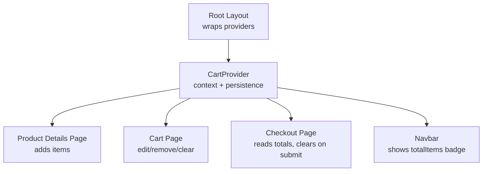
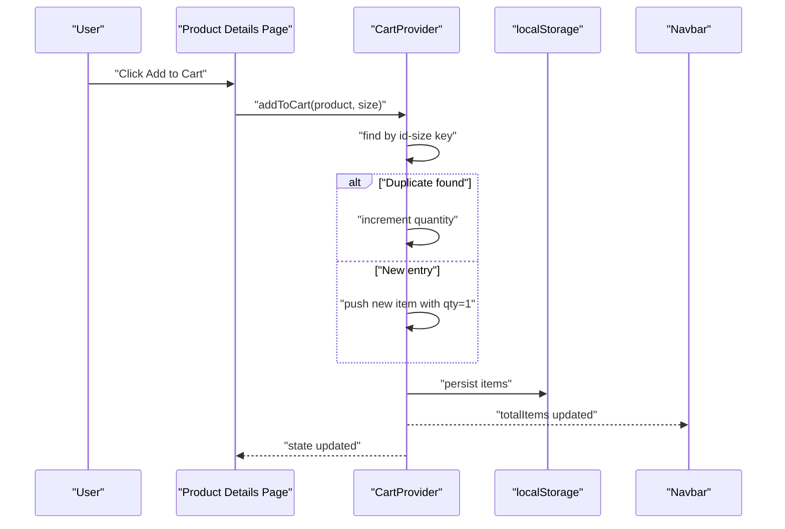
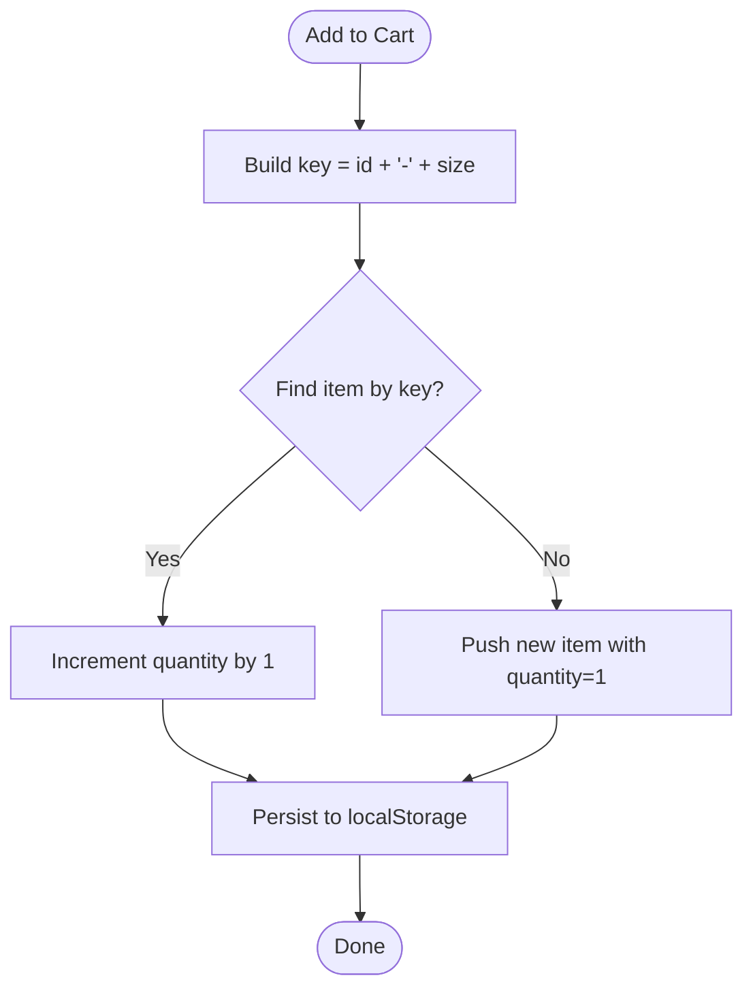
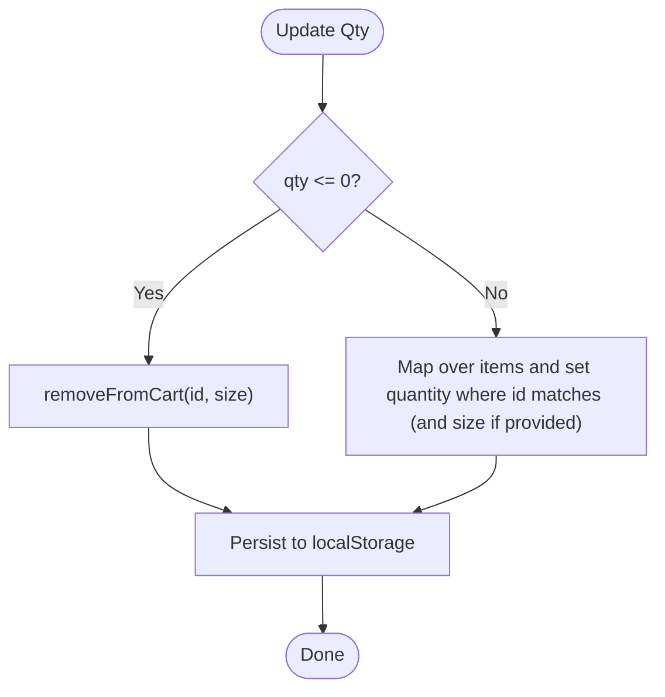
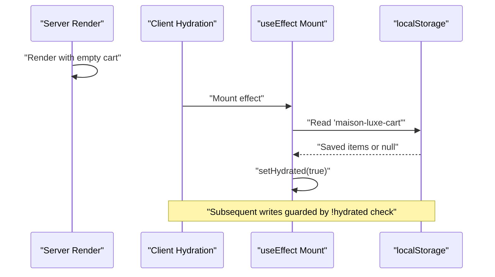
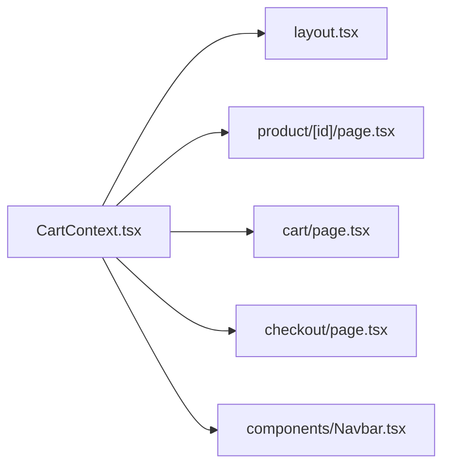

# Cart State Management

<cite>
**Referenced Files in This Document**
- [CartContext.tsx](file://app/context/CartContext.tsx)
- [layout.tsx](file://app/layout.tsx)
- [page.tsx (Product Details)](file://app/product/[id]/page.tsx)
- [page.tsx (Cart Page)](file://app/cart/page.tsx)
- [page.tsx (Checkout Page)](file://app/checkout/page.tsx)
- [Navbar.tsx](file://components/Navbar.tsx)
</cite>

## Table of Contents
1. [Introduction](#introduction)
2. [Project Structure](#project-structure)
3. [Core Components](#core-components)
4. [Architecture Overview](#architecture-overview)
5. [Detailed Component Analysis](#detailed-component-analysis)
6. [Dependency Analysis](#dependency-analysis)
7. [Performance Considerations](#performance-considerations)
8. [Troubleshooting Guide](#troubleshooting-guide)
9. [Conclusion](#conclusion)

## Introduction
This document explains the Cart State Management system implemented with React Context and localStorage persistence. It covers the data model, cart operations, computed properties, size variant handling using composite keys, hydration patterns to prevent SSR/CSR mismatches, error handling for storage operations, performance optimizations using useCallback, and edge cases such as duplicate items, invalid quantities, and data migration scenarios.

## Project Structure
The cart state is provided at the application root via a provider component and consumed across multiple pages and components:
- Provider and hook are defined in the context file.
- The provider is wrapped around the app tree in the root layout.
- Product details page adds items to the cart.
- Cart page displays and edits cart contents.
- Checkout page reads cart totals and clears the cart after order submission.
- Navbar shows the total item count badge.

**Diagram sources**
- [layout.tsx:62-76](file://app/layout.tsx#L62-L76)
- [CartContext.tsx:28-96](file://app/context/CartContext.tsx#L28-L96)
- [page.tsx (Product Details):178-188](file://app/product/[id]/page.tsx#L178-L188)
- [page.tsx (Cart Page):10-12](file://app/cart/page.tsx#L10-L12)
- [page.tsx (Checkout Page):12-14](file://app/checkout/page.tsx#L12-L14)
- [Navbar.tsx:9-11](file://components/Navbar.tsx#L9-L11)

**Section sources**
- [layout.tsx:62-76](file://app/layout.tsx#L62-L76)
- [CartContext.tsx:28-96](file://app/context/CartContext.tsx#L28-L96)

## Core Components
- Data model: CartItem defines product identity, pricing, media, category, quantity, and optional size.
- Context API: exposes items, totalItems, totalPrice, addToCart, removeFromCart, updateQty, clearCart, isInCart.
- Persistence: loads from localStorage on mount and persists changes after hydration.
- Computed values: totalItems and totalPrice are derived directly from items.

Key responsibilities:
- Size variant handling uses composite keys (id-size) to distinguish different sizes of the same product.
- Hydration guard prevents writing to localStorage before client-side hydration completes.
- Error handling wraps localStorage access in try/catch blocks.
- Performance optimization uses useCallback to memoize functions and minimize re-renders.

**Section sources**
- [CartContext.tsx:5-24](file://app/context/CartContext.tsx#L5-L24)
- [CartContext.tsx:28-96](file://app/context/CartContext.tsx#L28-L96)
- [CartContext.tsx:87-88](file://app/context/CartContext.tsx#L87-L88)

## Architecture Overview
The cart state flows from the provider down to consumers. Add-to-cart actions originate from product pages and propagate through context to update persisted state.

**Diagram sources**
- [page.tsx (Product Details):178-188](file://app/product/[id]/page.tsx#L178-L188)
- [CartContext.tsx:49-60](file://app/context/CartContext.tsx#L49-L60)
- [CartContext.tsx:42-47](file://app/context/CartContext.tsx#L42-L47)
- [Navbar.tsx:9-11](file://components/Navbar.tsx#L9-L11)

## Detailed Component Analysis

### CartItem Interface and Context Types
- CartItem fields include identifiers, pricing, image, category, quantity, and optional size.
- CartContextType enumerates all exposed methods and computed values.

Usage examples:
- Adding an item requires passing product metadata without quantity; size defaults if omitted.
- Removing or updating quantity can target a specific size when provided.

**Section sources**
- [CartContext.tsx:5-24](file://app/context/CartContext.tsx#L5-L24)

### Size Variant Handling with Composite Keys
- Composite key strategy: id-size combinations uniquely identify variants.
- Duplicate detection compares the composite key to either increment existing quantity or add a new entry.
- Removal and updates use id and optional size to match the correct variant.

**Diagram sources**
- [CartContext.tsx:49-60](file://app/context/CartContext.tsx#L49-L60)

**Section sources**
- [CartContext.tsx:49-60](file://app/context/CartContext.tsx#L49-L60)

### Quantity Management Logic
- updateQty enforces non-positive quantities by removing the item.
- Positive quantities set the exact value for the matched item.
- Matching considers both id and optional size.

**Diagram sources**
- [CartContext.tsx:68-78](file://app/context/CartContext.tsx#L68-L78)

**Section sources**
- [CartContext.tsx:68-78](file://app/context/CartContext.tsx#L68-L78)

### Computed Properties: totalItems and totalPrice
- totalItems sums all item quantities.
- totalPrice multiplies each item’s price by its quantity and sums results.
- These values are recalculated on every render based on current items.

**Section sources**
- [CartContext.tsx:87-88](file://app/context/CartContext.tsx#L87-L88)

### Hydration Patterns to Prevent SSR/CSR Mismatches
- A hydrated flag ensures localStorage writes occur only after the first client-side effect runs.
- Initial load reads from localStorage inside a useEffect and sets hydrated to true afterward.
- Root layout suppresses hydration warnings to avoid mismatch noise during initial render.

**Diagram sources**
- [CartContext.tsx:33-47](file://app/context/CartContext.tsx#L33-L47)
- [layout.tsx:63-64](file://app/layout.tsx#L63-L64)

**Section sources**
- [CartContext.tsx:33-47](file://app/context/CartContext.tsx#L33-L47)
- [layout.tsx:63-64](file://app/layout.tsx#L63-L64)

### Integration Points and Usage Examples
- Product Details Page:
  - Calls addToCart with product metadata and selected size.
  - Displays “In Cart” indicator using isInCart.
- Cart Page:
  - Renders items, allows quantity adjustments and removals.
  - Uses clearCart to reset the cart.
- Checkout Page:
  - Reads items, totalItems, totalPrice.
  - Clears cart after successful order submission.
- Navbar:
  - Shows totalItems badge.

**Section sources**
- [page.tsx (Product Details):178-188](file://app/product/[id]/page.tsx#L178-L188)
- [page.tsx (Product Details):491-497](file://app/product/[id]/page.tsx#L491-L497)
- [page.tsx (Cart Page):10-12](file://app/cart/page.tsx#L10-L12)
- [page.tsx (Cart Page):81-88](file://app/cart/page.tsx#L81-L88)
- [page.tsx (Checkout Page):12-14](file://app/checkout/page.tsx#L12-L14)
- [page.tsx (Checkout Page):159-160](file://app/checkout/page.tsx#L159-L160)
- [Navbar.tsx:9-11](file://components/Navbar.tsx#L9-L11)

### Error Handling for localStorage Operations
- Read and write operations wrap localStorage calls in try/catch blocks to handle quota exceeded, corrupted data, or environment restrictions gracefully.
- Errors are silently swallowed in the context; consumers rely on safe fallback states (e.g., empty cart).

**Section sources**
- [CartContext.tsx:33-47](file://app/context/CartContext.tsx#L33-L47)

### Performance Optimizations Using useCallback
- All cart action functions are memoized with useCallback to avoid unnecessary re-renders in consumers.
- isInCart depends on items to ensure accurate checks without stale closures.

**Section sources**
- [CartContext.tsx:49-85](file://app/context/CartContext.tsx#L49-L85)

### Edge Cases and Migration Scenarios
- Duplicate items:
  - Handled by composite key matching; duplicates increase quantity rather than creating separate entries.
- Invalid quantities:
  - Non-positive values trigger removal instead of setting zero or negative counts.
- Missing size:
  - Default size is applied when adding items without specifying size.
- Data migration:
  - If stored items lack size fields, they will still be added with default size on next add operation.
  - For robust migration, consider validating and normalizing items on load (e.g., assign default size if undefined).

[No sources needed since this section provides general guidance]

## Dependency Analysis
The cart system has minimal external dependencies and integrates tightly with Next.js client components and localStorage.

**Diagram sources**
- [CartContext.tsx:28-96](file://app/context/CartContext.tsx#L28-L96)
- [layout.tsx:62-76](file://app/layout.tsx#L62-L76)
- [page.tsx (Product Details):178-188](file://app/product/[id]/page.tsx#L178-L188)
- [page.tsx (Cart Page):10-12](file://app/cart/page.tsx#L10-L12)
- [page.tsx (Checkout Page):12-14](file://app/checkout/page.tsx#L12-L14)
- [Navbar.tsx:9-11](file://components/Navbar.tsx#L9-L11)

**Section sources**
- [CartContext.tsx:28-96](file://app/context/CartContext.tsx#L28-L96)
- [layout.tsx:62-76](file://app/layout.tsx#L62-L76)

## Performance Considerations
- Memoization:
  - Actions are memoized to reduce consumer re-renders.
- Derived computations:
  - totalItems and totalPrice are simple reductions; acceptable for typical cart sizes.
- LocalStorage I/O:
  - Writes occur only after hydration; consider debouncing writes if cart mutations become frequent.
- Rendering:
  - Consumers should avoid heavy work in render paths that depend on cart state.

[No sources needed since this section provides general guidance]

## Troubleshooting Guide
Common issues and resolutions:
- Cart not persisting:
  - Verify localStorage availability and quotas; errors are caught and ignored in the context.
- Hydration mismatch warnings:
  - Ensure provider initializes with empty state and hydrates after mount; layout suppresses warnings to avoid noise.
- Incorrect size variant behavior:
  - Confirm composite key usage (id-size) when adding/removing/updating items.
- Unexpected removal on quantity change:
  - Passing zero or negative values intentionally removes the item; validate inputs upstream if needed.

**Section sources**
- [CartContext.tsx:33-47](file://app/context/CartContext.tsx#L33-L47)
- [layout.tsx:63-64](file://app/layout.tsx#L63-L64)
- [CartContext.tsx:68-78](file://app/context/CartContext.tsx#L68-L78)

## Conclusion
The cart state management system leverages React Context with careful hydration and localStorage persistence to provide a consistent shopping experience across pages. It supports size variants via composite keys, handles edge cases like duplicates and invalid quantities, and optimizes performance with memoized actions. The integration points across product, cart, checkout, and navigation demonstrate a cohesive architecture suitable for e-commerce workflows.