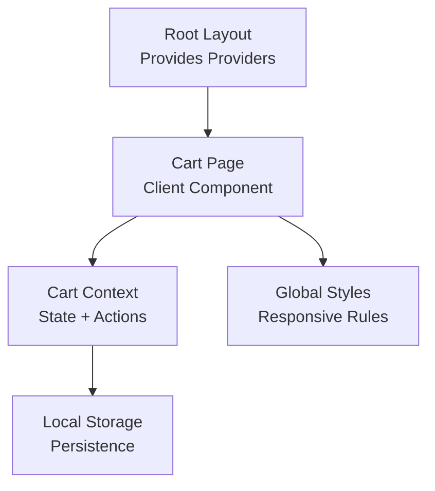
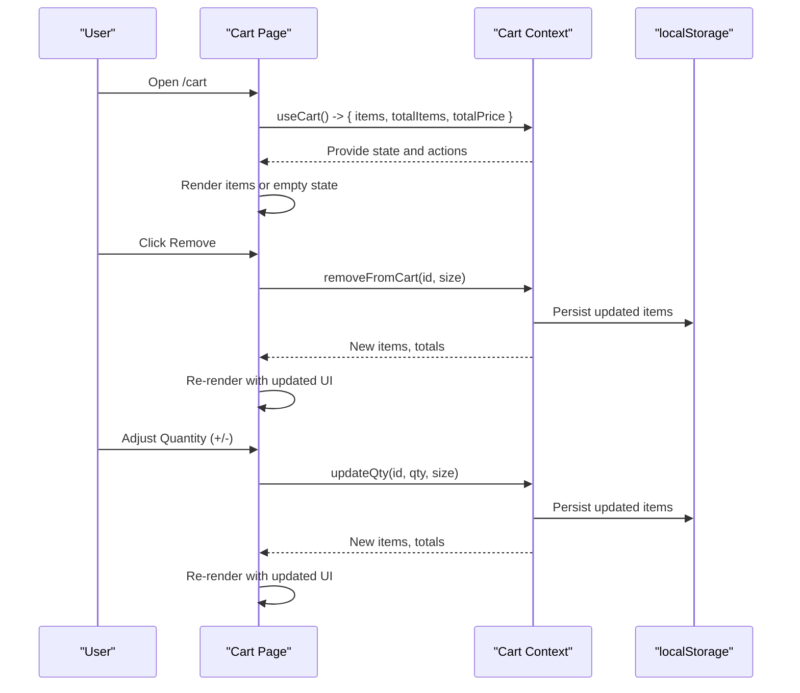
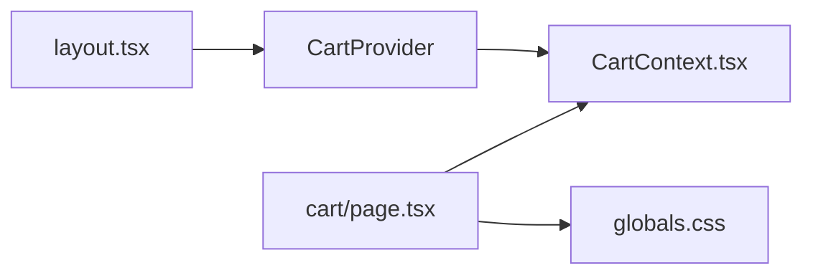

# Cart UI Components

<cite>
**Referenced Files in This Document**
- [page.tsx](file://app/cart/page.tsx)
- [CartContext.tsx](file://app/context/CartContext.tsx)
- [globals.css](file://app/globals.css)
- [layout.tsx](file://app/layout.tsx)
</cite>

## Table of Contents
1. [Introduction](#introduction)
2. [Project Structure](#project-structure)
3. [Core Components](#core-components)
4. [Architecture Overview](#architecture-overview)
5. [Detailed Component Analysis](#detailed-component-analysis)
6. [Dependency Analysis](#dependency-analysis)
7. [Performance Considerations](#performance-considerations)
8. [Troubleshooting Guide](#troubleshooting-guide)
9. [Conclusion](#conclusion)

## Introduction
This document explains the Shopping Cart UI components and page implementation, focusing on how cart items are displayed, rendered with product images and details, quantity controls, remove actions, responsive design patterns, accessibility features, price calculations, empty state handling, and integration with the cart context for real-time updates. It also covers layout considerations and image optimization strategies for product thumbnails.

## Project Structure
The cart feature is implemented as a Next.js client component page that consumes a React Context for cart state management. The global styles define the visual system and responsive behavior.

**Diagram sources**
- [layout.tsx:62-80](file://app/layout.tsx#L62-L80)
- [page.tsx:10-30](file://app/cart/page.tsx#L10-L30)
- [CartContext.tsx:28-47](file://app/context/CartContext.tsx#L28-L47)
- [globals.css:2509-2514](file://app/globals.css#L2509-L2514)

**Section sources**
- [layout.tsx:62-80](file://app/layout.tsx#L62-L80)
- [page.tsx:10-30](file://app/cart/page.tsx#L10-L30)
- [CartContext.tsx:28-47](file://app/context/CartContext.tsx#L28-L47)
- [globals.css:2509-2514](file://app/globals.css#L2509-L2514)

## Core Components
- Cart Page (client component): Renders the cart interface, including hero strip, item list, summary panel, and empty state. It uses GSAP for entrance animations and integrates with the cart context for data and actions.
- Cart Context: Provides cart state (items, totals), persistence via localStorage, and actions (add, remove, update quantity, clear).
- Global Styles: Define grid layout, item card styling, sticky summary panel, quantity control, and responsive breakpoints for mobile-first behavior.

Key responsibilities:
- Cart Page: Presentation, user interactions, animations, navigation to checkout/category.
- Cart Context: State management, persistence, derived totals, action handlers.
- Global Styles: Responsive layout, hover states, typography, spacing, and transitions.

**Section sources**
- [page.tsx:10-30](file://app/cart/page.tsx#L10-L30)
- [CartContext.tsx:28-96](file://app/context/CartContext.tsx#L28-L96)
- [globals.css:2509-2624](file://app/globals.css#L2509-L2624)

## Architecture Overview
The cart page subscribes to the cart context and renders a two-column layout on desktop: a scrollable items column and a sticky order summary panel. On smaller screens, it collapses to a single column with the summary below the items.

**Diagram sources**
- [page.tsx:10-30](file://app/cart/page.tsx#L10-L30)
- [CartContext.tsx:28-96](file://app/context/CartContext.tsx#L28-L96)
- [CartContext.tsx:42-47](file://app/context/CartContext.tsx#L42-L47)

## Detailed Component Analysis

### Cart Page Implementation
- Client component with GSAP-driven entrance animations for title, items, and summary panel.
- Displays a hero strip with dynamic subtitle based on total items.
- Empty state shows a friendly message and a call-to-action link to explore categories.
- Items list renders each cart entry with:
  - Product thumbnail image
  - Category label, name, and size badge
  - Remove button with accessible label
  - Quantity control with increment/decrement buttons
  - Line total calculated from unit price and quantity
- Order summary panel includes:
  - Subtotal line with total items count
  - Shipping calculation with free shipping threshold and guidance
  - Total line including shipping cost
  - Primary “Proceed to Checkout” link and secondary “Continue Shopping” link
  - Trust badges section
  - Promo code input area (UI only)

Accessibility highlights:
- Remove button has an aria-label for screen readers.
- Semantic headings and structure improve readability.

Layout and responsiveness:
- Desktop: Two-column grid with sticky summary.
- Tablet/mobile: Single column; summary becomes static below items.
- Very small screens: Item cards stack vertically with full-width thumbnails.

**Section sources**
- [page.tsx:10-30](file://app/cart/page.tsx#L10-L30)
- [page.tsx:32-57](file://app/cart/page.tsx#L32-L57)
- [page.tsx:60-74](file://app/cart/page.tsx#L60-L74)
- [page.tsx:76-133](file://app/cart/page.tsx#L76-L133)
- [page.tsx:135-211](file://app/cart/page.tsx#L135-L211)
- [globals.css:2509-2514](file://app/globals.css#L2509-L2514)
- [globals.css:2586-2589](file://app/globals.css#L2586-L2589)
- [globals.css:3735-3755](file://app/globals.css#L3735-L3755)

### Cart Context and Data Model
- Data model defines a cart item with id, name, price, image URL, optional category, quantity, and optional size.
- Provider initializes state from localStorage on mount and persists changes after hydration.
- Actions:
  - addToCart: Adds new item or increments existing by key (id-size).
  - removeFromCart: Removes matching item(s).
  - updateQty: Updates quantity; if zero or less, removes the item.
  - clearCart: Clears all items.
  - isInCart: Checks presence by id.
- Derived values:
  - totalItems: Sum of quantities across items.
  - totalPrice: Sum of price × quantity across items.

Complexity:
- All operations are O(n) over items due to array scans/maps/filters. Given typical cart sizes, this is acceptable.

Persistence:
- Uses localStorage with a dedicated key; wrapped in try/catch to avoid storage errors.

Error handling:
- Hydration guard prevents premature writes before initial load.
- JSON parse/stringify wrapped in try/catch to handle malformed storage.

**Section sources**
- [CartContext.tsx:5-13](file://app/context/CartContext.tsx#L5-L13)
- [CartContext.tsx:28-47](file://app/context/CartContext.tsx#L28-L47)
- [CartContext.tsx:49-60](file://app/context/CartContext.tsx#L49-L60)
- [CartContext.tsx:62-66](file://app/context/CartContext.tsx#L62-L66)
- [CartContext.tsx:68-78](file://app/context/CartContext.tsx#L68-L78)
- [CartContext.tsx:80-85](file://app/context/CartContext.tsx#L80-L85)
- [CartContext.tsx:87-88](file://app/context/CartContext.tsx#L87-L88)

### Styling and Responsive Behavior
- Grid layout:
  - .cart-layout sets a two-column grid on desktop.
  - .cart-items-col stacks items vertically.
  - .cart-summary-panel is sticky on desktop for better UX.
- Item card:
  - .cart-item provides spacing and subtle hover effects.
  - .cart-item-image constrains thumbnail dimensions and applies object-fit cover.
  - .cart-remove-btn offers hover feedback.
- Quantity control:
  - .qty-control wraps +/- buttons and current value with consistent spacing and rounded borders.
- Responsive rules:
  - At max-width 900px, cart switches to single column and summary becomes static.
  - At max-width 500px, item cards stack vertically and thumbnails become full width.

Mobile-first approach:
- Base styles target mobile layouts; media queries progressively enhance for larger screens.

**Section sources**
- [globals.css:2509-2514](file://app/globals.css#L2509-L2514)
- [globals.css:2521-2584](file://app/globals.css#L2521-L2584)
- [globals.css:2592-2624](file://app/globals.css#L2592-L2624)
- [globals.css:3735-3755](file://app/globals.css#L3735-L3755)

### Price Calculations and Free Shipping Logic
- Subtotal equals sum of item prices multiplied by their quantities.
- Shipping cost is conditional:
  - If subtotal meets or exceeds a threshold, shipping is free.
  - Otherwise, a fixed shipping fee is added.
- Guidance text informs users how much more they need to spend to qualify for free shipping.
- Total displayed includes subtotal plus applicable shipping.

Implementation references:
- Derived totals computed in context.
- Conditional shipping logic and messaging in the summary panel.

**Section sources**
- [CartContext.tsx:87-88](file://app/context/CartContext.tsx#L87-L88)
- [page.tsx:142-163](file://app/cart/page.tsx#L142-L163)

### User Interaction Handlers
- Remove item:
  - Calls removeFromCart with item id and size.
  - Triggers re-render and updates totals.
- Update quantity:
  - Increments or decrements using updateQty.
  - When quantity reaches zero or less, item is removed automatically.
- Clear cart:
  - Empties all items and resets totals.
- Navigation:
  - Proceed to checkout navigates to the checkout route.
  - Continue shopping navigates back to category browsing.

**Section sources**
- [page.tsx:110-116](file://app/cart/page.tsx#L110-L116)
- [page.tsx:121-125](file://app/cart/page.tsx#L121-L125)
- [page.tsx:81-88](file://app/cart/page.tsx#L81-L88)
- [page.tsx:166-179](file://app/cart/page.tsx#L166-L179)
- [CartContext.tsx:62-78](file://app/context/CartContext.tsx#L62-L78)

### Accessibility Features
- Remove button includes an aria-label for assistive technologies.
- Semantic HTML elements (headings, paragraphs, links) provide structure.
- Keyboard-friendly interactive elements (buttons and links) support standard focus behaviors.

**Section sources**
- [page.tsx:110-116](file://app/cart/page.tsx#L110-L116)

### Image Optimization for Product Thumbnails
- Images use object-fit cover within constrained containers to maintain aspect ratio and avoid distortion.
- Hover zoom effect adds subtle interactivity without impacting performance significantly.
- For further optimization, consider:
  - Using next/image for automatic resizing and format conversion.
  - Providing multiple srcset variants for different device densities.
  - Lazy loading offscreen images when the cart grows large.

**Section sources**
- [globals.css:2536-2554](file://app/globals.css#L2536-L2554)
- [page.tsx:93-96](file://app/cart/page.tsx#L93-L96)

### Empty Cart State
- When no items exist, the page displays a centered illustration, a heading, descriptive text, and a primary call-to-action to explore the collection.
- This improves user experience by guiding next steps instead of showing a blank area.

**Section sources**
- [page.tsx:60-74](file://app/cart/page.tsx#L60-L74)

## Dependency Analysis
The cart page depends on:
- Cart Context for state and actions.
- Global styles for layout and responsive behavior.
- Root layout for provider injection.

**Diagram sources**
- [layout.tsx:62-80](file://app/layout.tsx#L62-L80)
- [CartContext.tsx:28-96](file://app/context/CartContext.tsx#L28-L96)
- [page.tsx:10-30](file://app/cart/page.tsx#L10-L30)
- [globals.css:2509-2514](file://app/globals.css#L2509-L2514)

**Section sources**
- [layout.tsx:62-80](file://app/layout.tsx#L62-L80)
- [CartContext.tsx:28-96](file://app/context/CartContext.tsx#L28-L96)
- [page.tsx:10-30](file://app/cart/page.tsx#L10-L30)
- [globals.css:2509-2514](file://app/globals.css#L2509-L2514)

## Performance Considerations
- Cart operations are O(n) over items; acceptable for typical cart sizes but can be optimized with keyed maps if needed.
- Avoid unnecessary re-renders by memoizing callbacks where appropriate (already using useCallback in context).
- Prefer stable keys for list rendering (currently using id-size combination).
- Consider lazy-loading heavy assets like product images if the cart contains many items.
- Keep GSAP animations lightweight; ensure cleanup on unmount to prevent memory leaks.

[No sources needed since this section provides general guidance]

## Troubleshooting Guide
Common issues and resolutions:
- Cart not persisting across reloads:
  - Ensure CartProvider is mounted in the root layout and that localStorage is available.
  - Check for storage quota exceeded or blocked environments.
- Totals not updating:
  - Verify that updateQty and removeFromCart are called with correct id and size parameters.
  - Confirm that the context’s derived totals are recalculated after state changes.
- Remove button not working:
  - Ensure the handler passes both id and size to match the exact cart entry.
- Mobile layout misalignment:
  - Validate that responsive breakpoints are applied and that !important overrides are intentional.

**Section sources**
- [layout.tsx:62-80](file://app/layout.tsx#L62-L80)
- [CartContext.tsx:42-47](file://app/context/CartContext.tsx#L42-L47)
- [CartContext.tsx:62-78](file://app/context/CartContext.tsx#L62-L78)
- [page.tsx:110-125](file://app/cart/page.tsx#L110-L125)
- [globals.css:3735-3755](file://app/globals.css#L3735-L3755)

## Conclusion
The cart UI combines a clean, responsive layout with robust state management and thoughtful UX touches such as empty states, free shipping guidance, and accessible interactions. The cart context centralizes logic and persistence, while global styles enforce a cohesive design system. With minor enhancements—such as advanced image optimization and potential map-based state structures—the cart can scale gracefully as the catalog and user base grow.

[No sources needed since this section summarizes without analyzing specific files]