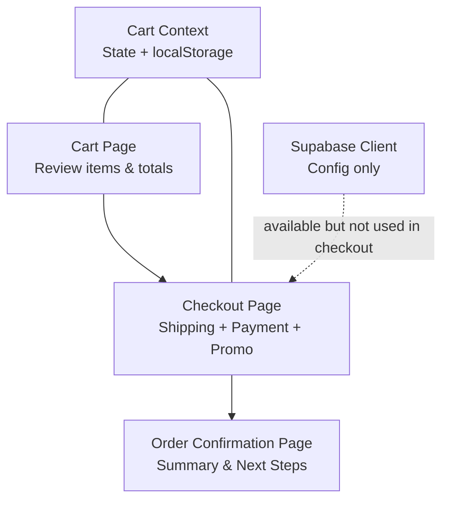
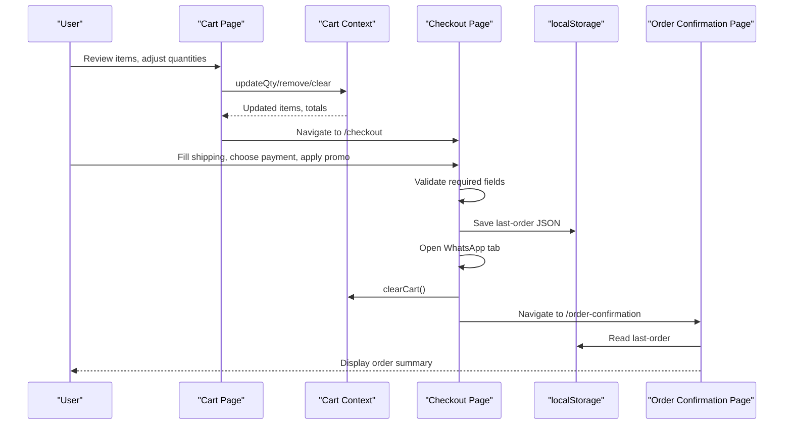
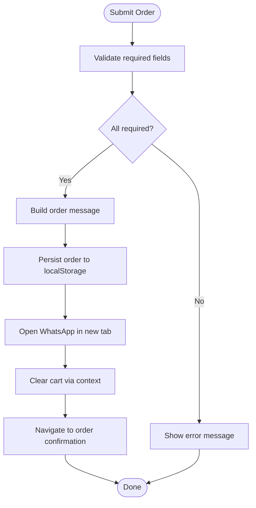
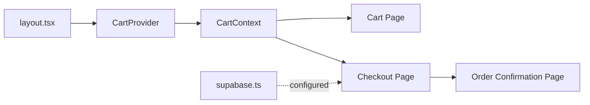
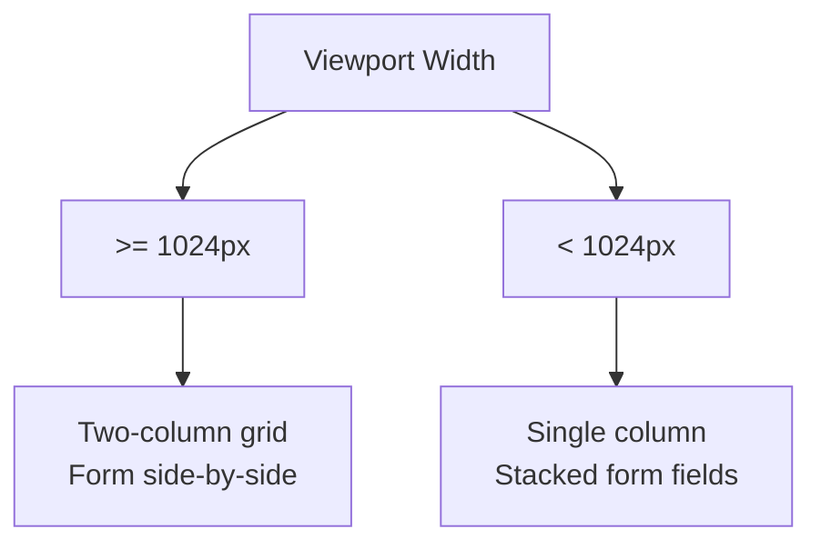

# Checkout Flow

<cite>
**Referenced Files in This Document**
- [page.tsx](file://app/checkout/page.tsx)
- [page.tsx](file://app/order-confirmation/page.tsx)
- [page.tsx](file://app/cart/page.tsx)
- [CartContext.tsx](file://app/context/CartContext.tsx)
- [supabase.ts](file://lib/supabase.ts)
- [layout.tsx](file://app/layout.tsx)
- [globals.css](file://app/globals.css)
</cite>

## Table of Contents
1. [Introduction](#introduction)
2. [Project Structure](#project-structure)
3. [Core Components](#core-components)
4. [Architecture Overview](#architecture-overview)
5. [Detailed Component Analysis](#detailed-component-analysis)
6. [Dependency Analysis](#dependency-analysis)
7. [Performance Considerations](#performance-considerations)
8. [Troubleshooting Guide](#troubleshooting-guide)
9. [Conclusion](#conclusion)
10. [Appendices](#appendices)

## Introduction
This document explains the end-to-end checkout flow from cart review to order confirmation. It covers form validation, shipping information collection, payment method selection, promo code application, order persistence, and the confirmation page with order summary and next steps. It also addresses security considerations for sensitive data, handling checkout abandonment, mobile-responsive design, transitions between steps, and data persistence during the flow.

## Project Structure
The checkout experience spans three primary pages and shared context:
- Cart review and totals
- Checkout form (shipping and payment), promo code, and order submission
- Order confirmation with persisted order details

**Diagram sources**
- [page.tsx:1-220](file://app/cart/page.tsx#L1-L220)
- [page.tsx:1-430](file://app/checkout/page.tsx#L1-L430)
- [page.tsx:1-150](file://app/order-confirmation/page.tsx#L1-L150)
- [CartContext.tsx:1-104](file://app/context/CartContext.tsx#L1-L104)
- [supabase.ts:1-46](file://lib/supabase.ts#L1-L46)

**Section sources**
- [page.tsx:1-220](file://app/cart/page.tsx#L1-L220)
- [page.tsx:1-430](file://app/checkout/page.tsx#L1-L430)
- [page.tsx:1-150](file://app/order-confirmation/page.tsx#L1-L150)
- [CartContext.tsx:1-104](file://app/context/CartContext.tsx#L1-L104)
- [layout.tsx:57-83](file://app/layout.tsx#L57-L83)
- [supabase.ts:1-46](file://lib/supabase.ts#L1-L46)

## Core Components
- Cart Context: Provides cart state (items, totals), CRUD operations, and local storage persistence.
- Cart Page: Displays items, quantities, totals, free-shipping threshold, and navigation to checkout.
- Checkout Page: Collects shipping info, selects payment method, applies promo codes, validates inputs, persists order, opens WhatsApp, clears cart, and navigates to confirmation.
- Order Confirmation Page: Reads persisted order from local storage and displays a summary with next steps.

Key responsibilities:
- State management via React state and Cart Context
- Form validation on submit
- Promo code logic and discount calculation
- Shipping cost calculation based on subtotal
- Data persistence using localStorage
- Navigation between pages

**Section sources**
- [CartContext.tsx:1-104](file://app/context/CartContext.tsx#L1-L104)
- [page.tsx:1-220](file://app/cart/page.tsx#L1-L220)
- [page.tsx:1-430](file://app/checkout/page.tsx#L1-L430)
- [page.tsx:1-150](file://app/order-confirmation/page.tsx#L1-L150)

## Architecture Overview
The checkout flow is client-side driven by React components and uses localStorage for persistence. The Supabase client is configured but not actively used in the checkout submission path.

**Diagram sources**
- [page.tsx:1-220](file://app/cart/page.tsx#L1-L220)
- [CartContext.tsx:1-104](file://app/context/CartContext.tsx#L1-L104)
- [page.tsx:1-430](file://app/checkout/page.tsx#L1-L430)
- [page.tsx:1-150](file://app/order-confirmation/page.tsx#L1-L150)

## Detailed Component Analysis

### Cart Page
- Displays cart items with image, name, size, quantity controls, and line totals.
- Shows subtotal, shipping cost (free above threshold), and total.
- Provides “Proceed to Checkout” link to navigate to the checkout page.
- Uses Cart Context for item updates and totals.

Behavior highlights:
- Quantity increment/decrement triggers context update.
- Clear all removes all items from context and localStorage.
- Free shipping indicator and callout when below threshold.

**Section sources**
- [page.tsx:1-220](file://app/cart/page.tsx#L1-L220)
- [CartContext.tsx:1-104](file://app/context/CartContext.tsx#L1-L104)

### Checkout Page
- Collects delivery information (name, email, phone, governorate, address, notes).
- Presents payment methods (Cash on Delivery or Credit/Debit Card).
- Applies promo code to calculate discount.
- Validates required fields before submission.
- Persists order details to localStorage under a dedicated key.
- Opens WhatsApp in a new tab with formatted order message.
- Clears cart via context and navigates to order confirmation.

Flow overview:

**Diagram sources**
- [page.tsx:75-167](file://app/checkout/page.tsx#L75-L167)

Promo code behavior:
- Accepts a specific code to apply a percentage discount.
- Updates discount state and shows an error if invalid.

Shipping calculation:
- Free shipping above a fixed subtotal threshold; otherwise a flat fee.

Payment integration points:
- UI supports COD and card options.
- Current implementation does not process payments server-side; it records the selected method and proceeds to confirmation.

Security note:
- Sensitive customer data is stored in localStorage. See Security Considerations section for recommendations.

**Section sources**
- [page.tsx:1-430](file://app/checkout/page.tsx#L1-L430)

### Order Confirmation Page
- Loads the last submitted order from localStorage.
- Displays order ID, payment method, delivery address, ordered items, and totals.
- Provides next steps: continue shopping or return to homepage.

Data source:
- Reads from the same localStorage key written by the checkout page.

**Section sources**
- [page.tsx:1-150](file://app/order-confirmation/page.tsx#L1-L150)

### Cart Context
- Maintains cart items, computes totals, and persists to localStorage.
- Exposes actions: add, remove, update quantity, clear, and check presence.
- Ensures hydration-safe persistence to avoid SSR mismatches.

Key behaviors:
- Keyed by product id and size to support variants.
- Prevents negative quantities by removing items when qty <= 0.

**Section sources**
- [CartContext.tsx:1-104](file://app/context/CartContext.tsx#L1-L104)

## Dependency Analysis
- Layout wraps app with providers including CartProvider, making cart state available across pages.
- Checkout imports CartContext and router for navigation.
- Order confirmation reads from localStorage without additional dependencies.
- Supabase client is configured but not invoked in the checkout submission path.

**Diagram sources**
- [layout.tsx:57-83](file://app/layout.tsx#L57-L83)
- [CartContext.tsx:1-104](file://app/context/CartContext.tsx#L1-L104)
- [page.tsx:1-220](file://app/cart/page.tsx#L1-L220)
- [page.tsx:1-430](file://app/checkout/page.tsx#L1-L430)
- [page.tsx:1-150](file://app/order-confirmation/page.tsx#L1-L150)
- [supabase.ts:1-46](file://lib/supabase.ts#L1-L46)

**Section sources**
- [layout.tsx:57-83](file://app/layout.tsx#L57-L83)
- [CartContext.tsx:1-104](file://app/context/CartContext.tsx#L1-L104)
- [supabase.ts:1-46](file://lib/supabase.ts#L1-L46)

## Performance Considerations
- Avoid unnecessary re-renders by keeping form state minimal and scoped to the checkout component.
- Use debounced input handlers for expensive validations if added later.
- Prefer stable keys for list rendering (already keyed by id-size).
- Keep animations lightweight; GSAP contexts are properly cleaned up.

[No sources needed since this section provides general guidance]

## Troubleshooting Guide
Common issues and resolutions:
- Empty cart redirect: If the cart is empty, the checkout page redirects to the cart page. Ensure items exist before proceeding.
- Validation errors: Required fields must be filled; error messages are shown inline.
- Promo code failures: Only the predefined code applies a discount; others show an error.
- Missing order on confirmation: Ensure the order was saved to localStorage and that the user did not clear browser data.
- WhatsApp open blocked: Some browsers block popups; allow popups for the site or test manually.

**Section sources**
- [page.tsx:31-36](file://app/checkout/page.tsx#L31-L36)
- [page.tsx:75-84](file://app/checkout/page.tsx#L75-L84)
- [page.tsx:63-71](file://app/checkout/page.tsx#L63-L71)
- [page.tsx:13-18](file://app/order-confirmation/page.tsx#L13-L18)

## Conclusion
The checkout flow is a streamlined, client-driven process that collects shipping and payment preferences, applies discounts, persists order details, and guides users to a confirmation page. While functional, it should evolve to include robust server-side order creation, secure payment processing, and enhanced data protection.

[No sources needed since this section summarizes without analyzing specific files]

## Appendices

### Security Considerations
- Avoid storing sensitive personal data in localStorage. Consider server-side order creation and token-based session management.
- Do not transmit raw card details client-side. Integrate a PCI-compliant payment provider SDK or server-side payment API.
- Sanitize and validate all inputs on both client and server.
- Use HTTPS-only cookies and secure headers for any future authenticated flows.

[No sources needed since this section provides general guidance]

### Checkout Abandonment Handling
- Persist partial form data to sessionStorage or a backend endpoint keyed by a temporary session ID.
- On revisit, restore fields and prompt to resume checkout.
- Provide a “Save for later” option to persist draft orders server-side.

[No sources needed since this section provides general guidance]

### Mobile-Responsive Checkout Interfaces
- The layout switches from two-column to single-column on smaller screens.
- Form rows stack vertically on narrow viewports.
- Padding adapts for mobile readability.

**Diagram sources**
- [globals.css:3516-3549](file://app/globals.css#L3516-L3549)

**Section sources**
- [globals.css:3364-3383](file://app/globals.css#L3364-L3383)
- [globals.css:3516-3549](file://app/globals.css#L3516-L3549)

### Transition Between Steps and Data Persistence
- Navigation:
  - From cart to checkout via Link.
  - From checkout to confirmation after successful submission.
- Data persistence:
  - Cart state persisted to localStorage via Cart Context.
  - Last order persisted to localStorage for confirmation display.

**Section sources**
- [page.tsx:166-172](file://app/cart/page.tsx#L166-L172)
- [page.tsx:129-167](file://app/checkout/page.tsx#L129-L167)
- [page.tsx:13-18](file://app/order-confirmation/page.tsx#L13-L18)
- [CartContext.tsx:32-47](file://app/context/CartContext.tsx#L32-L47)