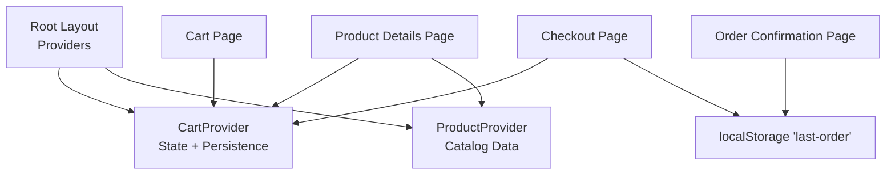
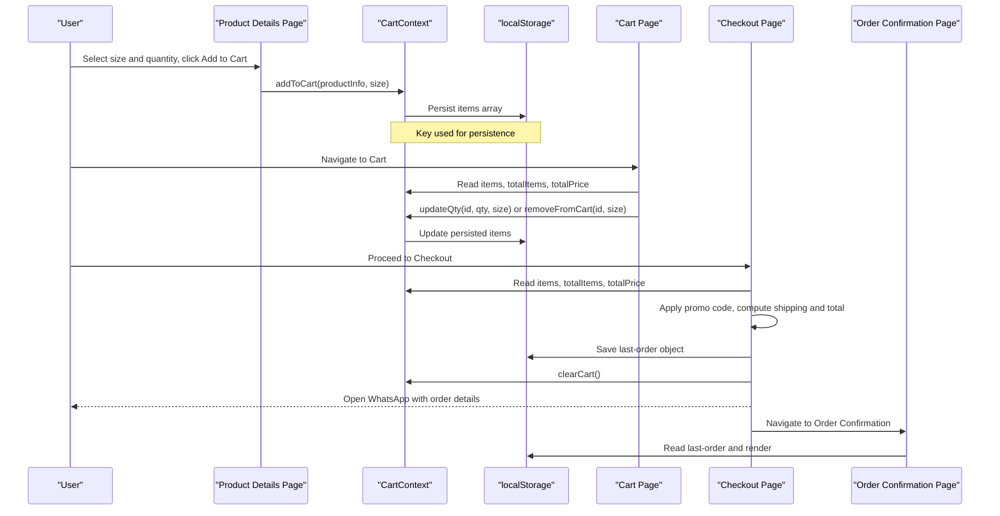
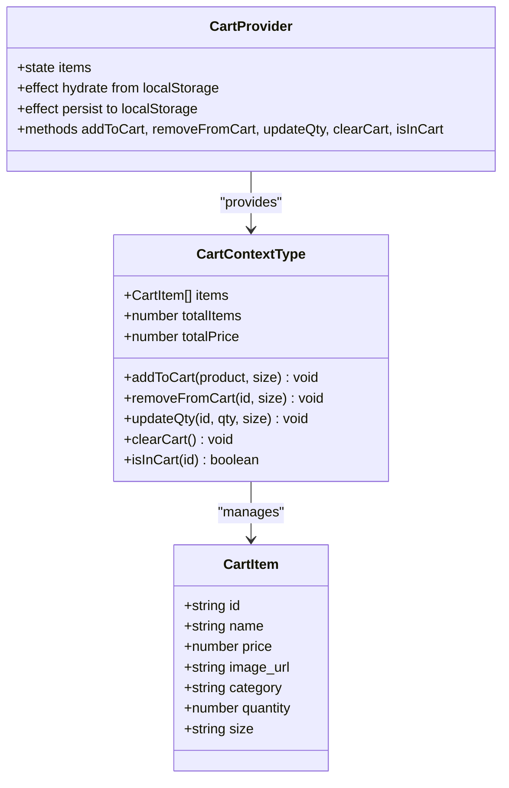
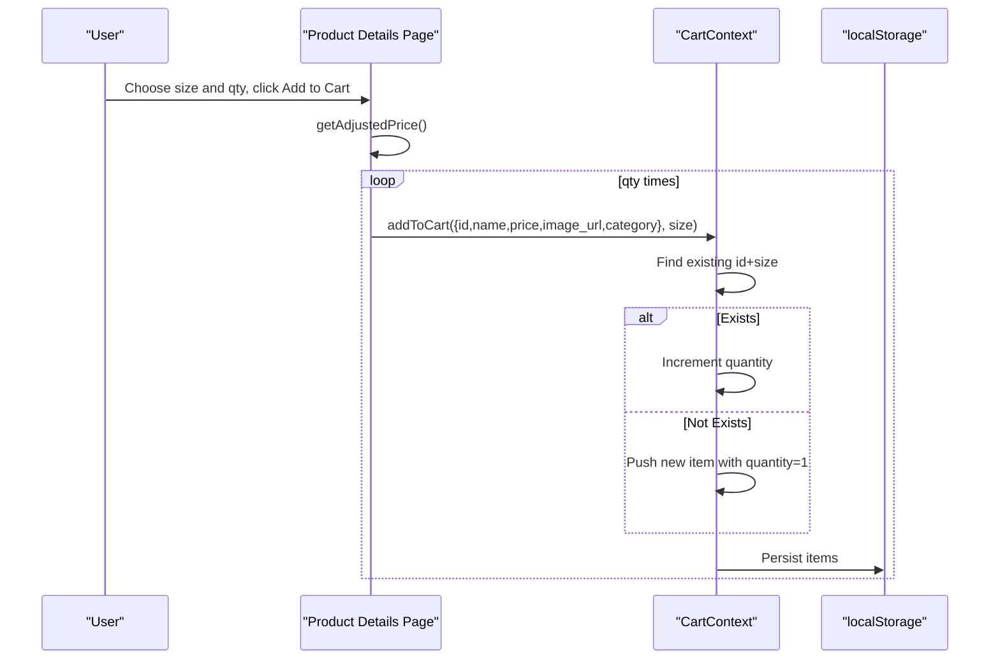
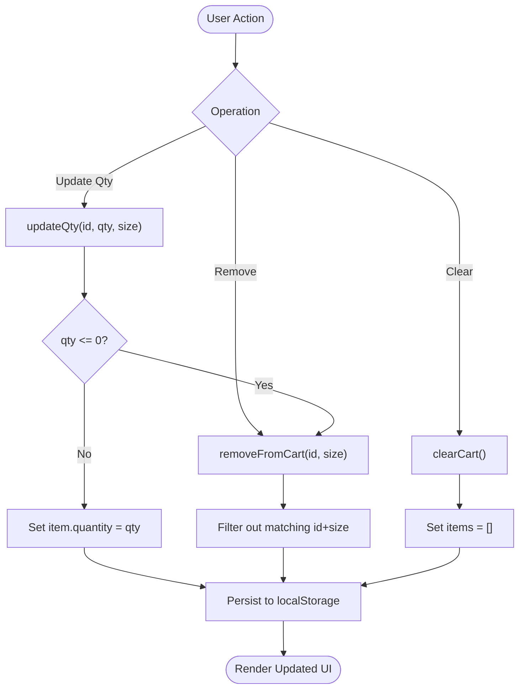
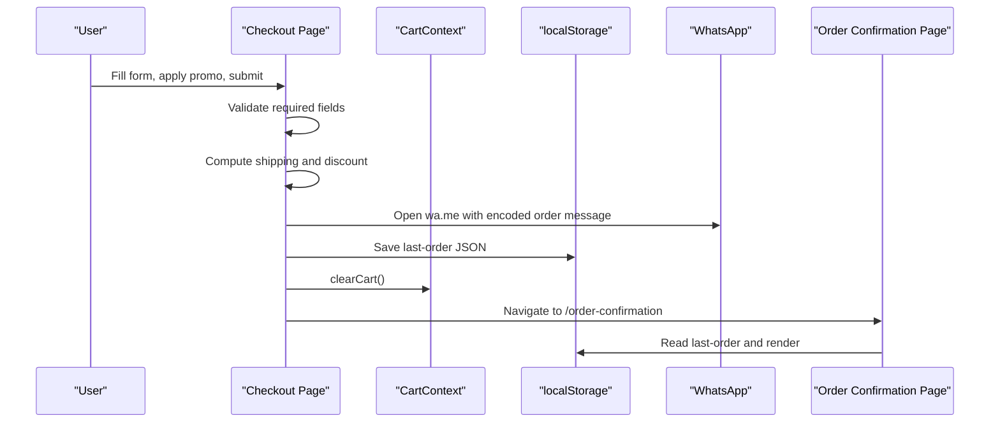
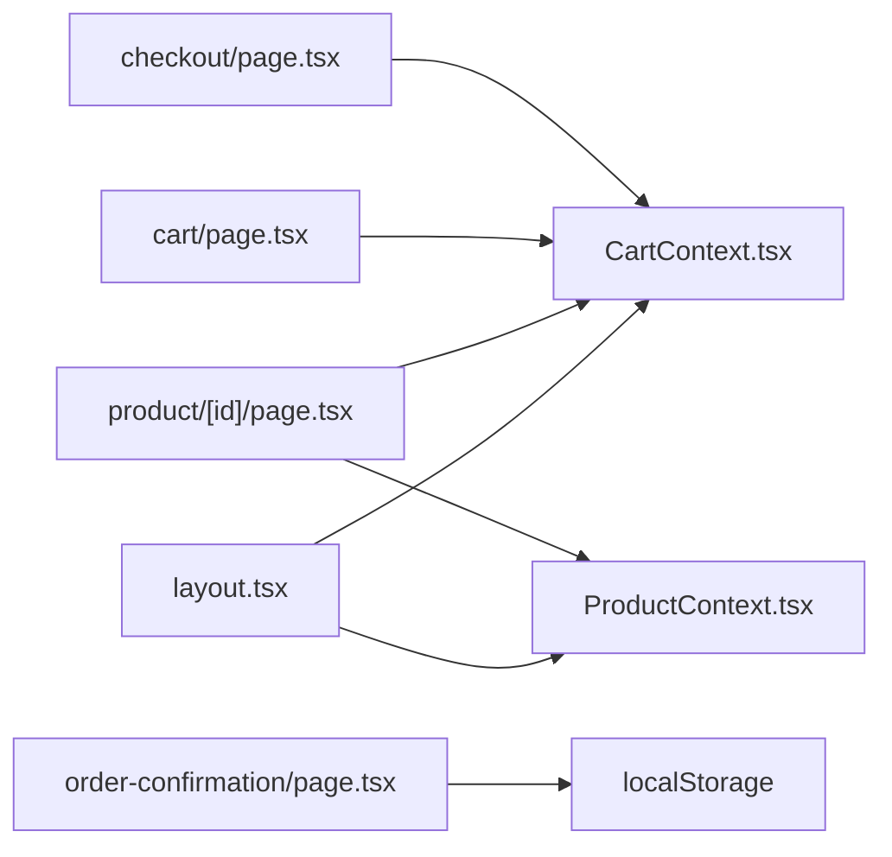

# Shopping Cart System

<cite>
**Referenced Files in This Document**
- [CartContext.tsx](file://app/context/CartContext.tsx)
- [layout.tsx](file://app/layout.tsx)
- [page.tsx (Product Details)](file://app/product/[id]/page.tsx)
- [page.tsx (Cart)](file://app/cart/page.tsx)
- [page.tsx (Checkout)](file://app/checkout/page.tsx)
- [page.tsx (Order Confirmation)](file://app/order-confirmation/page.tsx)
- [globals.css](file://app/globals.css)
</cite>

## Table of Contents
1. [Introduction](#introduction)
2. [Project Structure](#project-structure)
3. [Core Components](#core-components)
4. [Architecture Overview](#architecture-overview)
5. [Detailed Component Analysis](#detailed-component-analysis)
6. [Dependency Analysis](#dependency-analysis)
7. [Performance Considerations](#performance-considerations)
8. [Troubleshooting Guide](#troubleshooting-guide)
9. [Conclusion](#conclusion)

## Introduction
This document explains the Shopping Cart System implemented in a Next.js application. It covers cart state management using React Context with localStorage persistence, size variant handling for products, quantity management, and core cart operations (add/remove/update/clear). It also documents the checkout flow, order confirmation process, and how cart data persists across browser sessions. Examples include item manipulation patterns, price calculations, integration with the product catalog, and handling edge cases such as out-of-stock items, cart cleanup, and mobile-responsive interfaces.

## Project Structure
The shopping cart spans several pages and contexts:
- State and persistence live in a dedicated context provider.
- Product details page integrates with the cart to add items by selected size and quantity.
- Cart page renders items, updates quantities, removes items, clears the cart, and shows summary totals.
- Checkout page collects shipping/payment info, applies promo codes, calculates final totals, and submits orders via WhatsApp while persisting order details locally.
- Order confirmation reads the last order from local storage and displays it.

**Diagram sources**
- [layout.tsx:62-82](file://app/layout.tsx#L62-L82)
- [CartContext.tsx:28-97](file://app/context/CartContext.tsx#L28-L97)
- [page.tsx (Product Details):19-22](file://app/product/[id]/page.tsx#L19-L22)
- [page.tsx (Cart):10-12](file://app/cart/page.tsx#L10-L12)
- [page.tsx (Checkout):12-15](file://app/checkout/page.tsx#L12-L15)
- [page.tsx (Order Confirmation):9-18](file://app/order-confirmation/page.tsx#L9-L18)

**Section sources**
- [layout.tsx:62-82](file://app/layout.tsx#L62-L82)

## Core Components
- CartContext: Provides cart state (items, totalItems, totalPrice), actions (addToCart, removeFromCart, updateQty, clearCart, isInCart), and persistence to localStorage under a specific key.
- ProductDetailsPage: Integrates with the cart to add items with selected size and quantity; uses product sizes to compute adjusted price.
- CartPage: Displays cart items, allows quantity changes, removal, clearing, and shows order summary with shipping logic.
- CheckoutPage: Validates form inputs, supports promo code discount, computes final total, opens WhatsApp with formatted order message, clears cart, and navigates to confirmation.
- OrderConfirmationPage: Reads last order from localStorage and displays order details.

Key responsibilities:
- Cart state management and persistence
- Size-based item identity and pricing
- Quantity control and validation
- Shipping cost rules and promo discounts
- Order submission and confirmation display

**Section sources**
- [CartContext.tsx:5-24](file://app/context/CartContext.tsx#L5-L24)
- [CartContext.tsx:28-97](file://app/context/CartContext.tsx#L28-L97)
- [page.tsx (Product Details):169-188](file://app/product/[id]/page.tsx#L169-L188)
- [page.tsx (Cart):10-12](file://app/cart/page.tsx#L10-L12)
- [page.tsx (Checkout):12-15](file://app/checkout/page.tsx#L12-L15)
- [page.tsx (Order Confirmation):9-18](file://app/order-confirmation/page.tsx#L9-L18)

## Architecture Overview
The system is built around a client-side cart context that persists to localStorage. The root layout wraps the app with providers so all pages can access cart state. Product details fetches product data and integrates with the cart when adding items. Checkout orchestrates user input, promotions, shipping calculation, and order submission.

**Diagram sources**
- [page.tsx (Product Details):178-188](file://app/product/[id]/page.tsx#L178-L188)
- [CartContext.tsx:49-60](file://app/context/CartContext.tsx#L49-L60)
- [CartContext.tsx:42-47](file://app/context/CartContext.tsx#L42-L47)
- [page.tsx (Cart):91-132](file://app/cart/page.tsx#L91-L132)
- [page.tsx (Checkout):75-167](file://app/checkout/page.tsx#L75-L167)
- [page.tsx (Order Confirmation):13-18](file://app/order-confirmation/page.tsx#L13-L18)

## Detailed Component Analysis

### Cart Context and Persistence
- State shape: Array of cart items with id, name, price, image_url, category, quantity, and optional size.
- Identity model: Items are uniquely identified by id plus size. Adding an existing id+size increments quantity rather than duplicating entries.
- Actions:
  - addToCart(product, size?): Adds or increments item by id+size.
  - removeFromCart(id, size?): Removes matching item(s).
  - updateQty(id, qty, size?): Updates quantity; if qty <= 0, removes item.
  - clearCart(): Empties cart.
  - isInCart(id): Checks if any item with this id exists (ignores size).
- Derived values:
  - totalItems: Sum of quantities.
  - totalPrice: Sum of price × quantity for each item.
- Persistence:
  - On mount, loads items from localStorage under a specific key.
  - On change, writes updated items back to localStorage.
  - Uses hydration guard to avoid writing before initial load.

Complexity:
- addToCart: O(n) scan to find existing id+size, then map to update quantity.
- removeFromCart: O(n) filter.
- updateQty: O(n) map.
- clearCart: O(1) set empty.
- isInCart: O(n) some.

Edge cases handled:
- Default size parameter ensures consistent identity even if size not provided.
- Negative or zero quantity triggers removal.
- Hydration guard prevents early localStorage writes during SSR.

**Section sources**
- [CartContext.tsx:5-24](file://app/context/CartContext.tsx#L5-L24)
- [CartContext.tsx:28-47](file://app/context/CartContext.tsx#L28-L47)
- [CartContext.tsx:49-88](file://app/context/CartContext.tsx#L49-L88)

#### Class Diagram

**Diagram sources**
- [CartContext.tsx:5-24](file://app/context/CartContext.tsx#L5-L24)
- [CartContext.tsx:28-97](file://app/context/CartContext.tsx#L28-L97)

### Product Details Integration
- Fetches product data and related products.
- Manages selectedSize and qty state.
- Computes adjusted price based on selected size’s price if available.
- Adds to cart by calling addToCart with product info and selected size, repeated for qty times.
- Shows “In Cart” indicator using isInCart.

Price calculation:
- If product.sizes exist, use the price of the selected size; otherwise fallback to base product price.

Add-to-cart behavior:
- Repeated calls for qty ensure correct incrementing per size.

**Section sources**
- [page.tsx (Product Details):43-74](file://app/product/[id]/page.tsx#L43-L74)
- [page.tsx (Product Details):169-176](file://app/product/[id]/page.tsx#L169-L176)
- [page.tsx (Product Details):178-188](file://app/product/[id]/page.tsx#L178-L188)
- [page.tsx (Product Details):491-498](file://app/product/[id]/page.tsx#L491-L498)

#### Sequence Diagram: Add to Cart

**Diagram sources**
- [page.tsx (Product Details):169-188](file://app/product/[id]/page.tsx#L169-L188)
- [CartContext.tsx:49-60](file://app/context/CartContext.tsx#L49-L60)
- [CartContext.tsx:42-47](file://app/context/CartContext.tsx#L42-L47)

### Cart Page Operations
- Displays items list with images, names, categories, sizes, and per-item totals.
- Quantity controls call updateQty with current size.
- Remove button calls removeFromCart with id and size.
- Clear All button calls clearCart.
- Summary panel shows subtotal, shipping rule (free above threshold), and total including shipping.
- Promotional code input present but not applied here.

Shipping logic:
- Free shipping if totalPrice meets threshold; otherwise fixed shipping fee added to total.

Empty state:
- Shows a friendly message and link to explore collection.

**Section sources**
- [page.tsx (Cart):10-12](file://app/cart/page.tsx#L10-L12)
- [page.tsx (Cart):91-132](file://app/cart/page.tsx#L91-L132)
- [page.tsx (Cart):136-164](file://app/cart/page.tsx#L136-L164)
- [page.tsx (Cart):60-73](file://app/cart/page.tsx#L60-L73)

#### Flowchart: Cart Item Manipulation

**Diagram sources**
- [CartContext.tsx:68-80](file://app/context/CartContext.tsx#L68-L80)
- [CartContext.tsx:42-47](file://app/context/CartContext.tsx#L42-L47)

### Checkout Flow and Order Confirmation
- Redirects to cart if cart is empty.
- Collects shipping details and payment method.
- Supports promo code discount (fixed code).
- Calculates shipping cost and final total.
- Submits order by opening WhatsApp with a formatted message containing order details.
- Persists last-order to localStorage for confirmation page.
- Clears cart and navigates to order confirmation.

Promo code:
- Applies a percentage discount when a specific code is entered.

WhatsApp integration:
- Encodes message and opens wa.me link in a new tab.

Order confirmation:
- Reads last-order from localStorage and displays order ID, delivery address, items, and totals.

**Section sources**
- [page.tsx (Checkout):32-36](file://app/checkout/page.tsx#L32-L36)
- [page.tsx (Checkout):63-71](file://app/checkout/page.tsx#L63-L71)
- [page.tsx (Checkout):75-167](file://app/checkout/page.tsx#L75-L167)
- [page.tsx (Order Confirmation):13-18](file://app/order-confirmation/page.tsx#L13-L18)
- [page.tsx (Order Confirmation):71-133](file://app/order-confirmation/page.tsx#L71-L133)

#### Sequence Diagram: Checkout Submission

**Diagram sources**
- [page.tsx (Checkout):75-167](file://app/checkout/page.tsx#L75-L167)
- [page.tsx (Order Confirmation):13-18](file://app/order-confirmation/page.tsx#L13-L18)

### Mobile-Responsive Cart Interfaces
- Grid layouts switch to single column on smaller screens.
- Sticky summary becomes static on mobile.
- Cart item rows stack vertically with full-width images on small devices.
- Checkout grid stacks into a single column on mobile.

These behaviors are defined in global styles with media queries targeting breakpoints for tablets and phones.

**Section sources**
- [globals.css:2509-2590](file://app/globals.css#L2509-L2590)
- [globals.css:3024-3041](file://app/globals.css#L3024-L3041)
- [globals.css:3043-3062](file://app/globals.css#L3043-L3062)
- [globals.css:3735-3762](file://app/globals.css#L3735-L3762)

## Dependency Analysis
- Root layout wires up providers: CartProvider and ProductProvider wrap the entire app tree.
- ProductDetailsPage depends on both CartContext and Supabase for product data.
- CartPage and CheckoutPage depend on CartContext for state and actions.
- OrderConfirmationPage depends on localStorage for last-order data.

**Diagram sources**
- [layout.tsx:62-82](file://app/layout.tsx#L62-L82)
- [page.tsx (Product Details):19-22](file://app/product/[id]/page.tsx#L19-L22)
- [page.tsx (Cart):10-12](file://app/cart/page.tsx#L10-L12)
- [page.tsx (Checkout):12-15](file://app/checkout/page.tsx#L12-L15)
- [page.tsx (Order Confirmation):9-18](file://app/order-confirmation/page.tsx#L9-L18)

**Section sources**
- [layout.tsx:62-82](file://app/layout.tsx#L62-L82)

## Performance Considerations
- Cart operations are O(n) due to array scans; acceptable for typical cart sizes. For large carts, consider indexing by id+size for O(1) lookups.
- localStorage writes occur on every state change; batching updates could reduce I/O frequency.
- Price computations are simple reductions; negligible overhead.
- Avoid unnecessary re-renders by memoizing derived values where appropriate.

[No sources needed since this section provides general guidance]

## Troubleshooting Guide
Common issues and resolutions:
- Hydration mismatch: Ensure localStorage reads/writes only after hydration; the context guards writes until hydrated.
- Duplicate items: Verify size parameter is passed consistently when adding items; identity is id+size.
- Zero/negative quantity: updateQty removes items when qty <= 0; confirm callers clamp to minimum 1 if needed.
- Promo code errors: Only specific code is accepted; validate user input and provide feedback.
- Missing last-order: Confirm checkout saved last-order before navigation; check localStorage availability.

**Section sources**
- [CartContext.tsx:42-47](file://app/context/CartContext.tsx#L42-L47)
- [CartContext.tsx:68-78](file://app/context/CartContext.tsx#L68-L78)
- [page.tsx (Checkout):63-71](file://app/checkout/page.tsx#L63-L71)
- [page.tsx (Order Confirmation):13-18](file://app/order-confirmation/page.tsx#L13-L18)

## Conclusion
The Shopping Cart System leverages React Context for centralized state and localStorage for persistence, providing a robust foundation for managing cart items with size variants and quantities. The product details page integrates seamlessly with the cart, while the cart and checkout pages implement clear operations, shipping rules, and promotional discounts. The checkout flow submits orders via WhatsApp and persists order details for confirmation. Responsive styles ensure a good experience across devices. Future enhancements may include server-side order persistence, richer promo systems, and performance optimizations for larger carts.