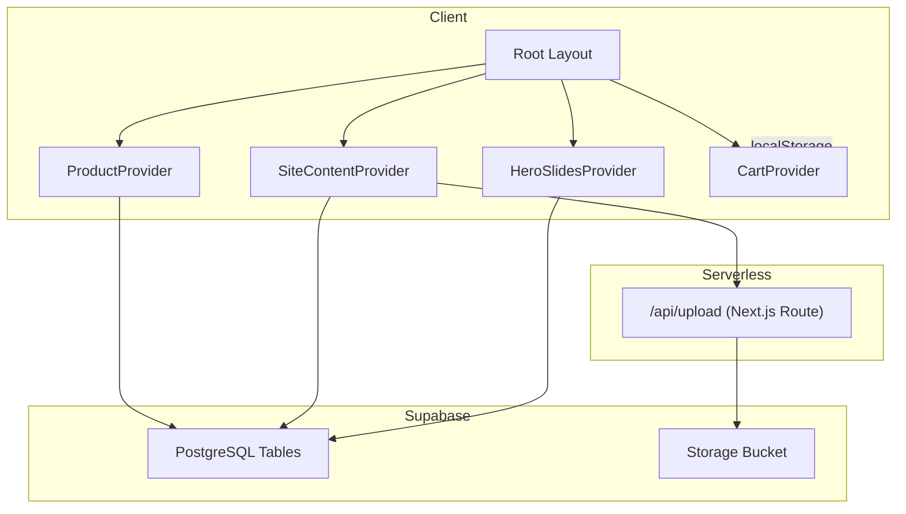
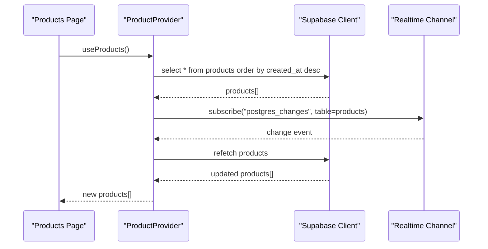
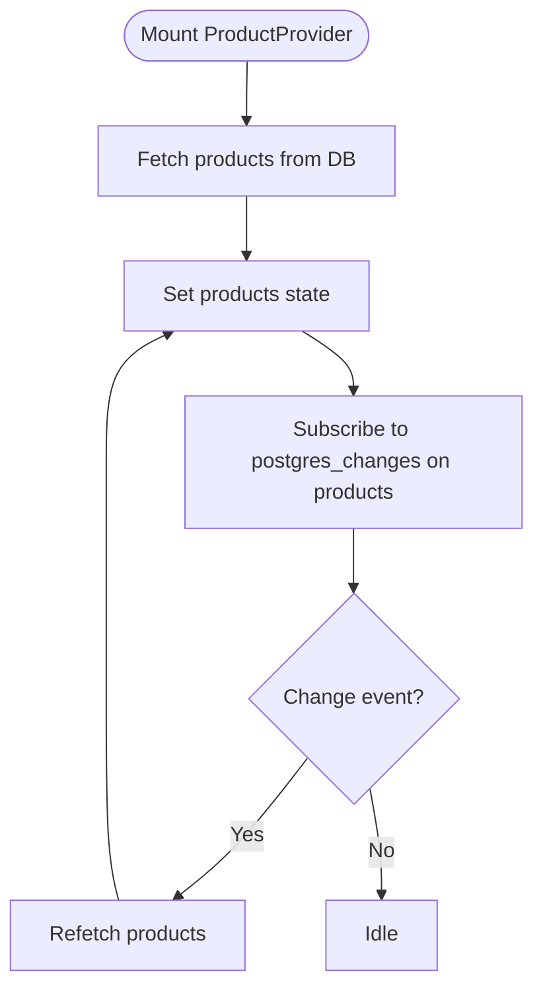
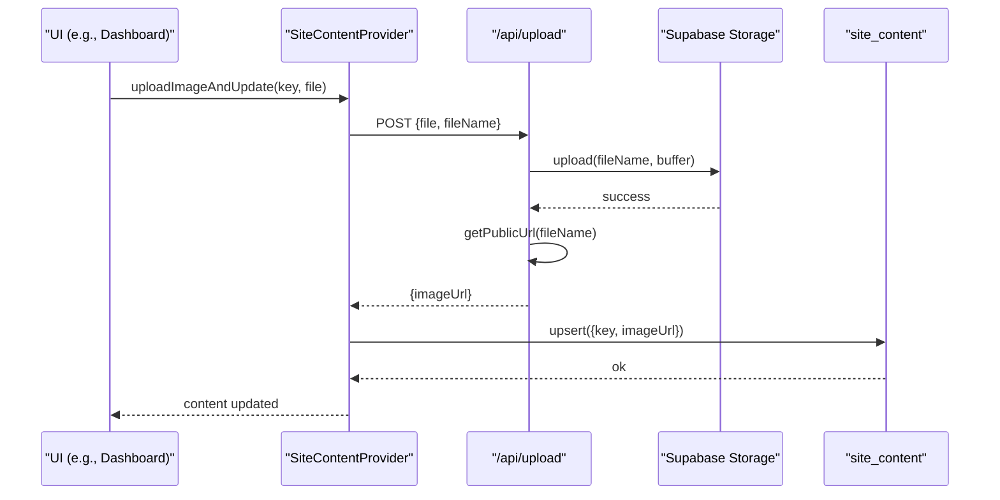
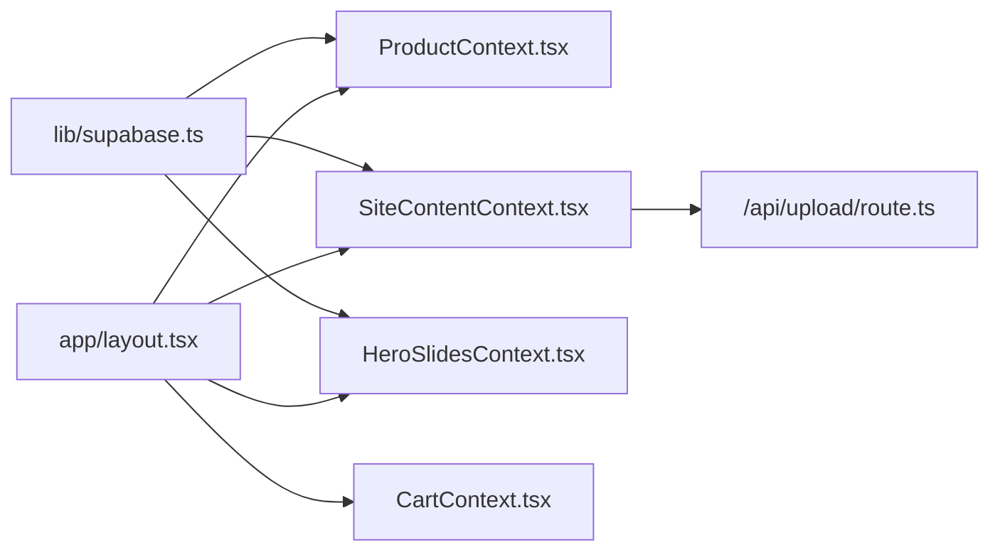

# Data Access Patterns

<cite>
**Referenced Files in This Document**
- [supabase.ts](file://lib/supabase.ts)
- [ProductContext.tsx](file://app/context/ProductContext.tsx)
- [SiteContentContext.tsx](file://app/context/SiteContentContext.tsx)
- [HeroSlidesContext.tsx](file://app/context/HeroSlidesContext.tsx)
- [CartContext.tsx](file://app/context/CartContext.tsx)
- [layout.tsx](file://app/layout.tsx)
- [route.ts](file://app/api/upload/route.ts)
- [page.tsx (products)](file://app/products/page.tsx)
- [page.tsx (product detail)](file://app/product/[id]/page.tsx)
- [supabase-setup.sql](file://supabase-setup.sql)
</cite>

## Table of Contents
1. [Introduction](#introduction)
2. [Project Structure](#project-structure)
3. [Core Components](#core-components)
4. [Architecture Overview](#architecture-overview)
5. [Detailed Component Analysis](#detailed-component-analysis)
6. [Dependency Analysis](#dependency-analysis)
7. [Performance Considerations](#performance-considerations)
8. [Troubleshooting Guide](#troubleshooting-guide)
9. [Conclusion](#conclusion)

## Introduction
This document explains the data access patterns used across the Nubia Perfume E-Commerce Platform. It covers Supabase client configuration, real-time subscriptions, CRUD operations for products, site content, and hero slides, caching strategies using React Context and localStorage, performance considerations such as lazy loading and pagination, and data synchronization and consistency patterns between client and server.

## Project Structure
Data access is centralized around a single Supabase client and several React Context providers that encapsulate business logic and state:

- Supabase client initialization and storage bucket name are defined in a shared module.
- Product data is managed by a context provider with real-time updates.
- Site content uses an upsert pattern with optimistic UI updates and server-backed image uploads via a Next.js API route.
- Hero slides provide CRUD and ordering utilities with fallback defaults.
- Cart state is persisted to localStorage and exposed through a context.
- The root layout composes all providers so they are available app-wide.

**Diagram sources**
- [layout.tsx:57-82](file://app/layout.tsx#L57-L82)
- [ProductContext.tsx:45-109](file://app/context/ProductContext.tsx#L45-L109)
- [SiteContentContext.tsx:22-103](file://app/context/SiteContentContext.tsx#L22-L103)
- [HeroSlidesContext.tsx:157-283](file://app/context/HeroSlidesContext.tsx#L157-L283)
- [CartContext.tsx:28-97](file://app/context/CartContext.tsx#L28-L97)
- [route.ts:4-66](file://app/api/upload/route.ts#L4-L66)

**Section sources**
- [layout.tsx:57-82](file://app/layout.tsx#L57-L82)

## Core Components
- Supabase client: Centralized configuration with environment validation and fallback credentials; exports a singleton client and storage bucket name.
- Product context: Fetches products, subscribes to real-time changes, and exposes add/update/delete helpers.
- Site content context: Loads key-value content, supports optimistic updates, and uploads images via a server-side route.
- Hero slides context: Manages active and ordered slides with local fallbacks and reordering logic.
- Cart context: Maintains cart items in memory and persists them to localStorage.

**Section sources**
- [supabase.ts:1-46](file://lib/supabase.ts#L1-L46)
- [ProductContext.tsx:45-109](file://app/context/ProductContext.tsx#L45-L109)
- [SiteContentContext.tsx:22-103](file://app/context/SiteContentContext.tsx#L22-L103)
- [HeroSlidesContext.tsx:157-283](file://app/context/HeroSlidesContext.tsx#L157-L283)
- [CartContext.tsx:28-97](file://app/context/CartContext.tsx#L28-L97)

## Architecture Overview
The application follows a layered architecture:
- Presentation layers (pages) consume data from contexts.
- Context providers encapsulate data fetching, mutations, and real-time subscriptions.
- A shared Supabase client handles database and storage interactions.
- A Next.js API route mediates file uploads to Supabase Storage.

**Diagram sources**
- [ProductContext.tsx:49-82](file://app/context/ProductContext.tsx#L49-L82)

## Detailed Component Analysis

### Supabase Client Configuration
- Reads environment variables for URL and anon key.
- Validates URL format and detects placeholder values.
- Falls back to demo credentials when env vars are missing or placeholders are detected.
- Exports a configured client instance and a constant for the storage bucket name.

Key behaviors:
- Safe initialization even without proper env setup.
- Single source of truth for Supabase client usage across the app.

**Section sources**
- [supabase.ts:1-46](file://lib/supabase.ts#L1-L46)

### Products Data Access
Responsibilities:
- Initial fetch of all products sorted by creation time.
- Real-time subscription to any product table changes to keep UI in sync.
- CRUD operations: add, update, delete with error handling and refetch on success.

Patterns:
- Centralized fetch function reused by both initial load and real-time triggers.
- Error logging on failures; user-facing errors thrown for callers to handle.
- Provider exposes a refetch helper for manual refresh.

**Diagram sources**
- [ProductContext.tsx:49-82](file://app/context/ProductContext.tsx#L49-L82)

CRUD operations:
- Add product: insert row then refetch.
- Update product: update by id then refetch.
- Delete product: delete by id then refetch.

Error handling:
- Errors from Supabase are logged and/or thrown to callers.

**Section sources**
- [ProductContext.tsx:45-109](file://app/context/ProductContext.tsx#L45-L109)

### Site Content Data Access
Responsibilities:
- Load site_content rows into a key-value map, merging with default translations.
- Provide get helper with fallback to defaults.
- Optimistic update for text fields before server confirmation.
- Image upload flow: client sends FormData to Next.js API route; route uploads to Supabase Storage and returns public URL; context saves URL via upsert.

Optimistic updates:
- Immediate UI update on update(key, value).
- On server error, throw to allow caller to revert UI if needed.

Image upload flow:
- Client constructs unique filename and posts to /api/upload.
- Server validates inputs, uploads to storage, retrieves public URL, and responds.
- Context persists the URL to site_content via upsert.

**Diagram sources**
- [SiteContentContext.tsx:71-96](file://app/context/SiteContentContext.tsx#L71-L96)
- [route.ts:4-66](file://app/api/upload/route.ts#L4-L66)

**Section sources**
- [SiteContentContext.tsx:22-103](file://app/context/SiteContentContext.tsx#L22-L103)
- [route.ts:4-66](file://app/api/upload/route.ts#L4-L66)

### Hero Slides Data Access
Responsibilities:
- Fetch slides ordered by sort_order; fall back to built-in defaults if empty or on error.
- Provide add, update, delete, reorder operations with immediate local state updates.
- Compute active slides list filtered and sorted for carousel display.

Reorder strategy:
- Swap sort_order values between two adjacent slides atomically using parallel updates.
- Immediately reflect new order in local state.

Fallback behavior:
- If no rows exist or query fails, defaults are used to ensure UI continuity.

**Section sources**
- [HeroSlidesContext.tsx:157-283](file://app/context/HeroSlidesContext.tsx#L157-L283)

### Cart Data Access and Persistence
Responsibilities:
- Maintain cart items in React state.
- Persist items to localStorage under a stable key.
- Provide addToCart, removeFromCart, updateQty, clearCart, isInCart helpers.
- Derive totalItems and totalPrice from current items.

Persistence details:
- Hydration on mount reads from localStorage.
- Writes to localStorage whenever items change after hydration.

**Section sources**
- [CartContext.tsx:28-97](file://app/context/CartContext.tsx#L28-L97)

### Database Schema and Policies
Tables:
- products: core product catalog with optional columns for notes, sizes, images, video_url, badge, gender.
- site_content: key-value store for dynamic text and media URLs.
- hero_slides: carousel slide definitions with multilingual fields and ordering.

Security:
- Row Level Security enabled on all tables.
- Public read/write policies for development/demo purposes.

Storage:
- Bucket named product-images must be created and set to public for uploads.

**Section sources**
- [supabase-setup.sql:1-137](file://supabase-setup.sql#L1-L137)

## Dependency Analysis
High-level dependencies:
- All contexts depend on the shared Supabase client.
- Site content depends on the upload API route for images.
- Pages consume contexts rather than calling Supabase directly, promoting separation of concerns.

**Diagram sources**
- [supabase.ts:1-46](file://lib/supabase.ts#L1-L46)
- [ProductContext.tsx:45-109](file://app/context/ProductContext.tsx#L45-L109)
- [SiteContentContext.tsx:22-103](file://app/context/SiteContentContext.tsx#L22-L103)
- [HeroSlidesContext.tsx:157-283](file://app/context/HeroSlidesContext.tsx#L157-L283)
- [CartContext.tsx:28-97](file://app/context/CartContext.tsx#L28-L97)
- [layout.tsx:57-82](file://app/layout.tsx#L57-L82)
- [route.ts:4-66](file://app/api/upload/route.ts#L4-L66)

**Section sources**
- [layout.tsx:57-82](file://app/layout.tsx#L57-L82)

## Performance Considerations

### Lazy Loading
- Images use Next.js Image component with appropriate sizes attributes to avoid over-fetching.
- Product detail page sets priority on the main image and defers thumbnails.

Recommendations:
- Continue using sizes and responsive breakpoints to minimize payload.
- Defer non-critical assets and animations until after first paint.

**Section sources**
- [page.tsx (product detail):309-325](file://app/product/[id]/page.tsx#L309-L325)

### Pagination and Efficient Querying
Current state:
- Products are fetched in full and sorted client-side.
- Hero slides are fully loaded and filtered locally.

Recommendations:
- Implement server-side pagination for products using limit/offset or cursor-based pagination.
- Use selective field projection (select only needed columns) to reduce payload size.
- For hero slides, consider fetching only active slides if the dataset grows.

[No sources needed since this section provides general guidance]

### Caching Strategies
- Cart persistence via localStorage ensures offline availability of cart state.
- Site content merges defaults with server data, providing resilient UI during network issues.
- Hero slides fallback to defaults when DB is unavailable or empty.

Recommendations:
- Introduce a short-lived in-memory cache layer within contexts to avoid redundant refetches.
- Consider SWR or React Query for automatic caching, retries, and background refetching.

**Section sources**
- [CartContext.tsx:32-47](file://app/context/CartContext.tsx#L32-L47)
- [SiteContentContext.tsx:27-44](file://app/context/SiteContentContext.tsx#L27-L44)
- [HeroSlidesContext.tsx:161-182](file://app/context/HeroSlidesContext.tsx#L161-L182)

### Real-time Synchronization
- ProductProvider subscribes to all changes on the products table and refetches on events.
- This keeps multiple components synchronized without polling.

Recommendations:
- Narrow the subscription to specific events (insert, update, delete) if noise becomes an issue.
- Debounce rapid successive changes to avoid excessive refetches.

**Section sources**
- [ProductContext.tsx:64-82](file://app/context/ProductContext.tsx#L64-L82)

### Offline Support Considerations
- Cart works offline due to localStorage persistence.
- Other features rely on live connectivity; consider queueing writes and syncing when online.

Recommendations:
- Implement a write queue for critical actions (e.g., orders) and reconcile on reconnect.
- Show explicit offline indicators and disable destructive actions when offline.

[No sources needed since this section provides general guidance]

## Troubleshooting Guide

Common issues and resolutions:
- Missing or placeholder environment variables:
  - Symptom: Console info about fallback credentials; dashboard warnings.
  - Resolution: Ensure NEXT_PUBLIC_SUPABASE_URL and NEXT_PUBLIC_SUPABASE_ANON_KEY are set correctly in .env.local and restart dev server.

- Upload failures:
  - Symptom: Upload API returns error JSON.
  - Resolution: Verify product-images bucket exists and is public; check file type and size limits; inspect server logs.

- Real-time not updating:
  - Symptom: Changes in dashboard do not reflect on frontend immediately.
  - Resolution: Confirm RLS policies allow realtime events; verify channel subscription is active; check browser console for errors.

- Empty hero slides:
  - Symptom: Carousel shows defaults instead of DB data.
  - Resolution: Ensure hero_slides table has rows; confirm RLS allows select; validate sort_order values.

**Section sources**
- [supabase.ts:35-39](file://lib/supabase.ts#L35-L39)
- [route.ts:43-65](file://app/api/upload/route.ts#L43-L65)
- [supabase-setup.sql:17-33](file://supabase-setup.sql#L17-L33)
- [supabase-setup.sql:66-82](file://supabase-setup.sql#L66-L82)
- [supabase-setup.sql:112-133](file://supabase-setup.sql#L112-L133)

## Conclusion
The platform employs a clean separation of concerns with a shared Supabase client and focused context providers. Real-time updates keep product listings consistent, while optimistic updates and fallbacks improve perceived performance and resilience. LocalStorage-backed cart state enables basic offline support. To scale further, adopt server-side pagination, selective projections, and robust caching/retry mechanisms.