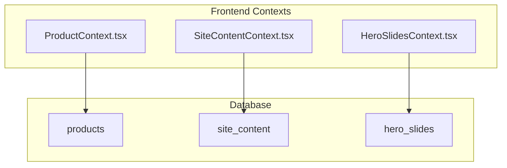
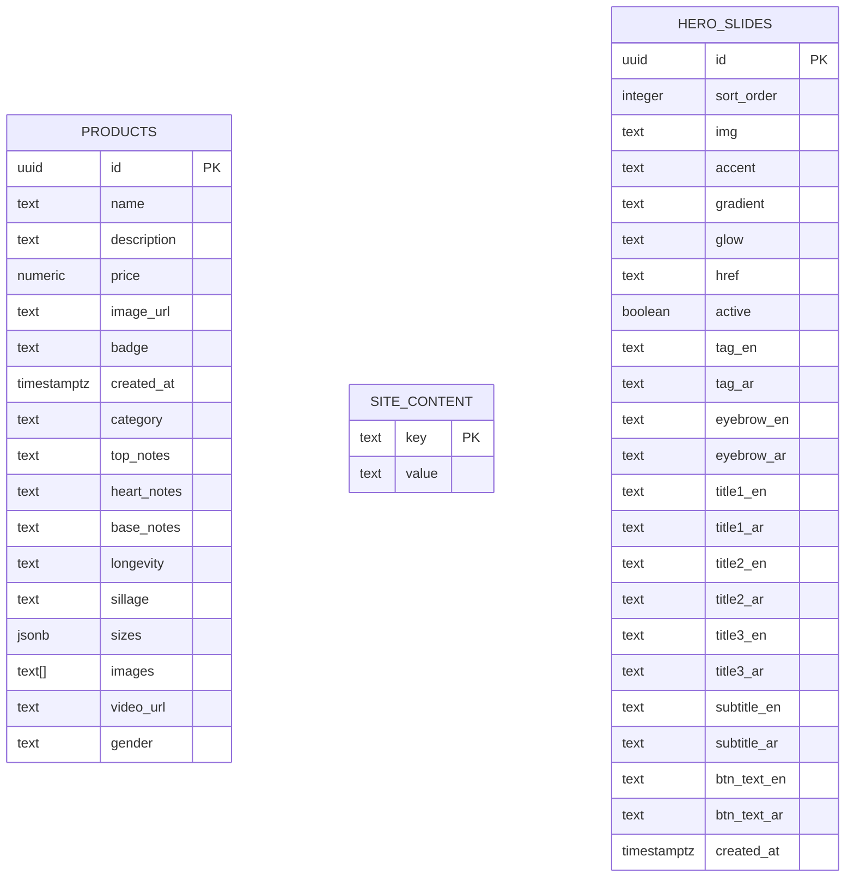
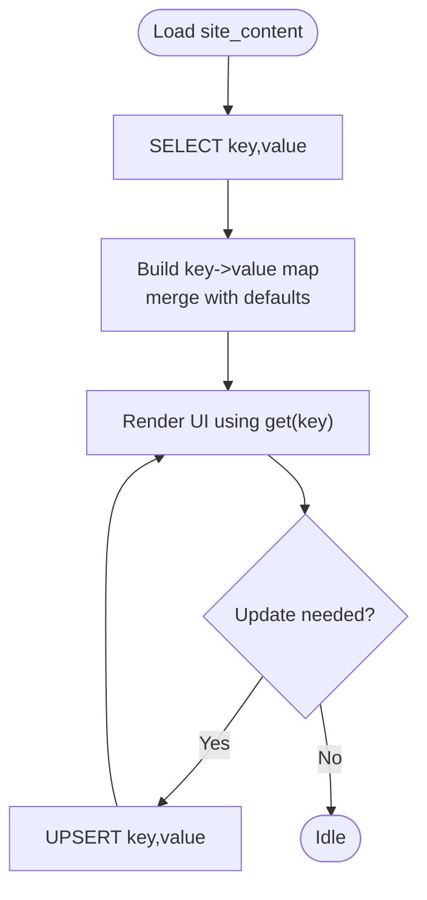
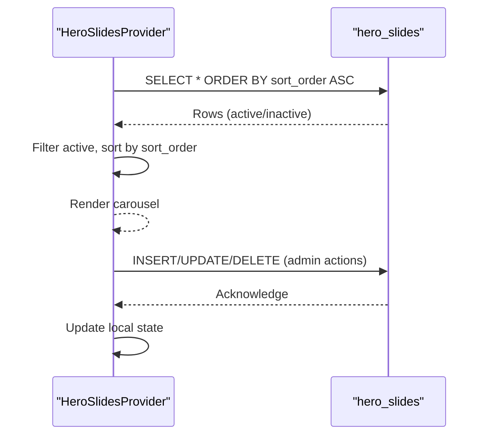
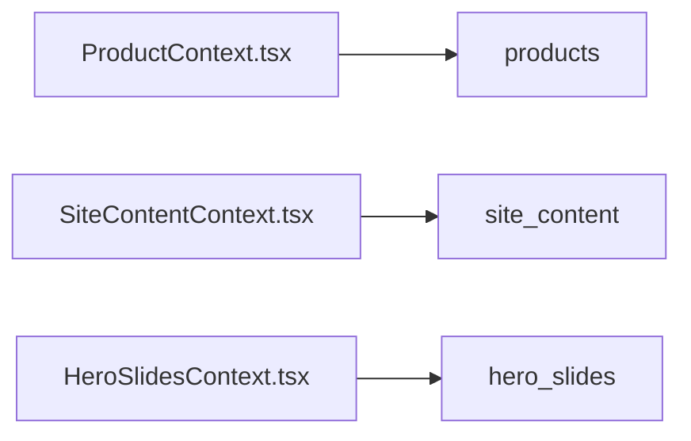

# Schema Structure

<cite>
**Referenced Files in This Document**
- [supabase-setup.sql](file://supabase-setup.sql)
- [ProductContext.tsx](file://app/context/ProductContext.tsx)
- [SiteContentContext.tsx](file://app/context/SiteContentContext.tsx)
- [HeroSlidesContext.tsx](file://app/context/HeroSlidesContext.tsx)
</cite>

## Table of Contents
1. [Introduction](#introduction)
2. [Project Structure](#project-structure)
3. [Core Components](#core-components)
4. [Architecture Overview](#architecture-overview)
5. [Detailed Component Analysis](#detailed-component-analysis)
6. [Dependency Analysis](#dependency-analysis)
7. [Performance Considerations](#performance-considerations)
8. [Troubleshooting Guide](#troubleshooting-guide)
9. [Conclusion](#conclusion)

## Introduction
This document describes the database schema for the Nubia Perfume E-Commerce Platform, focusing on three core tables: products, site_content, and hero_slides. It details field definitions, data types, constraints, validation rules, indexes, relationships, and migration strategy using idempotent ALTER TABLE statements. It also explains how JSONB and text[] arrays are used to model product sizes and images, and provides diagrams that map directly to the source files.

## Project Structure
The database schema is defined in a single SQL setup file and consumed by React contexts that perform CRUD operations via Supabase. The key files are:
- Database schema and migrations: supabase-setup.sql
- Product data access layer: app/context/ProductContext.tsx
- Site content management: app/context/SiteContentContext.tsx
- Hero slides management: app/context/HeroSlidesContext.tsx



**Diagram sources**
- [supabase-setup.sql:7-15](file://supabase-setup.sql#L7-L15)
- [supabase-setup.sql:61-64](file://supabase-setup.sql#L61-L64)
- [supabase-setup.sql:86-110](file://supabase-setup.sql#L86-L110)
- [ProductContext.tsx:49-82](file://app/context/ProductContext.tsx#L49-L82)
- [SiteContentContext.tsx:26-48](file://app/context/SiteContentContext.tsx#L26-L48)
- [HeroSlidesContext.tsx:161-186](file://app/context/HeroSlidesContext.tsx#L161-L186)

**Section sources**
- [supabase-setup.sql:1-137](file://supabase-setup.sql#L1-L137)
- [ProductContext.tsx:1-116](file://app/context/ProductContext.tsx#L1-L116)
- [SiteContentContext.tsx:1-110](file://app/context/SiteContentContext.tsx#L1-L110)
- [HeroSlidesContext.tsx:1-290](file://app/context/HeroSlidesContext.tsx#L1-L290)

## Core Components
This section summarizes each table’s purpose and its role in the application.

- products: Stores fragrance items with pricing, media, notes, sizing options, and gender classification. Supports real-time updates and rich metadata via JSONB and arrays.
- site_content: Key-value store for dynamic UI text and image URLs, enabling localized and editable content without redeployments.
- hero_slides: Manages carousel entries with multilingual labels, styling hints, and ordering.

**Section sources**
- [supabase-setup.sql:7-15](file://supabase-setup.sql#L7-L15)
- [supabase-setup.sql:61-64](file://supabase-setup.sql#L61-L64)
- [supabase-setup.sql:86-110](file://supabase-setup.sql#L86-L110)
- [ProductContext.tsx:14-32](file://app/context/ProductContext.tsx#L14-L32)
- [SiteContentContext.tsx:10-18](file://app/context/SiteContentContext.tsx#L10-L18)
- [HeroSlidesContext.tsx:13-37](file://app/context/HeroSlidesContext.tsx#L13-L37)

## Architecture Overview
The schema supports a simple, flat structure with no foreign keys between these three tables. Relationships are logical rather than enforced at the database level. Data flows from the database to the frontend contexts, which render UI and allow admin edits through the dashboard.



**Diagram sources**
- [supabase-setup.sql:7-15](file://supabase-setup.sql#L7-L15)
- [supabase-setup.sql:42-56](file://supabase-setup.sql#L42-L56)
- [supabase-setup.sql:61-64](file://supabase-setup.sql#L61-L64)
- [supabase-setup.sql:86-110](file://supabase-setup.sql#L86-L110)

## Detailed Component Analysis

### Products Table
Purpose: Represents perfume products with rich attributes including olfactory notes, performance characteristics, media, and flexible sizing options.

Fields and constraints:
- id: uuid, primary key, default generated
- name: text, not null
- description: text, not null
- price: numeric, not null, check (price > 0)
- image_url: text, not null
- badge: text, nullable
- created_at: timestamptz, default now()
- category: text, default 'Oud & Woody'
- top_notes: text, default 'Bergamot, Mandarin'
- heart_notes: text, default 'Lavender, Jasmine'
- base_notes: text, default 'Oud, Amber, Patchouli'
- longevity: text, default 'Very Long Lasting (8h-12h)'
- sillage: text, default 'Strong'
- sizes: jsonb, nullable
- images: text[], nullable
- video_url: text, nullable
- gender: text, default 'unisex', check (gender in ('men','women','unisex'))

Indexes:
- Primary key index on id
- No additional explicit indexes defined

Validation rules:
- price must be greater than zero
- gender restricted to 'men', 'women', or 'unisex'

JSONB usage (sizes):
- Expected shape: array of objects with size and price fields
- Example structure: [{"size": "50ml", "price": 120}, {"size": "100ml", "price": 200}]

Text[] usage (images):
- Array of image URL strings
- Example structure: ["https://.../img1.jpg", "https://.../img2.jpg"]

Relationships:
- No foreign keys; relationships are conceptual only

Row Level Security (RLS):
- Enabled with policies allowing public select, insert, and delete

Migration strategy:
- Uses ALTER TABLE ... ADD COLUMN IF NOT EXISTS for backward compatibility
- Adds new columns with defaults where applicable
- Adds a check constraint for gender enum values

Frontend integration:
- TypeScript interface mirrors DB fields
- Real-time subscription refreshes UI on changes

```mermaid
classDiagram
class Product {
+string id
+string name
+string description
+number price
+string image_url
+string badge
+string category
+string top_notes
+string heart_notes
+string base_notes
+string longevity
+string sillage
+{ size : string; price : number }[] sizes
+string[] images
+string video_url
+string gender
+string created_at
}
```

**Diagram sources**
- [ProductContext.tsx:14-32](file://app/context/ProductContext.tsx#L14-L32)
- [supabase-setup.sql:7-15](file://supabase-setup.sql#L7-L15)
- [supabase-setup.sql:42-56](file://supabase-setup.sql#L42-L56)

**Section sources**
- [supabase-setup.sql:7-15](file://supabase-setup.sql#L7-L15)
- [supabase-setup.sql:42-56](file://supabase-setup.sql#L42-L56)
- [ProductContext.tsx:14-32](file://app/context/ProductContext.tsx#L14-L32)

### Site Content Table
Purpose: Key-value store for dynamic text and image URLs used across the site, enabling non-developers to update copy and assets.

Fields and constraints:
- key: text, primary key
- value: text, not null

Indexes:
- Primary key index on key

Validation rules:
- None beyond not null on value

Usage patterns:
- Frontend loads all rows into a map keyed by key
- Upsert operation ensures idempotent updates
- Image uploads write a public URL into the value column

RLS:
- Enabled with policies allowing public select, insert, and update



**Diagram sources**
- [SiteContentContext.tsx:26-48](file://app/context/SiteContentContext.tsx#L26-L48)
- [SiteContentContext.tsx:56-69](file://app/context/SiteContentContext.tsx#L56-L69)
- [supabase-setup.sql:61-64](file://supabase-setup.sql#L61-L64)

**Section sources**
- [supabase-setup.sql:61-64](file://supabase-setup.sql#L61-L64)
- [SiteContentContext.tsx:26-48](file://app/context/SiteContentContext.tsx#L26-L48)
- [SiteContentContext.tsx:56-69](file://app/context/SiteContentContext.tsx#L56-L69)

### Hero Slides Table
Purpose: Stores carousel slide records with multilingual labels, visual hints, and ordering.

Fields and constraints:
- id: uuid, primary key, default generated
- sort_order: integer, not null, default 0
- img: text, not null
- accent: text, not null, default 'rgba(165,110,60,0.6)'
- gradient: text, not null, default 'linear-gradient(...)'
- glow: text, not null, default 'rgba(200,140,80,0.35)'
- href: text, not null, default '/products'
- active: boolean, not null, default true
- tag_en/tag_ar: text, not null, default ''
- eyebrow_en/eyebrow_ar: text, not null, default ''
- title1_en/title1_ar: text, not null, default ''
- title2_en/title2_ar: text, not null, default ''
- title3_en/title3_ar: text, not null, default ''
- subtitle_en/subtitle_ar: text, not null, default ''
- btn_text_en/btn_text_ar: text, not null, default 'Explore Collection'/'استكشف الكولكشن'
- created_at: timestamptz, default now()

Indexes:
- Primary key index on id
- Ordering relies on sort_order; no explicit index defined

Validation rules:
- None beyond not null and defaults

RLS:
- Enabled with policies allowing public select, insert, update, delete

Frontend behavior:
- Loads slides ordered by sort_order
- Filters to active slides for display
- Supports add/update/delete/reorder operations



**Diagram sources**
- [HeroSlidesContext.tsx:161-186](file://app/context/HeroSlidesContext.tsx#L161-L186)
- [HeroSlidesContext.tsx:188-260](file://app/context/HeroSlidesContext.tsx#L188-L260)
- [supabase-setup.sql:86-110](file://supabase-setup.sql#L86-L110)

**Section sources**
- [supabase-setup.sql:86-110](file://supabase-setup.sql#L86-L110)
- [HeroSlidesContext.tsx:161-186](file://app/context/HeroSlidesContext.tsx#L161-L186)
- [HeroSlidesContext.tsx:188-260](file://app/context/HeroSlidesContext.tsx#L188-L260)

## Dependency Analysis
There are no foreign key relationships among the three tables. Dependencies are conceptual:
- Products depend on external storage for images and videos (referenced by URLs).
- Site content and hero slides are independent configuration tables.
- Frontend contexts depend on these tables for rendering and editing.



**Diagram sources**
- [ProductContext.tsx:49-82](file://app/context/ProductContext.tsx#L49-L82)
- [SiteContentContext.tsx:26-48](file://app/context/SiteContentContext.tsx#L26-L48)
- [HeroSlidesContext.tsx:161-186](file://app/context/HeroSlidesContext.tsx#L161-L186)
- [supabase-setup.sql:7-15](file://supabase-setup.sql#L7-L15)
- [supabase-setup.sql:61-64](file://supabase-setup.sql#L61-L64)
- [supabase-setup.sql:86-110](file://supabase-setup.sql#L86-L110)

**Section sources**
- [supabase-setup.sql:7-15](file://supabase-setup.sql#L7-L15)
- [supabase-setup.sql:61-64](file://supabase-setup.sql#L61-L64)
- [supabase-setup.sql:86-110](file://supabase-setup.sql#L86-L110)
- [ProductContext.tsx:49-82](file://app/context/ProductContext.tsx#L49-L82)
- [SiteContentContext.tsx:26-48](file://app/context/SiteContentContext.tsx#L26-L48)
- [HeroSlidesContext.tsx:161-186](file://app/context/HeroSlidesContext.tsx#L161-L186)

## Performance Considerations
- Indexing: Only primary key indexes exist. For frequently filtered or sorted columns (e.g., products.gender, hero_slides.sort_order), consider adding indexes if query volume grows.
- RLS overhead: Policies are permissive; ensure they remain minimal and efficient.
- Large arrays: Storing many image URLs in text[] can grow row size; consider pagination or lazy loading on the client.
- JSONB queries: If filtering by sizes elements becomes common, consider GIN indexes on sizes.

[No sources needed since this section provides general guidance]

## Troubleshooting Guide
Common issues and resolutions:
- Missing tables: Ensure supabase-setup.sql has been executed. The script uses CREATE TABLE IF NOT EXISTS and ALTER TABLE ... IF NOT EXISTS for safe re-runs.
- Validation errors:
  - Inserting products with price <= 0 will fail due to check constraint.
  - Setting gender to an invalid value will fail due to check constraint.
- RLS policy errors: Verify policies are enabled for the intended roles.
- Hero slides not appearing: Check active flag and sort_order; ensure at least one slide is active.
- Site content not updating: Confirm upsert target key exists and permissions allow insert/update.

**Section sources**
- [supabase-setup.sql:11-11](file://supabase-setup.sql#L11-L11)
- [supabase-setup.sql:55-56](file://supabase-setup.sql#L55-L56)
- [supabase-setup.sql:17-32](file://supabase-setup.sql#L17-L32)
- [supabase-setup.sql:66-81](file://supabase-setup.sql#L66-L81)
- [supabase-setup.sql:112-130](file://supabase-setup.sql#L112-L130)

## Conclusion
The schema is intentionally simple and extensible, leveraging JSONB and arrays for flexible product metadata while maintaining strong validation for critical fields like price and gender. Migration safety is ensured through idempotent ALTER TABLE statements. The frontend contexts provide straightforward CRUD operations and real-time updates, making it easy to manage content and products without complex backend logic.

[No sources needed since this section summarizes without analyzing specific files]