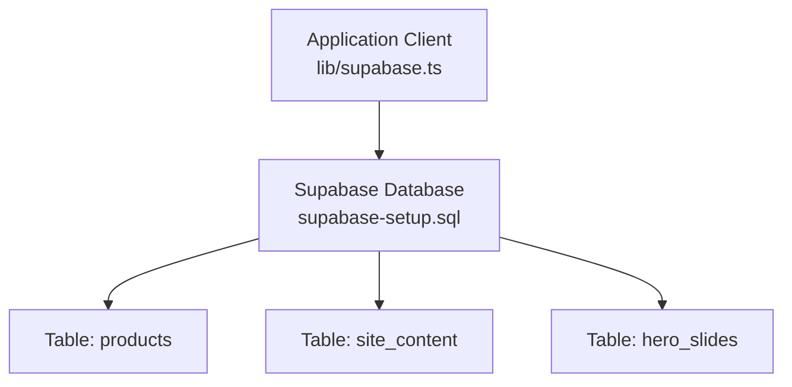
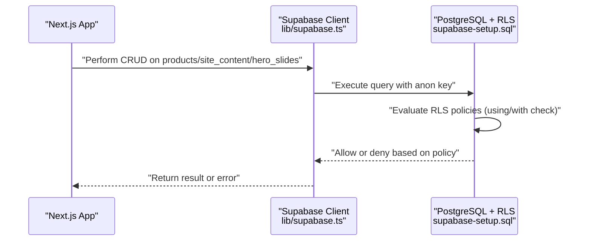
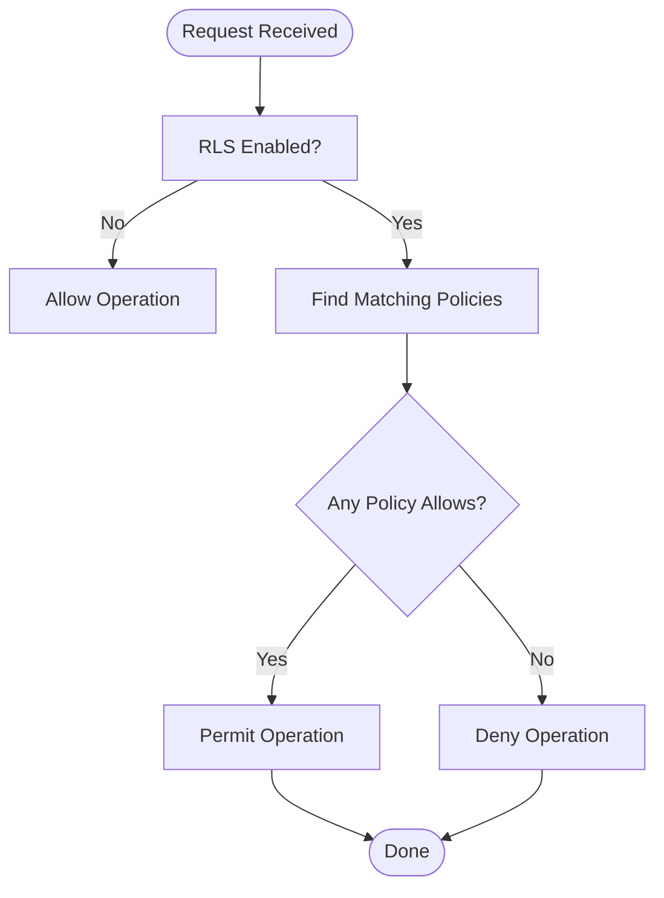
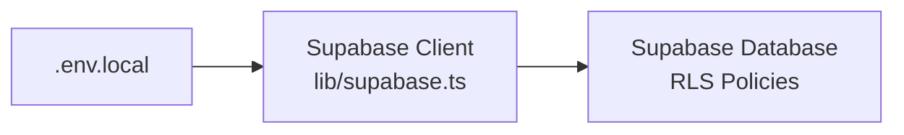

# Security Policies

<cite>
**Referenced Files in This Document**
- [supabase-setup.sql](file://supabase-setup.sql)
- [README.md](file://README.md)
- [lib/supabase.ts](file://lib/supabase.ts)
</cite>

## Table of Contents
1. [Introduction](#introduction)
2. [Project Structure](#project-structure)
3. [Core Components](#core-components)
4. [Architecture Overview](#architecture-overview)
5. [Detailed Component Analysis](#detailed-component-analysis)
6. [Dependency Analysis](#dependency-analysis)
7. [Performance Considerations](#performance-considerations)
8. [Troubleshooting Guide](#troubleshooting-guide)
9. [Conclusion](#conclusion)
10. [Appendices](#appendices)

## Introduction
This document explains the Row Level Security (RLS) policies implemented for the Supabase database used by this project. It focuses on three tables: products, site_content, and hero_slides. The security model intentionally allows public access for select, insert, update, and delete operations to support a demo/admin use case without authentication. We also explain the rationale behind this approach, outline production-grade security considerations, document grant statements for anon, authenticated, and service_role users, and provide guidance for extending policies as future authentication requirements emerge.

## Project Structure
The RLS configuration is defined in a single SQL setup file that creates the tables, enables RLS, defines per-table policies, and grants privileges. The application uses a Supabase client configured with environment variables and falls back to placeholder credentials when not provided.

**Diagram sources**
- [lib/supabase.ts:1-46](file://lib/supabase.ts#L1-L46)
- [supabase-setup.sql:1-137](file://supabase-setup.sql#L1-L137)

**Section sources**
- [supabase-setup.sql:1-137](file://supabase-setup.sql#L1-L137)
- [lib/supabase.ts:1-46](file://lib/supabase.ts#L1-L46)
- [README.md:17-36](file://README.md#L17-L36)

## Core Components
- products table:
  - RLS enabled.
  - Public policies allow select, insert, and delete.
- site_content table:
  - RLS enabled.
  - Public policies allow select, insert, and update.
- hero_slides table:
  - RLS enabled.
  - Public policies allow select, insert, update, and delete.
  - Explicit privilege grants to anon, authenticated, and service_role for all four operations.

These policies are designed for a demo/admin scenario where unauthenticated access is acceptable. In production, these should be replaced with identity-aware policies.

**Section sources**
- [supabase-setup.sql:17-32](file://supabase-setup.sql#L17-L32)
- [supabase-setup.sql:66-81](file://supabase-setup.sql#L66-L81)
- [supabase-setup.sql:112-133](file://supabase-setup.sql#L112-L133)

## Architecture Overview
At runtime, the Next.js app connects to Supabase using an anonymous key and performs CRUD operations against the three tables. Because RLS is enabled and permissive policies exist, any client can read and write data unless additional constraints are added.

**Diagram sources**
- [lib/supabase.ts:1-46](file://lib/supabase.ts#L1-L46)
- [supabase-setup.sql:17-32](file://supabase-setup.sql#L17-L32)
- [supabase-setup.sql:66-81](file://supabase-setup.sql#L66-L81)
- [supabase-setup.sql:112-133](file://supabase-setup.sql#L112-L133)

## Detailed Component Analysis

### Products Table Security Model
- RLS is enabled.
- Policies:
  - Select: public allowed.
  - Insert: public allowed.
  - Delete: public allowed.
- No explicit grant statement is present for products; default PostgreSQL role behavior applies.

Rationale:
- Allows the storefront and admin UI to manage product catalog without requiring user login.

Production considerations:
- Replace public policies with identity-based checks (e.g., restrict inserts/deletes to authenticated admins).
- Add row ownership or role-based conditions.

**Section sources**
- [supabase-setup.sql:17-32](file://supabase-setup.sql#L17-L32)

### Site Content Table Security Model
- RLS is enabled.
- Policies:
  - Select: public allowed.
  - Insert: public allowed.
  - Update: public allowed.
- No explicit grant statement is present for site_content; default PostgreSQL role behavior applies.

Rationale:
- Enables dynamic content updates from the dashboard without authentication.

Production considerations:
- Restrict writes to authenticated roles.
- Validate inputs via triggers or stored procedures if needed.

**Section sources**
- [supabase-setup.sql:66-81](file://supabase-setup.sql#L66-L81)

### Hero Slides Table Security Model
- RLS is enabled.
- Policies:
  - Select: public allowed.
  - Insert: public allowed.
  - Update: public allowed.
  - Delete: public allowed.
- Privilege grants:
  - All four operations granted to anon, authenticated, and service_role.

Rationale:
- Supports full admin management of carousel slides without authentication.

Production considerations:
- Remove anon grants for write operations.
- Limit service_role usage to server-side functions only.

**Section sources**
- [supabase-setup.sql:112-133](file://supabase-setup.sql#L112-L133)

### Policy Evaluation Order and Behavior
- When RLS is enabled, every query is evaluated against matching policies.
- For SELECT, at least one policy must allow the row to be visible.
- For INSERT, at least one policy must allow the new row to be inserted.
- For UPDATE/DELETE, at least one policy must allow the operation on the target rows.
- If no policy matches or all policies deny, the operation fails.

[No sources needed since this diagram shows conceptual workflow, not actual code structure]

### Extending Security Policies for Future Authentication
Recommended steps:
- Introduce user identity checks:
  - Use request context variables (e.g., JWT claims) to enforce ownership or role-based access.
- Separate roles:
  - Admins vs. end-users with distinct permissions.
- Narrow grants:
  - Revoke unnecessary privileges from anon and limit service_role to trusted server-side code.
- Input validation:
  - Add CHECK constraints and triggers to sanitize and validate data.
- Auditability:
  - Log changes to sensitive tables and track who made modifications.

Example patterns to consider:
- Require authenticated users for insert/update/delete.
- Restrict deletes to specific roles.
- Enforce row-level ownership (e.g., only the creator can modify their rows).

[No sources needed since this section provides general guidance]

## Dependency Analysis
The application’s Supabase client is configured with environment variables and falls back to placeholder values when missing. This impacts how requests are authenticated at the database layer.

**Diagram sources**
- [lib/supabase.ts:1-46](file://lib/supabase.ts#L1-L46)
- [supabase-setup.sql:17-32](file://supabase-setup.sql#L17-L32)
- [supabase-setup.sql:66-81](file://supabase-setup.sql#L66-L81)
- [supabase-setup.sql:112-133](file://supabase-setup.sql#L112-L133)

**Section sources**
- [lib/supabase.ts:1-46](file://lib/supabase.ts#L1-L46)
- [README.md:25-36](file://README.md#L25-L36)

## Performance Considerations
- RLS adds minimal overhead but introduces policy evaluation per query. Keep policies simple and avoid expensive function calls inside them.
- Prefer targeted queries (select specific columns, filter rows) to reduce processing.
- Index frequently filtered columns (e.g., sort_order in hero_slides) to improve query performance.

[No sources needed since this section provides general guidance]

## Troubleshooting Guide
Common issues and resolutions:
- Missing environment variables:
  - The client logs informational messages when placeholders are detected. Ensure NEXT_PUBLIC_SUPABASE_URL and NEXT_PUBLIC_SUPABASE_ANON_KEY are set.
- RLS denies operations:
  - Verify that required policies exist and match the intended operations.
  - Confirm that the correct role (anon/authenticated/service_role) has necessary grants.
- Storage bucket misconfiguration:
  - Ensure the product-images bucket is created and marked public if required by the app.

Operational references:
- Client fallback behavior and logging.
- Setup instructions for database and storage.

**Section sources**
- [lib/supabase.ts:27-39](file://lib/supabase.ts#L27-L39)
- [README.md:22-24](file://README.md#L22-L24)

## Conclusion
The current RLS configuration prioritizes simplicity and accessibility for a demo/admin experience by allowing public access across critical tables. While suitable for development and demonstration, production deployments should replace permissive policies with identity-aware controls, tighten grants, and implement robust input validation and auditing.

[No sources needed since this section summarizes without analyzing specific files]

## Appendices

### Security Best Practices Checklist
- Enable RLS on all tables containing sensitive data.
- Define explicit policies for each operation (select, insert, update, delete).
- Avoid granting broad privileges to anon; restrict to read-only where possible.
- Use service_role only in trusted server-side contexts.
- Implement row ownership and role-based conditions.
- Add input validation via constraints and triggers.
- Monitor and audit changes to critical tables.

[No sources needed since this section provides general guidance]