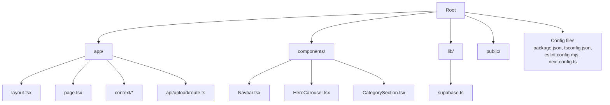
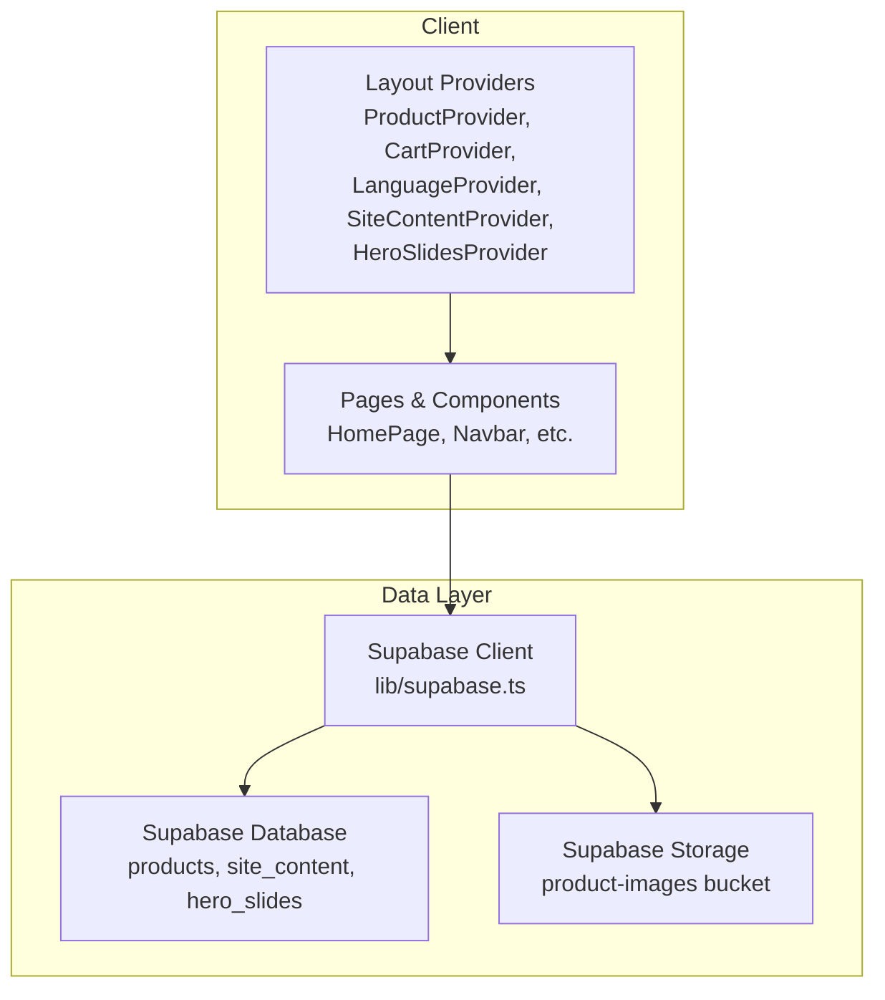
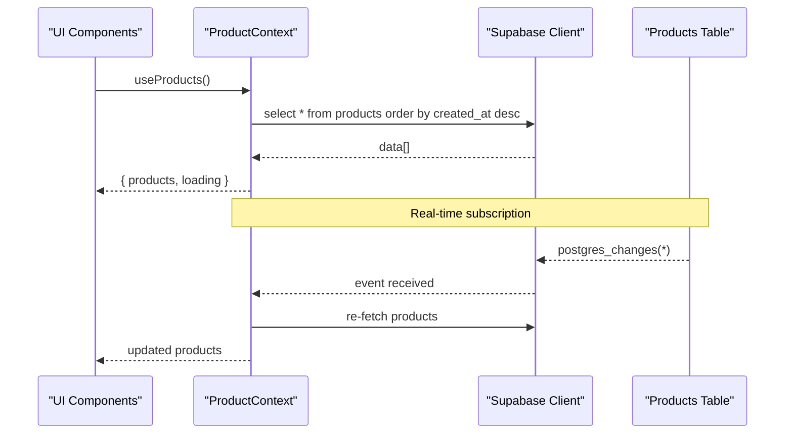
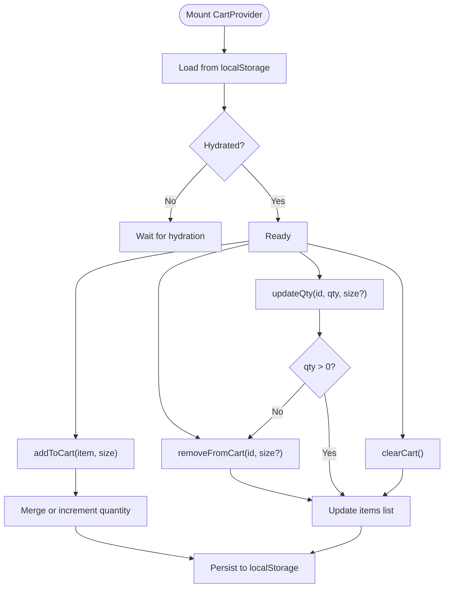
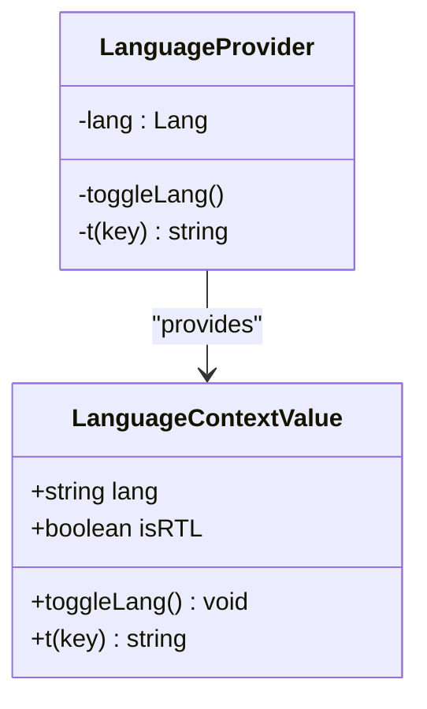
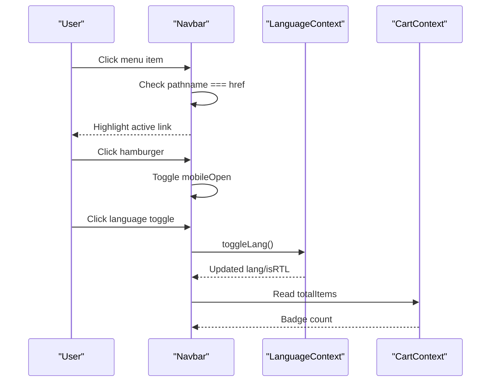
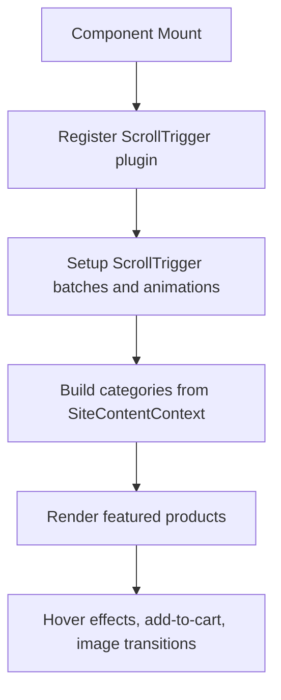

# Development Guide

<cite>
**Referenced Files in This Document**
- [package.json](file://package.json)
- [tsconfig.json](file://tsconfig.json)
- [eslint.config.mjs](file://eslint.config.mjs)
- [next.config.ts](file://next.config.ts)
- [README.md](file://README.md)
- [supabase-setup.sql](file://supabase-setup.sql)
- [.gitignore](file://.gitignore)
- [app/layout.tsx](file://app/layout.tsx)
- [app/page.tsx](file://app/page.tsx)
- [lib/supabase.ts](file://lib/supabase.ts)
- [components/Navbar.tsx](file://components/Navbar.tsx)
- [app/context/ProductContext.tsx](file://app/context/ProductContext.tsx)
- [app/context/CartContext.tsx](file://app/context/CartContext.tsx)
- [app/context/LanguageContext.tsx](file://app/context/LanguageContext.tsx)
</cite>

## Table of Contents
1. Introduction
2. Project Structure
3. Core Components
4. Architecture Overview
5. Detailed Component Analysis
6. Dependency Analysis
7. Performance Considerations
8. Troubleshooting Guide
9. Contribution Guidelines and Pull Request Process
10. Conclusion

## Introduction
This guide provides a comprehensive development workflow for contributing to the Nubia Perfume E-Commerce Platform. It covers code style conventions enforced by ESLint, TypeScript configuration standards, Git workflow practices, environment setup, debugging techniques, testing strategies, build processes, feature addition guidelines, refactoring practices, performance profiling, optimization techniques, and contribution workflows.

The project is a Next.js 15 (App Router) application with Supabase as the backend for data and storage. It uses React 19, Tailwind CSS v4 via PostCSS, GSAP for animations, and ESLint with Next’s recommended configurations.

## Project Structure
The repository follows a Next.js App Router layout:
- app/: Application routes, layouts, contexts, and API routes
- components/: Reusable UI components
- lib/: Shared libraries (e.g., Supabase client)
- public/: Static assets
- Configuration files at root: package.json, tsconfig.json, eslint.config.mjs, next.config.ts, postcss.config.mjs



**Diagram sources**
- [app/layout.tsx:1-83](file://app/layout.tsx#L1-L83)
- [app/page.tsx:1-468](file://app/page.tsx#L1-L468)
- [components/Navbar.tsx:1-187](file://components/Navbar.tsx#L1-L187)
- [lib/supabase.ts:1-46](file://lib/supabase.ts#L1-L46)

**Section sources**
- [README.md:1-65](file://README.md#L1-L65)
- [package.json:1-29](file://package.json#L1-L29)

## Core Components
Key runtime components and their responsibilities:
- Root layout and providers: Initializes fonts, metadata, and global providers (site content, language, cart, hero slides, products).
- Product context: Fetches product data from Supabase, manages real-time updates, and exposes CRUD operations.
- Cart context: Manages client-side cart state with localStorage persistence and quantity logic.
- Language context: Provides i18n toggling between English and Arabic and sets HTML lang/dir attributes.
- Navbar: Navigation UI with active link highlighting, mobile drawer, language toggle, and cart badge.

**Section sources**
- [app/layout.tsx:1-83](file://app/layout.tsx#L1-L83)
- [app/context/ProductContext.tsx:1-116](file://app/context/ProductContext.tsx#L1-L116)
- [app/context/CartContext.tsx:1-104](file://app/context/CartContext.tsx#L1-L104)
- [app/context/LanguageContext.tsx:1-58](file://app/context/LanguageContext.tsx#L1-L58)
- [components/Navbar.tsx:1-187](file://components/Navbar.tsx#L1-L187)

## Architecture Overview
High-level architecture showing client-side providers, UI components, and Supabase integration.



**Diagram sources**
- [app/layout.tsx:1-83](file://app/layout.tsx#L1-L83)
- [lib/supabase.ts:1-46](file://lib/supabase.ts#L1-L46)
- [supabase-setup.sql:1-137](file://supabase-setup.sql#L1-L137)

## Detailed Component Analysis

### Product Context (Real-time Data and CRUD)
Responsibilities:
- Fetch products ordered by creation time
- Subscribe to real-time changes on the products table
- Provide add/update/delete operations that refresh local state



**Diagram sources**
- [app/context/ProductContext.tsx:45-116](file://app/context/ProductContext.tsx#L45-L116)
- [lib/supabase.ts:1-46](file://lib/supabase.ts#L1-L46)

**Section sources**
- [app/context/ProductContext.tsx:1-116](file://app/context/ProductContext.tsx#L1-L116)

### Cart Context (State Management and Persistence)
Responsibilities:
- Maintain cart items with size variants
- Persist cart to localStorage across sessions
- Provide addToCart, removeFromCart, updateQty, clearCart, isInCart



**Diagram sources**
- [app/context/CartContext.tsx:28-104](file://app/context/CartContext.tsx#L28-L104)

**Section sources**
- [app/context/CartContext.tsx:1-104](file://app/context/CartContext.tsx#L1-L104)

### Language Context (i18n and Directionality)
Responsibilities:
- Toggle between English and Arabic
- Set html lang and dir attributes
- Resolve translations using SiteContentContext keys



**Diagram sources**
- [app/context/LanguageContext.tsx:1-58](file://app/context/LanguageContext.tsx#L1-L58)

**Section sources**
- [app/context/LanguageContext.tsx:1-58](file://app/context/LanguageContext.tsx#L1-L58)

### Navbar (Navigation and UI State)
Responsibilities:
- Active link detection based on current pathname
- Mobile drawer open/close behavior
- Language toggle button and cart badge display



**Diagram sources**
- [components/Navbar.tsx:1-187](file://components/Navbar.tsx#L1-L187)
- [app/context/LanguageContext.tsx:1-58](file://app/context/LanguageContext.tsx#L1-L58)
- [app/context/CartContext.tsx:1-104](file://app/context/CartContext.tsx#L1-L104)

**Section sources**
- [components/Navbar.tsx:1-187](file://components/Navbar.tsx#L1-L187)

### Home Page (Animations and Dynamic Sections)
Responsibilities:
- Integrate GSAP ScrollTrigger for scroll-based animations
- Build categories dynamically from SiteContentContext
- Render featured products with hover effects and add-to-cart actions



**Diagram sources**
- [app/page.tsx:1-468](file://app/page.tsx#L1-L468)

**Section sources**
- [app/page.tsx:1-468](file://app/page.tsx#L1-L468)

## Dependency Analysis
Runtime and tooling dependencies:
- Next.js 16.2.9 (App Router), React 19.2.4, react-dom 19.2.4
- Supabase JS client for database and storage
- GSAP for animations
- Tailwind CSS v4 via @tailwindcss/postcss
- ESLint with Next’s core-web-vitals and TypeScript configs
- TypeScript 5 with strict mode and bundler module resolution

```mermaid
graph TB
Pkg["package.json"] --> NX["Next.js"]
Pkg --> RT["React / ReactDOM"]
Pkg --> SB["@supabase/supabase-js"]
Pkg --> GS["gsap"]
Pkg --> TW["@tailwindcss/postcss", "tailwindcss"]
Pkg --> TS["typescript"]
Pkg --> ESL["eslint", "eslint-config-next"]
```

**Diagram sources**
- [package.json:1-29](file://package.json#L1-L29)

**Section sources**
- [package.json:1-29](file://package.json#L1-L29)

## Performance Considerations
- Image optimization: Configure allowed remote patterns for images in Next config to ensure proper optimization and caching.
- Code splitting: Use dynamic imports for heavy sections to reduce initial bundle size.
- Animation efficiency: Leverage GSAP ScrollTrigger with batched triggers and avoid excessive DOM queries; clean up contexts on unmount.
- Real-time updates: The product context subscribes to database changes; ensure RLS policies are correctly scoped to avoid unnecessary network traffic.
- LocalStorage usage: Cart persistence avoids server round-trips but should be guarded against large payloads.

[No sources needed since this section provides general guidance]

## Troubleshooting Guide
Common issues and resolutions:
- Missing or placeholder Supabase credentials: The client logs an informational message when environment variables are missing or placeholders are used, falling back to demo credentials. Ensure NEXT_PUBLIC_SUPABASE_URL and NEXT_PUBLIC_SUPABASE_ANON_KEY are set in .env.local.
- Remote image domains not allowed: If images fail to load, verify that hostnames are included in Next’s images.remotePatterns configuration.
- Real-time updates not reflecting: Confirm Supabase RLS policies allow public access for the tables used and that the channel subscription is active.
- Hydration warnings: The root layout uses suppressHydrationWarning for font variable injection; ensure consistent SSR/CSR rendering for dynamic styles.

**Section sources**
- [lib/supabase.ts:1-46](file://lib/supabase.ts#L1-L46)
- [next.config.ts:1-19](file://next.config.ts#L1-L19)
- [supabase-setup.sql:1-137](file://supabase-setup.sql#L1-L137)
- [app/layout.tsx:1-83](file://app/layout.tsx#L1-L83)

## Contribution Guidelines and Pull Request Process
Development environment setup:
- Install dependencies: npm install
- Create .env.local with Supabase URL and anon key
- Run development server: npm run dev
- Build production assets: npm run build
- Start production server: npm start
- Lint code: npm run lint

Code style conventions enforced by ESLint:
- Uses Next’s core-web-vitals and TypeScript rule sets
- Ignores generated directories (.next, out, build) and generated type definitions
- Follows Next best practices for performance and accessibility

TypeScript configuration standards:
- Strict mode enabled
- ES2017 target with modern libs
- Module resolution set to bundler
- JSX configured for React 19
- Path aliases configured for @/* mapping to root

Git workflow practices:
- Branch off main for features and fixes
- Commit messages should be descriptive and concise
- Avoid committing .env* files (ignored by .gitignore)
- Keep node_modules, .next, and build artifacts out of version control

Pull request process:
- Ensure all lints pass before opening PR
- Include a brief description of changes and rationale
- Link related issues or tasks
- Verify functionality locally and in preview deployments

Testing strategies:
- No test runner is currently configured in scripts; consider adding Jest/Vitest and React Testing Library for unit and integration tests
- For UI interactions, consider Playwright or Cypress for end-to-end flows
- Mock Supabase client for deterministic tests

Build processes:
- Development: next dev
- Production build: next build
- Production start: next start

Debugging techniques:
- Use browser DevTools Network tab to inspect Supabase requests
- Console logging in Supabase client initialization helps identify environment misconfiguration
- Use React DevTools to inspect context values and component props

Refactoring existing code:
- Prefer extracting reusable logic into hooks or utilities
- Keep contexts focused and small; split concerns if they grow too large
- Maintain strict typing and avoid any casts where possible

Performance profiling:
- Use Next.js built-in performance insights and React Profiler
- Monitor GSAP timelines and ScrollTrigger usage to prevent layout thrashing
- Profile image loading and optimize sizes/alt text

**Section sources**
- [package.json:1-29](file://package.json#L1-L29)
- [eslint.config.mjs:1-19](file://eslint.config.mjs#L1-L19)
- [tsconfig.json:1-35](file://tsconfig.json#L1-L35)
- [.gitignore:1-42](file://.gitignore#L1-L42)
- [README.md:1-65](file://README.md#L1-L65)

## Conclusion
This guide consolidates the essential development practices for contributing to the Nubia Perfume E-Commerce Platform. By adhering to the ESLint rules, TypeScript standards, and Git workflow outlined here, contributors can maintain high code quality, improve performance, and streamline collaboration. Use the provided diagrams and troubleshooting tips to navigate common scenarios and optimize the development experience.