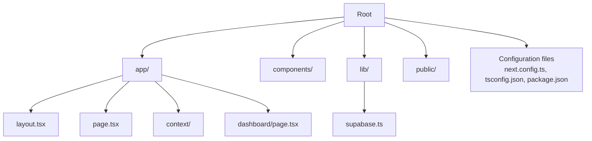
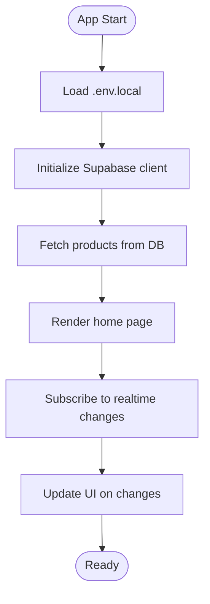
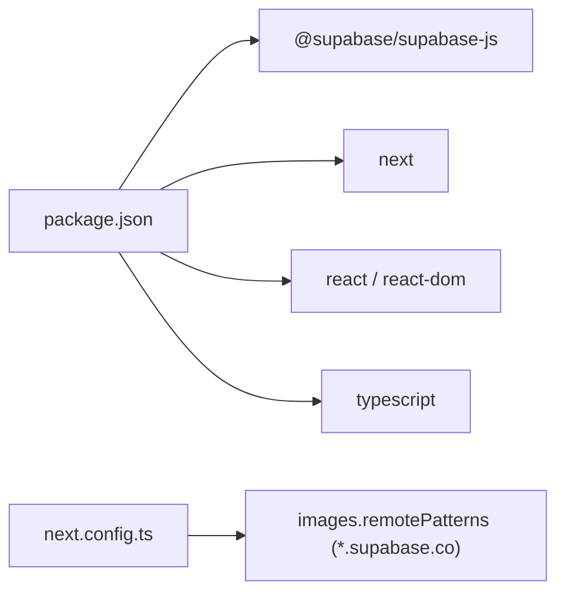

# Getting Started

<cite>
**Referenced Files in This Document**
- [README.md](file://README.md)
- [package.json](file://package.json)
- [lib/supabase.ts](file://lib/supabase.ts)
- [supabase-setup.sql](file://supabase-setup.sql)
- [next.config.ts](file://next.config.ts)
- [app/layout.tsx](file://app/layout.tsx)
- [app/page.tsx](file://app/page.tsx)
- [app/context/ProductContext.tsx](file://app/context/ProductContext.tsx)
- [app/context/CartContext.tsx](file://app/context/CartContext.tsx)
</cite>

## Table of Contents
1. [Introduction](#introduction)
2. [Project Structure](#project-structure)
3. [Core Components](#core-components)
4. [Architecture Overview](#architecture-overview)
5. [Detailed Component Analysis](#detailed-component-analysis)
6. [Dependency Analysis](#dependency-analysis)
7. [Performance Considerations](#performance-considerations)
8. [Troubleshooting Guide](#troubleshooting-guide)
9. [Conclusion](#conclusion)

## Introduction
This guide helps you set up and run the Nubia Perfume E-Commerce Platform locally, configure Supabase, and perform common development tasks. The project is a Next.js application with TypeScript that uses Supabase for data and storage. It includes an admin dashboard to manage products and real-time updates on the storefront.

## Project Structure
The repository follows a Next.js App Router layout:
- app/: Pages and route handlers (e.g., home page, product pages, dashboard)
- components/: Reusable UI components
- lib/: Shared libraries (Supabase client configuration)
- public/: Static assets
- Configuration files at the root (Next.js, Tailwind, ESLint, TypeScript)



**Diagram sources**
- [app/layout.tsx:1-81](file://app/layout.tsx#L1-L81)
- [app/page.tsx:1-454](file://app/page.tsx#L1-L454)
- [lib/supabase.ts:1-46](file://lib/supabase.ts#L1-L46)
- [next.config.ts:1-15](file://next.config.ts#L1-L15)
- [package.json:1-29](file://package.json#L1-L29)

**Section sources**
- [README.md:1-65](file://README.md#L1-L65)
- [package.json:1-29](file://package.json#L1-L29)

## Core Components
- Supabase client: Centralized configuration and exports for database and storage access.
- Product context: Fetches, inserts, updates, deletes products and subscribes to real-time changes.
- Cart context: Client-side cart state persisted to localStorage.
- Root layout: Provides global providers and fonts.

Key responsibilities:
- lib/supabase.ts: Reads environment variables, validates them, provides fallbacks, and exports a configured client plus storage bucket name.
- app/context/ProductContext.tsx: Manages product data lifecycle and real-time sync.
- app/context/CartContext.tsx: Manages cart operations and persistence.
- app/layout.tsx: Wraps the app with providers and metadata.

**Section sources**
- [lib/supabase.ts:1-46](file://lib/supabase.ts#L1-L46)
- [app/context/ProductContext.tsx:1-116](file://app/context/ProductContext.tsx#L1-L116)
- [app/context/CartContext.tsx:1-104](file://app/context/CartContext.tsx#L1-L104)
- [app/layout.tsx:1-81](file://app/layout.tsx#L1-L81)

## Architecture Overview
High-level flow from environment setup to runtime behavior:

```mermaid
sequenceDiagram
participant Dev as "Developer"
participant Env as ".env.local"
participant Next as "Next.js Runtime"
participant SBConf as "lib/supabase.ts"
participant SB as "Supabase Service"
participant DB as "PostgreSQL"
participant Store as "Supabase Storage"
Dev->>Env : Create NEXT_PUBLIC_SUPABASE_URL and NEXT_PUBLIC_SUPABASE_ANON_KEY
Dev->>Next : npm run dev
Next->>SBConf : Import client config
SBConf->>Env : Read env vars
SBConf->>SB : createClient(url, key)
Note over SBConf,SBC : Validates URL and keys; logs info if placeholders used
Next->>DB : Query products via supabase.from("products")
DB-->>Next : Products list
Next->>Store : Upload images to "product-images" bucket
Store-->>Next : Image URLs
Next-->>Dev : App running with live data
```

**Diagram sources**
- [lib/supabase.ts:1-46](file://lib/supabase.ts#L1-L46)
- [app/context/ProductContext.tsx:49-82](file://app/context/ProductContext.tsx#L49-L82)
- [next.config.ts:1-15](file://next.config.ts#L1-L15)

## Detailed Component Analysis

### Environment Setup and Supabase Configuration
- Required environment variables:
  - NEXT_PUBLIC_SUPABASE_URL
  - NEXT_PUBLIC_SUPABASE_ANON_KEY
- Where they are read:
  - lib/supabase.ts reads these variables and constructs the client.
- Validation and fallbacks:
  - If variables are missing or contain placeholder values, the client logs an informational message and uses fallback credentials.
- Remote image domains:
  - next.config.ts allows loading images from *.supabase.co.

Steps to configure:
1. Create a Supabase project and note your Project URL and anon public key.
2. Run the SQL schema in Supabase Dashboard → SQL Editor using supabase-setup.sql.
3. Create a public storage bucket named product-images in Supabase Storage.
4. Add NEXT_PUBLIC_SUPABASE_URL and NEXT_PUBLIC_SUPABASE_ANON_KEY to .env.local in the project root.
5. Restart the dev server after editing .env.local so Next.js picks up the new values.

Database schema overview:
- products table with fields for name, description, price, image_url, badge, timestamps, and additional fragrance attributes.
- site_content table for dynamic content.
- hero_slides table for carousel slides.
- Row Level Security policies enable public read/write for demo purposes.

Storage bucket:
- Must be named product-images and marked Public for direct uploads and frontend access.

**Section sources**
- [README.md:18-36](file://README.md#L18-L36)
- [lib/supabase.ts:1-46](file://lib/supabase.ts#L1-L46)
- [supabase-setup.sql:1-137](file://supabase-setup.sql#L1-L137)
- [next.config.ts:1-15](file://next.config.ts#L1-L15)

### Development Workflow
Prerequisites:
- Node.js and npm (or yarn) installed
- Basic knowledge of React and TypeScript
- A Supabase project with the schema and storage bucket created

Install dependencies:
- npm install

Run the development server:
- npm run dev

Open the app:
- Home page: http://localhost:3000
- Admin dashboard: http://localhost:3000/dashboard

Build for production:
- npm run build
- Start production server: npm start

Common scripts:
- dev: starts the Next.js development server
- build: builds the app for production
- start: runs the production server
- lint: runs ESLint

**Section sources**
- [README.md:40-65](file://README.md#L40-L65)
- [package.json:5-10](file://package.json#L5-L10)

### Database Schema Setup Using supabase-setup.sql
What the script does:
- Creates the products table with constraints and default values.
- Enables Row Level Security and adds policies for public select/insert/delete.
- Adds optional columns for fragrance details (notes, longevity, sillage, sizes, images, video_url).
- Creates site_content and hero_slides tables with RLS policies.
- Grants privileges for anon, authenticated, and service_role on hero_slides.

How to apply:
- Open Supabase Dashboard → SQL Editor.
- Paste the entire contents of supabase-setup.sql and execute.
- Verify tables appear under Database → Tables.
- Ensure the product-images storage bucket exists and is Public.

Notes:
- For production, tighten RLS policies and add authentication.
- Keep the bucket name consistent with STORAGE_BUCKET exported by the client.

**Section sources**
- [supabase-setup.sql:1-137](file://supabase-setup.sql#L1-L137)

### Configuring the Supabase Client in lib/supabase.ts
Behavior:
- Reads NEXT_PUBLIC_SUPABASE_URL and NEXT_PUBLIC_SUPABASE_ANON_KEY from process.env.
- Validates the URL format and checks for placeholder values.
- Logs an informational message when placeholders or missing values are detected.
- Exports a configured supabase client and the storage bucket name constant.

Important:
- After updating .env.local, restart the dev server to reload environment variables.
- Ensure the bucket name matches what you created in Supabase Storage.

**Section sources**
- [lib/supabase.ts:1-46](file://lib/supabase.ts#L1-L46)

### Data Flow and Real-Time Updates
Product management:
- ProductContext fetches products from the products table and subscribes to real-time changes.
- When a product is added/updated/deleted via the dashboard, the home page refreshes automatically.

Cart management:
- CartContext maintains cart items in memory and persists them to localStorage.
- Provides helpers to add, remove, update quantities, clear the cart, and check presence.



**Diagram sources**
- [app/context/ProductContext.tsx:49-82](file://app/context/ProductContext.tsx#L49-L82)
- [app/context/CartContext.tsx:28-47](file://app/context/CartContext.tsx#L28-L47)

**Section sources**
- [app/context/ProductContext.tsx:1-116](file://app/context/ProductContext.tsx#L1-L116)
- [app/context/CartContext.tsx:1-104](file://app/context/CartContext.tsx#L1-L104)

## Dependency Analysis
External dependencies relevant to setup:
- @supabase/supabase-js: Client library for Supabase.
- next: Framework runtime.
- react/react-dom: UI runtime.
- tailwindcss/@tailwindcss/postcss: Styling stack.
- typescript: Language tooling.

Image domain allowlist:
- next.config.ts permits remote images from *.supabase.co.



**Diagram sources**
- [package.json:11-27](file://package.json#L11-L27)
- [next.config.ts:3-12](file://next.config.ts#L3-L12)

**Section sources**
- [package.json:1-29](file://package.json#L1-L29)
- [next.config.ts:1-15](file://next.config.ts#L1-L15)

## Performance Considerations
- Use Next.js Image optimization with allowed remote patterns for Supabase-hosted images.
- Avoid unnecessary re-renders by leveraging context selectors where possible.
- Keep real-time subscriptions scoped to necessary tables and channels.
- Prefer lazy-loading heavy components and animations for initial load performance.

[No sources needed since this section provides general guidance]

## Troubleshooting Guide
Common issues and resolutions:
- Missing environment variables:
  - Symptom: Console shows an informational message about placeholders or missing variables.
  - Fix: Add NEXT_PUBLIC_SUPABASE_URL and NEXT_PUBLIC_SUPABASE_ANON_KEY to .env.local and restart the dev server.
- Incorrect bucket name:
  - Symptom: Uploads fail or images not found.
  - Fix: Ensure the Supabase Storage bucket is named product-images and is Public.
- Images not loading:
  - Symptom: Blank images or blocked requests.
  - Fix: Confirm next.config.ts allows *.supabase.co in images.remotePatterns.
- Database errors:
  - Symptom: Errors fetching or writing products.
  - Fix: Verify supabase-setup.sql was executed and RLS policies exist. Check network connectivity and API keys.
- Dashboard connection warnings:
  - Symptom: Warning banners indicating configuration or connection errors.
  - Fix: Validate environment variables and internet connection; ensure Supabase project is active.

Where to look:
- Client validation and logging: lib/supabase.ts
- Allowed image domains: next.config.ts
- Database schema and policies: supabase-setup.sql
- README setup steps: README.md

**Section sources**
- [lib/supabase.ts:1-46](file://lib/supabase.ts#L1-L46)
- [next.config.ts:1-15](file://next.config.ts#L1-L15)
- [supabase-setup.sql:1-137](file://supabase-setup.sql#L1-L137)
- [README.md:18-36](file://README.md#L18-L36)

## Conclusion
You now have the essentials to set up the Nubia Perfume E-Commerce Platform locally, connect it to Supabase, and run the development workflow. Use the troubleshooting tips to resolve common setup issues quickly. As you expand the app, consider tightening security policies and adding authentication for production readiness.