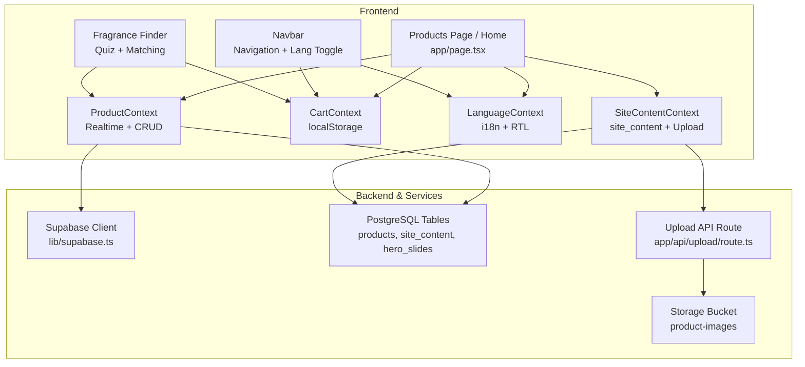
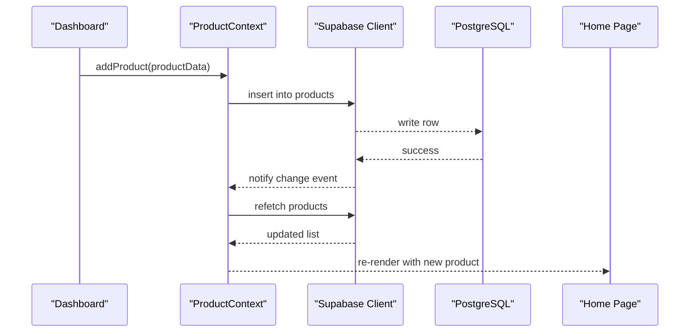
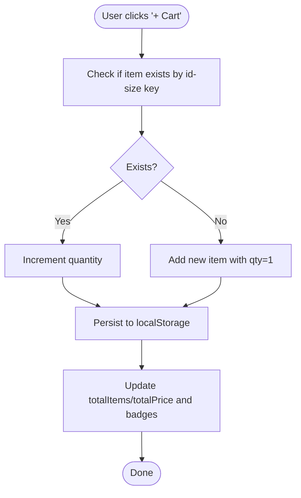
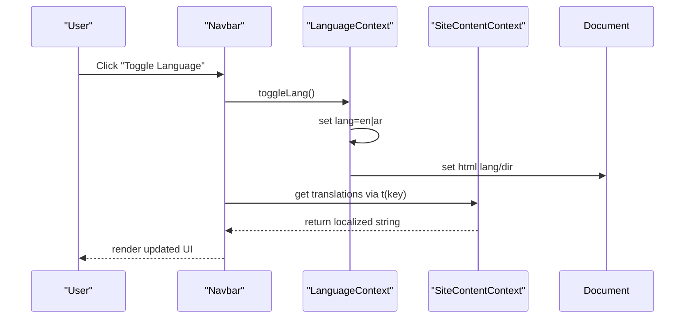
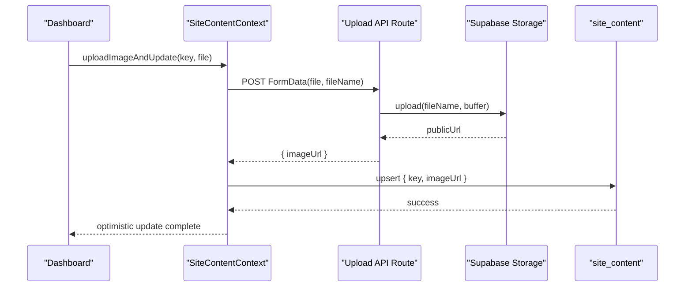
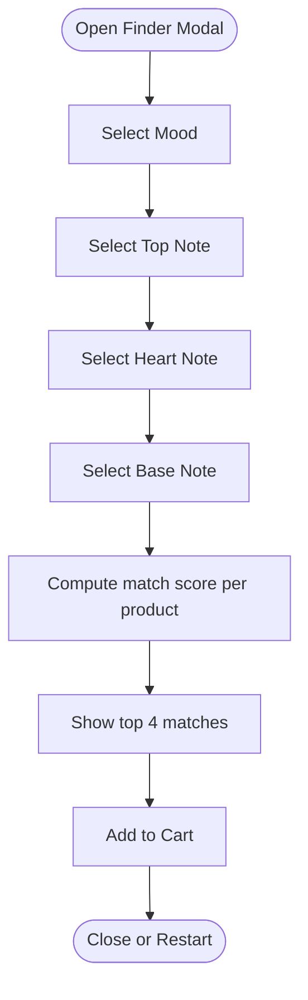
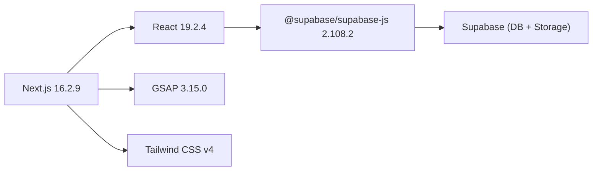

# Project Overview

<cite>
**Referenced Files in This Document**
- [README.md](file://README.md)
- [package.json](file://package.json)
- [next.config.ts](file://next.config.ts)
- [app/layout.tsx](file://app/layout.tsx)
- [app/page.tsx](file://app/page.tsx)
- [components/Navbar.tsx](file://components/Navbar.tsx)
- [components/FragranceFinderWidget.tsx](file://components/FragranceFinderWidget.tsx)
- [components/CategorySection.tsx](file://components/CategorySection.tsx)
- [app/context/ProductContext.tsx](file://app/context/ProductContext.tsx)
- [app/context/CartContext.tsx](file://app/context/CartContext.tsx)
- [app/context/LanguageContext.tsx](file://app/context/LanguageContext.tsx)
- [app/context/SiteContentContext.tsx](file://app/context/SiteContentContext.tsx)
- [app/context/defaultTranslations.ts](file://app/context/defaultTranslations.ts)
- [lib/supabase.ts](file://lib/supabase.ts)
- [app/api/upload/route.ts](file://app/api/upload/route.ts)
- [supabase-setup.sql](file://supabase-setup.sql)
</cite>

## Table of Contents
1. [Introduction](#introduction)
2. [Project Structure](#project-structure)
3. [Core Components](#core-components)
4. [Architecture Overview](#architecture-overview)
5. [Detailed Component Analysis](#detailed-component-analysis)
6. [Dependency Analysis](#dependency-analysis)
7. [Performance Considerations](#performance-considerations)
8. [Troubleshooting Guide](#troubleshooting-guide)
9. [Conclusion](#conclusion)

## Introduction
Nubia Perfume is a luxury e-commerce platform for fine fragrances, designed with real-time inventory management and bilingual support (English and Arabic). The storefront showcases an elegant dark-gold aesthetic, smooth animations, and responsive layouts. It integrates:
- Next.js 16.2.9 with the App Router
- React 19.2.4
- Supabase for PostgreSQL database and Storage
- GSAP for scroll-driven animations
- Tailwind CSS v4 via PostCSS

Key features include interactive fragrance discovery, dynamic content management through an admin dashboard, shopping cart functionality, and internationalization with RTL support.

Practical examples:
- Add a new fragrance from the dashboard; it appears instantly on the home page due to real-time subscriptions.
- Use the Fragrance Finder widget to select mood and notes, then view matched products.
- Toggle language between English and Arabic to switch UI direction and text.

**Section sources**
- [README.md:1-65](file://README.md#L1-L65)
- [package.json:11-27](file://package.json#L11-L27)

## Project Structure
The application follows a feature-based layout under app/ with shared components in components/, data layer utilities in lib/, and server routes in app/api/. Context providers wrap the root layout to share state globally.

```mermaid
graph TB
A["Root Layout<br/>app/layout.tsx"] --> B["ProductProvider<br/>app/context/ProductContext.tsx"]
A --> C["CartProvider<br/>app/context/CartContext.tsx"]
A --> D["LanguageProvider<br/>app/context/LanguageContext.tsx"]
A --> E["SiteContentProvider<br/>app/context/SiteContentContext.tsx"]
A --> F["HeroSlidesProvider<br/>app/context/HeroSlidesContext.tsx"]
A --> G["FragranceFinderWidget<br/>components/FragranceFinderWidget.tsx"]
A --> H["ScrollToTop<br/>components/ScrollToTop.tsx"]
I["Home Page<br/>app/page.tsx"] --> J["Navbar<br/>components/Navbar.tsx"]
I --> K["CategorySection<br/>components/CategorySection.tsx"]
L["Supabase Client<br/>lib/supabase.ts"] --> B
M["Upload API Route<br/>app/api/upload/route.ts"] --> N["Supabase Storage<br/>product-images"]
```

**Diagram sources**
- [app/layout.tsx:1-81](file://app/layout.tsx#L1-L81)
- [app/page.tsx:1-454](file://app/page.tsx#L1-L454)
- [components/Navbar.tsx:1-187](file://components/Navbar.tsx#L1-L187)
- [components/CategorySection.tsx:1-358](file://components/CategorySection.tsx#L1-L358)
- [components/FragranceFinderWidget.tsx:1-800](file://components/FragranceFinderWidget.tsx#L1-L800)
- [app/context/ProductContext.tsx:1-116](file://app/context/ProductContext.tsx#L1-L116)
- [app/context/CartContext.tsx:1-104](file://app/context/CartContext.tsx#L1-L104)
- [app/context/LanguageContext.tsx:1-58](file://app/context/LanguageContext.tsx#L1-L58)
- [app/context/SiteContentContext.tsx:1-110](file://app/context/SiteContentContext.tsx#L1-L110)
- [lib/supabase.ts:1-46](file://lib/supabase.ts#L1-L46)
- [app/api/upload/route.ts:1-67](file://app/api/upload/route.ts#L1-L67)

**Section sources**
- [app/layout.tsx:1-81](file://app/layout.tsx#L1-L81)
- [next.config.ts:1-15](file://next.config.ts#L1-L15)

## Core Components
- ProductContext: Manages product list, loading state, and CRUD operations against Supabase. Subscribes to real-time changes to keep the UI synchronized.
- CartContext: Provides client-side cart state with localStorage persistence, quantity updates, totals, and helpers like isInCart.
- LanguageContext: Controls current language (en/ar), toggles RTL/LTR, and resolves translated strings using SiteContentContext keys.
- SiteContentContext: Loads site-wide text and images from site_content table, supports optimistic updates and image uploads via the upload API route.
- Navbar: Global navigation with language toggle, cart badge, mobile drawer, and announcement bar.
- CategorySection: Interactive category explorer with dynamic images sourced from SiteContentContext.
- FragranceFinderWidget: Step-by-step quiz that matches user preferences to products based on note keywords.

**Section sources**
- [app/context/ProductContext.tsx:1-116](file://app/context/ProductContext.tsx#L1-L116)
- [app/context/CartContext.tsx:1-104](file://app/context/CartContext.tsx#L1-L104)
- [app/context/LanguageContext.tsx:1-58](file://app/context/LanguageContext.tsx#L1-L58)
- [app/context/SiteContentContext.tsx:1-110](file://app/context/SiteContentContext.tsx#L1-L110)
- [components/Navbar.tsx:1-187](file://components/Navbar.tsx#L1-L187)
- [components/CategorySection.tsx:1-358](file://components/CategorySection.tsx#L1-L358)
- [components/FragranceFinderWidget.tsx:1-800](file://components/FragranceFinderWidget.tsx#L1-L800)

## Architecture Overview
The system combines a Next.js frontend with Supabase as both database and storage. Real-time updates are achieved via Supabase channels. Content and media are managed through context providers and server routes.

**Diagram sources**
- [app/page.tsx:1-454](file://app/page.tsx#L1-L454)
- [app/context/ProductContext.tsx:1-116](file://app/context/ProductContext.tsx#L1-L116)
- [app/context/CartContext.tsx:1-104](file://app/context/CartContext.tsx#L1-L104)
- [app/context/LanguageContext.tsx:1-58](file://app/context/LanguageContext.tsx#L1-L58)
- [app/context/SiteContentContext.tsx:1-110](file://app/context/SiteContentContext.tsx#L1-L110)
- [components/Navbar.tsx:1-187](file://components/Navbar.tsx#L1-L187)
- [components/FragranceFinderWidget.tsx:1-800](file://components/FragranceFinderWidget.tsx#L1-L800)
- [lib/supabase.ts:1-46](file://lib/supabase.ts#L1-L46)
- [app/api/upload/route.ts:1-67](file://app/api/upload/route.ts#L1-L67)
- [supabase-setup.sql:1-137](file://supabase-setup.sql#L1-L137)

## Detailed Component Analysis

### Product Management and Real-Time Inventory
- ProductContext fetches products ordered by created_at and subscribes to postgres_changes for instant UI refresh when items are added/updated/deleted.
- Dashboard flows use addProduct/updateProduct/deleteProduct which trigger real-time listeners.

**Diagram sources**
- [app/context/ProductContext.tsx:45-116](file://app/context/ProductContext.tsx#L45-L116)
- [app/page.tsx:43-115](file://app/page.tsx#L43-L115)

**Section sources**
- [app/context/ProductContext.tsx:1-116](file://app/context/ProductContext.tsx#L1-L116)
- [supabase-setup.sql:1-56](file://supabase-setup.sql#L1-L56)

### Shopping Cart Flow
- CartContext persists items to localStorage, computes totals, and exposes addToCart/remove/updateQty helpers.
- Home product cards call addToCart and show contextual feedback.

**Diagram sources**
- [app/context/CartContext.tsx:28-104](file://app/context/CartContext.tsx#L28-L104)
- [app/page.tsx:242-454](file://app/page.tsx#L242-L454)

**Section sources**
- [app/context/CartContext.tsx:1-104](file://app/context/CartContext.tsx#L1-L104)
- [app/page.tsx:242-454](file://app/page.tsx#L242-L454)

### Internationalization and RTL Support
- LanguageContext toggles lang and sets html dir/lang attributes.
- t(key) resolves values from SiteContentContext using prefixed keys (e.g., en_nav_home, ar_nav_home).
- Navbar uses t() for links and shows a language toggle button.

**Diagram sources**
- [app/context/LanguageContext.tsx:17-58](file://app/context/LanguageContext.tsx#L17-L58)
- [app/context/SiteContentContext.tsx:22-69](file://app/context/SiteContentContext.tsx#L22-L69)
- [components/Navbar.tsx:25-96](file://components/Navbar.tsx#L25-L96)
- [app/context/defaultTranslations.ts:1-494](file://app/context/defaultTranslations.ts#L1-L494)

**Section sources**
- [app/context/LanguageContext.tsx:1-58](file://app/context/LanguageContext.tsx#L1-L58)
- [app/context/defaultTranslations.ts:1-494](file://app/context/defaultTranslations.ts#L1-L494)
- [components/Navbar.tsx:1-187](file://components/Navbar.tsx#L1-L187)

### Dynamic Content Management
- SiteContentContext loads site_content rows and merges with defaultTranslations.
- Supports update(key, value) and uploadImageAndUpdate(key, file) via the upload API route.
- CategorySection reads images from SiteContentContext to render dynamic visuals.

**Diagram sources**
- [app/context/SiteContentContext.tsx:71-96](file://app/context/SiteContentContext.tsx#L71-L96)
- [app/api/upload/route.ts:1-67](file://app/api/upload/route.ts#L1-L67)
- [components/CategorySection.tsx:51-60](file://components/CategorySection.tsx#L51-L60)

**Section sources**
- [app/context/SiteContentContext.tsx:1-110](file://app/context/SiteContentContext.tsx#L1-L110)
- [app/api/upload/route.ts:1-67](file://app/api/upload/route.ts#L1-L67)
- [components/CategorySection.tsx:1-358](file://components/CategorySection.tsx#L1-L358)

### Interactive Fragrance Discovery
- FragranceFinderWidget presents multi-step choices (mood, top/heart/base notes) and scores products by keyword overlap across notes and descriptions.
- Results display top matches and allow adding to cart directly.

**Diagram sources**
- [components/FragranceFinderWidget.tsx:24-165](file://components/FragranceFinderWidget.tsx#L24-L165)
- [components/FragranceFinderWidget.tsx:168-270](file://components/FragranceFinderWidget.tsx#L168-L270)
- [components/FragranceFinderWidget.tsx:182-197](file://components/FragranceFinderWidget.tsx#L182-L197)

**Section sources**
- [components/FragranceFinderWidget.tsx:1-800](file://components/FragranceFinderWidget.tsx#L1-L800)

## Dependency Analysis
- Frontend dependencies: next 16.2.9, react/react-dom 19.2.4, gsap 3.15.0, @supabase/supabase-js 2.108.2.
- Dev tooling: tailwindcss 4, @tailwindcss/postcss 4, typescript 5, eslint 9.
- Remote image domains configured for Supabase CDN.

**Diagram sources**
- [package.json:11-27](file://package.json#L11-L27)
- [next.config.ts:1-15](file://next.config.ts#L1-L15)

**Section sources**
- [package.json:1-29](file://package.json#L1-L29)
- [next.config.ts:1-15](file://next.config.ts#L1-L15)

## Performance Considerations
- Real-time subscriptions: ProductContext listens to all changes on the products table; ensure RLS policies are scoped appropriately in production.
- Image optimization: next.config.ts allows remote patterns for *.supabase.co; consider enabling Next.js image optimization for better performance.
- LocalStorage cart: Keep cart payloads small; avoid storing large objects.
- Animations: GSAP ScrollTrigger batches and throttling reduce layout thrash; prefer transform/opacity where possible.

[No sources needed since this section provides general guidance]

## Troubleshooting Guide
- Supabase environment variables missing:
  - Ensure NEXT_PUBLIC_SUPABASE_URL and NEXT_PUBLIC_SUPABASE_ANON_KEY are set in .env.local.
  - The client falls back to demo credentials with a console log when placeholders are detected.
- Storage bucket not found:
  - Create a public bucket named product-images in Supabase Storage.
- Database schema mismatch:
  - Run supabase-setup.sql to create tables and policies.
- Upload failures:
  - Verify the upload API route returns a valid imageUrl and that CORS/storage policies allow access.

**Section sources**
- [lib/supabase.ts:1-46](file://lib/supabase.ts#L1-L46)
- [app/api/upload/route.ts:1-67](file://app/api/upload/route.ts#L1-L67)
- [supabase-setup.sql:1-137](file://supabase-setup.sql#L1-L137)
- [README.md:18-36](file://README.md#L18-L36)

## Conclusion
Nubia Perfume delivers a premium, real-time shopping experience with robust content management and bilingual support. Its architecture leverages Next.js, React, Supabase, GSAP, and Tailwind CSS to provide a fast, visually rich, and maintainable platform. The provided contexts and server routes enable seamless product lifecycle management, intuitive discovery, and globalized UX.

[No sources needed since this section summarizes without analyzing specific files]