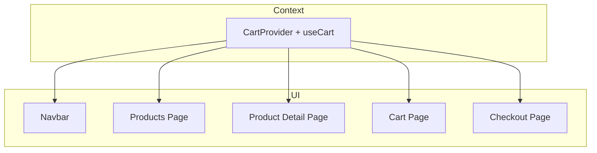
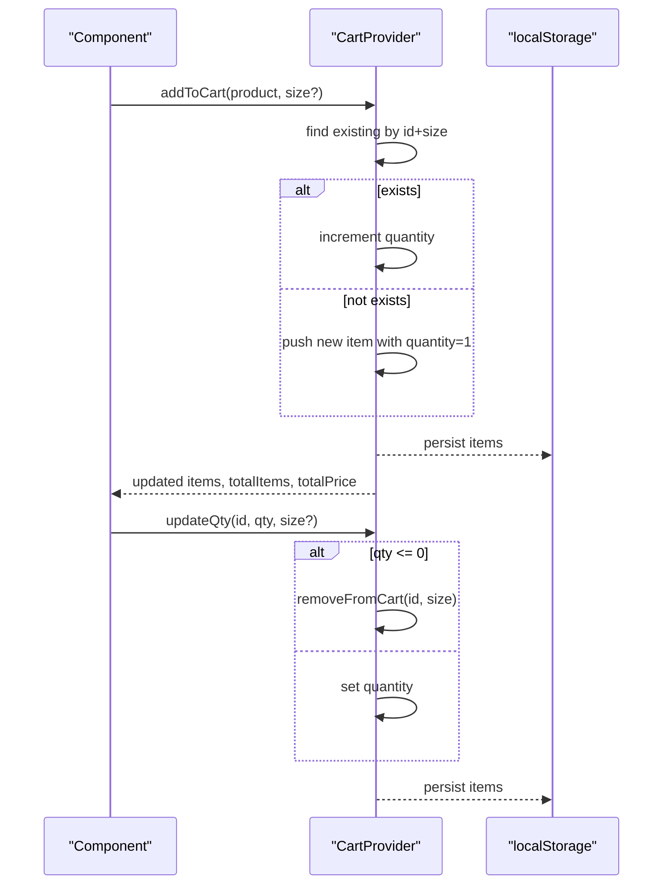
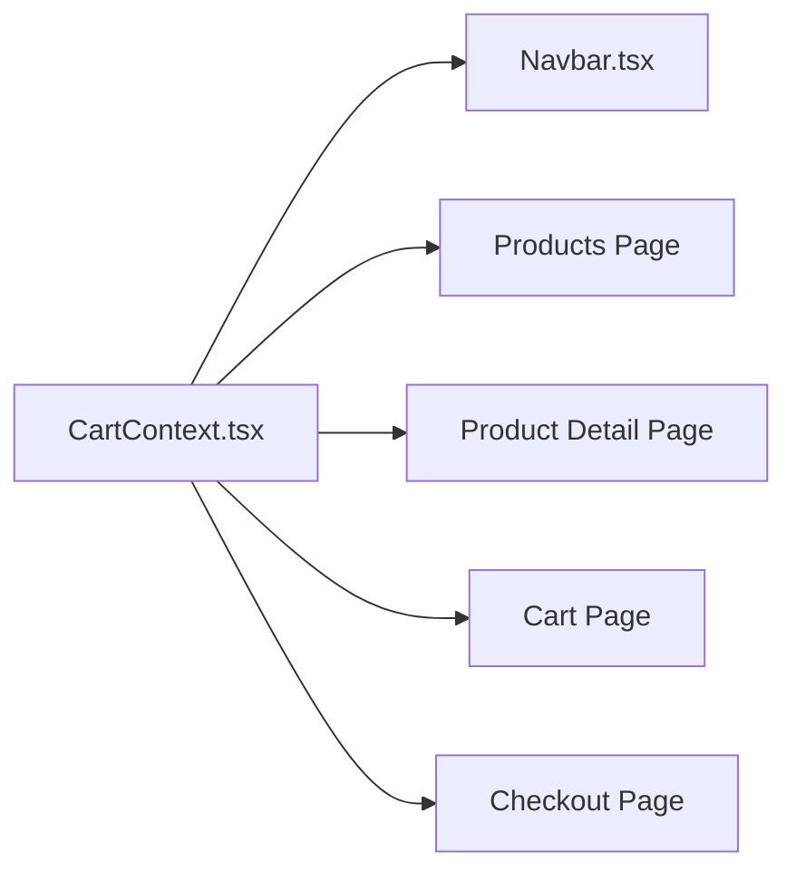
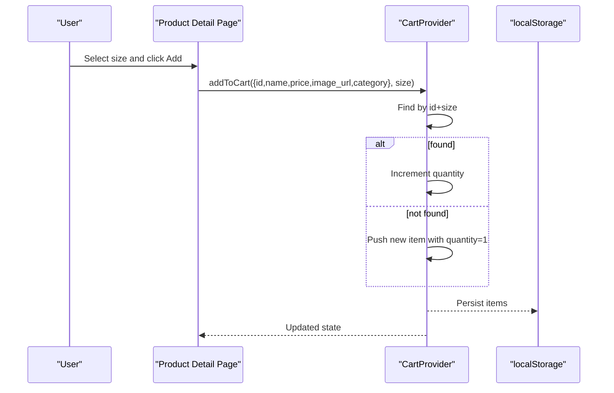
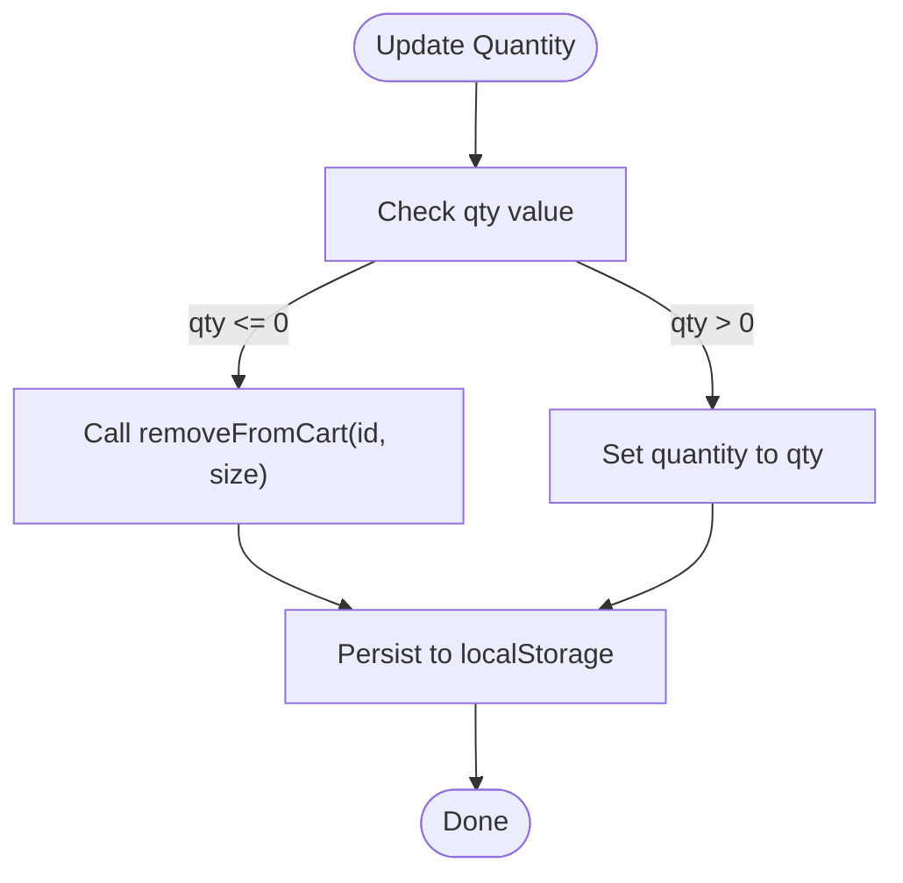

# Cart Context

<cite>
**Referenced Files in This Document**
- [CartContext.tsx](file://app/context/CartContext.tsx)
- [Navbar.tsx](file://components/Navbar.tsx)
- [page.tsx (Product Details)](file://app/product/[id]/page.tsx)
- [page.tsx (Products Listing)](file://app/products/page.tsx)
- [page.tsx (Cart Page)](file://app/cart/page.tsx)
- [page.tsx (Checkout Page)](file://app/checkout/page.tsx)
</cite>

## Table of Contents
1. [Introduction](#introduction)
2. [Project Structure](#project-structure)
3. [Core Components](#core-components)
4. [Architecture Overview](#architecture-overview)
5. [Detailed Component Analysis](#detailed-component-analysis)
6. [Dependency Analysis](#dependency-analysis)
7. [Performance Considerations](#performance-considerations)
8. [Troubleshooting Guide](#troubleshooting-guide)
9. [Conclusion](#conclusion)
10. [Appendices](#appendices)

## Introduction
This document explains the CartContext state management system used across the application to manage shopping cart state, including data structures, persistence, operations, and integration points with product pages, cart page, checkout flow, and navigation. It also covers edge cases such as duplicate items, invalid quantities, size variants, and cross-tab synchronization considerations.

## Project Structure
The cart functionality is implemented as a React context provider and consumed by multiple client components:
- Provider and hook: app/context/CartContext.tsx
- Navigation badge: components/Navbar.tsx
- Product detail add-to-cart: app/product/[id]/page.tsx
- Products listing quick-add: app/products/page.tsx
- Cart display and editing: app/cart/page.tsx
- Checkout summary and order submission: app/checkout/page.tsx

**Diagram sources**
- [CartContext.tsx:1-104](file://app/context/CartContext.tsx#L1-L104)
- [Navbar.tsx:1-187](file://components/Navbar.tsx#L1-L187)
- [page.tsx (Products Listing):1-800](file://app/products/page.tsx#L1-L800)
- [page.tsx (Product Details):1-800](file://app/product/[id]/page.tsx#L1-L800)
- [page.tsx (Cart Page):1-220](file://app/cart/page.tsx#L1-L220)
- [page.tsx (Checkout Page):1-430](file://app/checkout/page.tsx#L1-L430)

**Section sources**
- [CartContext.tsx:1-104](file://app/context/CartContext.tsx#L1-L104)
- [Navbar.tsx:1-187](file://components/Navbar.tsx#L1-L187)
- [page.tsx (Products Listing):1-800](file://app/products/page.tsx#L1-L800)
- [page.tsx (Product Details):1-800](file://app/product/[id]/page.tsx#L1-L800)
- [page.tsx (Cart Page):1-220](file://app/cart/page.tsx#L1-L220)
- [page.tsx (Checkout Page):1-430](file://app/checkout/page.tsx#L1-L430)

## Core Components
- CartItem interface defines the shape of each cart entry, including id, name, price, image_url, category, quantity, and optional size.
- CartContextType exposes:
  - items: current cart array
  - totalItems: sum of all item quantities
  - totalPrice: sum of price × quantity for all items
  - addToCart(product, size?): adds or increments an item by id+size key
  - removeFromCart(id, size?): removes matching item(s)
  - updateQty(id, qty, size?): updates quantity; non-positive values remove the item
  - clearCart(): empties the cart
  - isInCart(id): checks if any variant of the product is present

Key behaviors:
- Duplicate handling: Items are uniquely identified by id plus size. Adding the same id+size increments quantity rather than creating duplicates.
- Size variants: The optional size parameter differentiates variants of the same product.
- Quantity validation: updateQty treats zero or negative values as removal requests.
- Persistence: Cart state is persisted to localStorage under a fixed key and rehydrated on mount.

**Section sources**
- [CartContext.tsx:5-24](file://app/context/CartContext.tsx#L5-L24)
- [CartContext.tsx:28-97](file://app/context/CartContext.tsx#L28-L97)

## Architecture Overview
The CartProvider manages state and side effects:
- On mount, it reads from localStorage and hydrates state.
- On state changes, it writes back to localStorage after hydration.
- Computed totals are derived directly from the items array.
- Consumers access state via the useCart hook.

**Diagram sources**
- [CartContext.tsx:28-97](file://app/context/CartContext.tsx#L28-L97)

**Section sources**
- [CartContext.tsx:28-97](file://app/context/CartContext.tsx#L28-L97)

## Detailed Component Analysis

### Data Model and State Shape
- CartItem fields:
  - id: string — unique product identifier
  - name: string — product name
  - price: number — unit price
  - image_url: string — product image URL
  - category?: string — optional category label
  - quantity: number — units in cart
  - size?: string — optional size variant (e.g., “50ml”)

- Derived values:
  - totalItems: sum of quantities
  - totalPrice: sum of price × quantity

Complexity:
- Deriving totals is O(n) over items.
- Lookup for duplicates uses linear scan O(n).

Optimization opportunities:
- Use a Map keyed by id+size for O(1) lookup and updates.
- Memoize totals using useMemo to avoid recomputation on unrelated renders.

**Section sources**
- [CartContext.tsx:5-13](file://app/context/CartContext.tsx#L5-L13)
- [CartContext.tsx:87-88](file://app/context/CartContext.tsx#L87-L88)

### Persistence Strategy
- Storage key: a constant string used for both read and write.
- Hydration:
  - On first render, attempts to parse stored JSON into items.
  - A hydrated flag prevents writing before initial load completes.
- Write-back:
  - After hydration, every change to items triggers a write to storage.
- Error handling:
  - Read/write operations are wrapped in try/catch to tolerate malformed or missing storage entries.

Cross-tab synchronization:
- The current implementation does not listen for storage events. To synchronize across tabs, consider adding a window “storage” event listener that parses and applies updates when the cart key changes.

**Section sources**
- [CartContext.tsx:32-47](file://app/context/CartContext.tsx#L32-L47)

### Operations and Validation

#### addToCart
- Purpose: Add a product or increment its quantity if already present.
- Keying strategy: Uses id concatenated with size to identify unique entries.
- Default size: If no size provided, defaults to a standard value.
- Behavior:
  - If an item with the same id+size exists, increments its quantity by one.
  - Otherwise, pushes a new item with quantity set to one.

Edge cases:
- Multiple calls with the same product and size will increment accordingly.
- Different sizes create separate entries.

**Section sources**
- [CartContext.tsx:49-60](file://app/context/CartContext.tsx#L49-L60)

#### removeFromCart
- Purpose: Remove an item by id and optional size.
- Behavior:
  - If size is provided, removes only the matching variant.
  - If size is omitted, removes all variants of the given id.

Edge cases:
- Removing a non-existent id has no effect.

**Section sources**
- [CartContext.tsx:62-66](file://app/context/CartContext.tsx#L62-L66)

#### updateQuantity (updateQty)
- Purpose: Update quantity for a specific id and optional size.
- Validation:
  - If qty ≤ 0, delegates to removeFromCart to remove the item.
  - Otherwise, sets the exact quantity.

Edge cases:
- Passing zero or negative values safely removes the item.
- Non-matching id or size has no effect.

**Section sources**
- [CartContext.tsx:68-78](file://app/context/CartContext.tsx#L68-L78)

#### clearCart
- Purpose: Reset the cart to an empty array.

**Section sources**
- [CartContext.tsx:80](file://app/context/CartContext.tsx#L80)

#### isInCart
- Purpose: Check whether any variant of a product is present in the cart.
- Behavior: Returns true if at least one item matches the id.

Note: This check ignores size. If you need size-aware presence checks, extend the API.

**Section sources**
- [CartContext.tsx:82-85](file://app/context/CartContext.tsx#L82-L85)

### Integration Points

#### Navbar Badge
- Displays totalItems count from the cart context.
- Provides a link to the cart page.

**Section sources**
- [Navbar.tsx:10-11](file://components/Navbar.tsx#L10-L11)
- [Navbar.tsx:98-107](file://components/Navbar.tsx#L98-L107)

#### Product Detail Page
- Adds to cart with selected size and computed price based on size selection.
- Shows an “In Cart” indicator using isInCart.
- Supports adding multiple units by looping the add operation per requested quantity.

**Section sources**
- [page.tsx (Product Details):22](file://app/product/[id]/page.tsx#L22)
- [page.tsx (Product Details):169-176](file://app/product/[id]/page.tsx#L169-L176)
- [page.tsx (Product Details):178-188](file://app/product/[id]/page.tsx#L178-L188)
- [page.tsx (Product Details):491-497](file://app/product/[id]/page.tsx#L491-L497)

#### Products Listing Page
- Quick-add button calls addToCart without size (uses default size).
- Uses isInCart to show “In Cart” status on cards.

**Section sources**
- [page.tsx (Products Listing):40](file://app/products/page.tsx#L40)
- [page.tsx (Products Listing):172-184](file://app/products/page.tsx#L172-L184)
- [page.tsx (Products Listing):550-564](file://app/products/page.tsx#L550-L564)

#### Cart Page
- Displays items with size labels and per-item line totals.
- Allows updating quantities and removing items.
- Clears the entire cart.
- Computes subtotal and shipping logic based on totalPrice threshold.

**Section sources**
- [page.tsx (Cart Page):11](file://app/cart/page.tsx#L11)
- [page.tsx (Cart Page):91-132](file://app/cart/page.tsx#L91-L132)
- [page.tsx (Cart Page):136-164](file://app/cart/page.tsx#L136-L164)

#### Checkout Page
- Reads items, totalItems, and totalPrice from context.
- Redirects to cart if empty.
- Applies promo code discount and computes final total including shipping.
- Clears cart after successful order submission and navigates to confirmation.

**Section sources**
- [page.tsx (Checkout Page):13](file://app/checkout/page.tsx#L13)
- [page.tsx (Checkout Page):32-36](file://app/checkout/page.tsx#L32-L36)
- [page.tsx (Checkout Page):60-61](file://app/checkout/page.tsx#L60-L61)
- [page.tsx (Checkout Page):63-71](file://app/checkout/page.tsx#L63-L71)
- [page.tsx (Checkout Page):159-160](file://app/checkout/page.tsx#L159-L160)

### Calculating Totals and Shipping
- Subtotal: totalPrice (sum of price × quantity).
- Shipping: free above a threshold; otherwise a flat fee.
- Final total: subtotal + shipping − discount.

These calculations are performed in the cart and checkout pages using the context-provided totals.

**Section sources**
- [CartContext.tsx:87-88](file://app/context/CartContext.tsx#L87-L88)
- [page.tsx (Cart Page):143-163](file://app/cart/page.tsx#L143-L163)
- [page.tsx (Checkout Page):60-61](file://app/checkout/page.tsx#L60-L61)

### Handling Size Variants
- Size is part of the uniqueness key for cart entries.
- Product detail page selects size and adjusts price accordingly before adding to cart.
- Cart page displays size per item and allows independent quantity control per size.

**Section sources**
- [CartContext.tsx:49-60](file://app/context/CartContext.tsx#L49-L60)
- [page.tsx (Product Details):169-176](file://app/product/[id]/page.tsx#L169-L176)
- [page.tsx (Cart Page):106-108](file://app/cart/page.tsx#L106-L108)

### Managing Cart State in Components
- Use the useCart hook to access items, totals, and actions.
- Prefer functional state updates inside the provider to ensure correctness.
- For UI feedback (e.g., toasts), maintain local component state triggered by cart actions.

**Section sources**
- [Navbar.tsx:10-11](file://components/Navbar.tsx#L10-L11)
- [page.tsx (Products Listing):172-184](file://app/products/page.tsx#L172-L184)
- [page.tsx (Product Details):178-188](file://app/product/[id]/page.tsx#L178-L188)

## Dependency Analysis
The following diagram shows how components depend on the CartContext and where they call cart operations.

**Diagram sources**
- [CartContext.tsx:1-104](file://app/context/CartContext.tsx#L1-L104)
- [Navbar.tsx:1-187](file://components/Navbar.tsx#L1-L187)
- [page.tsx (Products Listing):1-800](file://app/products/page.tsx#L1-L800)
- [page.tsx (Product Details):1-800](file://app/product/[id]/page.tsx#L1-L800)
- [page.tsx (Cart Page):1-220](file://app/cart/page.tsx#L1-L220)
- [page.tsx (Checkout Page):1-430](file://app/checkout/page.tsx#L1-L430)

**Section sources**
- [CartContext.tsx:1-104](file://app/context/CartContext.tsx#L1-L104)
- [Navbar.tsx:1-187](file://components/Navbar.tsx#L1-L187)
- [page.tsx (Products Listing):1-800](file://app/products/page.tsx#L1-L800)
- [page.tsx (Product Details):1-800](file://app/product/[id]/page.tsx#L1-L800)
- [page.tsx (Cart Page):1-220](file://app/cart/page.tsx#L1-L220)
- [page.tsx (Checkout Page):1-430](file://app/checkout/page.tsx#L1-L430)

## Performance Considerations
- Current totals computation is O(n) per render. Consider memoizing totalItems and totalPrice with useMemo to avoid unnecessary recalculations.
- Duplicate detection uses linear search. For large carts, switch to a Map keyed by id+size to achieve O(1) lookups and updates.
- LocalStorage writes occur on every state change. Debounce or batch writes if performance becomes a concern.
- Avoid passing large objects through props; rely on context for shared state.

[No sources needed since this section provides general guidance]

## Troubleshooting Guide
Common issues and resolutions:
- Cart not persisting across reloads:
  - Ensure the provider is mounted within a client component tree and that localStorage is available.
  - Verify there are no errors during JSON.parse or JSON.stringify.
- Unexpected duplicates:
  - Confirm that size is passed consistently when adding items. Different sizes create separate entries.
- Invalid quantities:
  - updateQty removes items for non-positive values. Validate user input before calling updateQty if you want to prevent accidental removals.
- Cross-tab sync:
  - The current implementation does not listen for storage events. Add a window “storage” event listener to keep tabs synchronized.
- Checkout redirect when cart is empty:
  - The checkout page redirects to cart if items are empty. Ensure items are added before proceeding.

**Section sources**
- [CartContext.tsx:32-47](file://app/context/CartContext.tsx#L32-L47)
- [CartContext.tsx:68-78](file://app/context/CartContext.tsx#L68-L78)
- [page.tsx (Checkout Page):32-36](file://app/checkout/page.tsx#L32-L36)

## Conclusion
The CartContext provides a straightforward, persistent shopping cart solution with support for size variants and basic validations. It integrates cleanly across product browsing, cart review, and checkout flows. For production-scale carts, consider optimizing lookups and computations, adding robust error boundaries, and implementing cross-tab synchronization.

[No sources needed since this section summarizes without analyzing specific files]

## Appendices

### API Reference Summary
- addToCart(itemWithoutQuantity, size?): void
- removeFromCart(id, size?): void
- updateQty(id, qty, size?): void
- clearCart(): void
- isInCart(id): boolean
- totalItems: number
- totalPrice: number

**Section sources**
- [CartContext.tsx:15-24](file://app/context/CartContext.tsx#L15-L24)

### Example Workflows

#### Add to Cart with Size Variant

**Diagram sources**
- [CartContext.tsx:49-60](file://app/context/CartContext.tsx#L49-L60)
- [page.tsx (Product Details):169-188](file://app/product/[id]/page.tsx#L169-L188)

#### Update Quantity Flow

**Diagram sources**
- [CartContext.tsx:68-78](file://app/context/CartContext.tsx#L68-L78)