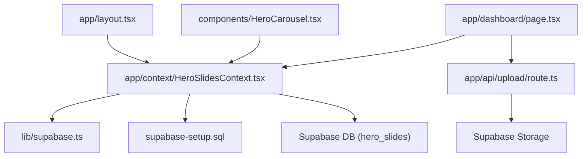
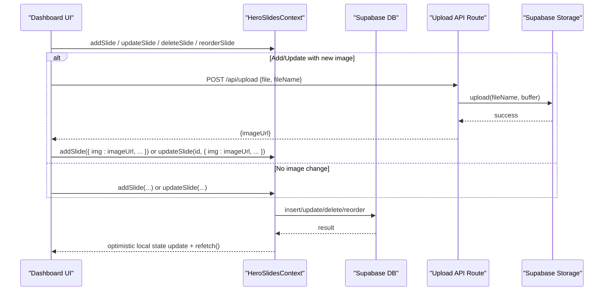
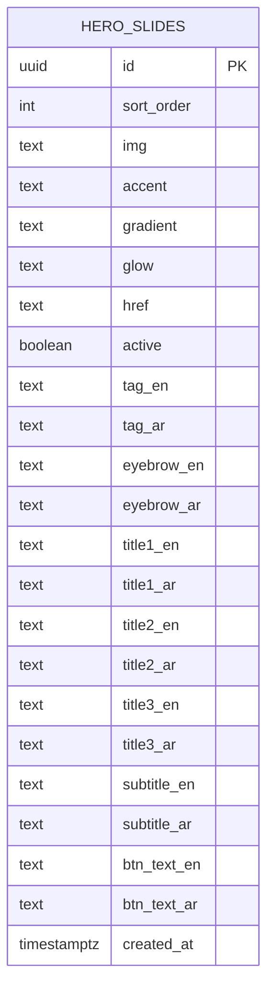
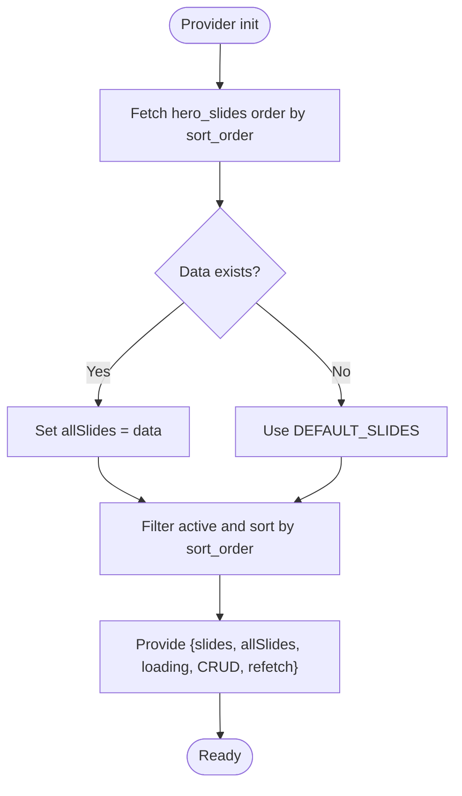
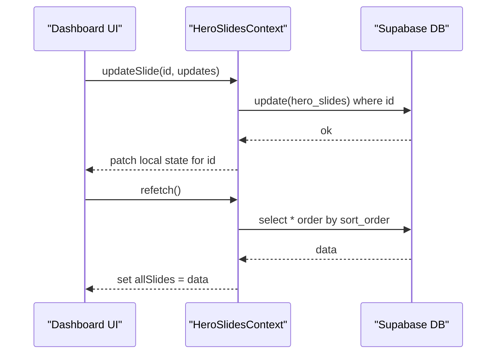
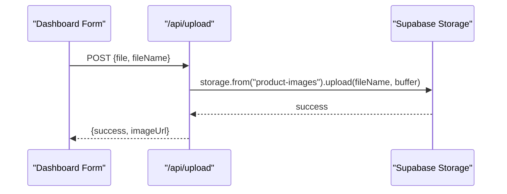
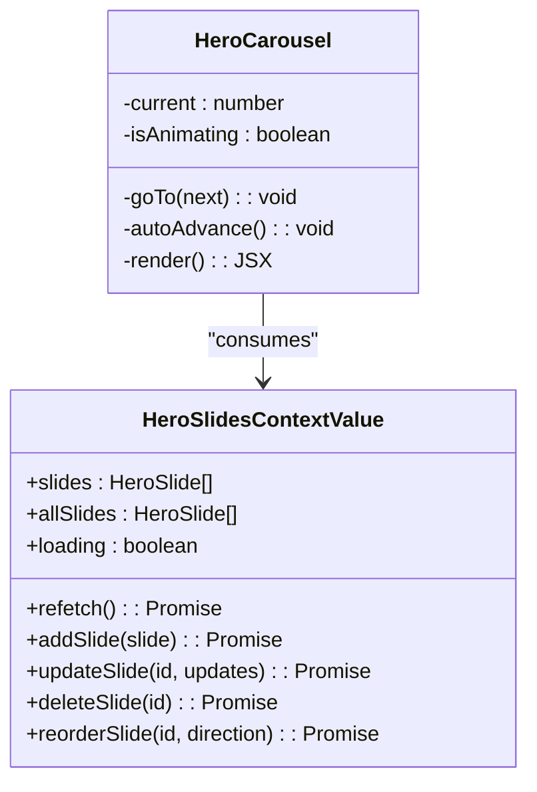
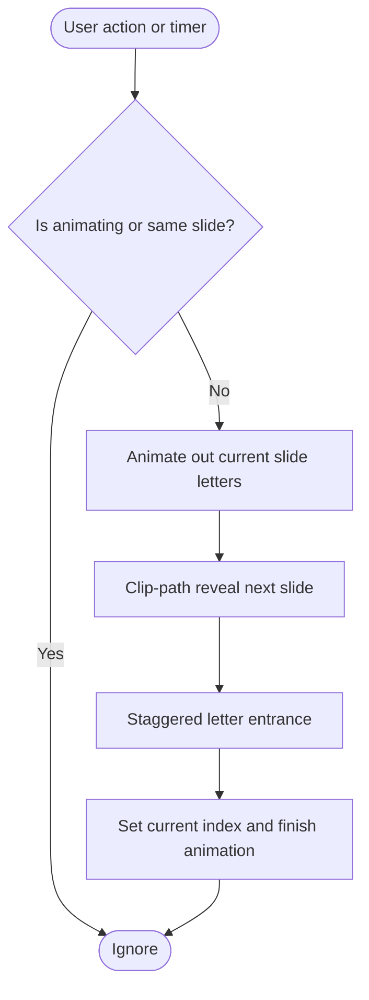
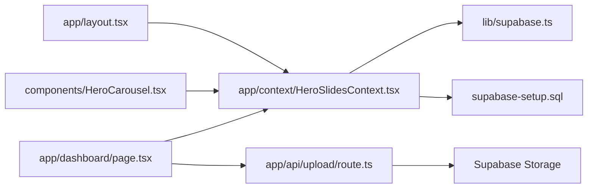

# Hero Slides Context

<cite>
**Referenced Files in This Document**
- [HeroSlidesContext.tsx](file://app/context/HeroSlidesContext.tsx)
- [HeroCarousel.tsx](file://components/HeroCarousel.tsx)
- [supabase-setup.sql](file://supabase-setup.sql)
- [supabase.ts](file://lib/supabase.ts)
- [route.ts](file://app/api/upload/route.ts)
- [layout.tsx](file://app/layout.tsx)
- [page.tsx](file://app/page.tsx)
</cite>

## Table of Contents
1. [Introduction](#introduction)
2. [Project Structure](#project-structure)
3. [Core Components](#core-components)
4. [Architecture Overview](#architecture-overview)
5. [Detailed Component Analysis](#detailed-component-analysis)
6. [Dependency Analysis](#dependency-analysis)
7. [Performance Considerations](#performance-considerations)
8. [Troubleshooting Guide](#troubleshooting-guide)
9. [Conclusion](#conclusion)
10. [Appendices](#appendices)

## Introduction
This document explains the HeroSlidesContext carousel content management system. It covers the hero slide data model (including multi-language fields), ordering and visibility, CRUD operations, image upload integration, real-time synchronization behavior, and how the HeroCarousel consumes and renders slides. It also provides guidance on performance, lazy loading strategies, and best practices for creating engaging carousel content.

## Project Structure
The HeroSlides feature spans a few key files:
- Data model and context provider: app/context/HeroSlidesContext.tsx
- Database schema and policies: supabase-setup.sql
- Supabase client configuration: lib/supabase.ts
- Upload API route: app/api/upload/route.ts
- Carousel UI component: components/HeroCarousel.tsx
- App layout where providers are mounted: app/layout.tsx
- Home page that includes the carousel: app/page.tsx

**Diagram sources**
- [layout.tsx:62-82](file://app/layout.tsx#L62-L82)
- [HeroSlidesContext.tsx:157-283](file://app/context/HeroSlidesContext.tsx#L157-L283)
- [supabase.ts:1-46](file://lib/supabase.ts#L1-L46)
- [supabase-setup.sql:86-133](file://supabase-setup.sql#L86-L133)
- [HeroCarousel.tsx:11-16](file://components/HeroCarousel.tsx#L11-L16)
- [route.ts:1-67](file://app/api/upload/route.ts#L1-L67)

**Section sources**
- [layout.tsx:62-82](file://app/layout.tsx#L62-L82)
- [HeroSlidesContext.tsx:157-283](file://app/context/HeroSlidesContext.tsx#L157-L283)
- [supabase-setup.sql:86-133](file://supabase-setup.sql#L86-L133)
- [supabase.ts:1-46](file://lib/supabase.ts#L1-L46)
- [HeroCarousel.tsx:11-16](file://components/HeroCarousel.tsx#L11-L16)
- [route.ts:1-67](file://app/api/upload/route.ts#L1-L67)

## Core Components
- HeroSlidesContext: Provides stateful access to all slides and active slides, with CRUD methods and reordering. It loads from Supabase and falls back to built-in defaults when needed.
- HeroCarousel: Consumes the context to render an animated, auto-advancing carousel with keyboard and dot navigation.
- Upload API: Server-side route to upload images to Supabase storage and return public URLs.
- Supabase client: Centralized client initialization with environment-based configuration and fallbacks.
- Database schema: Defines the hero_slides table and RLS policies.

Key responsibilities:
- Data persistence and retrieval via Supabase
- Local state synchronization after mutations
- Rendering and animation orchestration in the carousel
- Image upload flow through a Next.js API route

**Section sources**
- [HeroSlidesContext.tsx:13-37](file://app/context/HeroSlidesContext.tsx#L13-L37)
- [HeroSlidesContext.tsx:157-283](file://app/context/HeroSlidesContext.tsx#L157-L283)
- [HeroCarousel.tsx:11-16](file://components/HeroCarousel.tsx#L11-L16)
- [route.ts:1-67](file://app/api/upload/route.ts#L1-L67)
- [supabase.ts:1-46](file://lib/supabase.ts#L1-L46)
- [supabase-setup.sql:86-133](file://supabase-setup.sql#L86-L133)

## Architecture Overview
The system uses React Context to manage carousel state and integrates with Supabase for persistence. The carousel reads active slides from context and animates transitions. Admin flows (dashboard) use the same context methods to add/update/delete/reorder slides and trigger refetches.

**Diagram sources**
- [HeroSlidesContext.tsx:188-260](file://app/context/HeroSlidesContext.tsx#L188-L260)
- [route.ts:4-66](file://app/api/upload/route.ts#L4-L66)
- [supabase-setup.sql:86-133](file://supabase-setup.sql#L86-L133)

## Detailed Component Analysis

### Data Model and Multi-Language Support
The hero slide entity includes:
- Ordering and visibility: sort_order, active
- Media and styling: img, accent, gradient, glow, href
- Multi-language text fields: tag_en/tag_ar, eyebrow_en/eyebrow_ar, title1_en/title1_ar, title2_en/title2_ar, title3_en/title3_ar, subtitle_en/subtitle_ar, btn_text_en/btn_text_ar
- Timestamps: created_at

The database schema mirrors these fields and enables public read/write via Row Level Security policies for demo/admin usage.

**Diagram sources**
- [supabase-setup.sql:86-110](file://supabase-setup.sql#L86-L110)

**Section sources**
- [HeroSlidesContext.tsx:13-37](file://app/context/HeroSlidesContext.tsx#L13-L37)
- [supabase-setup.sql:86-110](file://supabase-setup.sql#L86-L110)

### Context Provider and State Management
Responsibilities:
- Load slides from Supabase ordered by sort_order; fall back to default slides if empty or error
- Provide filtered active slides for the carousel
- Expose CRUD methods: addSlide, updateSlide, deleteSlide, reorderSlide
- Provide refetch to refresh state
- Maintain a loading flag

Behavioral notes:
- On add, the new item is appended and the list is sorted by sort_order
- On update, local state is patched immediately
- On delete, the item is removed locally
- Reorder swaps sort_order between adjacent items and updates local state

**Diagram sources**
- [HeroSlidesContext.tsx:157-186](file://app/context/HeroSlidesContext.tsx#L157-L186)
- [HeroSlidesContext.tsx:262-266](file://app/context/HeroSlidesContext.tsx#L262-L266)

**Section sources**
- [HeroSlidesContext.tsx:157-186](file://app/context/HeroSlidesContext.tsx#L157-L186)
- [HeroSlidesContext.tsx:188-260](file://app/context/HeroSlidesContext.tsx#L188-L260)
- [HeroSlidesContext.tsx:262-266](file://app/context/HeroSlidesContext.tsx#L262-L266)

### CRUD Operations and Real-Time Synchronization
- Add: Inserts into Supabase, then merges the returned record into local state and sorts by sort_order
- Update: Updates Supabase and patches local state for the matching id
- Delete: Deletes from Supabase and removes from local state
- Reorder: Swaps sort_order between two adjacent records and updates local state accordingly
- Refetch: Reloads all slides from Supabase and resets loading state

Real-time behavior:
- There is no persistent listener configured in the context. Changes propagate immediately via optimistic local updates after successful server responses.
- Consumers can call refetch to force a full reload from the database.

**Diagram sources**
- [HeroSlidesContext.tsx:205-217](file://app/context/HeroSlidesContext.tsx#L205-L217)
- [HeroSlidesContext.tsx:161-182](file://app/context/HeroSlidesContext.tsx#L161-L182)

**Section sources**
- [HeroSlidesContext.tsx:188-260](file://app/context/HeroSlidesContext.tsx#L188-L260)
- [HeroSlidesContext.tsx:161-182](file://app/context/HeroSlidesContext.tsx#L161-L182)

### Image Upload Integration
The dashboard uploads images via a Next.js API route:
- Client builds FormData with file and a generated fileName
- POST to /api/upload
- Server converts File to ArrayBuffer/Buffer and uploads to Supabase Storage bucket
- Returns the public URL to the client

**Diagram sources**
- [route.ts:4-66](file://app/api/upload/route.ts#L4-L66)

**Section sources**
- [route.ts:4-66](file://app/api/upload/route.ts#L4-L66)

### Consuming Hero Slide Data in HeroCarousel
The HeroCarousel:
- Reads slides from useHeroSlides()
- Manages current index, animations, and auto-advance
- Renders slide elements and progress dots
- Supports keyboard navigation and click/touch interactions

It does not directly render per-slide text/media from the data model in this implementation; it focuses on animated lettering and global background visuals. The context still supplies the number of slides and drives navigation logic.

**Diagram sources**
- [HeroSlidesContext.tsx:139-153](file://app/context/HeroSlidesContext.tsx#L139-L153)
- [HeroCarousel.tsx:11-16](file://components/HeroCarousel.tsx#L11-L16)
- [HeroCarousel.tsx:102-137](file://components/HeroCarousel.tsx#L102-L137)

**Section sources**
- [HeroCarousel.tsx:11-16](file://components/HeroCarousel.tsx#L11-L16)
- [HeroCarousel.tsx:102-137](file://components/HeroCarousel.tsx#L102-L137)

### Slide Navigation and Transitions
Navigation features:
- Auto-advance with a fixed duration timer
- Clickable progress dots
- Keyboard left/right arrows
- GSAP-driven clip-path transitions and staggered letter animations
- Optional parallax effect on desktop

**Diagram sources**
- [HeroCarousel.tsx:102-128](file://components/HeroCarousel.tsx#L102-L128)
- [HeroCarousel.tsx:131-137](file://components/HeroCarousel.tsx#L131-L137)
- [HeroCarousel.tsx:189-197](file://components/HeroCarousel.tsx#L189-L197)

**Section sources**
- [HeroCarousel.tsx:102-137](file://components/HeroCarousel.tsx#L102-L137)
- [HeroCarousel.tsx:189-197](file://components/HeroCarousel.tsx#L189-L197)

## Dependency Analysis
- HeroSlidesContext depends on:
  - Supabase client (lib/supabase.ts)
  - Database schema (supabase-setup.sql)
- HeroCarousel depends on:
  - HeroSlidesContext
  - Language context for RTL support
- Upload API depends on:
  - Supabase Storage
- Providers are mounted in the root layout so all pages can consume them.

**Diagram sources**
- [layout.tsx:62-82](file://app/layout.tsx#L62-L82)
- [HeroSlidesContext.tsx:157-283](file://app/context/HeroSlidesContext.tsx#L157-L283)
- [supabase.ts:1-46](file://lib/supabase.ts#L1-L46)
- [supabase-setup.sql:86-133](file://supabase-setup.sql#L86-L133)
- [HeroCarousel.tsx:11-16](file://components/HeroCarousel.tsx#L11-L16)
- [route.ts:1-67](file://app/api/upload/route.ts#L1-L67)

**Section sources**
- [layout.tsx:62-82](file://app/layout.tsx#L62-L82)
- [HeroSlidesContext.tsx:157-283](file://app/context/HeroSlidesContext.tsx#L157-L283)
- [supabase.ts:1-46](file://lib/supabase.ts#L1-L46)
- [supabase-setup.sql:86-133](file://supabase-setup.sql#L86-L133)
- [HeroCarousel.tsx:11-16](file://components/HeroCarousel.tsx#L11-L16)
- [route.ts:1-67](file://app/api/upload/route.ts#L1-L67)

## Performance Considerations
- Avoid heavy filters on large arrays: The context filters active slides once during render; keep the number of slides reasonable.
- Prefer stable IDs: Default slides use predictable ids; ensure custom slides have unique ids to avoid unnecessary re-renders.
- Optimize media assets:
  - Serve appropriately sized images (responsive srcset or CDN resizing)
  - Use modern formats (WebP/AVIF) where supported
  - Compress images before upload
- Lazy loading:
  - For future enhancements, consider lazy-loading off-screen slide assets using IntersectionObserver
  - Defer non-critical animations until first paint completes
- Animation efficiency:
  - Keep GSAP targets minimal and reuse refs
  - Disable expensive effects on mobile (already handled for blur)
- Network calls:
  - Batch updates where possible
  - Use refetch sparingly; rely on optimistic updates for immediate feedback

[No sources needed since this section provides general guidance]

## Troubleshooting Guide
Common issues and resolutions:
- Missing or placeholder Supabase credentials:
  - The client logs a message and falls back to defaults; verify environment variables and policies
- Upload failures:
  - Ensure the storage bucket exists and is public; check CORS and RLS policies
- Slide not appearing:
  - Verify active is true and sort_order is set correctly
  - Call refetch to reload from the database
- Reorder not working for default slides:
  - Default slides cannot be reordered; import them to the database first

Operational checks:
- Confirm hero_slides table exists and has RLS policies allowing public access
- Validate that the product-images storage bucket exists and is public

**Section sources**
- [supabase.ts:35-39](file://lib/supabase.ts#L35-L39)
- [supabase-setup.sql:112-133](file://supabase-setup.sql#L112-L133)
- [HeroSlidesContext.tsx:161-182](file://app/context/HeroSlidesContext.tsx#L161-L182)
- [route.ts:36-48](file://app/api/upload/route.ts#L36-L48)

## Conclusion
The HeroSlidesContext provides a robust foundation for managing carousel content with clear separation between data and presentation. It supports multi-language fields, ordering, and visibility toggles, while offering straightforward CRUD operations and an upload pipeline for images. The HeroCarousel leverages this context to deliver smooth, accessible transitions. With careful attention to asset optimization and lazy loading, the system scales well for rich, engaging hero experiences.

[No sources needed since this section summarizes without analyzing specific files]

## Appendices

### Example: Creating a New Slide (Dashboard Flow)
- Select an image file and preview it
- Fill in multi-language fields and styling options
- Submit to upload the image and persist the slide via context methods
- Optionally reorder or toggle active status

**Section sources**
- [HeroSlidesContext.tsx:188-203](file://app/context/HeroSlidesContext.tsx#L188-L203)
- [HeroSlidesContext.tsx:205-217](file://app/context/HeroSlidesContext.tsx#L205-L217)
- [HeroSlidesContext.tsx:228-260](file://app/context/HeroSlidesContext.tsx#L228-L260)
- [route.ts:1474-1494](file://app/api/upload/route.ts#L1474-L1494)

### Example: Consuming Slides in a Page
- Wrap your app with HeroSlidesProvider in the root layout
- Use useHeroSlides() in any component to get slides and CRUD methods
- Render the HeroCarousel component to display the active slides

**Section sources**
- [layout.tsx:62-82](file://app/layout.tsx#L62-L82)
- [HeroCarousel.tsx:11-16](file://components/HeroCarousel.tsx#L11-L16)