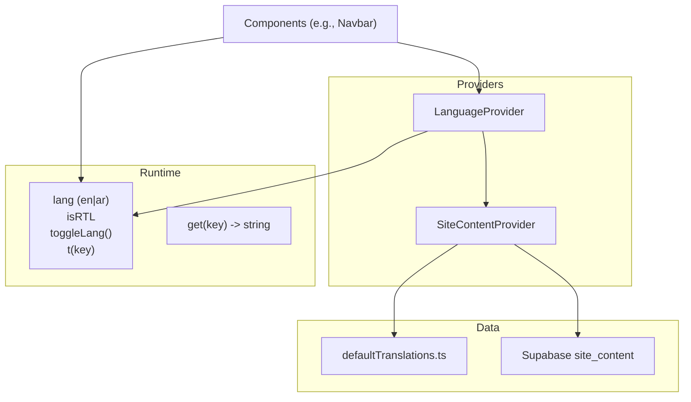
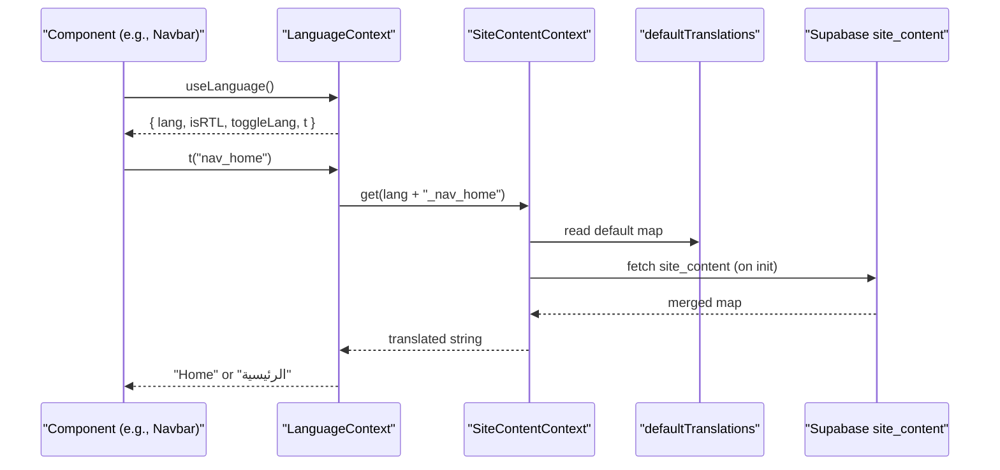
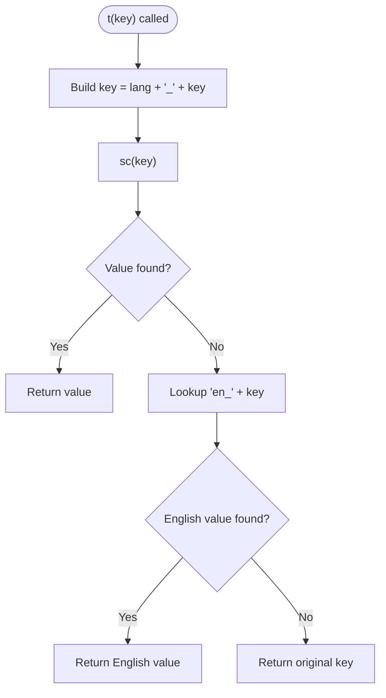
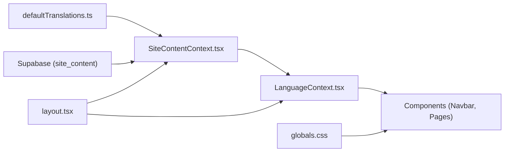

# Language Context

<cite>
**Referenced Files in This Document**
- [LanguageContext.tsx](file://app/context/LanguageContext.tsx)
- [SiteContentContext.tsx](file://app/context/SiteContentContext.tsx)
- [defaultTranslations.ts](file://app/context/defaultTranslations.ts)
- [layout.tsx](file://app/layout.tsx)
- [globals.css](file://app/globals.css)
- [Navbar.tsx](file://components/Navbar.tsx)
</cite>

## Table of Contents
1. [Introduction](#introduction)
2. [Project Structure](#project-structure)
3. [Core Components](#core-components)
4. [Architecture Overview](#architecture-overview)
5. [Detailed Component Analysis](#detailed-component-analysis)
6. [Dependency Analysis](#dependency-analysis)
7. [Performance Considerations](#performance-considerations)
8. [Troubleshooting Guide](#troubleshooting-guide)
9. [Conclusion](#conclusion)
10. [Appendices](#appendices)

## Introduction
This document explains the internationalization system centered around LanguageContext, which provides bilingual support for English and Arabic with automatic RTL layout adaptation. It covers translation key structure, language switching, locale detection, persistent preference storage, dynamic text rendering, pluralization guidance, RTL CSS considerations, font loading, cultural adaptations, and best practices for maintaining consistency and adding new languages.

## Project Structure
The i18n system is implemented as a small set of React contexts and configuration:
- LanguageContext manages current language, RTL state, and translation lookup.
- SiteContentContext loads site content from defaults and Supabase, providing a unified get/update API.
- defaultTranslations contains all static keys and values for both languages.
- Root layout wires providers and Google Fonts for Latin and Arabic scripts.
- Global styles adapt fonts and spacing for RTL.
- Navbar demonstrates usage of useLanguage and toggling between languages.

**Diagram sources**
- [LanguageContext.tsx:17-51](file://app/context/LanguageContext.tsx#L17-L51)
- [SiteContentContext.tsx:22-103](file://app/context/SiteContentContext.tsx#L22-L103)
- [defaultTranslations.ts:1-494](file://app/context/defaultTranslations.ts#L1-L494)

**Section sources**
- [LanguageContext.tsx:1-58](file://app/context/LanguageContext.tsx#L1-L58)
- [SiteContentContext.tsx:1-110](file://app/context/SiteContentContext.tsx#L1-L110)
- [defaultTranslations.ts:1-494](file://app/context/defaultTranslations.ts#L1-L494)
- [layout.tsx:1-83](file://app/layout.tsx#L1-L83)
- [globals.css:37-47](file://app/globals.css#L37-L47)
- [Navbar.tsx:1-187](file://components/Navbar.tsx#L1-L187)

## Core Components
- LanguageProvider
  - Maintains lang state ("en" | "ar") and exposes isRTL, toggleLang, and t(key).
  - Syncs <html lang> and <html dir> attributes on language change.
  - Uses SiteContentContext to resolve translations via t(key), with fallback to English or raw key.
- SiteContentProvider
  - Initializes content from defaultTranslations.
  - Fetches site_content rows from Supabase and merges them over defaults.
  - Provides get(key) that returns the resolved value across defaults and database overrides.
- defaultTranslations
  - Centralized dictionary of keys prefixed by language code (e.g., en_nav_home, ar_nav_home).
  - Includes UI strings, hero, categories, testimonials, footer, finder, and image paths.

Usage highlights:
- useLanguage hook returns { lang, isRTL, toggleLang, t }.
- Navbar uses t("nav_*") and t("lang_btn"), and toggles language via toggleLang.

**Section sources**
- [LanguageContext.tsx:17-51](file://app/context/LanguageContext.tsx#L17-L51)
- [SiteContentContext.tsx:22-103](file://app/context/SiteContentContext.tsx#L22-L103)
- [defaultTranslations.ts:1-494](file://app/context/defaultTranslations.ts#L1-L494)
- [Navbar.tsx:12-96](file://components/Navbar.tsx#L12-L96)

## Architecture Overview
The runtime flow connects components to context providers and data sources:

**Diagram sources**
- [LanguageContext.tsx:32-44](file://app/context/LanguageContext.tsx#L32-L44)
- [SiteContentContext.tsx:27-54](file://app/context/SiteContentContext.tsx#L27-L54)
- [defaultTranslations.ts:1-494](file://app/context/defaultTranslations.ts#L1-L494)

## Detailed Component Analysis

### LanguageProvider and useLanguage
Responsibilities:
- State management for current language and derived isRTL flag.
- Side effect to update <html lang> and <html dir>.
- Translation function t(key) that resolves through SiteContentContext with fallback logic.
- Provider exposing { lang, isRTL, toggleLang, t }.

Key behaviors:
- toggleLang flips between "en" and "ar".
- t(key) first tries `${lang}_${key}`, then falls back to `en_${key}`, then returns the key itself if missing.

**Diagram sources**
- [LanguageContext.tsx:32-44](file://app/context/LanguageContext.tsx#L32-L44)

**Section sources**
- [LanguageContext.tsx:17-51](file://app/context/LanguageContext.tsx#L17-L51)
- [LanguageContext.tsx:53-57](file://app/context/LanguageContext.tsx#L53-L57)

### SiteContentProvider and Data Resolution
Responsibilities:
- Initialize content from defaultTranslations.
- Fetch site_content from Supabase and merge into defaults.
- Provide get(key) with safe resolution order: runtime content > defaults > empty string.

Notes:
- The provider also supports updating text and uploading images via an API route; this is not used by LanguageContext but available for CMS-like editing.

**Section sources**
- [SiteContentContext.tsx:22-103](file://app/context/SiteContentContext.tsx#L22-L103)

### defaultTranslations Key Structure
Structure:
- Keys are prefixed by language code: en_*, ar_*.
- Organized by feature area (navbar, hero, categories, process, notes, story, testimonials, VIP, newsletter, footer, gifting, signature discovery, editorial, lookbook, fragrance finder, lang toggle).
- Image paths are included under generic keys (hero_image, cat*_image, etc.).

How to add new translations:
- Add matching en_* and ar_* entries in defaultTranslations.ts.
- Use t("your_key") in components; ensure the key exists in both languages to avoid fallbacks.

**Section sources**
- [defaultTranslations.ts:1-494](file://app/context/defaultTranslations.ts#L1-L494)

### Layout and Font Loading
- Root layout wraps the app with SiteContentProvider and LanguageProvider.
- Google Fonts include Latin (Bodoni, Inter) and Arabic (Amiri, Cairo, Tajawal) subsets with variable names exposed as CSS variables.
- html element receives initial lang="en" and class variables for fonts.

**Section sources**
- [layout.tsx:13-43](file://app/layout.tsx#L13-L43)
- [layout.tsx:57-83](file://app/layout.tsx#L57-L83)

### RTL CSS Adaptation
- When lang="ar" or dir="rtl", global styles switch serif/sans/title fonts to Arabic-friendly families.
- Letter-spacing normalization applied to prevent wide spacing in Arabic text.
- Components can conditionally adjust direction and margins/borders using isRTL.

**Section sources**
- [globals.css:37-47](file://app/globals.css#L37-L47)

### Language Switching in Navbar
- Navbar consumes useLanguage and renders links via t("nav_*").
- A button calls toggleLang to flip language and updates aria labels and title accordingly.
- Mobile drawer mirrors behavior and respects direction.

**Section sources**
- [Navbar.tsx:12-96](file://components/Navbar.tsx#L12-L96)
- [Navbar.tsx:160-176](file://components/Navbar.tsx#L160-L176)

## Dependency Analysis
High-level dependencies:
- LanguageContext depends on SiteContentContext for translation resolution.
- SiteContentContext depends on defaultTranslations and Supabase client.
- Components depend on LanguageContext via useLanguage.
- Root layout composes providers and initializes fonts.

**Diagram sources**
- [SiteContentContext.tsx:22-103](file://app/context/SiteContentContext.tsx#L22-L103)
- [LanguageContext.tsx:17-51](file://app/context/LanguageContext.tsx#L17-L51)
- [layout.tsx:57-83](file://app/layout.tsx#L57-L83)
- [globals.css:37-47](file://app/globals.css#L37-L47)

**Section sources**
- [SiteContentContext.tsx:1-110](file://app/context/SiteContentContext.tsx#L1-L110)
- [LanguageContext.tsx:1-58](file://app/context/LanguageContext.tsx#L1-L58)
- [layout.tsx:1-83](file://app/layout.tsx#L1-L83)
- [globals.css:1-200](file://app/globals.css#L1-L200)

## Performance Considerations
- Translation lookup is O(1) per key due to object/map access.
- Avoid heavy computations inside t(key); keep keys simple and stable.
- Prefer memoized hooks where you derive multiple translations from a single key set.
- Keep defaultTranslations organized and split by feature if it grows large to improve maintainability.

[No sources needed since this section provides general guidance]

## Troubleshooting Guide
Common issues and resolutions:
- Missing translation key
  - Symptom: t(key) returns the raw key.
  - Fix: Add both en_* and ar_* entries in defaultTranslations.ts.
- Fallback to English unexpectedly
  - Symptom: Arabic shows English text.
  - Cause: Missing ar_* key triggers fallback to en_*.
  - Fix: Ensure corresponding ar_* key exists.
- HTML attributes not updating
  - Symptom: dir/lang remain unchanged after toggle.
  - Check: LanguageProvider useEffect runs on lang changes.
- Fonts not switching to Arabic
  - Symptom: Arabic text uses Latin fonts.
  - Cause: <html lang> or dir not set to "ar"/"rtl".
  - Fix: Confirm LanguageProvider sets attributes and globals.css rules apply.

**Section sources**
- [LanguageContext.tsx:22-26](file://app/context/LanguageContext.tsx#L22-L26)
- [LanguageContext.tsx:32-44](file://app/context/LanguageContext.tsx#L32-L44)
- [globals.css:37-47](file://app/globals.css#L37-L47)

## Conclusion
The LanguageContext system provides a lightweight, extensible foundation for bilingual English/Arabic support with automatic RTL adaptation. By centralizing keys in defaultTranslations and resolving them through SiteContentContext, the app ensures consistent localization, easy maintenance, and straightforward expansion to additional languages.

[No sources needed since this section summarizes without analyzing specific files]

## Appendices

### How to Use the useLanguage Hook
- Import useLanguage in any client component.
- Access:
  - lang: current language code ("en" | "ar")
  - isRTL: boolean indicating right-to-left mode
  - toggleLang(): switches language
  - t(key): returns localized string for the given key

Example references:
- Navbar uses t("nav_*") and toggleLang to render localized navigation and switch language.

**Section sources**
- [Navbar.tsx:12-96](file://components/Navbar.tsx#L12-L96)

### Adding New Translations
- Open defaultTranslations.ts.
- Add en_* and ar_* entries for your new key(s).
- In components, call t("your_new_key").

**Section sources**
- [defaultTranslations.ts:1-494](file://app/context/defaultTranslations.ts#L1-L494)

### Locale Detection and Persistent Preference Storage
Current implementation:
- No explicit locale detection from browser or URL.
- No persistence of language preference across sessions.

Recommended enhancements:
- Detect preferred language from navigator.language or URL path prefix (/ar/...).
- Persist user choice in localStorage or cookies so it survives reloads.
- Initialize LanguageProvider state from persisted value before first render to avoid flash of wrong language.

[No sources needed since this section proposes improvements beyond current code]

### Handling Pluralization Rules
Current implementation:
- No built-in pluralization helper.

Guidance:
- For simple cases, create a small helper that selects the correct key based on count (e.g., items_count_one, items_count_other).
- For complex rules (Arabic has multiple plural forms), consider a dedicated pluralization utility or library.

[No sources needed since this section provides general guidance]

### RTL CSS Considerations
- Use logical properties (margin-inline-start/end, padding-inline-start/end) when possible.
- Avoid hard-coded left/right margins/paddings; prefer conditional application based on isRTL or rely on dir="rtl" inheritance.
- Ensure icons/arrows reflect directionality (e.g., swap arrow directions for RTL).

**Section sources**
- [globals.css:37-47](file://app/globals.css#L37-L47)

### Font Loading for Different Languages
- Latin fonts: Bodoni, Inter.
- Arabic fonts: Amiri, Cairo, Tajawal.
- Variables are attached to html classes for optimal performance and swap behavior.

**Section sources**
- [layout.tsx:13-43](file://app/layout.tsx#L13-L43)

### Cultural Content Adaptations
- Adjust imagery, examples, and idioms per locale.
- Validate dates, numbers, currencies, and units for regional expectations.
- Review tone and messaging for cultural appropriateness.

[No sources needed since this section provides general guidance]

### Guidelines for Maintaining Translation Consistency
- Keep keys descriptive and grouped by feature.
- Maintain parity between en_* and ar_* keys.
- Use consistent naming conventions and avoid duplication.
- Run periodic audits to detect missing keys or inconsistent phrasing.

[No sources needed since this section provides general guidance]

### Adding Support for Additional Languages
Steps:
- Extend Lang type to include new codes.
- Update LanguageProvider to handle new language and its RTL/LTR mapping.
- Add new language prefixes in defaultTranslations (e.g., fr_*).
- Update t(key) fallback chain if needed.
- Ensure fonts and CSS support the new script.

[No sources needed since this section provides general guidance]