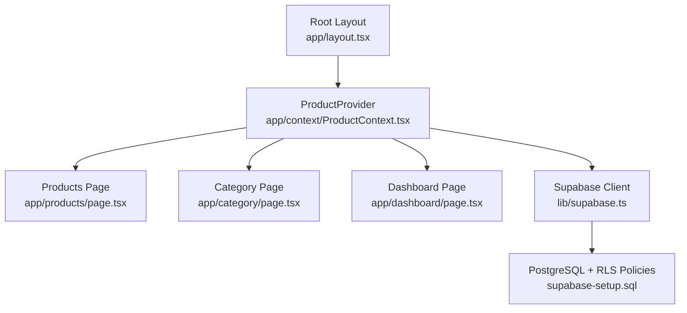
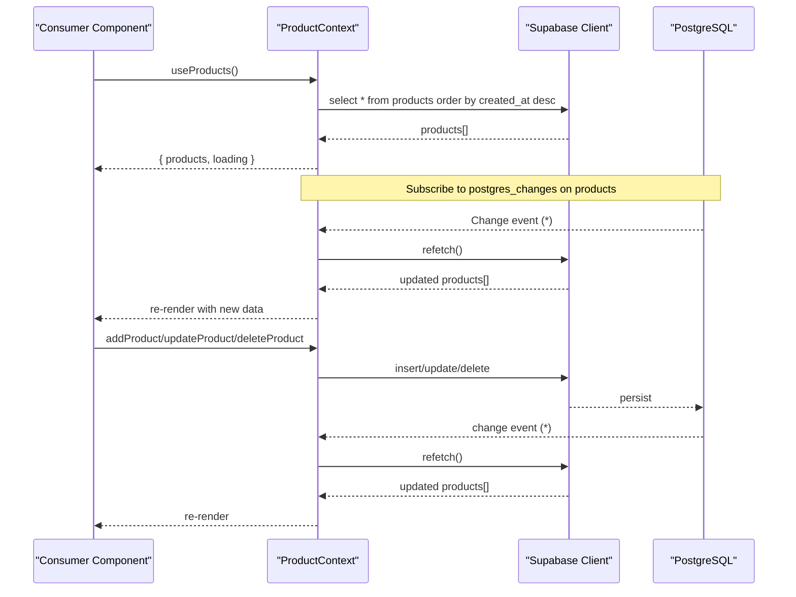
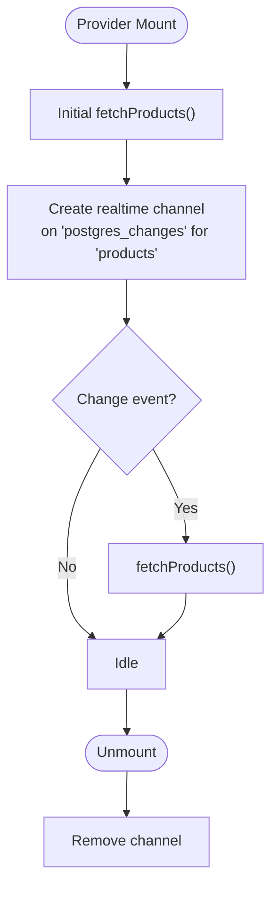
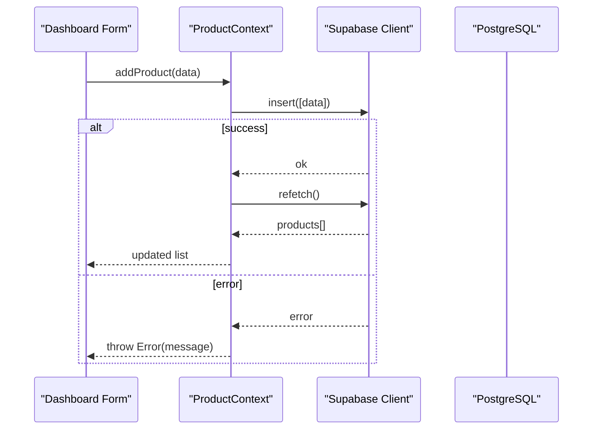
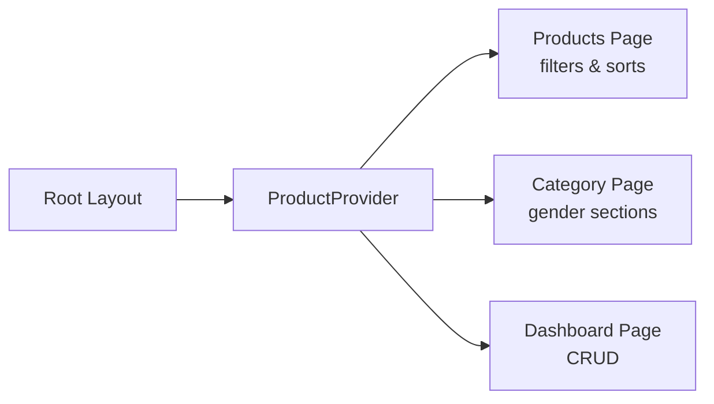
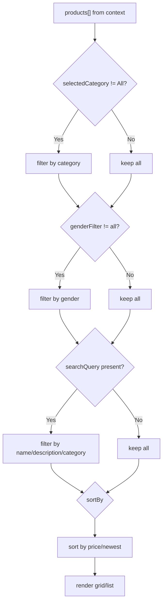
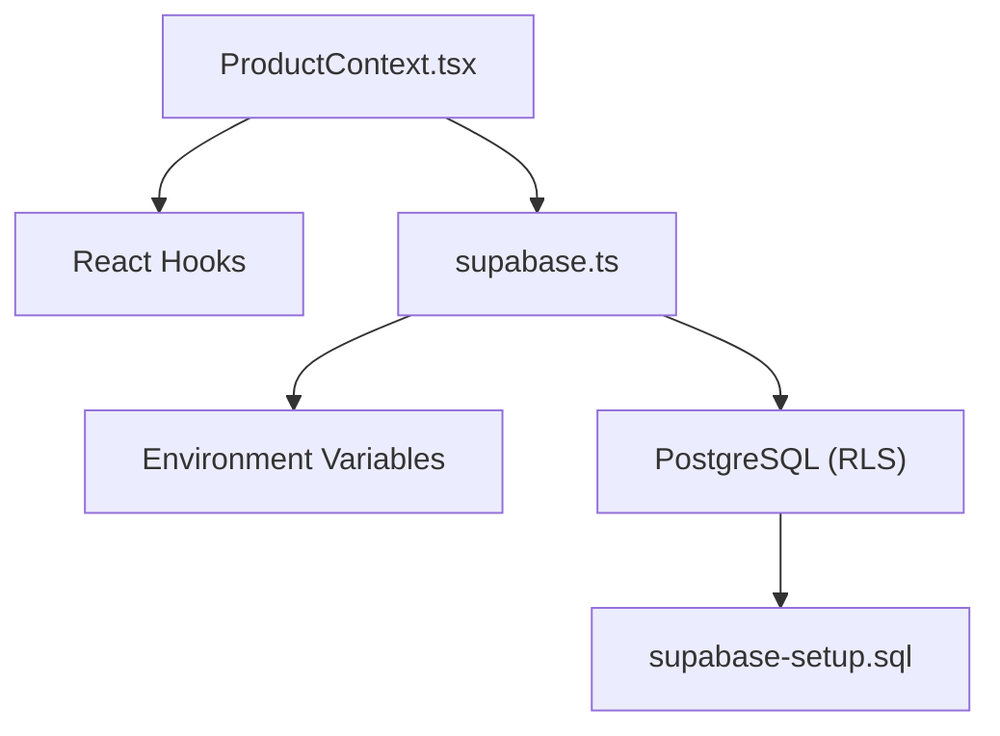

# Product Context

<cite>
**Referenced Files in This Document**
- [ProductContext.tsx](file://app/context/ProductContext.tsx)
- [supabase.ts](file://lib/supabase.ts)
- [layout.tsx](file://app/layout.tsx)
- [products/page.tsx](file://app/products/page.tsx)
- [category/page.tsx](file://app/category/page.tsx)
- [dashboard/page.tsx](file://app/dashboard/page.tsx)
- [supabase-setup.sql](file://supabase-setup.sql)
</cite>

## Table of Contents
1. [Introduction](#introduction)
2. [Project Structure](#project-structure)
3. [Core Components](#core-components)
4. [Architecture Overview](#architecture-overview)
5. [Detailed Component Analysis](#detailed-component-analysis)
6. [Dependency Analysis](#dependency-analysis)
7. [Performance Considerations](#performance-considerations)
8. [Troubleshooting Guide](#troubleshooting-guide)
9. [Conclusion](#conclusion)

## Introduction
This document explains the ProductContext implementation that powers product data across the application. It covers:
- The Product data model and its fields (including fragrance notes).
- Real-time updates via Supabase WebSocket subscriptions.
- CRUD operations with error handling and state synchronization.
- Consuming the context using the useProducts hook, filtering by category/gender, and handling loading states.
- Performance considerations for large catalogs and best practices for product data management.

## Project Structure
The ProductContext is provided at the root layout and consumed by multiple pages and components.



**Diagram sources**
- [layout.tsx:68-74](file://app/layout.tsx#L68-L74)
- [ProductContext.tsx:45-109](file://app/context/ProductContext.tsx#L45-L109)
- [supabase.ts:41](file://lib/supabase.ts#L41)
- [supabase-setup.sql:7-56](file://supabase-setup.sql#L7-L56)

**Section sources**
- [layout.tsx:68-74](file://app/layout.tsx#L68-L74)
- [ProductContext.tsx:45-109](file://app/context/ProductContext.tsx#L45-L109)

## Core Components
- ProductContextType exposes:
  - products: array of Product objects
  - loading: boolean indicating initial fetch status
  - addProduct(product): inserts a new product
  - updateProduct(id, partial): updates an existing product
  - deleteProduct(id): deletes a product
  - refetch(): re-fetches all products
- Product interface includes:
  - name, description, price, image_url, badge, category, gender, top_notes, heart_notes, base_notes, longevity, sillage, sizes, images, video_url, created_at, id

Real-time subscription:
- On mount, the provider subscribes to Postgres changes on the products table and re-fetches when any change occurs.

CRUD behavior:
- Each mutation calls the Supabase client and then triggers a refetch to keep UI in sync. Errors are thrown with messages from the server.

**Section sources**
- [ProductContext.tsx:14-41](file://app/context/ProductContext.tsx#L14-L41)
- [ProductContext.tsx:49-100](file://app/context/ProductContext.tsx#L49-L100)

## Architecture Overview
The system uses a client-side React context to manage product state and integrates with Supabase for persistence and real-time updates.



**Diagram sources**
- [ProductContext.tsx:64-82](file://app/context/ProductContext.tsx#L64-L82)
- [ProductContext.tsx:84-100](file://app/context/ProductContext.tsx#L84-L100)
- [supabase.ts:41](file://lib/supabase.ts#L41)

## Detailed Component Analysis

### Data Model: Product
The Product type defines the shape of product records used throughout the app.

```mermaid
classDiagram
class Product {
+string id
+string name
+string description
+number price
+string image_url
+string? badge
+string? category
+ProductGender? gender
+string? top_notes
+string? heart_notes
+string? base_notes
+string? longevity
+string? sillage
+{ size : string; price : number }[]? sizes
+string[]? images
+string? video_url
+string? created_at
}
class ProductGender {
<<enum>>
"men"
"women"
"unisex"
}
Product --> ProductGender : "gender"
```

**Diagram sources**
- [ProductContext.tsx:12-32](file://app/context/ProductContext.tsx#L12-L32)

**Section sources**
- [ProductContext.tsx:12-32](file://app/context/ProductContext.tsx#L12-L32)

### Real-Time Subscription Pattern
- A single channel listens to all events on the products table and triggers a full refetch.
- Cleanup removes the channel on unmount.



**Diagram sources**
- [ProductContext.tsx:64-82](file://app/context/ProductContext.tsx#L64-L82)

**Section sources**
- [ProductContext.tsx:64-82](file://app/context/ProductContext.tsx#L64-L82)

### CRUD Operations and Error Handling
- addProduct: inserts a product and refetches. Throws on error.
- updateProduct: updates by id and refetches. Throws on error.
- deleteProduct: deletes by id and refetches. Throws on error.



**Diagram sources**
- [ProductContext.tsx:84-100](file://app/context/ProductContext.tsx#L84-L100)

**Section sources**
- [ProductContext.tsx:84-100](file://app/context/ProductContext.tsx#L84-L100)

### Consuming the Context with useProducts Hook
- Provided at the root layout so all routes can consume it.
- Pages read products and loading, and perform local filtering and sorting.

Examples:
- Products page filters by category, gender, search query, and sorts by price or newest.
- Category page groups products by gender sections and shows up to four per section.
- Dashboard page uses add/update/delete and displays counts and averages.



**Diagram sources**
- [layout.tsx:68-74](file://app/layout.tsx#L68-L74)
- [products/page.tsx:142-170](file://app/products/page.tsx#L142-L170)
- [category/page.tsx:209-213](file://app/category/page.tsx#L209-L213)
- [dashboard/page.tsx:11-12](file://app/dashboard/page.tsx#L11-L12)

**Section sources**
- [layout.tsx:68-74](file://app/layout.tsx#L68-L74)
- [products/page.tsx:142-170](file://app/products/page.tsx#L142-L170)
- [category/page.tsx:209-213](file://app/category/page.tsx#L209-L213)
- [dashboard/page.tsx:11-12](file://app/dashboard/page.tsx#L11-L12)

### Filtering and Loading States
- Products page:
  - Filters by selectedCategory and genderFilter.
  - Applies searchQuery across name, description, and category.
  - Sorts by price-low/high or newest based on created_at.
  - Shows skeleton placeholders while loading.
- Category page:
  - Groups by gender sections and limits to four items per section.
  - Uses loading to render skeletons.



**Diagram sources**
- [products/page.tsx:142-170](file://app/products/page.tsx#L142-L170)

**Section sources**
- [products/page.tsx:142-170](file://app/products/page.tsx#L142-L170)
- [category/page.tsx:209-213](file://app/category/page.tsx#L209-L213)

## Dependency Analysis
- ProductContext depends on:
  - React hooks (useState, useEffect, useCallback, useContext)
  - Supabase client for queries and real-time subscriptions
- Supabase client configuration:
  - Reads environment variables and falls back to defaults if placeholders are detected.
- Database schema:
  - products table with columns matching the Product interface.
  - Row Level Security policies allow public read/insert/delete for demo purposes.



**Diagram sources**
- [ProductContext.tsx:3-10](file://app/context/ProductContext.tsx#L3-L10)
- [supabase.ts:1-41](file://lib/supabase.ts#L1-L41)
- [supabase-setup.sql:7-56](file://supabase-setup.sql#L7-L56)

**Section sources**
- [ProductContext.tsx:3-10](file://app/context/ProductContext.tsx#L3-L10)
- [supabase.ts:1-41](file://lib/supabase.ts#L1-L41)
- [supabase-setup.sql:7-56](file://supabase-setup.sql#L7-L56)

## Performance Considerations
- Real-time refetch strategy:
  - Current implementation refetches the entire catalog on every change. For large catalogs, consider:
    - Incremental updates using payload-based mutations (e.g., apply insert/update/delete deltas).
    - Optimistic UI updates with rollback on error.
- Client-side filtering and sorting:
  - Use useMemo to avoid recomputation on unrelated renders.
  - Debounce search input to reduce filter recalculations.
- Pagination and virtualization:
  - Implement server-side pagination and/or windowed rendering for large lists.
- Image optimization:
  - Serve appropriately sized images and leverage caching headers.
- Network efficiency:
  - Select only needed fields where possible.
  - Batch mutations when feasible.

[No sources needed since this section provides general guidance]

## Troubleshooting Guide
Common issues and resolutions:
- Missing or placeholder environment variables:
  - The Supabase client logs informational messages when placeholders are detected and falls back to default credentials. Ensure NEXT_PUBLIC_SUPABASE_URL and NEXT_PUBLIC_ANON_KEY are set correctly.
- Connection errors:
  - The dashboard checks connectivity and displays status. If connection fails, verify network access and keys.
- Real-time not updating:
  - Confirm that the Supabase project has enabled real-time for the products table and that RLS policies allow the required operations.
- Schema mismatches:
  - Ensure the database schema matches the Product interface (columns like gender, notes, sizes, images, video_url).

**Section sources**
- [supabase.ts:27-39](file://lib/supabase.ts#L27-L39)
- [dashboard/page.tsx:20-36](file://app/dashboard/page.tsx#L20-L36)
- [supabase-setup.sql:17-56](file://supabase-setup.sql#L17-L56)

## Conclusion
The ProductContext centralizes product state, provides real-time synchronization via Supabase, and offers straightforward CRUD APIs. Consumers benefit from a simple hook and predictable loading states. For production-scale catalogs, adopt incremental updates, pagination, and optimized rendering to maintain responsiveness.

[No sources needed since this section summarizes without analyzing specific files]