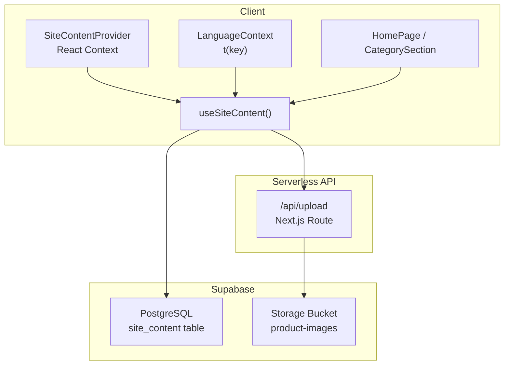
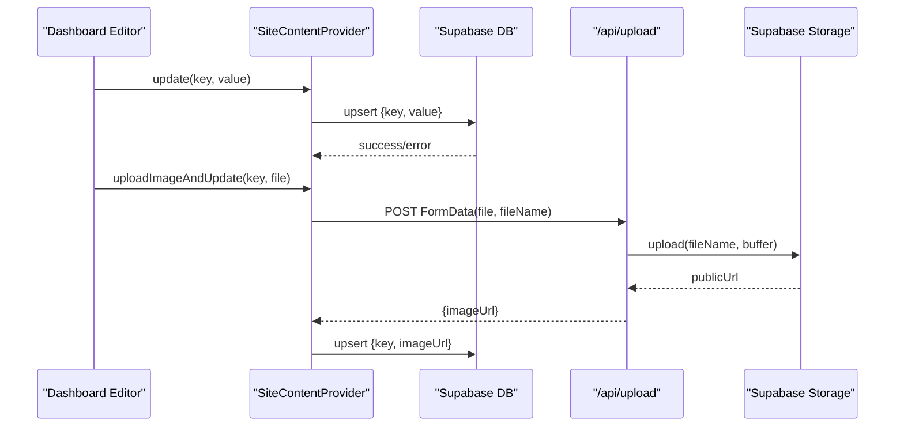
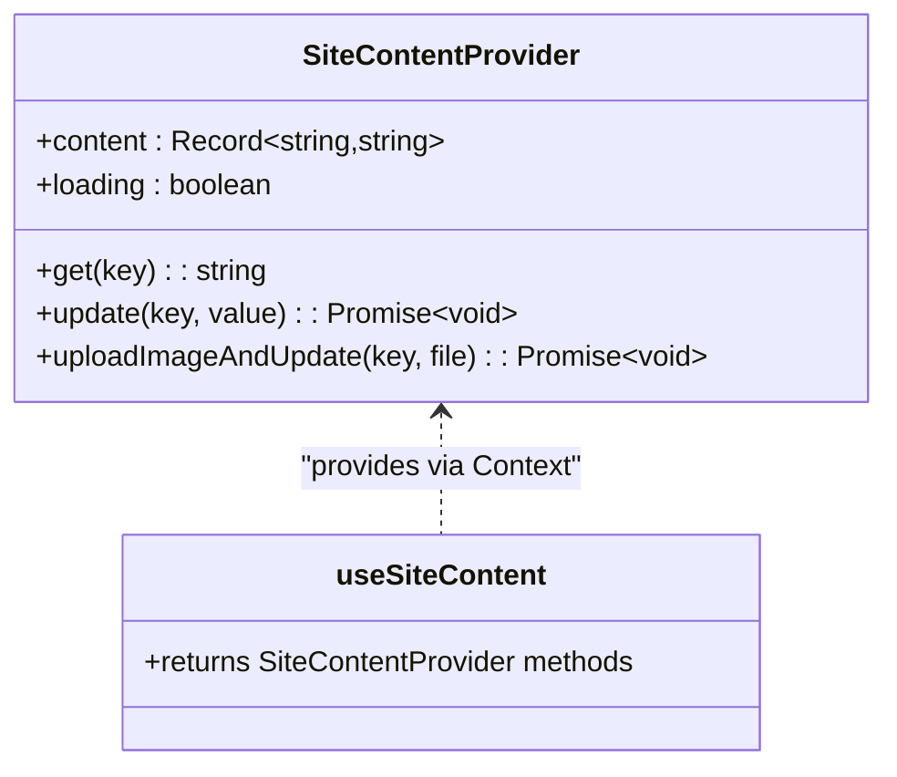
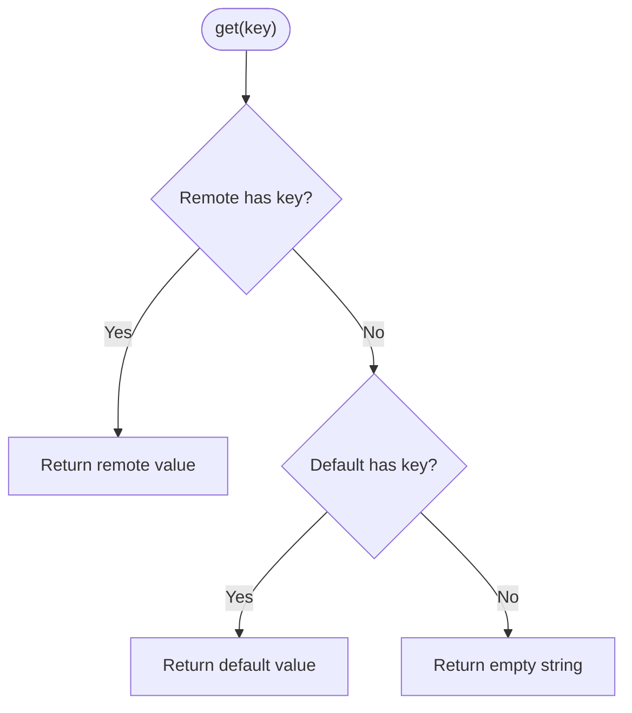
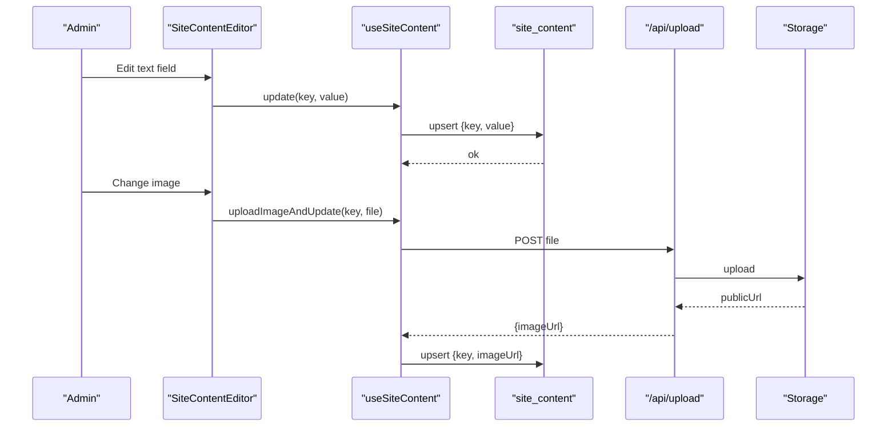
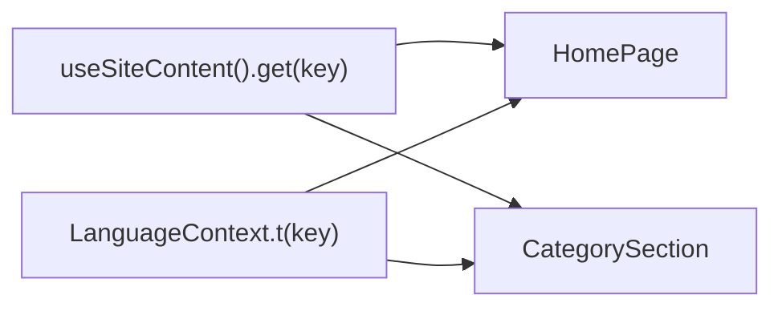
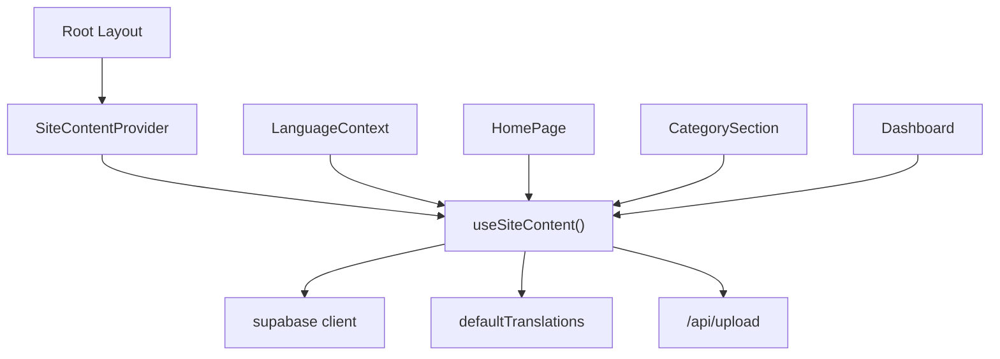

# Site Content Context

<cite>
**Referenced Files in This Document**
- [SiteContentContext.tsx](file://app/context/SiteContentContext.tsx)
- [defaultTranslations.ts](file://app/context/defaultTranslations.ts)
- [supabase.ts](file://lib/supabase.ts)
- [site-content-setup.sql](file://supabase-setup.sql)
- [layout.tsx](file://app/layout.tsx)
- [page.tsx](file://app/page.tsx)
- [CategorySection.tsx](file://components/CategorySection.tsx)
- [LanguageContext.tsx](file://app/context/LanguageContext.tsx)
- [dashboard-page.tsx](file://app/dashboard/page.tsx)
- [upload-route.ts](file://app/api/upload/route.ts)
</cite>

## Table of Contents
1. [Introduction](#introduction)
2. [Project Structure](#project-structure)
3. [Core Components](#core-components)
4. [Architecture Overview](#architecture-overview)
5. [Detailed Component Analysis](#detailed-component-analysis)
6. [Dependency Analysis](#dependency-analysis)
7. [Performance Considerations](#performance-considerations)
8. [Troubleshooting Guide](#troubleshooting-guide)
9. [Conclusion](#conclusion)
10. [Appendices](#appendices)

## Introduction
This document explains the SiteContentContext dynamic content management system. It covers how site-wide text and image content is stored in a Supabase database, fetched into React state with fallbacks to built-in defaults, and updated from an admin dashboard. It also documents the key-value structure, editing workflow, usage patterns in components, error handling, and operational guidance for versioning, backups, and migrations.

## Project Structure
The SiteContentContext feature spans client-side context, default content, Supabase integration, and a dashboard editor:
- Client context provider and hook: app/context/SiteContentContext.tsx
- Default translations (fallback content): app/context/defaultTranslations.ts
- Supabase client configuration: lib/supabase.ts
- Database schema and policies: supabase-setup.sql
- Root layout provider: app/layout.tsx
- Example usage in pages/components: app/page.tsx, components/CategorySection.tsx, app/context/LanguageContext.tsx
- Dashboard editor: app/dashboard/page.tsx
- Server upload route: app/api/upload/route.ts

**Diagram sources**
- [SiteContentContext.tsx:22-103](file://app/context/SiteContentContext.tsx#L22-L103)
- [LanguageContext.tsx:17-51](file://app/context/LanguageContext.tsx#L17-L51)
- [page.tsx:43-60](file://app/page.tsx#L43-L60)
- [CategorySection.tsx:51-60](file://components/CategorySection.tsx#L51-L60)
- [upload-route.ts:4-66](file://app/api/upload/route.ts#L4-L66)
- [supabase.ts:41-44](file://lib/supabase.ts#L41-L44)
- [site-content-setup.sql:59-82](file://supabase-setup.sql#L59-L82)

**Section sources**
- [SiteContentContext.tsx:22-103](file://app/context/SiteContentContext.tsx#L22-L103)
- [defaultTranslations.ts:1-494](file://app/context/defaultTranslations.ts#L1-L494)
- [supabase.ts:1-46](file://lib/supabase.ts#L1-L46)
- [site-content-setup.sql:59-82](file://supabase-setup.sql#L59-L82)
- [layout.tsx:62-82](file://app/layout.tsx#L62-L82)
- [page.tsx:43-60](file://app/page.tsx#L43-L60)
- [CategorySection.tsx:51-60](file://components/CategorySection.tsx#L51-L60)
- [LanguageContext.tsx:17-51](file://app/context/LanguageContext.tsx#L17-L51)
- [dashboard-page.tsx:1047-1205](file://app/dashboard/page.tsx#L1047-L1205)
- [upload-route.ts:4-66](file://app/api/upload/route.ts#L4-L66)

## Core Components
- SiteContentProvider: Initializes content from defaults, fetches site_content rows, exposes get/update/uploadImageAndUpdate, and provides loading state.
- useSiteContent(): Hook to access content, update values, and upload images.
- LanguageContext.t(): Resolves localized keys by prefixing with language code and falling back to English or raw key.
- Dashboard SiteContentEditor: UI to edit text fields and images; persists via update and uploadImageAndUpdate.
- Upload Route: Server-side handler that uploads files to Supabase Storage and returns public URLs.

Key responsibilities:
- Data fetching and merging with defaults
- Optimistic updates on the client
- Image upload flow through a server route
- Safe fallback behavior when data is missing or network fails

**Section sources**
- [SiteContentContext.tsx:22-103](file://app/context/SiteContentContext.tsx#L22-L103)
- [LanguageContext.tsx:32-44](file://app/context/LanguageContext.tsx#L32-L44)
- [dashboard-page.tsx:1047-1205](file://app/dashboard/page.tsx#L1047-L1205)
- [upload-route.ts:4-66](file://app/api/upload/route.ts#L4-L66)

## Architecture Overview
The system uses a simple key-value store in PostgreSQL for all editable strings and image URLs. The client merges remote values over static defaults, ensuring consistent rendering even if the database is unavailable. Updates are optimistic and persisted via upsert. Images are uploaded to a dedicated storage bucket and their public URLs are saved as values.

**Diagram sources**
- [SiteContentContext.tsx:56-96](file://app/context/SiteContentContext.tsx#L56-L96)
- [upload-route.ts:4-66](file://app/api/upload/route.ts#L4-L66)
- [site-content-setup.sql:59-82](file://supabase-setup.sql#L59-L82)

## Detailed Component Analysis

### SiteContentProvider and useSiteContent
Responsibilities:
- Initialize state with default translations
- Fetch site_content rows once on mount and merge into defaults
- Provide get(key) with layered fallbacks: remote > default > empty string
- Update(key, value) performs optimistic local update then persists via upsert
- uploadImageAndUpdate(key, file) uploads via server route and saves resulting URL

Data model:
- In-memory map: Record<string, string>
- Remote table: site_content(key PK, value TEXT)

Error handling:
- Fetch errors are caught and logged; defaults remain active
- Update errors throw to allow caller-level feedback

Real-time updates:
- Not implemented in this context. Consumers can refetch or subscribe separately if needed.

**Diagram sources**
- [SiteContentContext.tsx:12-18](file://app/context/SiteContentContext.tsx#L12-L18)
- [SiteContentContext.tsx:22-103](file://app/context/SiteContentContext.tsx#L22-L103)

**Section sources**
- [SiteContentContext.tsx:22-103](file://app/context/SiteContentContext.tsx#L22-L103)

### Default Translations and Fallback Strategy
- defaultTranslations.ts contains comprehensive en_* and ar_* keys plus image placeholders.
- get(key) resolves:
  - Remote value if present
  - Default value if present
  - Empty string otherwise

Language resolution:
- LanguageContext.t(key) composes lang-prefixed keys (e.g., en_nav_home), falls back to English, then to raw key.

**Diagram sources**
- [SiteContentContext.tsx:50-54](file://app/context/SiteContentContext.tsx#L50-L54)
- [defaultTranslations.ts:1-494](file://app/context/defaultTranslations.ts#L1-L494)
- [LanguageContext.tsx:32-44](file://app/context/LanguageContext.tsx#L32-L44)

**Section sources**
- [defaultTranslations.ts:1-494](file://app/context/defaultTranslations.ts#L1-L494)
- [LanguageContext.tsx:32-44](file://app/context/LanguageContext.tsx#L32-L44)
- [SiteContentContext.tsx:50-54](file://app/context/SiteContentContext.tsx#L50-L54)

### Dashboard Editing Workflow
The dashboard includes a SiteContentEditor that:
- Renders text fields per section (General, Hero, etc.)
- Supports language toggle for editing
- Saves text via update(key, value)
- Uploads images via uploadImageAndUpdate(key, file) and shows preview

**Diagram sources**
- [dashboard-page.tsx:1047-1205](file://app/dashboard/page.tsx#L1047-L1205)
- [SiteContentContext.tsx:56-96](file://app/context/SiteContentContext.tsx#L56-L96)
- [upload-route.ts:4-66](file://app/api/upload/route.ts#L4-L66)

**Section sources**
- [dashboard-page.tsx:1047-1205](file://app/dashboard/page.tsx#L1047-L1205)
- [SiteContentContext.tsx:56-96](file://app/context/SiteContentContext.tsx#L56-L96)
- [upload-route.ts:4-66](file://app/api/upload/route.ts#L4-L66)

### Usage in Pages and Components
Examples:
- HomePage builds category arrays using sc("catN_name"), sc("catN_sub"), sc("catN_image")
- CategorySection maps static categories and overlays dynamic images via sc(cat.contentKey)
- LanguageContext.t() is used throughout to render localized text

**Diagram sources**
- [page.tsx:43-60](file://app/page.tsx#L43-L60)
- [CategorySection.tsx:51-60](file://components/CategorySection.tsx#L51-L60)
- [LanguageContext.tsx:32-44](file://app/context/LanguageContext.tsx#L32-L44)

**Section sources**
- [page.tsx:43-60](file://app/page.tsx#L43-L60)
- [CategorySection.tsx:51-60](file://components/CategorySection.tsx#L51-L60)
- [LanguageContext.tsx:32-44](file://app/context/LanguageContext.tsx#L32-L44)

### Real-Time Behavior and Synchronization
Current implementation:
- No automatic real-time subscription for site_content changes.
- To achieve live sync across clients, add a Supabase realtime channel for site_content and refetch content on changes.

Recommendation:
- Subscribe to postgres_changes on site_content and call fetchContent() on events.

[No sources needed since this section provides general guidance]

## Dependency Analysis
- SiteContentContext depends on:
  - Supabase client (lib/supabase.ts)
  - Default translations (defaultTranslations.ts)
  - Optional server route (/api/upload) for images
- Layout wraps the app with SiteContentProvider so all child components can consume it
- LanguageContext composes SiteContentContext for i18n resolution
- Dashboard consumes SiteContentContext for editing

**Diagram sources**
- [layout.tsx:62-82](file://app/layout.tsx#L62-L82)
- [SiteContentContext.tsx:22-103](file://app/context/SiteContentContext.tsx#L22-L103)
- [supabase.ts:41-44](file://lib/supabase.ts#L41-L44)
- [defaultTranslations.ts:1-494](file://app/context/defaultTranslations.ts#L1-L494)
- [upload-route.ts:4-66](file://app/api/upload/route.ts#L4-L66)
- [LanguageContext.tsx:17-51](file://app/context/LanguageContext.tsx#L17-L51)
- [page.tsx:43-60](file://app/page.tsx#L43-L60)
- [CategorySection.tsx:51-60](file://components/CategorySection.tsx#L51-L60)
- [dashboard-page.tsx:1047-1205](file://app/dashboard/page.tsx#L1047-L1205)

**Section sources**
- [layout.tsx:62-82](file://app/layout.tsx#L62-L82)
- [SiteContentContext.tsx:22-103](file://app/context/SiteContentContext.tsx#L22-L103)
- [supabase.ts:41-44](file://lib/supabase.ts#L41-L44)
- [defaultTranslations.ts:1-494](file://app/context/defaultTranslations.ts#L1-L494)
- [upload-route.ts:4-66](file://app/api/upload/route.ts#L4-L66)
- [LanguageContext.tsx:17-51](file://app/context/LanguageContext.tsx#L17-L51)
- [page.tsx:43-60](file://app/page.tsx#L43-L60)
- [CategorySection.tsx:51-60](file://components/CategorySection.tsx#L51-L60)
- [dashboard-page.tsx:1047-1205](file://app/dashboard/page.tsx#L1047-L1205)

## Performance Considerations
- Initial load: Single SELECT for all site_content rows; consider pagination or selective queries if the dataset grows significantly.
- Optimistic updates: Immediate UI responsiveness; ensure robust error handling to revert if persistence fails.
- Image uploads: Use server route to avoid CORS issues and adblockers; generate unique filenames to prevent collisions.
- Rendering: Avoid re-renders by memoizing derived data where possible; keep get(key) calls minimal in hot paths.
- Realtime: If added, throttle refetches or use targeted subscriptions to reduce overhead.

[No sources needed since this section provides general guidance]

## Troubleshooting Guide
Common issues and resolutions:
- Missing environment variables: Ensure NEXT_PUBLIC_SUPABASE_URL and NEXT_PUBLIC_SUPABASE_ANON_KEY are set; the client logs a warning and falls back to demo credentials if placeholders are detected.
- Network or RLS errors: Verify Supabase policies for site_content allow public select/insert/update; check browser console for error messages.
- Upload failures: Confirm the product-images bucket exists and is public; verify /api/upload responds with a valid imageUrl.
- Hydration mismatches: Because content loads asynchronously, ensure components handle loading states gracefully.

Operational checks:
- Validate site_content table exists and has correct schema and policies.
- Confirm Next.js allows remote images from *.supabase.co.

**Section sources**
- [supabase.ts:27-39](file://lib/supabase.ts#L27-L39)
- [site-content-setup.sql:59-82](file://supabase-setup.sql#L59-L82)
- [upload-route.ts:4-66](file://app/api/upload/route.ts#L4-L66)

## Conclusion
SiteContentContext provides a robust, user-friendly way to manage site-wide content with strong fallbacks and a clear editing workflow. By combining a simple key-value database with a React context and a dashboard editor, it enables non-technical users to update text and images without redeployments. For production-grade reliability, consider adding real-time synchronization, caching strategies, and structured migration procedures.

[No sources needed since this section summarizes without analyzing specific files]

## Appendices

### Content Key-Value Structure
- Table: site_content
  - key: text (primary key)
  - value: text
- Naming conventions:
  - Text keys are typically prefixed by language: en_*, ar_*
  - Image keys are generic (e.g., hero_image, cat1_image)
- Examples of keys:
  - en_nav_home, ar_nav_home
  - en_hero_title_1, ar_hero_title_1
  - hero_image, cat1_image

**Section sources**
- [site-content-setup.sql:59-82](file://supabase-setup.sql#L59-L82)
- [defaultTranslations.ts:1-494](file://app/context/defaultTranslations.ts#L1-L494)

### Content Editing Workflow
- Open Dashboard → Site Content tab
- Select editing language (en/ar)
- Edit text fields and click Save
- Replace images by selecting a file; the system uploads and updates the key’s value with the public URL

**Section sources**
- [dashboard-page.tsx:1047-1205](file://app/dashboard/page.tsx#L1047-L1205)
- [SiteContentContext.tsx:71-96](file://app/context/SiteContentContext.tsx#L71-L96)

### Accessing Dynamic Content in Components
- Read-only: const { get } = useSiteContent(); const value = get("hero_subtitle");
- With language: const t = useLanguage().t; const label = t("nav_home");
- Conditional rendering during load: use loading flag from context to show skeletons or placeholders.

**Section sources**
- [page.tsx:43-60](file://app/page.tsx#L43-L60)
- [CategorySection.tsx:51-60](file://components/CategorySection.tsx#L51-L60)
- [LanguageContext.tsx:32-44](file://app/context/LanguageContext.tsx#L32-L44)
- [SiteContentContext.tsx:22-48](file://app/context/SiteContentContext.tsx#L22-L48)

### Updating Content Programmatically
- Text: await update("en_ann_1", "New announcement");
- Image: await uploadImageAndUpdate("hero_image", file);

**Section sources**
- [SiteContentContext.tsx:56-96](file://app/context/SiteContentContext.tsx#L56-L96)

### Handling Loading States
- Use context.loading to display skeletons or disabled states until content is ready.
- Always provide fallbacks via defaults to avoid blank screens.

**Section sources**
- [SiteContentContext.tsx:22-48](file://app/context/SiteContentContext.tsx#L22-L48)

### Versioning, Backup, and Migration Procedures
- Versioning:
  - Add a version column to site_content and increment on schema changes.
  - Maintain a changelog of key renames and deprecations.
- Backups:
  - Periodically export site_content via Supabase CLI or SQL dump.
  - Snapshot storage bucket contents for critical media.
- Migrations:
  - Use idempotent SQL to add new columns or rename keys safely.
  - Provide seed scripts to populate new keys with sensible defaults.

[No sources needed since this section provides general guidance]

### Organizing Keys and Maintaining Consistency
- Group keys by feature area (e.g., nav_, hero_, prod_, cat_, test_, footer_).
- Prefix by language for text (en_/ar_), keep image keys language-agnostic.
- Centralize documentation of available keys in a README or internal wiki.
- Enforce naming conventions via lint rules or pre-commit hooks.

[No sources needed since this section provides general guidance]