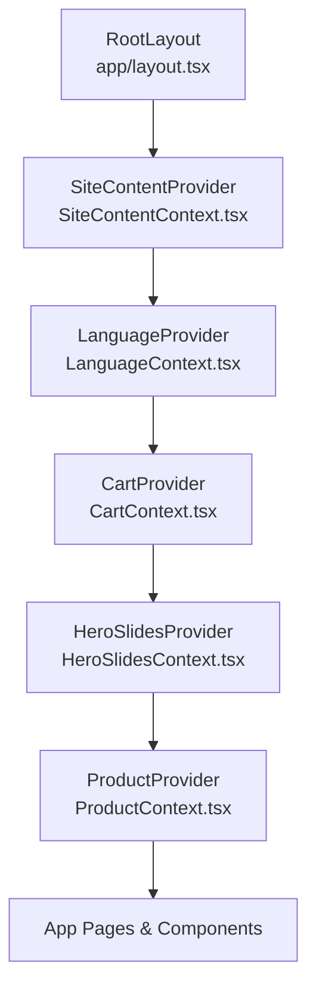
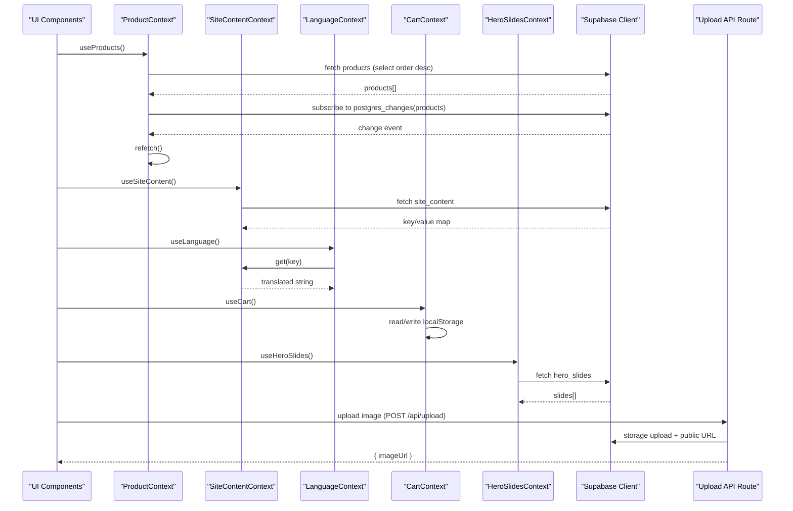
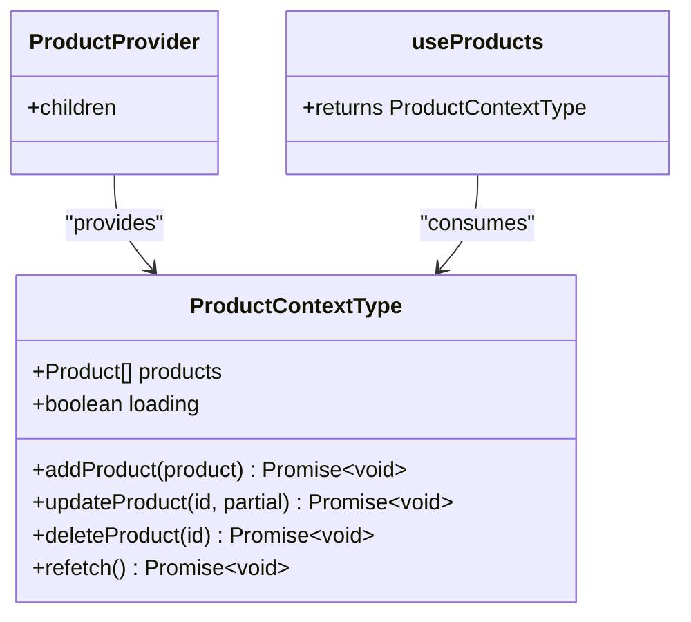
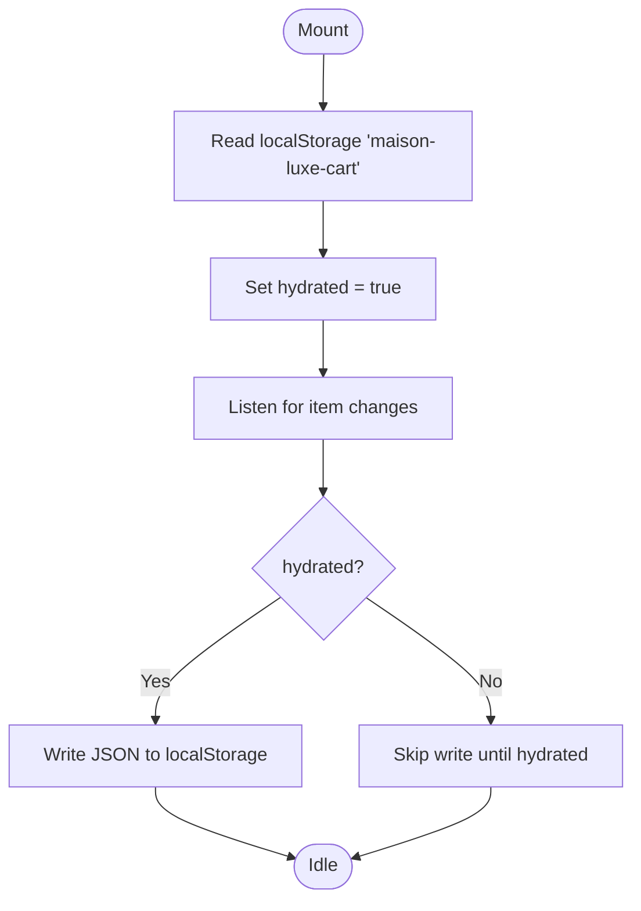
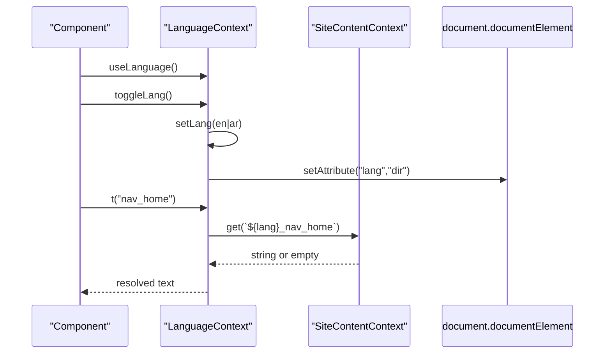
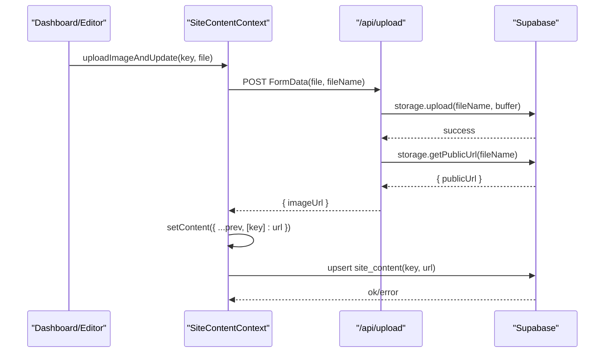
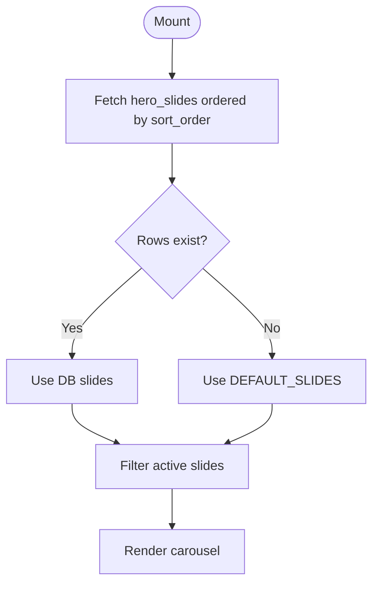
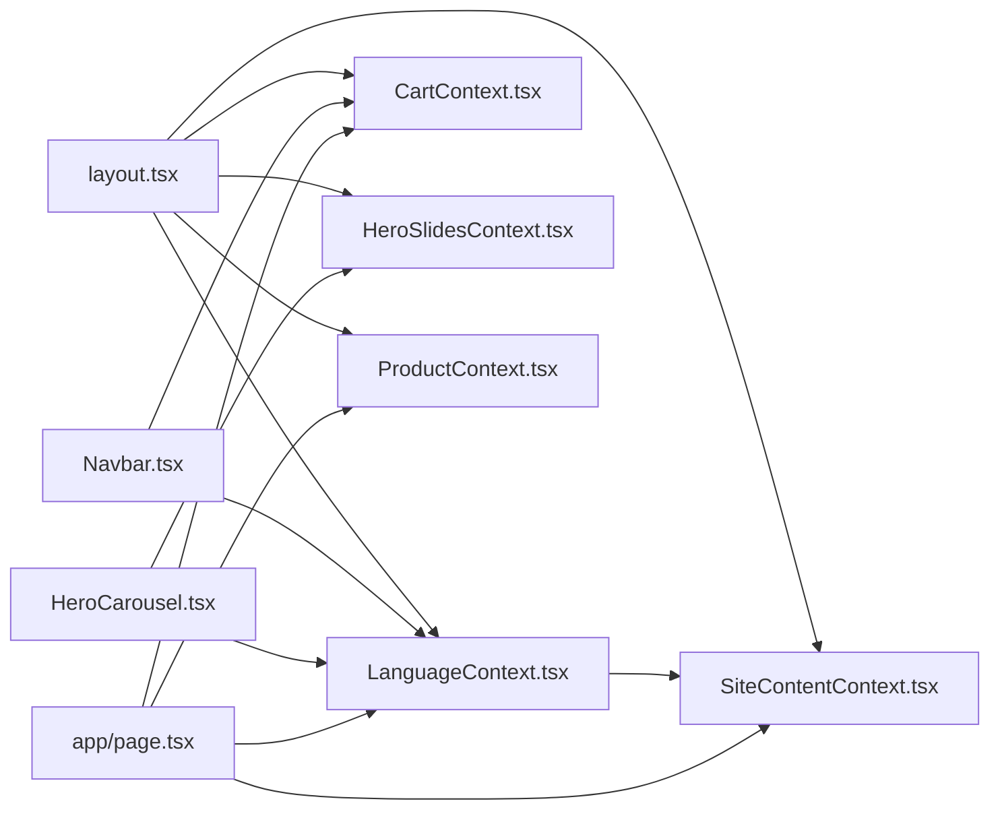

# State Management

<cite>
**Referenced Files in This Document**
- [ProductContext.tsx](file://app/context/ProductContext.tsx)
- [CartContext.tsx](file://app/context/CartContext.tsx)
- [LanguageContext.tsx](file://app/context/LanguageContext.tsx)
- [SiteContentContext.tsx](file://app/context/SiteContentContext.tsx)
- [HeroSlidesContext.tsx](file://app/context/HeroSlidesContext.tsx)
- [defaultTranslations.ts](file://app/context/defaultTranslations.ts)
- [supabase.ts](file://lib/supabase.ts)
- [layout.tsx](file://app/layout.tsx)
- [Navbar.tsx](file://components/Navbar.tsx)
- [HeroCarousel.tsx](file://components/HeroCarousel.tsx)
- [page.tsx](file://app/page.tsx)
- [route.ts](file://app/api/upload/route.ts)
</cite>

## Table of Contents
1. [Introduction](#introduction)
2. [Project Structure](#project-structure)
3. [Core Components](#core-components)
4. [Architecture Overview](#architecture-overview)
5. [Detailed Component Analysis](#detailed-component-analysis)
6. [Dependency Analysis](#dependency-analysis)
7. [Performance Considerations](#performance-considerations)
8. [Troubleshooting Guide](#troubleshooting-guide)
9. [Conclusion](#conclusion)
10. [Appendices](#appendices)

## Introduction
This document explains the React Context-based state management system used by the Nubia Perfume E-Commerce Platform. It covers provider patterns, data flow, real-time synchronization with Supabase, and persistence strategies across ProductContext, CartContext, LanguageContext, SiteContentContext, and HeroSlidesContext. It also documents custom hooks, consumption patterns, error handling, and guidance for extending the system with new contexts and complex relationships.

## Project Structure
The application uses a top-level layout to wrap the entire tree with providers. Each context encapsulates its own state, side effects, and API interactions. Consumers access state via custom hooks.

**Diagram sources**
- [layout.tsx:62-78](file://app/layout.tsx#L62-L78)
- [SiteContentContext.tsx:22-103](file://app/context/SiteContentContext.tsx#L22-L103)
- [LanguageContext.tsx:17-51](file://app/context/LanguageContext.tsx#L17-L51)
- [CartContext.tsx:28-97](file://app/context/CartContext.tsx#L28-L97)
- [HeroSlidesContext.tsx:157-283](file://app/context/HeroSlidesContext.tsx#L157-L283)
- [ProductContext.tsx:45-109](file://app/context/ProductContext.tsx#L45-L109)

**Section sources**
- [layout.tsx:62-78](file://app/layout.tsx#L62-L78)

## Core Components
- ProductContext: Manages product catalog state, CRUD operations, and real-time updates from Supabase.
- CartContext: Manages cart items with local storage persistence and derived totals.
- LanguageContext: Manages current language (en/ar), RTL direction, and translation lookup using SiteContentContext.
- SiteContentContext: Loads site content from Supabase with defaults, supports optimistic updates and image uploads via an API route.
- HeroSlidesContext: Manages hero slides with fallback defaults, ordering, and server-backed persistence.

Key implementation highlights:
- Provider pattern: Each context exports a Provider component that wraps children and exposes state and actions via context value.
- Custom hooks: useProducts, useCart, useLanguage, useSiteContent, useHeroSlides provide typed access and guard against missing providers.
- Real-time sync: ProductContext subscribes to Supabase realtime changes on the products table.
- Persistence: CartContext persists to localStorage; SiteContentContext and HeroSlidesContext persist to Supabase.
- Error handling: Network errors are logged or thrown; UI components can catch and handle failures.

**Section sources**
- [ProductContext.tsx:45-116](file://app/context/ProductContext.tsx#L45-L116)
- [CartContext.tsx:28-104](file://app/context/CartContext.tsx#L28-L104)
- [LanguageContext.tsx:17-58](file://app/context/LanguageContext.tsx#L17-L58)
- [SiteContentContext.tsx:22-110](file://app/context/SiteContentContext.tsx#L22-L110)
- [HeroSlidesContext.tsx:157-290](file://app/context/HeroSlidesContext.tsx#L157-L290)

## Architecture Overview
The architecture separates concerns into focused contexts:
- Presentation layer consumes contexts via hooks.
- Data layer interacts with Supabase tables and Storage.
- Internationalization is driven by SiteContentContext and LanguageContext.
- Real-time updates keep UI in sync without manual refreshes.

**Diagram sources**
- [ProductContext.tsx:49-82](file://app/context/ProductContext.tsx#L49-L82)
- [SiteContentContext.tsx:27-96](file://app/context/SiteContentContext.tsx#L27-L96)
- [LanguageContext.tsx:32-44](file://app/context/LanguageContext.tsx#L32-L44)
- [CartContext.tsx:33-47](file://app/context/CartContext.tsx#L33-L47)
- [HeroSlidesContext.tsx:161-186](file://app/context/HeroSlidesContext.tsx#L161-L186)
- [route.ts:4-58](file://app/api/upload/route.ts#L4-L58)

## Detailed Component Analysis

### ProductContext
Responsibilities:
- Fetch and maintain a list of products.
- Provide add/update/delete operations.
- Subscribe to realtime changes to keep UI synchronized.

Data model:
- Product includes fields like id, name, description, price, images, notes, sizes, gender, category, badge, timestamps.

State and actions:
- products: array of Product
- loading: boolean
- addProduct, updateProduct, deleteProduct: async mutations
- refetch: explicit reload

Realtime synchronization:
- Subscribes to all events on the products table and triggers refetch on any change.

Error handling:
- Logs network errors during fetch; throws errors returned from Supabase on mutations.

Complexity:
- O(n) for listing; mutation operations are O(1) plus refetch cost.

**Diagram sources**
- [ProductContext.tsx:34-41](file://app/context/ProductContext.tsx#L34-L41)
- [ProductContext.tsx:45-109](file://app/context/ProductContext.tsx#L45-L109)
- [ProductContext.tsx:111-116](file://app/context/ProductContext.tsx#L111-L116)

**Section sources**
- [ProductContext.tsx:45-116](file://app/context/ProductContext.tsx#L45-L116)

### CartContext
Responsibilities:
- Manage cart items with size-specific keys.
- Persist cart to localStorage.
- Compute totalItems and totalPrice.

State and actions:
- items: CartItem[]
- addToCart(item, size?)
- removeFromCart(id, size?)
- updateQty(id, qty, size?)
- clearCart()
- isInCart(id): boolean

Persistence strategy:
- Hydration from localStorage on mount.
- Writes to localStorage whenever items change after hydration.

Complexity:
- addToCart/find/remove are O(n) over items; totals computed via reduce O(n).

**Diagram sources**
- [CartContext.tsx:33-47](file://app/context/CartContext.tsx#L33-L47)

**Section sources**
- [CartContext.tsx:28-104](file://app/context/CartContext.tsx#L28-L104)

### LanguageContext
Responsibilities:
- Track current language (en/ar).
- Apply lang and dir attributes to <html>.
- Provide t(key) translation function with fallbacks.

Integration:
- Uses SiteContentContext.get to resolve translations keyed by language prefix.

Derived values:
- isRTL based on current language.

**Diagram sources**
- [LanguageContext.tsx:22-44](file://app/context/LanguageContext.tsx#L22-L44)
- [SiteContentContext.tsx:51-54](file://app/context/SiteContentContext.tsx#L51-L54)

**Section sources**
- [LanguageContext.tsx:17-58](file://app/context/LanguageContext.tsx#L17-L58)
- [SiteContentContext.tsx:22-110](file://app/context/SiteContentContext.tsx#L22-L110)

### SiteContentContext
Responsibilities:
- Load site-wide content from Supabase site_content table.
- Merge with default translations.
- Support optimistic updates and image uploads via Next.js API route.

Operations:
- get(key): returns value or default.
- update(key, value): optimistic update then upsert to DB.
- uploadImageAndUpdate(key, file): uploads to Supabase Storage via /api/upload, then persists URL.

Error handling:
- Catches fetch errors and falls back to defaults.
- Throws on failed updates.

**Diagram sources**
- [SiteContentContext.tsx:72-96](file://app/context/SiteContentContext.tsx#L72-L96)
- [route.ts:4-58](file://app/api/upload/route.ts#L4-L58)

**Section sources**
- [SiteContentContext.tsx:22-110](file://app/context/SiteContentContext.tsx#L22-L110)
- [route.ts:4-67](file://app/api/upload/route.ts#L4-L67)

### HeroSlidesContext
Responsibilities:
- Manage hero slides with server-backed persistence.
- Provide active-only view for carousel.
- Support add/update/delete/reorder operations.

Defaults:
- DEFAULT_SLIDES used when DB is empty or unavailable.

Ordering:
- Sort by sort_order; reorder swaps sort_order between adjacent slides.

**Diagram sources**
- [HeroSlidesContext.tsx:161-186](file://app/context/HeroSlidesContext.tsx#L161-L186)
- [HeroSlidesContext.tsx:263-265](file://app/context/HeroSlidesContext.tsx#L263-L265)

**Section sources**
- [HeroSlidesContext.tsx:157-290](file://app/context/HeroSlidesContext.tsx#L157-L290)

## Dependency Analysis
- Providers are nested at the root layout to ensure availability across the app.
- LanguageContext depends on SiteContentContext for translations.
- HeroCarousel consumes both LanguageContext and HeroSlidesContext.
- Navbar consumes CartContext and LanguageContext.
- All contexts depend on the shared Supabase client configuration.

**Diagram sources**
- [layout.tsx:62-78](file://app/layout.tsx#L62-L78)
- [Navbar.tsx:6-12](file://components/Navbar.tsx#L6-L12)
- [HeroCarousel.tsx:5-6](file://components/HeroCarousel.tsx#L5-L6)
- [page.tsx:7-10](file://app/page.tsx#L7-L10)

**Section sources**
- [layout.tsx:62-78](file://app/layout.tsx#L62-L78)
- [Navbar.tsx:6-12](file://components/Navbar.tsx#L6-L12)
- [HeroCarousel.tsx:5-6](file://components/HeroCarousel.tsx#L5-L6)
- [page.tsx:7-10](file://app/page.tsx#L7-L10)

## Performance Considerations
- Minimize re-renders:
  - Wrap expensive callbacks in useCallback where appropriate (already used in contexts).
  - Memoize derived values in consumers if needed.
- Realtime overhead:
  - ProductContext subscribes to all events on the products table; consider filtering events if the dataset grows large.
- LocalStorage writes:
  - CartContext writes on every change; debounce or batch writes if cart operations become frequent.
- Image uploads:
  - Use unique filenames and avoid duplicate uploads; consider progress indicators and retries.
- Defaults and fallbacks:
  - HeroSlidesContext and SiteContentContext gracefully fall back to defaults, improving perceived performance.

[No sources needed since this section provides general guidance]

## Troubleshooting Guide
Common issues and resolutions:
- Missing environment variables:
  - The Supabase client logs info when placeholders are detected and uses fallback credentials. Ensure NEXT_PUBLIC_SUPABASE_URL and NEXT_PUBLIC_SUPABASE_ANON_KEY are configured for production.
- Upload failures:
  - The upload API returns structured errors; check response for message details. Verify bucket permissions and file types.
- Realtime not updating:
  - Confirm Supabase realtime is enabled for the products table and RLS policies allow reads/writes.
- Translation keys missing:
  - LanguageContext falls back to English or raw key; verify defaultTranslations contains required keys.

**Section sources**
- [supabase.ts:35-39](file://lib/supabase.ts#L35-L39)
- [route.ts:43-65](file://app/api/upload/route.ts#L43-L65)
- [SiteContentContext.tsx:39-43](file://app/context/SiteContentContext.tsx#L39-L43)
- [LanguageContext.tsx:32-44](file://app/context/LanguageContext.tsx#L32-L44)

## Conclusion
The platform’s state management leverages focused React contexts with clear responsibilities, typed custom hooks, and robust integration with Supabase for persistence and realtime updates. CartContext adds local persistence for offline resilience, while SiteContentContext and HeroSlidesContext provide dynamic content and media capabilities. The design is extensible: adding new contexts follows the same provider/hook pattern and integrates cleanly at the root layout.

[No sources needed since this section summarizes without analyzing specific files]

## Appendices

### Extending the System with New Contexts
Steps to add a new context:
- Create a new context file under app/context with:
  - TypeScript interfaces for state and actions.
  - A Provider component exposing state and methods via createContext.
  - A custom hook that reads context and throws if used outside the provider.
- Integrate with Supabase or other services as needed.
- Add the Provider to the root layout near the top of the stack.
- Consume via the custom hook in components.

Example structure references:
- Provider and hook pattern: [ProductContext.tsx:45-116](file://app/context/ProductContext.tsx#L45-L116)
- Nested provider usage: [layout.tsx:62-78](file://app/layout.tsx#L62-L78)

### Managing Complex State Relationships
- Cross-context dependencies:
  - LanguageContext depends on SiteContentContext; follow this pattern for controlled dependency chains.
- Derived state:
  - Compute totals and filtered lists in consumers or memoized selectors to avoid unnecessary recomputation.
- Optimistic updates:
  - Follow SiteContentContext.update for immediate UI feedback before server confirmation.
- Error boundaries:
  - Consider wrapping critical sections with error boundaries to prevent full-page crashes.

**Section sources**
- [LanguageContext.tsx:17-58](file://app/context/LanguageContext.tsx#L17-L58)
- [SiteContentContext.tsx:57-69](file://app/context/SiteContentContext.tsx#L57-L69)
- [layout.tsx:62-78](file://app/layout.tsx#L62-L78)