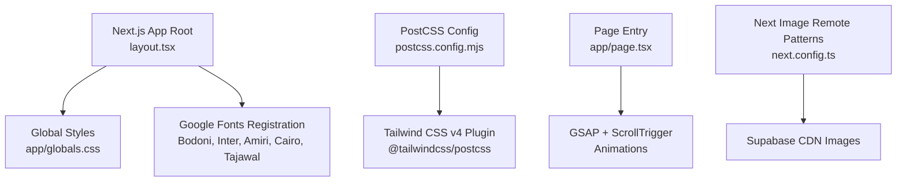
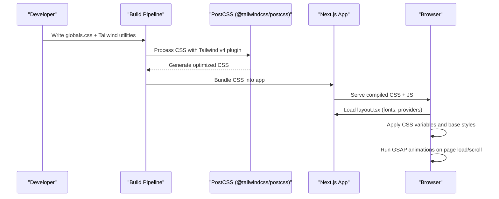
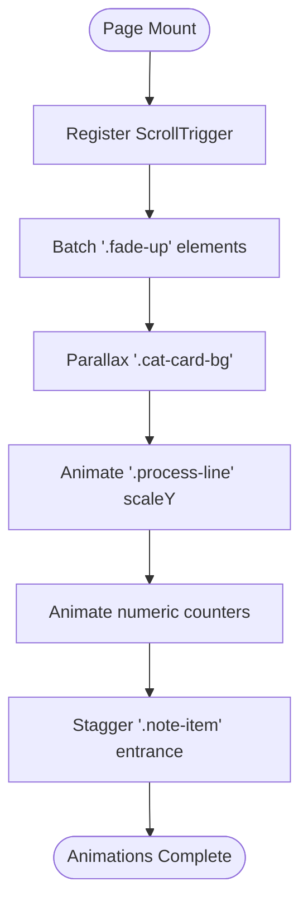
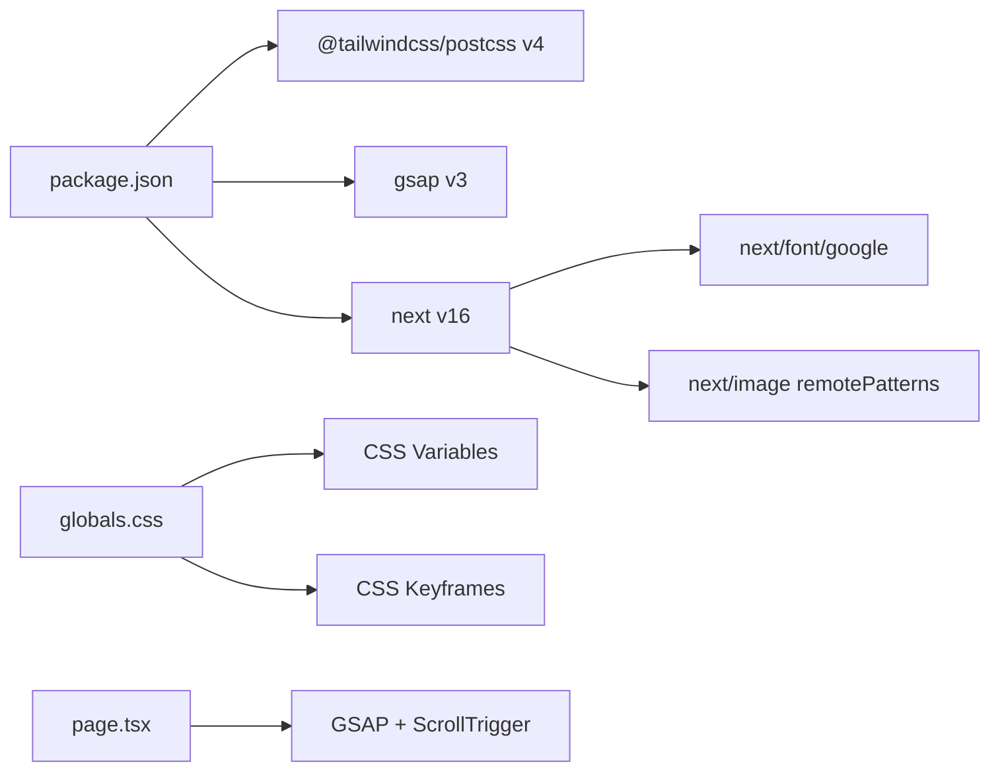

# Styling & Design System

<cite>
**Referenced Files in This Document**
- [globals.css](file://app/globals.css)
- [layout.tsx](file://app/layout.tsx)
- [postcss.config.mjs](file://postcss.config.mjs)
- [package.json](file://package.json)
- [page.tsx](file://app/page.tsx)
- [next.config.ts](file://next.config.ts)
</cite>

## Table of Contents
1. [Introduction](#introduction)
2. [Project Structure](#project-structure)
3. [Core Components](#core-components)
4. [Architecture Overview](#architecture-overview)
5. [Detailed Component Analysis](#detailed-component-analysis)
6. [Dependency Analysis](#dependency-analysis)
7. [Performance Considerations](#performance-considerations)
8. [Troubleshooting Guide](#troubleshooting-guide)
9. [Conclusion](#conclusion)
10. [Appendices](#appendices)

## Introduction
This document explains the styling and design system for the Nubia Perfume E-Commerce Platform. It covers Tailwind CSS v4 integration, global CSS structure, custom properties (design tokens), responsive patterns, animations with GSAP, RTL support for Arabic, font loading strategy, image optimization, and performance considerations for styling assets. The goal is to provide a clear guide for maintaining design consistency and building new components that align with the established system.

## Project Structure
The styling system is centered around:
- A single global stylesheet that defines design tokens, layout primitives, component styles, animations, and responsive rules.
- Next.js App Router root layout that registers Google Fonts via next/font and applies CSS variables to the HTML element.
- PostCSS configuration enabling Tailwind CSS v4 through its official PostCSS plugin.
- Runtime animation orchestration using GSAP and ScrollTrigger within page-level code.

**Diagram sources**
- [layout.tsx:1-81](file://app/layout.tsx#L1-L81)
- [globals.css:1-800](file://app/globals.css#L1-L800)
- [postcss.config.mjs:1-8](file://postcss.config.mjs#L1-L8)
- [page.tsx:1-120](file://app/page.tsx#L1-L120)
- [next.config.ts:1-15](file://next.config.ts#L1-L15)

**Section sources**
- [layout.tsx:1-81](file://app/layout.tsx#L1-L81)
- [globals.css:1-800](file://app/globals.css#L1-L800)
- [postcss.config.mjs:1-8](file://postcss.config.mjs#L1-L8)
- [page.tsx:1-120](file://app/page.tsx#L1-L120)
- [next.config.ts:1-15](file://next.config.ts#L1-L15)

## Core Components
- Global CSS tokens and base styles:
  - Color palette, typography variables, spacing/radius, shadows, transitions.
  - Base resets and body defaults.
  - Sectional styles for Navbar, Hero, Products, Story, Newsletter, Footer.
  - Dashboard UI styles and utility classes.
  - Animations and keyframes.
  - Responsive breakpoints and RTL overrides.
- Font loading:
  - Google Fonts loaded via next/font with variable names exposed as CSS variables.
  - Arabic fonts included for RTL contexts.
- Tailwind CSS v4:
  - Enabled via @tailwindcss/postcss in PostCSS config.
  - No explicit tailwind.config file; Tailwind v4 uses CSS-first configuration.
- GSAP animations:
  - Page-level setup registering ScrollTrigger.
  - Batched scroll reveals, parallax backgrounds, timeline-driven counters, and staggered note cards.

**Section sources**
- [globals.css:1-800](file://app/globals.css#L1-L800)
- [globals.css:801-1600](file://app/globals.css#L801-L1600)
- [layout.tsx:1-81](file://app/layout.tsx#L1-L81)
- [postcss.config.mjs:1-8](file://postcss.config.mjs#L1-L8)
- [package.json:1-29](file://package.json#L1-L29)
- [page.tsx:1-120](file://app/page.tsx#L1-L120)

## Architecture Overview
The styling architecture combines CSS custom properties for theming, Tailwind utilities for rapid composition, and GSAP for advanced motion. The flow from build-time to runtime is:

**Diagram sources**
- [postcss.config.mjs:1-8](file://postcss.config.mjs#L1-L8)
- [globals.css:1-800](file://app/globals.css#L1-L800)
- [layout.tsx:1-81](file://app/layout.tsx#L1-L81)
- [page.tsx:1-120](file://app/page.tsx#L1-L120)

## Detailed Component Analysis

### Global CSS Tokens and Themes
- Custom properties define brand colors (deep navy-black, midnight blues, champagne golds), typography stacks, radius, shadows, and transition timings.
- Typography variables are mapped to CSS variables injected by next/font, allowing dynamic font families per language and context.
- RTL overrides adjust font stacks and letter-spacing when html[lang="ar"] or dir="rtl" is present.

Key token categories:
- Colors: dark neutrals, gold accents, muted white.
- Typography: serif, sans, title stacks with fallbacks.
- Spacing/Radii: consistent border-radius tokens.
- Shadows: card and gold glow effects.
- Transitions: unified timing function and duration.

RTL behavior:
- When Arabic language or RTL direction is active, font stacks switch to Arabic-friendly typefaces and normalize letter-spacing.

**Section sources**
- [globals.css:16-47](file://app/globals.css#L16-L47)
- [globals.css:1376-1434](file://app/globals.css#L1376-L1434)

### Layout Primitives and Sections
- Shared section containers, tags, titles, subtitles, dividers.
- Product grid and card styles with hover overlays, badges, pricing, and ratings.
- Story split layout with image grids and stats.
- Newsletter form with focus states.
- Footer columns and links.

Responsive behavior:
- Breakpoints at 1024px and 768px adjust grids, paddings, and visibility of navigation elements.

**Section sources**
- [globals.css:374-800](file://app/globals.css#L374-L800)
- [globals.css:1343-1375](file://app/globals.css#L1343-L1375)

### Animation System (GSAP + CSS)
- CSS keyframes for fade-in-up and toast animations.
- GSAP registration of ScrollTrigger on client-side.
- Scroll-triggered batched reveals for .fade-up elements.
- Parallax background movement for category cards.
- Timeline-based line drawing for process sections.
- Animated counters with snapping.
- Staggered entrance for note items.

**Diagram sources**
- [page.tsx:16-115](file://app/page.tsx#L16-L115)
- [globals.css:808-822](file://app/globals.css#L808-L822)

**Section sources**
- [page.tsx:16-115](file://app/page.tsx#L16-L115)
- [globals.css:808-822](file://app/globals.css#L808-L822)

### Tailwind CSS v4 Integration
- Tailwind v4 is enabled via the PostCSS plugin without a traditional config file.
- Utilities can be used alongside custom CSS; the project primarily relies on custom selectors and CSS variables for branding while keeping Tailwind available for utility composition.

Guidelines:
- Prefer CSS variables for theme values (colors, radii, shadows).
- Use Tailwind utilities sparingly for layout and spacing where appropriate.
- Keep complex interactions and brand-specific visuals in globals.css for maintainability.

**Section sources**
- [postcss.config.mjs:1-8](file://postcss.config.mjs#L1-L8)
- [package.json:18-27](file://package.json#L18-L27)

### RTL Support for Arabic
- Language-aware font stacks swap to Arabic typefaces when html[lang="ar"] or dir="rtl".
- Letter-spacing normalization ensures readability across scripts.
- Direction control is applied inline on page wrapper based on language context.

Implementation notes:
- Ensure lang attribute and direction state are managed by the language provider.
- Avoid hard-coded left/right positioning; use logical properties or CSS variables where possible.

**Section sources**
- [globals.css:37-47](file://app/globals.css#L37-L47)
- [page.tsx:128](file://app/page.tsx#L128)

### Font Loading Strategy
- Fonts are loaded via next/font/google with display: swap to prevent FOIT.
- Variable names are attached to the HTML class list for CSS variable usage.
- Arabic subsets are included for Amiri, Cairo, and Tajawal.

Best practices:
- Keep subset lists minimal to reduce payload.
- Use variable fonts where available to reduce requests.
- Maintain consistent variable naming across layout and global styles.

**Section sources**
- [layout.tsx:12-42](file://app/layout.tsx#L12-L42)

### Image Optimization
- Next.js remotePatterns allow images from Supabase CDN.
- Use object-fit and aspect ratios in CSS to ensure consistent presentation.
- Prefer lazy-loading and responsive srcsets for large hero and product images.

**Section sources**
- [next.config.ts:3-12](file://next.config.ts#L3-L12)
- [globals.css:462-478](file://app/globals.css#L462-L478)

## Dependency Analysis
The styling stack depends on:
- Tailwind CSS v4 and its PostCSS plugin for utility generation.
- GSAP and ScrollTrigger for advanced animations.
- Next.js font loader for optimized font delivery.
- Next image optimization for remote images.

**Diagram sources**
- [package.json:11-27](file://package.json#L11-L27)
- [postcss.config.mjs:1-8](file://postcss.config.mjs#L1-L8)
- [page.tsx:16-115](file://app/page.tsx#L16-L115)
- [next.config.ts:3-12](file://next.config.ts#L3-L12)

**Section sources**
- [package.json:11-27](file://package.json#L11-L27)
- [postcss.config.mjs:1-8](file://postcss.config.mjs#L1-L8)
- [page.tsx:16-115](file://app/page.tsx#L16-L115)
- [next.config.ts:3-12](file://next.config.ts#L3-L12)

## Performance Considerations
- Minimize heavy backdrop-filter and box-shadow usage in hot paths; prefer GPU-accelerated transforms and opacity changes.
- Use will-change judiciously for animated elements to avoid memory overhead.
- Limit the number of concurrent GSAP timelines; reuse contexts and clean up listeners.
- Keep font subsets small and leverage variable fonts to reduce network requests.
- Optimize images: serve WebP/AVIF, set proper dimensions, and enable caching headers on the CDN.

[No sources needed since this section provides general guidance]

## Troubleshooting Guide
- Tailwind utilities not applying:
  - Verify @tailwindcss/postcss is configured and running during builds.
  - Ensure no conflicting custom CSS overrides higher specificity than intended.
- Fonts not swapping correctly:
  - Confirm variable names are appended to the HTML class list and referenced in CSS variables.
  - Check that subsets include required scripts (latin/arabic).
- GSAP animations not triggering:
  - Ensure ScrollTrigger is registered only on the client side.
  - Validate that target selectors exist before initializing animations.
- RTL misalignment:
  - Confirm html lang and dir attributes are updated by the language context.
  - Normalize letter-spacing and avoid hardcoded directional properties.

**Section sources**
- [postcss.config.mjs:1-8](file://postcss.config.mjs#L1-L8)
- [layout.tsx:12-42](file://app/layout.tsx#L12-L42)
- [page.tsx:16-115](file://app/page.tsx#L16-L115)
- [globals.css:37-47](file://app/globals.css#L37-L47)

## Conclusion
The Nubia Perfume platform’s design system centers on a robust set of CSS custom properties, a cohesive global stylesheet, and Tailwind v4 utilities for compositional flexibility. GSAP enhances user experience with performant, scroll-driven animations. With careful attention to font loading, image optimization, and RTL support, the system maintains visual consistency and accessibility across languages and devices.

[No sources needed since this section summarizes without analyzing specific files]

## Appendices

### Guidelines for Maintaining Design Consistency
- Use CSS variables for all brand tokens (colors, radii, shadows, transitions).
- Follow existing class naming conventions for sections and components.
- Keep animations subtle and purposeful; prefer transform and opacity.
- For new components, extend existing patterns rather than duplicating styles.

[No sources needed since this section provides general guidance]

### Creating Custom Components with Proper Styling
- Prefer semantic HTML and apply tokens via CSS variables.
- Reuse shared section and card patterns from globals.css.
- Integrate GSAP animations through page-level contexts to avoid duplication.
- Ensure RTL compatibility by avoiding hardcoded directions and using logical properties.

[No sources needed since this section provides general guidance]